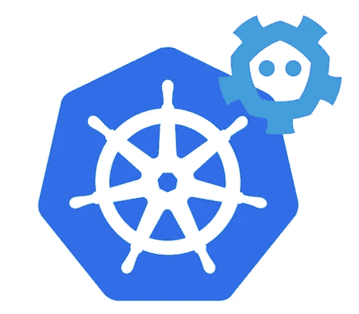
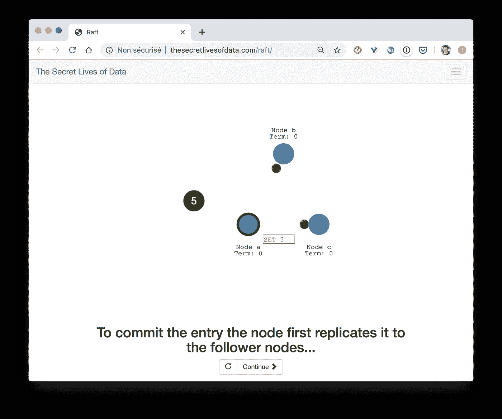
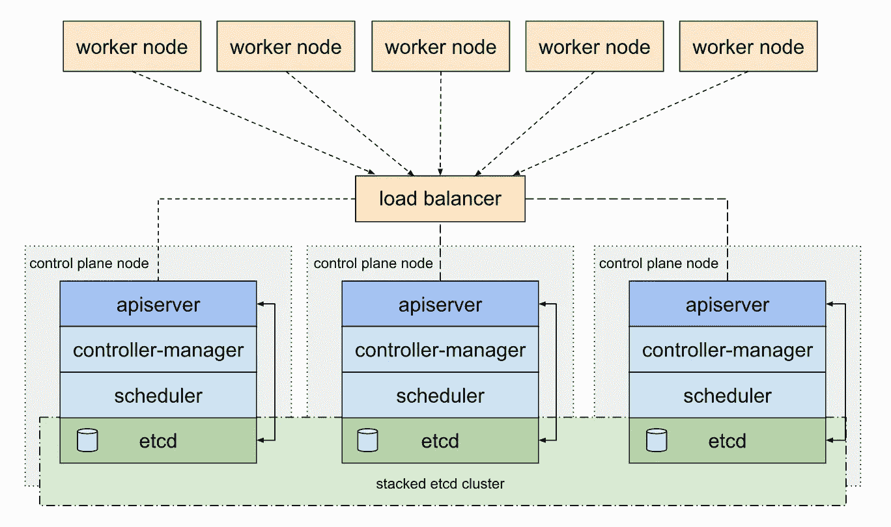
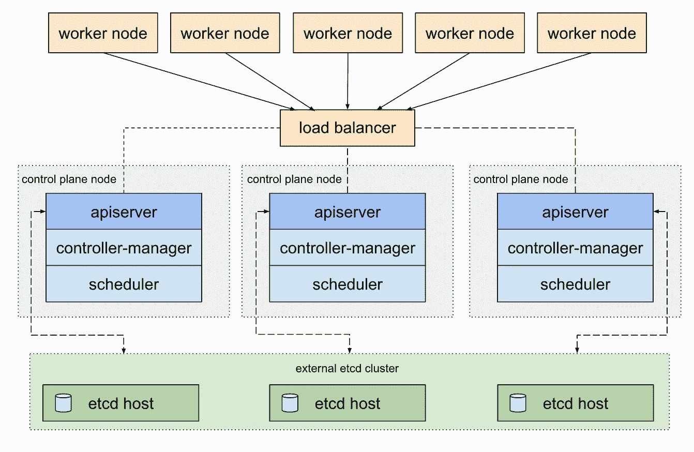
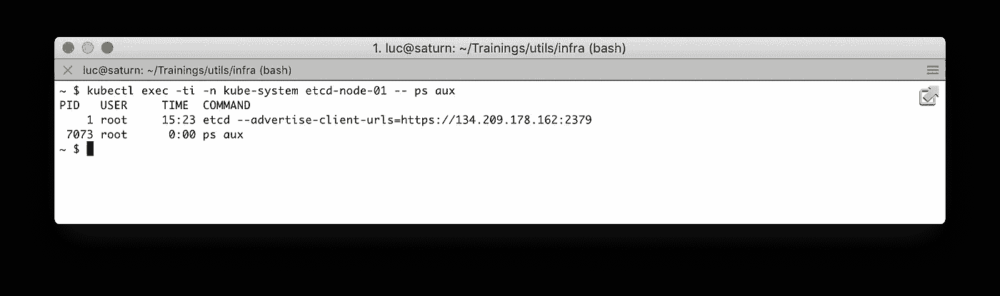
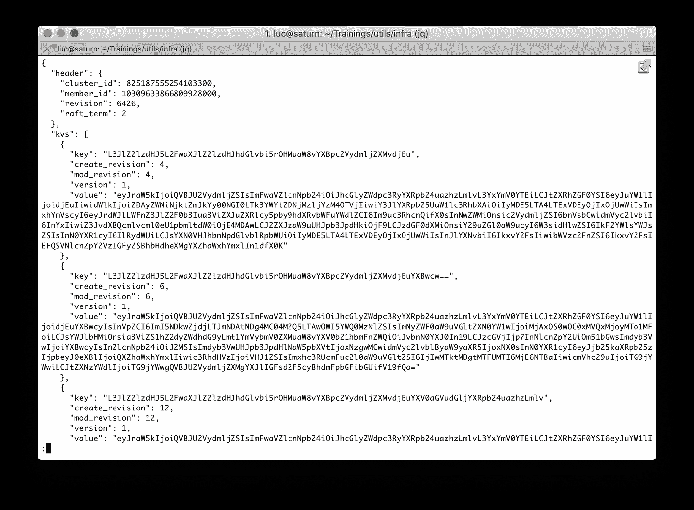
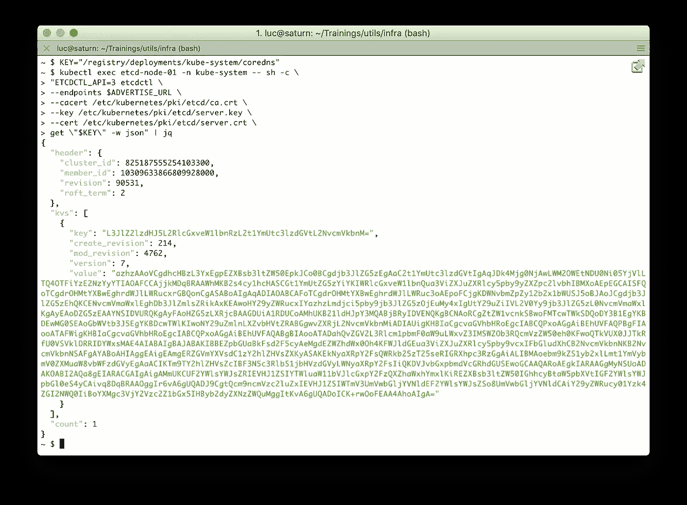
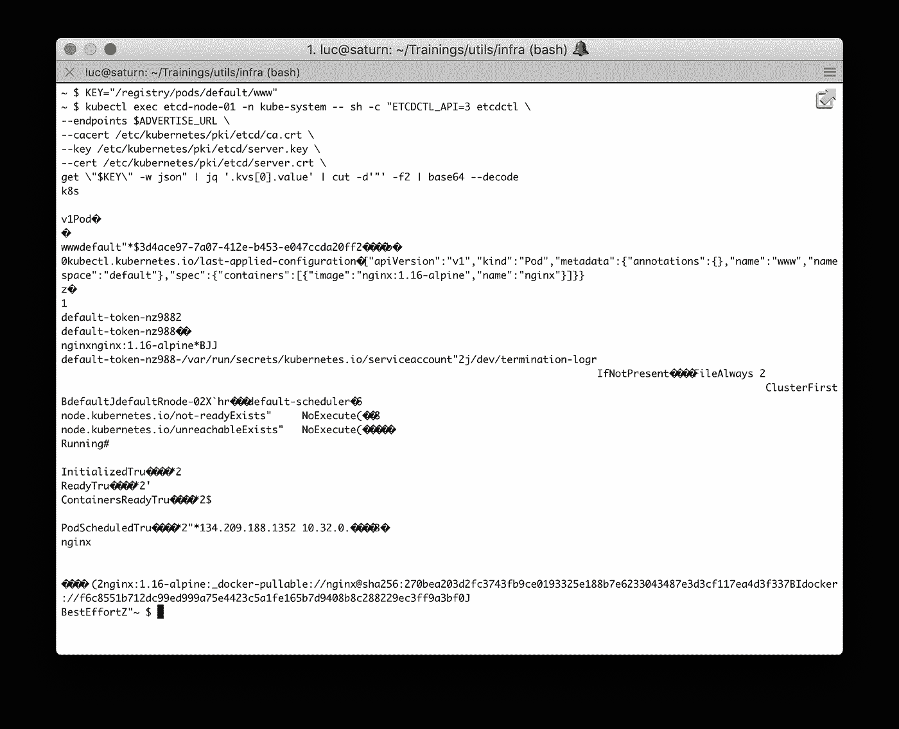

# 近距离观察 Etcd:Kubernetes 星团的大脑

> 原文：<https://betterprogramming.pub/a-closer-look-at-etcd-the-brain-of-a-kubernetes-cluster-788c8ea759a5>

## etcd 包含什么以及它如何组织信息



Etcd 是 Kubernetes 的一个关键组件，因为它存储了集群的整个状态:它的配置、规范和正在运行的工作负载的状态。在本文中，我们将揭开它的神秘面纱，以了解 etcd 是如何存储所有这些信息的。

# Etcd 简介

> Etcd 被定义为一个分布式的、可靠的键值存储，用于存储分布式系统中最关键的数据
> 
> — [https://etcd.io](https://etcd.io)

在 Kubernetes 世界中，etcd 被用作服务发现的后端，并存储集群的状态及其配置。

Etcd 被部署为一个集群，由几个节点组成，它们的通信由 Raft 算法处理。在生产环境中，一个群集包含奇数个节点，至少需要三个。在 http://thesecretlivesofdata.com/[你可以找到一个很棒的动画来解释这个算法是如何运行的，它展示了集群生命周期的几个阶段，其中包括:](http://thesecretlivesofdata.com/raft/)

*   领袖选举
*   日志复制



Raft 算法在[thesecretlivesofdata.com](http://thesecretlivesofdata.com/raft/)中解释

# Kubernetes 的 Etcd

在 Kubernetes 集群的上下文中，etcd 实例可以作为 Pods 部署在主服务器上(这是我们将在本文中使用的示例)。



部署在主节点上的 etcd(来源:Kubernetes 文档)

为了增加额外的安全性和弹性，它还可以作为外部集群进行部署。



作为外部集群部署的 etcd(来源:Kubernetes 文档)

下面的序列图来自 [Heptio](https://medium.com/u/c9196fe571a0?source=post_page-----788c8ea759a5--------------------------------) 的博客，展示了在一个简单的 Pod 创建过程中所涉及的组件。这是 API 服务器和 etcd 交互的一个很好的例子。


资料来源:blog.heptio.com

# Kubernetes 测试集群

在本文中，我们使用了一个 Kubernetes 集群，它有三个节点，是在 [DigitalOcean](https://digitalocean.com) 上用`kubeadm`创建的。选择的网络插件是`[weavenet](https://www.weave.works/docs/net/latest/kubernetes/kube-addon/)`。该集群有一个主节点也运行 etcd。这种配置不适合真实的 HA 集群，但足以探索存储在 etcd 中的数据。

```
**$ kubectl get nodes**
NAME    STATUS ROLES  AGE   VERSION
node-01 Ready  master 56m   v1.15.2
node-02 Ready  <none> 2m17  v1.15.2
node-03 Ready  <none> 2m17  v1.15.2
```

# Etcd Pod

首先，让我们列出集群中运行的所有 pod:

```
$ **kubectl get pods --all-namespaces**
NAMESPACE   NAME                           READY STATUS  RESTART AGE
kube-system coredns-5c98db65d4–5kjjv       1/1   Running 0       57m
kube-system coredns-5c98db65d4–88hkq       1/1   Running 0       57m
kube-system **etcd-node-01**                   1/1   Running 0       56m
kube-system kube-apiserver-node-01         1/1   Running 0       56m
kube-system kube-controller-manager-node-01 1/1  Running 0       56m
kube-system kube-proxy-7642v               1/1   Running 0       3m
kube-system kube-proxy-jsp4r               1/1   Running 0       3m
kube-system kube-proxy-xj8qm               1/1   Running 0       57m
kube-system kube-scheduler-node-01         1/1   Running 0       56m
kube-system weave-net-2hvbx                2/2   Running 0       87s
kube-system weave-net-5mrjl                2/2   Running 0       87s
kube-system weave-net-c76fx                2/2   Running 0       87s
```

因为集群刚刚被初始化，所以只有`kube-system`名称空间中的 Pods 在运行。这些单元负责集群的管理任务。我们感兴趣的 Pod 是`etcd-node-01`，它运行负责存储集群状态的 etcd 实例。

让我们首先在 etcd Pod 中运行一个 shell，并检查在其中运行的 etcd 容器的配置:



使用`--advertise-client-urls`标志的值，我们可以使用`etcdctl`实用程序获得所有现有的键/值对，并将它们保存在`etcd-kv.json` *中。*

```
$ ADVERTISE_URL="https://134.209.178.162:2379"$ kubectl exec etcd-node-01 -n kube-system -- sh -c \
"ETCDCTL_API=3 etcdctl \
--endpoints $ADVERTISE_URL \
--cacert /etc/kubernetes/pki/etcd/ca.crt \
--key /etc/kubernetes/pki/etcd/server.key \
--cert /etc/kubernetes/pki/etcd/server.crt \
get \"\" --prefix=true -w json" > etcd-kv.json
```

对该文件的快速检查显示了密钥列表及其对应的值，它们都是以 base64 编码的(这里只显示了文件的一个摘录)。



让我们首先以纯文本的形式获取所有的密钥，看看它们是什么样子的。我把所有的键都留在了下面的输出中，抱歉你需要滚动一下:)

设置组合仪表后，etcd 存储器中的可用钥匙

上面的结果显示了定义集群中所有资源的配置和状态的 342 个键:

*   节点(历史上它们被称为 Minion，因为我们在这里被提醒)
*   名称空间
*   服务帐户
*   角色和角色绑定，集群角色/集群角色绑定
*   配置映射
*   秘密
*   工作负载:部署、守护设备、单元等
*   群集的证书
*   每个 API 版本中的资源
*   使集群处于当前状态的事件

选择其中一个键后，我们可以使用以下命令获得相关的值:

```
$ kubectl exec etcd-node-01 -n kube-system —- sh -c \
"ETCDCTL_API=3 etcdctl \
--endpoints $ADVERTISE_URL \
--cacert /etc/kubernetes/pki/etcd/ca.crt \
--key /etc/kubernetes/pki/etcd/server.key \
--cert /etc/kubernetes/pki/etcd/server.crt \
get \"KEY\" -w json"
```

例如，让我们获取与键`/registry/deployments/kube-system/coredns`相关联的值:



如果我们解码与这个键相关联的值，那么返回的结果就不太可读，因为有些字符无法解释，但是当然，Kubernetes 知道如何正确地处理它们。


从这个结果中，我们可以推断出这个键用于存储管理`coredns`pod 的部署的规范和状态。

# Pod 的创建

让我们创建一个 Pod，并检查集群的状态是如何修改的，以及添加了哪些新键。

```
**$ cat <<EoF | kubectl apply -f -** apiVersion: v1
kind: Pod
metadata:
  name: www
spec:
  containers:
  - name: nginx
    image: nginx:1.16-alpine
**EoF**
```

使用与前面相同的命令，我们获得所有的密钥并将这个列表保存在`etcd-kv-after-nginx-pod.json`中。快速比较两个键列表，一个是在集群创建后检索的(`etcd-kv.json`)，另一个是在部署`www` Pod ( `etcd-kv-after-nginx-pod.json`)后检索的，显示了以下内容:

```
> /registry/events/default/www.15b9e3051648764f
> /registry/events/default/www.15b9e3056b8ce3f0
> /registry/events/default/www.15b9e306918312ea
> /registry/events/default/www.15b9e306a32beb6d
> /registry/events/default/www.15b9e306b5892b60
> /registry/pods/default/www
```

五个事件生成一个 Pod，这就说得通了。让我们仔细看看，从解码与事件键相关的值开始。按照时间顺序，我们可以看到它们与以下行动相关联:

*   成功分配`default/www to node-02`
*   拉动图像`“nginx:1.16-alpine`
*   成功提取图像`“nginx:1.16-alpine`
*   已创建的容器`nginx`
*   开始了`”Started container nginx`

这些事件列在描述 Pod 的命令的末尾:

```
$ kubectl describe pod www
```

最后一个键`*/registry/pods/default/www*`，提供与新创建的 Pod 相关的所有信息:

*   上次应用的配置
*   关联的令牌
*   它的状态
*   …



同样，特殊字符不能正确显示，但我们明白了。

# 摘要

本文的目的不是深入研究 etcd，而是稍微解释一下它包含的内容以及信息是如何组织的。这样做，我希望它看起来不像一个黑匣子。

更进一步，下面这篇文章展示了如何在一个牧场主的 RKE 集群上备份和恢复 etcd[https://medium . com/better-programming/kubernetes-tips-backup-and-restore-etcd-97 Fe 12 e 56 c 57](https://medium.com/better-programming/kubernetes-tips-backup-and-restore-etcd-97fe12e56c57)