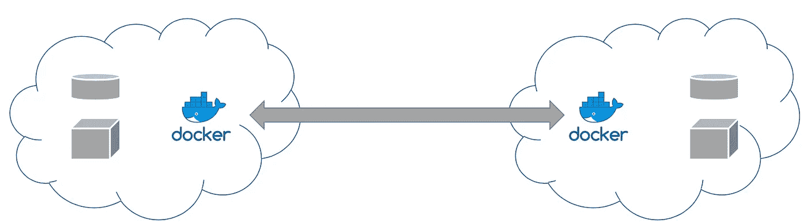

# 使用容器的 API 云数据迁移框架

> 原文：<https://betterprogramming.pub/a-cloud-data-migration-framework-on-apis-leveraging-containers-aa4495bcae29>

## 更好地迁移，更安全地迁移

图片来源:桑基特·纳伊克

随着我们从单个集群发展到跨越不同云提供商的多个集群，有时出于真正的需求，有时出于突发奇想，我们需要一种方法来跨集群移动客户及其相关数据或重新组织它们。我们评估了多种 ETL 解决方案，但是没有一种能够满足我们的需求，因为客户的数据分散在基于 SQL 和基于 NoSQL 的技术中。

慢慢地，但稳步地，我们开始意识到这项工作将是多么艰巨。这时我们意识到，我们必须在 API 级别解决这个问题，而不是在数据存储级别。随着我们进一步探索这个想法，我们开始花时间分析我们的应用程序部署结构，随着时间的推移，它已经从单块服务有机地发展到多个微服务，并随着我们的工作进行分区。这提供了一个独特的机会，也是一个挑战。

# 应用程序

每个应用程序(部署的逻辑单元)使用管理它的开发人员认为最适合他们需求的技术来管理它自己的数据。

每个应用程序:

*   管理自己的数据
*   最了解为每个客户存储了什么数据，并且是如何导出和接收数据的最佳判断者
*   负责管理数据的生命周期，因此最适合迁移数据

我们要求每个应用程序团队提出一个或多个 API，这些 API 可以分为以下几类:

*   用于数据转换的元数据 API
*   每个客户的导出数据
*   导入每个客户的数据

然后，我们将迁移过程分为以下几个阶段:

1.  迁移前
2.  出口
3.  获取元数据
4.  转换
5.  吸收
6.  确认
7.  迁移后
8.  清理

每个应用程序将负责挂钩到各自的阶段，负责定义处理故障的步骤和补偿步骤，并负责恢复迁移过程。

细心的读者应该已经注意到，这些迁移阶段将分布在不同的集群中，需要跨集群的数据访问来执行迁移过程。为此，我们决定使用 S3 自动气象站。

本质上，迁移过程是一个小型迁移**步骤**、**、**跨越**阶段**、**、**跨越不同**集群**(源和目的地)的编排，其中每个应用都对迁移过程有贡献。我们有**补偿步骤**在每一级关联，以便能够回滚我们的迁移过程。

一个`Step`将迁移过程中的一个逻辑步骤总结为一个特定的阶段。所有必要的参数都是上下文的一部分，上下文只不过是一个变量状态。下面的 Python 片段是一个步骤的代表性实现:

`StepExecutor`是步骤的容器，允许在正常步骤执行失败的情况下，关联步骤定义和补偿步骤。下面的 Python 片段是一个步骤执行器的代表性实现:

注意`rollback`旗。`Rollback`引入了标记，以便在默认回滚失败的情况下重试`rollback`。

对于以上部分，我们引入了一个目录，它允许轻松访问`Step` s。

有了这些基础部分，我们就能够提供一个通用框架，以分阶段的方式组织每个应用程序的数据迁移流程，更像是数据迁移的工作流。

为了说明这一点，下面是一个示例应用程序的示例数据迁移流程片段:

# 集装箱化

一旦创建了每个应用程序的数据迁移工作流，合乎逻辑的下一步就是在集群中部署这些工作流。我们选择了集装箱路线。

我们为每个应用程序创建了容器图像，这些图像被推送到注册中心。我们为数据迁移过程维护了一个 JSON 文件，其中每个应用程序都必须注册一个阶段，并指定映像名称和版本。为了便于说明，您可以在下面找到一个示例 JSON 文件:

有了 JSON 作业定义，我们所做的就是控制 Jenkins 作业的迁移过程，提供源集群、目的集群和客户 id 作为输入，加上一些其他的控制参数(为了简洁起见省略了)作为输入。

容器的选择使我们的清理过程变得简单，我们能够从 Jenkins 管理非常复杂的分布式编排，并能够回滚和重试迁移。

是的，作为 API 层迁移框架的明显缺点是它不能很快，不能处理大量数据。但它很好地满足了我们的需求，因为我们需要在不停止群集的情况下将客户从一个群集转移到另一个群集的能力，只需阻止正在迁移的特定客户即可。

感谢阅读！