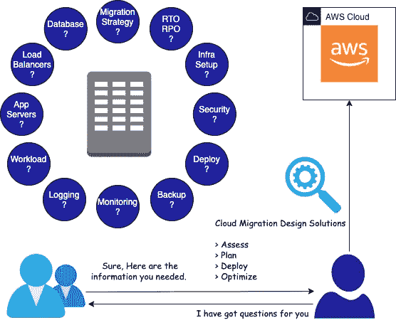

# 面向解决方案架构师的云迁移问卷

> 原文：<https://betterprogramming.pub/a-cloud-migration-questionnaire-for-solution-architects-dec7ffcf063e>

## 在将客户的内部工作负载迁移到 AWS 云之前，您必须向客户提出的问题

云迁移问卷。作者图片

# 语境

许多从自己的数据中心运营的公司开始将他们的应用程序迁移到云，这已经成为许多初创公司创建云原生应用程序的显而易见的选择。这是最重要的，因为除了云的许多其他好处之外，上市时间和成本效益也很快。

作为一名解决方案架构师，您需要提出相关的问题来从客户那里收集所需的信息。您根据客户提供的信息构建的解决方案为未来的设计解决方案和迁移奠定了基础。

# 范围

本文涵盖了您必须向客户提出的问题(及其背后的原因),因此在规划向云的迁移之前提出这些问题很重要。

我尝试了映射客户需求，以回应在迁移到 AWS 云时可以使用的主要 AWS 服务的问题。

# 您必须向客户提出的问题

此列表并不详尽，但足够通用，可应用于任何公共云迁移。

*   [为什么要迁移到云？](#28dc)
*   [作为迁移的一部分，你能承受多少代码变更？](#06f8)
*   [你用的是什么类型的数据库？](#edbe)
*   您正在使用什么类型的负载平衡器？
*   [您使用的是什么应用服务器和版本？](#69e0)
*   [你用的是什么操作系统？](#f325)
*   你的应用是面向公众的吗？
*   您的应用程序是有状态的还是无状态的？
*   你的应用程序容器化了吗？
*   [服务器当前的资源需求是什么？](#63e2)
*   你的工作量变化如何？
*   [您的日志记录和监控要求是什么？](#0b9e)
*   [您当前的备份策略是什么？](#ecab)
*   你如何构建、打包和部署你的应用程序？
*   您正在使用哪种类型的安全服务？
*   [您将应用程序配置的详细信息存储在哪里？](#e4fc)
*   [您如何管理您的基础设施？](#0054)
*   [您的 RTO 和 RPO 要求是什么？](#07af)

**注意:**通过仔细阅读所有这些问题，您会想到许多答案和可用的云迁移解决方案。如果没有，请在进一步阅读之前集思广益，找出可能的答案，这样会很有意义，你也能把它和你的解决方案联系起来。

# 为什么要迁移到云？

**可能的答案**

*   内部部署中的延迟或性能问题。
*   硬件老化、许可证到期或数据中心退出等问题。
*   难以在内部建立的托管服务需求。
*   需要设置高可用性应用程序。

**推理和解答**

通过询问这类相关问题，你可以了解他们的确切需求，并据此提供不同的解决方案。

*   设计 VPC 并与网络人员讨论他们的网络需求。
*   为他们的高可用性需求设计多 AZ 解决方案。
*   提供不同的托管服务，如社交网络、SQS、RDS 等。
*   将应用程序部署到离用户更近的区域，以减少延迟。
*   提供现场云连接解决方案，如站点到站点 VPN、AWS Direct。

## 作为迁移的一部分，您能承受多少代码更改？

**可能的答案**

*   没有代码更改
*   微小的配置更改
*   再开发

**推理和解答**

这个问题有助于我们确定迁移所涉及的工作、时间和成本。

我已经按照复杂性的顺序提到了不同的迁移策略。这意味着时间和成本将成比例增加，但它将提供更好的灵活性和优化机会。

每个迁移策略都与客户需求和可用于解决该问题的 AWS 服务相对应。

**六个 R 作为迁移策略**

1.  淘汰—取消配置不需要太多资源的传统系统。
2.  保留—由于法律/合规性问题，您可以保留部分本地服务。
3.  主机更换(提升和移位)—无代码更改—使用 AWS EC2，Elastic Beanstalk
4.  回购(放弃并购买)—放弃旧服务并回购第三方服务的许可证。
5.  Replatform (Lift、Tinker 和 Shift)——微小的配置更改——提供 RDS、Elasticache 等服务。
6.  重构/重新构建—重新开发—使用 SQS、SNS、SES、S3、Aurora、DynamoDB 等开发云原生应用。

## 您使用的是什么类型的数据库？

这个问题帮助您了解客户使用的特定数据库的特性，并将它们与云管理的服务进行比较，如 RDS、Aurora for Relational DB 以及 Elasticache 和 DynamoDB for NoSQL。

*   MsSQL 和 Oracle 与 RDS 有一些功能奇偶校验不匹配，不允许您使用托管数据库服务。
*   如果您需要访问底层数据库主机，那么 AWS 托管服务将不起作用。

所以在这些场景中，您可以在 EC2 实例上安装所需的 DB；否则，您可以直接使用 RDS 来迁移数据库工作负载。

此外，您可以使用许多其他 AWS 服务进行数据迁移，如 AWS DMS、AWS Snowball、AWS Snowmobile 等。

## 您正在使用什么类型的负载平衡器？

**可能的答案**

*   硬件负载平衡器
*   软件负载平衡器，如 HaProxy、Nginx

**推理与解答**

这有助于了解客户运行的工作负载类型以及负载平衡器的性能要求。

大多数本地运行的 web 应用程序使用运行在 L7 的硬件负载平衡器，以获得更大的灵活性和丰富的功能。

您可以针对他们的需求提供等效的 AWS 服务。

*   AWS ALB —应用程序负载平衡器在 L7 运行。最适合在应用程序级别路由流量的 web 应用程序。
*   AWS NLB —网络负载平衡器在 L4 运行。最适合实时高性能应用。

## 您使用的是什么应用服务器和版本？

同样，这个问题有助于了解您在内部使用的应用服务器和版本。它在云上的可用性有多兼容？

您可以使用 AWS Beanstalk 来部署 Java、Python、Ruby、Nodejs 应用程序，但是您在本地使用的版本可能不可用。或者，可能是您使用的版本太旧了，所以 Beanstalk 不支持它。在决定任何事情之前，做一个适当的评估。

## 你用的是什么操作系统？

您需要知道您的应用程序是否太旧，无法在最新的操作系统上运行。如果您已经将应用程序部署到最新的操作系统，那么它将有更多的机会在云上工作。

云上的大多数操作系统都包含许可成本，但是也有一些选项，您可以将现有的内部许可带到云上。

AWS 及其合作伙伴提供了许多免费和付费的 ami 来满足您的操作系统需求。

## 你的应用是面向公众的吗？

此问题帮助您集体讨论可能需要 DNS 解析、缓存、延迟、身份验证和安全性的不同解决方案的答案。

如果它是一个内部应用程序，这可能不是一个大问题，因为您可以将它部署在一个私有子网中，它会自动阻止外部流量。

了解当前如何使用 DNS 和 CDN，以及内部使用哪些防火墙和其他安全服务来阻止恶意流量以避免重大 DDOS 攻击非常重要。

对于面向公众的 web 应用程序，总是尽量使用托管服务，因为这种情况发生的可能性很小。

*   Route53 —为您的 web 应用程序提供公共 DNS 查询的高性能托管服务。
*   CloudFront —面向静态资源的低延迟高性能 CDN 网络，可降低面向公众的应用程序的整体延迟。如果您的客户跨地区分布，您可以在离客户更近的地区部署 CloudFront。
*   Cognito —让您使用 IAM 快速轻松地将用户注册、登录和访问控制添加到您的 web 和移动应用程序中。它可以扩展到数百万用户，并支持所有主要身份提供商的联合身份。
*   WAF — AWS web 应用防火墙。可以部署在负载平衡器、CloudFront 和 API 网关上。
*   API 网关——如果您正在将 API 分发给合作伙伴，并且希望使用 API 密钥、速率限制和使用计划进行快速测量。

## 您的应用程序是有状态的还是无状态的？

它带来了人们正在使用的许多反模式——比如在运行应用程序的物理机器上存储会话信息，或者在负载平衡器中启用粘性会话。

您可以提供 RDS、DynamoDB 或 Elasticache 来从外部存储会话。这样做将使应用程序真正无状态，这对扩展应用程序非常重要。

## 你的应用是容器化的吗？

> “容器化的应用程序比虚拟机需要更少的资源，并且在几秒钟内启动。容器将应用程序打包到一个共享主机操作系统的小型轻量级执行环境中。容器有助于隔离在同一主机操作系统中运行的不同微服务。
> 
> 容器化的应用程序可以使用像 Kubernetes 这样的编排平台进行部署，这有助于容器管理、应用程序部署和扩展，这已经成为云应用程序部署的标准。"

*   EC2，Elastic Beanstalk——部署非容器化的应用程序。
*   AWS ECS、AWS EKS —部署容器化应用程序。

## 服务器当前的资源需求是什么？

您可以获得本地工作负载的当前资源需求，然后使用它来映射到云资源。

您可以根据应用程序的性质使用内存和 CPU 优化的资源，但是没有公式可以正确计算。

您需要使用负载测试和监控性能进行多次迭代，以找出云中正确的资源需求。

*   AWS 应用程序发现服务—它有助于从您的本地服务器收集和呈现配置、使用和行为数据，以映射云上的容量。
*   AWS CloudWatch 指标—作为负载测试的一部分，使用它来监控您的应用程序指标。

## 你的工作量变化如何？

您需要询问客户观察到了多少流量变化，以及是否有任何特定的模式可用。

*   AWS ASG —自动扩展组帮助应用程序根据工作负载和模式动态扩展/缩小。
*   Elastic Beanstalk —自动配置 ASG，而不是手动配置。
*   ECS/EKS——如果您的应用程序是使用 Kubernetes 进行 dockerized 和 orchestrated 的，那么您可以使用 containers/pod 自动伸缩特性。

您可以配置不同的缩放行为，如简单缩放、目标和跟踪缩放以及步进缩放。

## 您的日志记录和监控要求是什么？

您需要了解不同类型的日志(如操作系统、数据库和应用程序日志)是如何存储在本地的。它们的保留期是多长？

应用程序将指标推送到监控管道，有时从日志中创建指标并推送到监控系统。

**可能的答案**

*   日志存储在运行应用程序的本地服务器上。
*   它们会在同一台服务器或其他备份服务器上轮换和归档。
*   然后，在配置的保留期过后，它们会被删除。
*   指标的保留期超过一年，以获取历史数据。

**推理与解答**

日志提供了关于正在发生的事情的更多信息，因此对于应用程序调试、审计和跟踪问题非常有帮助。

监控是可观察性平台的一个重要方面，它提供了关于应用程序健康状况的信息，以及它是如何执行的，以便在太晚之前采取纠正措施。

*   AWS CloudWatch 日志—将您的所有日志存储在 CloudWatch 日志中，然后您可以重定向到不同的日志记录解决方案，如 ELK、Splunk 或 S3。
*   AWS Athena —从 S3 加载日志并进行分析。
*   CloudWatch 警报—基于 Cloudwatch 日志上的搜索标准创建警报。
*   AWS S3 —设置 S3 生命周期规则，根据需求在 IA 层或 Glacier 中归档日志。
*   AWS CloudTrail —存储审计信息并重定向到 S3。
*   AWS X 射线—在基于微服务的应用中使用它们来跟踪请求和响应。
*   CloudWatch 代理—可以对应用程序进行检测以创建自定义指标，也可以从 Cloudwatch 日志中创建指标并推送到 Wavefront 或 Prometheus 等监控应用程序。

## 您当前的备份策略是什么？

**可能的答案**

*   脚本创建数据库的备份，并将其存储在备份服务器中。
*   发生灾难时，需要从备份中手动恢复数据库。
*   每小时、每天和每周进行备份。
*   保留期可能因数据类型而异。

**推理和解答**

备份在灾难恢复中扮演着非常重要的角色，因此您需要提前规划好备份策略，因为它会对您的客户和业务产生重大影响。

应用程序不应该在磁盘上存储任何东西，它们应该是无状态的，以便为应用程序及其数据制定有效的备份策略。

*   启用 RDS 备份的自动快照，有限保留 35 天。
*   创建具有无限保留期的手动快照的脚本。
*   当应用程序设置发生变化时，创建一个常规的 AMI。
*   使用一体化服务 AWS backup 解决所有与备份相关的需求。

## 您如何构建、打包和部署您的应用程序？

Jenkins 是构建和打包应用程序以满足 CI 需求的标准管道。人们可能使用不同的开源或定制工具来满足他们的 CI/CD 需求。

根据应用程序的类型和应用程序部署的环境，可以使用不同的部署策略，如蓝绿色、滚动和金丝雀部署。

您可以为所有 CI/CD 相关需求提供 AWS 代码管道、代码部署、代码构建、代码提交或 AWS ECR。这些彼此结合得很好。如果你想使用来自 Jenkins 的任何 AWS-native 服务，有许多 Jenkins 插件可用。

## 您正在使用哪种类型的安全服务？

您可以获得关于当前内部使用的安全服务的信息，如防火墙和其他客户第三方工具。

有许多等效的 AWS 服务提供。

*   AWS 警戒任务—监控和分析所有类型的日志；识别任何恶意 IP 地址或域。
*   AWS 配置—持续监控 AWS 资源配置，并对违规行为采取规定的反应措施。
*   AWS Shield —针对恶意 web 流量的 DDOS 防护服务。
*   AWS WAF —保护负载平衡器、CloudFront、API 网关后面的应用程序和 API，根据 IP 地址、请求来源、请求头和请求体阻止访问。

## 您将应用程序配置详细信息存储在哪里？

将特定于环境的配置存储在主应用程序中是一种反模式。每个环境可能有不同的秘密凭证，这些凭证应该针对应用程序的部署进行单独管理。

*   应用程序配置可以存储在一个私有的 git 存储库中。
*   AWS 参数存储可用于存储配置信息或秘密凭证。
*   如果需要轮换凭证，那么您可以使用 AWS Secret Manager 来存储凭证。

## 您如何管理您的基础架构？

**可能的答案**

*   自定义脚本以在内部调配虚拟机。
*   配置工具，如 Chef、Puppet 或 Ansible。

**推理与解答**

当开发人员必须在新的服务器上设置应用程序或者在高峰期扩展应用程序时，这是一件痛苦的事情。通常，Sysadmin 用于管理虚拟机或数据库配置等基础架构任务。如果开发人员能够解决他们的基础设施需求，会怎么样？那就是基础设施即代码(IaC)。

*   AWS Cloudformation 是提供基础设施资源的本地工具。
*   Terraform 是另一个与云无关的工具，可用于基础架构配置。

## 您的 RTO 和 RPO 要求是什么？

这个问题是最后一个，但是对于灾难恢复非常重要。

> RTO 定义了发生灾难时您可以承受的最长应用程序停机时间。如果定义的 RTO 是 30 分钟，那么对于下午 3 点发生的灾难，系统应该在下午 3:30 之前恢复
> 
> RPO 定义了在发生灾难时您可以承受的数据丢失量(以时间衡量)。如果定义的 RPO 为 10 分钟，那么对于下午 3 点发生的灾难，在恢复后，所有数据在下午 2:50 之前都应该可用

您可以根据与更好的 RTO 和 RPO 成比例的成本增长顺序，提供以下不同的灾难恢复解决方案。

*   备份和恢复—将备份存储在 S3，并从中恢复。
*   指示灯—保持应用程序的核心组件以低容量运行。
*   主动-被动—将完全运行的应用程序的缩减版本作为备用。
*   主动-主动—保持全功能应用程序在两个区域都接收流量。

客户可能会要求最佳的 RTO 和 RPO 解决方案，其成本各不相同，因此您应该向客户询问每种解决方案的相关成本。

# 结论

我讨论了许多重要的问题，以收集您在规划任何云迁移之前所需的信息。希望有用。

感谢阅读！