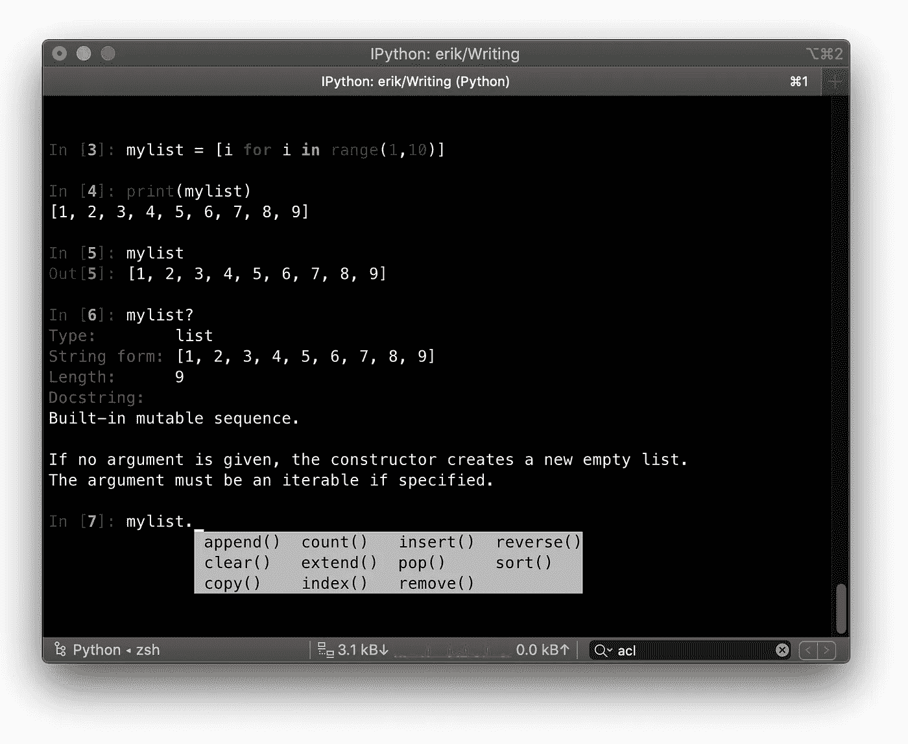

# 如何使用世界上最大的 Python 包集合

> 原文：<https://betterprogramming.pub/a-collection-of-python-packages-for-pythonistas-bc7601e654f9>

## 学习安装和使用 IPython、PyYAML、Requests 等等


照片由[丹尼尔·里卡洛斯](https://unsplash.com/@ricaros?utm_source=medium&utm_medium=referral)在 [Unsplash](https://unsplash.com?utm_source=medium&utm_medium=referral) 上拍摄

Python 最大的优势之一是大量免费的用户贡献包。Python 包可以在任何地方提供，但最常见的是发布在 [Python 包索引](https://pypi.org/)中。

Python 包索引，简称 PyPI，包含超过 27 万个包。让我们探索一些最常用的软件包，并了解如何使用一个名为 pip 的工具来安装它们。

# PyPI 上一些流行的 Python 包

只是为了体验一下可用的东西，这里有七个我个人喜欢并经常使用的包。

## 1.IPython



作者截图

[IPython](https://ipython.org/) 基本上就是一个增强版的 shell。仅仅为了自动完成，这是值得的，但是还有更多。我也喜欢它内置的所有神奇的命令。以下是一些例子:

*   `%cd` —改变当前工作目录
*   `%edit` —打开编辑器并在关闭编辑器后执行您键入的代码
*   `%env` —显示当前的环境变量
*   `%pip install [pkgs]` —不离开交互外壳安装软件包
*   `%time`和`%timeit` —为 Python 代码的执行计时

## 2.进步

你可以创建自己的进度条，这很有趣。但是使用[进度包](https://pypi.org/project/progress/)会更快。您可以轻松创建进度条:

以下动画演示了所有可用的进度类型:


Giorgos Verigakis 的动画来自 [progress](https://pypi.org/project/progress/)

## 3.加点颜色


乔纳森·哈特利截图来自 [Colorama](https://pypi.org/project/colorama/)

使用 [Colorama](https://pypi.org/project/colorama/) ，您可以为您的终端添加一些色彩。

## 4.dateutil

p [ython-dateutil](https://pypi.org/project/python-dateutil/) 模块为标准`datetime`模块提供了强大的扩展。安装时使用:

```
pip3 install python-dateutil
```

你可以用这个库做很多很酷的事情。我将把例子限制在我发现特别有用的这个例子上:从日志文件中模糊解析日期等等。

请记住:在常规 Python `datetime`功能结束的地方，python-dateutil 开始发挥作用！

## 5.使用 chardet 进行字符集检测

您可以使用 chardet 模块来检测文件的字符集。这在分析大量随机文本时非常有用。安装了 chardet 之后，您就有了一个额外的命令行工具 chardetect，它的用法如下:

```
chardetect somefile.txt
somefile.txt: ascii with confidence 1.0
```

当然，你也可以通过编程来使用这个库:查看文档。

## 6.要求

Requests 是我从网上获取任何信息的首选库。它让网络请求变得非常简单。

只是为了说明请求有多简单:

## 7.PyYAML

YAML 是一种数据序列化格式。它是为人类和计算机的可读性而设计的——对人类来说很容易读写，但计算机仍然可以解析它。


YAML 的例子，作者的图像

PyYAML 是 Python 的 YAML 解析器和发射器，这意味着它可以读写 YAML。它将向 YAML 写入任何 Python 对象:列表、字典，甚至是类实例。

我几乎在每个项目中都使用它来解析配置文件。Python 提供了自己的[配置解析器](https://docs.python.org/3/library/configparser.html)，但是与 Python 的`ConfigParser`的基本`.ini`文件结构相比，YAML 提供了更多。

例如，YAML 可以存储任何数据类型:`boolean` s、`list` s、`float` s 等等。会将所有内容存储为一个字符串。如果你想用`ConfigParser`装载一个整数，你需要明确地指定你想得到一个`int`:

`config.getint(“section”, “my_int”)`

`pyyaml`自动识别类型，因此这将返回您的`int`和`PyYAML`:

`config[“section”][“my_int”]`

YAML 还允许任意深度的树，不是每个项目都需要，但它可以派上用场。

# 安装 Python 包

这只是 PyPI 上的一个小选择。那么你是怎么得到这些东西的呢？

使用一个叫做 pip 的工具安装 PyPI 包很容易。Pip 通常与 Python 一起安装。用命令`pip`或`pip3`试试就行了。如果两者都出错，你也可以试试`python3 -m pip`或者从[安装文档](https://pip.pypa.io/en/stable/installing/)中安装。

一旦安装了 pip，就可以使用以下命令安装软件包:

`pip3 install <package name>`

要删除已安装的软件包，请使用:

`pip3 uninstall <package name>`

就这么简单！但是在你走之前请继续读下去，因为这种方法有一个问题。

# 解决版本冲突

如果您创建多个软件项目，您将在某一点上开始有版本冲突。例如，您去年参与的一个项目可能依赖于 requests 版本 2.19.0。但是，您的新项目需要一个只有在最新最好的版本 2.24.0 中才有的特性。

解决办法？您将请求升级到最新版本，却发现它破坏了您的旧项目。现在你可以做两件事:

*   升级旧项目的代码，引入额外的工作
*   以某种方式隔离两个项目，以便每个项目都有自己的请求版本

在大多数情况下，选择二是更可取的，因为你有有限的时间和最后期限。幸运的是，有多种方法可以解决这个问题。我将列出它们，从“我们不要这样做”到“最轻量级和有效的”:

1.  首先，你可以为每个项目使用一个单独的机器。
2.  更便宜的选择是使用**虚拟机**。
3.  一个更好的主意，事实上，现在被广泛使用的，是将你的项目 [**容器化**](https://medium.com/tech-explained/this-will-make-your-software-easier-to-build-run-and-distribute-1fe11ac5e1bc) 。
4.  然而，最轻量级的是使用虚拟环境。

我已经写了两篇关于虚拟环境和 pip 的文章，所以我建议您继续阅读这些文章:

[](https://medium.com/better-programming/stop-installing-python-packages-globally-use-virtual-environments-a31dee9fb2de) [## 停止全局安装 Python 包-使用虚拟环境

### 借助虚拟环境，您可以隔离您的软件并避免版本冲突

medium.com](https://medium.com/better-programming/stop-installing-python-packages-globally-use-virtual-environments-a31dee9fb2de) 

一旦理解了虚拟环境，就可以考虑使用 Pipenv。太棒了！

[](https://medium.com/better-programming/improve-your-python-package-management-with-pipenv-28093c007955) [## 使用 pipenv 改进您的 Python 包管理

### 有比使用 pip 和 virtualenv 更好的方法来管理您的软件包和虚拟环境

medium.com](https://medium.com/better-programming/improve-your-python-package-management-with-pipenv-28093c007955)