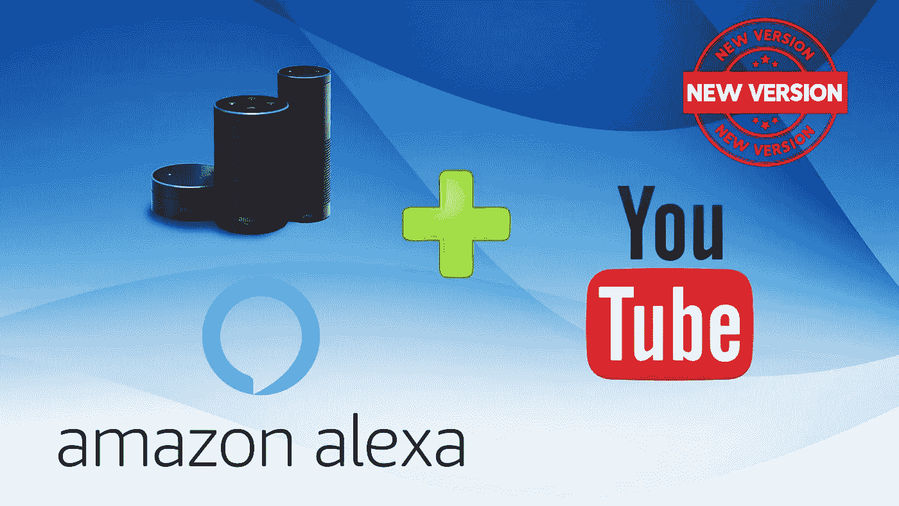
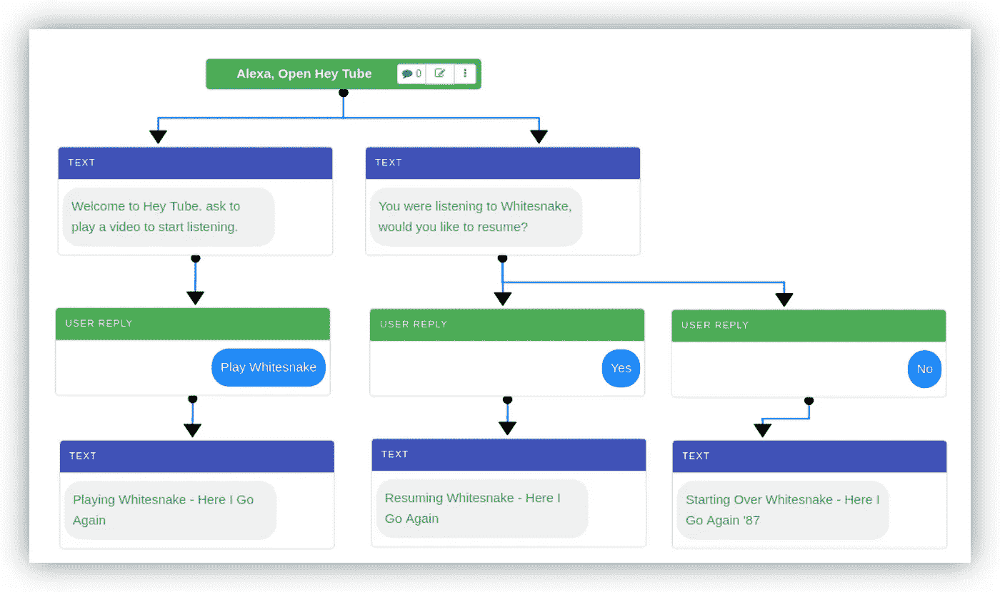
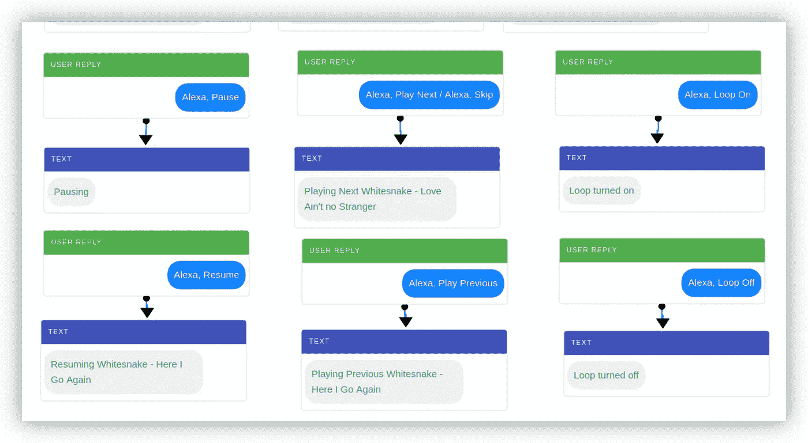
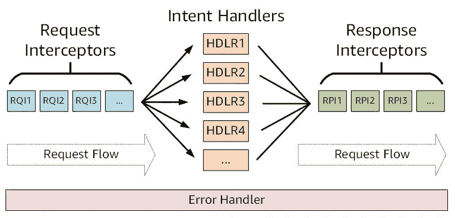
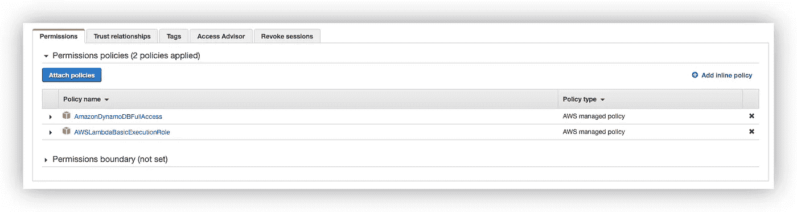
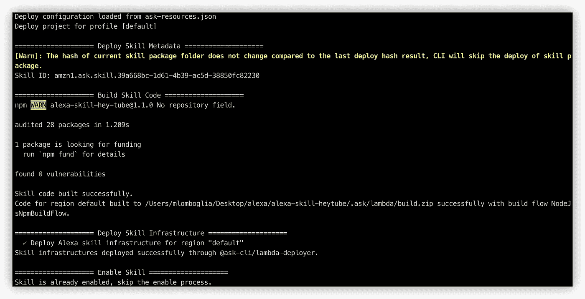
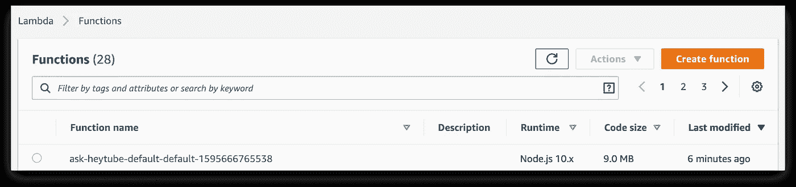
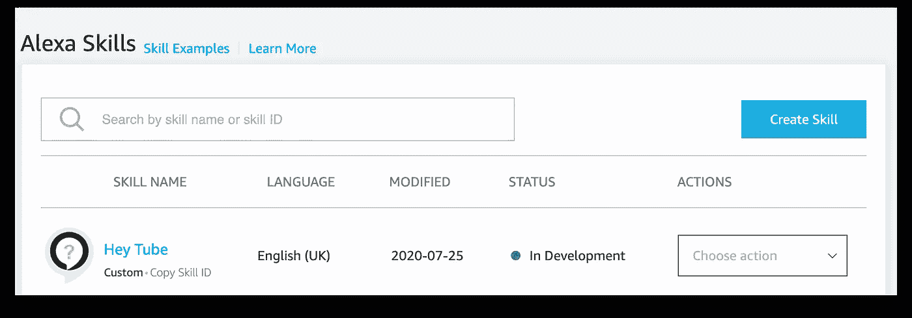
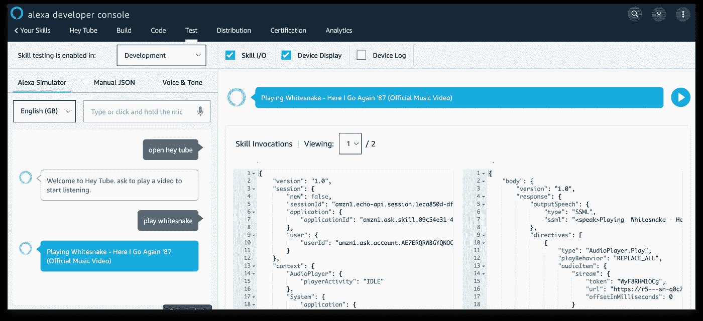
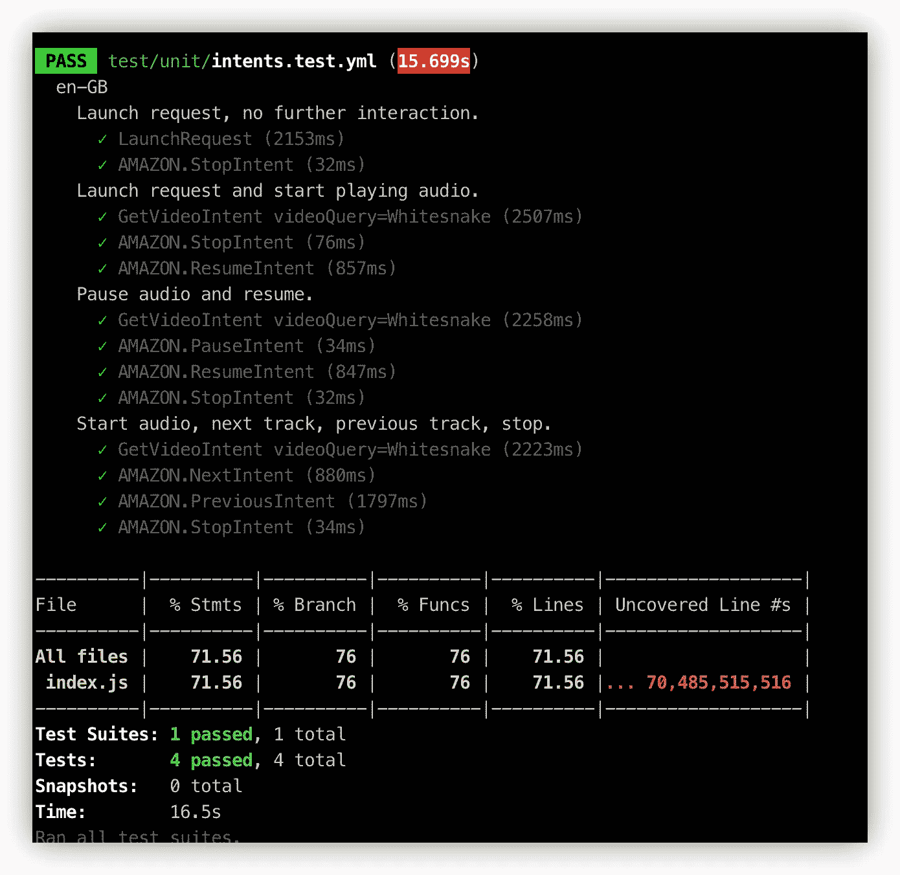

# 一个完整的 Alexa 技能，从 YouTube 视频播放多轨音频

> 原文：<https://betterprogramming.pub/a-complete-alexa-skill-to-play-multi-track-audio-from-youtube-videos-9518d5219aa>

## 从 YouTube 到您的 Alexa Echo 播放、暂停、继续、下一个、上一个和循环播放音频



# 介绍

在我之前的[文章](https://medium.com/better-programming/how-to-play-youtube-audio-from-your-alexa-e2d4fb8b5ce9)中，我创建了一个定制的 Alexa 技能，可以从 YouTube 视频中播放一个音轨到你的 Alexa Echo 中。在这篇文章中，我将展示如何将单音轨技能增强到一个完整的音频播放器，以播放、停止、恢复、跳过、循环和播放 YouTube 上的下一个相关音轨。

如果你还没有体验过这种单曲技巧，我建议你先阅读上一篇文章，然后再阅读这个增强版。

注意:记住这个技能不会在亚马逊商店发布，只能在开发模式下使用。这不是亚马逊认可的技能，只能用于教育目的。

在本文的结尾，您可以找到完整的源代码和测试脚本。

# 技能流

我将使用一个类似于单音轨技能的流程，为音频播放器控制添加状态管理和额外的意图。会话状态存储在 AWS DynamoDB 中，跟踪播放列表和设置，允许用户暂停、继续、向前跳、向后跳和启用循环。

这是要开发的自定义技能流程:

*   当技能启动时，它会检查是否已经有一个打开的会话。
*   如果有一个打开的会话，它将询问用户是否想要继续播放。
*   如果没有当前会话，它将播放欢迎消息，并期望视频查询名称来搜索音频文件。
*   用户可以随时要求播放视频。
*   YouTube 轨道音频将开始播放。
*   曲目结束时，将播放下一段相关音频。



Alexa 技能流程—欢迎

当音频播放时，用户可以给 Alexa 附加命令:

*   **暂停**音频**恢复**再次开始播放
*   **播放下一首**播放下一首相关音频，**播放上一首**播放上一首曲目
*   打开**循环打开**重复音频，关闭**循环关闭**禁用重复(默认选择)



Alexa 技能流程—音频播放器命令

# 我们开始吧

起点是上一篇文章中的单声道音频技巧。您可以克隆 git repo 或派生它。

请注意，我希望您已经按照上一篇文章中的描述设置了 AWS 帐户和环境。

# 交互模型

我将在交互模型文件中添加技能的新意图。

交互模型的名称为`<locale>.json`，例如`en-GB.json`

注意:我的 Alexa 配置的是 en-GB。根据您的配置更新您的文件名，例如 en-US 或其他。

打开`iteractionModels/en-GB.json`文件。与任何 JSON 文件一样，要密切注意格式。

添加音频技能所需的新意图:

*   `AMAZON.LoopOnIntent`
*   `AMAZON.LoopOffIntent`
*   `AMAZON.PreviousIntent`
*   `AMAZON.StartOverIntent`
*   `AMAZON.YesIntent`
*   `AMAZON.NoIntent`
*   `AMAZON.NextIntent`

```
 {
"name": "AMAZON.LoopOnIntent",
"slots": [],
"samples": []
},
{
"name": "AMAZON.LoopOffIntent",
"slots": [],
"samples": []
},
{
"name": "AMAZON.PreviousIntent",
"slots": [],
"samples": []
},
{
"name": "AMAZON.StartOverIntent",
"slots": [],
"samples": []
},
{
"name": "AMAZON.YesIntent",
"slots": [],
"samples": []
},
{
"name": "AMAZON.NoIntent",
"slots": [],
"samples": []
},
{
"name": "AMAZON.NextIntent",
"slots": [],
"samples": []
}
```

关于内置意图的其他信息可在此处找到:

[](https://developer.amazon.com/en-US/docs/alexa/custom-skills/standard-built-in-intents.html) [## tech doc-模板

### Alexa 内置设备开发带有 Alexa 语音服务的 Alexa 内置设备

developer.amazon.com](https://developer.amazon.com/en-US/docs/alexa/custom-skills/standard-built-in-intents.html) 

# 技能代码

现在我们准备在 Node.js 中发展我们的技能。

打开`lambda/index.js`。

## 属性管理

为了跟踪属性，我使用拦截器将回放信息和回放设置存储在 AWS DynamoDB 中。

使用 [ASK SDK](https://ask-sdk-for-nodejs.readthedocs.io/en/latest/) ，你可以很容易地将你的技能信息保存到 Amazon DynamoDB 中。您的技能可以回忆和更新这些信息。 [DynamoDB](https://aws.amazon.com/dynamodb/) 是一个无服务器的键值对和文档数据库。一旦您配置好它并建立了一个表，您就可以通过 SDK 轻松地在 DynamoDB 表中写入和读取信息。

## 请求和响应拦截器

ASK SDK 提供了请求和响应拦截器函数，这些函数在意图处理函数执行前后立即被处理。您可以使用这些拦截器函数来调用适用于多个传入请求或传出响应的公共逻辑。



来自 [Alexa 博客文章](https://developer.amazon.com/blogs/alexa/post/75ee61df-8365-44bb-b28f-e708000891ad/how-to-use-interceptors-to-simplify-handler-code-and-cache-product-and-purchase-information-in-monetized-alexa-skills)

## 保存和加载属性

**请求拦截器**在为传入请求选择的处理程序执行之前立即被调用。我使用响应拦截器来保存属性。

响应拦截器在所选请求处理程序执行后立即被调用。我使用一个请求拦截器来加载属性。

在`index.js`中创建以下方法。

如果用户第一次调用该技能，则会创建一个预置结构

加载和保存拦截器

## 连接到 DynamoDB

要从您的技能连接到 DynamoDB 表，请使用您的`SkillBuilder`上的`withTableName`函数指定您想要连接的表名。`withAutoCreateTable(true)`将确保表被创建。

```
const skillBuilder = Alexa.SkillBuilders.standard();exports.handler = skillBuilder
    .addRequestHandlers(
        // ... handlers below
    )
 .addRequestInterceptors(LoadPersistentAttributesRequestInterceptor)     .addResponseInterceptors(SavePersistentAttributesResponseInterceptor)
.addErrorHandlers(ErrorHandler)
.withAutoCreateTable(true)
.withTableName(constants.config.dynamoDBTableName)
.lambda();
```

## 常数

为了存储常量，在`lambda`文件夹中创建一个文件`constants.js` 。

为 YouTube 搜索服务添加技能 ID、DynamoDB 表名和分页大小。

项目文件夹中有技能 ID:`.ask/ask-states.json`

```
/* CONSTANTS */exports.config = {
    appId: "your app Id",
    dynamoDBTableName: "alexa-skill-heytube-playback",
    pageSize: 10
};
```

## 助手

让我们定义一些助手函数，使我们的代码在`index.js`中更加整洁。

*   `getPlaybackInfo`:从属性管理器返回回放信息
*   `getPlaybackSetting`:从属性管理器返回回放设置
*   `getToken`:返回用于播放音频的令牌
*   `getIndex`:音频播放列表的当前索引
*   `setNextIndex`:设置音频播放列表的下一个索引
*   `getOffsetMilliseconds`:返回当前音频的偏移量
*   `canThrowCard`:播放设备是否可以出牌

助手方法

## 意图处理程序

让我们编辑标准意图处理程序:

*   他的方法将处理我们技能的发射。

通过说来唤起:

> *“Alexa，打开嘿管”*

`Launch`方法检索回放信息，检查是否有打开的回放会话。如果有，它会询问用户是想继续播放还是从头开始播放。如果没有会话，它将为用户播放请求音轨的欢迎消息。

LaunchRequestHandler

*   `StartPlaybackHandler` : 该方法将启动处理 YouTube 视频搜索的回放。它接收视频查询并调用控制器助手进行搜索。控制器使代码更加简洁，下面将进一步描述。

通过说来唤起:

> *《Alexa，打白蛇》*
> 
> “Alexa，问嘿管玩白蛇”

开始播放处理程序

*   `YesIntentHandler`和`NoIntentHandler` : `Yes`和`No`处理程序将管理来自欢迎消息的响应。

如果`Yes`，Alexa 将从属性管理器中存储的偏移量开始恢复播放音频。

如果`No`，Alexa 将重新开始音频，将偏移重置为零。

是和否意图处理程序

*   `ResumePlaybackIntentHandler` **:** 从存储在属性管理器中的偏移量开始恢复播放音频。
*   `StartOverPlaybackIntentHandler` **:** 重新开始播放同一首音轨。

通过在音频播放期间说出以下内容来调用:

> “Alexa，继续玩”
> 
> Alexa，从音频开始

恢复并重新开始意图处理程序

*   `NextPlaybackIntentHandler` **:** 播放播放列表中存储的下一个相关音频。
*   `PreviousPlaybackIntentHandler`:播放播放列表的上一段音频。

通过在音频播放期间说出以下内容来调用:

> " Alexa，下一个玩"
> 
> Alexa，播放上一个

下一个和上一个意图处理程序

*   `HelpIntentHandler` **:** 播放帮助音频信息。
*   `PauseAndStopIntentHandler`:暂停/停止播放音频。

通过在音频播放期间说出以下内容来调用:

> “阿利克夏，帮帮我”
> 
> “Alexa，暂停”或“Alexa，停止”

帮助和暂停意图处理程序

*   `LoopOnIntentHandler` **:** 启用循环功能重复音轨。
*   `LoopOffIntentHandler`:禁用循环功能，重复播放音轨。

循环标志是存储在回放设置中的布尔值。处理程序会将其设置为`true`或`false`。

通过在音频播放期间说出以下内容来调用:

> Alexa，循环播放
> 
> Alexa，循环关闭

循环打开和循环关闭意图处理程序

## 处理音频播放器事件

Alexa 语音服务(AVS)包括一个[音频播放器接口](https://developer.amazon.com/en-US/docs/alexa/alexa-voice-service/audioplayer.html)，用于管理、控制和报告流媒体音频内容。

当播放开始时，你的设备会向 Alexa 发送一系列生命周期事件。这些事件通知 Alexa 播放已经开始，请求下一个流，并向 AVS 和音乐服务提供商提供进度报告信息。

我将为以下与我们的技能相关的事件添加一个处理程序:

*   `PlaybackStarted`:回放开始时，设备向 AVS 发送一个`[PlaybackStarted](https://developer.amazon.com/en-US/docs/alexa/alexa-voice-service/audioplayer.html#playbackstarted)`事件。
*   `PlaybackNearlyFinished`:当您的设备准备好缓冲/下载播放队列中的下一个流时，发送`[PlaybackNearlyFinished](https://developer.amazon.com/en-US/docs/alexa/alexa-voice-service/audioplayer.html#playbacknearlyfinished)`事件。
*   `PlaybackFinished`:当你的设备播放完一个流时，发送`[PlaybackFinished](https://developer.amazon.com/en-US/docs/alexa/alexa-voice-service/audioplayer.html#playbackfinished)`事件。
*   `PlaybackStopped`:如果你的设备收到`Stop`指令并停止播放，发送`[PlaybackStopped](https://developer.amazon.com/en-US/docs/alexa/alexa-voice-service/audioplayer.html#playbackstopped)`事件。
*   `PlaybackFailed`:如果回放流出错，发送`[PlaybackFailed](https://developer.amazon.com/en-US/docs/alexa/alexa-voice-service/audioplayer.html#playbackstopped)`事件。

AudioPlayerEventHandler

## 控制器

控制器由处理程序调用，将执行搜索、播放、停止、播放下一个和播放上一个的操作。

每个动作将设置适当的属性，并向 Alexa 设备提供响应指令。

控制器

## YouTube 界面

为了与 YouTube APIs 接口，我使用了 npm 中的两个库。

**搜索**

为了搜索 YouTube 视频，我正在使用 npm 包`[yt](https://www.npmjs.com/package/youtube-search)-list`。

让我们安装它。在你的 lambda 文件夹中，输入`$ npm i --save yt-list`。

在文件顶部添加导入:

`const ytlist = require("yt-list");`

**播放音频**

为了播放音频流，我使用了另一个 npm 包，`[ytdl-core](https://www.npmjs.com/package/ytdl-core)`。让我们安装它。

在你的 lambda 文件夹中，输入`$ npm i --save ytdl-core`。

在文件顶部添加导入:

`const ytdl = require("ytdl-core");`

两种方法如下:

从 YouTube 搜索并获取音频

Alexa 音频需要低质量，所以需要音频格式。

## 技能建设者

最后，让我们向`SkillBuild`添加请求处理程序、拦截器、错误处理程序和 lambda 表创建。

技能生成器是您技能的入口点，路由所有请求和响应:

技能建设者

代码完成！现在让我们部署和测试技能。


# 发挥你的技能

使用 ASK CLI 快速部署您的技能，而无需进入控制台。

去你的技能文件夹根，输入:`$ ask deploy`。

## 向 lambda 函数添加 DynamoDB 权限

部署后，您需要将 DynamoDB 权限添加到为执行您的函数而创建的 IAM 角色中:

*   连接到 AWS 控制台。
*   转到 IAM 部分。
*   选择为执行 lambda 函数而创建的角色(如果没有更改默认名称，该角色将被命名为“ask-lambda-HeyTube”)。
*   单击附加策略。
*   找到并选择“AmazonDynamoDBFullAccessPolicy”角色，然后单击“附加策略”。



IAM —附加 DynamoDB 策略

附加 DynamoDB 策略后，进入你的技能文件夹根目录，再次输入`$ ask deploy`。

这一次您的部署应该会成功。



询问部署

如果你的技能没有被部署，请参阅我以前的文章，在这篇文章中，我有一些与部署你的技能相关的常见问题。

验证您的部署:

*   登录 AWS 控制台→ Lambda

在创建 lambda 函数时验证您的新技能。



登录到 Alexa 开发者控制台，验证你的新技能已经创建。可以点击查看详情，但我不建议通过控制台编辑任何字段。



# 上次配置

如果您还没有这样做:

*   添加您的环境变量，`YOUTUBE_API_KEY`，，其值是 Google developers 控制台中的键。
*   在基本设置中将您的服务超时增加到 15 秒。

详细内容包含在我之前的文章中。

# 测试你的技能

要从命令行测试您的技能，运行`ask dialog`并指定您的技能所支持的语言环境:

```
$ ask dialog --locale en-GB
```

要从命令行测试您的技能，运行`ask dialog`并指定您的技能支持的语言环境:

```
$ ask dialog --locale en-GB
```

该命令打开一个交互式终端，您可以在其中模拟与 Alexa 的多回合对话:


打开你的技能，模拟一个对话:

```
**User  > Alexa open hey tube**
Alexa > Welcome to Hey Tube. ask to play a video to start listening.
**User  > play Whitesnake** Alexa > Playing  Whitesnake - Here I Go Again '87 (Official Music Video)
**User  > .quit**
```

第一项测试已经完成。如果你有一个 Alexa 设备，你可以在你的 Alexa 中测试这段对话——你应该会得到相同的结果，并听到白蛇乐队的一首很棒的歌。

你可以对你的技能做任何改变并重新部署。

您可以通过使用一个预格式化的`.json`文件来自动重放，以节省测试时间。

使用`.record`创建一个可重复的 JSON 测试文件:

```
User  > .record
```

我创造了`happyPath.json`作为例子:

```
$ ask dialog --locale en-GB --replay happyPath.json
```

你也可以通过 Alexa 开发者控制台进行测试:



## 预约测试

我还包括了一些预定的测试。

根据其[网站](https://bespoken.io/#:~:text=Bespoken%20is%20the%20world%20leader,saving%20you%20time%20and%20money)的说法，“Bespoken 是人工智能驱动的语音和聊天体验测试、培训和监控领域的世界领导者。”

[](https://bespoken.io/) [## Bespoken |用于测试和监控语音应用的工具和资源

### WE CAN Bespoken 是人工智能驱动的语音和聊天体验测试、培训和监控领域的全球领导者。我们…

bespoken.io](https://bespoken.io/) 

如果您还没有，请先安装它:

```
npm install bespoken-tools -g
```

在此处完成设置说明:

[](https://read.bespoken.io/unit-testing/getting-started/#setup) [## 开始|预订文档

### 用 Bespoken 对你的 Alexa 技能和谷歌动作进行单元测试很容易。这是正在运行的测试的样本…

read.bespoken.io](https://read.bespoken.io/unit-testing/getting-started/#setup) 

在您的根文件夹中:

```
$ bst test
```

它将运行列在`test/intents.test.yml`文件夹中的意图:



预约测试的输出

## Echosim 测试

另一个测试选项是使用 Echoism Alexa 模拟器。连接您的帐户并测试您的技能。

[](https://echosim.io/) [## Alexa 技能测试工具

### Echosim.io 是一个面向开发人员的在线社区工具，它模拟了 Amazon Echo 的外观和感觉。

echosim.io](https://echosim.io/) 

# 完整的源代码

完整的源代码可以在我的 GitHub 中找到:

[](https://github.com/mlomboglia/alexa-skill-heytube) [## 姆隆波利亚/阿莱克莎-斯奇尔-海图

### 建立一个 Alexa 技能来播放 YouTube 视频中的音频完整说明可在我的媒体帖子中找到:如何播放…

github.com](https://github.com/mlomboglia/alexa-skill-heytube) 

# 参考

[](https://github.com/alexa/skill-sample-nodejs-audio-player) [## Alexa/技能-样本-节点-音频-播放器

### 这个项目演示了使用 Alexa 音频播放器的技能。多流文件夹包含一个示例技能…

github.com](https://github.com/alexa/skill-sample-nodejs-audio-player) 

# 可能的改进

以下是这项技能未来可能的改进:

*   改进了失败的 YouTube 音频的错误处理
*   处理 YouTube 播放列表
*   处理私人音频
*   亚马逊 Echo Show 设备的显示处理

编码快乐！