# CSS Flexbox 完全指南

> 原文：<https://betterprogramming.pub/a-complete-guide-css-flex-box-24f4a9a1e02>

## 使用 Flexbox 设计页面所需的一切


[Olga O](https://unsplash.com/@olga_o?utm_source=unsplash&utm_medium=referral&utm_content=creditCopyText) 在 [Unsplash](https://unsplash.com/s/photos/layout?utm_source=unsplash&utm_medium=referral&utm_content=creditCopyText) 上的照片。

CSS flexbox 是一种一维布局模式，可以轻松设计灵活有效的布局。在给定的容器 flex 布局中，分隔项目之间的空间并控制它们的对齐方式。它还提供了很大的灵活性。使用 flexbox，我们可以从左到右、从上到下组织项目，同时控制容器中项目的间距和顺序。

# 它是如何工作的？

在 flexbox 中，主要有两个实体:父容器(flex 容器)和直接子元素(flex 项目)。

我们还必须处理轴:主轴和 cors 轴。默认情况下，主轴从左到右，而 cors 轴垂直于主轴，从上到下。

# 父容器属性

以下是可应用于 flex 父容器的一些属性:

*   `display`
*   `flex-direction`
*   `flex-wrap`
*   `flex-flow`
*   `justified-content`
*   `align-items`
*   `align-content`

## 不带 Flexbox

```
<div class="box">
    <div class="box-item">1</div>
    <div class="box-item">2</div>
    <div class="box-item">3</div>
</div>
```

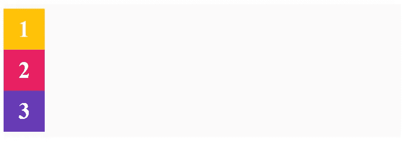

输出

# 显示

首先，我们有`display`属性。这就是定义 flex 容器的内容，并且在使用 Flexbox 时是强制性的。

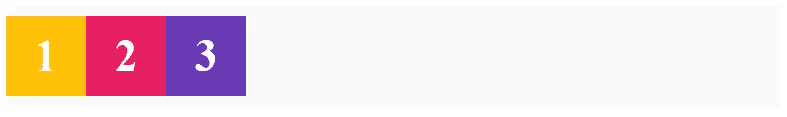

输出

# 弯曲方向

接下来是`flex-direction`，它定义了 flex 项目在容器中放置的方向。改变`flex-direction`属性的值允许我们改变项目的方式。`flex-direction`可以接受四个值之一:

*   `row`
*   `row-reverse`
*   `column`
*   `column-reverse`

## 弯曲方向:行

第一个值是一行，它是`flex-direction`的默认值。默认情况下，它不会进行任何更改。它从左到右放在主轴上。


输出

## 弯曲方向:行反转

这会将主访问方向设定为从右到左，从而导致伸缩项从右到左放置。在下面的示例中，您可以看到项目现在以相反的顺序放置。项目 1 放在右边:

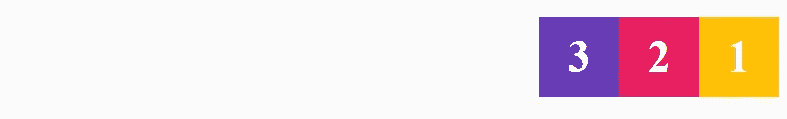

输出

## 伸缩方向:列

当您将`flex-direction`设置为`column`时，主轴从上到下，因此项目现在堆叠在彼此之上:

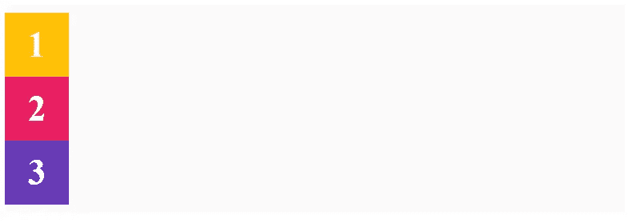

输出

## 弯曲方向:列-反向

我们还有`column-reverse`，它以相反的顺序堆叠项目。看看下面的例子。您可以看到项目 1 在底部，项目 3 在顶部:

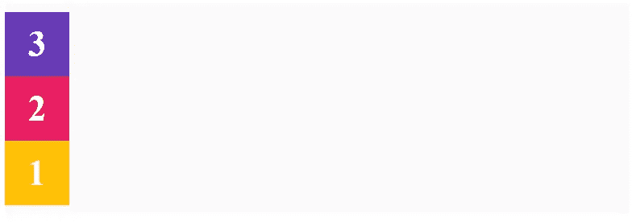

输出

# 柔性包装

`flex-wrap`用于控制容器内物品的包装。如果我们减小浏览器的宽度，我们会丢失浏览器宽度的一些项目。行为随着`flex-wrap` 属性而改变。它可以接受三个可能的值:

*   `nowrap`(默认值)
*   `wrap`
*   `wrap-reverse`

## 柔性包装:nowrap

这是`flex-wrap`属性的默认值。如果将属性值设置为`nowrap`，则没有任何变化。

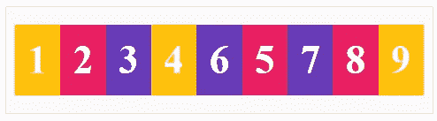

输出

## 柔性包装:包装

当您将`flex-wrap`属性设置为`wrap`时，您减少了项目在容器中的浏览器宽度:

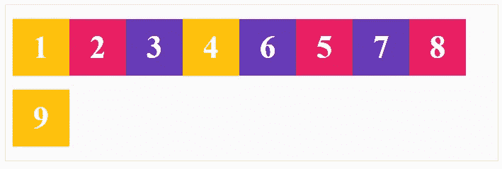

输出

## 柔性缠绕:缠绕-反向

不是物品掉到下面一排，而是爬进上面一排。换行总是从最后一个项目开始。`wrap-reverse`将最后一项推到上方，而不是下方:


输出

# 柔性流

`flex-flow`是`flex-direction`和`flex-wrap`组合的简称。在`flex-flow`中，`firstValue`为`flex-direction`而`secondValue`为`flex-wrap`。

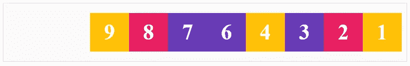

输出

# 两端对齐内容

`justified-content`定义项目沿主轴的对齐方式。`justified-content`属性有六个可能的值:

*   `flex-start`
*   `flex-end`
*   `center`
*   `space-between`
*   `space-around`
*   `space-evenly`

## 两端对齐内容:弹性开始

将该值设置为`flex-start`会将伸缩项放置在主轴的起点，也称为主起点。`flex-start`是该属性中的默认值。

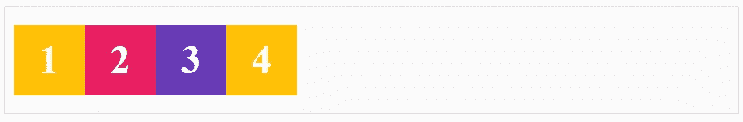

输出

## 两端对齐-内容:柔性结尾

这将使要放置在主轴末端的项目对齐:

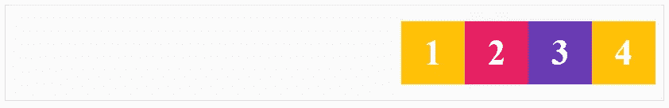

输出

## 两端对齐-内容:居中

`center`值将所有内容在主轴中心对齐:


输出

## 两端对齐-内容:间距

此值有助于平均分割额外空间，并将其添加到弹性项目之间:

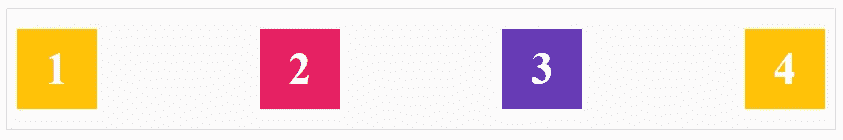

输出

## 两端对齐-内容:空格环绕

该值在开头和结尾分割额外的空格。所讨论的空间等于弹性项目之间的空间的一半:

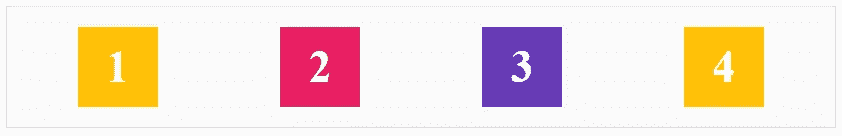

输出

## 两端对齐-内容:间距均匀

该值分配容器中的额外空间:

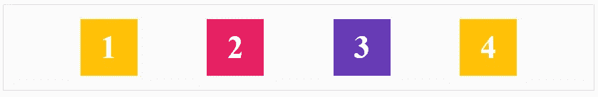

输出

# 对齐-项目

`align-items`属性定义了伸缩项如何沿横轴布局。

*   `align-items: stretch`
*   `align-items: flex-start`
*   `align-items: flex-end`
*   `align-items: center`
*   `align-items: baseline`

## 对齐-项目:拉伸

这些项目拉伸横轴的整个长度，`stretch`是默认值:

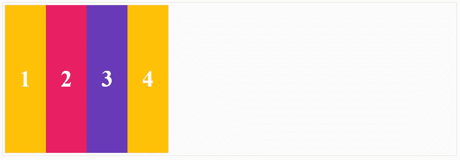

## 对齐项目:弹性开始

这是横轴的起点。横轴从上到下流动。该项目不会拉伸，并与线条的十字起点对齐:

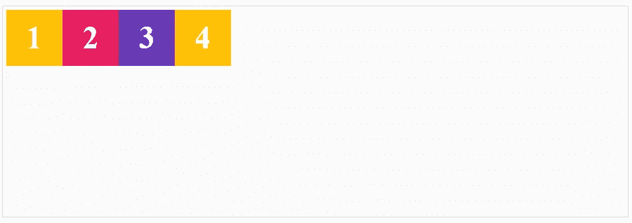

## 对齐-项目:柔性端

该值将项目推到横轴的末端:

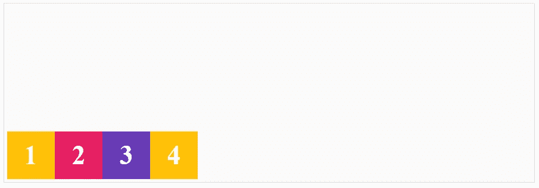

## 对齐-项目:居中

这将使内容沿横轴居中:

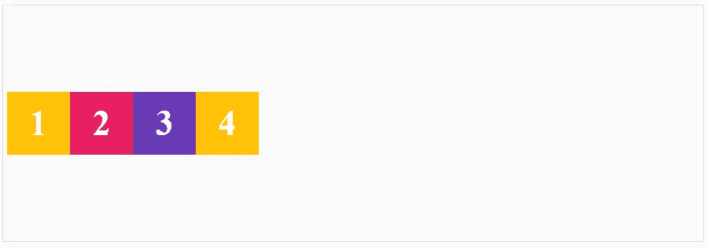

## 对齐-项目:基线

基线是大多数字母所在的线。项目本身是根据文本的位置来定位的:

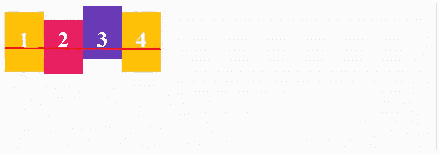

# 对齐内容

`align-content`与`justify-content`相似，不同之处在于它将沿横轴而不是主轴对齐。另外，`align-content`仅在容器中有多行 flex 项目时才起作用。容器必须有高度和包装。

*   `align-content: stretch`
*   `align-content: flex-start`
*   `align-content: flex-end`
*   `align-content: center`
*   `align-content: space-between`
*   `align-content: space-around`

## 对齐-内容:拉伸

这是`align-content`的默认值。它对对齐没有影响。

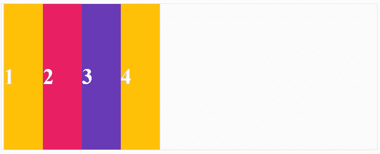

## 对齐内容:弹性开始

该值将直线拉至横轴的起点:

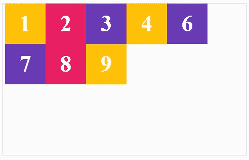

## 对齐内容:柔性结尾

该值将直线推到横轴的末端:

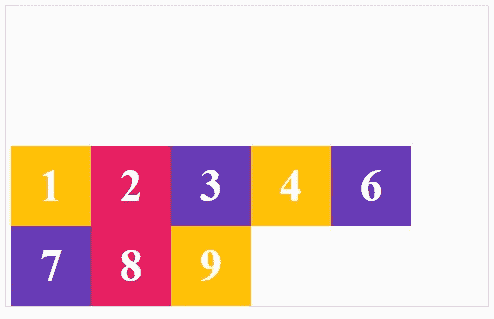

## 对齐-内容:居中

该值将直线推到横轴的中心:

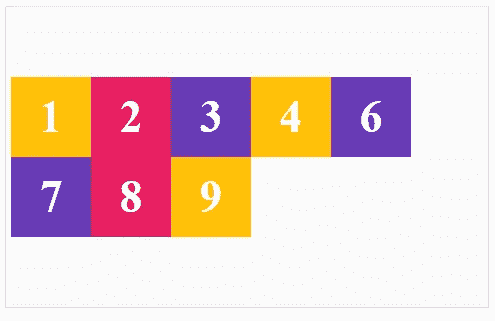

## 对齐-内容:间距

该值占用所有额外的空间，并将其放在两行之间:

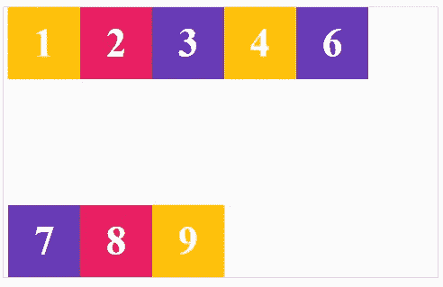

## 对齐内容:空格环绕

这将在线周围分配空间:

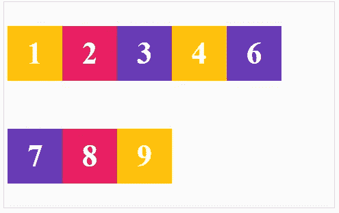

# 弹性项目属性

*   `order`
*   `flex-grow`
*   `flex-shrink`
*   `flex-basis`
*   `flex`
*   `align-self`

## 命令

`order`属性管理项目到达 flex 容器的顺序。所有项目默认值的顺序为零:

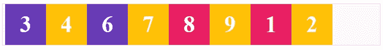

## 灵活增长

`flex-grow`必要时允许伸缩项增长。该属性指定项目在 flex 容器中需要占用多少空间。所有弹性项目的`flex-grow`都为零。


输出

## 弯曲收缩

`flex-shrink`定义弹性项目在必要时收缩的容量。`flex-shrink`的默认值是 1。

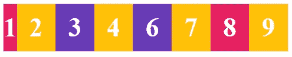

## 弹性基础

`flex-basis`在分配容器中的额外空间之前，指定 flex 项目的初始主尺寸:

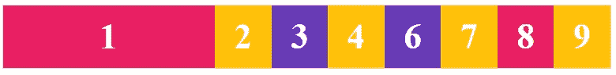

## 弯曲

`flex`属性是`flex-grow`、`flex-shrink`和`flex-basis`的简写。


## 自我对齐

`align-self`属性允许对齐单个 flex 项目:

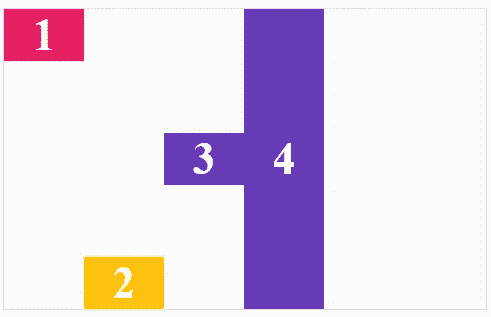

# 结论

感谢阅读。

如果有兴趣，可以在 [YouTube](https://www.youtube.com/playlist?list=PLC3y8-rFHvwg6rjbiMadCILrjh7QkvzoQ&pbjreload=10) 上查看更多资源，还可以玩[*Flexbox Froggy*](https://flexboxfroggy.com/)**游戏。**