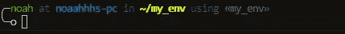
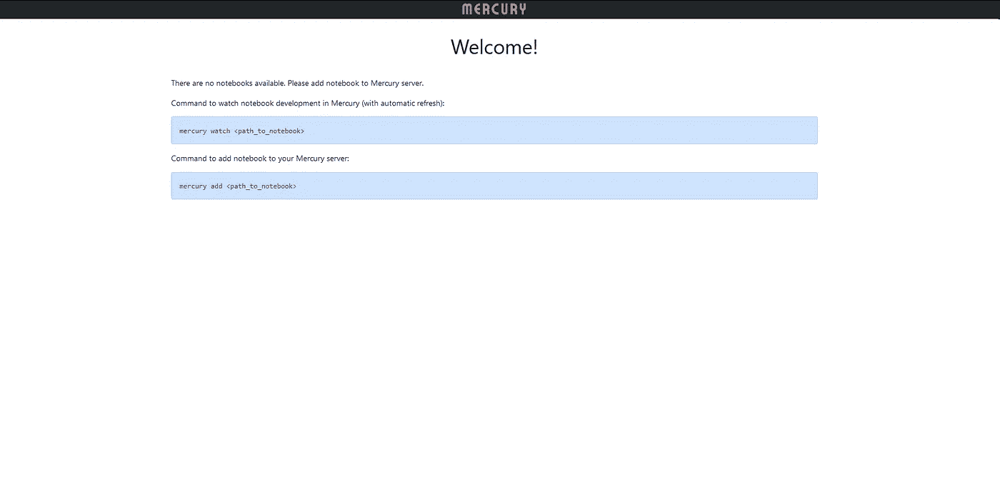
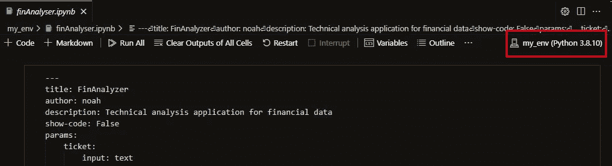
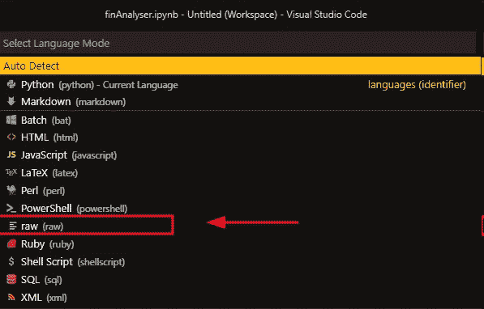
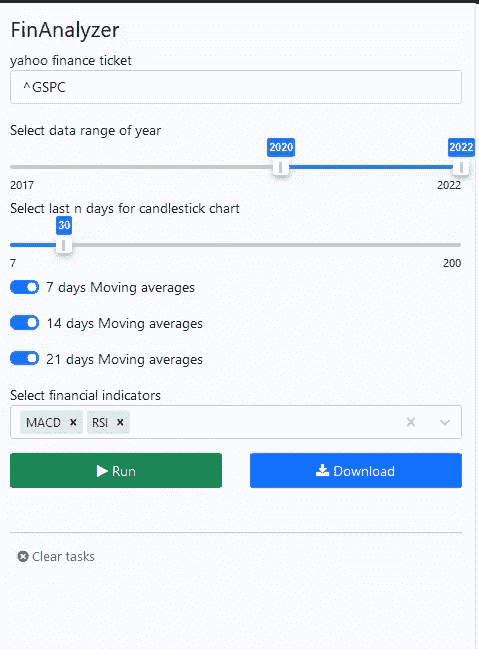
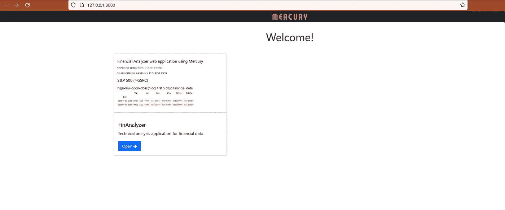
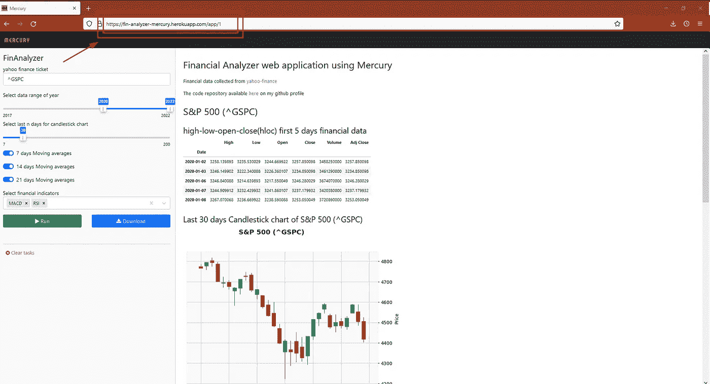

# 将 Python Notebook 转换成交互式 Web 应用程序的完整指南

> 原文：<https://betterprogramming.pub/a-complete-guide-for-converting-python-notebook-into-interactive-web-application-1288ae22b5cf>

## 轻松创建和部署用于金融数据技术分析的 web 应用程序


尼古拉斯·卡佩罗在 [Unsplash](https://unsplash.com?utm_source=medium&utm_medium=referral) 上拍摄的照片

你好。本文准备用 python 语言对金融数据进行技术分析，并将我们编写的代码转换成交互式 web 应用程序。

技术分析是理解金融股票数据、货币或不同类型的金融时间序列数据的最简单的方法。大多数程序员或数据科学家使用 python 语言对金融数据进行基本分析，因为它非常简单易用。

除了财务分析代码之外，我还想向您展示如何快速轻松地将 python 笔记本转换成 web 应用程序。对你团队里不懂编程的人可能会有帮助。

如果您的 python 笔记本代码可以转换为交互式 web 应用程序，那么每个人都会使用您的 python 应用程序。因此，这篇文章解释了如何可视化 python 代码并使其易于使用。技术分析应用程序就是一个例子…

> 这不是投资建议。我只是想展示如何用 python 语言中最常用的技术指标来审核财务数据。

[**水星**](https://github.com/mljar/mercury) 是一个强大的工具，用于将构建在 python 笔记本上的数据科学应用程序转换为交互式 web 应用程序。在本文中，我使用 python 笔记本上的财务指标创建了一个财务数据分析应用程序，并使用 mercury 将其转换为 web 应用程序，然后部署到 Heroku free dyno 服务以在 Web 上使用。我认为该工具对于 python 开发人员或任何懂 python 语言的人来说都非常有用，它将简化快速分析。在这篇文章的最后，你将会有一个指示板给任何不懂编程的人看。

另一方面，您将学习如何:

*   计算一些技术指标并用 python 语言对财务数据进行可视化，
*   在 Jupyter 笔记本或 visual studio 代码 Jupyter 扩展中创建仪表板，
*   使用 [Mercury](https://github.com/mljar/mercury) 将笔记本转换为动态网络应用程序，
*   将基于笔记本的仪表盘应用程序部署到 Heroku free dyno。

# 技术分析和指标

## 移动平均线

在金融中，移动平均线(MAs)是技术分析中常用的技术指标。计算股票的移动平均线是通过创建不断更新的平均价格来帮助平滑价格数据。它可以支持理解价格何时上涨或下跌。在 python 语言中，一个简单的移动平均可以像下面的代码一样计算。同时也是我 python 笔记本的一部分。

```
## calculate 7days, 14days, 21days moving averages
techAnalysis=finData[["Close"]]
if ma_7d:
    techAnalysis["ma_7d"]=techAnalysis["Close"].rolling(5).mean()
if ma_14d:
    techAnalysis["ma_14d"]=techAnalysis["Close"].rolling(14).mean()
if ma_21d:
    techAnalysis["ma_21d"]=techAnalysis["Close"].rolling(21).mean()
```

在这段代码中，7 天、14 天和 21 天的移动平均线是根据“**收盘**数据计算的。

## MACD

MACD 指标是一个趋势动量指标，它是根据两个不同的价格变量来观察的。它是用 12 天指数移动平均线减去 26 天指数移动平均线得到的。MACD 指标中的信号被用来触发买卖。
在 python 语言中，MACD 指标可以这样计算如下。我在 mercury 应用程序中使用了这种方式。在 python 语言中，这是一种非常简单有效的计算 MACD 的方法。

```
*# calculate MACD* if "MACD" in indicators:
   k = techAnalysis['Close'].ewm(*span*=12, *adjust*=False,              *min_periods*=12).mean() d = techAnalysis['Close'].ewm(*span*=26, *adjust*=False, *min_periods*=26).mean() macd=k-d macd_s = macd.ewm(*span*=9, *adjust*=False, *min_periods*=9).mean() macd_h = macd - macd_s techAnalysis['macd_h'] = techAnalysis.index.map(macd_h) techAnalysis['macd_s'] = techAnalysis.index.map(macd_s)
```

在这段代码中，我们计算了 MACD 指示器、MACD 信号和 MACD 直方图，并将它们保存到`techAnalysis`数据帧中。

## 相对强度指数

相对(相对)强度指数(RSI)是一个指标，它通过比较相关时期的收盘值与该时期的前一个收盘值来预测短期和中期趋势的方向。了解投资者何时会卖出或买入对我们很有帮助。
在这段代码中，我使用了`pandas_ta`模块来计算 RSI。在 python 中，这是一种非常简单快捷的方法。

```
*## RSI calculate* if "RSI" in indicators:
import pandas_ta as pta
techAnalysis["RSI"]=pta.rsi(techAnalysis["Close"],*lenght*="14")
```

现在，我们在`techAnalysis`数据框中有了“RSI”栏。

## 卷

体积数据可以使用指示器。它显示了在市场中某一段时间内有多少股票易手。投资者通常使用交易量数据来解释和确认价格变动。
在这个应用程序中，交易量数据被添加到最后一个图表中，以告知投资者关于价格 m 的更多信息

# 创建 Python 环境并安装 Mercury

如果你想清理环境，我建议你创建一个 python 虚拟环境并使用它。我正在使用 python `virtualenv`包创建一个 python 虚拟环境。

```
python3 -m pip install virtualenv
```

然后，让我们为这个项目创建一个虚拟环境。

```
python -m venv my_env
```

我们有一个环境，我们必须激活它来使用下面的代码。

```
cd my_env
source bin/activate
```



my_env 在 zsh 上被激活(fino 主题)——*图片作者*

`my_env`被激活。

要使用所用的 python 函数和模块，您应该安装下面所需的包。

```
matplotlib       
pandas                             
pandas-ta                             
numpy                             
pandas_datareader                             
requests                             
mplfinance                             
beautifulsoup4                             
mljar-mercury
```

您可以复制全部并粘贴到`requirements.txt`文件中。然后，您可以运行下面的命令，轻松安装所有需要的软件包。

```
pip install -r requirements.text
```

## 控制 Mercury 服务器

现在，让我们快速控制水星服务器。一个简单的命令就足以做到这一点。

```
mercury runserver — runworker
```

让我们在您的网络浏览器上检查一下`https:127.0.0.1/8000`地址。如果你能看到下面的页面，你就成功了。



水星服务器欢迎页面— *作者图片*

要编码，可以使用 Jupyter 笔记本或 vs code Jupyter 扩展。需要注意的是，在使用 Jupyter 笔记本或 vs 代码时，应该选择 Jupyter 内核`my_env` 。



选择 Jupyter 内核作为 my_env(红色区域)——*作者图片*

如果看不到 my_env，必须将虚拟内核添加到 Jupyter 内核中。为此，您将通过 pip 安装 Jupyter 包，并通过`ipykernel` 包添加内核。在`my_env`目录中，你应该运行下面的命令或者阅读共享[链接](https://ipython.readthedocs.io/en/stable/install/kernel_install.html)中的文档。

```
python3 -m pip install jupyter ipykernel
python -m ipykernel install --user --name myenv"
```

您可以使用下面的命令检查已安装的 Jupyter 内核。

```
Jupyter kernelspec list
```

如果您可以透过其他内核看到该内核，那么您可以确保它已安装到代码中。

太好了！让我们回顾一下我的代码，并轻松地将其转换为 web 应用程序！！

# 创建用于财务分析的 python 笔记本

## 雅虎财经

Yahoo finance 是一个有用的网站，可以简单快速地收集最多的财务数据。这里可以免费获取历史数据[。](http://finance.yahoo.com)

我使用下面的代码通过 python 从 yahoo finance 收集财务数据。

```
import pandas_datareader as dr*## date yyyy-dd-mm* start_date= "2015-01-01"
end_date=date.today()
finData=dr.data.get_data_yahoo(ticket,*start*=start_date,*end*=end_date)
```

`pandas_datareader`模块包含了`get_data_yahoo` 功能，我们可以方便的收集历史数据。

## 让我们分析一下财务数据

在这个应用程序中，一些移动平均线、MACD、RSI 指标和成交量数据用于对任何金融数据进行简单的技术分析。

我绘制了过去 N 天的蜡烛图开盘价-收盘价-最高价-最低价数据和这些指标。所有代码都被推送到我的 GitHub 库，你可以在下面的要点查看代码。

金融分析师-水星所有代码-作者要点

# 将 python notebook 转换为 web 应用程序

**第一步。**添加 YAML 单元格— [Mercury framework](https://github.com/mljar/mercury) 允许您通过在笔记本的开头添加 YAML 标题来定义笔记本的小部件。

首先，您必须在 python 笔记本的顶部添加一个空白单元格，并将单元格类型切换到`raw`。



vscode Jupyter 扩展-YAML 标头的第一个单元格类型必须是 raw—*作者图片*

它在我用于[fina analyzer-mercury](http://fin-analyzer-mercury.herokuapp.com/)应用程序的 YAML 文件的下面。它将在 web 应用程序上创建小部件。它可以用在许多带有 **mercury** 的小工具类型中，如选择、文本、滑块、范围、复选框等。

```
---
title: FinAnalyzer
author: noah
description: Technical analysis application for financial data
show-code: False
params:
   ticket:
      input: text
      label: yahoo finance ticket
      value: "^GSPC"
      row: 1
   year:
      input: range
      label: Select data range of year
      value: [2020,2022]
      min: 2017
      max: 2022
   lastndays:
      input: slider
      label: Select last n days for candlestick chart
      value: 30
      min: 7
      max: 200
   ma_7d:
      label: 7 days Moving averages
      input: checkbox
      value: true
   ma_14d:
      label: 14 days Moving averages
      input: checkbox
      value: true
   ma_21d:
      label: 21 days Moving averages
      input: checkbox
      value: true
   indicators:
      label: Select financial indicators
      input: select
      value: [MACD,RSI]
      choices: [MACD,RSI,Volume]
      multi: True
---
```

原始单元格将创建下面的小部件。



web 应用程序上的小部件— *作者图片*

**第二步。**分配变量—我们必须用 YAML 单元格创建同名的变量，并分配第一个值。在我的代码中，我将第一个值赋给了 YAML 单元格。

```
ticket = "^GSPC"
year= [2020,2022]
ma_7d=True
ma_14d=True
ma_21d=True
indicators=["MACD","RSI"]
lastndays=30
```

**第三步。**测试——对于测试，我们可以使用本地的 mercury 服务器。运行下面的代码并打开[https://127 . 0 . 0 . 1:8000](https://127.0.0.1:8000)**地址您的 web 浏览器。您可以显示应用程序正在本地 mercury 服务器上运行。**

****

**金融分析师-当地水星服务上的水星笔记本 *r —作者图片***

**每次您更新笔记本时，它都会在 Mercury 中自动更新**

****第四步。**部署到 Heroku Dyno——仪表板已经准备好了，让我们将它部署到 Heroku。**

**我假设您已经安装了 Heroku 帐户和 Heroku 命令行(CLI)工具。但是如果你没有安装，你可以查看[文档](https://devcenter.heroku.com/articles/heroku-cli)。**

**让我们登录 Heroku-CLI 工具:**

```
 heroku login
```

**Heroku 登录屏幕将在您的默认浏览器上打开，您必须以这种方式登录。**

**之后，让我们运行以下命令来创建一个 Heroku 应用程序:**

```
heroku create finAnalzer-mercury
```

**在项目目录中，您应该在 create 命令中使用不同的项目名称，因为我得到了该名称。**

**我们需要给我们的项目添加一个`Procfile`:**

```
web: mercury runserver 0.0.0.0:$PORT --runworker
```

**让我们设置必要的环境(**)。dyno 中的 env** 变量:**

```
heroku config:set ALLOWED_HOSTS=fin-analyzer-mercury.herokuapp.com
heroku config:set SERVE_STATIC=True
heroku config:set NOTEBOOKS=*.ipynb
```

**让我们创建一个 setup.sh 文件，并通过下面的命令设置环境变量:**

```
heroku config:set $(cat .env | sed ‘/^$/d; /#[[:print:]]*$/d’)
```

**[我的 GitHub 库](https://github.com/nuhyurduseven/finAnalyzer-mercury)就是你的一个例子。之后，您就可以通过运行以下命令来部署应用程序了:**

```
git push heroku main
```

**我现在有一个网络应用程序。可以通过下面的链接获得。**

 **[## 汞

### Mercury:轻松分享您的 Python 笔记本

fin-analyzer-mercury.herokuapp.com](https://fin-analyzer-mercury.herokuapp.com/)** ****

**作者在 Heroku dyno — *图像上的应用***

**顺便说一下，如果您将代码推送到您的 GitHub 库，但是您不能推送到`.env`文件。文件只有 Heroku dyno。你可以很容易地添加你的`.gitignore` 文件。**

# **结论**

**因此，在这篇文章中，我们使用 python 来获取关于金融数据的知识，包括一些技术分析指标和 mercury 框架，并将其转换为 web 应用程序。**

**人们使用许多技术指标来了解趋势，我们使用一些指标来了解数据，如移动平均线、MACD、RSI 和成交量。我认为使用交互式 web 应用程序可能是查看财务数据的一种非常简单的方式，在这篇文章中，我们学习了如何通过 python 笔记本上的代码创建 web 应用程序。**

**Mercury 是一个很有吸引力的工具，可以使用 Python 从笔记本文件制作 web 应用程序。将 Python notebook 转换成一个简单的 web dashboard 应用程序非常有用。毕竟用 Python 写的应用可以轻松部署在 Heroku free dyno 上。**

**如果你的团队里有不懂 Python 编程的朋友，你可以替他们用这个方法。他们可以轻松使用您的数据科学应用程序。**

**我的代码和 Heroku 文件可以在这里找到。**