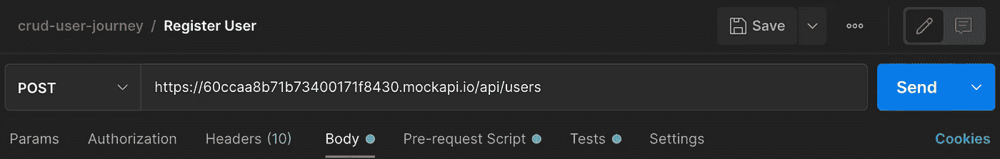
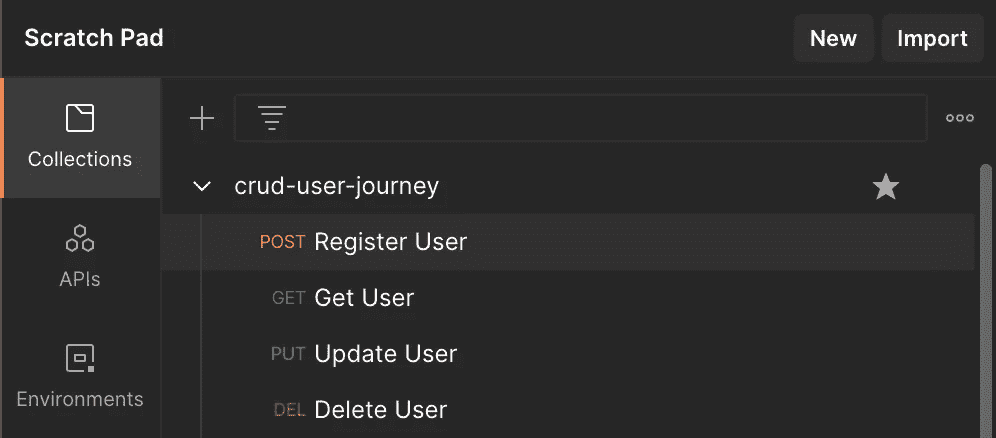
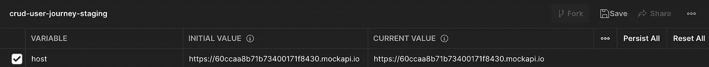
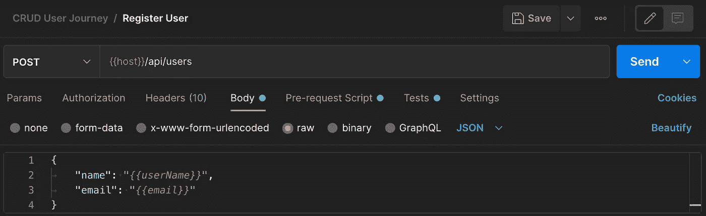
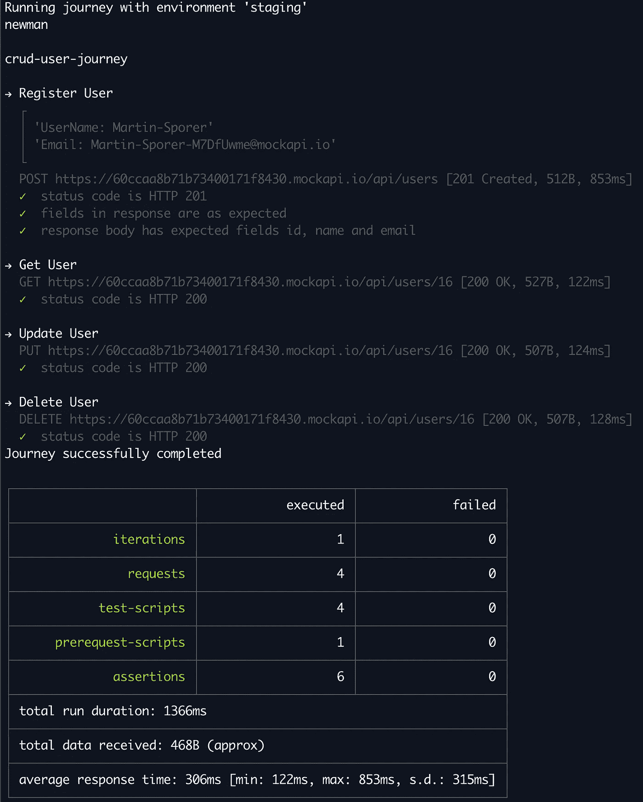

# Postman 测试完全指南

> 原文：<https://betterprogramming.pub/a-complete-guide-to-api-testing-with-postman-bf8d8f9cb110>

## 减少担心破坏现有功能的时间

[Sigmund](https://unsplash.com/@sigmund?utm_source=unsplash&utm_medium=referral&utm_content=creditCopyText) 在 [Unsplash](https://unsplash.com/s/photos/testing?utm_source=unsplash&utm_medium=referral&utm_content=creditCopyText) 上拍照。

作为一名软件开发人员，在为客户发布下一个特性之前，你总是正确的。但是你的团队越快，无意中破坏先前发布的特性的可能性就越大。这就是为什么你应该仔细地回归测试你的 API。

[邮递员](https://www.postman.com/)是这项工作的绝佳工具。它使您能够轻松地针对 API 执行请求，运行请求前和请求后脚本，对响应进行断言，并在旅程和场景中将请求聚集在一起。

这篇文章将指导你从开始使用 Postman 到将你的旅程作为一个自动化的质量关步骤集成到你的发布管道中。

主题概述:

*   入门—简介和基本概念。
*   使用集合和场景—将请求聚集在一起。
*   环境和变量-阶段的局部和全局范围的变量。
*   请求前和请求后脚本—在请求前后执行脚本。
*   断言—验证响应。
*   从 CLI 运行 Postman 使用 newman 进行终端执行。
*   还有呢！—简短总结并讨论其他邮递员功能。
*   关键要点

# 入门指南

下载安装 Postman 后，我们可以直接跳转到基础。为了简单起见，我将使用由 [mockAPI.io](https://mockapi.io) 提供的模拟 API。如果您想继续阅读本文，您可以创建自己的资源或者重用我提供的 URL。

让我们定义我们的第一个目标:

1.  为我们的模拟 API 创建一个`POST`、`GET`、`PUT`和`DELETE`请求。
2.  将我们的请求打包成一个集合。
3.  利用环境变量。
4.  设置用于生成随机测试数据的预请求脚本。
5.  通过请求后脚本验证我们的响应并提取数据。

这是我们简单的 API 的样子:

*   `POST /api/users` —用于注册用户
*   `GET /api/users/{id}` —用于检索/更新/删除用户

让我们开始吧。

通过点击便签簿旁边的`+`，您可以创建您的第一个请求。Postman 的接口非常简单明了，所以你可以直接添加目标 URL ( `https://60ccaa8b71b73400171f8430.mockapi.io/api/users`或者你自己的)并选择`POST`作为 HTTP 方法。

这样，我们的模拟 API 将创建第一个用户并返回其标识符。由于 API 是 REST 兼容的，我们可以用`GET /api/users/{id}`检索我们的用户，这将是我们的第二个请求。接下来，我们可以用`PUT`推送一个更新，在主体内部提供一些随机值(Postman 会负责为我们设置正确的`Content-Type`头)。最后，我们将移除用户，通过在`/api/users/{id}`上执行`DELETE` 来完成旅程。

# 创建集合和方案

让我们在便签簿上选择`New > Collection`，为我们的旅程打造一个专属系列。创建集合后，您可以将之前创建的请求保存到其中。

集合允许你将你的旅程分成不同的项目或不同的商业案例。另一个很棒的特性是将文件夹添加到我们的集合中，对请求进行另一个细粒度的聚类，使之成为专用场景。当我们稍后通过命令行运行我们的旅程时，如果断言失败，拥有清晰分离的场景将有助于我们精确地指出有缺陷的过程。

# 环境和变量

很可能您想要测试的不仅仅是一个阶段。大多数项目至少有一个预览和一个生产环境，在这两个阶段运行您的测试是非常有价值的。不仅目标主机是一个变量，而且通过请求传递的参数也可能不同。

这就是环境发挥作用的地方。环境使您能够定义可以在您的请求以及请求前和请求后脚本中使用的变量。

让我们创建一个新环境，方法是在我们的便笺簿上单击名为`crud-user-journey-staging`的`New > Environment`。

我已经为我们的 API 添加了主机作为初始值`host`。这也会自动复制到当前值。

初始值和当前值有不同的用途:

*   `initial value` —保存到集合。
*   `current value` —仅临时用于会话，但不保存到集合中。这些值仅在本地可用。您可以粘贴您的秘密，而不用担心意外地将它们导出到您的环境中。

让我们通过经由`{{host}}`用我们的`host`变量替换硬编码的域来修改我们的请求。您还可以通过`pm.environment.get('$NAME')`访问您的环境变量，或者在您的请求前或请求后脚本中用`pm.environment.set('$NAME', $VALUE)`设置它们。

# 请求前和请求后脚本

Postman 使您能够在请求执行前后运行 JavaScript 代码。这对各种测试需求真的很有帮助:生成随机测试数据、收集秘密、添加一些超时来延迟请求执行，等等。

对于我们的例子，让我们定义一个脚本来生成一个随机的用户名和电子邮件地址。我们将利用邮递员的[动态变量](https://learning.postman.com/docs/writing-scripts/script-references/variables-list/) `randomFirstName`和`randomLastName`。通过用`pm.environment.set`设置我们的值，我们使那些变量在我们当前的会话中可用，但是不把它们作为可导出的值添加到我们的集合中。

脚本现在将在发送请求之前生成我们的测试数据，使我们能够在请求体中提供`name`和`email`。

可以通过使用`Tests`选项卡来添加预请求脚本，该选项卡也是为通过添加断言来编写测试执行的验收标准而设计的。我们将在下一节中解决这个问题。

# 断言

现在到了有趣的部分:测试我们的 API 做了它应该做的事情。让我们为修改后的`POST` 请求添加一些验证规则，并提取所创建的用户标识符，以便我们可以在以后的请求中重用它。

我们正在测试响应代码是否为`HTTP 201`，以及响应是否包含我们期望的字段`name`和`email`以及我们的值。我们还将`id`导出到我们的环境变量中。

如果一切按预期进行，这就是它的样子。

# 从 CLI 运行 Postman

我们创建了集合、环境，并定义了包含断言的请求前和请求后脚本。现在，我们想轻松地从 CLI 执行一切，而不需要安装 Postman 和使用它的接口。

## 导出收藏

第一步，出口我们的环境和产品系列。通过选择右上角的 dots 菜单来完成此操作，同时选择您的收藏/环境。Postman 会将所有内容导出为 JSON 文件。

## 利用纽曼

为了从我们的终端或构建作业运行我们的集合，我们将使用 [newman](https://github.com/postmanlabs/newman) 。您可以使用 npm 或 homebrew 在全局范围内安装它，但是我更喜欢在 Node.js 脚本中将它用作一个库。

让我们创建一个`runner.ts`，它执行我们名为`crud-journey`的集合，并允许我们传递环境名。

我们的环境应该是旅程名称和实际环境标识符的组合(在我们的例子中，我们使用了`staging`)。

我们现在可以通过`./runner.ts staging`执行邮递员集合。

CLI reporter 向我们展示了我们的测试结果以及所有的测试断言和控制台输出。

这现在可以集成到我们的发布管道中，验证我们的新部署。

## 处理秘密

在很多情况下，你需要在旅途中使用秘密。当然，您不希望通过`environments`文件将它们提交到您的存储库中。

在我的例子中，所有的应用程序都运行在 AWS 上，相应的构建工作也是如此。我还使用 Secrets Manager 来存储秘密，这使得通过 aws-sdk 很容易检索到它们。

无论您如何检索您的秘密，您都可以在执行旅程之前通过 Node.js runner 脚本轻松地插入它们，因为所有变量都存储在`environment` JSON 文件的`values`列表中。

# 还有呢！

当然，这还不是全部。

*   还有很多动态变量——Postman 提供了许多[变量](https://learning.postman.com/docs/writing-scripts/script-references/variables-list/)(例如，用于生成测试数据，比如带有`$guid`或`$timestamp`的随机 UUIDs，用于当前 UNIX 时间戳)。
*   为相互 TLS 配置证书——如果您的后端需要证书，Postman 也会为您提供。通过`Settings > Certificates`，您可以配置不同的证书，每个证书都绑定到某个主机。纽曼也通过`--ssl-client-key`和`--ssl-client-cert`来支持这一点。
*   导出到代码——您可以为您喜欢的语言和 HTTP 客户端自动生成代码——无论您喜欢使用 cURL 的 bash、使用 Axios 的 Node.js 还是其他。Postman 提供了很多导出选项。
*   控制台—有一个控制台向您显示所有请求的详细信息、请求前或请求后脚本中的错误，以及您正在记录到`stdout`的所有输出。
*   导入 OpenAPI JSON 定义——如果您正在使用 [Swagger](https://swagger.io/) (或另一个基于 OpenAPI 的 API 文档工具)，您可以将您的 API 导入 Postman。
*   跑步者*——我们已经了解了如何通过 CLI 来运行我们的旅程，但是你也可以通过点击`Run`通过 Postman 来这样做。您可以选择迭代次数以及每次迭代之间的延迟时间。这对于在将测试作为自动化质量关步骤集成到您的发布管道中之前，确保您的测试的稳定性是非常好的。*

*Postman 正在积极开发中，这是一个非详尽的列表。所以还有更多有待发现。只需查看一下邮递员的[文档](https://learning.postman.com/docs/getting-started/introduction/)。*

# *关键要点*

*Postman 是测试你的 API 的很好的第一步，而且门槛很低。特别是对于我想尽早发布的新项目，我依赖于单元测试和基于 Postman 的 API 测试的组合。这在过去效果很好。*

*你自己试试吧。*

*感谢您的阅读。*