# 以太坊 dApps 构建完全指南:前端和后端

> 原文：<https://betterprogramming.pub/a-complete-guide-to-build-ethereum-dapps-front-end-and-back-end-6fa44b66554b>

## 面向全栈开发人员的端到端 dApp 教程


凯利·西克玛在 [Unsplash](https://unsplash.com?utm_source=medium&utm_medium=referral) 上的照片

# 什么是 DApp？

DApp 是一个大部分或完全分散的应用程序。

考虑可能被分散的应用程序的所有可能的方面:

*   后端软件(应用程序逻辑)
*   前端软件
*   数据存储
*   消息通信
*   名字解析

其中的每一个都可以是某种程度上集中的或某种程度上分散的。例如，前端可以开发为运行在中央服务器上的 web 应用程序，或者运行在您的设备上的移动应用程序。后端和存储可以在私有服务器和专有数据库上，或者您可以使用智能合同和 P2P 存储。

创建 DApp 有许多典型的集中式架构无法提供的优势:

**弹性**:因为业务逻辑由智能合约控制，DApp 后端将完全在区块链平台上分布和管理。与部署在集中式服务器上的应用程序不同，DApp 没有停机时间，只要平台还在运行，它就可以继续使用。

透明性:DApp 的链上特性允许每个人检查代码并更加确定它的功能。与 DApp 的任何交互都将永远存储在区块链中。

**审查阻力**:只要用户能够访问以太坊节点(如有必要，运行一个)，用户将始终能够与 DApp 交互，而不受任何集中控制的干扰。一旦代码部署到网络上，任何服务提供商，甚至是智能合约的所有者，都不能更改代码。

在以太坊生态系统中，就像今天这样，很少有真正去中心化的应用程序——大多数仍然依赖于集中的服务和服务器来完成部分操作。在未来，我们期望任何 DApp 的每一部分都有可能以完全分散的方式运作。

# 后端(智能合同)

在 DApp 中，智能合约用于存储业务逻辑(程序代码)和应用程序的相关状态。您可以将智能合约看作是常规应用程序中服务器端(也称为“后端”)组件的替代品。当然，这过于简单化了。一个主要的区别是，在智能契约中执行的任何计算都是非常昂贵的，因此应该尽可能保持最小。因此，确定应用程序的哪些方面需要一个可信的、分散的执行平台非常重要。

以太坊智能合约允许您构建这样的架构，在该架构中，智能合约网络相互调用和传递数据，在它们运行时读取和写入它们自己的状态变量，它们的复杂性仅受阻塞气体限制的限制。在您部署了智能合约之后，您的业务逻辑很可能在将来被许多其他开发人员使用。

智能合约体系结构设计的一个主要考虑因素是，一旦部署了智能合约，就无法更改其代码。如果使用可访问的自毁操作码对其进行编程，则可以将其删除，但是除了完全删除之外，不能以任何方式对代码进行更改。

智能合约架构设计的第二个主要考虑因素是 DApp 规模。部署和使用一份真正大型的整体智能合同可能会耗费大量的天然气。因此，一些应用程序可能选择离线计算和外部数据源。但是，请记住，让 DApp 的核心业务逻辑依赖于外部数据(例如，来自中央服务器的数据)意味着您的用户将不得不信任这些外部资源。

# 前端(网络用户界面)

dApp 的业务逻辑要求开发者理解 EVM 和 Solidity 等新语言，与之不同的是，dApp 的客户端界面可以使用标准的 web 技术(HTML、CSS、JavaScript 等)。).这允许传统的 web 开发人员使用熟悉的工具、库和框架。与以太坊的交互，比如签署消息、发送交易和管理密钥，通常是通过 web 浏览器，经由诸如 MetaMask 的扩展来进行的。

虽然也可以创建移动 dApp，但是目前几乎没有资源来帮助创建移动 dApp 前端，这主要是因为缺少可以充当具有密钥管理功能的轻型客户端的移动客户端。

前端通常通过 web3.js JavaScript 库链接到以太坊，该库与前端资源捆绑在一起，由 web 服务器提供给浏览器。

# 数据存储

由于高昂的天然气成本和目前较低的区块天然气限制，智能合同不太适合存储或处理大量数据。因此，大多数 DApps 利用链外数据存储服务，这意味着他们将以太坊链外的大量数据存储在数据存储平台上。该数据存储平台可以是集中式的(例如，典型的云数据库)，或者数据可以是分散的，存储在 P2P 平台(如 IPFS)或以太坊自己的 Swarm 平台上。

分散式 P2P 存储非常适合存储和分发大型静态资产，如图像、视频和应用程序前端 web 界面的资源(HTML、CSS、JavaScript 等)。).接下来，我们将看看几个选项。

# IPFS

行星间文件系统(IPFS)是一种分散的内容可寻址存储系统，它在 P2P 网络中的对等点之间分发存储的对象。“内容可寻址”意味着每一部分内容(文件)都经过哈希处理，哈希用于标识该文件。然后，您可以通过散列请求从任何 IPFS 节点检索任何文件。

IPFS 的目标是取代 HTTP，成为交付 web 应用程序的首选协议。文件存储在 IPFS 上，可以从任何 IPFS 节点检索，而不是将 web 应用程序存储在单个服务器上。

更多关于 IPFS 的信息可以在 [https://ipfs.io](https://ipfs.io/) 找到。

# 蜂群

Swarm 是另一个内容寻址 P2P 存储系统，类似于 IPFS。Swarm 是以太坊基金会创建的，作为 Go-Ethereum 工具套件的一部分。像 IPFS 一样，它允许你存储由群体节点传播和复制的文件。你可以通过散列引用任何 Swarm 文件来访问它。Swarm 允许你从一个分散的 P2P 系统访问一个网站，而不是一个中央网络服务器。

Swarm 的主页本身存储在 Swarm 上，可以在你的 Swarm 节点或网关上访问:【https://swarm-gateways.net/bzz:/theswarm.eth/】T2。

# 分散式消息通信协议

任何应用程序的另一个主要组件是进程间通信。这意味着能够在应用程序之间、应用程序的不同实例之间或者应用程序的用户之间交换消息。传统上，这是依靠中央服务器来实现的。然而，除了基于服务器的协议之外，还有各种分散的替代方案，通过 P2P 网络提供消息传递。DApps 最著名的 P2P 消息协议是 [Whisper](http://bit.ly/2CSls5h) ，它是以太坊基金会 Go-Ethereum 工具套件的一部分。

应用程序可以去中心化的最后一个方面是名称解析。在这一章的后面，我们将仔细研究以太坊的名称服务；不过，现在让我们来看一个例子。

# 拍卖 DApp

拍卖 DApp 允许用户注册一个“契约”令牌，它代表一些独特的资产，如房子、汽车、商标等。一旦代币被注册，代币的所有权被转移到拍卖 DApp，允许它被挂牌出售。拍卖 DApp 列出了每一个注册的令牌，允许其他用户出价。在每次拍卖期间，用户可以加入一个专门为该拍卖创建的聊天室。一旦拍卖结束，代币所有权将转移给拍卖的获胜者。

整个拍卖过程可以在下图中看到

我们的拍卖 DApp 的主要组成部分是:

*   实现 ERC721 不可替换“契约”令牌(DeedRepository)的智能合约
*   实施拍卖(`AuctionRepository`)以出售契约的智能合同
*   使用 Vue/Vuetify JavaScript 框架的 web 前端
*   用于连接以太坊链的 web3.js 库(通过 MetaMask 或其他客户端)
*   一个群组客户端，用于存储图像等资源
*   一个耳语客户端，为所有参与者创建每次拍卖聊天室

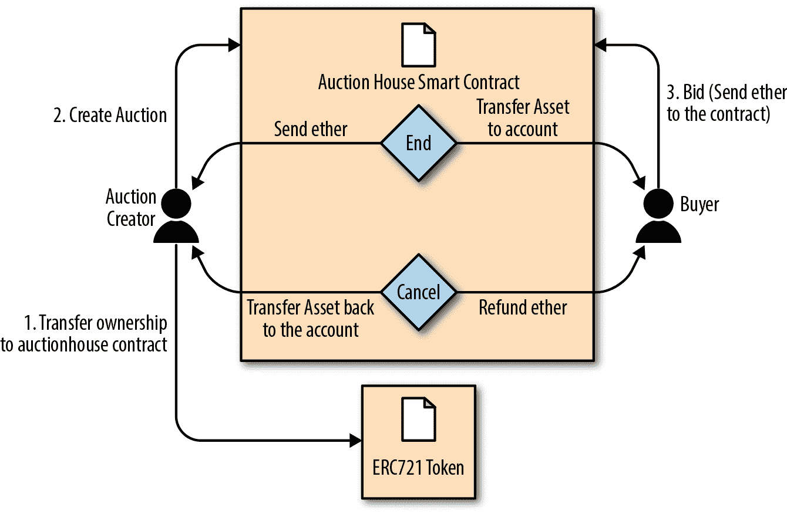

你可以在这里找到拍卖 dApp [的源代码。](https://github.com/ac12644/auction_dapp.git)

# 拍卖 DApp:后端智能合约

我们的拍卖 DApp 示例由两个智能合约支持，我们需要将它们部署在以太坊区块链上以支持应用程序:AuctionRepository 和 DeedRepository。

让我们从 DeedRepository 开始，如 [DeedRepository.sol 所示:一个用于拍卖的 ERC721 契约令牌](https://github.com/ac12644/auction_dapp/blob/main/backend/contracts/DeedRepository.sol)。此合约是 ERC721 兼容的不可替换令牌。

例 1。`DeedRepository.sol`:用于拍卖的 ERC721 契约令牌

```
link:code/auction_dapp/backend/contracts/DeedRepository.sol[]
```

如您所见，`DeedRepository`契约是 ERC721 兼容令牌的直接实现。

我们的拍卖 DApp 使用`DeedRepository`合同来发布和跟踪每次拍卖的令牌。拍卖本身是由 AuctionRepository 契约编排的。此合同太长，无法在此完整介绍，但`[AuctionRepository.sol](https://github.com/ac12644/auction_dapp/blob/main/backend/contracts/AuctionRepository.sol)` [:主拍卖 DApp 智能合同](https://github.com/ac12644/auction_dapp/blob/main/backend/contracts/AuctionRepository.sol)显示了合同的主要定义和数据结构。

例 2。`[AuctionRepository.sol](https://github.com/ac12644/auction_dapp/blob/main/backend/contracts/AuctionRepository.sol)`:主拍卖 DApp 智能合约

`[AuctionRepository](https://github.com/ac12644/auction_dapp/blob/main/backend/contracts/AuctionRepository.sol)`合同通过以下功能管理所有拍卖:

您可以使用该书的存储库中的 Truffle 将这些合同部署到您选择的以太坊区块链(例如 Ropsten ):

```
$ cd code/auction_dapp/backend
$ truffle init
$ truffle compile
$ truffle migrate --network ropsten
```

# DApp 治理

如果你通读了拍卖 dApp 的两个智能合同，你会注意到一些重要的事情:没有特殊的帐户或角色对 dApp 有特殊的特权。每个拍卖都有一个拥有一些特殊能力的所有者，但是拍卖 dApp 本身没有特权用户。

这是一个深思熟虑的选择，目的是分散 dApp 的治理，并在部署后放弃任何控制。相比之下，一些 dApp 拥有一个或多个具有特殊能力的特权帐户，例如终止 DApp 合同、覆盖或更改其配置或“否决”某些操作的能力。通常，这些治理功能是在 dApp 中引入的，以避免由于 bug 而可能出现的未知问题。

治理问题是一个特别难以解决的问题，因为它是一把双刃剑。一方面，特权帐户是危险的；如果遭到破坏，他们可以破坏 DApp 的安全。另一方面，没有任何特权帐户，如果发现错误，就没有恢复选项。我们已经在以太坊 DApps 中看到了这两种风险。在道和以太坊的历史中，有一些被称为“管理者”的特权账户，但是他们的能力非常有限。这些帐户无法覆盖 DAO 攻击者的资金提取。在最近的一个案例中，分散式 exchange Bancor 经历了一次大规模盗窃，因为一个特权管理帐户遭到了破坏。事实证明，Bancor 并不像最初设想的那样分散。

在构建 DApp 时，您必须决定是否要让智能合约真正独立，启动它们，然后失去控制，或者创建特权帐户并承担被泄露的风险。这两种选择都有风险，但从长远来看，真正的 DApps 不能对特权账户进行专门访问——这不是分散的。

# 拍卖 DApp:前端用户界面

一旦 DApp 拍卖行的合同部署完毕，你就可以使用你最喜欢的 JavaScript 控制台和 web3.js 或者其他 web3 库与它们进行交互。然而，大多数用户将需要一个易于使用的界面。我们的拍卖 DApp 用户界面是使用 Google 的 Vue2/Vuetify JavaScript 框架构建的。

可以在 [repo](https://github.com/ac12644/auction_dapp/tree/main/frontend) 的 code/auction_dapp/frontend 文件夹中找到用户界面代码。该目录具有以下结构和内容:

```
frontend/
|-- build
|   |-- build.js
|   |-- check-versions.js
|   |-- logo.png
|   |-- utils.js
|   |-- vue-loader.conf.js
|   |-- webpack.base.conf.js
|   |-- webpack.dev.conf.js
|   `-- webpack.prod.conf.js
|-- config
|   |-- dev.env.js
|   |-- index.js
|   `-- prod.env.js
|-- index.html
|-- package.json
|-- package-lock.json
|-- README.md
|-- src
|   |-- App.vue
|   |-- components
|   |   |-- Auction.vue
|   |   `-- Home.vue
|   |-- config.js
|   |-- contracts
|   |   |-- AuctionRepository.json
|   |   `-- DeedRepository.json
|   |-- main.js
|   |-- models
|   |   |-- AuctionRepository.js
|   |   |-- ChatRoom.js
|   |   `-- DeedRepository.js
|   `-- router
|       `-- index.js
```

一旦您部署了契约，编辑`frontend/src/config.js` 中的前端配置，并输入`DeedRepository`和 AuctionRepository 契约的地址，如部署的那样。前端应用程序还需要访问提供 JSON-RPC 和 WebSockets 接口的以太坊节点。配置好前端后，在本地机器上用 web 服务器启动它:

```
$ npm install
$ npm run dev
```

拍卖 dApp 前端将启动，并可通过任何网络浏览器在 [http://localhost:8080](http://localhost:8080/) 访问。

如果一切顺利，您应该会看到拍卖 DApp 用户界面中显示的屏幕，它说明了拍卖 dApp 在网络浏览器中运行。

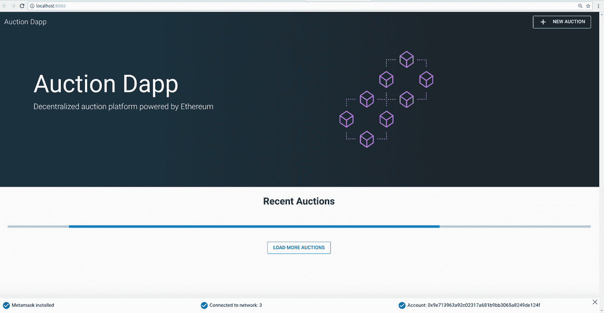

前端

# 进一步下放拍卖 DApp

我们的 dApp 已经相当分散，但我们可以改善事情。

`AuctionRepository`合同独立运作，不受任何监管，对任何人开放。一旦部署，就无法停止，也无法控制任何拍卖。每个拍卖会都有一个单独的聊天室，允许任何人在没有审查或识别的情况下交流拍卖情况。各种拍卖资产，如描述和相关图片，都存储在 Swarm 上，使得它们很难被审查或屏蔽。

任何人都可以通过手动构建事务或在本地机器上运行 Vue 前端来与 dApp 交互。dApp 代码本身是开源的，是在公共存储库上合作开发的。

我们可以做两件事来让这个 dApp 变得分散和有弹性:

*   将所有应用程序代码存储在 Swarm 或 IPFS 上。
*   使用以太坊名称服务，通过引用名称来访问 dApp。

我们将在下一节探讨第一个选项，我们将深入研究以太坊名称服务(ENS)中的第二个选项。

# 在 Swarm 上存储拍卖 DApp

我们在本章前面介绍了 Swarm 中的 Swarm。我们的拍卖 dApp 已经使用 Swarm 来存储每次拍卖的图标图像。这是一个比试图在以太坊上存储数据更有效的解决方案，因为以太坊很贵。与将这些图像存储在 web 服务器或文件服务器等集中式服务中相比，这种方法也更具弹性。

但是我们可以更进一步。我们可以将 dApp 本身的整个前端存储在 Swarm 中，并直接从 Swarm 节点运行它，而不是运行 web 服务器。

## 准备蜂群

要开始，您需要安装 Swarm 并初始化您的 Swarm 节点。Swarm 是以太坊基金会 Go-Ethereum 工具套件的一部分。参考[ `go_ethereum_geth` ]中安装 Go-Ethereum 的说明，或者按照 [Swarm 文档](http://bit.ly/2Q75KXw)中的说明安装 Swarm 二进制版本。

一旦安装了 Swarm，您可以通过使用 version 命令运行它来检查它是否正常工作:

```
$ swarm version
Version: 0.3
Git Commit: 37685930d953bcbe023f9bc65b135a8d8b8f1488
Go Version: go1.10.1
OS: linux
```

要开始运行 Swarm，您必须告诉它如何连接到 Geth 的一个实例，以访问 JSON-RPC API。按照[入门指南](https://swarm-guide.readthedocs.io/en/latest/gettingstarted.html)中的说明开始。

当您开始 Swarm 时，您应该会看到类似这样内容:

```
Maximum peer count                       ETH=25 LES=0 total=25
Starting peer-to-peer node               instance=swarm/v0.3.1-225171a4/linux...
connecting to ENS API                    url=http://127.0.0.1:8545
swarm[5955]: [189B blob data]
Starting P2P networking
UDP listener up                          self=enode://f50c8e19ff841bcd5ce7d2d...
Updated bzz local addr                   oaddr=9c40be8b83e648d50f40ad3... uaddr=e
Starting Swarm service
9c40be8b hive starting
detected an existing store. trying to load peers
hive 9c40be8b: peers loaded
Swarm network started on bzz address: 9c40be8b83e648d50f40ad3d35f...
Pss started
Streamer started
IPC endpoint opened                      url=/home/ubuntu/.ethereum/bzzd.ipc
RLPx listener up                         self=enode://f50c8e19ff841bcd5ce7d2d...
```

你可以通过连接本地的 Swarm gateway web 接口: [http://localhost:8500](http://localhost:8500/) 来确认你的 Swarm 节点是否运行正常。

您应该会看到一个类似于本地主机上 Swarm gateway 的屏幕，并且能够查询任何 Swarm hash 或 ENS 名称。

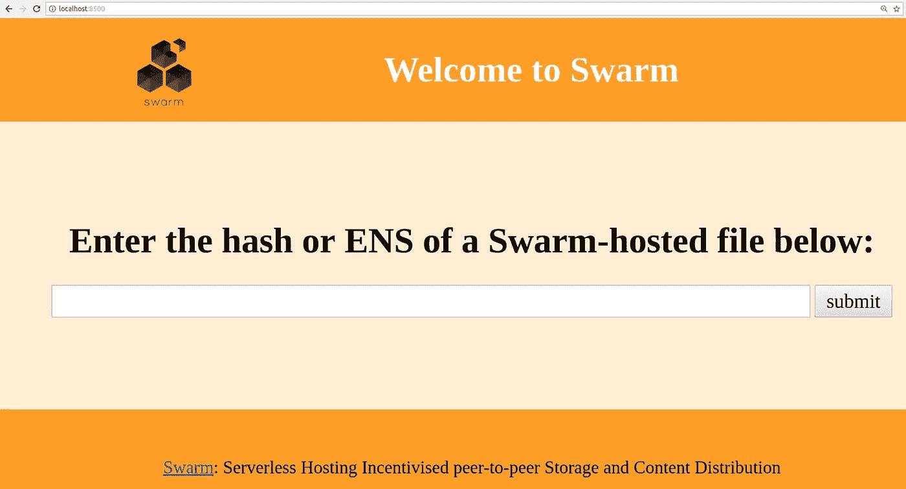

本地主机上的群网关

## 上传文件到 Swarm

一旦你运行了你的本地 Swarm 节点和网关，你就可以上传到 Swarm，文件在任何 Swarm 节点上都是可访问的，只需要参考文件散列。

让我们通过上传一个文件来测试一下:

```
$ swarm up code/auction_dapp/README.md
ec13042c83ffc2fb5cb0aa8c53f770d36c9b3b35d0468a0c0a77c97016bb8d7c
```

Swarm 已经上传了`README.md`文件并返回了一个散列，您可以使用它从任何 Swarm 节点访问该文件。例如，你可以使用[公共群网关](https://bit.ly/2znWUP9)。

虽然上传一个文件相对简单，但上传整个 dApp 前端要复杂一些。这是因为各种 dApp 资源(HTML、CSS、JavaScript、库等。)都嵌入了对彼此的引用。通常，web 服务器将 URL 转换为本地文件，并提供正确的资源。我们可以通过打包我们的 dApp 为 Swarm 实现同样的目标。

在拍卖 dApp 中，有一个打包所有资源的脚本:

```
$ cd code/auction_dapp/frontend
$ npm run build> frontend@1.0.0 build /home/aantonop/Dev/ethereumbook/code/auction_dapp/frontend
> node build/build.jsHash: 9ee134d8db3c44dd574d
Version: webpack 3.10.0
Time: 25665ms
Asset     Size
static/js/vendor.77913f316aaf102cec11.js  1.25 MB
static/js/app.5396ead17892922422d4.js   502 kB
static/js/manifest.87447dd4f5e60a5f9652.js  1.54 kB
static/css/app.0e50d6a1d2b1ed4daa03d306ced779cc.css  1.13 kB
static/css/app.0e50d6a1d2b1ed4daa03d306ced779cc.css.map  2.54 kB
static/js/vendor.77913f316aaf102cec11.js.map  4.74 MB
static/js/app.5396ead17892922422d4.js.map   893 kB
static/js/manifest.87447dd4f5e60a5f9652.js.map  7.86 kB
index.html  1.15 kBBuild complete.
```

这个命令的结果将是一个新的目录，`code/auction_dapp/frontend/dist`，它包含了整个拍卖 DApp 前端，打包在一起:

```
dist/
|-- index.html
`-- static
    |-- css
    |   |-- app.0e50d6a1d2b1ed4daa03d306ced779cc.css
    |   `-- app.0e50d6a1d2b1ed4daa03d306ced779cc.css.map
    `-- js
        |-- app.5396ead17892922422d4.js
        |-- app.5396ead17892922422d4.js.map
        |-- manifest.87447dd4f5e60a5f9652.js
        |-- manifest.87447dd4f5e60a5f9652.js.map
        |-- vendor.77913f316aaf102cec11.js
        `-- vendor.77913f316aaf102cec11.js.map
```

现在，您可以使用 up 命令和——recursive 选项将整个 dApp 上传到 Swarm。这里，我们还告诉 Swarm，index.html 是加载这个 dApp 的默认路径:

```
$ swarm --bzzapi [http://localhost:8500](http://localhost:8500) --recursive \
  --defaultpath dist/index.html up dist/ab164cf37dc10647e43a233486cdeffa8334b026e32a480dd9cbd020c12d4581
```

现在，我们的整个拍卖 dApp 托管在 Swarm 上，可以通过 Swarm URL 访问:

*   *bzz://ab 164 cf 37 DC 10647 e43 a 233486 CD effa 8334 b 026 e 32 a 480 DD 9 CBD 020 c12d 4581*

我们在 DApp 去中心化方面取得了一些进展，但我们使它更难使用。像这样的网址比像`auction_dapp.com`这样好听的名字更不友好。为了获得去中心化，我们被迫牺牲可用性吗？不一定。

在下一节中，我们将研究以太坊的名称服务，它允许我们使用易于阅读的名称，但仍然保留了我们的应用程序的分散性质。

# 以太坊名称服务(ENS)

你可以设计出世界上最好的智能合约，但是如果你不给用户提供一个好的界面，他们就无法访问它。

在传统互联网上，域名系统(DNS)允许我们在浏览器中使用人类可读的名称，同时在后台将这些名称解析为 IP 地址或其他标识符。在以太坊区块链上，*以太坊命名系统* (ENS)解决了同样的问题，但是以一种分散的方式。

比如以太坊基金会捐款地址是`0xfB6916095ca1df60bB79Ce92cE3Ea74c37c5d359;`在一个支持 ENS 的钱包里，简单来说就是`ethereum.eth`。

ENS 不仅仅是一个智能合约；它本身是一个基本的 dApp，提供一个分散的名称服务。此外，ENS 还得到许多 dApps 的支持，用于注册、管理和拍卖注册域名。ENS 演示了 dApp 如何协同工作:它是为其他 dApp 服务而构建的 dApp，由 dApp 的生态系统支持，嵌入在其他 dApp 中，等等。

在本节中，我们将了解 ENS 是如何工作的。我们将演示如何设置自己的名称并将其链接到钱包或以太坊地址，如何将 ENS 嵌入另一个 dApp，以及如何使用 ENS 命名 dApp 资源以使其更易于使用。

## ENS 规范

ENS 主要在三个以太坊改进提案中规定:EIP-137，规定了 ENS 的基本功能；EIP-162，它描述了拍卖系统。eth 根；以及 EIP-181，它规定了地址的反向解析。

ENS 遵循“三明治”设计理念:底层是非常简单的一层，下面是更复杂但可替换的代码层，顶层非常简单，将所有资金保存在单独的账户中。

## 底层:名称所有者和解析者

ENS 对“节点”而不是人类可读的名称进行操作:使用“Namehash”算法将人类可读的名称转换为节点。

ENS 的基础层是 ERC137 定义的一个巧妙的简单契约(不到 50 行代码)，它只允许节点的所有者设置关于它们的名称的信息，并创建子节点(相当于 DNS 子域的 ENS)。

基础层上仅有的功能是使节点所有者能够设置关于他们自己的节点的信息(特别是解析器、生存时间或转移所有权)以及创建新子节点的所有者。

Namehash 算法是一种递归算法，可以将任何名称转换为标识该名称的哈希。

“递归”是指我们通过解决一个子问题来解决问题，这个子问题是同类型的一个更小的问题，然后用子问题的解来解决原问题。

Namehash 递归地散列名称的组成部分，为任何有效的输入域产生唯一的固定长度的字符串(或“节点”)。比如 subdomain.example.eth 的 Namehash 节点是`keccak('<example.eth>' node) + keccak('<subdomain>')`。我们必须解决的子问题是计算节点例如. eth，也就是`keccak('<.eth>' node) + keccak('<example>')`。首先，我们必须计算 eth 的节点，即`keccak(<root node>) + keccak('<eth>')`。

根节点就是我们所说的我们递归的“基格”，显然不能递归定义，否则算法永远不会终止！根节点定义为`0x0000000000000000000000000000000000000000000000000000000000000000` (32 个零字节)。

综上所述，subdomain.example.eth 的节点就是`keccak(keccak(keccak(0x0...0 + keccak('eth')) + keccak('example')) + keccak('subdomain'))`。

概括地说，我们可以将 Namehash 函数定义如下(根节点或空名称的基本情况，随后是递归步骤):

```
namehash([]) = 0x0000000000000000000000000000000000000000000000000000000000000000
namehash([label, ...]) = keccak256(namehash(...) + keccak256(label))
```

在 Python 中，这变成了:

```
def namehash(name):
  if name == '':
    return '\0' * 32
  else:
    label, _, remainder = name.partition('.')
    return sha3(namehash(remainder) + sha3(label))
```

因此，`mastering-ethereum.eth`将被处理如下:

```
namehash('mastering-ethereum.eth')
⇒ sha3(namehash('eth') + sha3('mastering-ethereum'))
⇒ sha3(sha3(namehash('') + sha3('eth')) + sha3('mastering-ethereum'))
⇒ sha3(sha3(('\0' * 32) + sha3('eth')) + sha3('mastering-ethereum'))
```

当然，子域本身也可以有子域:在`subdomain.example.eth`之后可以有一个`sub.subdomain.example.eth`，然后是一个`sub.sub.subdomain.example.eth`，依此类推。为了避免昂贵的重新计算，因为 Namehash 只依赖于名称本身，所以给定名称的节点可以预先计算并插入到契约中，从而消除了对字符串操作的需要，并允许立即查找 ENS 记录，而不管原始名称中有多少个组件。

**如何选择一个有效的名字？** 名称由一系列用点分隔的标签组成。尽管允许使用大写和小写字母，但所有标签都应遵循 UTS #46 标准化流程，即在散列标签之前对标签进行大小写折叠，因此大小写不同但拼写相同的名称最终将具有相同的 Namehash。

您可以使用任意长度的标签和域，但是为了与传统 DNS 兼容，建议使用以下规则:

*   每个标签不应超过 64 个字符。
*   完整的 ENS 名称不应超过 255 个字符。
*   标签不应以连字符开头或结尾，也不应以数字开头。

**根节点所有权**

这种分级系统的结果之一是，它依赖于根节点的所有者，这些所有者能够创建顶级域(TLD)。

虽然最终目标是为新 TLD 采用分散决策流程，但在编写本报告时，根节点由不同国家/地区的人持有的 4/7 multi SIG 控制(作为 DNS 系统 7 个密钥持有者的反映)。因此，任何更改都需要 7 个密钥持有者中至少 4 个的多数才能生效。

目前，这些密钥持有者的目的和目标是与机构群体达成共识，以:

*   迁移和升级的临时所有权。一旦该系统被评估，eth TLD 将签订一份更长期的合同。
*   如果机构群体认为有必要，允许添加新的 TLD。
*   当这样的系统被同意、测试和实现时，将根 multisig 的所有权转移到更分散的契约。
*   作为处理顶级注册管理机构中任何缺陷或漏洞的最后手段。

**解析器** 基本 ENS 契约不能给名称添加元数据；这就是所谓的“解决合同”的工作这些是用户创建的合同，可以回答关于名称的问题，例如什么群地址与应用程序相关联，什么地址接收对应用程序的支付(以以太或令牌的形式)，或者应用程序的哈希是什么(以验证其完整性)。

## 中间层:即。以太网节点

在撰写本文时，智能合同中唯一可注册的顶级域名是. eth。

> 注意:让传统的 DNS 域名所有者能够要求 ENS 所有权的工作正在进行中。虽然理论上这是可行的。到目前为止，唯一实现这个的域是[。xyz，而且只在 Ropsten testnet](http://bit.ly/2SwUuFC) 上。

。eth 域名通过拍卖系统进行分配。没有预约名单和优先顺序，获得名字的唯一方法是使用系统。拍卖系统是一段复杂的代码(超过 500 行)；大部分早期的开发工作(还有 bug！)都在系统的这一部分。然而，它也是可替换和可升级的，没有资金风险——稍后将详细介绍。

**维克瑞拍卖公司**

名字是通过改良的维克瑞拍卖来分配的。在传统的维克瑞拍卖中，每个竞标者都提交一份密封的出价，所有的出价都会同时显示出来，最高出价者赢得拍卖，但只需支付第二高的出价。因此，投标人被鼓励不要出价低于该名称对他们的真实价值，因为出价他们的真实价值增加了他们获胜的机会，但不影响他们最终将支付的价格。

**在区块链上，需要进行一些更改:**

*   为了确保投标人不会提交他们不打算支付的投标，他们必须事先锁定等于或高于其投标的价值，以保证投标有效。
*   因为你不能在区块链上隐藏秘密，竞拍者必须执行至少两次交易(提交-展示过程)，以便隐藏他们出价的原始价值和名称。
*   由于你不能在一个分散的系统中同时显示所有的出价，投标人必须自己显示他们自己的出价；如果他们不这样做，他们就会没收锁定资金。如果没有这种弃权，人们可以进行多次出价，并选择只披露一两次，从而将密封投标拍卖变成传统的加价拍卖。

**因此，拍卖分为四个步骤:**

1.  开始拍卖。这是广播注册名称的意图所必需的。这创造了所有拍卖的截止日期。这些名字被散列，以便只有那些在他们的字典中有这个名字的人才能知道哪个拍卖被打开。这允许一些隐私，如果您正在创建一个新项目并且不想共享它的细节，这是很有用的。您可以同时开启多个虚拟拍卖，因此如果有人跟踪您，他们无法对您开启的所有拍卖出价。
2.  进行密封投标。你必须在投标截止日期前完成这项工作，方法是将一定量的乙醚与一条秘密消息的散列值(包含名称散列值、实际投标金额和一个盐)捆绑在一起。你可以锁定比你实际出价更多的乙醚，以掩盖你的真实估价。
3.  透露出价。在展示期间，您必须进行一项交易来展示出价，然后该交易将计算最高出价和第二高出价，并将 ether 发送回未成功的投标人。每次公布出价时，都要重新计算当前的赢家；因此，最后一个在揭示截止日期到期前设置的成为总赢家。
4.  之后清理干净。如果你是赢家，你可以完成拍卖，以取回你的出价和第二高的出价之间的差额。如果你忘了透露，你可以晚透露，恢复你的出价。

## 顶层:契约

ENS 的顶层是另一个超级简单的合同，只有一个目的:持有资金。

当你赢得一个域名时，这些资金实际上不会被送到任何地方，而只是在你希望持有该域名的一段时间内被锁定(至少一年)。这就像一个有保证的回购:如果所有者不再想要这个名字，他们可以把它卖回给系统，并收回他们的以太(所以持有这个名字的成本是做一些回报大于零的事情的机会成本)。

当然，事实证明，让一份合同持有数百万美元的资产是非常危险的，因此 ENS 为每个新名字创建了一份契约。契约契约非常简单(大约 50 行代码)，它只允许将资金转移回单个帐户(契约所有者)并由单个实体调用(注册商契约)。这种方法极大地减少了漏洞可能给资金带来风险的攻击面。

## 注册一个名字

在 ENS 中注册一个名字需要四个步骤，正如我们在 Vickrey auctions 中看到的那样。首先，我们对任何可用的名称出价，然后我们在 48 小时后公布我们的出价以保护该名称。ENS 注册时间表是显示注册时间表的图表。

让我们注册我们的名字！

我们将使用几个可用的用户友好界面中的一个来搜索可用的名称，对名称 ethereumbook.eth 出价，显示出价，并保护该名称。

ENS 有许多基于网络的界面，允许我们与 ENS DApp 进行交互。对于这个例子，我们将使用 [MyCrypto 接口](https://mycrypto.com/)，结合元掩码作为我们的钱包。

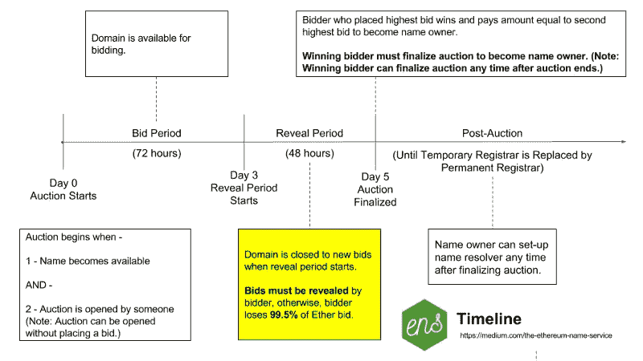

ENS 注册时间表

首先，我们需要确保我们想要的名称可用。在写这本书的时候，我们真的很想注册这个名字`mastering.eth`，但是唉，在 MyCrypto.com 上搜索 ENS 的名字发现它已经被占用了！因为 ENS 注册仅持续一年，所以将来有可能保护该名称。与此同时，我们来搜索一下`ethereumbook.eth`。

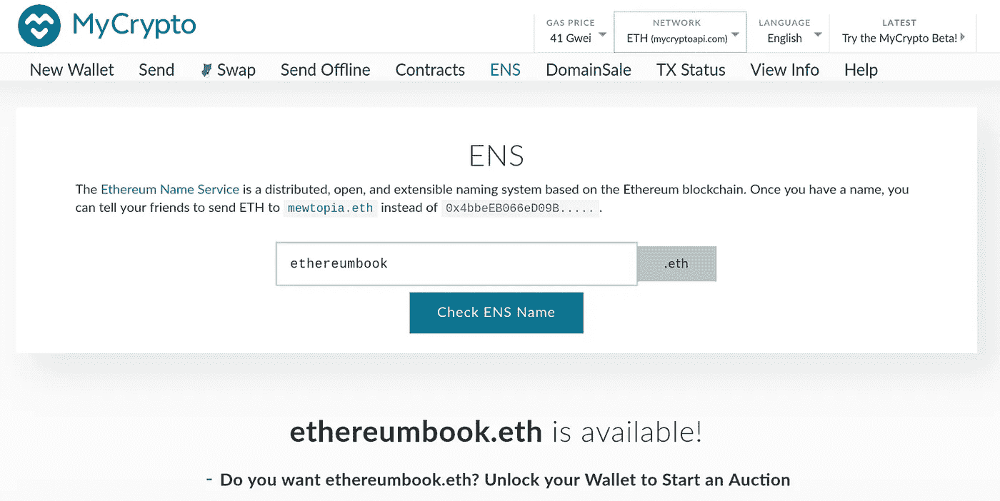

图 6。在 MyCrypto.com 搜索 ENS 名称

太好了！该名称可用。为了注册它，我们需要开始拍卖一个 ENS 名称。让我们解开元面具，开始拍卖`ethereumbook.eth`。

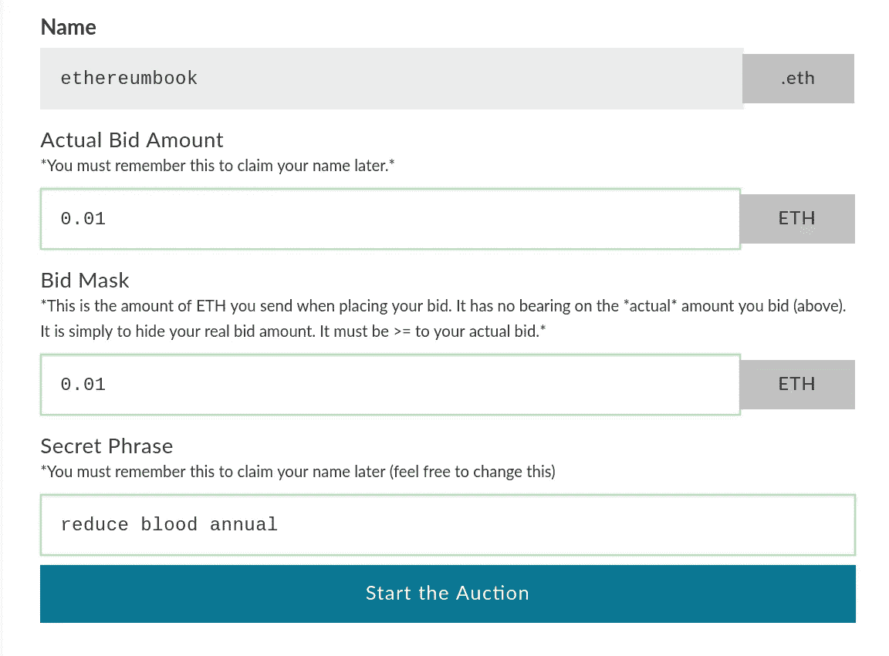

开始拍卖一个 ENS 名称

让我们出价吧。为了做到这一点，我们需要遵循投标 ENS 名称的步骤。

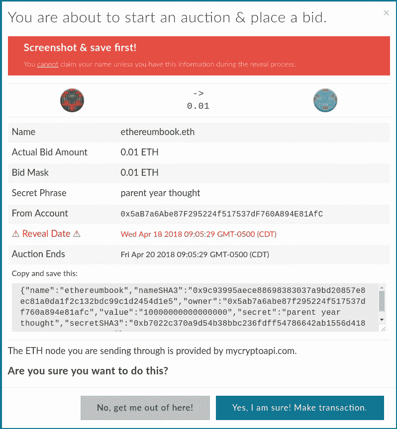

对 ENS 名称进行投标

**警告** 正如维克瑞拍卖所提到的，你必须在拍卖结束后的 48 小时内公开你的出价，否则你*将失去你出价的资金*。我们是不是忘了这么做，自己损失了 0.01 ETH？你打赌我们做到了。

截屏，保存您的秘密短语(作为您出价的备份)，并在您的日历中添加揭示日期和时间的提醒，这样您就不会忘记和丢失您的资金。

最后，我们通过单击包含您的出价的 MetaMask 交易中显示的绿色大提交按钮来确认交易。

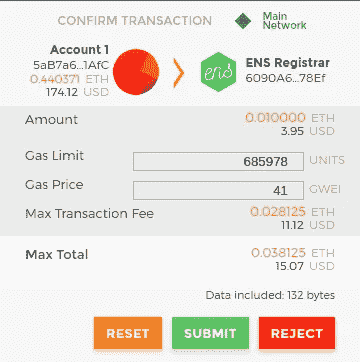

包含您的出价的元掩码交易

如果一切顺利，以这种方式提交交易后，您可以在 48 小时内返回并显示出价，您请求的名称将被注册到您的以太坊地址。

## 管理您的 ENS 名称

一旦您注册了一个 ENS 名称，您就可以使用另一个用户友好的界面来管理它: [ENS Manager](https://manager.ens.domains/) 。

进入后，在搜索框中输入要管理的名称(参见 ENS 管理器 web 界面)。您需要解锁您的以太坊钱包(例如元掩码)，以便 ENS 经理 DApp 可以代表您管理名称。


ENS 管理器网络界面

从这个接口，我们可以创建子域，设置解析器契约(稍后将详细介绍)，并将每个域名连接到适当的资源，例如 DApp 前端的群地址。

**创建 ENS 子域**

首先，让我们为示例拍卖 DApp 创建一个子域(参见添加子域`auction.ethereumbook.eth`)。我们将子域命名为 auction，因此完全限定名将是`auction.ethereumbook.eth`。

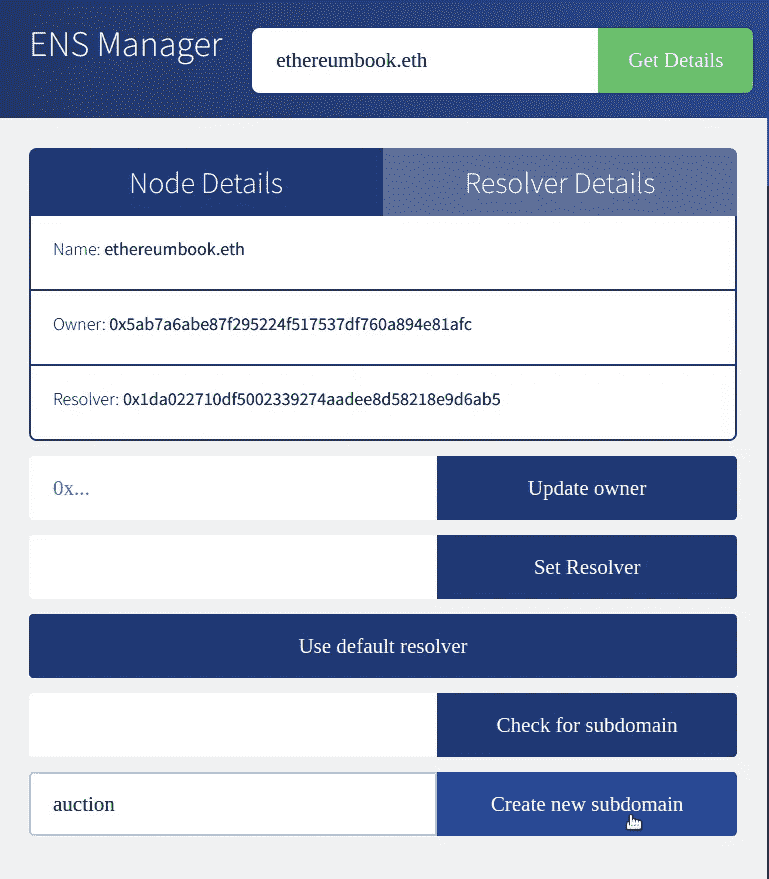

添加子域 auction.ethereumbook.eth

一旦我们创建了子域，我们可以在搜索框中输入`auction.ethereumbook.eth`并管理它，就像我们之前管理域`ethereumbook.eth`一样。

## ENS 解析器

在 ENS 中，解析名称是一个两步过程:

1.  ENS 注册表在散列后用名称来解析。如果记录存在，注册中心将返回其解析器的地址。
2.  使用适合于所请求资源的方法调用解析程序。解析器返回所需的结果。

这个两步过程有几个好处。将解析器的功能从命名系统中分离出来给了我们更多的灵活性。名称的所有者可以使用自定义解析器来解析任何类型或资源，扩展了 ENS 的功能。例如，如果将来您想要将地理位置资源(经度/纬度)链接到 ENS 名称，您可以创建一个新的解析器来回答一个`geolocation`查询。谁知道将来什么样的应用会有用呢？使用自定义解析器，唯一的限制是您的想象力。

为了方便起见，有一个默认的公共解析器，可以解析各种资源，包括地址(用于钱包或合同)和内容(用于 dApp 或合同源代码的群哈希)。

由于我们想要将我们的拍卖 dApp 链接到一个 Swarm hash，我们可以使用公共解析器，它支持内容解析，如设置`auction.ethereumbook.eth`的默认公共解析器所示；我们不需要编码或部署定制的解析器。

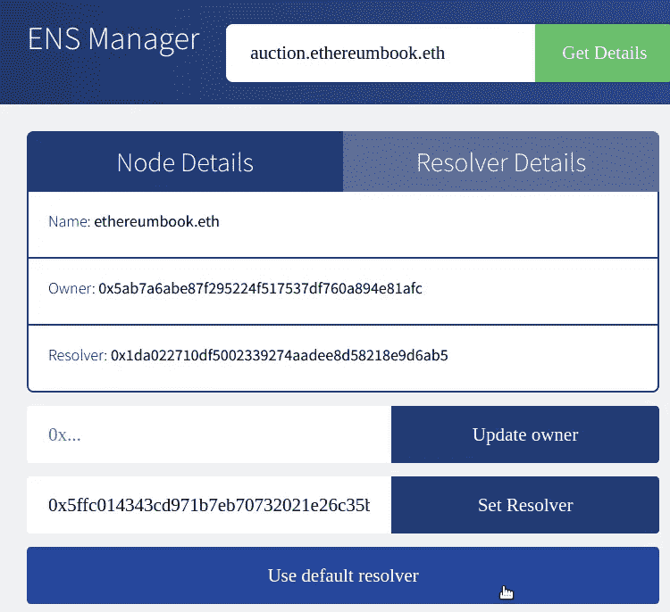

为 auction.ethereumbook.eth 设置默认公共解析程序

## 将名称解析为群组散列(内容)

一旦`auction.ethereumbook.eth`的解析器被设置为公共解析器，我们可以将其设置为返回 Swarm hash 作为我们名字的内容(参见设置`auction.ethereumbook.eth`返回的“内容”)。

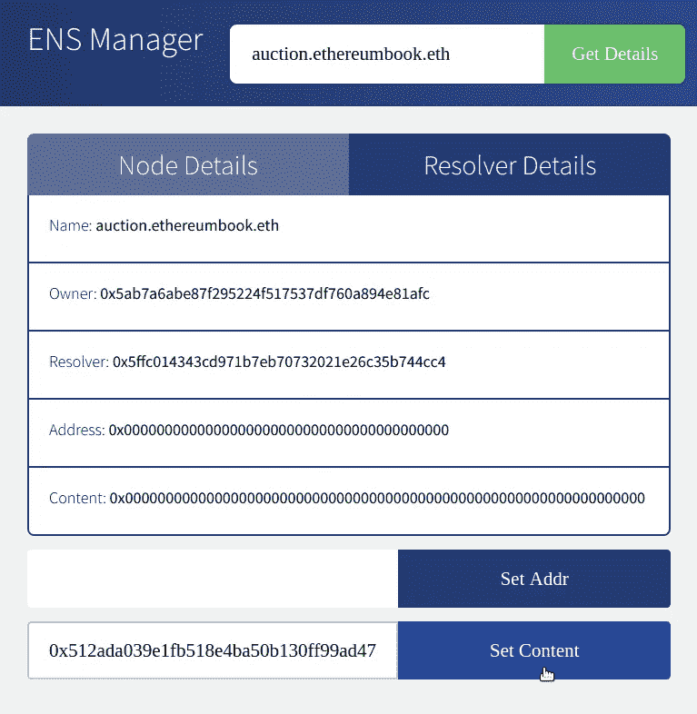

将“内容”设置为 return for auction . ethereumbook . eth

在等待我们的交易被确认后，我们应该能够正确地解析名称。在设置名称之前，我们的拍卖 dApp 可以通过其散列在群网关上找到:

*   [*https://swarm gateways . net/bzz:/ab 164 cf 37 DC 10647 e 43 a 233486 CD effa 8334 b 026 e 32 a 480 DD 9 CBD 020 c12d 4581*](https://swarm-gateways.net/bzz:/ab164cf37dc10647e43a233486cdeffa8334b026e32a480dd9cbd020c12d4581)

或者通过在 DApp 浏览器或群网关中搜索群 URL:

*   *bzz://ab 164 cf 37 DC 10647 e43 a 233486 CD effa 8334 b 026 e 32 a 480 DD 9 CBD 020 c12d 4581*

现在我们已经将它附加到一个名称上，这就简单多了:

*   [*http://swarm-gateways.net/bzz:/auction.ethereumbook.eth/*](http://swarm-gateways.net/bzz:/auction.ethereumbook.eth/)

我们也可以在任何一个与 ENS 兼容的钱包或 DApp 浏览器(如 Mist)中搜索“auction.ethereumbook.eth”来找到它。

# 从 App 到 DApp

在过去的几节中，我们已经逐步构建了一个分散的应用程序。我们从一对智能合同开始，为 ERC721 契约进行拍卖。这些合同被设计成没有管理或特权账户，因此它们的操作是真正分散的。我们添加了一个用 JavaScript 实现的前端，为我们的 dApp 提供了一个方便且用户友好的界面。拍卖 dApp 使用分散式存储系统 Swarm 来存储图像等应用资源。dApp 还使用分散式通信协议 Whisper 为每次拍卖提供加密聊天室，无需任何中央服务器。

我们将整个前端上传到 Swarm，因此我们的 dApp 不依赖任何 web 服务器来提供文件。最后，我们使用 ENS 为我们的 dApp 分配了一个名称，将它连接到前端的 Swarm hash，这样用户就可以用一个简单易记的人类可读名称来访问它。

每走一步，我们都增加了应用程序的分散性。最终的结果是一个 dApp，它没有权威的中心点，没有失败的中心点，并且表达了“web3”的愿景。

拍卖 dApp 架构显示了拍卖 dApp 的完整架构。

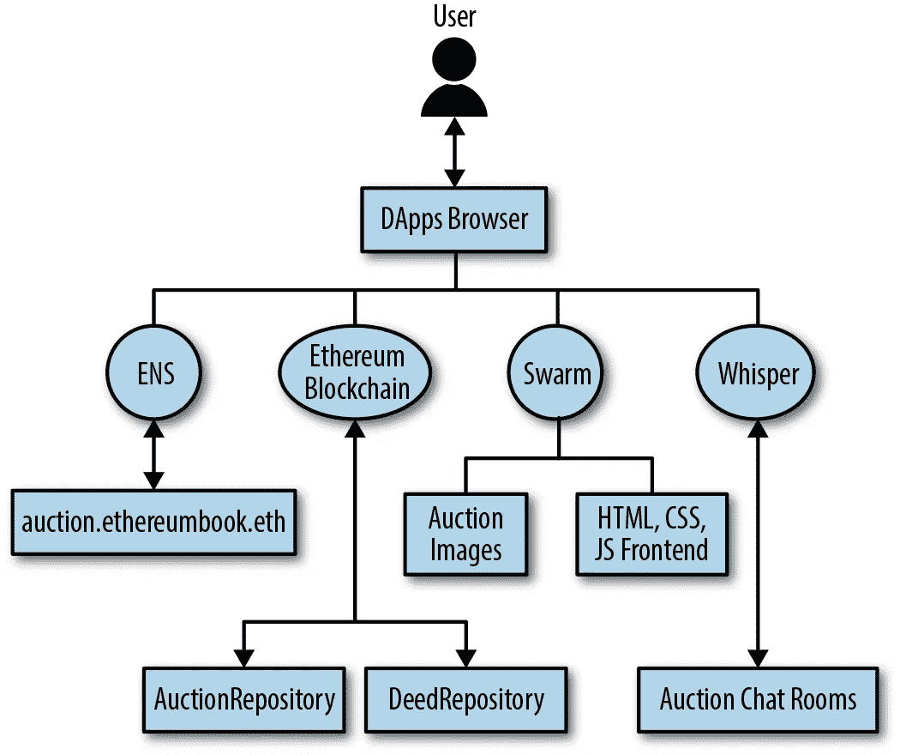

拍卖 DApp 建筑

# 结论

正如创始人在最早的设计中所表达的，分散式应用是以太坊愿景的顶点。虽然今天很多应用程序自称为“dApps ”,但大多数并没有完全去中心化。

然而，构建几乎完全去中心化的应用程序已经成为可能。

随着时间的推移，随着技术的进一步成熟，我们越来越多的应用程序可以去中心化，从而产生一个更有弹性、抗审查和自由的网络。