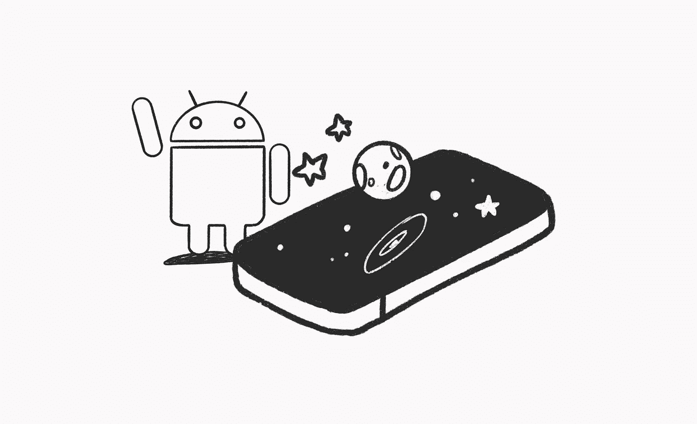
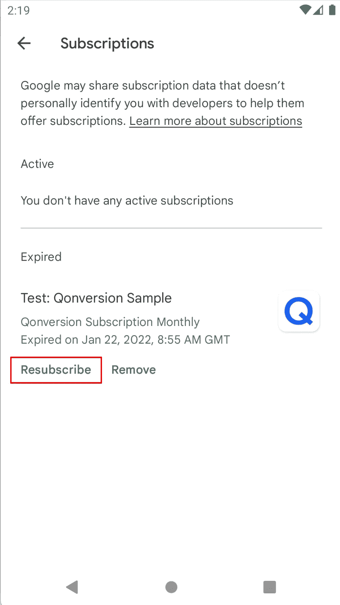

# Google Play 应用内购买和订阅实施的完整指南

> 原文：<https://betterprogramming.pub/a-complete-guide-to-google-play-in-app-purchases-and-subscriptions-implementation-ab8a314fcefb>

## 以及如何使用 Qonversion



包括应用内订阅在内的应用内购买是提供数字服务的移动应用货币化的主要方式。

这篇文章是一个全面的指南，介绍如何使用 Google Play 的计费系统将应用内购买添加到 Android 应用中，该系统允许您销售数字产品。

# 主要术语

1.  [Google Play](https://play.google.com/) app 允许用户下载应用程序和其他数码产品。
2.  [Google Play 控制台](https://developer.android.com/distribute/console)允许开发者创建和发布应用程序，在你的应用程序中配置你想要销售的数字产品。
3.  [Google Play 计费库](https://developer.android.com/google/play/billing/billing_library_overview)。Google Play 的计费系统可以通过 Google Play 计费库访问。它提供了一个发送应用内计费请求和管理应用内计费交易的界面。它是 Android 应用程序和 Google Play 应用程序之间的中介。
4.  [Google Play 开发者 API](https://developers.google.com/android-publisher) 是一组与 Google Play 通信的 REST APIs。它允许您查询和管理应用内产品，检查应用内订阅状态，并验证购买以检测欺诈行为。
5.  产品 SKU(库存单位)是一个产品 ID。

# 应用内产品类型

有两种类型的数字产品:

1.[定期订阅](https://developer.android.com/google/play/billing/subs)。具有重复计费周期的应用内产品:

用户必须在每个计费周期付费，才能继续使用应用程序的高级(完整)功能。订阅会自动续订，直到被取消。您可以配置以下订阅选项:

*   免费试用。这使得用户可以在付费前试用这些功能。试用期限应该在 3 到 999 天之间。
*   介绍价格。给新用户一定时间的折扣。
*   宽限期。为用户提供解决付款问题的时间，并保持订阅有效。您可以在此了解更多关于订阅状态的信息[。](https://developer.android.com/google/play/billing/integrate#life)
*   重新订阅选项。允许用户在取消订阅后重新订阅 Play Store。



您可能希望在 android 应用程序订阅到期后赢回用户，并为他们提供一个带有折扣、免费试用或介绍价格的产品 id。这种产品的标识符称为[赢回 SKU](https://developer.android.com/google/play/billing/subscriptions#after-in-app) 。

订阅的例子:电影流媒体服务。

2.一次性产品。付款方式的非经常性费用。Google Play 计费支持两种类型的一次性产品:

*   非消耗性产品是指一旦购买就不能再购买的产品。它与用户的 Google Play 帐户永久关联。非消耗性产品的例子:游戏中的高级赛道。
*   消费品是一种可以回购的产品。它暂时与用户的 Google Play 帐户关联。消费品的例子:游戏中的硬币。

# 引擎盖下的 Google Play 计费系统


我们来看看客户端(带有 Android 计费库的 app)和服务器的交互。当用户启动任何与 Google Play 计费库相关的交易时，通常会与 Google Play 应用程序进行通信，以处理 Google Play 服务器。您还需要后端服务器和 Google Play 开发者 API 之间的通信。您的后端服务器负责典型的用例，如支付验证或当用户取消订阅时从 Google Play 开发者 API 获得通知。

出于几个原因，您需要验证购买。其中之一是防止黑客入侵你的应用程序并伪造成功购买。在应用程序中启用高级访问之前，您需要确保从 Google Play 获得的任何信息都是有效的。

# 做好准备

在你的应用程序中销售产品之前，你必须遵循以下步骤。

1.[创建开发者账号](https://support.google.com/googleplay/android-developer/answer/6112435)。Google 提供了详细的文档。

2.[创建并设置你的应用](https://documentation.qonversion.io/docs/app-creation-in-google-play-console)。创建 Google Play 开发者帐户后，您可以使用 Google Play 控制台创建和配置应用程序。创建应用程序后，您可以开始配置它。该应用程序的仪表盘会引导您完成在 Google Play 上使用它的所有步骤。

3.将依赖项添加到应用程序的 build.gradle 文件中，如下所示:

```
dependencies {
    implementation "com.android.billingclient:billing:3.0.2"
}
```

在继续下一步之前，您必须在 Google Play 控制台中发布您已签名的 Android 应用程序。你必须在生产、alpha 或 beta 渠道发布你的应用。当您的应用处于审核状态且未发布时，您的应用内购买将不起作用。

4.设置测试环境。您可以在 Google Play 控制台中为开发者帐户配置许可证测试。应用程序许可允许您设置一个 Gmail 帐户列表来测试您的应用程序内购买。您不必在这里添加发布帐户，因为默认情况下它被认为是授权的测试者。

# 履行

在你等待 app 审核的同时，我们来给 app 添加 Google Play 安卓计费库。

# 1.计费客户端实例

在我们的例子中，为了简单起见，所有与 Google Billing library 系统的交互都发生在`MainActivity`类中。为了保持业务逻辑独立于 UI 并使其可测试，最好使用一个单独的类来与真正的应用程序中的`BillingClient`进行交互。`BillingClient`提供与计费库交互的接口。

MainActivity 实现两个接口:`PurchasesUpdatedListener` 和`BillingClientListener`。

```
class MainActivity : AppCompatActivity(), PurchasesUpdatedListener, BillingClientStateListener {
   private lateinit var billingClient: BillingClient
   private val skusWithSkuDetails = mutableMapOf<String, SkuDetails>()
...
```

使用`newBuilder()`创建一个 BillingClient 实例。设置一个 PurchaseUpdateListener，当检测到新的购买时，计费库将调用它。`onPurchaseUpdated`功能的实现将在下文中介绍。

```
private fun startBillingServiceConnection() {
   billingClient = BillingClient.newBuilder(this)
       .enablePendingPurchases()
       .setListener(this).build() connectToBillingService()
}
```

# 2.建立联系

通过调用`startConnection()`建立连接，并将`BillingClientStateListener`的一个实例作为参数传递。连接成功时会触发`onBillingSetupFinished()`方法。之后，你可以获得可用的应用内产品进行购买，并从计费缓存中获取购买内容。当调用`onBillingServiceDisconnected()`时，您必须重启连接。

```
private fun connectToBillingService() {
   if (!billingClient.isReady) {
       billingClient.startConnection(this)
   }
}override fun onBillingSetupFinished(billingResult: BillingResult) {
   if (billingResult.responseCode == BillingClient.BillingResponseCode.OK) {
      // The billing client is ready. Retrieve in-app products and subscriptions details
      querySkuDetailsAsync(BillingClient.SkuType.INAPP, INAPP_SKUS)
      querySkuDetailsAsync(BillingClient.SkuType.SUBS, SUBS_SKUS) // Refresh your application access based on the billing cache
      queryPurchases()
   }
}override fun onBillingServiceDisconnected() {
   connectToBillingService()
}
```

Google Play 控制台中设置了产品 id。

```
private object GameSku {
   const val WEEKLY = "weekly"
   const val ANNUAL = "annual"
   const val COIN = "coin"
   const val RACE_TRACK = "race_trake" val INAPP_SKUS = listOf(COIN, RACE_TRACK)
   val SUBS_SKUS = listOf(WEEKLY, ANNUAL)
   val CONSUMABLE_SKUS = listOf(COIN)
}
```

# 3.检索产品、订阅、价格等

一旦`BillingClient`准备就绪，您就可以从 Google Play 控制台查询产品的 [SkuDetails](https://developer.android.com/reference/com/android/billingclient/api/SkuDetails) 。BillingClient 将应用内产品称为“INAPP ”,将订阅称为“SUBS”。

```
private fun querySkuDetailsAsync( 
   @BillingClient.SkuType skuType: String,
   skuList: List<String>
) {
   val params = SkuDetailsParams
       .newBuilder()
       .setSkusList(skuList)
       .setType(skuType)
       .build() billingClient.querySkuDetailsAsync(
       params
   ) { billingResult, skuDetailsList ->
       if (billingResult.responseCode == BillingClient.BillingResponseCode.OK && skuDetailsList != null) {
           for (details in skuDetailsList{
               skusWithSkuDetails[details.sku] = details
           }
       }
   }
}
```

我们大部分时间从 Google Billing API 获得成功响应代码，但是请记住，您需要处理来自 Billing 的其他 11 个[响应](https://developer.android.com/reference/com/android/billingclient/api/BillingClient.BillingResponseCode)。

# 4.检查以前的购买

检索用户的所有活动购买和非消耗性应用内产品。

```
private fun queryPurchases() {
   val purchasesResult = HashSet<Purchase>()
   var result = billingClient.queryPurchases(BillingClient.SkuType.INAPP)
   result.purchasesList?.apply { purchasesResult.addAll(this) } result = billingClient.queryPurchases(BillingClient.SkuType.SUBS)
   result.purchasesList?.apply { purchasesResult.addAll(this) }
   processPurchases(purchasesResult) 
}
```

`processPurchases`函数的实现将在下文中介绍。

# 5.购买产品

通过调用`launchBillingFlow()`并传递一个`BillingFlowParams`实例作为参数，启动一个计费流程。

```
private fun purchase(skuDetails: SkuDetails) {
   val params = BillingFlowParams.newBuilder(
       .setSkuDetails(skuDetails)
       .build() billingClient.launchBillingFlow(this, params)
       .takeIf { billingResult -> billingResult.responseCode != BillingClient.BillingResponseCode.OK }
       ?.let { billingResult ->
           Log.e("BillingClient", "Failed to launch billing flow $billingResult")
       }
 }
```

用户购买后，你会在`*onPurchasesUpdated*()`函数中收到响应。

```
override fun onPurchasesUpdated(
   billingResult: BillingResult,
   purchases: MutableList<Purchase>?
) {
   when (billingResult.responseCode) {
       BillingClient.BillingResponseCode.OK -> {
           purchases?.apply { processPurchases(this.toSet()) }
       }
       BillingClient.BillingResponseCode.ITEM_ALREADY_OWNED -> {
           // call queryPurchases to verify and process all owned items
           queryPurchases()
       }
       BillingClient.BillingResponseCode.SERVICE_DISCONNECTED -> {
           connectToBillingService()
       }
       else -> {
           Log.e("BillingClient", "Failed to onPurchasesUpdated")
       }
   }
}
```

# 6.处理采购:消费和确认采购

如果你在三天内没有确认，购物将被退款。要确认购买，首先检查购买状态是否为已购买，而不是待定。

在向用户授予权限并确认购买之前，在服务器上进行验证:确保购买令牌有效。对于一次性产品，称为`consumeAsync()`方法。对于非消耗性应用内产品和订阅，使用`acknowledgePurchase()`方法。

```
private fun processPurchases(purchases: Set<Purchase>) {
   purchases.forEach { purchase ->
       if (purchase.purchaseState == Purchase.PurchaseState.PURCHASED) {
        // Implement server verification
        // If purchase token is OK, then unlock user access to the content
        acknowledgePurchase(purchase)
       }
   }
}
```

该示例使用下面的检查`if (isSkuConsumable(purchase.sku))`来确定应该调用哪个方法:消费或确认。您必须根据应用程序的逻辑来验证消耗品的购买。

```
private fun acknowledgePurchase(purchase: Purchase) {
   val skuDetails = skusWithSkuDetails[purchase.sku] ?: run {
       Log.e("BillingClient", "Could not find SkuDetails to acknowledge purchase")
       return
   }
    if (isSkuConsumable(purchase.sku)) {
       consume(purchase.purchaseToken)
    } else if (skuDetails.type == BillingClient.SkuType.SUBS && !purchase.isAcknowledged) {
       acknowledge(purchase.purchaseToken)
    }
}private fun isSkuConsumable(sku: String) = CONSUMABLE_SKUS.contains(sku)private fun consume(purchaseToken: String) {
   val params = ConsumeParams.newBuilder()
       .setPurchaseToken(purchaseToken)
       .build() billingClient.consumeAsync(
       params
   ) { billingResult, token ->
       when (billingResult.responseCode) {
           BillingClient.BillingResponseCode.OK -> {
               entitleUserProducts()
           }
           else -> {
               Log.e("BillingClient", "Failed to consume purchase $billingResult")
           }
       }
   }
}private fun acknowledge(purchaseToken: String) {
   val acknowledgePurchaseParams = AcknowledgePurchaseParams.newBuilder()
       .setPurchaseToken(purchaseToken)
       .build() billingClient.acknowledgePurchase(
       acknowledgePurchaseParams
   ) { billingResult ->
       when (billingResult.responseCode) {
           BillingClient.BillingResponseCode.OK -> {
               entitleUserProducts()
           }
           else -> {
               Log.e("BillingClient", "Failed to acknowledge purchase $billingResult")
           }
       }
   }
}
```

# 7.授予用户对应用程序内容的权限

最后，解锁用户对适用内容的访问。启动应用程序，购买应用内产品，并确保一切正常工作。

# 如何实施

有一些工具可以帮助你简化 Google Play 计费系统的实现。比如可以用 [Qonversion](https://qonversion.io/) 。它提供了后端基础设施来验证用户收据，并管理用户对应用程序上付费内容的跨平台访问，因此您无需构建自己的服务器。

Qonversion 允许您从 Google Play 控制台创建产品、识别产品并将其与应用内产品相关联。然后，您可以创建权限来访问您的应用程序中的高级功能。

要进行购买，调用如下所示的`Qonversion.purchase()`方法。购买成功后，您将在 *onSuccess* 回调中收到带有权限的响应。否则，`onError`带有详细的错误描述。

```
Qonversion.purchase(
   this,
   product,
   object : QonversionPermissionsCallback {
     override fun onSuccess(permissions: Map<String, QPermission>) {
         // Grant user entitlements to the app content
     } override fun onError(error: QonversionError) {
         // Handle the error
     }
})
```

每当您想获得最近的订阅状态并管理用户对优质内容的访问时，调用`Qonversion.checkPermissions()`方法。

```
Qonversion.checkPermissions(object : QonversionPermissionsCallback {
   override fun onSuccess(permissions: Map<String, QPermission>) {
       // Grant entitlement to the user
   } override fun onError(error: QonversionError) {
       // Handle the error
   }
})
```

# 参考

1. [Google Play 的计费系统概述](https://developer.android.com/google/play/billing)。

2. [Google Play 计费样本](https://github.com/android/play-billing-samples)。

3.[深入了解 Google Play 计费库](https://www.droidcon.com/media-detail?video=390702960)。

4. [Google Play 的计费系统集成](https://documentation.qonversion.io/docs/google-plays-billing-integration)。

*原载于 2021 年 2 月 25 日*[*https://qonversion . io*](https://qonversion.io/blog/a-complete-guide-to-google-play-in-app-purchases-and-subscriptions-implementation/)