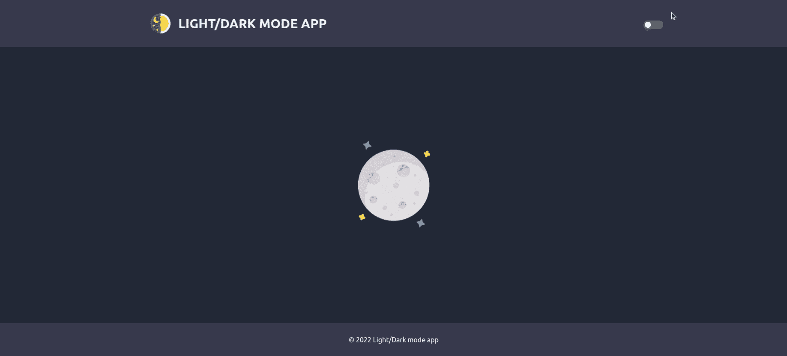
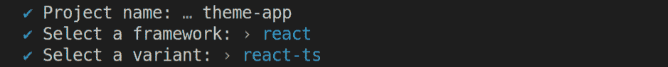
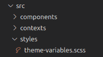

# React 中实现黑暗模式的完整指南

> 原文：<https://betterprogramming.pub/a-complete-guide-to-implementing-dark-mode-in-react-47af893b22eb>

## 想通过提供黑暗模式选项使您的网站更容易访问和更时尚吗？以下是关于如何在 React 中实施黑暗模式的分步指南。



## **步骤 1:** 使用 Vite 创建 React 应用程序(如果已经创建，则跳过)

让我们从创建 React 应用程序开始。我将用最流行的构建工具之一 **Vite** 来建立这个项目。一个很大的优点是它简化并加速了开发过程。

使用以下命令来设置项目。

```
$ yarn create vite
```

Vite 会要求写一个*项目名*，*选择一个框架*，*选择一个变体*。

对于本指南，我将选择`react`作为框架，选择`react-ts`作为变体。



一旦你设置好你的应用程序，导航到你的项目，安装依赖项，我们就可以开始了。

## **第二步:**创建主题上下文

在`/src/contexts`文件夹中打开一个 theme-context.ts 文件，创建主题上下文。

```
// theme-context.tsimport { createContext } from 'react';export const ThemeContext = createContext({
  theme: '',
  setTheme: (theme: string) => {},
});
```

上下文将接收“亮”或“暗”作为输入，并将返回相同的内容作为输出。

## **步骤 3:** 创建`theme-variables.scss`文件，包含明暗主题的变量

在 src 中打开一个文件夹，并将其命名为 styles。在文件夹内创建一个`theme-variables.scss`文件。



`theme-variables.scss`文件将包含亮暗模式的颜色选择。

该文件将包括两个对象命名为光明和黑暗，其中每个主题将有不同的颜色选项相同的关键。

两个对象中必须有相同的键。

```
// theme-variables.scss$themes: (
  light: (
    colorHeaderFooter: #fff,
    colorText: #000,
    colorBackground: #f8f8fa,
  ), dark: (
    colorHeaderFooter: #36394c,
    colorText: #eff2f7,
    colorBackground: #222736,
  ),
);
```

接下来，我们将创建一个名为`themify`的 mixin 来生成黑暗和光明主题。

然后我们将创建一个名为`themed`的函数，它将接收一个颜色键作为参数，并返回当前主题的颜色值。

```
// theme-variables.scss@mixin themify($themes) {
  @each $theme, $map in $themes {
    .theme-#{$theme} & {
      $theme-map: () !global;
      @each $key, $submap in $map {
        $value: map-get(map-get($themes, $theme), '#{$key}');
        $theme-map: map-merge(
          $theme-map,
            (
              $key: $value,
            )
          ) !global;
        }
        @content;
        $theme-map: null !global;
      }
   }
}@function themed($key) {
  @return map-get($theme-map, $key);
}
```

文件准备就绪后，导航至`src/App.tsx`文件。

## **步骤 4:** 在主题上下文中包装 App 组件

在`App.tsx`文件中导入在**步骤 2** 中创建的`Theme`上下文。

```
// App.tsximport { ThemeContext } from './contexts/theme-context';
```

为当前主题创建一个状态，现在让我们设置默认值为“光”。

在最后一步，我们将介绍如何检测浏览器的模式，并在此基础上决定默认模式。

```
// App.tsxconst [theme, setTheme] = useState('light');
```

最后但同样重要的是，将整个组件包装在`Theme`提供者中。

```
// App.tsx<ThemeContext.Provider value={{ theme, setTheme }}>
  <div className={`theme-${theme}`}>
    <Layout>
       // Your code here
    </Layout>
  </div>
</ThemeContext.Provider>
```

因此，在上下文提供者的帮助下，我们将获得当前的主题名称，并在主题包装器的类名中使用它。

编译之后，我们将拥有 div `**theme-light**`或`**theme-dark**`的`className`。

现在我们准备在项目的任何`.scss`文件中使用颜色变量。

在需要的地方输入`theme-variables.scss`。

借助上面声明的`themed`函数，使用`@include`指令获取颜色值。下面我们正在设置头部组件的背景。

```
// header.tsx@import '../styles/theme-variables.scss';.header {
  @include themify($themes) {
    background: themed('headerFooterBackground');
  }
}
```

编译后，我们将得到以下内容:

```
.theme-light .header {
   background: #fff;
}.theme-dark .header {
   background: #36394c;
}
```

## **步骤 5:** 创建一个带有亮/暗模式切换按钮的布局组件

现在让我们创建一个简单的切换按钮来切换主题。

```
// header.tsximport { FC, useContext } from 'react';
import { ThemeContext } from '../contexts/theme-context';import logoIcon from '../images/logo-icon.png';
import './styles.scss';const Header: FC = () => { const { theme, setTheme } = useContext(ThemeContext); const handleThemeChange = () => {
    const isCurrentDark = theme === 'dark';
    setTheme(isCurrentDark ? 'light' : 'dark');
  }; return (
    <header className="header">
      <div className="header-content">
        <a href="/" className="logo-section">
          
          <span>Light/Dark mode app</span>
        </a>
        <div className="toggle-btn-section">
          <div className={`toggle-checkbox m-vertical-auto`}>
            <input
              className="toggle-btn__input"
              type="checkbox"
              name="checkbox"
              onChange={handleThemeChange}
              checked={theme === 'light'}
            />
            <button type="button" className={`toggle-btn__input-label`} onClick={handleThemeChange}></button>
          </div>
        </div>
      </div>
    </header>
  );
};export default Header;
```

在切换点击时，主题值将在上面声明的`handleThemeChange`函数的帮助下改变。

## **第六步:**检测浏览器的默认模式，设置默认主题

在`App.tsx`文件中，我们将主题的默认值设置为 light。

因此，每当用户第一次进入网站，主题值将被设置为轻。

在这一步中，我将展示如何检测浏览器的默认主题，并将其用作默认主题。我们可以借助`matchMedia`轻松检查。

```
// App.tsxconst isBrowserDefaultDark = () => window.matchMedia('(prefers-color-scheme: dark)').matches;
```

如果浏览器的模式是黑暗的，函数`isBrowserDefaultDark`将返回 true。

现在我们可以在`App.tsx`中设置浏览器的默认值。

```
// App.tsxconst [theme, setTheme] = useState(isBrowserDefaultDark() ? 'dark' : 'light');
```

## **第七步:**在 localStorage 中设置默认主题

最后但同样重要的是，我们将主题保存在`localStorage`中，每次用户进入你的网站时，默认主题将从本地存储中获取。

我们将进入放置切换按钮的`header.tsx`中的`localStorage`主题。

在函数`handleThemeChange`中，我们在切换时更改了主题，单击添加以下行:

```
// header.tsxconst handleThemeChange = () => {
  const isCurrentDark = theme === 'dark';
  setTheme(isCurrentDark ? 'light' : 'dark');
  **localStorage.setItem('theme', isCurrentDark ? 'light' : 'dark');**
};
```

现在，当我们将默认主题存储在 localStorage 中时，我们可以在`App.tsx`文件中使用它来设置主题。

让我们创建一个函数，当用户进入网站时，它将返回默认主题。该函数将检查用户是否将主题存储在`localStorage`中，如果有，则返回值，否则将检查浏览器的模式并返回默认值。

```
// App.tsx// Detecting the default theme
const isBrowserDefaultDark = () => window.matchMedia('(prefers-color-scheme: dark)').matches;const getDefaultTheme = (): string => {
  const localStorageTheme = localStorage.getItem('default-theme');
  const browserDefault = isBrowserDefaultDark() ? 'dark' : 'light';
  return localStorageTheme || browserDefault;
};const [theme, setTheme] = useState(getDefaultTheme());
```

我们的黑暗模式应用程序已经准备好了。

感谢您阅读文章。

# 资源

*   [演示应用](https://62a677d060f8713eb70071fe--famous-entremet-fa56bf.netlify.app/)
*   [GitHub 回购](https://github.com/Veronika-Jaghinyan/light-dark-mode-app.git)