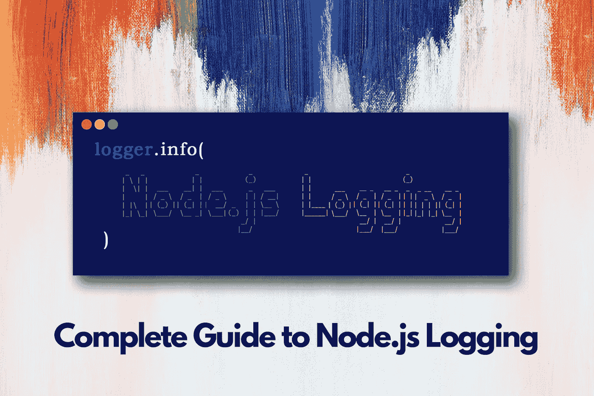
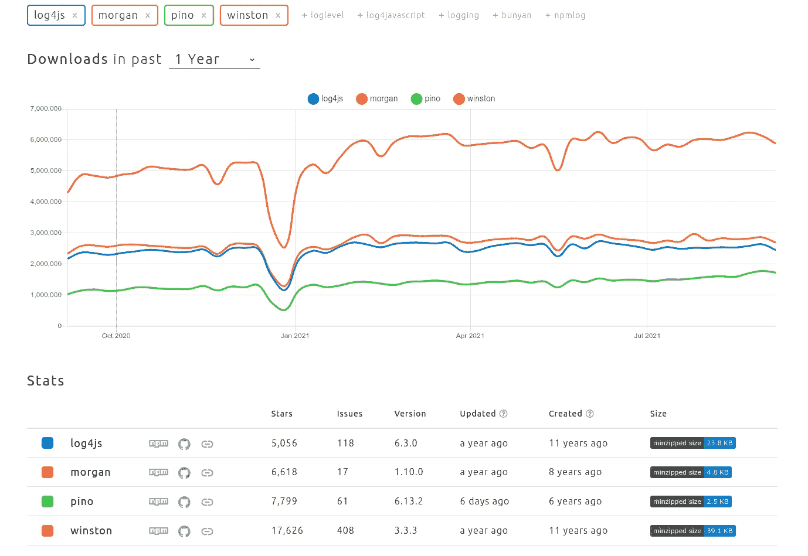
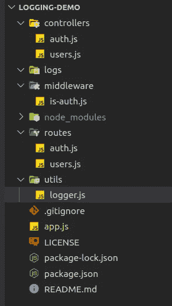
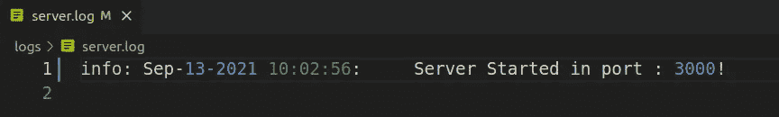
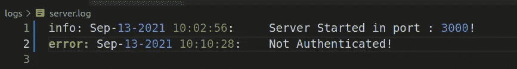
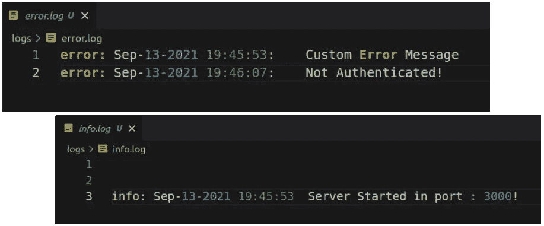
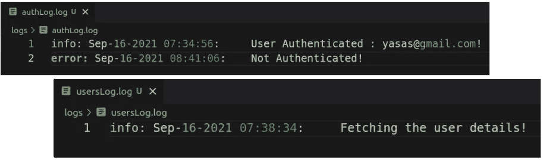
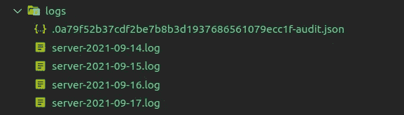

# Node.js 日志记录的完整指南

> 原文：<https://betterprogramming.pub/a-complete-guide-to-node-js-logging-1ba70a4a346d>

## 记录日志的最佳实践



背景由[马库斯·斯皮斯克](https://unsplash.com/@markusspiske?utm_source=unsplash&utm_medium=referral&utm_content=creditCopyText)于 [Unsplash](https://unsplash.com/?utm_source=unsplash&utm_medium=referral&utm_content=creditCopyText) |作者创作

如果我问你一个问题，哪个 JavaScript 函数对发现错误最有用，你明显的答案是`console.log`。

在开发阶段，无论是日志记录还是调试，都很容易检测到错误。但是当涉及到生产时，您应该考虑更多关于日志记录的内容，因为它对于应用程序的监控和故障排除至关重要。

本文将通过解释核心概念和最佳实践，指导您实现完全灵活的日志框架。在进入实现之前，让我们从基础开始。

# 什么是日志记录，为什么它很重要？

日志记录是将应用程序活动生成的信息记录到日志文件中的过程。保存在日志文件中的记录称为日志。日志是保存应用程序信息的一种简单方式。

对于程序员来说，日志是追踪错误和事件流的第一个地方，尤其是来自服务器的。

在开发过程中跟踪错误时，您通常会使用`console.log`或运行调试器。

但是当应用程序进入生产阶段，用户开始与之交互时，你就再也不能`console.log`了。如果出现问题，应用程序崩溃，你不能用控制台检查。

这就是为什么我们需要一个简洁、干净、高质量的日志框架。

相反，通过提供实时日志事件流，这些日志可用于实时诊断异常、恶意软件活动或未经授权的资源访问。这是对系统的额外保护。

因此，最终，这些日志将使开发人员、开发人员、系统管理员或 SecOps 更容易获得洞察力，并确定应用程序和基础架构问题的根本原因。

# 日志记录级别

这是任何日志系统中最重要的部分。日志级别是日志的元数据。该级别定义了记录事件的严重性。

将日志级别放在第一位的原因是为了让您可以快速看到哪些日志需要更多的关注。

日志记录有五个主要级别。根据优先级，它可以进行如下排序:

*   `ERROR` **:** 处理当前操作时出现严重问题/故障。系统操作员应尽快处理此事。
*   `WARN` **:** 这些日志是警告，不会阻止应用程序继续运行，它们在检测到意外的应用程序问题时提供警报。对于管理员来说，检查以决定是否应该解决这个问题是很有用的。
*   `INFO` **:** 应用程序的正常行为，说明发生了什么。不一定要求你跟进。
*   `DEBUG` **:** 这个级别是给开发者的。它以详细的方式给出诊断信息。这用于获取诊断、故障排除或测试应用程序所需的信息。
*   `TRACE` **:** 这个级别捕获关于应用程序行为的所有细节。它主要用于跟踪应用程序逻辑的全部细节。

**注意**:任何日志记录器的正常行为都是只跟踪当前级别和以上级别的日志。因此，如果您将日志级别设置为`INFO`，您将只获得具有`INFO`、`WARN`和`ERROR`级别的日志事件。

# 日志记录的最佳实践

在实现日志记录系统之前，您一定要了解最佳实践，例如:

## 1)日志记录应该有意义并且有目的

不要添加不必要的日志，因为它们会很快变成噪音。此外，如果应用程序写日志的频率很高，它会直接影响应用程序的性能。

**注意**:除非代码库出现问题，否则我们不应在生产中启用`DEBUG`或`TRACE`级别。(解决问题后，确保将其切换回`INFO`或`ERROR`电平。 **)**

## 2.将日志分成几个日志文件，以防应用程序流量过大

在这种情况下，您的日志文件将会非常冗长，并且在分析时会遇到困难。您可以为不同的日志级别创建不同的日志文件，或者尝试使用大多数日志记录框架中都提供的滚动日志文件功能。

它会根据时间或大小压缩你的日志文件。大多数企业级应用程序都使用这种每日滚动日志文件功能。

## 3.日志记录应该分层次进行

正如我们在上面看到的，日志应该基于优先级来处理。这将有助于分析日志并在很短的时间内发现问题。

此外，使用日志名称空间保持整洁。作为最佳实践，您应该在日志记录时添加时间戳。

## 4.日志记录不应该导致错误或异常

有时日志会导致严重的错误。请看这个例子。假设有一个定义为→ `getUser(id)`的用户服务方法，如果我们想找到一个用户，我们需要传递他们的 id。假设您希望在处理时记录用户名。

```
logger.info(`Processing user: ${userService.getUser().getName()}`);
```

如果您忘记像这样传递 id，`getUser()`将返回 null，`getName()`将抛出一个异常。所以确保你不要犯这样愚蠢的错误。

## 5)记录器不应记录任何敏感信息

在登录时，我们必须确保不记录任何敏感信息，如用户名和密码，金融信息，如卡号，CVV 号码等。

好吧！我相信现在你已经完全了解了日志记录时应该使用的实践。让我们深入研究一下实现。

我们有哪些用于日志记录的库/框架？有许多库可以轻松地为您完成这项工作。

以下是 NPM 上最流行的 Node.js 日志库:

*   Winston——完全灵活的通用日志库。
*   mor gan——HTTP 请求记录器中间件。
*   Pino —超快(开销非常低)，全天然 JSON 记录器。
*   `Loglevel` —用于 JavaScript 的最小轻量级简单日志记录。
*   `log4js`—一个没有运行时依赖的框架。

在本文中，我们将使用 Winston 库。

# 为什么是温斯顿·洛奇？

Winston 是 Node.js 最强大、最灵活的开源日志库之一。

这是一个非常直观的工具，易于定制。您可以通过修改几行代码来调整其背后的逻辑。它使得对数据库或文件等持久存储位置的日志记录变得更加容易和简单。

让我们用 NPM 趋势来看看这个温斯顿图书馆的受欢迎程度。



来源:[https://www . NPM trends . com/log4js-vs-mor gan-vs-Pino-vs-Winston](https://www.npmtrends.com/log4js-vs-morgan-vs-pino-vs-winston)

正如你从分析中看到的，你可能会意识到温斯顿的受欢迎程度。但是是什么原因让它获得了这么多的观众呢？

原因是→温斯顿提供如下:

*   集中控制如何以及何时记录日志—在单一位置更改您的代码。
*   控制你的日志发送到哪里——保存你的日志到多个目的地(如 AWS S3，Elasticsearch，MongoDB 等。).
*   自定义日志记录格式——以时间戳为前缀、丰富多彩的日志记录级别、JSON 格式等等。

好吧！我们选择了一个最好的日志框架。现在让我们来实施这些事情。

# Node.js 中的 Winston 实现

我制作了一个简单的 REST 服务器来演示日志场景。为了简单起见，它目前只有两个 API。文件夹结构如下所示:



项目结构(图片由作者提供)

*   `app.js` —主入口
*   `routes` —处理路由
*   `middleware` —处理认证
*   `controllers` —处理 REST API 请求
*   `logs` —存储日志文件
*   `utils`—实现记录器

首先，我们需要使用以下命令添加 Winston 日志库:

```
npm i winston
```

任何使用`yarn`的人都可以在`yarn add winston`之前安装它，然后我们需要初始化记录器。为此，我已经在`utils`中创建了一个名为`logger.js` 的文件，让我们看看它是如何用下面的代码初始化的:

我们可以通过调用 Winston 库中的`createLogger`函数来初始化 logger。然后我们必须定义传输。这些运输工具是什么？

*日志需要放在某个地方。传输是保存日志的地方。*

有 30 多个传输选项，包括退出到一个文件、控制台或第三方系统，如 AWS 的 S3、Elasticsearch、MongoDB 等等。您可以向`transports:`阵列添加任意数量的运输工具。

如果你想了解更多关于这些交通工具的信息，你可以访问这个官方的 Winston GitHub 页面。

[](https://github.com/winstonjs/winston/blob/master/docs/transports.md) [## Winston js/Winston master 上的 winston/transports.md

### 在 winston 中，传输本质上是日志的存储设备。winston 记录器的每个实例都可以有…

github.com](https://github.com/winstonjs/winston/blob/master/docs/transports.md) 

在 transporter 对象中，我们可以给出一个文件名来存储我们的日志。接下来是有趣的部分。我们可以根据需要设置日志消息的格式。

默认情况下，日志记录没有被格式化，而是打印为带有两个参数的 JSON 字符串，即日志消息和级别。

然而，覆盖它并添加诸如预定义标记、时间戳、颜色等参数。如上所示，非常简单。

好吧！现在我们可以将记录器添加到我们的函数中。让我们在服务器启动时添加一个日志记录器。首先，我们需要导入记录器，然后我们可以调用它的功能。

```
const logger = require("./utils/logger");app.listen(port, () => {
  logger.info(`Server Started in port : ${port}!`);
});
```

看看这有多简单。我们可以在`logs/server.log`文件中看到如下输出。



我们还可以更改日志级别。让我们看看它是如何工作的。我将这个日志记录器添加到我的身份验证处理程序中。

```
if (!req.get("Authorization")) {
    logger.error("Not Authenticated!");
    return res.status(401).json({ message: "User Not Authenticated!" });
```

然后我们可以尝试在没有授权头的情况下触发这个 API，然后您可以在日志文件中看到错误日志。



这些 API 端点在我的自述文件中有明确的定义。你可以试试。在参考资料部分可以看到完整代码实现的链接。

**注意**:这仅用于演示目的。正如我前面提到的，日志应该是有意义的，也不应该到处使用，因为在添加这些日志时会有性能开销。

# 多重运输

我们可以有多种运输方式。将`logger.js`中的`createLogger`功能更改如下:

在日志文件夹中，您会看到在运行服务器后创建了新文件。



作者图片

**注意** : Winston 还没有开发出将传输限制在一个级别的功能。因此，我们需要实现自定义逻辑来做到这一点。您可以通过此链接探索更多可能的解决方案。

[](https://github.com/winstonjs/winston/issues/614) [## Winston 记录所有文件。(或者:将运输限制在一层)问题#614 …

### 此时您不能执行该操作。您已使用另一个标签页或窗口登录。您已在另一个选项卡中注销，或者…

github.com](https://github.com/winstonjs/winston/issues/614) 

# 多个记录器

Winston 允许您创建自定义记录器。这使您能够根据您的应用程序服务来控制和定制特定的记录器。

例如，对于用户服务和身份验证服务，我们可以有两个单独的记录器。

现在，我们可以在任何地方访问特定的日志表单，并添加日志。

在用户服务中，我们可以使用以下代码:

在认证服务中，将使用此代码:

如你所见，我们的日志将被分开显示。



作者图片

这使得管理日志变得更加容易，因为针对特定问题有单独的日志，并且提供了用户和事务属性来帮助将日志范围缩小到特定用户或事务。

# 每日滚动日志文件

正如我在最佳实践中提到的，这个特性允许根据条件轮换日志文件。

日志可以根据日期、大小限制进行轮换，旧日志可以根据计数或经过的天数进行删除。

但是为此，您需要有一个额外的 Winston 库。

```
npm install winston-daily-rotate-file
```

现在我们可以用下面的代码将新的运输工具添加到`logger.js`文件中:

在这段代码中，我们说我们希望我们的日志每天都被推出。我们也定义了，

*   `maxSize`:文件的最大尺寸，超过该尺寸后文件将旋转。这可以是字节数，也可以是 KB、MB 和 GB 为单位。如果使用单位，添加“k”、“m”或“g”作为后缀。
*   `maxFiles`:保存日志的最大文件数/天数。过了这段时间后，最旧的日志文件将被删除。这可以是许多文件或许多天。如果使用天数，添加“d”作为后缀。

你会在第二天看到，日志会被写到另一个文件中。如果日志文件大小超过定义的限制，将会实现您的日志。此外，旧日志将在您定义的日期周期后自动删除。



每日滚动日志文件(图片由作者提供)

本教程到此为止。我希望我已经涵盖了日志记录中最重要的领域。

# 结论

在您的应用程序中设置一个适当的日志系统将是一个很好的救星，所以要明智地使用它。

简单回顾一下，我们了解到:

*   什么是日志记录，为什么它很重要？
*   什么是日志记录级别？
*   日志记录的最佳实践
*   Winston 日志框架
*   用 node.js 实现
*   温斯顿的更多功能

现在，您完全可以在下一个应用程序中实现日志记录了。

感谢阅读。伐木快乐！

# 资源

*   [完整代码实现](https://github.com/Yasas4D/logger-demo)
*   [温斯顿图书馆](https://github.com/winstonjs/winston)和[每日轮换文件图书馆](https://github.com/winstonjs/winston-daily-rotate-file)