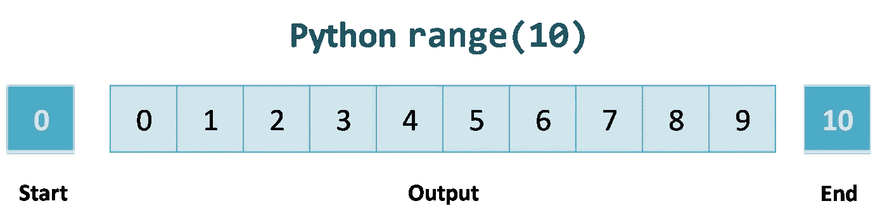
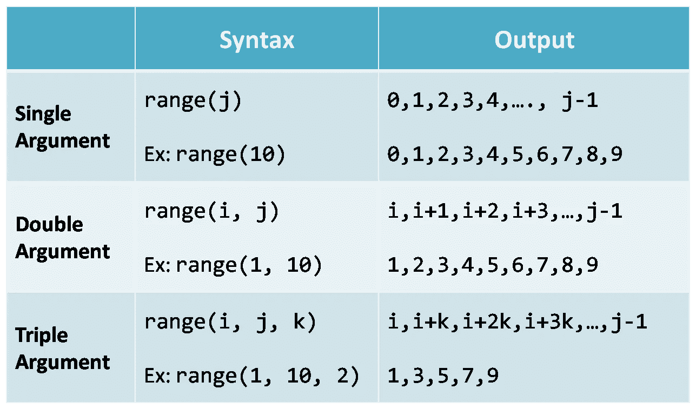

# Python 范围函数的完整指南

> 原文：<https://betterprogramming.pub/a-complete-guide-to-the-python-range-function-d59d5209b14>

## 借助不同的例子学习如何使用范围函数


照片由 [Kolleen Gladden](https://unsplash.com/@rockthechaos?utm_source=medium&utm_medium=referral) 在 [Unsplash](https://unsplash.com?utm_source=medium&utm_medium=referral) 上拍摄。

`Range`是一个内置的 Python 函数，返回起始整数(默认为`0`)和终止整数之间的数字序列。

我们可以使用一个 [for/while 循环](https://www.geeksforgeeks.org/loops-in-python/)迭代由`range`函数生成的序列:

```
print("Getting a sequence of numbers between 0 and 10")
for i in range(10):
    print(i, end =' ')

# Output
# Getting a sequence of numbers between 0 and 10
# 0 1 2 3 4 5 6 7 8 9
```



作者照片。

在本教程中，我们将借助不同的例子来学习如何使用 Python 的`range()`函数。如有必要，参考[官方文件](https://docs.python.org/3/library/stdtypes.html#range)。

# 句法

```
range(start, stop, step_size)
```

这里:

*   `start`:序列的起点。可选且默认`0`。
*   `stop`:序列的结束点。序列在`stop`之前结束一个元素。
*   `step_size`:递增顺序`step_size`。可选且默认`1`。

`Range`返回从`start`开始并在`stop`之前结束的数字序列。元素的区别是`step_size`。

让我们仔细看看`range()`函数的所有三种可能的变体。

## 变体 1:仅使用一个参数(停止)

这里，我们只将一个`stop`参数(在哪里结束)传递给`range`函数。`start`和`step_size`将分别采用`0`和`1`的默认值:

```
# Print first 10 numbers starting at 0
for i in range(10):
    print(i, end=' ')# Output
# 0 1 2 3 4 5 6 7 8 9
```

*注意:在上面的输出中，序列结束于* `*10.*` `*stop*` *的* `*stop*` *值之前的元素不是这个序列的一部分。*

## 变体 2:使用两个参数(开始和停止)

开始和停止参数都接收值。`step_size`默认为`1`:

```
# Print integers starting at 1 and ending before 5
for i in range(1, 5):
    print(i, end=' ')# Output
# 1 2 3 4
```

## 变式 3:使用所有三个参数

现在，我们将使用所有三个参数:`start` = `4`、`stop` = `15`和`step_size` = `3`。

```
# Print integers starting at 4 and ending before 15 with a step of 3for i in range(4, 15, 3):
    print(i, end=' ')# Output
# 4 7 10 13
```

*注:步长值是* `*3*` *，所以每个数字的区别是* `*3*` *。*



Python 的 range 函数的所有三个变体(作者供图)。

以下是打印`2`和`20`之间的所有偶数值时的快速输出片段:

```
for i in range(2, 20, 2):
    print(i, end=' ')# Output
# 2 4 6 8 10 12 14 16 18
```

*注意:* `*step_size*` *不能是* `*0*` *。如果* `*0*` *通过，就会抛出一个* `[*ValueError*](https://docs.python.org/3/library/exceptions.html#ValueError)` [*异常*](https://docs.python.org/3/library/exceptions.html#ValueError) *。*

# 范围函数的返回值

重要的是要注意到`range`函数并没有以列表或任何其他数据结构的形式返回序列。当您检查其返回对象的类型时，您将收到`<class 'range'>`:

```
print(type(range(10)))# <class 'range'>
```

`range( )`功能使用[发生器](https://www.programiz.com/python-programming/generator)产生一个范围内的数字。它不会一次生成所有数字。

让我们看一个例子:

```
for i in range(10):
    print(i, end=' ')
```

在每次循环迭代中，`range`生成下一个值，并将其分配给迭代器`i`。所以，我们得到的是一个接一个的数字，而不是整个序列。

这有助于减少内存消耗和执行时间。

如果需要，我们可以使用类型转换将范围转换为列表:

```
B = list(range(0,10,2))
print(B)# Output
# [0, 2, 4, 6, 8]
```

# 浮动范围内的参数

`range`函数不接受浮点数作为参数。有多种情况需要小数点。

`range`函数的所有参数只能是整数。

例如，我们需要一个 1 到 10 之间的数字列表，步长为 0.5。我设计了一个个人`float_range` 生成器来处理这样的情况:

输出:

```
print(list(float_range(1,10,0.5)))# Output
# [1, 1.5, 2.0, 2.5, 3.0, 3.5, 4.0, 4.5, 5.0, 5.5, 6.0, 6.5, 7.0, 7.5, 8.0, 8.5, 9.0, 9.5]
```

# 在循环中迭代序列

`range`的一个常见用法是用`[len](https://www.w3schools.com/python/ref_func_len.asp)` [函数](https://www.w3schools.com/python/ref_func_len.asp)遍历列表的索引:

```
fruits = ['apple', 'orange', 'banana', 'melon']
for i in range(len(fruits)):
    print(fruits[i], end=' ')# Output
# apple orange banana melon
```

# 反向范围和负参数

在 Python 中反转一个范围非常简单。我们使用负步长。

我们从一个较高的索引开始，然后向一个较小的索引值移动。看一看:

```
for i in range(5, 0, -1):
    print(i, end=' ')

# Output
# 5 4 3 2 1
```

或者，我们也可以使用`[reversed](https://www.programiz.com/python-programming/methods/built-in/reversed)` [功能](https://www.programiz.com/python-programming/methods/built-in/reversed)。

`reversed( range(…) )`将返回一个`range_iterator`，以相反的顺序访问给定范围的数字。这里有一个例子:

```
# Reversed range
for i in reversed(range(0, 5)):
    print(i, end=' ')# Output
# 4 3 2 1 0
```

就像`step-size`一样，`range`函数的所有参数也接受负值:

```
for i in range(-1, -10, -1):
    print(i, end=' ')# Output
# -1 -2 -3 -4 -5 -6 -7 -8 -9
```

# 索引范围函数

我们可以通过使用[索引](https://www.hackerearth.com/practice/notes/samarthbhargav/a-quick-intro-to-indexing-in-python/)来访问`range`功能的单个元素。它的工作方式与列表或字符串索引相同:

```
A = range(1,10)[5]
print(A) # Output: 6
```

# 连接两个距离函数的结果

如果需要，我们可以使用 [itertools 库](https://docs.python.org/3/library/itertools.html)中的****`[chain](https://www.geeksforgeeks.org/python-itertools-chain/)`[函数](https://www.geeksforgeeks.org/python-itertools-chain/)连接两个`range`函数的结果序列。****

```
**from itertools import chain
res = chain(range(5), range(10))
for i in res:
    print(i, end=' ')# Output
# 0 1 2 3 4 0 1 2 3 4 5 6 7 8 9**
```

# ****需要记住的要点****

*   ****`range`函数只接受整数作为参数。****
*   ****这三个参数可以是正的，也可以是负的。****
*   ****`Step_size`不能是`0`。如果通过了`0`，那么`Range`将抛出一个`ValueError`异常。****
*   ****`range`函数使用一个生成器来产生数字。由于这种行为，`range`更快并且节省内存。****
*   ****您可以通过使用索引来访问`range`函数中的单个元素。****