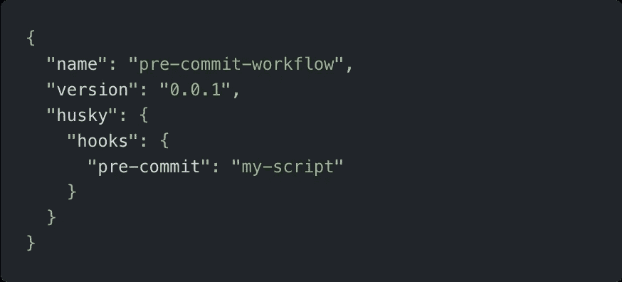
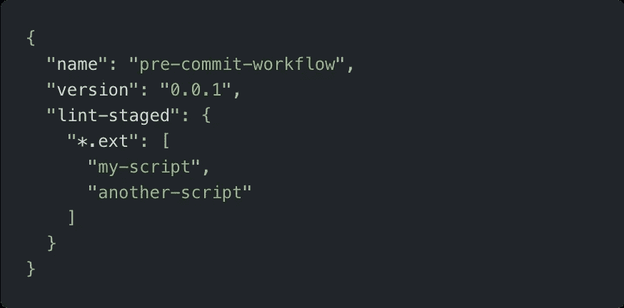

# 完整的提交前工作流

> 原文：<https://betterprogramming.pub/a-complete-pre-commit-workflow-cea6e34f0032>

## 使用 Husky 创建一个令人敬畏的 git 工作流

使用 Husky 的 Git 挂钩实用指南

# 这是怎么回事？

我真的喜欢做出完美的提交，我尤其讨厌因为一个指导方针的错误而追加或创建一个新的提交。所以我需要一个工具，当我要犯错误的时候，它会对我吠叫。

互联网上到处都是解释[什么是](https://githooks.com/) [Git](https://git-scm.com/book/uz/v2/Customizing-Git-Git-Hooks) [钩子](https://www.digitalocean.com/community/tutorials/how-to-use-git-hooks-to-automate-development-and-deployment-tasks) [是](https://hackernoon.com/automate-your-workflow-with-git-hooks-fef5d9b2a58c)的 [的教程，但是我仍然不得不花很多时间来为我的 JavaScript 应用程序构建一个良好的工作流，以便正确地使用它们。这是我今天在每个项目中使用的工具箱的概述。](https://medium.com/the-andela-way/git-hooks-beautifully-automate-tasks-stages-bfb29f42fea1)

第一个专注于工作流自动化的库是[Husky](https://github.com/typicode/husky)——因为一只对我吠叫的狗引起了我的注意。Husky 是一个 JavaScript 库，它使 Git 挂钩变得更加容易。它提供了将它们直接集成到我们的 JavaScript 项目中的可能性，使我们不必在存储库初始化时处理启动指南或启动脚本。

用哈士奇真的很简单。我们只需要在`package.json`文件中添加一个新的`husky`键。这个新条目包含一个键/值对象，`hooks`,它表示我们的 Git 挂钩，以及我们想要执行的脚本:

这是一个非常简单的`package.json`文件，带有 husky 钩子。为了简单起见，因为哈士奇版本可能会改变，它不包括`devDependencies`。

# 阐明我们的需求

当我在 React 应用程序上工作时，我使用几个工具来保持一致的代码并简化团队工作:

*   在 JS、JSX、JSON、CSS 和 MD 文件上，把我的代码格式化成开发者一致的东西。
*   [Eslint](https://eslint.org/) ，使用 [Airbnb 配置](https://github.com/airbnb/javascript/tree/master/packages/eslint-config-airbnb)，在我的应用程序上提出一个健壮的林挺。然而，我用`[eslint-config-prettier](https://github.com/prettier/eslint-config-prettier)`优先考虑漂亮者的规则。
*   Jest ，用于我的应用程序单元测试。
*   保持我的 CSS 模块干净。

不幸的是，对于每种类型的 Git 挂钩，Husky 只支持一次执行一个命令。

我还必须检查每一个修改过的文件，以应用适当的工具，这是一项繁琐的工作。

谢天谢地，已经有一个很棒的工具可以帮我做到这一点: [lint-staged](https://github.com/okonet/lint-staged) 。

lint-staged 非常棒，因为它只在修改过的文件上执行所需的脚本，这使得钩子运行得非常快。多亏了 lint-staged，我们现在能够在增量提交阶段运行非常快速的工作流，因此大大减少了所有脚本的通常持续时间。

与 Husky 一样，lint-staged 是我们的`package.json`文件中的一个新的键/值对象，它表示要执行的脚本。

和以前一样，我只包含了 package.json 文件中有趣的部分

现在，一切看起来都很简单。我只需要告诉 Husky 使用 lint-staged，并告诉 lint-staged 我需要对我的文件做什么。

# 最后的结果

综合起来，这就是我的`package.json`文件的样子:

和以前一样，我只包含了 package.json 文件中有趣的部分

当我提交时，我的钩子会做以下事情:

*   对于我的 **CSS** 文件，运行 beautiful，然后运行 Stylelint，然后将更新自动添加到 Git 暂存区。
*   对于我的 **JS** 和 **JSX** 文件，找到并执行与我的更改相关的测试，然后运行更漂亮的，接着是 Eslint，最后自动将更新添加到 Git staging 区域。
*   对于我的 **MD** 和 **JSON** 文件，运行漂亮点，自动将更新添加到 Git 暂存区。

现在我们在这里，不再扰乱我们的提交。💪

在提交之前，我们还可以做很多其他检查，我们还可以使用其他 Git 挂钩来改进版本控制系统工作流，我希望听到您的需求，我也希望看到您对我的工作流进行改进！

提升到更健壮的开发工作流程。照片归功于我。

# 奖金

在写这篇文章的时候，我意识到我的样板应用程序是基于许多额外的脚本。这是我给自己的每个新项目添加的清单。注意这个例子应用于一个 React 应用程序，我使用`yarn`作为包管理器。

因此，首先安装所需的软件包:

`yarn add --dev cross-env enzyme enzyme-adapter-react-16 eslint-config-airbnb eslint-config-prettier eslint-plugin-import eslint-plugin-jsx-a11y eslint-plugin-react eslint-plugin-react-hooks husky jest-enzyme lint-staged prettier stylelint stylelint-config-css-modules stylelint-config-prettier stylelint-config-recommended stylelint-order stylelint-prettier`

然后，添加配置文件:

我们准备好了！