# 用 Kotlin、Kafka 和 DynamoDB 构建事件驱动应用程序的综合指南

> 原文：<https://betterprogramming.pub/a-comprehensive-guide-to-build-an-event-driven-application-with-kotlin-kafka-and-dynamodb-a8d9bfb19e42>

## 构建您自己的事件驱动应用程序

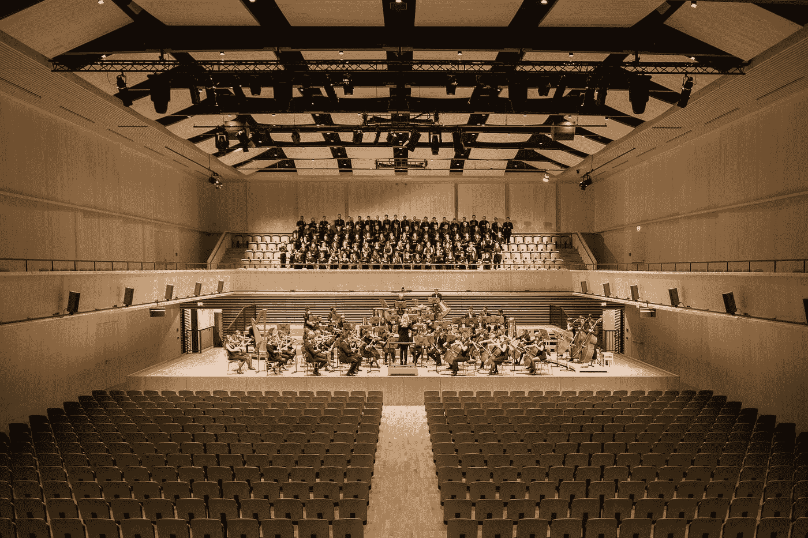

在 [Unsplash](https://unsplash.com?utm_source=medium&utm_medium=referral) 上由[Manuel n Geli](https://unsplash.com/@gwundrig?utm_source=medium&utm_medium=referral)拍摄的照片

# 介绍

事件驱动应用程序是一种监听某种形式的事件或动作并对其做出反应的应用程序。这些事件或动作可以来自用户或其他应用程序。例如，一个事件可能是用户关闭他或她的帐户，一个修改输入数据并输出结果的服务，等等。

本质上，事件是导致状态变化的任何事情。状态的改变由生产者引起，然后以某种消息形式发布到主题或队列。另一方面，会有一个(或多个)消费者订阅主题或队列，并消费或处理消息。

简而言之，事件驱动应用程序的组件是:生产者、主题和消费者。

作为对此的补充，您可以查看以下教程:

*   [旋转本地 DynamoDB Docker](https://medium.com/better-programming/how-to-set-up-a-local-dynamodb-in-a-docker-container-and-perform-the-basic-putitem-getitem-38958237b968)
*   [旋转本地 Kafka Docker](https://medium.com/better-programming/your-local-event-driven-environment-using-dockerised-kafka-cluster-6e84af09cd95)
*   [将模式注册表添加到本地 Kafka Docker](https://medium.com/@billydharmawan/adding-schema-registry-to-kafka-in-your-local-docker-environment-49ada28c8a9b)
*   [用 DynamoDB 构建 Kotlin 应用](https://medium.com/swlh/how-to-build-a-reactive-microservice-api-with-spring-boot-spring-webflux-and-dynamodb-using-kotlin-e1be3e99b15e)

上面的前三个教程向我们展示了如何建立一个本地开发环境，包括 DynamoDB 和 Kafka 以及 Schema Registry(这样我们就可以使用 Avro schema)。

上一篇教程向我们展示了如何构建一个使用 DynamoDB 作为持久层的 Kotlin 应用程序。该应用程序是使用 Spring Boot 和 Spring Webflux 框架构建的。这是我们将用作本教程基础的项目，我们将把它转换成一个事件驱动的应用程序。

TLDR:这个教程的 Github repo 可以在这里[找到](https://github.com/billydh/kotlin-kafka-dynamo-demo)。

# 你将学到什么

在本教程中，我们将看看如何使用 Kotlin、Kafka 和 DynamoDB 构建一个事件驱动的应用程序。应用程序公开了一个接受创建用户帐户请求的`POST`端点。它将向 Kafka 主题发布包含用户创建请求的消息。

另一方面，会有一个消费者订阅该主题，阅读消息并将新用户的详细信息持久存储在 DynamoDB 中。成功创建用户帐户后，会有一条消息发布到 Kafka 主题。

# 先决条件

我们将克隆作为本教程一部分构建的 Github repo:[用 DynamoDB 构建 Kotlin 应用程序](https://medium.com/swlh/how-to-build-a-reactive-microservice-api-with-spring-boot-spring-webflux-and-dynamodb-using-kotlin-e1be3e99b15e)。它已经有了 DynamoDB 的结构，所以我们可以继续构建 Kafka 组件。

如果你想从头到尾了解整个过程，包括用 DynamoDB 构建初始应用程序，我强烈建议你做[这个教程](https://medium.com/swlh/how-to-build-a-reactive-microservice-api-with-spring-boot-spring-webflux-and-dynamodb-using-kotlin-e1be3e99b15e)。

克隆之后，将项目模块重命名为`kotlinkafkadynamodemo`，并按照本[教程](https://medium.com/@billydharmawan/how-to-rename-project-module-in-intellij-d78d950314b5)中的步骤重新初始化 Git 存储库。

让我们也重命名包含`main`方法的类。打开`DynamodemoApplication.kt`，然后高亮显示`DynamodemoApplication`并按下键盘上的`shift + fn + F6`。

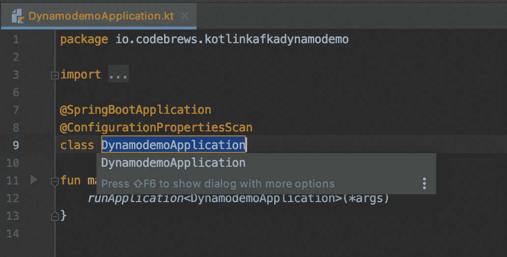

将其重命名为`KafkaDynamoDemoApplication`，然后按键盘上的`return`或`enter`键。

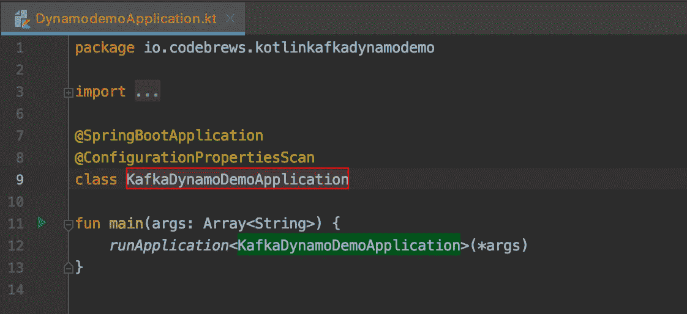

将会出现一个提示，询问您是否想要重命名相应的测试类。通过点击复选框选择测试。最后，点击右下角的`OK`。

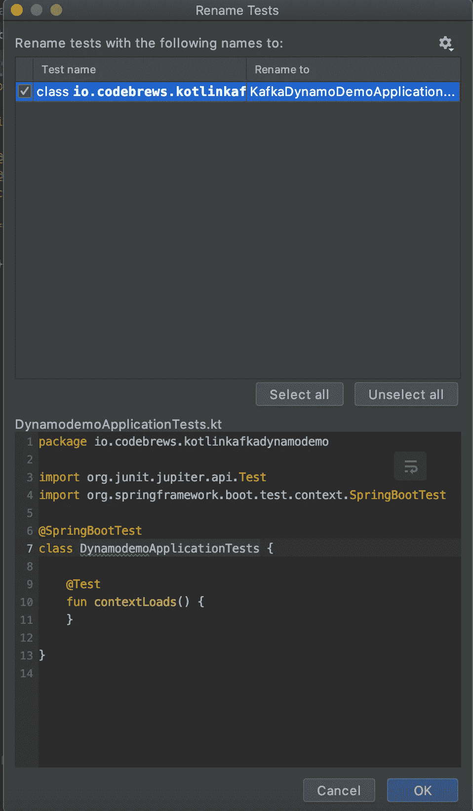

# 启动本地 Kafka 和 DynamoDB 环境

我们需要设置本地 Kafka 和 DynamoDB 环境。为此，将来自 [DynamoDB Docker 教程](https://medium.com/better-programming/how-to-set-up-a-local-dynamodb-in-a-docker-container-and-perform-the-basic-putitem-getitem-38958237b968)的`docker-compose.yaml`内容添加到来自 [Kafka Docker 教程](https://medium.com/@billydharmawan/adding-schema-registry-to-kafka-in-your-local-docker-environment-49ada28c8a9b)的`docker-compose.yml`中。

我们可以删除我们的`kotlin-kafka-dynamo-demo`库中现有的`docker-compose-dynamodb.yaml`文件，并用一个名为`docker-compose.yml`的新文件替换它。

```
~/demo/kotlin-kafka-dynamo-demo ❯ rm docker-compose-dynamodb.yaml
```

我们将在`kotlin-kafka-dynamodb-demo`项目根目录下以下面的`docker-compose.yml`文件结束。

docker-compose.yml

使用下面的`docker-compose`命令旋转 Docker 容器。

```
~/demo/kotlin-kafka-dynamo-demo ❯ docker-compose up -d
Creating network "demo_default" with the default driver
Creating zookeeper      ... done
Creating kafka-tools    ... done
Creating dynamodb-local ... done
Creating broker         ... done
Creating schema-registry ... done
Creating control-center  ... done~/demo/kotlin-kafka-dynamo-demo ❯ docker ps
CONTAINER ID        IMAGE                                             COMMAND                  CREATED             STATUS              PORTS                                        NAMES
ee92c29db522        confluentinc/cp-enterprise-control-center:5.4.0   "/etc/confluent/dock…"   5 seconds ago       Up 3 seconds        0.0.0.0:9021->9021/tcp                       control-center
5303bc4934e3        confluentinc/cp-schema-registry:5.4.0             "/etc/confluent/dock…"   5 seconds ago       Up 4 seconds        0.0.0.0:8081->8081/tcp                       schema-registry
66f0066c2fcb        confluentinc/cp-server:5.4.0                      "/etc/confluent/dock…"   6 seconds ago       Up 5 seconds        0.0.0.0:9092->9092/tcp                       broker
d03997801db5        confluentinc/cp-zookeeper:5.4.0                   "/etc/confluent/dock…"   7 seconds ago       Up 6 seconds        2888/tcp, 0.0.0.0:2181->2181/tcp, 3888/tcp   zookeeper
14993ad15764        amazon/dynamodb-local                             "java -jar DynamoDBL…"   7 seconds ago       Up 5 seconds        0.0.0.0:8042->8000/tcp                       dynamodb-local
d64c2c2483b4        confluentinc/cp-kafka:5.4.0                       "tail -f /dev/null"      7 seconds ago       Up 6 seconds                                                     kafka-tools
```

# 创建演示客户信息表

我们需要按照本[教程](https://medium.com/swlh/how-to-build-a-reactive-microservice-api-with-spring-boot-spring-webflux-and-dynamodb-using-kotlin-e1be3e99b15e)中的说明创建一个 DynamoDB 表。该表将保存来自客户端对我们的应用程序端点的`POST`请求的用户信息。

以下是 Docker 容器启动后创建我们的表的命令。

创建-表格

如果一切正常，我们应该会看到以下输出:

```
~/demo/kotlin-kafka-dynamo-demo ❯ aws dynamodb --endpoint-url [http://localhost:8042](http://localhost:8042) create-table --table-name demo-customer-info \
--attribute-definitions AttributeName=customerId,AttributeType=S --key-schema AttributeName=customerId,KeyType=HASH \
--provisioned-throughput ReadCapacityUnits=5,WriteCapacityUnits=5{
    "TableDescription": {
        "AttributeDefinitions": [
            {
                "AttributeName": "customerId",
                "AttributeType": "S"
            }
        ],
        "TableName": "demo-customer-info",
        "KeySchema": [
            {
                "AttributeName": "customerId",
                "KeyType": "HASH"
            }
        ],
        "TableStatus": "ACTIVE",
        "CreationDateTime": 1583123385.099,
        "ProvisionedThroughput": {
            "LastIncreaseDateTime": 0.0,
            "LastDecreaseDateTime": 0.0,
            "NumberOfDecreasesToday": 0,
            "ReadCapacityUnits": 5,
            "WriteCapacityUnits": 5
        },
        "TableSizeBytes": 0,
        "ItemCount": 0,
        "TableArn": "arn:aws:dynamodb:ddblocal:000000000000:table/demo-customer-info",
        "BillingModeSummary": {
            "BillingMode": "PROVISIONED",
            "LastUpdateToPayPerRequestDateTime": 0.0
        }
    }
}
```

# 创建卡夫卡主题

如上所述，我们将有两个主题:

*   一个用于创建用户请求:`create-user-request`。
*   另一个为用户创建的事件:`user-created-event`。

我们将使用合流控制中心 UI 来创建这些主题。你可以参考这个[教程](https://medium.com/@billydharmawan/adding-schema-registry-to-kafka-in-your-local-docker-environment-49ada28c8a9b)来了解如何做。

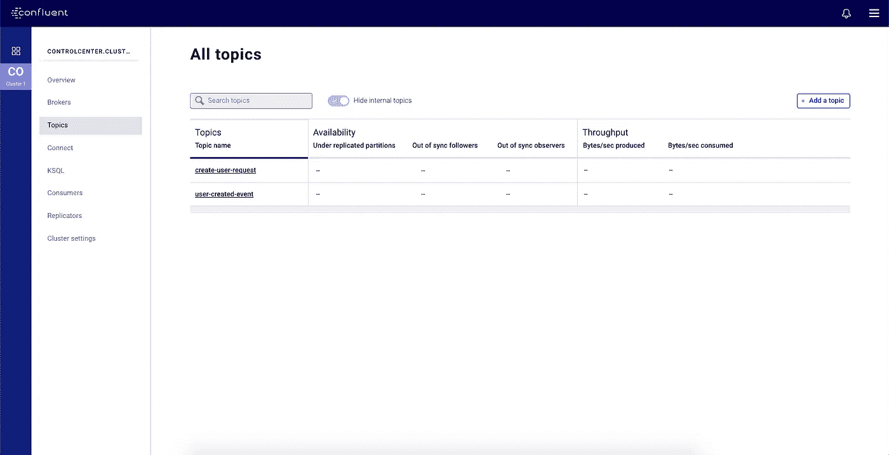

# 定义 Avro 模式

既然我们已经准备好了主题，我们需要为每个主题定义 Avro 模式。一般来说，对于那些需要快速复习的人来说，模式的目的是确保维护消息的数据结构的生产者和消费者之间的契约。

关于 Avro 模式和模式注册表的更多信息，你可以阅读这篇教程。

对于我们的应用程序，我们将使用 [gradle-avro-plugin](https://github.com/davidmc24/gradle-avro-plugin) 。这个插件允许我们在应用程序项目文件夹中定义 Avro 模式。它接受 JSON 模式声明，并将基于模式定义生成 Java 类。

在构建过程中，插件会寻找`src/main/avro`文件夹，并将文件夹中的 Avro 文件`.avsc`编译成相应的 Java 类。很方便，不是吗？

所有这些听起来都不错，但是如果你遵循上面提到的模式注册教程[的话，你可能会想——我们不需要在汇合中心注册模式吗？](https://medium.com/@billydharmawan/adding-schema-registry-to-kafka-in-your-local-docker-environment-49ada28c8a9b)

答案是否定的。

请记住，当生产者向 Kafka 主题发布一些消息时，它将与 Schema Registry 对话，以检查任何已注册的模式。如果没有，它将在那里注册，然后将消息发布给卡夫卡。

这正是这里将要发生的事情，所以请耐心等待并跟随！

如上所述，`gradle-avro-plugin`在构建期间在`src/main/avro`中寻找 Avro 文件。因此，让我们将`create-user-request`和`user-created-event`主题的 Avro 文件添加到该文件夹中。

## 创建用户请求的 Avro 模式

创建用户请求

## 用户创建事件的 Avro 架构

用户创建的事件. avsc

# 设置 Gradle Avro 插件

我们需要将一些东西添加到我们的`build.gradle.kts`文件中，以使`gradle-avro-plugin`按预期工作。

遵循他们的 Github [页面](https://github.com/davidmc24/gradle-avro-plugin)中的步骤。

在我们完成所有步骤后，我们的`build.gradle.kts`文件应该看起来像这样:

构建

从 Avro 模式生成 Java 类的任务被命名为`generateAvroJava`。因此，如果我们现在转到我们的终端并执行以下命令:

```
~/demo/kotlin-kafka-dynamo-demo ❯ ./gradlew generateAvroJava
BUILD SUCCESSFUL in 764ms
1 actionable task: 1 executed
```

我们最终生成了两个 Java 类。

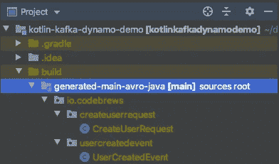

如果我们转到任何 Kotlin 文件，我们将能够像这样导入这两个类中的任何一个:

```
import io.codebrews.createuserrequest.CreateUserRequest
import io.codebrews.usercreatedevent.UserCreatedEventval *createUserRequest* = CreateUserRequest("email", "firstName", "lastName")val *userCreatedEvent* = UserCreatedEvent("userId", "email", 1582844531)
```

# 添加 Kafka 依赖

在本教程中，我们将使用**反应器 Kafka** 。Reactor Kafka 在 Kafka 生产者和消费者 API 周围有一个很好的包装，它是反应式的和非阻塞的，因为它是建立在 Project Reactor 之上的。

此外，我们还需要将 Kafka Avro 序列化程序包添加到我们的项目中。这样我们就可以在发布到 Kafka 主题时将 Java Avro 类序列化为 Avro 记录，并在从主题消费时将 Avro 消息反序列化为 Kotlin/Java 类。

让我们转到我们的`build.gradle.kts`文件并添加以下依赖项:

*   `io.projectreactor.kafka:reactor-kafka:1.2.2.RELEASE`
*   `io.confluent:kafka-avro-serializer:5.4.0`

build.gradle.kts —最终版本

请注意，为了拉动`kafka-avro-serializer`包，我们需要将[http://packages.confluent.io/maven/](http://packages.confluent.io/maven/)添加到`repositories`部分。

# 将 Kafka 配置添加到 application.yml

就像我们的 DynamoDB 一样，我们的 Kafka 配置会放在`application.yml`。让我们添加以下属性:

应用程序. yml

让我们讨论一下刚刚添加的属性:

*   `broker`:这是 Kafka 代理的位置，我们的应用程序在从一个主题生成和消费消息时将与它进行交互。该地址与本[教程](https://medium.com/better-programming/your-local-event-driven-environment-using-dockerised-kafka-cluster-6e84af09cd95)中指定的 Kafka Docker 对齐。
*   `serializer`:这是在发布到 Kafka 主题或队列之前将用于序列化我们的 Kotlin/ Java 对象的序列化程序。
*   `deserializer`:这是一个反序列化器，用于将 Kafka 主题或队列中的消息反序列化为 Kotlin/Java 对象。
*   `schema-registry-url`:这是我们的 Kafka、生产者和消费者将与之交互的模式注册中心的 URL。
*   `create-user-request-topic`:这是我们的应用程序在收到一个`POST`请求来创建一个新用户时将发布到的主题的名称。
*   `user-created-event-topic`:这是我们的应用程序在成功创建新用户后将发布到的主题的名称。

# 创建 KafkaConfigProperties 数据类

我们将创建一个`data class`来保存上面的`application.yml`文件中定义的 Kafka 配置的值。这允许我们在应用程序代码中轻松地访问这些值。

让我们创建一个新的 Kotlin 文件并将其命名为`KafkaConfigProperties.kt`。该文件的内容如下:

KafkaConfigProperties.kt

注意`ConstructorBinding`注释的用法。如果你想了解更多，看看这个教程。这是 Spring Boot 提供的有用注释之一。

# 创建卡夫卡制作人

为了能够向 Kafka 主题发布消息，我们需要一个 Kafka 生产者。在反应器卡夫卡中，它被称为`KafkaSender`。

让我们创建一个新的科特林文件，并将其命名为`KafkaPublisher.kt`。它的内容如下:

KafkaPublisher.kt

这个班有两个`KafkaSender`，其中一个(`createUserRequestKafkaSender`)将连载并发布`CreateUserRequest`，另一个(`userCreatedEventKafkaSender`)将连载并发布`UserCreatedEvent`。

我们还用一个方法定义了一个`companion object`，该方法将用于为我们将要发布的消息生成`key`。

# 创建卡夫卡监听器

除了生产者之外，我们还需要消费者根据生产者发布的消息执行操作。在《卡夫卡反应堆》中，它被称为`KafkaReceiver`。

记住，我们的消费者需要处理用户创建请求。换句话说，它需要从`create-user-request`主题中读取消息，然后在数据库表`demo-customer-info`中相应地创建新用户。我们将为此创建一个类，并将其命名为`KafkaListener.kt`。

这意味着我们需要一个处理这些请求的类来保持事物的分离和去耦。我们还将在本节中创建 handler 类，并将其命名为`CreateUserRequestHandler.kt`。

# 卡夫卡听众

让我们创建我们的`KafkaListener`类，它将监听`create-user-request`主题并消费消息。它还将消息传递给处理程序类`CreateUserRequestHandler`，后者将在数据库中创建一个新用户。

KafkaListener.kt

# 创建用户请求处理程序

让我们创建处理来自 Kafka 的`CreateUserRequest`消息所需的处理程序。

这个类将做我们的`POST` route 曾经做过的事情——也就是说，在我们的数据库表`demo-customer-info`中创建一个新的用户记录。不同的是，它将基于来自 Kafka topic `create-user-request`的`CreateUserRequest`消息来这样做，而不是来自客户端的`POST`请求。

最后，在成功处理了`CreateUserRequest`之后，它将向`user-created-event`主题发布一条`UserCreatedEvent`消息，以便通知其他消费者。

*注意:在本教程中，我们不会为这个主题创建一个消费者。这只是为了让您知道，您可以创建其他消费者来将此事件用于其他目的。*

CreateUserRequestHandler.kt

# 调整 CustomerHandler 以发布 CreateUserRequest 消息

因为我们想让我们的应用程序是事件驱动的，我们需要对我们的`CustomerHandler`类做一些改变。目前，当我们的应用程序在`/users`收到一个`POST`请求时，`CustomerHandler`会将请求发送给`CustomerRepo`，并立即创建新用户。

这里，它应该调用我们之前创建的`KafkaPublisher`类来发布`CreateUserRequest`消息，而不是创建一个新用户。然后，我们将让我们的`KafkaListener`类消费消息并处理用户创建，如前一节所讨论的。

让我们修改一下我们的`CustomerHandler`:

客户处理者. kt

这里我们添加了`KafkaPublisher`,因为我们希望在每次客户端调用我们的`POST`端点时发布一条`CreateUserRequest`消息，而不是直接在我们的数据库表中创建一条新记录。

请注意，`generateCustomerId`函数也被移到了`CreateUserRequestHandler`类中。

# 启动应用程序并调用端点

我们已经完成了事件驱动应用程序的编写——现在是测试它的时候了。让我们从`IntelliJ`运行应用程序。

打开`KafkaDynamoDemoApplication`并点击`main`功能左侧的绿色箭头按钮。从列表中选择第一个选项，即`Run “<class name>”`。

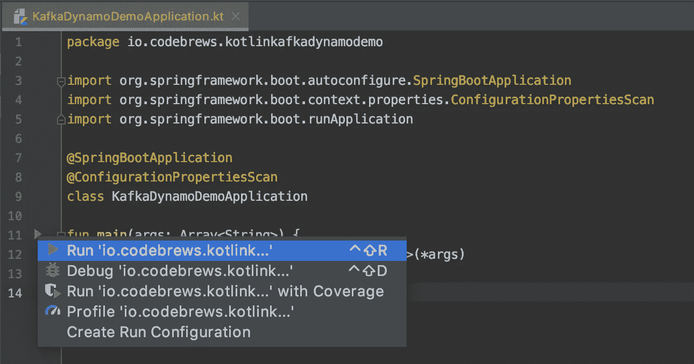

我们应该看到这样的内容:

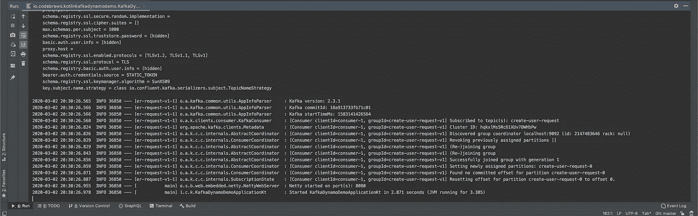

太好了—我们的应用程序现在已经启动并运行了！

# 发送发布请求

让我们转到我们的终端，用下面的`curl`命令向`/users`端点发送一个`POST`请求:

```
$ ~/demo/kotlin-kafka-dynamo-demo ❯ curl -X POST -H 'Content-type: application/json' [http://localhost:8080/users](http://localhost:8080/users) -d '{"emailAddress": "[joe@email.com](mailto:joe@email.com)", "firstName": "Joe", "lastName": "Jones"}'
```

如果我们在发送上述请求后返回 IntelliJ，我们会看到下面两行日志。

```
...
...
2020-03-02 20:34:11.847  INFO 36850 --- [       single-1] i.c.k.KafkaPublisher                     : Successfully sent a CreateUserRequest message with id 47e292ef-6e73-4ce3-886c-879846c668b6...
...
2020-03-02 20:34:12.339  INFO 36850 --- [       single-1] i.c.k.KafkaPublisher                     : Successfully sent a UserCreatedEvent message with id 80e7d175-5e5c-4471-a78f-4b21b0e29bc1
```

这些是由我们的`KafkaPublisher`类记录的，我们将其定义为`doOnSuccess`操作的一部分。

# 查看控制中心中的消息

汇合控制中心还允许我们在 UI 上查看消息。转到您的浏览器并访问 [http://localhost:9021](http://localhost:9021) 。在所有选项卡所在的左侧，选择主题。

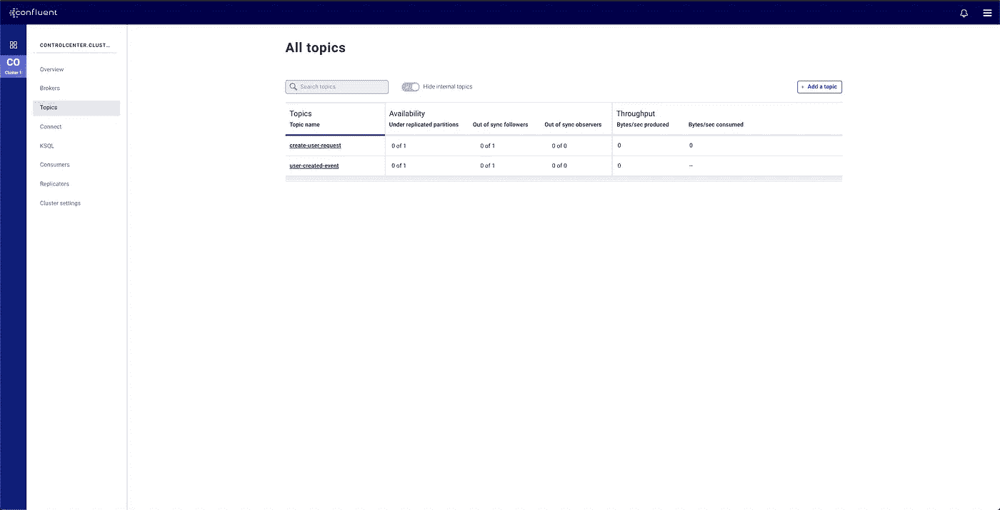

我们先来查看一下`create-user-request`话题中的消息。继续点击`create-user-request`。然后，点击`Messages`选项卡。用户界面会说没有新消息。不要慌！

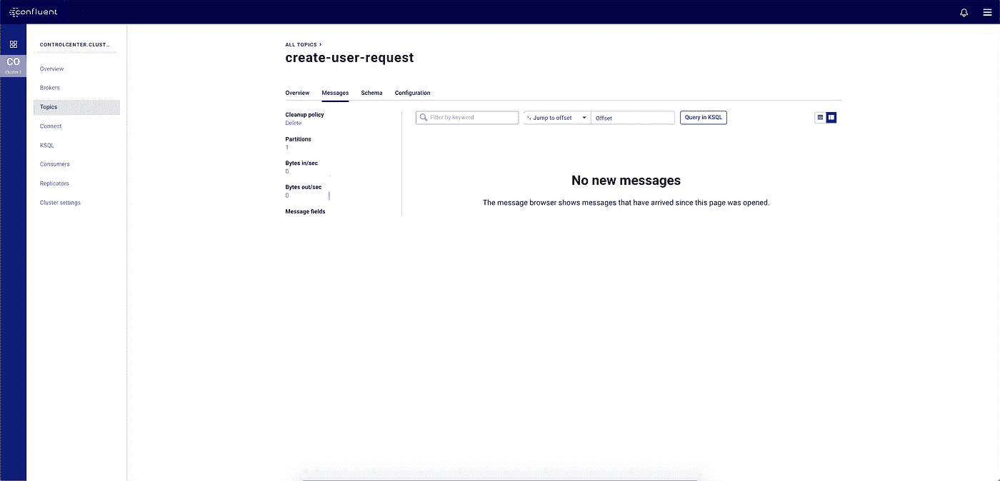

转到显示`Offset`的框，输入`0`作为值，然后按回车键。我们应该看到只有一条信息:

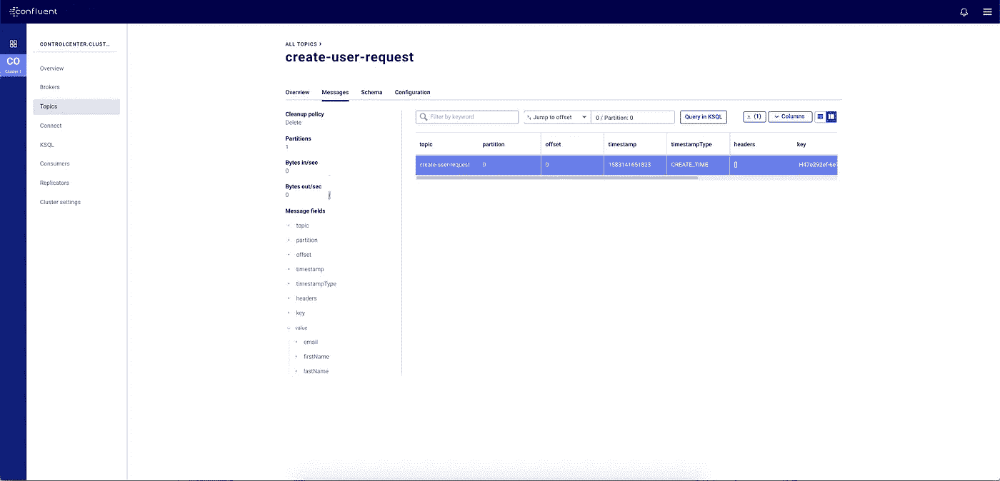

如果我们将显示选项更改为卡片，我们将看到发布的消息的一个很好的表示。

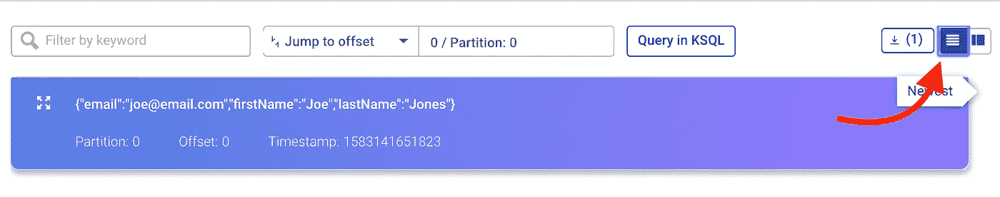

对`user-created-event`主题重复相同的过程，我们将看到以下消息:

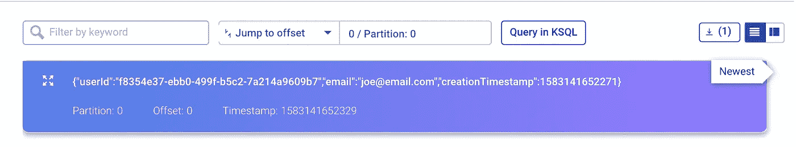

太棒了。真的很酷，很满足，不是吗？

我们现在有了一个事件驱动的应用程序！干得好，各位。

# 包裹

这篇全面的教程介绍了如何将我们的应用程序转换成事件驱动的应用程序。这是通过添加 Kafka 和 Schema Registry 来维护我们的生产者-消费者契约实现的。

我们还了解了如何使用汇合控制中心管理主题创建和查看主题中的消息。这个工具很神奇，它提供的远不止我们在本教程中所介绍的，我强烈建议您去探索它。

我希望这篇教程能帮助你理解如何构建一个事件驱动的应用程序。如果您已经到了这个阶段，您可能会被我们介绍的所有内容弄得不知所措，但是希望充满知识和灵感来构建您自己的应用程序！

# 参考

*   [合流控制中心](https://docs.confluent.io/current/control-center/userguide.html)
*   [反应器卡夫卡](https://projectreactor.io/docs/kafka/release/reference/)
*   [Github 回购](https://github.com/billydh/kotlin-kafka-dynamo-demo)