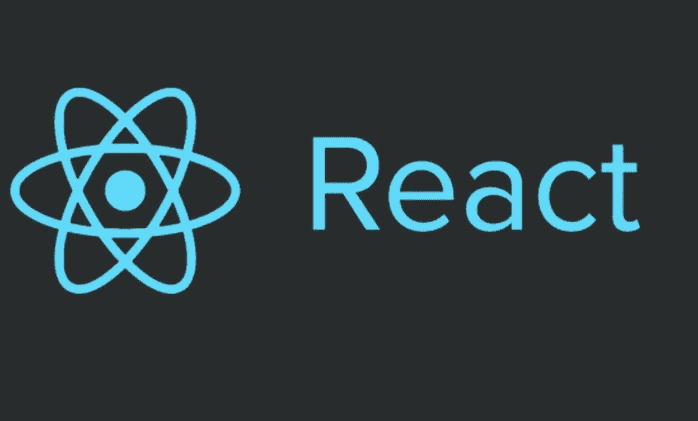
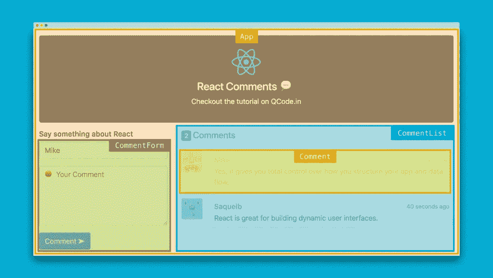
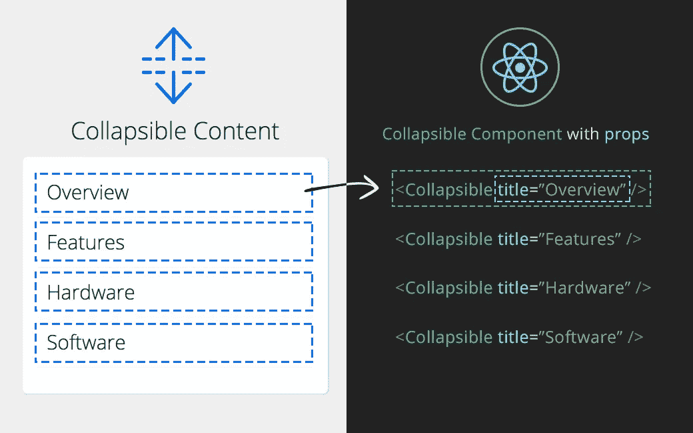
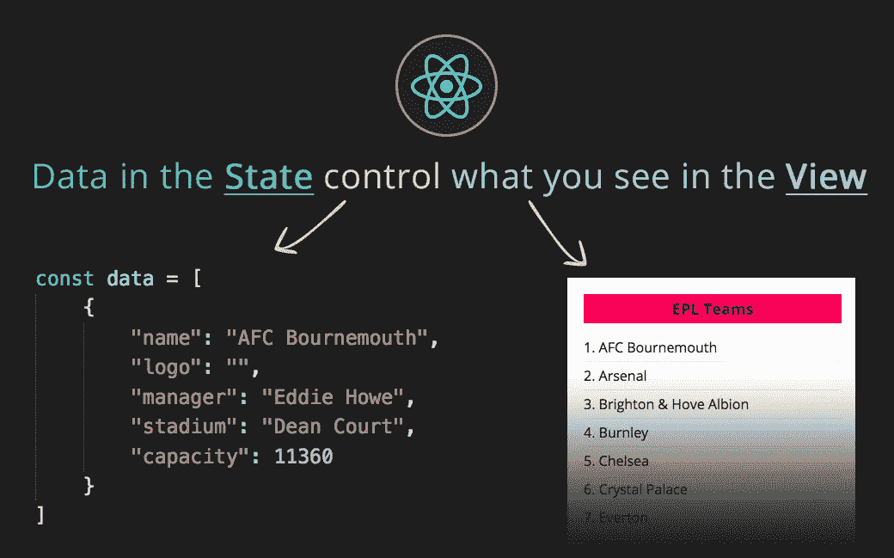
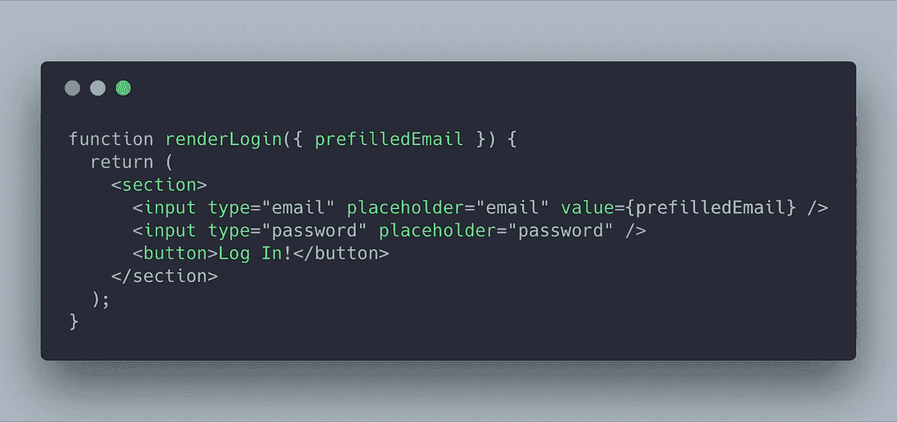

# 创建首个 React 应用程序的全面指南

> 原文：<https://betterprogramming.pub/a-comprehensive-guide-to-creating-your-first-react-app-afce025aa717>

## 从“什么是反应？”到创建您的第一个应用程序，都在一个地方完成



反应堆

React 是一个由脸书创建的模块化 Javascript 库，它有助于用最少的代码快速高效地开发 web 应用。

在这篇博客中，我们将制作一个简单的 React 应用程序，可以用来比较不同的产品。

这是我们最终应用程序的样子:

# 为什么要反应？

React 具有广泛的优势，其中一些如下:

## **易学易用**

React 附带了大量的[文档](https://reactjs.org/docs/hello-world.html)和[教程](https://reactjs.org/tutorial/tutorial.html)。任何做 JavaScript 的人都可以很容易地理解 React，并在短短几天内开始使用它。

## **可重用组件**

React 允许开发人员将应用程序分成更小的组件，这些组件可以在以后重用，从而最大限度地减少代码库。我们将在下一节中了解更多关于组件的内容。

## **虚拟 DOM 的使用**

对于任何框架来说，DOM 操作都是最昂贵的任务之一，尤其是当应用程序很大的时候。React 通过使用虚拟 DOM 解决了这个问题，虚拟 DOM 基本上是真实 DOM 的轻量级副本。它只是内存中的表示形式，不会呈现在实际屏幕上。

React 不是再次渲染整个 DOM，而是比较虚拟 DOM 中的变化，然后相应地在真实 DOM 中渲染。

## **易写 JSX**

JSX 只是 HTML 和 Javascript 的结合。这使得编码更加容易，也有助于防止像 XSS 这样的注入攻击。

# 一些基本概念

在深入探讨之前，让我们先了解一些基本概念，这将是进一步研究的必要条件。

## 成分

一个组件是每个 React app 的一个构建块；所以一组组件就做了一个 React app。

在下图中，你可以看到一个简单的网页是如何使用不同的组件制作的。



## 小道具

Props 是一种通过将属性/数据从一个组件传递到另一个组件来使组件动态化的方法。它们是不可变的，也就是说，它们不能被改变。它只是将一些信息由父组件传递给子组件。



## 状态

`State`是每个`Class Component`中的变量，具有动态存储信息的能力。它类似于一个`prop`，除了它是私有的并且完全由组件控制。

我们将在下一节详细讨论这一点。



## JSX

JSX 是一种类似 XML/HTML 的语法。它将 XML/HTML 语法添加到 Javascript 中。



# 组件类型

React 提供了两种类型的组件:

1.  **功能组件(无状态):**这些组件纯粹是表示性的(没有功能，只有输出 UI 项)，可以简单地用一个函数来表示。它没有国家。

2.**类组件(有状态的):**这些组件使用一个类来实现，并具有应用逻辑、保持状态和相应呈现的能力。

# 装置

已经创建了一个 GitHub 存储库，其中有一个基本的 react 应用程序和一些我们在制作第一个 React 应用程序时需要的图像。

您可以通过两种方式进行安装:使用 GitHub 库或全新安装。

## 1.使用 GitHub Repo

您可以简单地克隆 GitHub repo:

`git clone [https://github.com/goelashwin36/react-workshop-start.git](https://github.com/goelashwin36/react-workshop-start.git)`

打开 cmd/terminal，进入克隆的 GitHub 库。

**码头工人**

1.建造`Dockerfile`

`docker build -t reactapp:v1 .`

2.运行`Docker Image`

`docker run -v ${PWD}:/app -v /app/node_modules -p 3000:3000 --rm reactapp:v1`

**不带对接器**

为此，您需要安装`npm`。如果有，跳过第一步。

1.  `NPM`:它自带`Node JS`作为默认的包管理器:

从[官网](https://nodejs.org/en/)下载安装。

2.安装运行应用程序所需的所有节点模块:

`npm install`

3.启动 React 服务器

`npm start`

## 2.全新安装

1.  这一步需要有`npm`。从[官网](https://nodejs.org/en/)下载安装。

2.`Create-react-app` : Create React App 是官方支持的创建单页面 React 应用的方式。这是一个 NPM 软件包，可以生成一个基本的 React 应用程序。手动配置 React 应用程序是一项繁琐的任务。如果您仍然对手动安装感兴趣，请遵循这些说明。

`npx create-react-app <app-name>`

3.`Reactstrap` : NPM 图书馆就像`Bootstrap`之于`React`。它使应用程序看起来模块化，并使其反应灵敏。

使用 cmd/terminal，进入上一步创建的 react 应用程序。

现在安装`bootstrap`和`reactstrap`。

`npm install --save bootstrap`

`npm install --save reactstrap react react-dom`

4.在 src 目录中，创建一个名为`assets`的文件夹，并在其中创建另一个名为`images`的文件夹。添加任意五个图像，命名为`1.jpg`、`2.jpg` … `5.jpg.`

注意`VS code`是最强大和轻量级的源代码编辑器之一，可用于 Windows、macOS 和 Linux。从[官网](https://code.visualstudio.com/#meet-intellisense)下载。

# 构建应用程序

我们已经准备好基本知识，可以开始实施了。

1.  将`components folder`中的所有组件添加到`src`目录中总是一个好的做法。

1.1 在 VSCode 中打开项目。

1.2 在`src`目录中添加一个文件夹`components`。

1.3 在`components`文件夹中创建一个文件`products.js`。

该目录应该如下所示:

```
**|node_modules
|public
|src
  |assets
    |images
      |1.jpg
      ...
      |5.jpg
  |components
    |products.js
  |App.css
  |App.js
  |App.test.js
  |index.css
  |serviceWorker.js  
|Dockerfile
|package.json
|README.md**
```

2.基于类的组件的基本结构如下所示:

复制并粘贴到`products.js`文件中。

3.现在我们已经创建了一个打印`Hello World!`的组件。

为了确保这个组件被渲染，打开`src`目录下的`app.js`文件。

复制该代码，并替换为`app.js`文件中之前的代码。

这里我们只是从`products.js`文件导入`Products`作为一个组件，并使用`<Products />`渲染它。

4.让我们测试一下这个应用程序。在终端中，导航到`app`目录并键入`sudo yarn start`。打开`[http://localhost:3000](http://localhost:3000)`

5.现在我们开始编辑主`products.js`文件。

5.1 在状态变量中，添加以下 JSON:

这个 JSON 存储了我们将使用我们的应用程序进行比较的所有自行车的信息。

5.2 我们来做一个简单的`Reactstrap component`。

开始导入`Reactstrap components`时添加导入语句。

将 return 语句中的代码替换为:

它用一张包含自行车信息的静态卡片创建了一个有一列的行。

5.3 现在，让我们从状态变量中获取细节并重新构建`Reactstrap component`。

请注意，要在`html elements`中编写`js`代码，请使用`{}`括号。

5.4 我们需要定义`handleClick`函数。在此之前，我们需要将`bind`的`handleClick`函数传递给`class`，因为我们想要访问这个函数内部的`state variable`。

*   为此，在声明状态变量后添加`this.handleClick = this.handleClick.bind(this)`。
*   在构造函数之外，现在让我们定义函数。

5.5 剩下的最后一件事就是制作`compare table`。

为此，我们在`state`中的`compare.arr`中有所有要比较的项目的`id`。我们需要一种方法来解决如何渲染它。

*   因此，我们将在`compare.arr`中迭代，然后创建一个`new array: temp`，它包含我们需要比较的对象。它看起来类似于`products`数组。

*   创建最终的`Table`,它从上面的`temp`变量中取值并映射到`table`,就像我们制作`card`一样。

将工作台放置在`Card Component`之后。

现在我们的应用程序完成了。`Save`并刷新浏览器。

最终的`products.js`文件如下所示:

太棒了。您刚刚创建了您的第一个 react 应用程序。

最终的应用程序应该是这样的:[https://github.com/goelashwin36/react-workshop-final](https://github.com/goelashwin36/react-workshop-final)

# 我们学到了什么

*   React 是什么，以及它的优点。
*   React 的一些基本概念，包括方法论、状态、组件、道具、JSX。
*   `components`的类型及其用途。
*   `state`变量的使用。
*   如何使用 JSX 和基于 js 实现的逻辑渲染 HTML。
*   使用`Reactstrap`创建模块化和响应式组件。

# 参考

1.  https://hackernoon.com/virtual-dom-in-reactjs-43a3fdb1d130
2.  【https://reactstrap.github.io/ 
3.  [https://reactjs.org/docs/hello-world.html](https://reactjs.org/docs/hello-world.html)
4.  [https://scrimba.com/g/glearnreact](https://scrimba.com/g/glearnreact)

*别忘了留下一些掌声，以防你喜欢这个博客:)*

*我们来连线？*

*领英:*[*https://linkedin.com/in/ashwigoel*](https://linkedin.com/in/ashwigoel)

*网址:*[*https://ashwingoel.com*](https://ashwingoel.com)

*邮件:*[*goelashwin36@gmail.com*](mailto:goelashwin36@gmail.com)