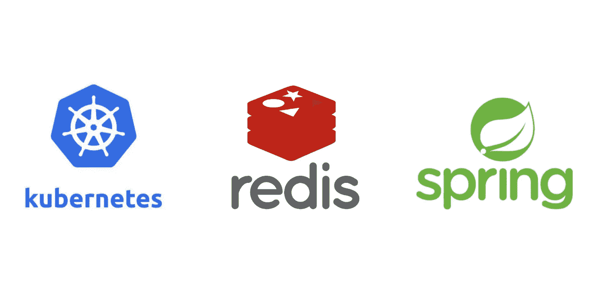

# 分布式缓存综合指南

> 原文：<https://betterprogramming.pub/a-comprehensive-guide-to-distributed-caching-471a0319ed35>

## 在 Kubernetes 集群上启动 Redis 主从集群并实现支持分布式缓存的 Spring boot 应用程序的指南。



嗨，伙计们，

我现在正在做一个性能优化项目。这个项目的目标很不现实，因为我们试图在互联网上的任何地方实现<= 1Seconds response time, and we are dealing with over 1billion data sets. When I got the project requirements the first thing that came to my mind was ‘why not caching ?’ definitely caching should play a considerable role in this requirement.

So when we start the project we begin a couple of POCs to build the ecosystem, but the challenge is I don’t see a comprehensive guideline in ***Kubernetes+Redis+spring boot***栈。所以我决定值得与开发社区分享我的实现步骤。

```
**Note:**The scope of this article is to provide comprehensive guidelines to spin up a Redis master-slave cluster on the Kubernetes cluster and implement a distributed caching-enabled Sprinboot app.A comprehensive introduction to Kubernetes/Redis/Spring boot is out of the scope of this article.
```

## **先决条件**

1.  启动并运行 Kubernetes 集群
2.  Node.js v16.15.0 或本地
3.  本地的首选 IDE 或文本编辑器
4.  Java 8 或本地的最新版本

## 在 Kubernetes 上部署 Redis 集群

以下步骤描述了如何在 Kubernetes 上设置 Redis 主从集群。我强烈建议在部署到生产环境之前，对 K8S 存储类/持久卷/配置图对象进行一些研究。如果您需要获得关于以下步骤[的全面知识，请阅读本](https://www.containiq.com/post/deploy-redis-cluster-on-kubernetes)教程。

1.  创建名称空间

在 K8S 集群上运行以下命令来创建名称空间，这将允许更有效地管理 K8S 集群上的对象。

```
kubectl create ns redis
```

2.定义存储类别

现在，我们将创建一个应用于整个集群的存储类。在 K8S 集群上运行以下命令来创建存储类。`storage-class.yaml`包含配置。

storage-class.yaml

```
kubectl apply -f storage-class.yaml
```

3.创建永久卷

在此解决方案中，我们在 Redis 集群上创建了 3 个节点，因此我们需要 3 个持久卷。在 K8S 集群上运行以下命令来创建持久卷。`persistent-volume.yaml`包含配置。

持久卷. yaml

```
kubectl apply -f persistent-volume.yaml
```

4.创建配置图

您可以在这里获得 [ConfigMap 清单的配置。请确保更改`masterauth` & `requirepass` 值。这两个变量是 Redis 集群主&从节点的密码。如果对两者使用相同的值，将易于维护。](https://gist.github.com/bharathirajatut/dcebde585eba5ac8b1398b8ed653d32d)

```
kubectl apply -n redis -f redis-config.yaml
```

5.使用 StatefulSet 部署 Redis

StatefulSet 在需要控制主从行为时管理 pod。在 K8S 集群上运行以下命令来创建持久卷。`persistent-volume.yaml` 包含配置。

redis-statefulset.yaml

```
kubectl apply -n redis -f redis-statefulset.yaml
```

6.创建负载平衡器服务

在 Kubernetes 部署的最后一步，我们将通过公共 IP 公开 Redis 服务器。为此，我们部署了负载平衡器服务。

```
kubectl apply -n redis -f redis-lb.yaml
```

6.1 检查外部 IP

一旦你部署了负载均衡器，几分钟后集群将提供一个公共的外部 IP。为了检查，请在几分钟内运行以下命令。

```
kubectl get service -n redis
```

## 从本地访问 Redis 集群

对于这一步，您必须在本地计算机上安装 Node.js v16.15.0 或最新版本。这一步是可选的，但是为了检查日志/验证连接性，最好能够通过`redis-cli`访问远程 Redis 集群。为此，您不需要在本地机器上安装 Redis 服务器。

1.  安装 redis-cli

```
npm install -g redis-cli
```

2.访问 Redis 集群

一旦 npm 安装成功，您可以在终端上运行以下命令之后的任何`redis-cli`支持的命令。

```
rdcli -h {host} -a {password} -p {port}
```

3.使用 redis-cli 监控 Redis 集群

我将分享一些有用的命令来对 Redis 集群进行基本的维护。您可以使用以下命令刷新所有键并检查集群上存储的值。

3.1 检查 Redis 群集中存储的值

```
rdcli -h {ip} -a {password} -p {port}xxx.xxx.xxx.xxx:xx> KEYS *
```

3.2 刷新 Redis 集群上的缓存

```
rdcli -h {ip} -a {password} -p {port} FLUSHALL
```

## 实施 Springboot 应用程序

现在我们将实现具有分布式缓存功能的 Springboot 应用程序。这个应用程序包含一个 GET 服务返回字符串值，但是使用`Thread.sleep`控制响应时间。让我们看看分布式缓存解决方案如何帮助我们克服这种缓慢。

1.  将以下依赖项添加到 POM

2.Redis 配置

要访问 Redis 远程服务器，我们需要在属性文件中添加一些属性，并在根包中实现 RedisConfiguration 类。

应用程序.属性文件

RedisConfiguration.java 文件

3.创建 RESTful web API

至此，我们已经讨论了属于远程 Redis 集群的配置。现在我们将实现一个典型的 spring boot Rest API &惟一的变化是我们在主类和服务类中提供了一些注释来配置缓存启用。

BookingServiceApplication.java(主班)

BookingController.java(控制器类)

BookingService.java(服务等级)

```
curl -X GET \
  [http://localhost:8080/booking](http://localhost:8080/booking)
```

一旦完成了 spring boot Rest 服务的实现，就可以启动服务器并尝试上面的 GET 方法。由于`Thread sleep`，初始呼叫应该花费 5 秒以上。但是当你尝试第二次响应时应该花费< 1 秒，因为响应过程来自 Redis 缓存服务器而不是触及服务层。

另外，请注意，我们在`application.properties`文件上设置了缓存生存时间属性，因此当您在 10 秒钟后再次执行 GET 请求时，您会注意到请求再次从服务层处理，花费了> 5 秒钟。

我希望这个指南能节省你的时间。

快乐编码…