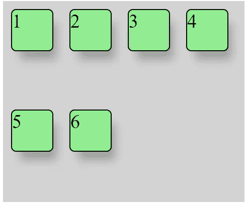
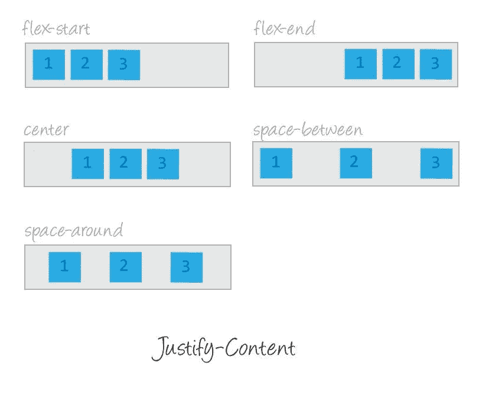
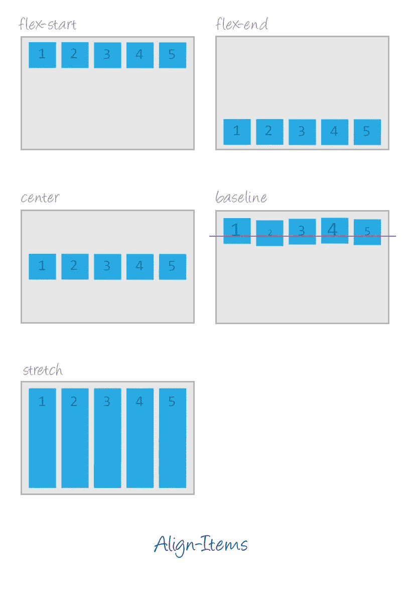
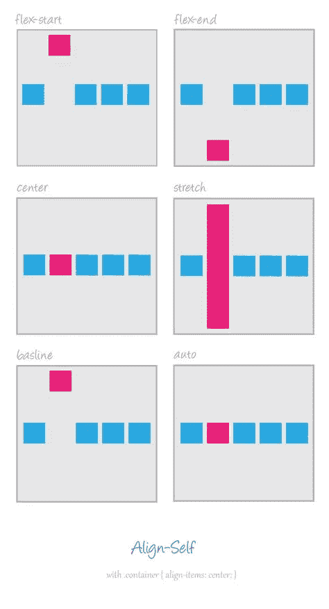
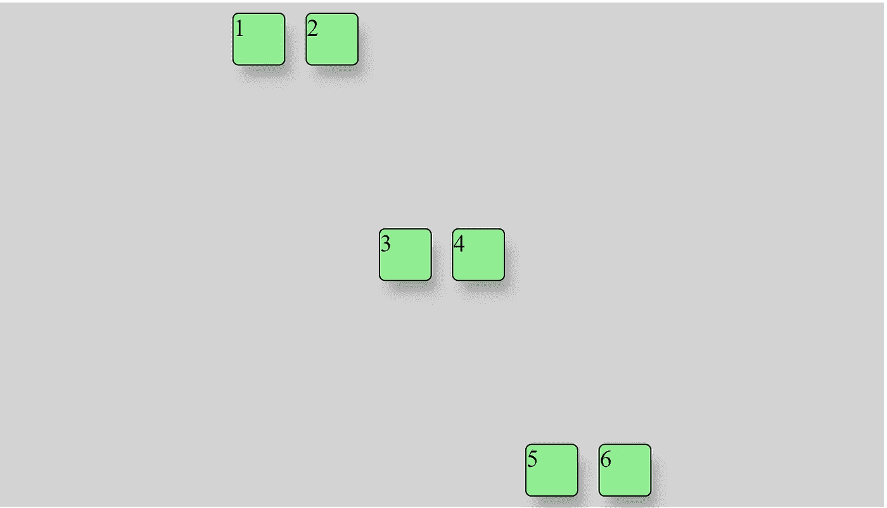
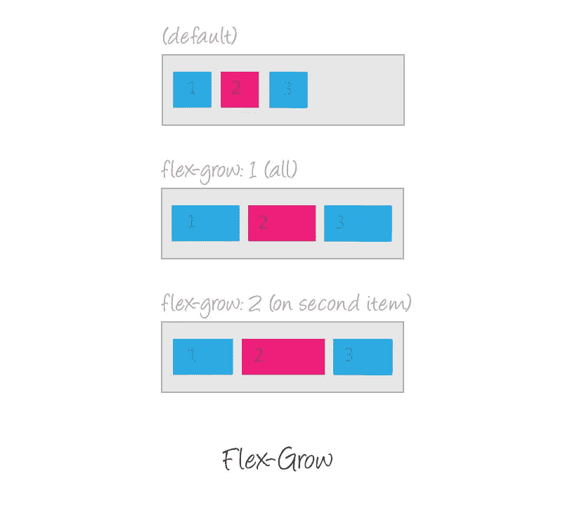
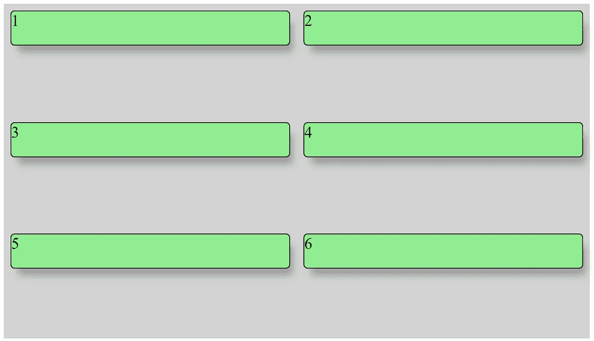

# Flexbox 综合指南

> 原文：<https://betterprogramming.pub/a-comprehensive-guide-to-flexbox-ca0ffdf770c6>

## 带着一些幽默去学习 Flexbox


照片由[哈尔·盖特伍德](https://unsplash.com/@halgatewood?utm_source=medium&utm_medium=referral)在 [Unsplash](https://unsplash.com?utm_source=medium&utm_medium=referral) 上拍摄

作为一个优秀的前端开发者，你不能忽视 2020 年的 Flexbox。这是一个 CSS 模块，可以帮助你使你的网站响应轻松。

但是，如果你没有掌握主要原理，Flexbox 的应用会相当混乱。

我将向您介绍它所有重要的特点和属性。还将有三个挑战，其中我将演示如何正确使用各个属性。在 CodePen 中的这个[代码片段中，您可以随意尝试它们。](https://codepen.io/Dromedian_sk/pen/RwPyewQ?editors=1100)

另外，非常感谢[挑战](https://medium.com/u/b224eb94799d#1</h1><h2 id=)

[让我们在下面的例子中演示一下`flex-direction`和`flex-wrap`，然后我们继续。我想把盒子排成一排，如果需要的话，它们应该包装起来，就像这样:](https://medium.com/u/b224eb94799d#1</h1><h2 id=)

[](https://medium.com/u/b224eb94799d#1</h1><h2 id=)

## [解决办法](https://medium.com/u/b224eb94799d#1</h1><h2 id=)

[以下是来自 flex 容器的代码:](https://medium.com/u/b224eb94799d#1</h1><h2 id=)

```
.flex-container {
  height: 200px;
  **display: flex;
  flex-direction: row;
  flex-wrap: wrap;**
}
```

[**提示:**您也可以使用`flex-flow`属性，它只是`flex-direction`和`flex-wrap`的简写，它们一起定义了 flex 容器的主轴和横轴。](https://medium.com/u/b224eb94799d#1</h1><h2 id=)

```
flex-flow: <‘flex-direction’> || <‘flex-wrap’>
```

[所以我们可以这样应用它:](https://medium.com/u/b224eb94799d#1</h1><h2 id=)

```
.flex-container {
  height: 200px;
  **display: flex;
  flex-flow: row wrap;**
}
```

[](https://medium.com/u/b224eb94799d#1</h1><h2 id=)

# ['对齐-内容'](https://medium.com/u/b224eb94799d#1</h1><h2 id=)

[这定义了沿主轴的对齐。当一行中的所有 flex 项目都不灵活，或者灵活但已达到其最大大小时，它有助于分配剩余的额外可用空间。当项目溢出该行时，它还对项目的对齐施加一些控制。](https://medium.com/u/b224eb94799d#1</h1><h2 id=)

[在该属性中，有五个值可用。下图描述了每个值的行为:](https://medium.com/u/b224eb94799d#1</h1><h2 id=)

[](https://medium.com/u/b224eb94799d#1</h1><h2 id=)

[内容对齐属性](https://medium.com/u/b224eb94799d#1</h1><h2 id=)

[](https://medium.com/u/b224eb94799d#1</h1><h2 id=)

# ['对齐项目'](https://medium.com/u/b224eb94799d#1</h1><h2 id=)

[该属性与`justify-content` 非常相似——除了它在横轴而不是主轴上对齐项目。这是一张包含所有可用值的图片:](https://medium.com/u/b224eb94799d#1</h1><h2 id=)

[](https://medium.com/u/b224eb94799d#1</h1><h2 id=)

[align-items 属性](https://medium.com/u/b224eb94799d#1</h1><h2 id=)

[](https://medium.com/u/b224eb94799d#1</h1><h2 id=)

# ['自我对齐'](https://medium.com/u/b224eb94799d#1</h1><h2 id=)

[这允许单个伸缩项目的默认对齐(或由`align-items`指定的对齐)被覆盖。可用值与`align-items`属性中的值相同:](https://medium.com/u/b224eb94799d#1</h1><h2 id=)

[](https://medium.com/u/b224eb94799d#1</h1><h2 id=)

[自对齐属性](https://medium.com/u/b224eb94799d#1</h1><h2 id=)

[](https://medium.com/u/b224eb94799d#1</h1><h2 id=)

# [练习练习#2](https://medium.com/u/b224eb94799d#1</h1><h2 id=)

## [挑战](https://medium.com/u/b224eb94799d#1</h1><h2 id=)

[我上面解释的理论在项目应该如何表现方面似乎是显而易见的。然而，如果你想避免意外的行为，你必须遵守 Flexbox 的一些原则。让我们在示例中演示一下。](https://medium.com/u/b224eb94799d#1</h1><h2 id=)

[我们希望按照以下方式定位我们的绿色盒子:](https://medium.com/u/b224eb94799d#1</h1><h2 id=)

[](https://medium.com/u/b224eb94799d#1</h1><h2 id=)

[这是我们的 HTML 结构:](https://medium.com/u/b224eb94799d#1</h1><h2 id=)

## [解决办法](https://medium.com/u/b224eb94799d#1</h1><h2 id=)

[根据理论，我们可以在`flex-container`上使用`justify-content`和`align-items`，所以我们将它沿主轴和横轴居中:](https://medium.com/u/b224eb94799d#1</h1><h2 id=)

```
.flex-container {
  **display: flex;
  justify-content: center;
  align-items: center;** }
```

[但这还不够。](https://medium.com/u/b224eb94799d#1</h1><h2 id=)

[在这种情况下，flex 项目仅沿主轴对齐中心，因为 flex 容器和包装器是一个`div`元素，默认设置为`width: 100%`。](https://medium.com/u/b224eb94799d#1</h1><h2 id=)

[**注意:**记住，对齐时，`flex-container`必须始终定义`width`和`height`。](https://medium.com/u/b224eb94799d#1</h1><h2 id=)

[现在我们唯一需要做的就是将顶部的盒子与`first-column`类对齐，底部的盒子与`third-column`类对齐。我们可以通过`align-self`属性来实现:](https://medium.com/u/b224eb94799d#1</h1><h2 id=)

```
.first-column {
  **align-self: flex-start;**
}.third-column {
  **align-self: flex-end;**
}
```

[](https://medium.com/u/b224eb94799d#1</h1><h2 id=)

# [“伸缩”和“伸缩”](https://medium.com/u/b224eb94799d#1</h1><h2 id=)

[使用`flex-grow`属性，您可以处理需要一些 flex 项目增长的情况。它接受作为比例的无单位值。它控制该项目在`flex-container`内应该占据多少可用空间。](https://medium.com/u/b224eb94799d#1</h1><h2 id=)

[如果所有项目都有`flex-grow: 1`，那么`flex-container`中的剩余空间将平均分配给所有子项目。如果其中一个孩子的值为`2`，剩余的空间将占据其他孩子两倍的空间(或者至少它会尝试这样做)。](https://medium.com/u/b224eb94799d#1</h1><h2 id=)

[](https://medium.com/u/b224eb94799d#1</h1><h2 id=)

[**注意**:负数无效。](https://medium.com/u/b224eb94799d#1</h1><h2 id=)

[`flex-shrink`与`flex-grow`正好相反。如有必要，您可以定义一个`flex-item`来缩小，这样该项目将比其他项目占用更少的空间。](https://medium.com/u/b224eb94799d#1</h1><h2 id=)

[](https://medium.com/u/b224eb94799d#1</h1><h2 id=)

# ['弹性基础'](https://medium.com/u/b224eb94799d#1</h1><h2 id=)

[该属性定义了剩余空间被分配前`flex-item`沿`flex-container`主轴的大小。可以是长度(如`20%`、`5rem`等)。)、`auto`或`content`。](https://medium.com/u/b224eb94799d#1</h1><h2 id=)

[`auto`关键字意味着“查看我的宽度或高度属性”额外的空间将根据其`flex-grow`值进行分配。](https://medium.com/u/b224eb94799d#1</h1><h2 id=)

[`content`关键字表示“大小取决于项目的内容”](https://medium.com/u/b224eb94799d#1</h1><h2 id=)

[如果设置为`0`，内容周围的额外空间不计算在内。检查这个](https://medium.com/u/b224eb94799d#1</h1><h2 id=)[图形](https://www.w3.org/TR/css-flexbox-1/images/rel-vs-abs-flex.svg)。

# '灵活'

这个属性只是前面三个属性组合的简写。第二和第三个参数(`flex-shrink`和`flex-basis`)是可选的。默认是`flex: 0 1 auto`，但如果用单个数值设置，就像`<number> 1 0`。

注意:建议您使用这个简写属性，而不是设置单独的属性。速记智能地设置其他值。

# 练习练习#3

这个挑战可能是最有用的，同时也是最困难的。

## 挑战

假设我们只能使用 Flexbox，我们希望我们的绿盒有三行两列。所以它应该是这样的:



## 解决办法

如图所示，我们首先需要告诉`flex-container`包装物品。这一点我们已经知道:

```
.flex-container: {
  display: flex;
  **flex-wrap: wrap;** }
```

现在是有趣的部分。有了关于`flex`属性的知识，我们可以用一行代码解决它:

```
.flex-item {
  **flex: 1 0 50%;**
}
```

`1`代表`flex-grow` , `0`代表`flex-shrink`,`50%`代表`flex-basis`。你可能认为这将永远有效——但是有一个问题。

在`flex-basis`中，你需要数包括物品的`border`和`margin`(从两边！)，因为他们在扩展它的宽度。

下面是一个代码示例，展示了它的外观:

# 结论

有了 Flexbox 的知识，我很确定你会成为一个更好的前端开发人员，主要是在样式组件方面。CSS 的知识在大多数项目中被低估了，但是如果你的应用程序看起来很糟糕，不能在移动屏幕上使用，它就不会吸引潜在客户的目光。

我要说的是，如今应用程序流畅的响应能力至关重要。

如果您想定位单个组件，Flexbox 可能会满足您的需求。在这种情况下，您可以使用`position`属性，我在这里解释了它:

[](https://medium.com/better-programming/how-to-use-the-position-property-in-css-926a3ea8a9b2) [## 如何在 CSS 中使用 position 属性

### 一个 CSS 布局的基本原理在简单的盒子例子中演示

medium.com](https://medium.com/better-programming/how-to-use-the-position-property-in-css-926a3ea8a9b2) 

感谢您的阅读！