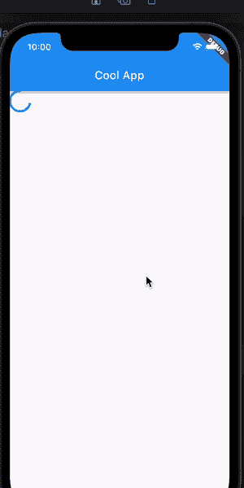

# Flutter 块架构综合指南

> 原文：<https://betterprogramming.pub/a-comprehensive-guide-to-flutters-bloc-architecture-d2d16022b0b9>

## 和 Redux 类似吗？

詹姆斯·温斯科特在 [Unsplash](https://unsplash.com?utm_source=medium&utm_medium=referral) 上拍摄的照片

BLoC 架构在 Flutter 社区已经存在了一段时间，我们可以有把握地说社区喜欢它。该模式如何让我们隔离我们的逻辑，并使其更具可测试性，仅仅是通过在我们的应用程序中做一些改变，这是非常棒的东西。

在本教程中，我们将通过创建一个简单的应用程序来学习 BLoC 概念及其整体流程，在本教程结束时，我们应该已经能够编写实现 BLoC 架构的应用程序。

> 我们将在本教程中使用的 BLoC 版本是 8.0.1(撰写本文时的最新版本)

# 关于集团的一些理论

BLoC 体系结构有三个核心组件:

1.  状态是我们的页面或应用程序可能存在的每一个条件。例如，如果我们从一个页面获取 API，那么我们的页面将至少有三种状态:

*   在这种情况下，我们可能希望在页面上显示一个加载器，这样用户就知道我们正在试图获取一些数据。
*   `ErrorFetchDataState` 在这种状态下，我们可能想要显示一个错误文本，一个重试按钮，或者显示一个警告，通知用户我们的网络调用出现了问题。
*   `SuccessFetchDataState` 在这种状态下，我们可以根据从响应中获得的数据显示卡片或数据的列表。

1.  事件
    事件是 UI 为了改变我们的页面状态而发送的动作(听起来很熟悉，redux 开发者？)
2.  BloC 充当动作处理器和状态变异器，我们也可以在这里处理我们的业务逻辑，例如获取 API，存储共享的首选项等等。有人称他们为减压器。

*从它的概念理论来看，BLoC 与 redux 或 composable architecture 非常相似，所以如果你碰巧理解了其中的一个，你就基本上理解了 BLoC。*

# 让我们编码

导航到您选择的代码编辑器，用您想到的任何名称创建一个新的 Flutter 项目。然后，在 Flutter 为我们创建完样板文件后，像这样在`pubspec.yaml`中添加`flutter_bloc`依赖项。

用此代码替换`main.dart`上的所有内容

在上面的代码中，我们创建了一个主屏幕小部件，在页面中央有一个按钮。非常简单。

我们接下来要做的是，我们将为我们的应用程序添加几个功能，我们最终的应用程序可以根据我们从 API 获得的响应显示食品卡列表或错误消息。

*为了简单起见，我们不会触及任何真正的端点，我们只是在用户每次按下按钮时随机产生结果。*

创建一个名为`food.dart`的新文件，这个文件将包含我们的食品卡的模型。

创建另一个名为`food_generator.dart`的新文件，该文件将为我们提供应用程序上显示的所有虚拟数据。代码如下:

接下来，让我们继续我们的第一个与 BLoC 相关的代码，在这里我们将为我们的状态和事件创建类。

创建一个名为`home_state.dart`的新文件，并在文件中添加以下代码:

从需求来看，我们的 app 目前只能做一件事，就是在按钮按下的时候尝试取数据。由此，我们可以想象我们的页面至少应该有三种状态:

1.  `HomeLoadingState`
    这是我们等待 API 响应时的状态，我们可能想要显示某种加载器指示器或闪烁器，让用户知道它仍在处理。
2.  `HomeErrorFetchDataState`
    这是当我们从 API 收到一个错误时，我们可能想要显示一个警告或者显示一些错误小部件。
3.  `HomeSuccessFetchDataState`
    这是当我们成功地从 API 接收到我们的食物数据时，我们可能想要在这里显示食物卡的列表。

除了上面提到的三个状态，我们还必须创建另一个`HomeInitialState`。这是页面的第一个状态，因为我们不想在用户查看页面时显示加载器。以下是更多相关信息。

接下来，我们应该定义页面可以发送的动作，你可以想象动作是触发状态变化的任何东西。创建一个名为`home_event.dart`的新文件，并在下面添加代码。

因为我们的主页目前只能做一件事，获取数据，我们必须创建这个获取数据事件作为我们的`HomeEvent`之一。记住发送事件是我们的小部件告诉 BLoC 他们想要做什么的方式。

例如，如果您想在我们查看页面时点击追踪器，您可以在这里添加另一个事件。

最后，我们必须创建一个 BloC 类，这个类充当一个动作处理器，执行所有的业务逻辑，并通过它的状态构造将结果返回给我们的页面。创建一个名为`home_bloc.dart`的新文件，并添加以下代码:

home_bloc.dart

我们的`HomeBloc`扩展了 base Bloc 类，它需要两个参数:我们的事件和状态类。这是为了告诉 Bloc 我们正在分别处理 HomeEvent 和 HomeState 类型的事件和状态，这回答了我们为什么将它们创建为抽象类的问题。

在构造函数内部，我们应该通过它的超级构造函数为类提供初始状态。因为我们在第一次查看页面时没有做任何事情，所以我们可以创建另一个空状态，在本例中是`HomeInitialState`。

*但是，例如，如果您想在用户打开页面时直接显示 shimmer，您可以考虑在构造函数中将* `*HomeLoadingState*` *设置为其初始状态。*

在超级构造函数闭包内，我们必须列出所有可能发送到我们的`HomeBloc`的事件，因为我们只有一个动作，所以我们只放一个。或者如果你喜欢更友好的解释，第 6 行可以这样理解:

*当 HomeBloc 收到一个* `*FetchDataEvent*` *时，它会尝试通过执行给它的处理程序来处理事件，这里是* `*_onFetchDataEvent*` *函数。*

现在，我们在`_onFetchDataEvent`里面做什么？

请记住，我们希望获取数据并将响应返回到我们的主页。在这种情况下，我将延迟函数执行两秒钟来模拟网络调用，并生成一个随机布尔值来确定我们得到的是食物列表还是错误。

在处理所有这些逻辑的同时，我们希望在页面上显示一个加载程序，因此算法如下:

1.  将状态更改为`HomeLoadingState`
2.  延迟功能执行两秒钟以模拟网络呼叫
3.  random a boolean，如果为真，我们将状态更改为`HomeSuccessFetchDataState`，带来一个虚拟食物列表，否则，我们将状态更改为`HomeErrorFetchDataState`。

对`_onFetchDataEvent` 功能增加一些修改:

恭喜你！我们刚刚完成了我们的代码。

最后要做的一件事是修改我们的小部件(主屏幕),以便它可以监听 BLoC 内部发生的状态变化。完成后，我们可以根据我们的状态相应地更改我们的 UI(例如，当错误发生时显示一些重试按钮，等等)。).

幸运的是，集团图书馆为我们提供了保护。我们所要做的就是将我们的小部件包装在一个`BlocConsumer`小部件中，然后我们就可以开始了！

导航至`main.dart`并将代码更改如下:

BlocConsumer 要求我们定义两个属性，即监听器和构建器。

每次状态改变时，都会触发构建器代码块。所以我们要列出所有可能的状态，这也是为什么我们能看到很多`if state is`；这是因为我们必须具体处理每个状态。

当状态改变时，监听器块也将被执行。监听器和构建器的区别在于，构建器希望我们返回一个小部件。换句话说，`what kind of UI you want to show to the user when the state is X, Y, or Z`。另一方面，侦听器不要求我们返回一个小部件。这是我们做副作用的地方，比如显示警告，小吃店，点击跟踪器等。

在构建器中的每个状态上添加小部件，这样我们的主屏幕就像下面这样:

对于`HomeLoadingState`，我只是返回了一个`CircularActivityIndicator`作为`HomeSuccessFetchDataState`的加载器，我返回了一个`ListView`以便用户可以看到我们所有的食物，并且我们返回了一个错误文本，在`ErrorState`上有一个重试按钮。

接下来，我们必须将我们的`HomeScreen`包装在`runApp`函数的`BlocProvider`中。这样做是为了给`HomeScreen`及其所有子节点提供对 bloc 的访问。否则，我们将收到一条错误消息，指出找不到该块。

之后，为了做到这一点，我们还必须在 home 小部件上添加发送事件功能。我们必须在主屏幕小部件中获取`HomeBloc`，因为我们已经通过`BlocProvider`提供了它们，所以我们可以从上下文中读取它们。

在主屏幕小部件中添加一个`HomeBloc`属性和一个`initState`函数，如下所示:

最后，在每个`onPressed`函数中添加事件发送代码:

我们最终的`main.dart`将是这样的:

试着运行这个应用程序，瞧！，我们的应用程序应该完成的要求履行！

# 结论

BLoC 与 redux 或 composable architecture 非常相似，它们都有一个充当动作处理程序的实例，我们在其中处理所有的业务逻辑。并且 UI 发送状态变化动作并监听状态变化以执行必要的更新。

您可以在我的存储库中找到完成的代码:

 [## GitHub-aryasurya 21/bloctorial at 已完成

### 一个新的颤振项目。这个项目是颤振应用的起点。一些帮助您入门的资源…

github.com](https://github.com/aryasurya21/bloctorial/tree/completed) 

您可以在他们官方文档中了解更多关于 BLoC 的信息:

 [## 阻塞状态管理库

### 集团国家管理图书馆的官方文件。支持镖，扑，角。包括…

bloclibrary.dev](https://bloclibrary.dev/#/flutterbloccoreconcepts) 

编码快乐！