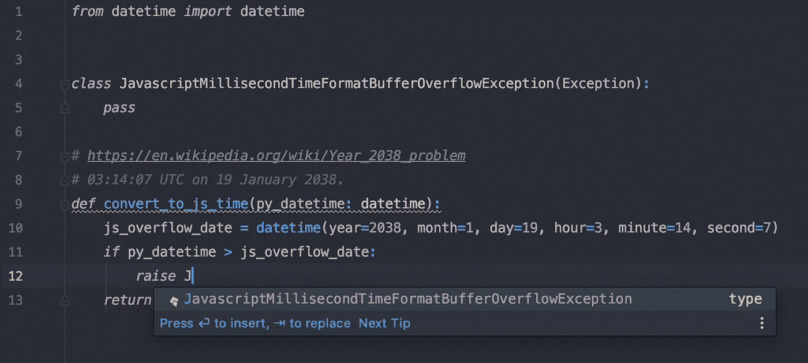
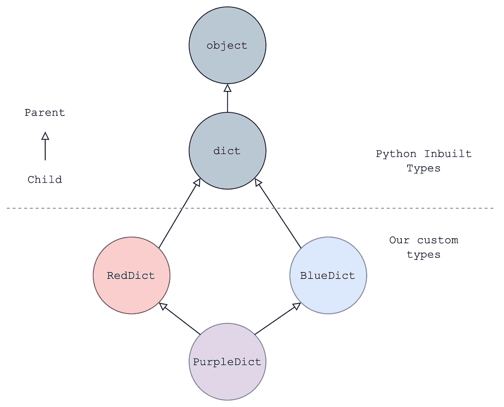
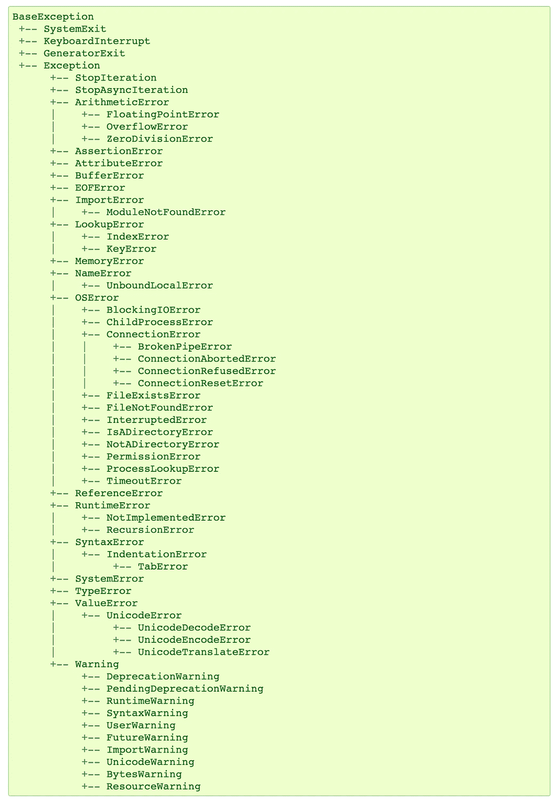

# Python 中处理异常的综合指南

> 原文：<https://betterprogramming.pub/a-comprehensive-guide-to-handling-exceptions-in-python-7175f0ce81f7>

## Python 异常处理最佳实践的注意事项

由 [Unsplash](https://unsplash.com/collections/9641853/i-am-a-creator%3A-chaitra-radhakrishna?utm_source=unsplash&utm_medium=referral&utm_content=creditCopyText) 上的[转换器](https://unsplash.com/@convertkit?utm_source=unsplash&utm_medium=referral&utm_content=creditCopyText)拍摄的照片

没有人希望他们的代码抛出错误，但是 Python 中的异常可以有各种各样的用例，并且对于编写好的代码至关重要。

本文描述了编写异常时应该做什么和不应该做什么的一些例子。希望它能让您对异常处理有更深的理解，并提供一些有用的 Python 技巧。

# 一定要写很多异常

*   `AttemptedToAccessCoreDatabasePriorToDatabaseTransactionBeingInitiatedException`
*   `JavascriptMillisecondTimeFormatBufferOverflowException`
*   `CannotDeleteUserAccountThatDoesntExistException`

例外，例外，到处都是例外。这些名字读起来很有挑战性，而且打字很长，但是它们真的那么可怕吗？

这些异常非常好地提供了最有价值的功能——它们是具体的、信息丰富的、切中要害的。

好吧，最后一个可能会被重命名为`CannotDeleteNonExistentUser`，当然，但关键是他们很清楚。你知道去哪里找到问题，你也知道如何`try except`删除一个已经被删除的用户。

在 Atom、Visual Studio 和 IntelliJ 出现之前，在 Vi 和 Nano 领域，可变的名称长度实际上会影响开发人员的工作效率。

我用 Vim 学习了 C 语言编码，没有自动完成功能。是的，我曾经给东西起名`int num`或`char* s1`。当然，我很懒。当然，我是一个年轻的学生。而且，我必须在`num`中输入所有这三个字符。这些天，在我的 IDE 意识到我在做什么并完成工作之前，我会幸运地输入两个以上。

[2038 年将会是非常奇怪的一年……](https://en.wikipedia.org/wiki/Year_2038_problem)

长名字不再会减慢开发速度，但是对于调试或阅读代码的人来说，它们确实有很大的好处。没错——异常不仅仅是为了调试或处理。他们也帮助人们理解正在发生的事情。举下面这个例子。

一些供应商只想看着整个世界燃烧。

我们肯定可以重构它，使响应代码成为 enum 或类似的表达格式，但是在这段代码中没有混淆，无论这些随机响应代码是什么，它们都意味着我们没有启用双因素身份验证，我们需要在我们的示例提供程序中配置此设置以使其工作。

经验法则:只要你有关于特定的、可复制的边缘案例的信息，就使用它。

但是为什么要为异常费心呢？我们在测试中一直使用断言，它们做得很好。为什么不直接用它们来代替异常呢？

# 除非你在测试中，否则不要“断言”

`assert`和`raise`似乎功能相似。两者都停止控制流，两者都可以终止程序，两者都可以记录/打印一条解释原因的消息。

起初，使用`assert` s 来确认一切都处于有效状态似乎很诱人，但是这在企业 Python 开发中被认为是不好的做法。有几个原因，他们可以成为自己的一篇文章。

但是长话短说:你可以定制异常处理和异常细节，并且异常`raises`永远不会被[“优化”出你的代码](https://github.com/IdentityPython/pysaml2/issues/451)。

**经验法则:**你应该只断言*不可能的条件，*比如断言你刚刚平方的值不是负的(假设你没有在模拟量子物理或其他同样疯狂的东西)。如果断言失败的可能性微乎其微，那么就应该用异常来代替它。

人们经常犯这种错误的一个典型例子是在与第三方提供商打交道时。

假设你正在你的应用程序中调用一个雅虎天气 API，你决定添加一个`assert`到`response is not None`。您选择了一个`assert`,因为 Yahoo 总是返回天气信息(尽管预测可能不总是正确的)。

但是当雅虎的天气 API 遭遇中断时会发生什么呢？突然间，你所有的服务都失败了，你所能做的就是`AssertionError: response is None`。

现在我敢肯定雅虎天气可能是非常可靠的，你可能有你的日志行号。但是没有理由不花一分钟的额外开发时间来创建一个`WeatherProviderUnresponsiveException` ( [“给事物命名很难……【让作者休息一下】”— Phil Karlton](https://martinfowler.com/bliki/TwoHardThings.html) )。

好的，我们应该使用大量的异常，但是我们应该使用哪些异常呢？在深入研究之前，我们需要理解异常处理(以及一般的编程)中的一个关键概念。

# 快速切线—什么是类型继承？

让我们从最基本的开始，因为有很多东西需要解开。

首先，继承。当 Python 中的一个类从另一个类继承时，它会采用所有的方法和属性，但它也会采用父类的类型——也就是说，在 Python 的世界中，我是我自己，但我也是我的父亲和母亲。即使您覆盖了父类的方法或属性，您仍然会保留类型继承。让我们看一些代码来解释。

在开始之前，有一点需要注意:类并不完全是类型，[但是它们有点像](https://stackoverflow.com/questions/4162578/python-terminology-class-vs-type)。好了，现在你比以前更困惑了，让我们看一些代码:

我们在这里定义了一些自定义类型，它们都继承自内置的`dict`类。以`RedDict`为例，它有`RedDict`类型，也有`dict`。

`isinstance(red_map, dict) # True`

`isinstance(red_map, RedDict) # True`

然而，反过来就不正确了——因为`RedDict`不是`PurpleDict`。

`isinstance(red_map, PurpleDict) # False`

运行上面的代码片段来查看上面所有类的结果。

在 Python 中，你可以对象化任何东西，因为任何东西都是对象

好了，现在让我们回到刚才的地方…

`try:
segway_about_types()
except OnATangentError, Exception as e:
smooth_transition(e)`

# 不要捕捉/ Except“异常为 e”

捕捉所有异常并丢弃它们是第二个最有效的方法来获得无 bug 的代码([第一个是删除所有代码](https://www.youtube.com/watch?v=ySDX02WD0og))。所以这肯定意味着它是好的，对吗？

捕获`Exception`的问题与类型继承有关(因此是间歇期),因为我们不仅要捕获应用程序中的所有自定义异常，还要捕获大量 Python 内置的异常，包括一些您可能不想丢弃的异常。

Python 内置的异常具有复杂的继承结构。这是来自文档的最新列表，其中每个缩进都表示继承。

你不希望 [Python3 文档](https://docs.python.org/3/library/exceptions.html)有漂亮的图表吗？

这种层次结构有一个很好的理由，所以你可以使用类型继承来聪明地捕捉异常(见下一点)。

我们刚刚学到的类型继承告诉我们，这意味着一个`TypeError`也是一个`Exception`(它的父)，所以当我们捕获`Exception`时，`TypeError` s 也会被捕获。这可能没问题。

但是`ModuleNotFoundError`呢？如果你的程序完全丢失了一个依赖项，你真的希望它继续运行吗？那`MemoryError`呢？当然，当 Python 在你的记忆卡中窒息的时候，你不想回头。

你不仅会捕捉到所有这些疯狂而奇妙的内置异常，还会捕捉到所有自定义异常(是的，除了那些从`BaseException`而不是`Exception`派生的异常)。

这真的是你想做的吗？或许，解决方案是捕获多个特定的自定义异常(通过元组实现)，如下所示:

`except (FileNotFoundError, IsADirectoryError, PermissionError) as e:`

这将安全地捕捉到一个`FileNotFoundError`，但不会捕捉到更危险的`OSError`，比如`ChildProcessError`。

当然，有些情况下，捕捉所有异常是您想要做的，但是这种情况很少。同样需要注意的是，如何处理异常在这里也很重要。如果您捕获了所有异常，但随后再次引发该异常或使用`logger.exception()`，这不是问题。

您可能希望捕获所有异常的一些示例:

*   在从队列中提取消息并一次处理一条消息时，您可以使用`logger.exception()`来记录问题，而不会中断流程
*   作为服务级别的混乱工程实践的一部分，特别是对于异步服务，你可以捕捉所有的异常，安全地关闭一切，然后引发或记录异常
*   Web 抓取或爬行链接是一项肮脏的任务，经常会抛出各种错误——在某些情况下，这需要非常广泛的异常处理。

**经验法则:**尽可能捕捉具体的错误。除非你确切知道自己在做什么，否则不要抓到`Exception as e`。

我确实提到过内置的异常层次很有用。让我们来看看例外是如何为我们服务的，而不是对我们不利的。

# 在合理的情况下，一定要使用内置异常

这可能听起来像是对早期编写大量异常的反驳，但有时使用简单的内置 Python 异常(如`ValueError`或 TypeError)是有意义的。

假设你正在制造一辆汽车，它可以是电力驱动的，汽油驱动的，或者是混合动力的，你想要传递两个布尔值来创建一辆指定引擎类型的汽车。

这是一个适合使用`ValueError`的完美例子。您不能在您的函数定义(RIP 覆盖函数)中定义至少一个 electric 或 petrols 必须是`true`的规则，因此您需要手动检查这一点。

**注意:**这是一个人为的例子，我创建它来证明一个观点——不要像这样使用布尔标志。

这是一个使用`inbuild ValueError`的好机会，因为许多程序可能会`try except`这个错误并使用它。例如，一个自动运行参数测试的程序可能会运行每一个`true`、`false`和`except`的组合，并跳过任何返回`ValueErrors`的组合。

然而，我喜欢更进一步。我们可以使用类型继承来增加代码的可读性，方法是从更具体的异常(如`ValueError`)中继承我们的异常。这样，任何捕获`ValueError`的程序也会捕获我们的异常，但是我们可以添加自定义代码和名称。

必须…写…更多…异常。

**经验法则:**总是尽可能从特定的内建异常中继承。如果您没有任何额外的信息要添加，就使用内置的异常。

有关内置 Python 异常及其层次结构的完整列表，请参见[官方文档](https://docs.python.org/3/library/exceptions.html)。

# 不要将敏感数据放在异常消息中

我想要一个安全的系统，所以这很有意义。(不确定这是什么意思？[查看这篇文章](https://medium.com/better-programming/why-is-there-an-f-before-this-string-9a87e6d43563))。

这是一个很好的例外——这个例外的含义很清楚，我已经提供了足够的信息，而且它足够具体，可以安全地包装在一个 try 中——例如，如果我们对管理员密码比对用户密码更放松的话，就会有不同的处理方式。

这里的问题归结为敏感数据。我在这里用了一个不公平的例子，所以我希望你能明白这不是一个好的例外。这种异常将通过您的日志、响应、监控软件，甚至可能落入不良分子的手中，输出原始文本密码。

供内部使用的异常(参见底部关于面向客户端的异常的注释)可以包含技术细节，如`user_ids`或导致崩溃的特定数据，但重要的是要记住，当异常发生时，这些消息将通过日志记录、报告和监控软件广泛传播——如果您不小心，可能会传播到您的用户。

当然，这一切都归结于良好的软件设计，但在一个围绕个人数据的监管不断变得越来越严格的世界，你怎么小心都不为过，而且几乎总是有可能在不损害客户隐私的情况下提供有价值的错误信息。

**经验法则:**不要在异常消息中使用敏感信息。

不过，你需要担心的不仅仅是客户隐私。坏演员无处不在。

假设你运营一个网站，用户供应量很大，你计算这个数字的因子。我们姑且称你的网站为`FactoriseMe.com`。

你即将提高你的种子投资，但是市场上突然出现了一个竞争者，`NumbersWithinNumbers.com`。你已经测试了他们的产品，虽然它能工作，但没有你的快。而且客户体验差很多。

您的一位开发人员注意到，对于非常大的数字，您的后端服务很难计算这些因子——事实上，对于非常非常大的数字，该服务花费了整整 180 秒来处理数字，然后超时。

您决定继续改善您的客户体验，向客户回复一个很好的错误:“计算器在计算系数时超时。不好意思，这几个比较硬。”

这太棒了。现在客户知道为什么网站找不到任何因素了。你走进你的投资者给一个演示，突然你的网站关闭了。发生了什么事？

查看日志后，您注意到在上午 9 点到 10 点之间，您收到了 1，000 个数量巨大的请求，来自路那头的一个 IP 地址，离 NumbersWithinNumbers 总部不远。这些请求使您的后端服务超载，并使您的网站崩溃。发生了什么事？

你暴露了你的弱点。永远不要暴露你的弱点。或者至少不要向用户暴露你的软件内部工作的弱点。黑客、竞争对手、巨魔，互联网上到处都是想要破坏你所建立的东西的人。是的，你应该给你的用户关于正在发生的事情的反馈，但是永远不要告诉他们你的软件的内部工作方式。

**经验法则:**告诉用户他们能做什么，而不是发生了什么。

你会发现这在许多应用程序中都很常见:“请稍后再试。”“如果这种情况再次发生，请联系支持人员。”“未知错误—很抱歉，我们正在调查。”

但是现在这整件事都跑题了，以用户为中心的异常是一个全新的问题。只要记得从天魔书里的骑士身上取一片叶子，假装一切都好就行了。

# 不要与你的代码的严格性相矛盾

所有这些该做的和不该做的在理论上都很棒，但是在现实世界中，你不得不与其他编写服务的团队打交道，他们有各种各样的例外。

假设团队 A 是创新团队——他们是特立独行的人，不会被你循规蹈矩的工程副总裁驯服。他们决定他们的代码有一个激进的异常策略，在最轻微的变化时抛出异常(在下一点，您将看到为什么这一点也不激进)。另一方面，在团队 B 中，你从 a `TeamBException`继承了所有的异常，很少使用它们，只表示严重的问题。

最终，您不得不使用团队 A 构建的库来完成一个项目，并且发现您甚至不能依赖一个简单的打印函数而不关闭您的服务。您已经到了最后期限，并且您意识到完成任务的唯一方法是用广泛的 try——除了`Exception as e`子句之外——将所有的接口打包，并且希望一切顺利。不理想。

这就是为什么整个代码库包含一致的异常使用和处理是至关重要的。当涉及到异常处理时，您的工程和技术领导副总裁(以及每个人)应该推动一致的原则和实践，因为不一致会很快成为重大的技术债务。

**经验法则:**在你的公司里做一个好的异常处理的传播者。如果你的公司有关于例外的政策，那就遵守它。如果没有，为什么不根据这篇文章写一篇呢？

# 一定要捕捉许多特定的异常

Python 是一种美丽的语言——它非常受欢迎，有大量的学习资源，有各种各样的库，可以做从机器学习到硬件再到网络开发的任何事情。

也许这就是你选择学习 Python 的原因，但是对许多人来说，我们选择 Python 是因为我们相信 Python 的价值。如果这听起来很邪教，那是因为它是。去你的终端，运行 Python。然后输入`import this`。你会看到 Python 的宣言，这是 Python 语言的 19 条([或 20 条](https://stackoverflow.com/questions/4504487/the-zen-of-python-distils-the-guiding-principles-for-python-into-20-aphorisms-bu/24814971#24814971))格言，作者是它的创造者 Tim Peters。

这确实有超越娱乐的价值，因为它提供了对 Python 背后的使命的洞察，并给了我们如何使用它的提示。这种情况下重要的一行是:

> “错误永远不会无声无息地过去。除非明确沉默。”

我希望这一点在以上几点中已经说得很清楚了。我把这理解为:“不要捕捉所有的异常，除非你真的打算这样做，并且经常捕捉显式异常。”

社区中的另一个蟒习语是:

> “请求原谅，而不是许可。”

这就是 Python 与 C、Java 和其他传统语言的传统范例显著不同的地方。Python 处理有异常的流程的方式是直接去做，如果出现异常就处理。

在 C 语言中，在写入文件之前，您可能会编写一行又一行的代码来检查所有的先决条件，例如，文件是否存在，进程是否拥有对文件的写权限，等等。在 C 语言中，忽略所有这些情况并直接写入文件是不好的做法。

在 Python 中，情况完全相反。事实上，在某些情况下，先尝试后处理异常要有效得多。在上面的例子中，虽然文件权限完全有可能是错误的(或者其他问题)，但这是一种边缘情况。大多数情况下，您将写入一个存在且您有访问权限的文件，那么为什么要浪费宝贵的处理能力来检查文件权限呢？

处理这个问题的 Pythonic 方法是将写操作包装在一个 try-except 中，只捕捉可能出现的特定异常/边缘情况，并适当地处理它们。在大多数情况下，写操作会成功，catch 块中的任何逻辑都会完全丢失。万一出了问题，我们仍然会处理。

查看[这个堆栈溢出线程](https://stackoverflow.com/questions/12265451/ask-forgiveness-not-permission-explain)的更多例子。

**经验法则:**当你可以预测和捕捉特定的异常时，不要花费过多的时间检查先决条件(例如，请求原谅，而不是许可)。

# 但是面向客户的异常怎么办？

客户端例外很好，但是非常不同。

本指南的第 2 部分将介绍面向客户端的异常与内部异常的不同之处，并将包括一些关于构建简单有效的异常结构的提示。