# MLOps 平台综合指南:基础设施代码(IaC)

> 原文：<https://betterprogramming.pub/a-comprehensive-guide-to-mlops-infrastructure-as-code-iac-ef4c97742351>

## 使用 Terraform 的 GCP 供应


安德里亚·莱奥帕尔迪在 [Unsplash](https://unsplash.com?utm_source=medium&utm_medium=referral) 上拍摄的照片

## 介绍

Terraform 是许多科技公司用来管理基础设施的工具之一。它正在成为 IaC 中的一个流行工具。它也是云不可知的，可以与任何云提供商合作。所以你可以和 AWS、GCP、Azure、OCI 等合作。我开始学习在我的个人项目中使用 terraform。非常简单易学。它消除了所有手动活动。即使是一个小项目，也会节省很多时间。作为一名 MLOps 人员，您真的需要了解 IaC 吗？我觉得还是学的好。我将介绍地形的基本知识，并提供一些我在项目中使用的 GCP 对象。

在本文中，让我们看看如何使用 terraform 在 ML 项目中构建 GCP 对象。

## 内容:

*   什么是基础设施即代码(IaC)
*   IaC 的优势。
*   命令式与声明式方法。
*   IaC 的主要参与者。
*   将（行星）地球化（以适合人类居住）
*   使用 Terraform 供应 GCP 对象

# 什么是基础设施即代码(IaC)

显示微软**的**文档

> 基础设施即代码(IaC)是描述性模型中基础设施(网络、虚拟机、负载平衡器和连接拓扑)的管理，使用与 DevOps 团队用于源代码的版本相同的版本。就像相同的源代码生成相同的二进制文件一样，IaC 模型每次应用时都会生成相同的环境。IaC 是 DevOps 的一项关键实践，与持续交付结合使用。

简而言之，您通过编写代码来配置基础架构，而不是手动配置。

[](https://devops.stackexchange.com/questions/550/what-is-infrastructure-as-code) [## 什么是“基础设施即代码”？

### TL；DR:代码形式的基础架构是自动化和备份您的环境的一种方式。在理想情况下，灾难过后，你…

devops.stackexchange.com](https://devops.stackexchange.com/questions/550/what-is-infrastructure-as-code) 

# 使用 IaC 的优势

*   速度
*   成本降低
*   可重复性
*   标准化
*   可量测性
*   一致性
*   避免人工干预-自动化
*   可靠性
*   版本管理-Gitops
*   安全性
*   证明文件
*   更快的灾难恢复
*   CICD 一体化

[](https://stackoverflow.com/questions/1077412/what-is-an-idempotent-operation) [## 什么是幂等运算？

### 在计算中，一个幂等运算是一个没有额外效果的运算，如果用相同的…

stackoverflow.com](https://stackoverflow.com/questions/1077412/what-is-an-idempotent-operation) 

# 命令式与陈述式

有两种方法可以编写代码。

*   命令式方法
*   陈述方法

## 命令式方法

*   开发人员定义要执行的确切步骤。
*   系统遵循代码中的指令。

## **声明式方法**

*   开发人员定义所需的最终状态。
*   平台或系统处理实现最终状态所需的步骤。

查看[这篇 StackOverflow 帖子](https://stackoverflow.com/questions/1784664/what-is-the-difference-between-declarative-and-imperative-paradigm-in-programmin)和[这篇文章](https://codeburst.io/declarative-vs-imperative-programming-a8a7c93d9ad2)，了解命令式和声明式方法之间的差异。

Terraform 使用声明式方法。

IaC 的主要参与者有

*   将（行星）地球化（以适合人类居住）
*   Ansible
*   自动气象站云的形成
*   谷歌云部署管理器
*   Azure 资源管理器
*   木偶
*   盐堆
*   厨师

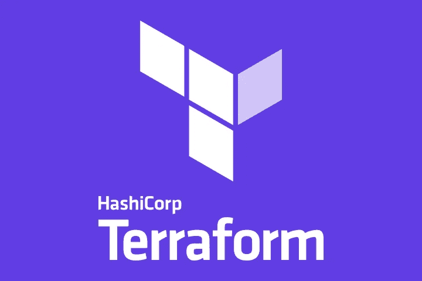

图像信用哈希公司文档

# 将（行星）地球化（以适合人类居住）

根据哈希公司的文件-

> Terraform 是一个基础设施代码(IaC)工具，允许您安全高效地构建、更改和版本化基础设施。这包括计算实例、存储和网络等低级组件，以及 DNS 条目、SaaS 功能等高级组件。Terraform 可以管理现有的服务提供商和定制的内部解决方案。

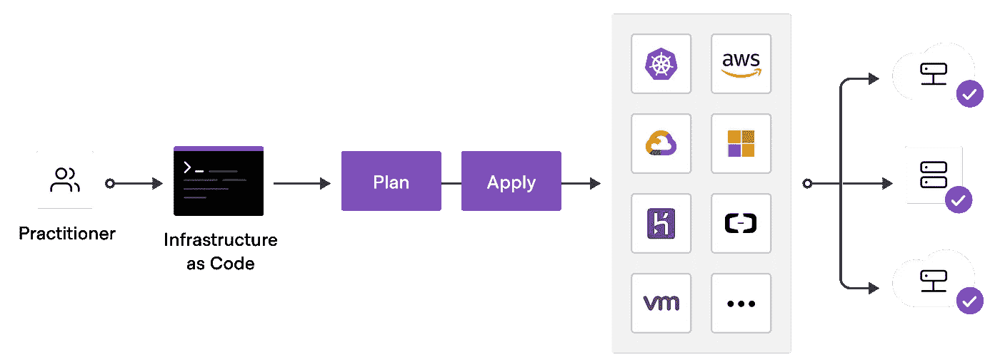

图像信用哈希公司文档

*   Terraform 是一个 IaC 工具。
*   Terraform 最近很受欢迎，许多科技公司都在使用它。
*   Terraform 是用 Golang 写的。
*   Terraform 是开源的。
*   Terraform 是一个云无关的工具。
*   Terraform 与提供者的 API 一起工作。根据 Terraform 的文档，到目前为止，它可以与 1700 多家提供商合作。
*   Terraform 使用声明式方法。
*   Terraform 使用一种叫做 Hashicorp 标记语言或 HCL 的语言。
*   开发人员创建所需状态的配置文件。

例如，您想要 3 kubernetes 集群并创建配置文件。

然后，Terraform 将创建 3 个 kubernetes 集群，并创建一个状态文件。

现在您只需要 2 个 kubernetes 集群。然后修改配置文件，说我只需要 2 个 GKE 集群。

Terraform 使用状态文件检查配置文件，并删除第三个 kubernetes 集群。

现在您需要 4 个 kubernetes 集群。再次对配置文件进行更改。Terraform 使用配置文件检查状态文件，并创建另外两个 kubernetes 集群。

因此，您只需通过配置文件提供最终状态，Terraform 就会知道如何获得最终状态。这就是 terraform 的妙处。这和 kubernetes 差不多。您可以定义副本的数量，比如您想要运行多少个 pods(应用程序的数量),然后 kubernetes 会自行处理。

Terraform 的另一个重要部分叫做 provider。Terraform 是一个云无关的工具。您可以在任何云提供商中创建基础架构，如 AWS、GCP、Azure 或 Oracle Cloud 等。

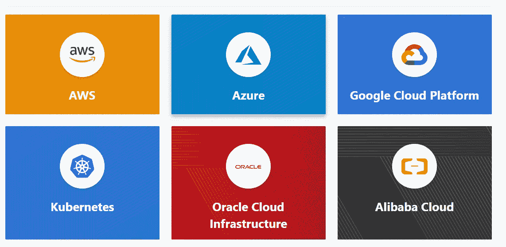

图像信用哈希公司-地形文件

截至目前 terraform 有`1781 providers` **。**

*   terraform 的主要重要特性是，您可以使用一个配置文件在多个云提供商中创建基础架构。例如，使用云形成，你只能在 AWS 中创建，而使用 terraform，你可以在 AWS、GCP、Azure 等单一配置文件中创建。

[](https://www.terraform.io/intro/vs) [## Terraform 与其他软件| Terraform，HashiCorp

### 搜索 Terraform 文档 Terraform 提供了资源和提供者的灵活抽象。这种模式允许…

www.terraform.io](https://www.terraform.io/intro/vs) 

要开始学习 terraform，请参考这些文档和教程:

*   [地形教程——哈希公司学习](https://learn.hashicorp.com/terraform?utm_source=terraform_io)
*   [通过谷歌云使用 Terraform】](https://cloud.google.com/docs/terraform)
*   [使用 OCI 地形建立简单的基础设施](https://docs.oracle.com/en-us/iaas/developer-tutorials/tutorials/tf-simple-infrastructure/01-summary.htm)
*   [使用 OCI Terraform 建立简单的基础设施](https://docs.oracle.com/en-us/iaas/developer-tutorials/tutorials/tf-simple-infrastructure/01-summary.htm)
*   [Azure 文档上的 terra form](https://docs.microsoft.com/en-us/azure/developer/terraform/)
*   [使用 Terraform 管理 AWS 可编程基础设施](https://aws.amazon.com/blogs/apn/using-terraform-to-manage-aws-programmable-infrastructures/)

# 使用 Terraform 供应 GCP

让我们使用 Terraform 来提供以下内容

*   创建一个谷歌云存储桶。
*   为 ML 培训创建一个笔记本实例。
*   启用所需的 API。
*   为顶点训练和顶点管道创建服务帐户。
*   创建一个 GKE 集群来部署 ML 应用程序。

只需观看 Hashicorp 培训视频或 youtube 视频，然后开始做以下步骤。不然就有点难以理解了。同样，terraform 是最容易学习和实现的工具之一。

1.  登录到 GCP 控制台。
2.  创建一个项目。最好创建一个新的项目 ID。因为您可以创建项目中的所有资源，然后销毁这些资源。因此，您不会为您创建的任何资源付费。
3.  打开云壳。

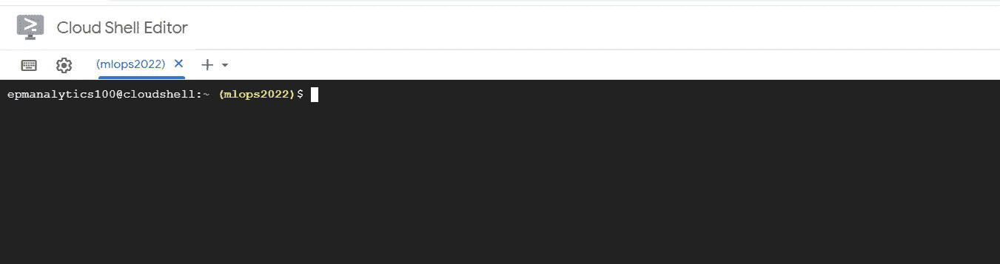

4.文件结构:

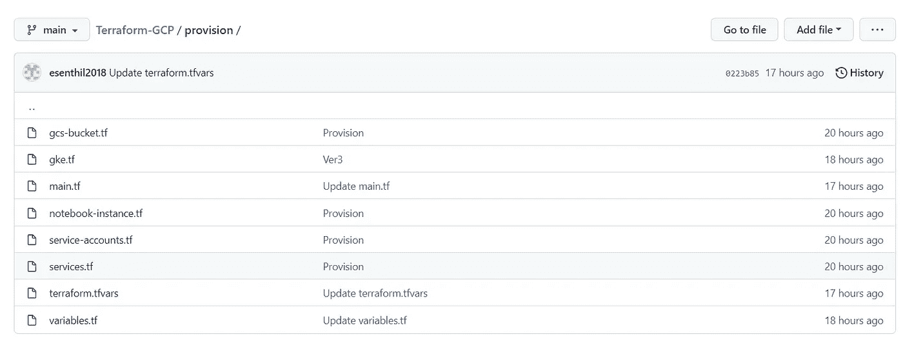

作者图片

我有以下文件:

*   `[gcs-bucket.tf](https://github.com/esenthil2018/Terraform-GCP/blob/main/provision/gcs-bucket.tf)`
*   `[gke.tf](https://github.com/esenthil2018/Terraform-GCP/blob/main/provision/gke.tf)`
*   `[main.tf](https://github.com/esenthil2018/Terraform-GCP/blob/main/provision/main.tf)`
*   `[notebook-instance.tf](https://github.com/esenthil2018/Terraform-GCP/blob/main/provision/notebook-instance.tf)`
*   `[service-accounts.tf](https://github.com/esenthil2018/Terraform-GCP/blob/main/provision/service-accounts.tf)`
*   `[services.tf](https://github.com/esenthil2018/Terraform-GCP/blob/main/provision/services.tf)`
*   `[terraform.tfvars](https://github.com/esenthil2018/Terraform-GCP/blob/main/provision/terraform.tfvars)`
*   `[variables.tf](https://github.com/esenthil2018/Terraform-GCP/blob/main/provision/variables.tf)`

terraform 文件结构如上。

*   Terraform 语言的代码存储在文件扩展名为`.tf`的纯文本文件中。还有一种基于 JSON 的语言变体，以文件扩展名`.tf.json`命名。
*   *模块*是保存在一个目录中的`.tf`和/或`.tf.json`文件的集合。Terraform 模块仅由目录中的顶层配置文件组成；嵌套目录被视为完全独立的模块，不会自动包含在配置中。
*   `main.tf`:包含局部变量、模块和资源定义。
*   `data.tf`:包含`main.tf`中使用的输入数据的数据资源。
*   `outputs.tf`:包含来自`main.tf`中创建的资源的输出。
*   `providers.tf`:包含提供商和提供商版本定义。这里我们使用`main.tf file`中的提供商信息。
*   `variables.tf`:包含`main.tf`中使用的变量(即输入或参数)的声明。
*   `terraform.tfvars`文件包含分配给变量的值。
*   例如`variables.tf`包含

`tfvars`文件包含该值

我们为存储桶、笔记本实例、GKE 集群创建、服务帐户创建和启用 API 提供了单独的 tf 文件。Terraform 在按字母顺序指定的目录中加载所有配置文件。

[这个 StackOverflow 问题](https://stackoverflow.com/questions/58001764/how-to-split-a-terraform-file-main-tf-in-several-files-no-modules)讨论了为什么我们可以为每个配置使用不同的 tf 文件，而不是使用`main.tf`文件中的所有配置。

Terraform 文档中的一些重要语法

*   行注释以`#`开始
*   多行评论用`/*`和`*/`包裹
*   用`key = value`的语法赋值(空格无关紧要)。该值可以是任何原语(字符串、数字、布尔值)、列表或映射。
*   字符串用双引号括起来。
*   字符串可以使用封装在`${}`中的语法插入其他值，比如`${var.foo}`。
*   多行字符串可以使用 shell 风格的“here doc”语法，字符串以类似标记的`<<EOF`开始，然后在单独的一行上以`EOF`结束。字符串和结束标记的行必须*而不是*缩进。
*   数字被假定为基数为 10。如果一个数字的前缀为，它将被视为十六进制数字。
*   布尔值:`true`，`false`。
*   可以用方括号(`[]`)列出基本类型。例:`["foo", "bar", "baz"]`。
*   地图可以用大括号(`{}`)和冒号(`:` ): `{ "foo": "bar", "bar": "baz" }`。键上的引号可以省略，除非键以数字开头，在这种情况下需要引号。对于单线映射，键/值对之间需要逗号。在多行映射中，键/值对之间的新行就足够了。

更多请参考[插值语法](https://www.terraform.io/language/configuration-0-11/interpolation)。

*   `**{ }**` 用于定义块。

让我们深入研究一下文件。

*   您可以拥有一个`.tf`文件或多个`.tf`文件。我为 GKE 创建了一个`tf`文件，为存储云桶创建了一个`tf`文件，为服务帐户创建了一个`tf`文件，为 note 实例创建了一个`tf`文件。

`Main.tf`**:T21**

这主要包含提供商信息。

*   提供程序在提供程序块中定义。它以关键字“提供者”开始。这里我们的提供者是 google-provider `“google” { project = var.project_id }` ***。***
*   当您执行 terraform init 时，它会自动下载 google provider。
*   您可以参考 Hasicorp 网站上提供者的完整列表。上面的链接我已经给了。
*   terraform 将提供程序存储在项目文件夹中。它会创建一个名为 terraform 的特殊文件夹。
*   格式是`terraform-provider-<NAME>_vX.Y.Z`。
*   当您运行 terraform init 时，terraform 会检查文件夹中是否已有该版本。如果没有，它就下载它。
*   我们还在 terraform 块中`required_providers`块。在这个块中，我们可以限制哪个版本可以工作。

`Variables.tf` **:**

上面的`variables.tf`只是包含了你在项目中使用的变量。

*   使用 variable 命令声明变量。
*   然后用双引号指定变量的名称。
*   描述是可选的。
*   不需要指定类型命令。但还是推荐。
*   类型约束允许您指定变量的类型。有三种简单的类型:字符串、数字、布尔值。
*   此外，还有其他类型约束，如 list、set、tuple、map、object 和 any。
*   字符串应该用引号声明。
*   该数字可以用引号或不带引号来声明。
*   为了在代码中使用一个`variable`的值，我们使用语法`var.<variable_identifier>`。比如我们这里应该是`var.project_id`、`var.region`等。
*   变量可以在不同的地方设置

1.  作为环境变量—使用导出语句
2.  作为命令行标志— `var`
3.  在文件中— `tfvars`文件
4.  变量默认值—在`variable.tf`文件中

`terraform.tvars`:

*   `terraform.tvars`是 terraform 使用的特殊文件名，用于标识在`variables.tf`文件中创建的变量值。
*   `project_id = “mlops2022”`。你可以使用变量标识符然后等号(=)和变量的值。在这种情况下，`project_id`是`variable`，而`mlops2022`是变量值。
*   您也可以使用以`.auto.tfvars`结尾的文件名。在这种情况下，如果你想为变量值赋值创建多个文件，那么你可以这样做。

此外，您还需要了解一些其他概念。

**数据来源:**

*   数据源允许 terraform 使用当前项目之外的可用信息。

作者图片

*   数据源由*数据块*定义。
*   然后指定对象的类型。在这种情况下，谷歌存储桶。
*   然后是数据源的名称。
*   然后是已经存在的桶名-图像-存储
*   然后是物体的名字——`folder/butterfly01.jpg`。
*   用`**{**`打开数据源块
*   数据源块用`**}**`关闭。
*   您可以在括号中指定对象的属性。有关每种对象类型的可用属性，请参考文档。

**产出:**

*   输出是在 Terraform 活动完成后显示 terraform 状态文件中的数据。

*   输出块以关键字 output 开始。那么输出的名称在这种情况下是“ip”。
*   然后用`**{**` **启动`output` 挡。**程序块以`**}**`结束。
*   然后就可以使用 value 属性了。只有一个属性叫做`value`。成功完成地形应用后，将显示值`google_compute_instance.vm_instance.network_interface.0.network_ip`。

有关输出的更多信息，请参考文档。

**本地人:**

*   局部变量定义一次，可以多次使用。一个局部变量可以是一个固定的字符串，或者一个局部变量可以引用另一个表达式，就像另外两个局部变量一样。

*   一个局部块应该以一个`locals` 关键字开始。
*   然后用`**{**`启动`output`块。街区以`**}**`结束。
*   第一个 local 是服务名，用' = '加上引号" forum "指定一个字符串。
*   第二个 local 是所有者，用' = '分配一个带引号的字符串“Community Team”。
*   可以使用`local.local_identifier`在代码中引用局部变量。
*   本地值是由`locals`块【复数】创建的*，但是你*将它们作为名为`local`(单数)的对象的属性引用*。在引用本地值时，一定要去掉“s ”!*
*   在这种情况下`tags = local.common_tags`(应该是本地的而不是本地的)

**模块:**

*   模块更像是组织代码。
*   您可以使用外部供应商提供的模块。可以使用 AWS 或 Github 等的模块。

作者图片

*   您可以将代码作为一个模块再次重用。
*   您可以从外部资源(如 GitHub)或本地文件夹中使用该模块。
*   您可以将参数传递给模块。
*   您可以使用输出将值传递给调用模块。

还有一些其他的概念，比如*工作区和置备者*，我在这里没有涉及到。有关更多信息，请参考文档。

5.**源库**如下所示:

[](https://github.com/esenthil2018/Terraform-GCP.git) [## GitHub-esenthil 2018/Terraform-GCP:使用 terra form-GCP 进行供应

### 此时您不能执行该操作。您已使用另一个标签页或窗口登录。您已在另一个选项卡中注销，或者…

github.com](https://github.com/esenthil2018/Terraform-GCP.git) 

现在把文件复制到 GCP:

作者图片

*   将变量设置为 GitHub 存储库。
*   设置本地目录变量。
*   `get`从 git 子目录中获取远程包，并将其写入新的本地目录。
*   `kpt pkg get REPO_URI[.git]/PKG_PATH[@VERSION] [LOCAL_DEST_DIRECTORY] [flags]`

现在文件被复制到 GCP:

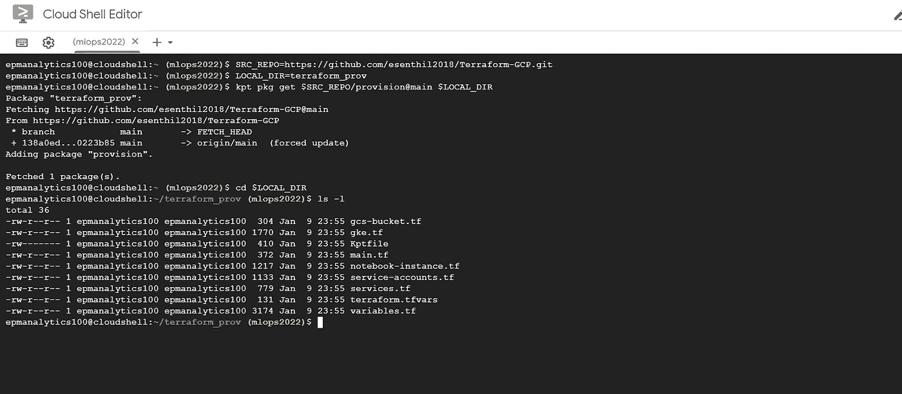

6.现在我们需要开始创建基础设施。在此之前，让我们看看 terraform 的工作流程。

请观看 YouTube 视频，然后查看。tf 文件。然后你就会了解提供者、资源、输出、变量、数据源等。

主要的标准工作流程是:

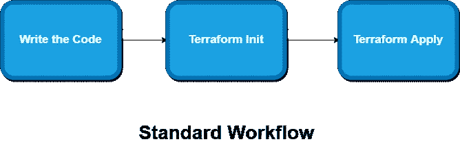

作者图片

这是我的工作流程。

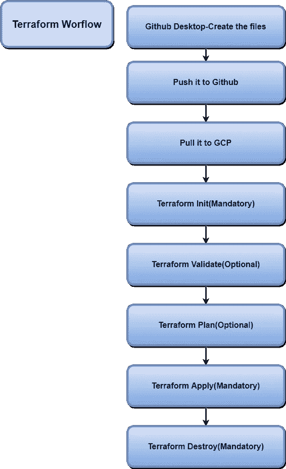

作者图片

## 地形初始化:

Terraform init 是您需要执行的第一个命令。这是强制性的。Terraform init 将下载与提供者相关的所有插件。在我们的情况下，它是 GCP。

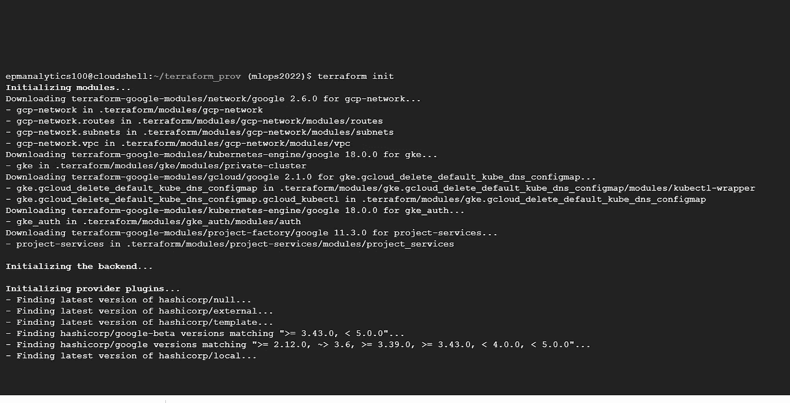

作者图片

查看 terra form`[init](https://www.terraform.io/cli/commands/init)`[docs](https://www.terraform.io/cli/commands/init)**以了解关于该命令的更多信息。**

## **Terraform 验证:**

**`terraform validate`命令验证目录中的配置文件，只引用配置，不访问任何远程服务，比如远程状态、提供者 API 等。**

**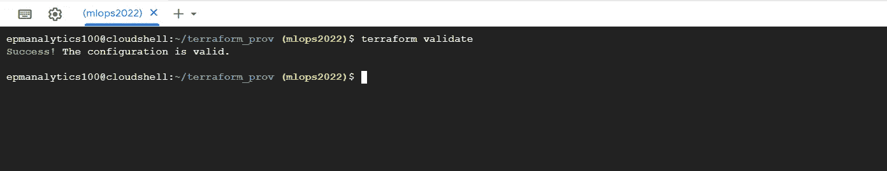**

**作者图片**

**检查像**

*   **未声明的变量**
*   **多次声明的提供程序**
*   **无效的模块名称**
*   **多次声明的资源**

## **地形图**

**根据 hashicorp 文档,`terraform plan`命令创建一个执行计划，让您预览 Terraform 计划对您的基础架构进行的更改。默认情况下，当 Terraform 创建平面图时，它:**

*   **读取任何已存在的远程对象的当前状态，以确保 Terraform 状态是最新的。**
*   **将当前配置与先前状态进行比较，并记录任何差异。**
*   **建议一组更改操作，如果应用这些操作，将使远程对象与配置相匹配。**

**您可以使用`-out`参数将该计划保存到文件中。你可以使用`terraform plan -out mlops`命令将其保存到一个名为 mlops 的文件中。**

**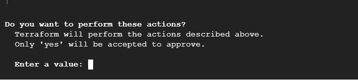**

**作者图片**

**对于地形图，申请和销毁将要求确认。**

**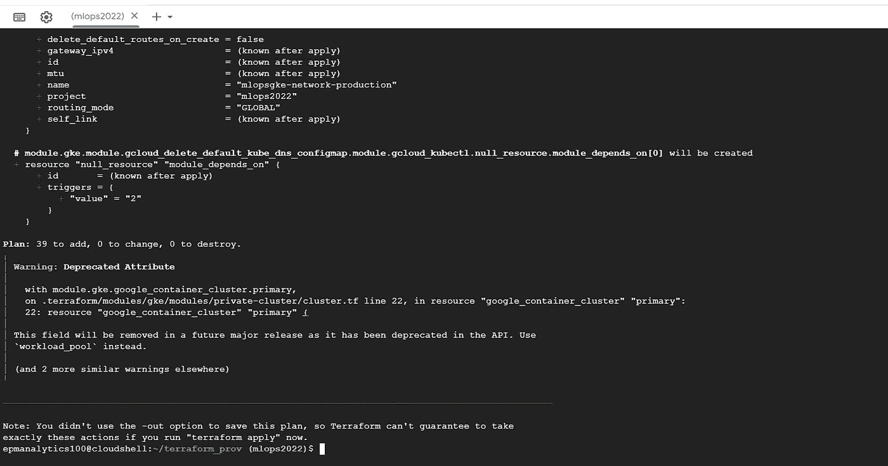**

**作者图片**

**它说计划:将添加 39 个对象。**

## **地形应用:**

**该命令执行地形图中提出的动作。**

**有两种方法可以执行 terraform 应用**

*   **不带任何参数执行 terraform apply。在这种情况下，它将首先创建 terraform 计划，然后要求确认。如果你说是，那么执行计划。**
*   **使用`terraform apply`的另一种方法是将您之前创建的已保存计划文件的文件名传递给它，在这种情况下，Terraform 将在没有任何确认提示的情况下应用计划中的更改。**

**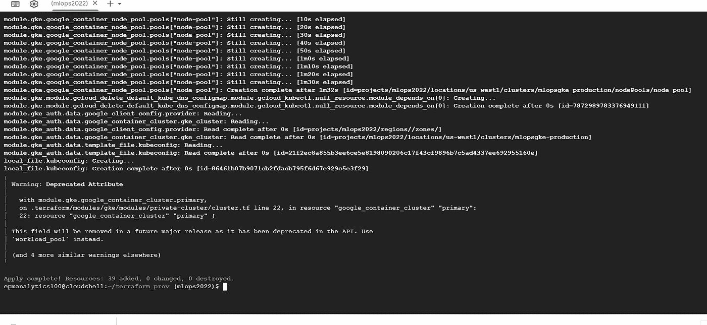**

**作者图片**

**现在它说 terraform apply 说增加了 39 个。所以在计划中，它说将增加 39 个。**

**terraform 应用完成后，检查目录**

**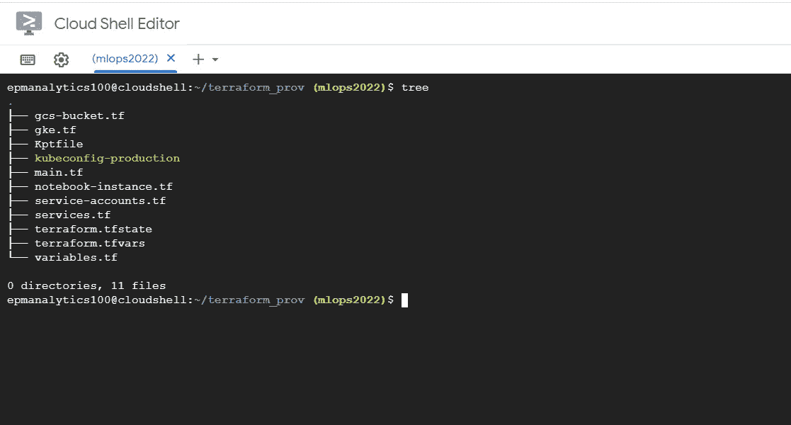**

**作者图片**

**现在您会看到创建了两个新文件**

*   **`terraform.tfstate file`**
*   **`kubeconfig-production`**

****Terraform.tfstate 文件** Terraform 状态文件是 terra form 创建的文件。它存储了 terraform 从您提供的配置文件(如 tf 文件)中创建的所有资源。**

**每当删除一个资源时，它在状态文件下的相应条目也会被删除。Terraform 还存储它创建的对象的依赖关系，并在状态文件中维护依赖关系。**

**`terraform.tfstate.backup` ***中还有前一状态版本的备份文件。*****

**Terraform 状态文件在**

*   **地形图**
*   **地形应用**
*   **地形破坏**

**当您应用 terraform apply 时，会创建新的状态文件，然后旧的状态文件会作为备份写入。你可以像 GitHub 一样在你的版本控制系统中维护 terraform 状态文件。**

**检查状态命令和下面备忘单中的所有命令:**

*   **[终极地形命令备忘单](https://acloudguru.com/blog/engineering/the-ultimate-terraform-cheatsheet)**
*   **[基本地形说明书](https://justinoconnor.codes/2021/09/06/the-essential-terraform-cheat-sheet/)**

**`Kubeconfig-production` **:****

**`kubeconfig-production` 是新创建的集群的 kubeconfig。**

**使用以下命令检查 GKE 集群:**

**作者图片**

**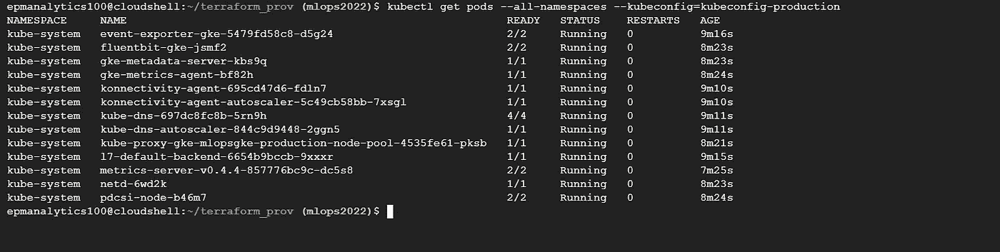**

**作者图片**

**现在，您可以看到 GKE 已经启动并运行了所有的 running pods。**

**所以检查你创建的所有对象**

**GCP 储物桶:**

**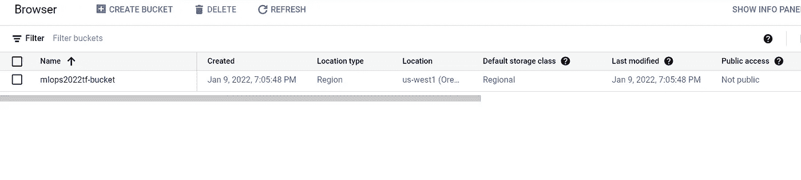**

**作者图片**

**GCP 服务帐户:**

**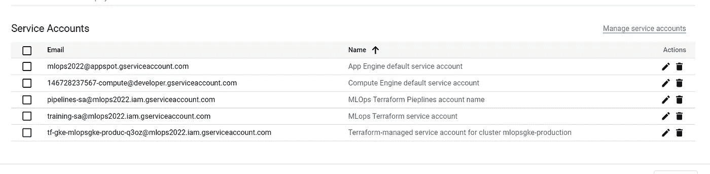**

**作者图片**

**GCP 启用的 API:**

**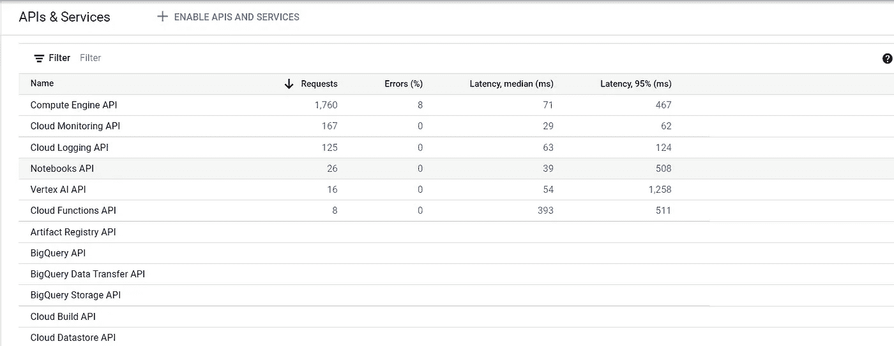**

**作者图片**

**GCP GKE 集群:**

**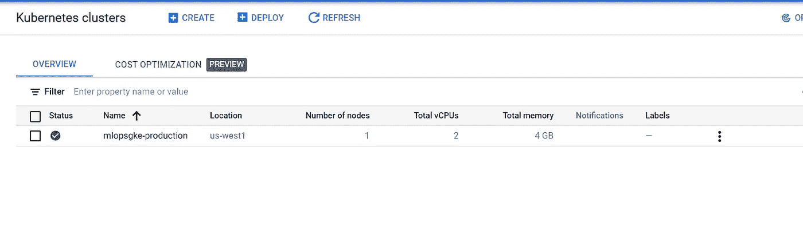**

**作者图片**

**关于 Terraform `apply`的更多信息可在文档中获得[。](https://www.terraform.io/cli/commands/apply)**

## **地形破坏:**

**Terraform destroy 允许破坏创造的资源。**

*   **没有任何参数的 Terraform destroy 销毁所有创建的资源。**
*   **带有`-target`旗帜的地形摧毁允许我们摧毁特定的资源。**
*   **在我们的例子中，*创建了 39 个资源*，我想删除所有的 39 个资源。因此，我使用 terraform 销毁。**

**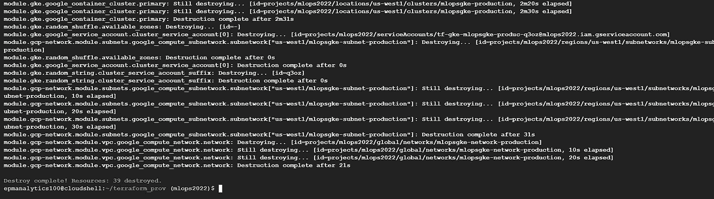**

**作者图片**

**所以所有创造出来的 *39 资源*都被销毁了。**

**所以重要的步骤是**

*   **地形初始化**
*   **Terraform 应用(运行计划并要求确认)**
*   **Terraform Destroy(如果你想摧毁所有创建的资源)。**

**安装平台请参考[此链接](https://learn.hashicorp.com/tutorials/terraform/install-cli)。**

# **额外资源**

**1.如果你打算准备 Terraform 助理证书，这个 YouTube 视频是一个很好的开始:**

**freecodecamp.org 视频信贷**

**2.关于[地形标准](https://brendanthompson.com/posts/2021/11/my-terraform-standards)的不错的博客**

**3.从现有的*基础设施*生成地形文件的 CLI 工具(反向地形)**

**4.[地形变量标准](https://lachlanwhite.com/posts/terraform/10-11-2021-terraform-variables-a-standard/)**

**5.[地形实例](https://github.com/easyawslearn/Terraform-Tutorial)**

**6.[地形零到英雄](https://www.zero2devops.com/blog/ultimate-guide-to-terraform)**

# **结论**

**同样，terraform 是一个非常有用的学习和使用工具。terraform 文档本身是一个很好的起点。另外，看看我上面提到的 YouTube 视频。Pluralsight、Udemy 和 Coursera 都有不错的课程。去看看吧。**

**尝试在你工作的云提供商如 AWS 或 GCP 或 Azure 中自动创建资源。这将是一个有趣的项目。祝你好运！**

# **参考**

1.  **[https://github.com/GoogleCloudPlatform/mlops-with-vertex-ai](https://github.com/GoogleCloudPlatform/mlops-with-vertex-ai)**
2.  **[https://github.com/hashicorp/terraform-provider-google](https://github.com/hashicorp/terraform-provider-google)**
3.  **[https://github.com/terraform-google-modules](https://github.com/terraform-google-modules)**
4.  **[https://learnk8s.io/terraform-gke](https://learnk8s.io/terraform-gke)**
5.  **[https://www.terraform.io/docs](https://www.terraform.io/docs)**
6.  **[https://learn.hashicorp.com/terraform](https://learn.hashicorp.com/terraform)**
7.  **[https://docs.microsoft.com/en-us/azure/developer/terraform/](https://docs.microsoft.com/en-us/azure/developer/terraform/)**
8.  **[https://cloud.google.com/docs/terraform](https://cloud.google.com/docs/terraform)**
9.  **[https://github.com/upgundecha/howtheysre](https://github.com/upgundecha/howtheysre)**
10.  **[https://github.com/bridgecrewio/checkov](https://github.com/bridgecrewio/checkov)**

```
**Want to Connect?**Please feel free to connect with me on [LinkedIn](http://linkedin.com/in/esenthil)
```