# NumPy 数据类型综合指南

> 原文：<https://betterprogramming.pub/a-comprehensive-guide-to-numpy-data-types-8f62cb57ea83>

## 除了 int32 和 float64 还有什么？

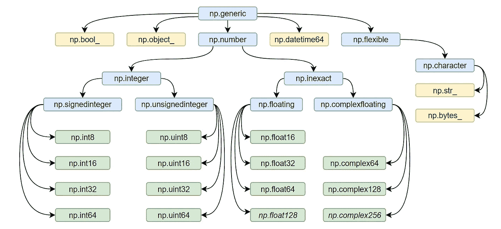

所有图片来源:作者

NumPy 是数据科学和科学计算领域最受欢迎的 Python 库之一，它在数据类型方面非常全面。

它有自己的一套“本地”类型，能够全速处理，但它也可以处理 Python 所知的几乎所有东西。

这篇文章是作为我的 [NumPy Illustrated](/numpy-illustrated-the-visual-guide-to-numpy-3b1d4976de1d?sk=57b908a77aa44075a49293fa1631dd9b) 指南的补充而写的，分为七个部分:

1.  [整数](#26eb)
2.  [浮点数](#efc5)(包括分数和小数)
3.  [布尔人](#5156)
4.  [琴弦](#f4f8)
5.  [日期时间](#c859)
6.  [其组合](#e16e)
7.  [型式检查](#9d4a)

# 1.整数

NumPy 中的整数类型表对于 C/C++经验很少的人来说是微不足道的:

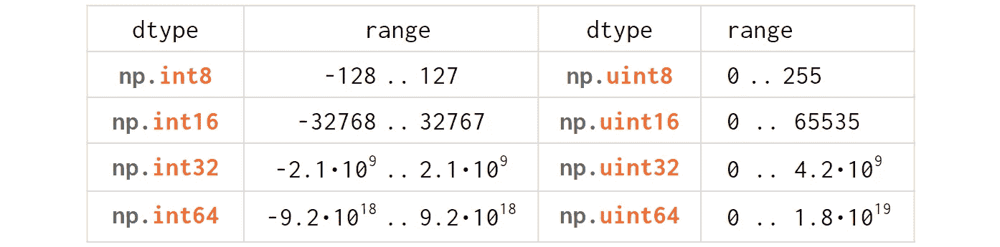

就像在 C/C++中一样，“u”代表“无符号”，数字代表用于在内存中存储变量的位数(例如`np.int64`是一个 8 字节宽的有符号整数)。

当你将一个 Python `int`输入 NumPy 时，它会被转换成一个原生的 NumPy 类型，叫做`np.int32`(或者`np.int64`，这取决于操作系统、Python 版本和初始化器的数量):

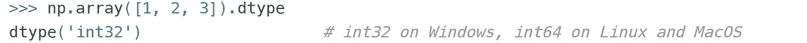

如果您对 NumPy 为您选择的整数类型不满意，您可以通过' dtype '(=数据类型)参数显式地指定一个整数类型，该参数接受 dtype 对象`np.array([1,2,3], np.uint8)`或字符串`np.array([1,2,3], ‘uint8’)`。

为什么需要非默认的数据类型？考虑以下示例(在 Windows 上):

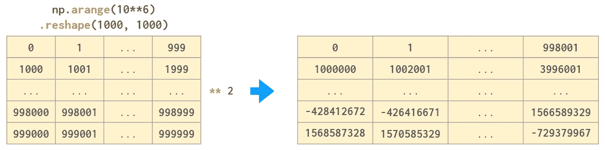

这是怎么回事？

当数组元素的宽度固定时，NumPy 工作得最好。它速度更快，占用的内存更少，但与普通 Python `int`(适用于任意精度的运算)不同，数组的值在超过相应数据类型的最大(或最小)值时会换行:

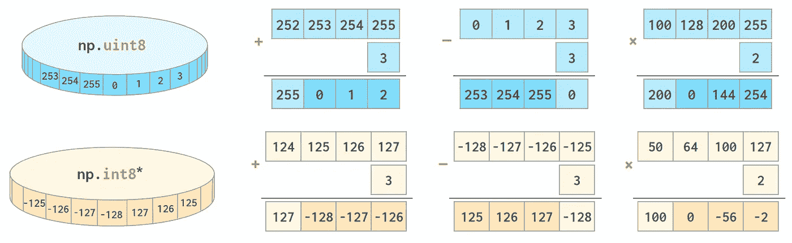

**严格来说，C 标准只对* ***无符号*** *整数定义了这种回绕；* ***有符号*** *整数的溢出行为是未定义的，不能依赖(在 C 和 NumPy 中都是如此)。有符号整数现在被悄悄地包装起来，但不能保证它们会一直这样。*

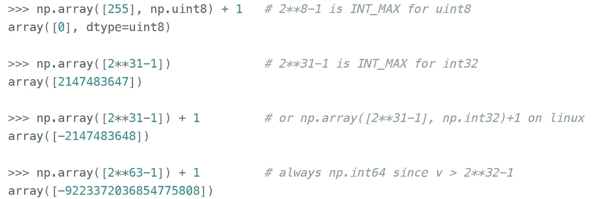

[int_wrapping.py](https://snipit.io/public/lists/18966/61591)

—这里甚至没有一个警告！

对于标量，情况就不同了:首先，NumPy 尽力将值提升到更宽的类型，然后，如果没有类型，就触发溢出警告(为了避免警告淹没输出，只触发一次):

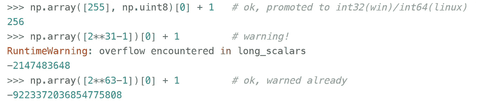

[overflow_warning.py](https://snipit.io/lists/18966/61593)

这种歧视背后的原因是这样的:

> 与真正的浮点错误(硬件 FPU 在执行溢出的原子操作时设置一个标志)不同，我们需要自己实现整数溢出检测。我们在标量上这样做，而不是在数组上，因为对于数组上的每个原子操作来说，这样做太慢了。(罗伯特·克恩，NumPy 核心开发者之一)

你可以把它变成一个错误:

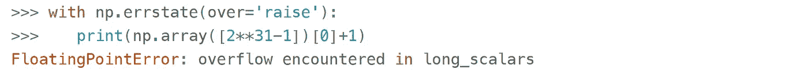

[overflow_error.py](https://snipit.io/lists/18966/61594)

或者暂时抑制它:

[overflow_ignored.py](https://snipit.io/lists/18966/61595)

或者完全:`np.warnings.filterwarnings('ignore', 'overflow')`

但是你不能指望它在处理任何数组的时候都能被检测出来。

回到我们的例子，正确的做法是指定正确的 dtype:

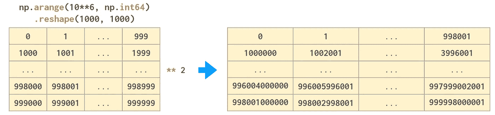

在 Linux/MacOS 上，默认情况下是 np.int64

NumPy 也有一堆 C 风格的别名(例如，`np.byte`是`np.int8`，`np.short`是`np.int16`，`np.intc`是一个 int，具有 int 类型在 C 中的任何宽度，等等)，但它们正在逐渐被淘汰(例如[在 NumPy v1.20.0](https://numpy.org/devdocs/release/1.20.0-notes.html#using-the-aliases-of-builtin-types-like-np-int-is-deprecated) 中对 np.long 的弃用)，因为“显式比隐式好”(但请参见下面`np.longdouble`的现代用法)。

还有一些更奇特的别名:

`np.int_`在 64 位 Windows 上是`np.int32`，但在 64 位 Linux/MacOS 上是`np.int64`，用于指定‘默认’int。将`np.int_`(或者只是 int)指定为 dtype 意味着'*做你会做的事情，如果我根本没有指定任何 dtype '*:`np.array([1,2])`、`np.array([1,2], np.int_)`和`np.array([1,2], int)`都是一回事。

`np.intp`在 32 位 Python 上是`np.int32`，但在 64 位 Python 上是`np.int64`，在 C 语言中是≈ `ssize_t` ，在 Cython 中用作指针的类型。

偶尔，数组中的一些值显示异常行为或缺失，您希望在不删除它们的情况下处理数组(例如，其他列中有一些有效数据)。

你不能把`None`放在那里，因为它不适合连续的`np.int64`值，也因为`1+None`是不支持的操作。

Pandas 对此有一个单独的数据类型，但是 NumPy 处理丢失值的方式是通过所谓的屏蔽数组:您用一个布尔掩码标记无效值，然后所有的操作都被执行，就好像这些值不存在一样。

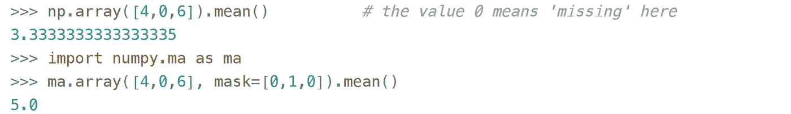

[masked_array.py](https://snipit.io/lists/18966/61706)

最后，如果出于某种原因，您需要 ndarrays 中的任意精度整数(Python`int`s ), numpy 也能够做到:

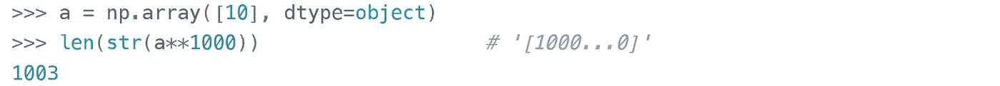

[int_type.py](https://snipit.io/lists/18966/61596)

—但没有通常的加速，因为它将存储引用而不是数字本身，在处理时保持装箱/取消装箱 Python 对象，等等。

# 2.漂浮物

由于纯 Python `float`并没有偏离 IEEE 754 标准的 C `double`类型(注意命名上的差异)，浮点数从 Python 到 NumPy 的转换非常容易:Python `float`直接兼容`np.float64`和 Python`complex`——兼容`np.complex128`。

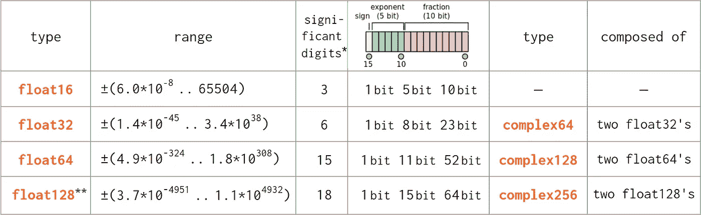

**由* `*np.finfo(np.float<nn>).precision.*` *两个备选定义给出* [*15*](https://en.cppreference.com/w/cpp/types/numeric_limits/digits10) *和* [*17*](https://en.cppreference.com/w/cpp/types/numeric_limits/max_digits10) *位数为* `*np.float64*` *，6 和 9 为* `*np.float32*` *等。*

***从今天起，* `*np.float128*` *仅适用于 Unix(不适用于 Windows)。*

像整数一样，浮点也容易出现溢出错误。

假设你正在计算一个数组的 sigmoid 激活函数，它的一个元素恰好是

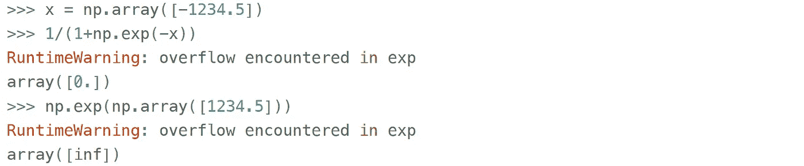

[float_overflow.py](https://snipit.io/lists/18966/61748)

这个警告试图告诉你的是 NumPy 知道从数学上讲`1/(1+exp(-x))`永远不可能为零，但是在这个特殊的例子中，由于溢出，它是零。

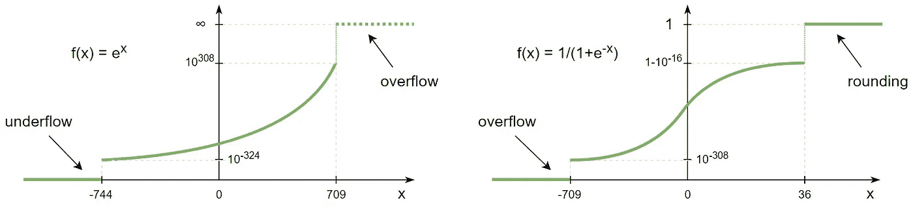

如上面“整数”部分所述，这种警告可以通过`errstate`或`filterwarnings`被“提升”为异常或静音——对于这种特殊情况，这可能就足够了——但是如果您*真的*想要获得准确的值，您可以选择更宽的`dtype`:

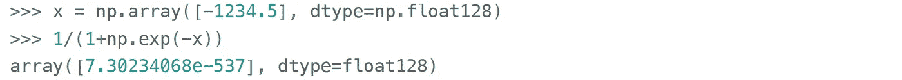

[float 128 . py](https://snipit.io/lists/18966/61749):NP . float 128 目前在 Linux/MacOS 上可用，在 Windows 上不可用

区别浮点数和整数的一点是它们是不精确的。你不能用`a == b`来比较两个浮点数，除非你确定它们被准确地表示为*。您可以期望 floats 精确地表示整数，但只能在特定级别以下(受有效位数的限制):*

*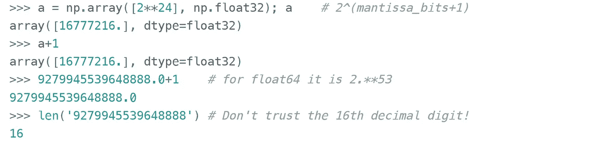*

*[max _ continuous _ int . py](https://snipit.io/lists/18966/61585)*

*同样可精确表示的是像 0.5、0.125、0.875 这样的分数，其中分母是 2 的幂(0.5=1/2、0.125=1/8、0.875 =7/8 等)。任何其他分母都会导致舍入误差，因此 0.1+0.2！=0.3.*

*处理这个问题(以及不精确的来源#2:计算结果的舍入)的标准方法是将它们与相对容差(比较两个非零参数)和绝对容差(如果其中一个参数为零)进行比较。对于标量，它由`math.isclose(a, b, *, rel_tol=1e-09, abs_tol=0.0)`处理，对于 NumPy 数组，有一个向量版本`np.isclose(a, b, rtol=1e-05, atol=1e-08)`。请注意，公差有不同的名称和默认值。*

*对于财务数据，`decimal.Decimal`类型很方便，因为它不涉及任何额外的公差:*

*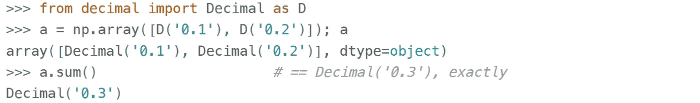*

*[decimal.py](https://snipit.io/lists/18966/61597)*

*但是它不是银弹:它也有舍入误差(见上面的来源#2)。它解决的唯一问题是人类习惯的十进制数的精确表示。*

*另外，它不支持任何比算术运算更复杂的操作(尽管支持对数和平方根)，并且运行速度比浮点运算慢。*

*对于纯数学计算，可以使用`fractions.Fraction`:*

*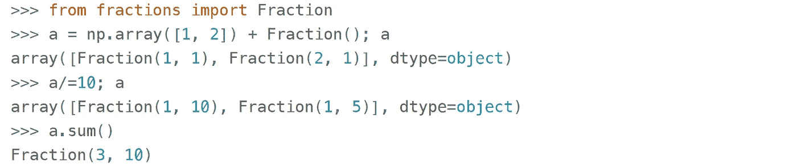*

*[fractions.py](https://snipit.io/lists/18966/61598)*

*它可以精确地表示任何有理数*和*在计算过程中不受舍入误差的影响(来源#2 ),但是π和 *e* 运气不好！如果你也需要它们，那么 [SymPy](https://www.sympy.org/en/index.html) 就是你的朋友。*

*`Decimal`和`Fraction`都不是 NumPy 的原生类型，但是它能够处理它们的所有细节，比如多维度和花哨的索引，尽管代价是处理速度比原生的`int`或`float`慢*

*复数的处理方式与浮点数相同。还有一些额外的方便函数，名字很直观，比如 np。[实](https://numpy.org/doc/stable/reference/generated/numpy.real.html) (z)，np。 [imag](https://numpy.org/doc/stable/reference/generated/numpy.imag.html) (z)，np。 [abs](https://numpy.org/doc/stable/reference/generated/numpy.absolute.html) (z)，np。[角度](https://numpy.org/doc/stable/reference/generated/numpy.angle.html) (z)对标量和数组都起作用。与纯 Python `complex`，`np.complex_`的唯一区别是不能处理整数:*

**

*[int_complex.py](https://snipit.io/lists/18966/61684)*

*就像整数一样，在浮点(和复杂)数组中，有时将某些值视为“缺失”也是有用的。浮点更适合存储异常数据:它们有一个`math.nan`(或`np.nan`或`float(‘nan’)`)值，可以与‘有效’数值一起存储。*

*但是`nan`具有传染性，因为所有使用`nan`的算法都会产生`nan.`大多数常见的统计函数都有一个抗 nan 版本(np.nansum、np.nanstd 等)，但是对该列或数组的其他操作需要预过滤。掩码数组自动执行这一步:掩码只能构建一次，然后它被“粘贴”到原始数组，以便所有后续操作只看到未被掩码的值并对它们进行操作。*

*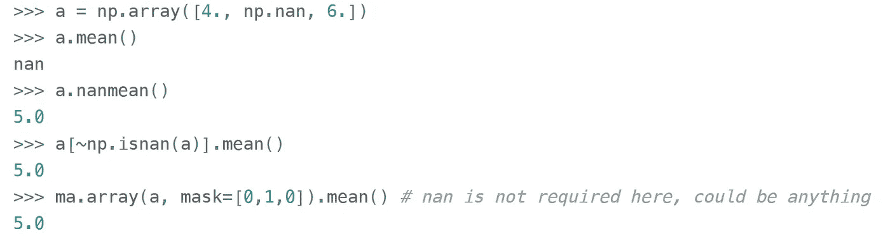*

*[masked_floats.py](https://snipit.io/lists/18966/61710)*

*另外，`float96` / `float128`这两个名字也有些误导。在引擎盖下，它不是`__float128`，而是在本地 C++风格中的任何一个`longdouble`的意思。在 x86_64 Linux 上，它是`float80`(用零填充以进行内存对齐)，当然比`float64`更宽，但这是以处理速度为代价的。此外，如果您不小心转换成 Python `float`类型，就有失去精度的风险。为了更好的可移植性，建议使用别名`np.longdouble`而不是`np.float96` / `np.float128`，因为这是内部使用的别名。*

*有关浮动的更多信息可以在以下资源中找到:*

*   *简洁明了的“[半精度浮点可视化](https://observablehq.com/@rreusser/half-precision-floating-point-visualized)”(例如，正常数和次正常数之间有什么区别)*
*   *比较冗长但是很中肯，一个专门的网站'[浮点指南](https://floating-point-gui.de/)'(比如为什么 0.1+0.2！=0.3)*
*   *长篇阅读，深入透彻的“[每个计算机科学家都应该知道的浮点运算](https://docs.oracle.com/cd/E19957-01/806-3568/ncg_goldberg.html)”(例如，灾难性的与良性的取消有什么区别)*

# *3.布尔人*

*为了获得更好的性能，布尔值存储为单字节。`np.bool_`是一个独立于 Python 的`bool`的类型，因为它不需要任何纯 Python 类型所需的引用计数和到基类的链接。如果你认为用 8 位存储 1 位信息是多余的，看看这个:*

*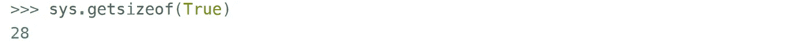*

*[size_of_bool.py](https://snipit.io/lists/18966/61599)*

*`np.bool`的内存效率是 Python 的`bool`的 28 倍——尽管在现实场景中，这一比率较低:当您将 NumPy bools 打包到一个数组中时，它们每个将占用 1 个字节，但是如果您将 Python bools 打包到一个列表中，它每次都会引用相同的两个值，实际上在 x86_64 上每个元素花费 8 个字节:*

*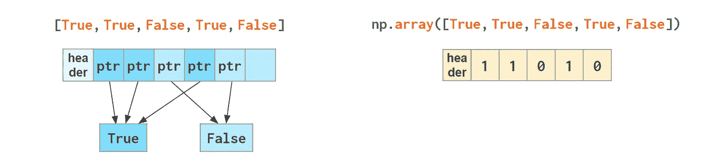*

*`bool_`、`int_`等中的下划线是为了避免与 Python 的类型冲突。对其他事情使用保留的关键字是一个坏主意，但是在这种情况下，它有一个额外的优点，允许(通常不鼓励，但在极少数情况下有用)`from numpy import *`而不隐藏 Python `bool`、`int`等。到今天为止，`np.bool`仍然可以工作，但是会显示一个弃用警告。*

# *4.用线串*

*用 Python 字符串列表初始化 NumPy 数组，将它们打包成一个固定宽度的原生 NumPy dtype，称为`np.str_`。为每个元素保留适合最长字符串所需的空间可能看起来很浪费(特别是在固定的 USC-4 编码中，而不是在 Python `str`中“动态”选择 UTF 宽度)*

*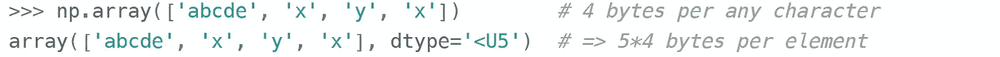*

*[dtype_str_。py](https://snipit.io/lists/18966/61600)*

*缩写'<u4 comes="" from="" the="" so-called="" array="" protocol="" introduced="" in="" it="" means="" class="ae lv" href="https://numpy.org/doc/stable/reference/generated/numpy.dtype.byteorder.html" rel="noopener ugc nofollow" target="_blank">little-endian[USC-4 编码字符串](https://numpy.org/doc/stable/reference/arrays.interface.html#arrays-interface)，5 个元素长'( [USC-4](https://en.wikipedia.org/wiki/UTF-32) ≈UTF-32，固定宽度，每字符 4 字节编码)。每个 NumPy 类型都有一个缩写——就像这个一样不可读——幸运的是，他们至少为最常用的数据类型采用了人类可读的名称。</u4>*

*另一个选择是在对象的 NumPy 数组中保存对 Python 的引用:*

*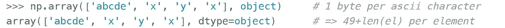*

*[dtype_str.py](https://snipit.io/lists/18966/61601)*

*第一个数组内存占用量为 164 字节，第二个数组占用 128 字节+ 154 字节用于三个 Python `str`的:*

*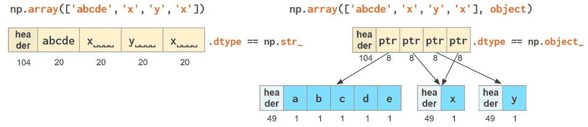*

*根据字符串的相对长度和重复字符串的数量，一种方法可能是一个重要的胜利。*

*如果你正在处理一个原始的字节序列，NumPy 有一个 Python `bytes`类型的固定长度版本，叫做`np.bytes_`:*

**

*[dtype_bytes_。py](https://snipit.io/lists/18966/61602)*

*这里的`|S5`表示“[字节顺序-不可弯曲的](https://numpy.org/doc/stable/reference/generated/numpy.dtype.byteorder.html) [字节序列](https://numpy.org/doc/stable/reference/arrays.interface.html#arrays-interface) 5 个元素长”。*

*同样，另一种方法是将 Python `bytes`存储在 NumPy 对象数组中:*

*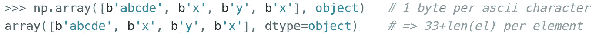*

*[dtype_bytes.py](https://snipit.io/lists/18966/61626)*

*这次第一个数组占用了 124 个字节，第二个同样是 128 个字节，对于数组本身+ 106 个字节，对于三个 Python `bytes`:*

*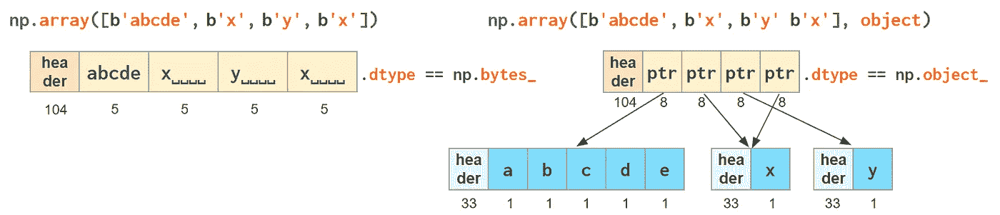*

*我们看到`str_`又变小了，然而对于更多样的长度`str`可以获胜。*

*至于原生的`np.str_`和`np.bytes_`类型，NumPy 有一些常见的字符串操作。它们镜像 Python 的`str`方法，驻留在`np.char`模块中，并在整个数组上操作:*

*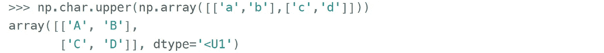*

*[char_upper.py](https://snipit.io/lists/18966/61603)*

*对于对象模式字符串，循环必须发生在 Python 级别:*

*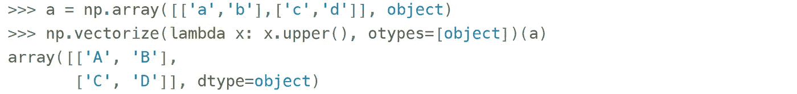*

*[矢量化 _upper.py](https://snipit.io/lists/18966/61604)*

*根据我的基准测试，基本操作使用`str`比使用`np.str_`要快一些。*

# ***5。日期时间***

*NumPy 为 datetimes 引入了一种有趣的本地数据类型，类似于 POSIX 时间戳(又名 Unix time，自 1970 年 1 月 1 日以来的秒数),但是能够以可配置的粒度计算时间——从年到阿秒——总是用一个数字`int64`表示。*

*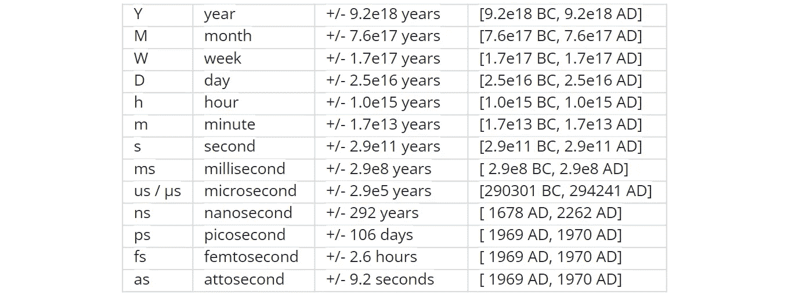*

*来自官方[文件](https://numpy.org/doc/stable/reference/arrays.datetime.html)的表格*

*   *年粒度意味着“只计算年数”——与将年存储为整数相比，并没有真正的改进。*
*   *天数粒度相当于 Python 的`datetime.date`。*
*   *微秒 Python 的`datetime.datetime`。*

*而下面的一切都是`np.datetime64`独有的。*

*当创建一个`np.datetime64`的实例时，NumPy 选择仍能保存此类数据的最粗粒度:*

*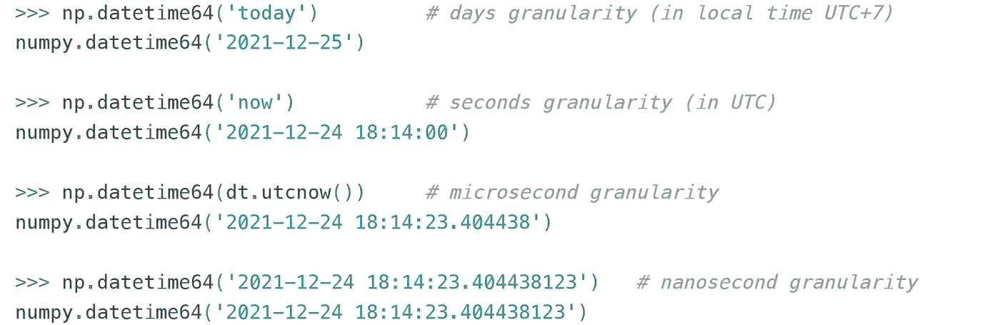*

*[构造 _dt64.py](https://snipit.io/lists/18966/61837)*

*注意，字符串初始值设定项不像`pd.to_datetime`中那样宽松:它必须是这种精确的格式或其中最小的变化(参见 [ISO 8601](https://en.wikipedia.org/wiki/ISO_8601#General_principles) 维基百科页面的‘一般原则’)。*

*当创建一个数组时，您可以决定是否接受 NumPy 为您选择的粒度，或者您坚持，比如说，纳秒或其他，它将为您提供 2⁶等距时刻，以 1970 年 1 月 1 日的相应时间单位测量。*

*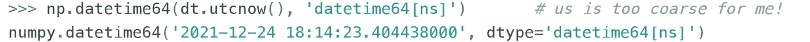*

*[datetime64.py](https://snipit.io/lists/18966/61605)*

*可以有多个基本单元。例如，如果您只需要 0.1 秒的精度，则不一定需要存储毫秒:*

*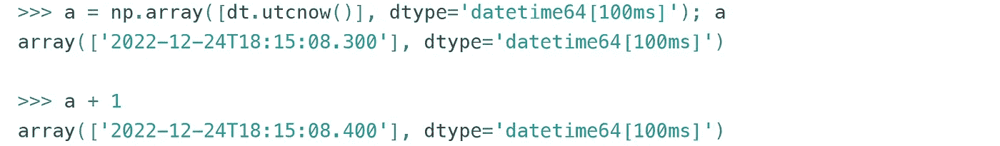*

*[d64_100ms.py](https://snipit.io/lists/18966/61839)*

*要在不解析 dtype 字符串的情况下获得机器可读的粒度表示，请执行以下操作:*

*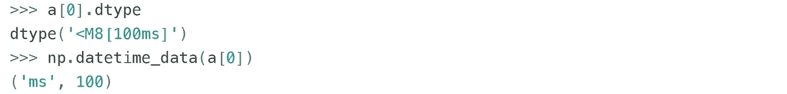*

*[日期时间 _ 数据. py](https://snipit.io/lists/18966/61840)*

*就像在纯 Python 中，当你从一个`np.datetime64`减去另一个`np.datetime64`时，你会得到一个`np.timedelta64`对象(也表示为一个具有可配置粒度的 int64)。例如，要获得新年前的秒数，*

*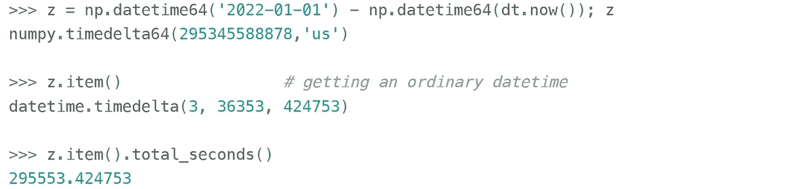*

*[new_year.py](https://snipit.io/lists/18966/61676)*

*或者如果你不关心小数部分，简单地说*

*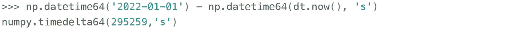*

*[new_year1.py](https://snipit.io/lists/18966/61677)*

*一旦构造好了，就不能再对 datetime 或 timedelta 对象做什么了。为了提高速度，可用操作的数量保持在最低限度:只有转换和基本算术。例如，没有“年”或“日”帮助器方法。*

*要从 datetime64/timedelta64 标量中获取特定字段，可以将其转换为常规日期时间:*

*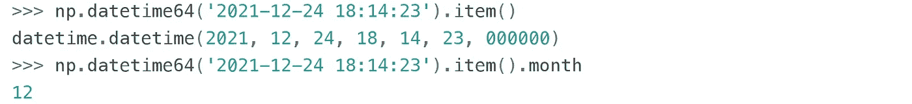*

*[item.py](https://snipit.io/lists/18966/61842)*

*对于像这样的阵列*

*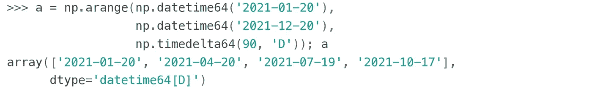*

*[arange.py](https://snipit.io/lists/18966/61841)*

*您可以在`np.datetime64`子类型之间进行转换(更快)*

*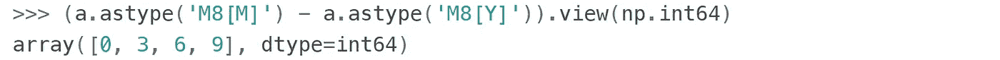*

*[astype.py](https://snipit.io/lists/18966/61844)*

*或者用熊猫(慢 2-4 倍):*

*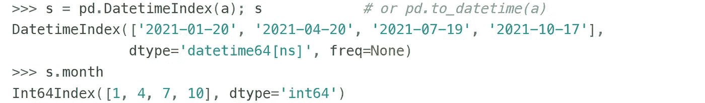*

*[to_datetime.py](https://snipit.io/lists/18966/61843)*

*下面是一个有用的[函数](https://stackoverflow.com/a/56260054/237105)，它将一个`datetime64`数组分解成一个由 7 个整数列(年、月、日、小时、分钟、秒、微秒)组成的数组:*

*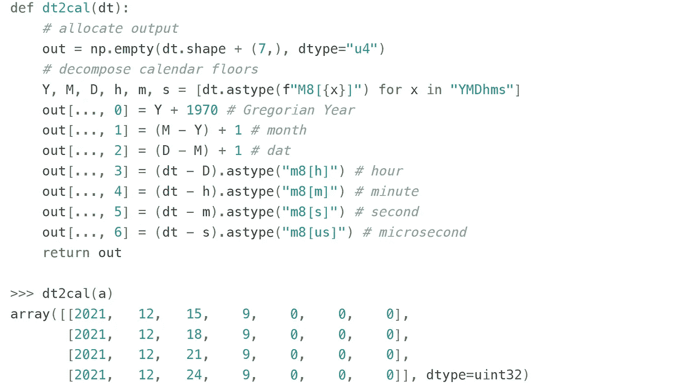*

*[dt2cal.py](https://snipit.io/lists/18966/61845)*

*日期时间的几个问题:*

1.  *尽管支持闰年，*

*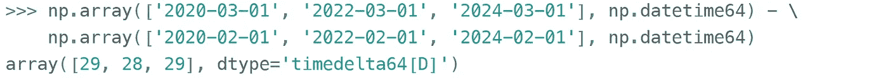*

*[闰年. py](https://snipit.io/lists/18966/61679)*

*[闰秒](https://en.wikipedia.org/wiki/Leap_second)(UTC 和普通壁时的重要组成部分)不是:*

*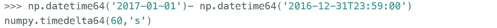*

*[leap_seconds.py](https://snipit.io/lists/18966/61680)*

*公平地说，无论是 `datetime.datetime`还是`pytz`都没有计算它们(尽管一般来说[可以用 pytz 提取关于它们的信息)。`time`模块仅在形式上支持它们(接受 60 秒，但给出不正确的间隔)。](https://stackoverflow.com/questions/19332902/extract-historic-leap-seconds-from-tzdata)*

*目前看来只有[天文望远镜](https://www.astropy.org/)能够正确处理它们，*

**

*[astropy.py](https://snipit.io/lists/18966/61847)*

*另一些人则坚持使用公历[时间，每天精确 86400 国际单位制秒，自从 1970 年以来，由于地球自转的不规则性，它已经与墙上的时间相差了大约半分钟。](https://en.wikipedia.org/wiki/Proleptic_Gregorian_calendar)*

*使用此日历的实际含义是:
–计算包含一个或多个闰秒的时间间隔时出错
–尝试从闰秒期间获取的时间戳构建 datetime64 时出现异常*

*2.由于`np.datetime64`和`np.timedelta64`具有相同的宽度，因此必须注意较大的时间差:*

*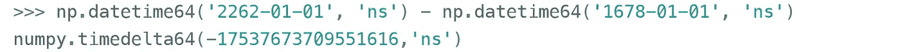*

*[negative_timedelta.py](https://snipit.io/lists/18966/61683)*

*最后，请注意`np.datetime64`中的所有时间都是“简单的”:它们不“知道”夏令时(因此建议以 UTC 存储所有日期时间)，并且不能从一个时区转换到另一个时区(使用 pytz 进行时区转换):*

*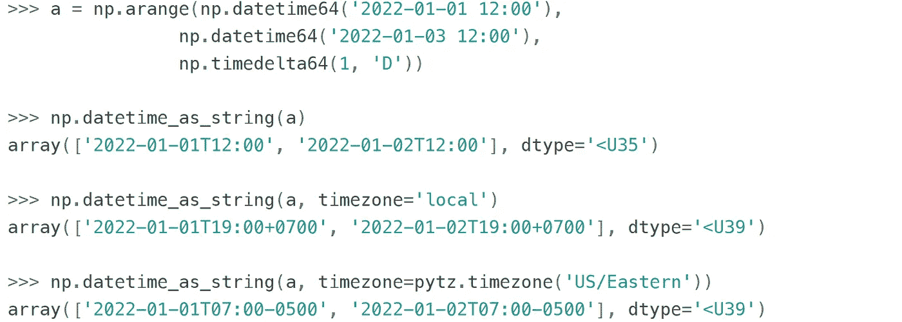*

*[datetime_as_string.py](https://snipit.io/lists/18966/61848)*

# *6.它们的组合*

*NumPy 中的“结构化数组”是一个带有自定义`dtype`的数组，由上述类型作为基本构建块组成(类似于 C 中的`struct`)。一个典型的例子是 RGB 像素颜色:一种 3 字节长的类型(通常 4 字节用于对齐)，其中的颜色可以通过名称来访问:*

*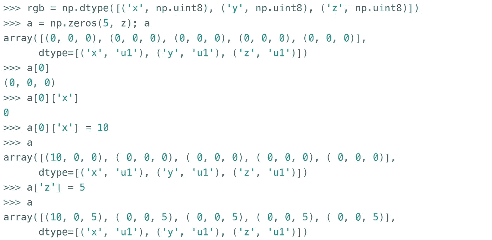*

*[结构化 _ 数组. py](https://snipit.io/lists/18966/61667)*

*为了能够访问作为属性的字段，可以使用一个`np.recarray`:*

*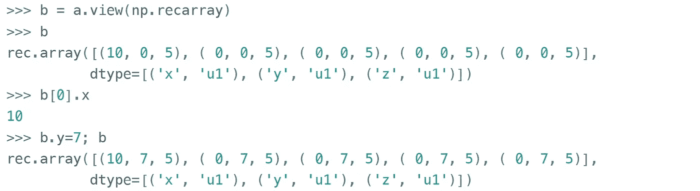*

*[recarray.py](https://snipit.io/lists/18966/61668)*

*在这里，它的工作方式类似于 C++中的`reinterpret_cast`,但是毫无疑问，recarray 可以自己创建，而不是作为其他东西的视图。*

*结构化数组的类型不一定需要是同类的，甚至可以包括子数组。*

*通过结构化数组和重新排列，可以获得基本 Pandas 数据框架的“外观和感觉”:*

*   *您可以按名称对列进行寻址，*
*   *用它们做一些算术和统计计算，*
*   *您可以有效地处理缺失值，*
*   *NumPy 的一些操作比熊猫快*

*但是他们缺乏:*

*   *分组(itertools.groupby 提供的除外)*
*   *强大的熊猫指数和多重指数(所以没有数据透视表)和*
*   *其他细节，如方便分类等。*

*这里的问题是，尽管这种语法对于整体寻址特定的列很方便，但无论是结构化数组还是重排列都不是您想要在计算密集型代码的最内层循环中使用的东西:*

*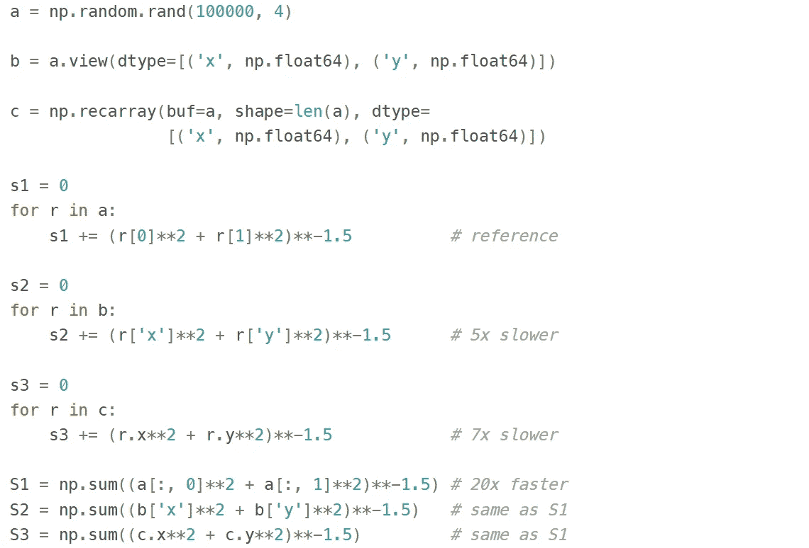*

*[recarray_benchmark.py](https://snipit.io/lists/18966/62073)*

**注意:剖析 python 代码有时可能是反直觉的:根据 x 的性质，将 x**2 改为 x*x 可以使代码运行得更快或更慢 1.5 倍。**

# *7.类型检查*

*检查 NumPy 数组类型的一种方法是对其元素运行`isinstance`:*

*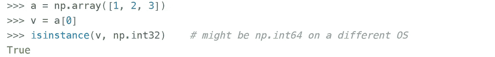*

*[isinstance.py](https://snipit.io/lists/18966/61606)*

*所有的 NumPy 类型都在文章顶部显示的继承树中相互连接(蓝色=抽象类，绿色=数字类型，黄色=其他类型),因此您可以编写更紧凑的类型检查，如*

*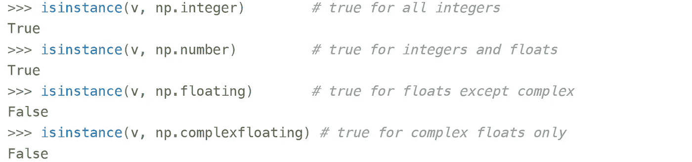*

*[using _ abstract _ dtypes . py](https://snipit.io/lists/18966/61607)*

*这个方法的缺点是它只对数组的一个*值*起作用，而不是对数组本身起作用。这在例如数组为空时是没有用的。检查*数组*的类型更加棘手。*

*对于基本类型,`==`操作符完成单一类型检查的工作:*

*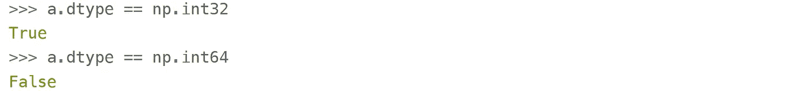*

*和`in`运算符，用于检查一组类型:*

**

*[in.py](https://snipit.io/lists/18966/61609)*

*但是对于像`np.str_`或`np.datetime64`这样更复杂的类型，他们不会。*

*针对抽象类型检查`dtype`的[推荐方式](https://github.com/numpy/numpy/issues/17325) ⁴为*

*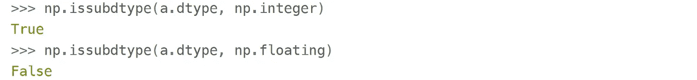*

*[issubdtype.py](https://snipit.io/lists/18966/61610)*

*它适用于所有本机 NumPy 类型，但是这种方法的必要性看起来有些不明显:老式的`isinstance`有什么问题吗？显然，`dtypes`继承结构的复杂性(它们是‘动态’构建的)！)不允许他们按照最小惊讶原则去做。*

*如果您安装了 Pandas，它的类型检查工具也可以处理 NumPy dtypes:*

*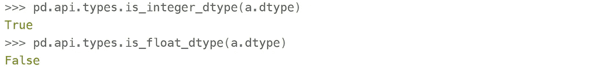*

*[pd_api_types.py](https://snipit.io/lists/18966/61704)*

*还有一种方法是使用(未记录，但在 SciPy/NumPy 代码库中使用，如[此处](https://github.com/numpy/numpy/blob/60b01f9c7bd6e992191f20b7f2d8fcdb13f3d474/numpy/polynomial/polyutils.py#L249) ) `np.typecodes`字典。它代表的树没有那么多分枝:*

*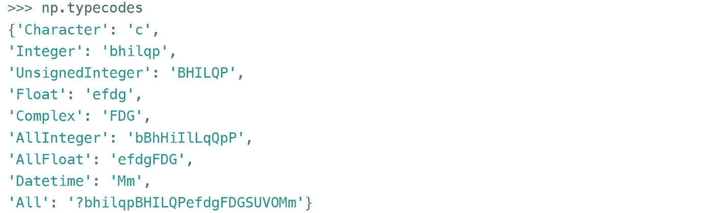*

*[typecodes.py](https://snipit.io/lists/18966/61611)*

*它的主要应用是为测试目的生成具有特定数据类型的数组，但它也可用于区分不同的数据类型组:*

**

*[char.py](https://snipit.io/lists/18966/61612)*

**注意，用* `*a.dtype.kind*` *代替* `*a.dtype.char*` *是错误的:* `*np.zeros(1, dtype=np.uint8).dtype.kind == ‘u’*` *在* `*np.typecodes*` *中缺失，而* `*<…>.char == ‘B’*` *在那里列出。**

*这种方法的一个缺点是布尔值、字符串、字节、对象和空值('？'、' U '、' S '、' O '和' V '，在字典中没有专用的键。*

*这种方法看起来比`issubdtype`更粗糙，但不那么神奇。*

*我要感谢 NumPy 团队的成员，感谢他们帮助我解决了拼写错误，并对一些高级概念进行了富有成效的讨论。*

## *参考*

1.  *Ricky Reusser，[半精度浮点，可视化](https://observablehq.com/@rreusser/half-precision-floating-point-visualized)*

*2.浮点指南[https://floating-point-gui.de/](https://floating-point-gui.de/)*

*3.大卫·戈德堡，[每个计算机科学家都应该知道的关于浮点运算的知识](https://docs.oracle.com/cd/E19957-01/806-3568/ncg_goldberg.html)，附录 D*

*4.NumPy 问题 [#17325](https://github.com/numpy/numpy/issues/17325) ，增加了一个判断 dtype 是整数、浮点还是复数的规范方法。*

## *许可证*

*[CC BY-NC 4.0](https://creativecommons.org/licenses/by/4.0/)(=只要给归属就分享改编，不从中赚钱，保持同一许可)。*