# 剖析 Python 程序的综合指南

> 原文：<https://betterprogramming.pub/a-comprehensive-guide-to-profiling-python-programs-f8b7db772e6>

## 了解代码的哪些部分有问题

[陈以桐](https://unsplash.com/@ja5on?utm_source=medium&utm_medium=referral)在 [Unsplash](https://unsplash.com?utm_source=medium&utm_medium=referral) 上拍照

今天，用户对他们使用的程序有很高的期望。用户期望程序具有令人惊奇的特性，运行速度快，并消耗合理的内存量。

作为开发人员，我们应该尽力给用户最好的体验。我们需要在瓶颈影响到我们的用户之前找到并消除它们。不幸的是，随着程序变得越来越复杂，发现这些问题和瓶颈变得越来越困难。

今天，我将重点介绍一种找到这些瓶颈的技术，这种技术就是剖析。我今天的目标是向你们展示侧写并不是火箭科学。每个人都能毫不费力地找到自己的瓶颈。

这篇文章的代码可以在 [GitHub](https://github.com/eyaltrabelsi/my-notebooks/blob/master/Lectures/profiling_python_by_example/Profiling%20Python%20by%20Example.ipynb) 上找到，更详细的录制版本可以在 [YouTube](https://www.youtube.com/watch?v=9wfFXRCkkLE) 上找到。

# 特征分析的定义和优点

概要文件是一组描述我们的程序如何执行的统计数据。当我们知道代码的不同部分是如何工作的，我们可以使用这些信息来优化我们的代码。

你一定会问自己，为什么我还要关心优化我的代码，我的功能已经完成了。你应该关心优化，因为它影响我们的用户和我们的公司。这些是主要原因:

*   **快程序比慢程序好**——无论是延迟还是吞吐量。
*   **内存效率很好** —我们大多数人都害怕内存不足的错误。
*   **省钱很棒**——如果内存不足的错误没有吓到你，你的 AWS 账单可能会。
*   **硬件有局限性** —即使我们愿意花钱来提高性能，硬件也只能帮你到此为止。

希望我已经说服了你，剖析是每个程序员工具箱中需要的一个概念。但是在我们跳入水中之前，我要讲一些安全规则。

# 安全规则

下面的规则是用血写的。

*   **确保它是真正需要的**——优化的代码更难编写和阅读，这使得它更难维护和调试。我们需要收集需求(SLA/SLOS)来理解我们对“完成”的定义
*   **确保我们的代码经过良好的测试**——我知道每个人都这么说，但这真的很重要。如果我们修复了性能问题，这将是令人难过的，但我们的程序将不会工作。
*   **好的工作需要周期** — 我们应该关注代码中有问题的部分(瓶颈)。

现在我们已经通过了安全规则，我们终于可以跳入水中，并了解存在哪些类型的分析器。

# 分析器的类型

当我们想找到我们的瓶颈时，我们需要使用正确的工具，因为没有免费的午餐。

为工作选择合适的工具取决于以下特征:

*   **我们想要测量的资源** —无论是 CPU、RAM、I/O 还是其他外来指标。
*   **概要分析策略** — 概要分析器如何收集数据:使用钩子以确定性的方式，或者通过在每个时间间隔收集信息以统计的方式。
*   **剖析粒度** —我们在什么级别获得信息:程序级、函数级或行级。显然，如果我们使用更精细的粒度级别，如线级别，我们可以提取更多的洞察力，但这将增加很多噪声。

# 我们的例子

在本文中，我将使用 Peter Norvig 的简单拼写纠正工具。Norvig 的拼写校正器使用 Levenshtein 距离来查找拼写错误。

> “Levenshtein 距离是一个字符串度量，用于测量两个单词之间的差异。两个单词之间的距离是将一个单词变成另一个单词所需的单字符编辑(即插入、删除或替换)的最少次数—[Levenshtein 距离算法](https://dzone.com/articles/the-levenshtein-algorithm-1#:~:text=The%20Levenshtein%20distance%20is%20a,one%20word%20into%20the%20other)

Norvig 的拼写校正器通过查找 Levenshtein 距离为 2 或更小的最可能的单词来纠正拼写错误。这个拼写校正器看起来相当幼稚，但它实际上达到了 80%或 90%的准确率。

我们可以使用我们的拼写校正器来理解下面的信息“grofilingg 不是 rocet Sgience”，我们得到“剖析不是火箭科学。”

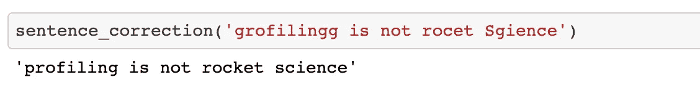

我们将从第一种类型的分析器开始分析我们的例子，临时分析器。

# 临时侧写员

临时分析器让我们了解程序整体上是如何运行的，并让我们了解是否存在问题。

我们要介绍的第一个工具是`time`，它帮助我们测量单次运行的用户和系统时间。它是 Python 内置的，带有 IPython magic，不需要额外安装。

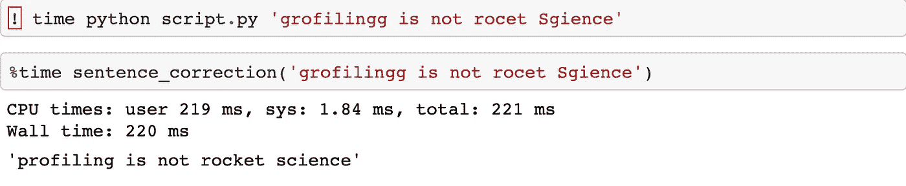

墙时间是总的执行时间，CPU 时间是程序使用 CPU 的时间。在我们的示例中，我们可以看到墙时间为 220 毫秒，其中 219 毫秒花费在 CPU 上，这意味着我们受到 CPU 的限制。

我要介绍的下一个工具是`timeit`模块，它帮助我们测量多次运行的执行时间。它是 Python 中内置的，并带有 IPython，不需要额外安装。它使用一些巧妙的技巧，比如禁用垃圾收集，使结果更加一致。

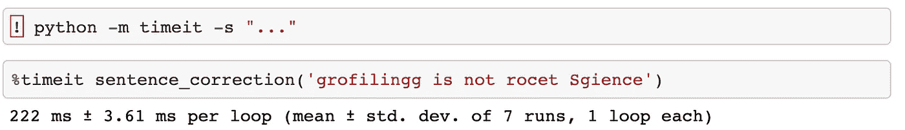

我们可以看到，我们的程序执行了 7 次，平均执行时间为 22 毫秒，两次执行之间的差异为 3.6 毫秒。

如果你想要相似的能力，为了比较两段(或更多)代码，你 [fastero](https://fastero.readthedocs.io/en/latest/index.html) 可能值得你花时间。

我今天要介绍的最后一个临时剖析工具是`memit` magic，它帮助我们测量进程内存。它不是 Python 内置的，所以需要安装，但是安装之后，我们可以使用 IPython magic。

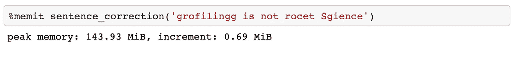

峰值内存是进程使用的最大内存，增量是这个特定调用增加了多少内存消耗。我们可以看到，改正一句话增加了 0.69 Mib 的内存消耗。

还有一些比较随意的剖析工具，以及如下的随意剖析景观️️️️looks:

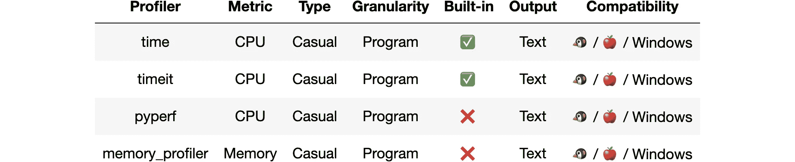

休闲侧写风景️️️️

## 随意侧写有以下优点和缺点

*   它们真的很容易使用。
*   它们让我们了解问题是否存在。
*   但是我们不能用它们来找出瓶颈。

事实上，我们不能精确定位瓶颈是至关重要的，并引导我们到下一组分析器，离线分析器。

# 离线分析器

离线分析器通过跟踪函数调用、异常和行执行等事件，帮助我们理解程序的行为。因为它们在特定事件上执行钩子，所以它们是确定性的，并且增加了大量开销，这使得它们更适合本地调试。

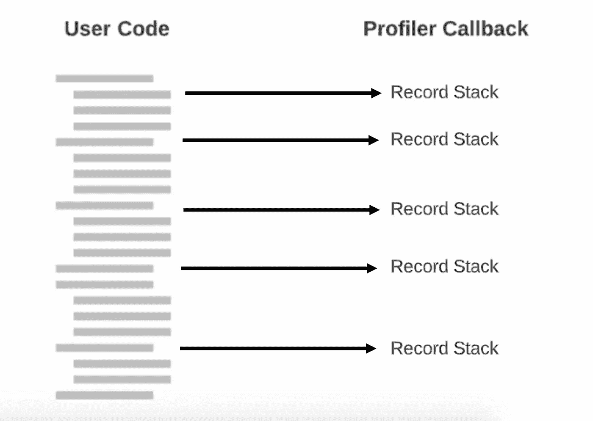

Python 允许你使用 *sys.setprofile* 或 sys.settrace 指定对特定解释器事件的回调。

我们要介绍的第一个工具是`cProfile`，它跟踪每个函数调用，并允许我们识别耗时的函数。默认情况下，它测量进程 CPU，但允许我们指定自己的测量。它是 Python 内置的，带有 IPython magic，不需要额外安装。`cProfile`仅适用于 Python 级别，不适用于多个进程。

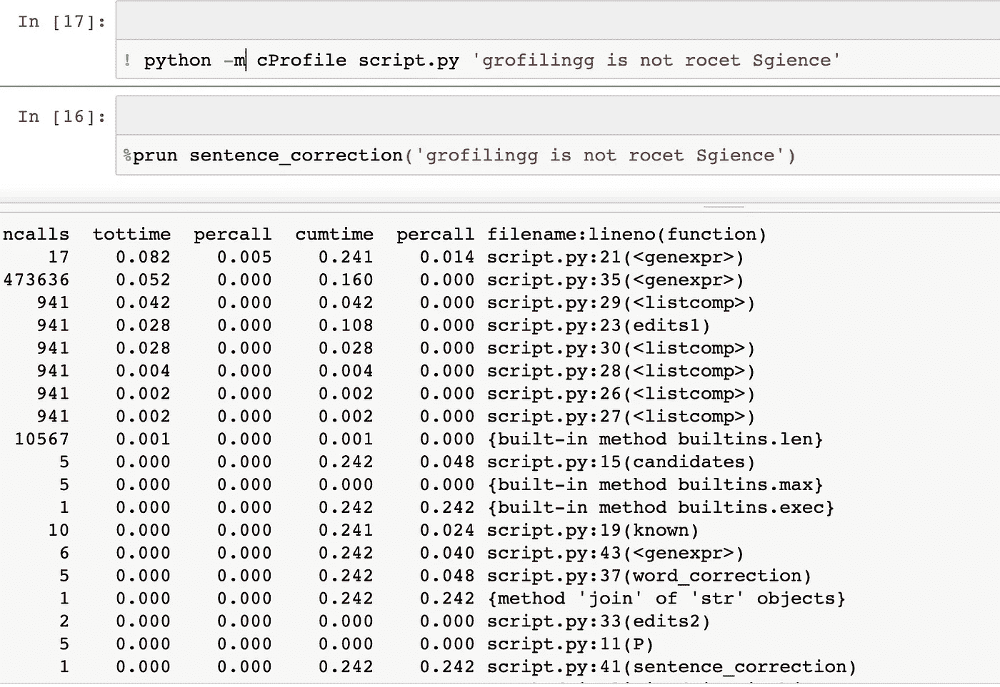

我们可以看到我们的 sentence_correction 函数用了 0.24 秒。所有这些都花在了候选函数上，当我们深入研究时，edits1 花费了 0.1 秒(40%)。

要处理的文本很多，而且对初来乍到的人来说有点加密。为此，发明了下一个工具，`SnakeViz`。`SnakeViz`接受`cProfile`的输出并创建直观的可视化效果。它不是 Python 内置的，所以需要安装，但安装后，我们可以使用 IPython magic。

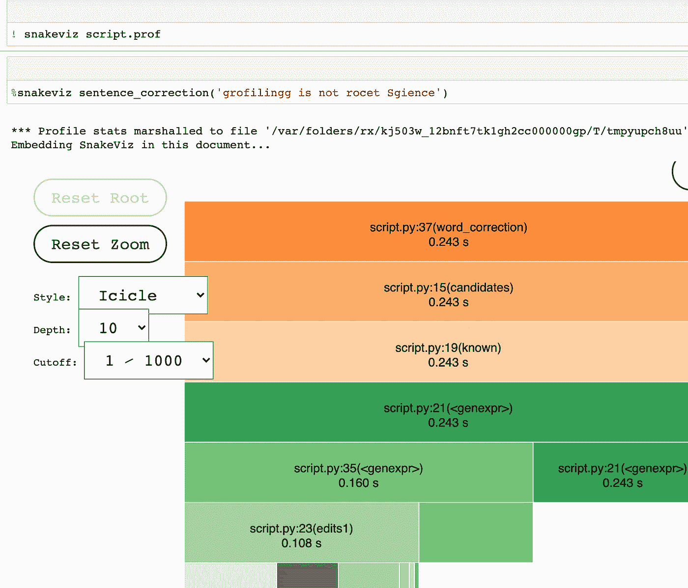

很容易看到所有的时间都花在了候选函数上，当我们深入研究时，edits1 花费了 0.1 秒(40%)。此外，我们可以过滤并更改显示的层数

我今天要介绍的最后一个临时剖析工具是`memory_profiler`。顾名思义，它允许我们测量函数中每一行对内存占用的影响。它不是 Python 内置的，所以需要安装，但安装后，我们可以使用 IPython magic。

我们可以看到，我们监视了 edits1 函数的内存占用。我们可以看到，我们以 169 MBS 开始这个函数，每一行都没有增加很多开销。这让我们相信大部分的内存消耗是由于我们的词汇。

在某些情况下，使用 [filprofiler](https://github.com/pythonspeed/filprofiler) 或 [memray](https://github.com/bloomberg/memray) 来分析内存会更容易。但是总的来说，还有很多离线评测器，离线评测的前景️️️️looks 如下:

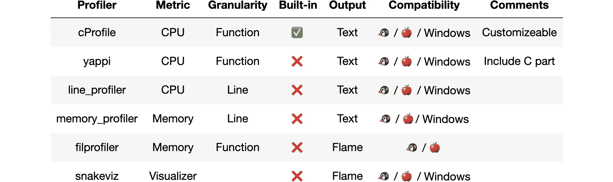

离线剖析景观️️️️

## 离线分析器有以下优点和缺点

*   它们让我们能够找出瓶颈。
*   它们是决定性的。
*   他们开销很大。
*   它们真的很容易使用。
*   它们的输出可能有噪声。
*   他们不能告诉我们哪些输入是慢的。
*   他们扭曲了程序的某些部分，因为它只在特定的事件上运行钩子。

这让我们想到了最后一种侧写器，在线侧写器。

# 在线分析器

在线分析器通过定期对程序执行堆栈进行采样，帮助我们理解程序的行为。背后的想法是，如果一个函数累积慢，它会经常出现，如果一个函数快，我们根本不会看到它。因为它们是定期执行的，所以它们是不确定的，并且增加了边际开销，这使它们更适合于生产使用。我们可以通过增加采样间隔和增加更多开销来控制精度。

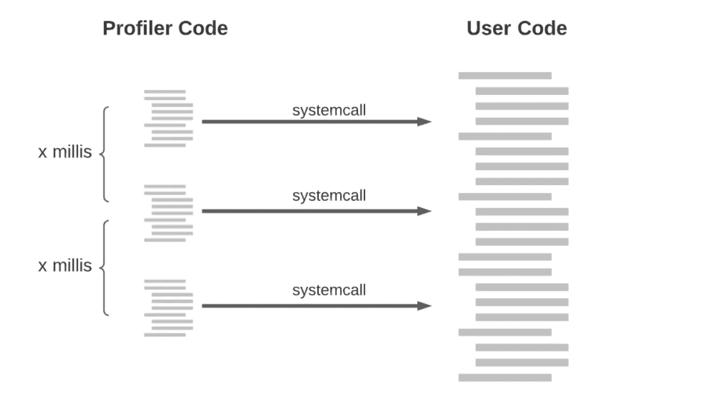

我们使用 setitimer 系统调用每隔 X 毫秒向 Python 程序发送一次信号。Python 让我们指定一个信号处理器来记录我们的堆栈。

我将只介绍`pyinstrument`，它通过每一毫秒采样和记录统计数据来测量进程 CPU。它不是 Python 内置的，所以需要安装，而且它没有 IPython magic。

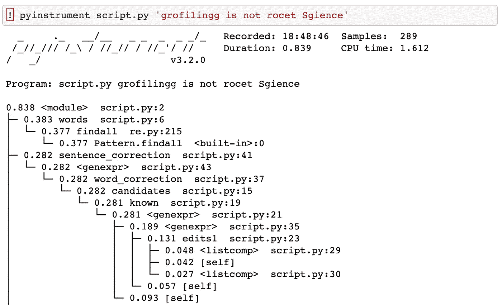

我们可以看到我们的 sentence_correction 函数用了 0.28 秒。所有这些都花在了候选函数上，当我们向下钻取 edits1 时，花费了 0.1 秒(40%)。我们可以看到，由于 pyinstrument 的统计特性，层次结构中的函数(和噪声)要少得多。

现在有更多的在线剖析工具，️️️️looks 的在线剖析工具如下:

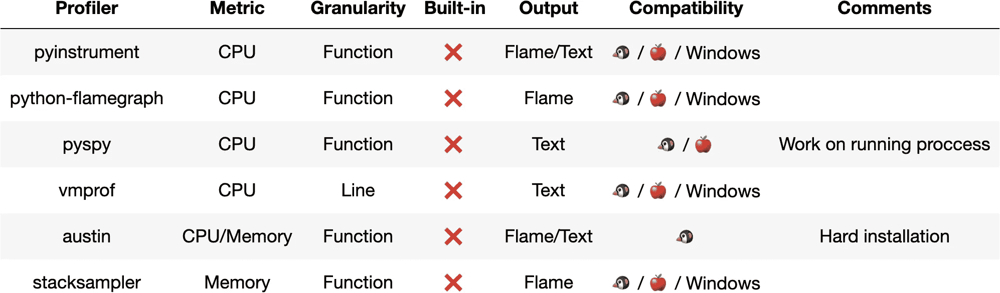

在线剖析️️️️风景

## 在线分析器有以下优点和缺点

*   它们让我们能够找出瓶颈。
*   它们不是决定性的。
*   尽管如此，它们引入了开销(边际)。
*   它们真的很容易使用。
*   他们不能告诉我们哪些输入是慢的。

我们在本文中介绍了许多工具。现在，您有能力在 99%的用例中找到瓶颈。

# 最后的百分比

但是我们仍然不能判断哪些输入会降低我们程序的速度，如果我们想要描绘一个奇异的度量，比如上下文切换的数量，我们就有一个问题。

如果您碰巧没有找到适合您问题的分析器，
您可以创建自己的分析器:

*   您可以使用`[cProfile](https://pythonspeed.com/articles/custom-python-profiler/)`或`[sys.settrace](https://www.youtube.com/watch?v=e03oTN3e0aM)` [和](https://www.youtube.com/watch?v=e03oTN3e0aM) `[sys.setprofile](https://www.youtube.com/watch?v=e03oTN3e0aM)`创建一个自定义的离线分析器。
*   您可以使用`[setitimer](https://jvns.ca/blog/2017/12/17/how-do-ruby---python-profilers-work-/)`或`[ptrace](https://eng.uber.com/pyflame-python-profiler/)`创建一个定制的在线分析器。
*   您可以使用 `[pyrasite](https://github.com/lmacken/pyrasite)`将 Python 代码附加到正在运行的进程[上。](https://github.com/lmacken/pyrasite)

为了减轻分析器不能告诉我们哪些输入很慢的事实，我们可以将日志记录与分析结合使用。日志允许我们记录任何我们想要的东西，没有性能损失。但是您需要提前添加日志记录，否则您就不走运了。

**专业提示**:记录热功能输入和持续时间。

我们找到了瓶颈，现在怎么办？我们只需要解决问题——说起来容易做起来难。那么我们必须注意性能退化。优化的代码往往是重构的候选对象。我们需要确保我们不会再次提出同样的问题。

# 遗言

在本文中，我们首先解释了为什么我们应该关注性能并找到我们的瓶颈。接下来，我们介绍了如何使用 profilers 来找到这些瓶颈，并让我们的用户满意。

我希望我能够分享我对这个迷人的话题的热情，并且你会发现它是有用的。一如既往，我欢迎任何建设性的反馈。