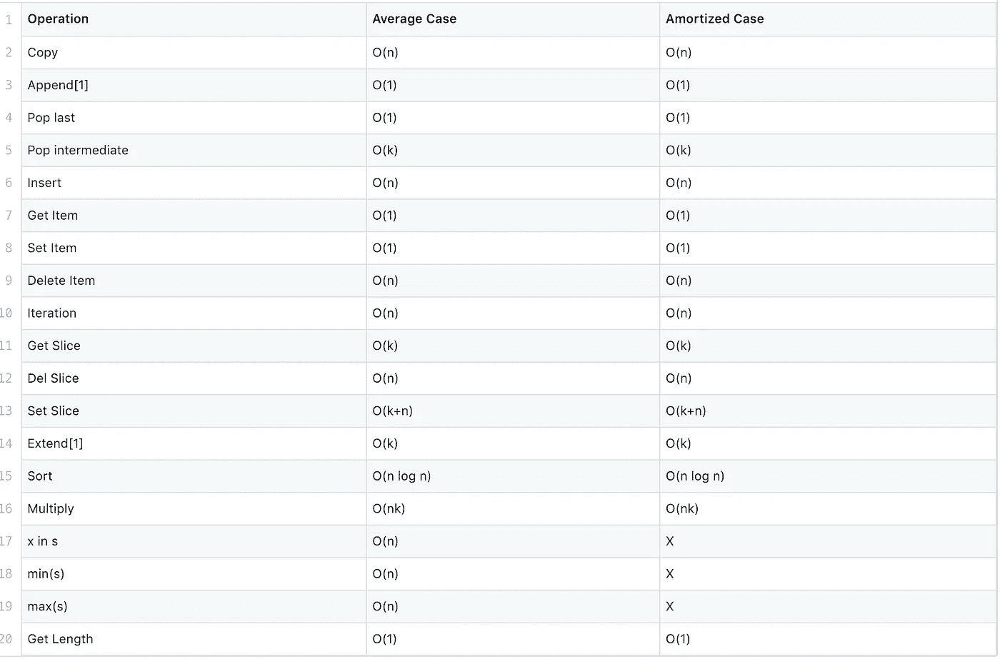
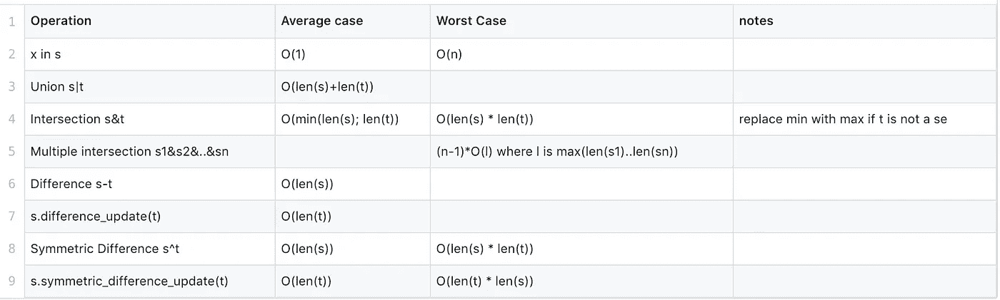
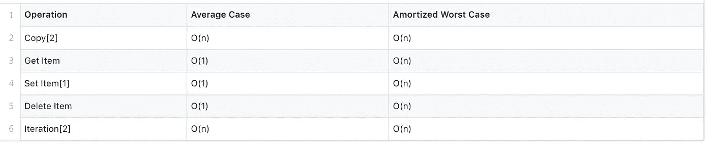
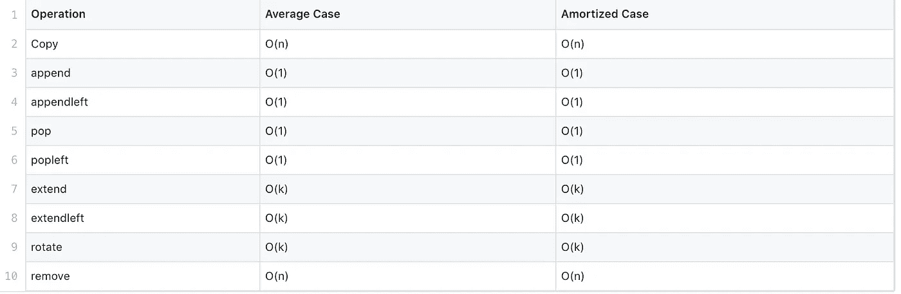
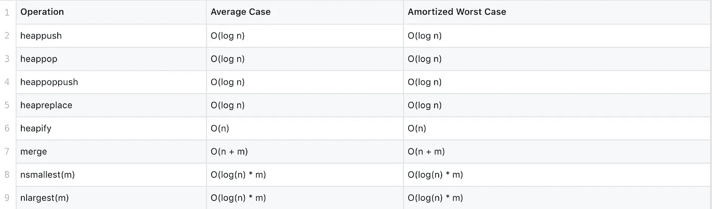
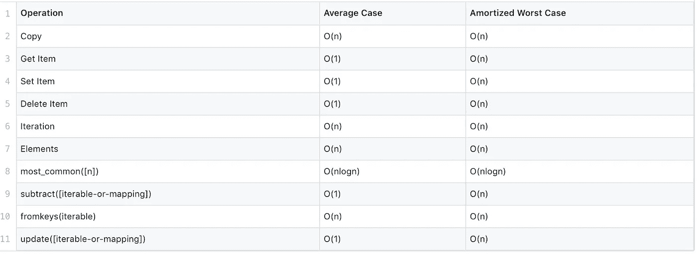
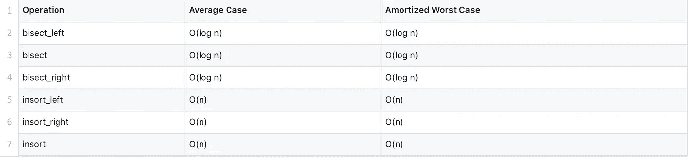

# Python 内置数据结构的综合指南

> 原文：<https://betterprogramming.pub/a-comprehensive-guide-to-pythons-built-in-data-structures-4d7ca2d242e5>

## Python 内置数据结构的时间复杂性

数据结构只是组织和存储数据的专门格式。它们是软件开发的重要部分，选择正确的数据结构至关重要。

> “糟糕的程序员担心代码。优秀的程序员会担心数据结构和它们之间的关系。”Linux 的创始人莱纳斯·托瓦尔兹

选择正确的字符最重要的一个是它的大 O 符号。

什么是大 O 符号？大 O 符号(“O”代表“顺序”)是描述算法性能和如何扩展(不一定是有多快)的语言。

我意识到有很多关于数据结构的文章。然而，在本文中，我将关注 Python 实现，因为:

*   Python 数据结构没有单一的时间复杂度([几乎](https://wiki.python.org/moin/TimeComplexity))。
*   我有稍微不同的数据结构。
*   由于实现的原因，时间复杂度可能令人惊讶。

# 我们开始吧

## 1.目录

一个`List`是元素的有序可变集合。

列表的大 O 符号

## 2.一组

一个`Set`是不同的[可散列的](https://docs.python.org/2/glossary.html#term-hashable)对象的无序集合。

集合的大 O 符号

## 3.词典

一个`Dict`将[的散列值](https://docs.python.org/2/glossary.html#term-hashable)映射到任意可变对象。

字典的大 O 符号

## 4.默认字典

`Default dict`是一个字典，当第一次遇到每个键时，用默认值初始化。

默认字典的大 O 符号

## 5.双端队列

一个`Deque`是栈和队列的概括(名字读作“deck”，是“双端队列”的简称)。

deque 的大 O 符号

## 6.Heapq

`Heapq`是一个二叉查找树，其每个父节点的值小于或等于其任何一个子节点的值。

heapq 的大 O 符号

## 7.计数器

一个`Counter`是一个`dict`子类，用于计数可散列对象。它是一个无序的集合，其中的元素存储为字典键，它们的计数存储为字典值。

计数器的大 O 符号

## 8.把…分为两个部分

等分模块实现了一种算法，用于将元素插入到列表中，同时保持列表的排序顺序。

二等分的大 O 符号

# 遗言

我希望你觉得有趣和有用。我乐于接受任何建设性的反馈。