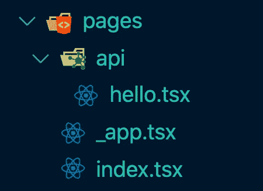
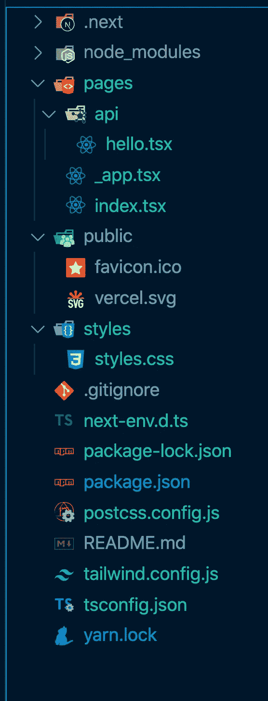

# 使用 TypeScript 和 TailwindCSS 设置 Next.js 的综合指南

> 原文：<https://betterprogramming.pub/a-comprehensive-guide-to-setting-up-next-js-with-typescript-and-tailwindcss-75fce249110c>

## 用 TypeScript 和 Tailwind 设置您的 Next.js 项目


由[史蒂夫·哈拉马](https://unsplash.com/@steve3p_0?utm_source=medium&utm_medium=referral)在 [Unsplash](https://unsplash.com?utm_source=medium&utm_medium=referral) 上拍摄的照片

在本教程中，您将学习如何使用 TypeScript 和 TailwindCSS 设置 Next.js。首先，我们将添加 TypeScript，然后是 TailwindCSS。本教程的目的是帮助你用这三种技术建立一个项目。

完成本教程后，您将拥有一个带有 TypeScript 和 TailwindCSS 的功能性 Next.js 应用程序。您可以在此基础上构建并创建一个有用的应用程序！

每当你对在哪里添加文件或项目的结构应该是什么感到困惑时，请查看文章的结尾，在那里你会找到最终项目的图像。

先决条件:

*   终端知识。
*   知道如何使用代码编辑器。
*   基本的 NPM/npx/纱线知识。

# 创建 Next.js 应用程序

第一步是创建一个简单的 Next.js 应用程序。我们可以通过运行以下命令来实现这一点:

```
npx create-next-app nextjs-typescript-tailwind
```

命令 create-next-app 由 Next.js 创建者维护，它可以在几秒钟内构建一个应用程序——next js-typescript-tailwind 文件夹存储您新创建的应用程序。

现在，您可以进入应用程序文件夹并运行它。您可以通过执行以下命令来完成此操作:

```
cd nextjs-typescript 
yarn dev
```

`cd`命令带你进入指定的文件夹，`yarn dev`运行应用程序。你可以去 localhost:3000 看看你的新应用。这就是创建一个简单的 Next.js 应用程序所要做的全部工作。

# 添加类型脚本

下一步是向我们的应用程序添加 TypeScript。第一步是在根目录下创建文件 tsconfig.json。通过在终端中运行以下命令来创建文件:

```
touch tsconfig.json
```

touch 命令允许您在基于 Unix 的系统(如 Linux 和 macOS)中创建空文件—阅读关于 touch 命令的更多信息。由于我们的 tsconfig 文件是空的，如果您尝试运行该应用程序，您会得到以下错误:

> 您似乎正在尝试使用 TypeScript，但没有安装所需的软件包。
> 
> 请通过运行以下命令安装 typescript、@types/react 和@types/node:
> 
> 纱线添加—开发类型脚本@类型/反应@类型/节点

因为我们在本教程中使用 npm，所以使用以下命令在项目中安装 TypeScript:

```
npm install --save-dev typescript @types/react @types/node
```

但是，上面的命令是做什么的呢？它创建一个名为 next-env.d.ts 的文件，并填充 ts config . JSON。ts config . JSON 的目的是指示当前目录是 TypeScript 项目的根。此外，它还指定了编译项目所需的编译器信息。此外，next-env.d.ts 文件告诉 TypeScript 编译器选择 Next.js 类型。

Next.js 类型——这就引出了下一个问题；什么是 Next.js 类型？有`GetStaticProps`、`GetStaticPaths`和`GetServerSideProps`类型，您可以将它们用于方法`getStaticProps`、`getStaticPaths`和`getServerSideProps`。有关更多类型和信息，请查看 [Next.js 文档](https://nextjs.org/learn/excel/typescript/nextjs-types/?source=dailydev)。

你差不多完成了。剩下的唯一一步就是更改。js 对. tsx 的扩展。tsx 扩展是 TypeScript JSX 的扩展。更改扩展名后，您的文件应该如图 1 所示:



图 1

现在你的 Next.js 应用完全支持 TypeScript 了。从现在开始，你可以写打字稿代码了！

# 添加 TailwindCSS

下一步也是最后一步是将 TailwindCSS 添加到应用程序中。要添加 Tailwind，您需要运行下面的命令，这会将它安装到应用程序中:

```
npm install tailwindcss postcss-preset-env --save-dev
```

然而，看着上面的线，你可以看到我们不仅仅安装了顺风。我们还有 postcss-present-env。那是什么？根据他们的网站，PostCSS“让你将现代 CSS 转换成大多数浏览器都能理解的东西，根据你的目标浏览器或运行时环境确定你需要的 polyfills”。

但是我们为什么需要顺风呢？因为 TailwindCSS 是一个 PostCSS 插件。因此，我们需要一个工具来把现代的 CSS 翻译成浏览器能够理解的东西。

让我们继续，生成 tailwind.config.js 文件。该文件的目的是允许您定制您的 TailwindCSS 安装。它是一个配置文件，你可以在其中添加额外的信息，比如插件、主题、边距、填充，以及你需要而 Tailwind 没有的一切。

```
npx tailwindcss init
```

通过运行上面的命令，它会自动创建 tailwind.config.js 文件。如果你想添加定制，我建议检查一下 [TailwindCSS 配置页面](https://tailwindcss.com/docs/configuration/?source=dailydev)。

下一步是创建一个 CSS 文件，我们可以在其中添加 TailwindCSS 数据。在样式目录中创建新文件，如下所示:

```
touch styles/styles.css
```

您可以在任何需要的地方添加 CSS 文件，这对您的项目是有意义的。此外，您可以将 CSS 文件命名为“Tailwind.css”或您想要的任何名称。

但是，进一步将下面几行添加到 styles.css 文件中。

```
@tailwind base; 
@tailwind components; 
@tailwind utilities;
```

这些行的作用是保存所有你可以在应用中使用的 CSS。在构建时，它将这些与生成的 CSS 交换。例如，@tailwind base 相当于 Normalize.css。

## PostCSS

我们也几乎完成了向我们的项目添加 TailwindCSS。剩下的工作是设置 postcss.config.js 文件，该文件存储 postcss 的配置。像往常一样，我们可以创建如下文件:

```
touch postcss.config.js
```

为 PostCSS 创建配置文件后，向其中添加以下代码:

```
module.exports = {
    plugins: ["tailwindcss", "postcss-preset-env"],
};
```

您要做的最后一件事是在 _app.tsx 文件的开头添加 import `../styles/styles.css`。之后，您可以在应用程序的任何地方使用 TailwindCSS。

# 结论

干得好！您在 Next.js 应用程序中添加了 TypeScript 和 TailwindCSS。此时，您的项目应该类似于以下内容:



图 2

你可以在[我的 Github 上找到这个项目——点击我](https://github.com/catalinpit/nextjs-typescript-tailwindss/?source=dailydev)。

*如果对 JavaScript 教程感兴趣，我推荐* [*前端高手*](https://catalins.tech/frontend-masters-membership-is-it-worth-it) *！*

*如果你想用技术写作赚钱，就去查查* [*那些付钱让你写*](https://catalins.tech/websites-that-pay-you-to-write-technical-articles) *技术文章的网站吧！*

*如果你想学习 JavaScript，我推荐这些* [*5 资源作为初学者学习 JavaScript*](https://catalins.tech/5-best-resources-to-learn-javascript-as-a-beginner)*！*

*谈判你的工资是必不可少的——学习* [*作为一名开发者如何谈判你的工资*](https://catalins.tech/how-to-negotiate-your-salary-as-a-developer) *！*

*用* [*Git 别名*](https://catalins.tech/git-aliases-what-are-they-and-how-to-use-them) *加速你的开发。*

*如果你想* [*以开发者的身份开博*](https://catalins.tech/how-to-start-your-blog-as-a-developer) *，我推荐你阅读《* [*如何以开发者的身份开博*](https://catalins.tech/how-to-start-your-blog-as-a-developer) *》一文！*

你是否很难跟上科技领域的最新消息？参见 [*作为开发者保持最新状态的一种方法*](https://catalins.tech/one-way-to-stay-up-to-date-as-developer) *！*

*学习* [*如何在 JavaScript 中使用 Async/Await*](https://catalins.tech/how-to-use-asyncawait-in-javascript)*！*

GitHub 简介目前风靡一时。了解 [*如何创建 GitHub 个人资料页面*](https://catalins.tech/how-to-create-a-kickass-github-profile-page) *！*

*查看这 7 个* [*资源，帮你通过求职面试*](https://catalins.tech/7-github-repositories-to-help-you-crush-your-job-interviews) *！*

*查看*[*JavaScript ECMAScript 2021 es 2021*](https://catalins.tech/javascript-es2021-you-need-to-see-these-ecmascript-2021-features)*即将推出的新功能！*

*你是初学程序员吗？查看这些* [*编程项目思路适合初学者*](https://catalins.tech/10-programming-project-ideas-for-beginners) *！*

你是在学习编码还是打算做编码？查看 [*免费学习编程的最佳去处*](https://catalins.tech/20-best-places-to-learn-programming-for-free) *！*

[*借助这 9 款浏览器扩展，提高您的开发人员工作效率*](https://catalins.tech/my-9-must-have-browser-extensions-for-increased-developer-productivity) *！*

*如果你是 Node.js 的开发者，我建议你查看 Node.js* *中的这些* [*4 种创造性的设计模式！*](https://catalins.tech/the-4-creational-design-patterns-in-nodejs-you-should-know)

*查看这些惊人的*[*JavaScript ECMAScript 2020 特性*](https://catalins.tech/javascript-es2020-the-features-you-should-know) *！*