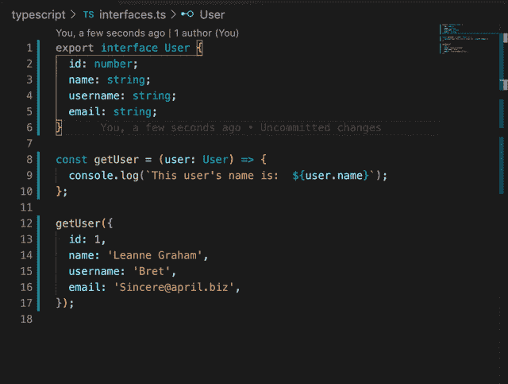

# 类型脚本接口综合指南

> 原文：<https://betterprogramming.pub/a-comprehensive-guide-to-typescript-interfaces-16c5749fac2b>

## 向您的代码库添加类型和类型安全


由[凯利·西克玛](https://unsplash.com/@kellysikkema?utm_source=unsplash&utm_medium=referral&utm_content=creditCopyText)在 [Unsplash](https://unsplash.com/?utm_source=unsplash&utm_medium=referral&utm_content=creditCopyText) 上拍摄的照片

喜欢 TypesScript 有很多原因，因为它比 JavaScript 有很多优点。对大多数开发人员来说，主要的好处是类型安全的优势。类型安全在 TypeScript 中有多种实现方式，但最重要的方式之一是通过接口。

接口允许您验证您的函数是否拥有所有需要的数据，并且没有任何不需要的数据。TypeScript 会在你的代码被编译之前告诉你这一切。

# 概观

以下是这篇文章将涵盖的内容的概述。

*   什么是 TypeScript 接口？
*   什么时候使用 TypeScript 接口？
*   简单接口示例
*   向界面添加属性
*   从界面中删除属性和可选属性
*   处理多个 JSON 对象
*   处理多个 JSON 对象的数组
*   使用函数属性
*   结论和额外资源

# 什么是 TypeScript 接口？

TypeScript 接口的一个常见解释是，它们定义了一个*契约*，但这是什么意思呢？它基本上意味着一个接口将指定什么属性以及这些属性的类型应该是什么。

对什么是接口有一个小的解释是很好的，但是理解接口的最好方法是通过例子和实际使用它们。

# 什么时候使用 TypeScript 接口？

使用接口有几种不同的方式，但是您将看到的两种主要方式是将接口用作函数的参数，以及通过类似 API 响应的方式来确定数据结构。

在本文中，我们将主要讨论如何使用接口作为函数参数的一部分。绝大多数时候你使用一个接口，都是为了这个用例。

在本文的后面，我们将使用 [JSONPlaceholder](https://jsonplaceholder.typicode.com/) 和用户端点。下面是一个使用我们的`User`接口作为 API 响应的一部分的例子。这是一个角度服务的小例子。

```
getUsers() {
    return this.http.get<User[]>(`[https://jsonplaceholder.typicode.com/users`](https://jsonplaceholder.typicode.com/users`));
}
```

上面的代码基本上只是说期望来自那个端点的数据符合在`User`接口中指定的属性和类型。

# 简单接口示例

在我们的简单示例中，我们将只使用四个字段:id、姓名、用户名和电子邮件。该接口声明所有四个字段都是必需的，并且`id`必须是类型`number`，而其他三个必须是类型`string`。

```
export interface User {
  id: number;
  name: string;
  username: string;
  email: string;
}
```

现在让我们在函数中使用这个接口。

```
const getUser = (user: User) => {
  console.log(`This user's name is:  ${user.name}`);
};getUser({
  id: 1,
  name: 'Leanne Graham',
  username: 'Bret',
  email: '[Sincere@april.biz](mailto:Sincere@april.biz)',
});//This user's name is:  Leanne Graham
```

太好了！这一切都工作，很容易。

# 向界面添加属性

如果您试图添加一个未在接口中指定的附加属性，会发生什么情况？



正如你在上面看到的，我们做的第一件事是尝试给传递给`getUser`的对象添加一个`additionalProperty`字段。我们得到下面的错误。

```
Argument of type '{ id: number; name: string; username: string; email: string; additionalProperty: string; }' is not assignable to parameter of type 'User'.
  Object literal may only specify known properties, and 'additionalProperty' does not exist in type 'User'.ts(2345)
```

这个错误只是说明您添加了一个属性，方便地命名为`additionalProperty`，它没有在`User`接口中指定。

你怎么解决这个问题？

谢天谢地，你有两个选择来解决这个问题。

1.您可以从传递给`getUser`函数的对象中移除`additionalProperty`。现在，这很可能不是您正在寻找的解决方案，因为您可能有意做出了这种改变，并且需要`additionalProperty`中的信息。也就是说，无意中向对象添加属性的情况确实会发生。例如，您可能打算将`additionalProperty`作为附加参数添加，不是作为属性添加，其中`getUser`函数可能如下所示:

```
getUser(
  {
    id: 1,
    name: 'Leanne Graham',
    username: 'Bret',
    email: '[Sincere@april.biz](mailto:Sincere@april.biz)',
  },
  { additionalProperty: 'Another one' }
);
```

2.另一个解决方案是更新`User`接口，用适当的类型来解释新的`additionalProperty`。通常，当出现此错误时，这就是您正在寻找的解决方案。

# 从界面中删除属性和可选属性

那么，如果我们不再需要`email`属性，会怎么样呢？


如您所见，如果您只是从传递给`getUser`的对象中移除`email`属性，您将会看到下面的错误。

```
Argument of type ‘{ id: number; name: string; username: string; }’ is not assignable to parameter of type ‘User’.
 Property ‘email’ is missing in type ‘{ id: number; name: string; username: string; }’ but required in type ‘User’.ts(2345)interfaces.ts(5, 3): ‘email’ is declared here.
```

这个错误基本上是说`email`需要作为`User`接口的一部分被传递。

你怎么解决这个问题？

同样，您有两种选择来解决这个问题。

1.  您可以从`User`接口中移除`email`。这个解决方案可能不错，但是您需要确定`email`属性永远不会作为传递给`getUser`的对象的属性被添加。
2.  您可能已经注意到了上面例子中的另一个解决方案，即在`email`之后添加一个`?`，使属性可选。这是一个非常好的界面特性，允许添加或删除`email`属性。当然，您可能需要在`getUser`函数中进行修改，以处理`email`未通过的情况。

# 处理多个 JSON 对象

我们在这个例子中做了一些改进，但是让我们看看 JSONPlaceholder。对于软件开发中的许多事情来说，这是一个极好的资源，并且对于解释 TypeScript 接口也很有帮助。

我们将引用 users 端点，现在我们只看这个端点上的第一个用户`https://jsonplaceholder.typicode.com/users/1`。您也可以在 Chrom e 中查看这一点，您应该会看到下面的 JSON 结构。

```
{
  "id": 1,
  "name": "Leanne Graham",
  "username": "Bret",
  "email": "[Sincere@april.biz](mailto:Sincere@april.biz)",
  "address": {
    "street": "Kulas Light",
    "suite": "Apt. 556",
    "city": "Gwenborough",
    "zipcode": "92998-3874",
    "geo": {
      "lat": "-37.3159",
      "lng": "81.1496"
    }
  },
  "phone": "1-770-736-8031 x56442",
  "website": "hildegard.org",
  "company": {
    "name": "Romaguera-Crona",
    "catchPhrase": "Multi-layered client-server neural-net",
    "bs": "harness real-time e-markets"
  }
}
```

我们应该如何着手为此创建一个界面呢？基于这个简单的例子，我们对如何做到这一点有一个基本的想法。

现在让我们忽略`address`和`company`对象。如果我们这样做，我们将会有一个类似下面的`User`界面。

```
export interface User {
  id: number;
  name: string;
  username: string;
  email: string;
  phone: string;
  website: string;
}
```

现在，如何容纳`address`和`company`对象呢？我们将首先为两者创建一个新的接口。

```
export interface Address {
  street: string;
  suite: string;
  city: string;
  zipcode: string;
  geo: {
    lat: string;
    lng: string;
  };
}export interface Company {
  name: string;
  catchPhrase: string;
  bs: string;
}
```

为每个对象创建一个新的接口通常被认为是最佳实践。你会注意到我们忽略了为`geo`对象做这件事。其原因是该信息可能总是伴随着地址信息。当然，如果您愿意，您可以创建一个`GeoCoordinates`接口并修改`Address`接口，如下所示:

```
interface Address {
  street: string;
  suite: string;
  city: string;
  zipcode: string;
  geo: GeoCoordinates;
}interface GeoCoordinates {
  lat: string;
  lng: string;
}
```

我们现在有了这两个新的`Address`和`Company`接口。我们如何将这些与`User`接口联系起来？

```
export interface User {
  id: number;
  name: string;
  username: string;
  email: string;
  address: Address; // uses the new Address interface
  phone: string;
  website: string;
  company: Company; // uses the new Company interface
}
```

现在，我们的`User`接口已经完全设置好了。来看看我们更新后的`getUser`功能。

```
const logUserAddress = (userAddress: Address) => {
  console.log(`The user's address is ${userAddress.street}      ${userAddress.suite}`);
};const getUser = (user: User) => {
  console.log(`The user's name is ${user.name}`);
  console.log(`The user's phone number is ${user.phone}`);
  console.log(`The user's zipcode is ${user.address.zipcode}`);
  logUserAddress(user.address);
};getUser({
  id: 1,
  name: 'Leanne Graham',
  username: 'Bret',
  email: '[Sincere@april.biz](mailto:Sincere@april.biz)',
  address: {
    street: 'Kulas Light',
    suite: 'Apt. 556',
    city: 'Gwenborough',
    zipcode: '92998-3874',
    geo: {
      lat: '-37.3159',
      lng: '81.1496',
    },
  },
  phone: '1-770-736-8031 x56442',
  website: 'hildegard.org',
  company: {
    name: 'Romaguera-Crona',
    catchPhrase: 'Multi-layered client-server neural-net',
    bs: 'harness real-time e-markets',
  },
});//The user's name is Leanne Graham
//The user's phone number is 1-770-736-8031 x56442
//The user's zipcode is 92998-3874
//The user's address is Kulas Light Apt. 556
```

正如您在`getUser`函数中看到的，传递的对象与您在`[https://jsonplaceholder.typicode.com/users/1](https://jsonplaceholder.typicode.com/users/1)`中看到的完全一样。

对`getUser`函数所做的一个额外的改变是有另一个名为`logUserAddress`的函数在其中被调用。这个新函数接受我们创建的新`Address`接口的一个参数。这样做很好的原因是，您只能传递用户的地址细节，并充分利用`Address`接口及其类型定义。

# 处理多个 JSON 对象的数组

因此，我们已经从 JSONPlaceholder 中增加了完整的用户对象，但是让我们通过添加一个对象数组来假装它甚至更复杂一些。

假设我们的用户很富有，有多所房子，每所房子的详细信息都存储在`address`数组中的一个对象中。您的用户对象将看起来像下面的对象。

```
{
  id: 1,
  name: 'Leanne Graham',
  username: 'Bret',
  email: '[Sincere@april.biz](mailto:Sincere@april.biz)',
  address: [
    {
      street: 'Kulas Light',
      suite: 'Apt. 556',
      city: 'Gwenborough',
      zipcode: '92998-3874',
      geo: {
        lat: '-37.3159',
        lng: '81.1496',
      },
    },
    {
      street: 'Random Street',
      suite: 'Apt. 321',
      city: 'Attenborough',
      zipcode: '93187-4259',
      geo: {
        lat: '-37.9911',
        lng: '82.0137',
      },
    },
  ],
  phone: '1-770-736-8031 x56442',
  website: 'hildegard.org',
  company: {
    name: 'Romaguera-Crona',
    catchPhrase: 'Multi-layered client-server neural-net',
    bs: 'harness real-time e-markets',
  },
}
```

这里唯一的变化是`address`是一个数组，并且有一个新的对象，该对象具有与`Address`接口中定义的所有必需属性相匹配的哑数据。

```
{
    street: 'Random Street',
    suite: 'Apt. 321',
    city: 'Attenborough',
    zipcode: '93187-4259',
    geo: {
        lat: '-37.9911',
        lng: '82.0137',
    },
},
```

既然我们已经定义了更高级的用户对象的样子，那么我们的`User`界面会有什么样的结果呢？

```
export interface User {
  id: number;
  name: string;
  username: string;
  email: string;
  address: Address | Address[];
  phone: string;
  website: string;
  company: Company;
}
```

在 TypeScript 中，`|`是一个非常重要的部分，这里称为*联合类型*。这基本上就是说，`address`属性可以是一个单独的`Address`对象，也可以是一个包含一个或多个`Address`对象的数组。在我们的例子中，我们可以不使用联合类型，严格要求`address`属性是`Address`对象的数组。但是这种解决方案具有灵活性，并且仍然可以使用 JSONPlaceholder 提供的前一个用户 JSON 对象。

```
const logUserAddress = (userAddress: Address | Address[]) => {
  if (Array.isArray(userAddress)) {
    console.log(`The user has ${userAddress.length} addresses`);
    for (const [index, address] of userAddress.entries()) {
      console.log(`The user's address ${index + 1} is ${address.street} ${address.suite}`);
    }
  } else {
    console.log(`The user's address is ${userAddress.street} ${userAddress.suite}`);
  }
};const getUser = (user: User) => {
  console.log(`The user's name is ${user.name}`);
  console.log(`The user's phone number is ${user.phone}`);
  logUserAddress(user.address);
};
```

在看了函数之后，这可能看起来很复杂，但是它比看起来简单。我们做一个简单的检查来确定`userAddress`是否是一个数组，如果是，我们可以遍历这个数组来获取地址信息。否则，`userAddress`将是一个对象，我们可以像以前一样访问属性。

# 使用函数属性

那么如果你需要在一个界面中增加一个功能呢？没问题。

```
{
  id: 1,
  name: 'Leanne Graham',
  // ... removed to make it shorter / easier to read
  company: {
    name: 'Romaguera-Crona',
    catchPhrase: 'Multi-layered client-server neural-net',
    bs: 'harness real-time e-markets',
  },
  logCompany: (company) => {
    console.log(company.name);
  },
}
```

您会注意到这里有一个新的属性，名为`logCompany`，它是一个带有参数`company.`的函数。`logCompany`函数将记录所提供的`company`对象的`name`属性。

这对`User`界面有什么影响？

```
export interface User {
  id: number;
  name: string;
  username: string;
  email: string;
  address: Address | Address[];
  phone: string;
  website: string;
  company: Company;
  logCompany?: (company: Company) => void;
}
```

`User`接口具有可选的`logCompany`属性，该属性接受一个参数`company`，即`Company`接口。这是将对象分解到它们自己的接口的好处的另一个例子。`void`将是函数的返回类型。在我们的例子中，我们没有返回值，因为我们登录到控制台。如果你要返回一个类型为`string`或`boolean`的值，等等。，您需要在接口中指定返回类型。

看一下`getUser`函数，我们可以看到，作为函数的最后一行，我们有`user.logCompany?.(user.company);`，它本质上声明了如果我们有`logCompany`属性，我们需要将它作为带有`user.company`参数的函数来执行。这将会成功，因为`user.company`是在`Company`接口中指定的定义。

```
const getUser = (user: User) => {
    log.result(`The user's name is ${user.name}`);
    log.result(`The user's phone number is ${user.phone}`);
    logUserAddress(user.address);
    user.logCompany?.(user.company);
};
```

## 异步函数

同样，您完全可以使用异步函数作为接口的属性。举个例子，如果你为`logCompany`使用一个承诺，这个承诺将包装返回类型(在我们的例子中`void)`使接口看起来像:

```
logCompany?: (company: Company) => Promise<void>;
```

然后，当然，我们需要通过添加关键字`async`来使`getUser`函数异步。我们还需要在`user.logCompany?.(user.company);`行之前添加`await`关键字。

```
const getUser = async (user: User) => {
  log.result(`The user's name is ${user.name}`);
  log.result(`The user's phone number is ${user.phone}`);
  logUserAddress(user.address);
  await user.logCompany?.(user.company);
};
```

# 结论和额外资源

谢谢你能走到这一步。我真的希望这篇文章对您有用，并且这些例子提高了您对 TypeScript 接口的理解。

下面我附上了 GitHub 的要点和我们在本文中讨论过的全部代码。这也可以复制并在 [TypeScript Playground](https://www.typescriptlang.org/play?#code/JYOwLgpgTgZghgYwgAgKoGdrIN4ChnLAAmAXMiAK4C2ARtANz7lxURnphSgDmjBFmKCBZtkHLiF5MIVOMAA27Tjz7I4RIlAjp0ZAIIatO5AB9kBzdvQBtALqqADgAsA9iFHiVTAO4Qa6YEglCSkCBBcqBzgQAE8yAGEIqNjVeRduRMjomIB+MgAKcKzYhKTsgEpkAF4APmQANxdiRgBfXFxQSFhEFAsjdBwmcQgIMGCvAnQKQI9lSVUEQLixOdDkAC9gB3CiWZDVbggXMjwCAnk4MZX9pnPJcfmmFtb2zuh4JGRM5JjBgmFWA81ghLggnAAFJxQOCYIGqfxw3BtXDhEAcZBpbgYaB9KzVZD5AQ4wxWfQk4xmXE6OyVWp-QgwAl6KDQmIAOmA6GZrMJgip6HKlVOZ1R6Bc8ggbMx+QABgAVJwoIlQZBOGHIAAk2GV-KlEEkYCcLTU5Mw6Bl5VUBBgLhVhTc6OsoF2AA8ADQmyw6WzIFyMnWmtn65TafKC+lnZCi8WS6XyxXIZUAcgG6i9Ay1zogLuQAGpkABGY2czXYNP9NnDUbGrXlqyV6aQFoWq3INoEY0QeSYCNRh0xqXpWUKpWCFOe-qEDPavmBqtgGsz4nphszZuWp5Ixgoh1gZCHMDYlVVAnK3RoQQ06p1YU2u2ivfK33+wQC3vRiWD7jDhPJgYAlASy1ZU2QA9dWw-WMh3jUdoHHZw3BQShaCwIClygNkEPccDbgxdIj35XloDZOsdA3SMQMxb5shyNkiIwoofnItst3aA8j3yawmGFAhiDIAs3VwgCyCTAAZCBoncZAAHFoTVKgk0EijBGE5AkwAIS0MBFNwmQ5EUNSAGVQCQLQAAE4AcLh5DZGhgHWHTI1I88uMjAgeLc+cRIAaQoC4BlE4BuCcbSlLcyZG1EJM9AcMA2WQABWBKADZHPCqMlhE6TfBAGhbRcChgrS8LNm2FxdhEgBOAAmSrKoADgAWgAZnqgB2AAWYq3MOY5e3Ci4riTFq2rZZqCwSyruoG+41Pqgs2QLDrKtSsLwpaNazg23D3J2s4vLUgAlaIiAiZBDM4EZQr2iKZhEmK4uQZrqoLaaRUytS9DASBcvywqnDeghSp2KLKvG9rGo66rJsB-cjhOG6zkGkSRrZOqC1ezaZu4ET6uqtkAAYC2atrYe29bNtsTasKigtGratqCfp5rksa+qCfG5AXRSjqoe63x-DutSnAUXZuDgKAiDZW1uG6xjsgR8LVKTQ6IjgbgKGgOBGviKA3DgN6QTAMFIWhWE1IAWT8sBgEai4YmgCAiCjeRgGDRrBHqLB3AoaF5Ea9xrvChFhYl9xjC0OB-Zt1hkAgRrZCgABrUZ0G68mkfSaiSgJeXYlpG89sgr97WKdkAOYjswozjy+OQarNuVgBRKB6lAZAAAkXF8eR5G65Vlb0cBEO+iBur0hQRMMtUQGEMzWFdnQ4DZMB6m65zFc8y7RhEgA1YAEDAW1kHBC5QDTrGxEiqfIuQdqpsvxYwGWJMAHVORcJOYhoX2isv4HyqgwJilVmDM2qYz2r1TeA1Lgow6s1NGCUCYP0RvIWaw1modTZB1ZKBZ6pvQzlXXCNMRJEyZslGqjVkqTWalzZBBZob8z8AEIIalogwjADCYAy9A5yzKDnDy-wRAiQACIQAQEnbuOsuAcENqCCEUIYRRXBHrRANsvbICIMQNRB8+zgB4PqBAMQ3ohxTDEdwUBuD2RQOgEEFwaASivg4Bw8gYiNTBHINE6dq6CVsJaIAA) 中使用。

如果你想要一些额外的资源来理解 TypeScript 接口，我推荐你看看 [TypeScripts 官方文档](https://www.typescriptlang.org/docs/handbook/interfaces.html)。另一个优秀的资源是 Udemy。我目前正在报名参加[理解打字稿— 2020 年版](https://www.udemy.com/course/understanding-typescript/)，可以有把握地说，这是各种打字稿知识的绝佳资源，包括界面。

我还有一个 [GitHub 库](https://github.com/tengel92/Medium)，里面有我所有的 JavaScript 和类型脚本技巧和诀窍。您可以克隆这个 repo，在安装了与`npm install`的依赖关系之后，您就可以运行`npm run ts:interfaces`了。你也可以修改`interfaces.ts`来满足你学习更多的渴望，并拥有一个本地的打字游戏场。

[https://gist . github . com/tengel 92/a 54c 0d 55 CB 2 b5 f 314 AC 55d 55065486 A0](https://gist.github.com/tengel92/a54c0d55cb2b5f314ac55d55065486a0)