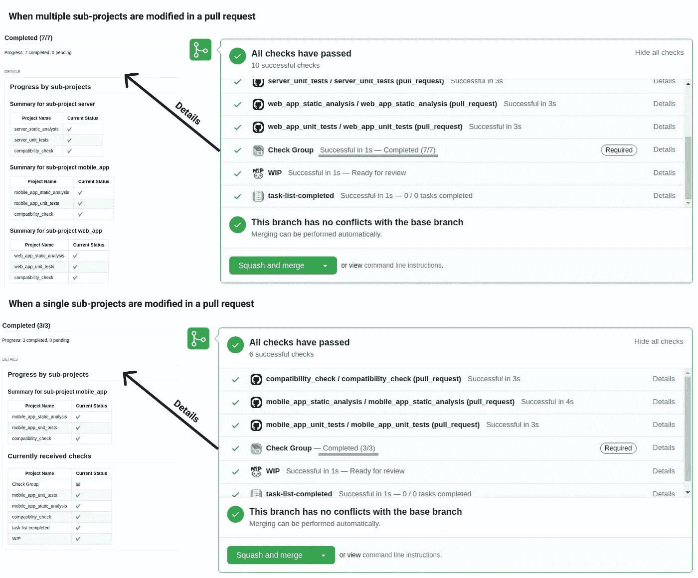

# Monorepo 项目的持续集成设置

> 原文：<https://betterprogramming.pub/a-continuous-integration-setup-for-monorepo-projects-c5cf31866c9c>

## 更高的生产率和更少的等待时间

约翰·施诺布里奇在 [Unsplash](https://unsplash.com/s/photos/group?utm_source=unsplash&utm_medium=referral&utm_content=creditCopyText) 上拍摄的照片。

# 直到 2020 年，建立 Monorepo 都很困难

Monorepo 指的是将所有子项目放在一个存储库中的策略。相比之下，使用 polyrepo，每个子项目都有自己的存储库。

Monorepo 带来了许多好处，包括更好的协作和分担责任。有许多有趣的文章讨论了 monorepo 的利弊。我最喜欢的一个是 [Monorepo:请吧！](https://medium.com/@adamhjk/monorepo-please-do-3657e08a4b70)作者[GitHub Actions 的工作流语法](https://medium.com/u/9978525af468#onpushpull_requestpaths))。

GitHub 动作有一个独特的特性，让我们指定触发条件，包括文件路径。

例如，只有在推或拉请求中修改了`clients/app`目录中的任何文件时，才会执行以下工作流配置:

我们还可以定义多个触发路径，以防需要检查几个子项目是否兼容。

以下是实现这一目的的工作流配置示例:

应用程序、web 或服务器目录中的任何更改都会触发上面的工作流，以确保这三者兼容。

## 有选择地检查 CI 结果

在 GitHub 上有选择地验证 CI 结果证明是一个不小的问题，因为 QA 流程本身并不支持它。

GitHub 的原生 QA 方法是“受保护的分支”,它让存储库所有者为合并拉请求定义静态需求(对所有拉请求都一样),包括 CI 检查、代码审查等等。

它对 polyrepo 项目很有效，因为 polyrepo 项目中的所有事情都与项目本身有关，所以不管变更是什么，检查所有 CI 结果都是有意义的。

然而，对于包含多个相对独立的子项目的 monorepo 项目，总是检查完整的 CI 结果集是多余的。

要将动态组合的配置项结果列表转换为静态的配置项结果集，我们需要一个“填补”层来收集所需配置项的列表，并将它们组合成单个配置项结果(静态的)。

为了实现这一点，我们需要 GitHub integration、 [Check Group](https://github.com/marketplace/check-group) 的一点帮助，它让我们在子项目级别定义 CI 需求，并将它们组合成一个针对拉请求的 CI 检查。

将所有的需求整合成一个(有点像一个垫层)，然后我们可以配置“受保护的分支”规则，只依赖这个单一的组合 CI 检查。

要定义每个子项目的配置项要求，我们可以使用如下所示的配置文件:

有了这个配置，Check Group 现在将把所有的子项目需求合并成一个，如下所示:

现在我们有了一个 CI 设置，它可以基于子项目识别 CI 需求。

感谢您的阅读，祝您在下一个 monorepo 项目中愉快！