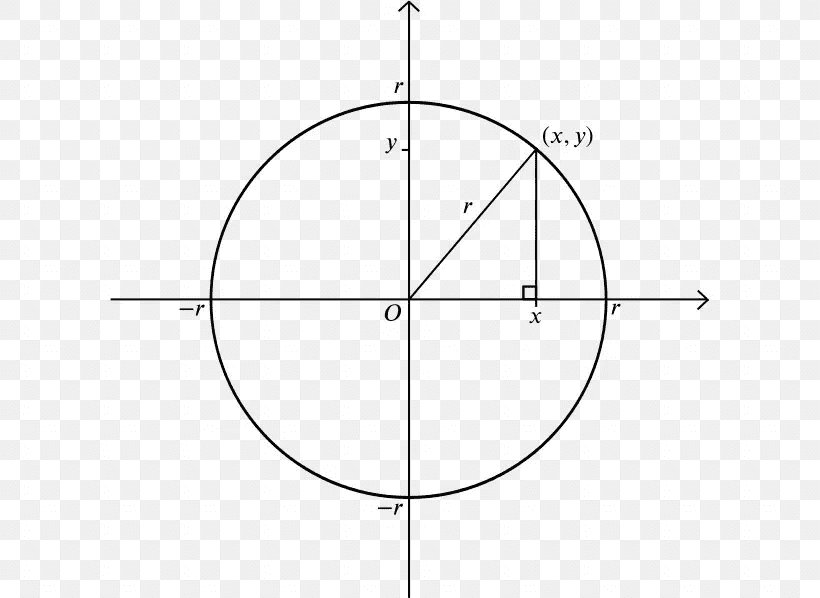
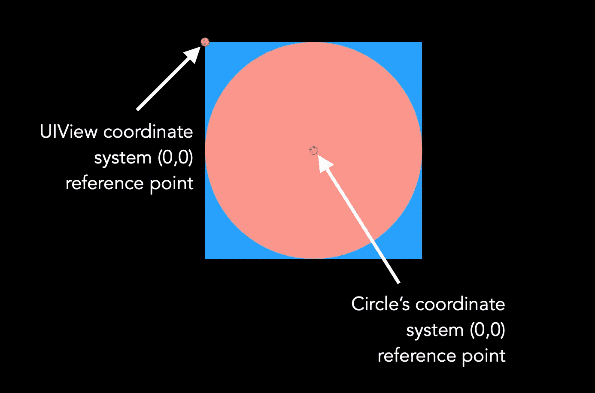
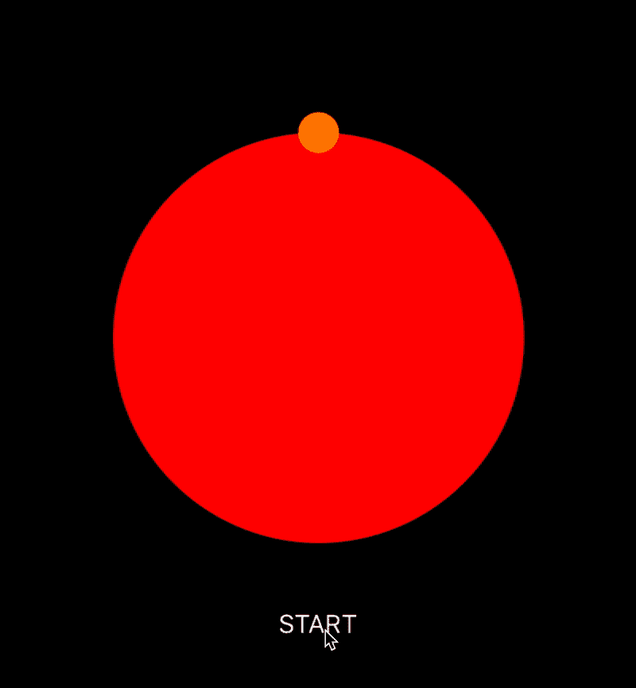

# 如何在 Swift 中添加一个很酷的圆周运动动画

> 原文：<https://betterprogramming.pub/a-cool-circular-motion-animation-in-swift-96add6fce98d>

## 使用 CAKeyframeAnimation 和 UIBezierPath

在大圆的边界上移动的小圆

你在上面看到的是我们将要一起建造的东西。

# 起始代码

下载下面的代码并跟随。代码包含一个简单的设置，故事板中有一个`UIView`和一个启动动画的按钮。

 [## akshitzaveri/CircleBorderAnimation

### 在 GitHub 上创建一个帐户，为 akshitzaveri/CircleBorderAnimation 的开发做出贡献。

github.com](https://github.com/akshitzaveri/CircleBorderAnimation/tree/8cfd3ed00994f20dc19850171248ad2269a7cb7b) 

# 我们将要做的事情的要点

我们将创建一个自定义的`UIView`类，它将负责显示这两个圆圈，并负责动画。然后，我们将使用相同的自定义`UIView`与故事板，当用户点击开始按钮，我们将运行动画。

# 创建自定义 UIView

让我们创建一个名为`AnimatableCircleView`的自定义`UIView`。我们将在全新的视图中添加最低限度的内容。注意，我们甚至还没有添加`init(frame:)`。那是因为我们不需要。此外，我们不打算使用`.xib`文件。它将全部是纯代码——相信我，你会喜欢它的！

AnimatableCircleView.swift

# 在 Main.storyboard 中更改类

1.  选择居中视图。
2.  在类字段中输入`AnimatableCircleView` 并按回车键。

# 在 ViewController 中更改类

替换以下行:

使用:

# 在我们的自定义视图中创建视图

在我们的`AnimatableCircleView.swift`中添加**下面的代码**。

如果你是第一次看到`lazy var`或者`UIView`的编程声明，不要害怕，这很简单。我们使用`lazy var` 和**`{}() block`**是因为我们希望代码在第一次被访问时运行，并且只运行一次。我们不希望每次访问 `circleView`时都创建一个新的`UIView`对象，不是吗？****

****如果您对`lazy var`有任何疑问，请点击下面的链接:****

**** [## Swift 中惰性 var 的优势是什么

### 感谢贡献一个堆栈溢出的答案！请务必回答问题。提供详细信息并分享…

stackoverflow.com](https://stackoverflow.com/a/40694805/2859764)**** 

# ****使视图呈圆形****

****在`AnimatableCircleView.swift`中添加以下代码。****

# ****添加视图****

****如果您现在运行项目，您将不会在屏幕上看到视图。这是因为我们还没有将它们添加到视图中。让我们在`setup()`中添加一些代码。****

****由于我们走的是编程路线，我们也必须添加约束。请注意，我们没有对`miniCircleView`的位置添加任何约束(前导、顶部、尾部、底部)。那是故意的。无论如何我们都要把它做成动画。****

****现在运行项目。你应该能看到两个圆圈。耶！成功了一半。****

# ****计算动画路径****

****在我们的`AnimatableCircleView.swift`中添加以下代码。****

## ****代码解释****

1.  ****它正在创造`UIBezierPath`。我们将预先计算出`miniCircleView`将要动画通过的整个路径，并将它存储在路径中。****
2.  ****它从动画应该开始的地方获取初始点。稍后，我们将看到`getPoint(for:)`的作用。****
3.  ****我们希望`miniCircleView`通过大圆的整个边界来产生动画效果，因此我们要通过 1 到 360 度。请注意，我们已经忽略了 0 度位置，因为我们已经在步骤 2 中用 0 度设置了一个初始点。****
4.  ****我们通过闭合路径，在路径的最后一条线(360 度)和初始点(0 度)之间建立连接。****
5.  ****我们要求`animate(view: path:)`函数为给定的预先计算的路径激活我们的视图。****

****很简单，不是吗？****

# ****getPoint(for:)在做什么？****

****先补充一下`getPoint(for:)`方法再讲。****

## ****代码解释****

1.  ****我们正在获取大圆的半径。****
2.  ****我们正在把角度从度数转换成弧度。****
3.  ****这是黄金部分。我们正在计算圆的边界上的点。如果你想了解背后的数学原理，那就看下面的视频吧。这很容易理解。****

# ****添加真实的动画****

## ****代码解释****

1.  ****我们正在创建`[CAKeyframeAnimation](https://developer.apple.com/documentation/quartzcore/cakeyframeanimation)`实例。****
2.  ****我们将告诉动画我们之前预计算的贝塞尔路径。****
3.  ****我们希望动画只运行一次。提示:如果你想永远运行它，那么使用`.greatestFiniteMagnitude`。****
4.  ****我们希望每个动画循环的持续时间为五秒钟。因此，如果我们有`repeatCount = 10`，那么我们的总持续时间将是 50 秒。****
5.  ****我们用一个键将动画添加到视图的层，这样我们以后就可以获取动画并在需要时移除它。****

# ****开始播放动画****

****用以下代码更新我们的`ViewController`:****

****现在，运行项目并点击开始按钮。你发现什么问题了吗？迷你圈是动画，但它走上了错误的道路，不是我们想要的。让我们看看这是为什么。****

****如果你不能解决问题，那就继续读下去。问题在于`UIView`的坐标系和我们数学所基于的圆的坐标系。如下图所示，坐标系从中心开始，而我们的`UIView`的坐标系从左上方开始(下图二)****

********

****圆的坐标系****

********

****我们如何弥合这一差距？简单:我们将这两点之间的差加到我们在`getPoint(for:)`方法中进行的`centerX`、`centerY`计算中。根据上面的圆图，差值总是等于半径。因此，我们通过给每个计算增加一个半径来更新下面的代码。****

****现在运行项目，并点击开始按钮。您应该会看到它沿着正确的路径移动。万岁！但是你会注意到小圆圈是从右边开始的。如果我们想将初始位置设置为顶部呢？****

****这里我们要用一点小技巧。随着坐标系的差异增加，我们的虚拟 0 度圆向右侧移动。一个简单的技巧是从-90 度开始。然后，为了完成动画，我们将做 360–90 = 270 度。现在，将`startAnimating()`中的代码更新如下:****

****再次运行应用程序。它应该从顶部开始，并通过整个路径动画。****

# ****停止跳迷你圈****

****我们很接近了，快完成了。唯一烦躁的是动画结束后的迷你圈跳跃。我们可以通过设置小圆圈视图的初始位置来避免这一点，这也将解决应用程序运行时小圆圈位于(0，0)位置的问题。****

****将下面的代码添加到`AnimatableCircleView.swift`的`layoutSubviews()`中。****

****如果你再次运行这个项目，你应该能够看到我们为之努力的完美动画。****

********

****最终输出****

# ****下载最终代码****

****你可以从 GitHub 下载[最终代码](https://github.com/akshitzaveri/CircleBorderAnimation)。****

****感谢您的阅读。如果你知道一个更好的方法来实现同样的动画，或者你认为如果代码可以改进，那么请不要犹豫，取得联系。****