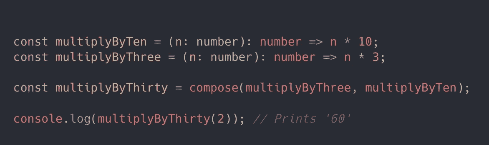
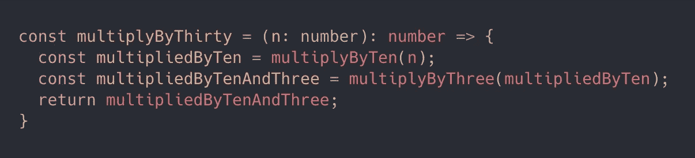
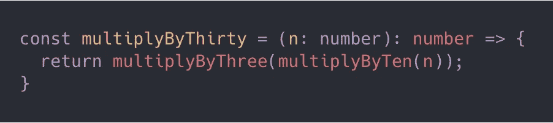
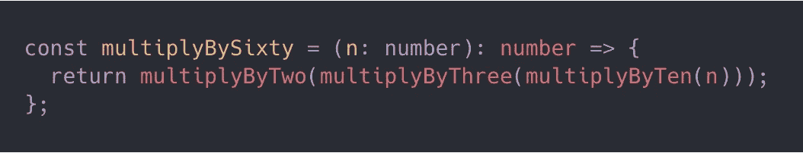
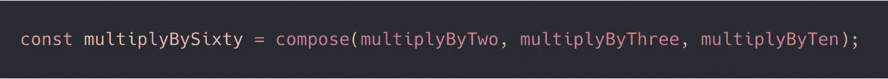
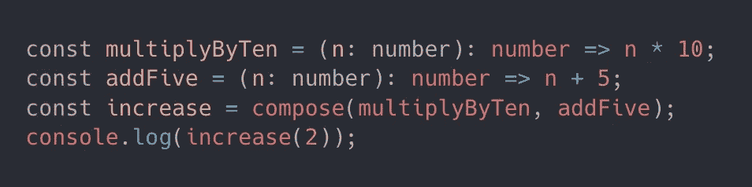
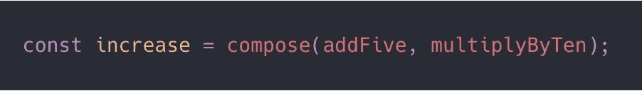

# 编写函数的速成课程

> 原文：<https://betterprogramming.pub/a-crash-course-in-composing-functions-4c5884ca963e>

## TypeScript 中的函数编程

照片由[瑞安·昆塔尔](https://unsplash.com/@ryanquintal?utm_source=medium&utm_medium=referral)在 [Unsplash](https://unsplash.com?utm_source=medium&utm_medium=referral) 上拍摄

组合是函数式编程的基本概念之一。组合函数的想法很简单:我们只是将两个或更多的函数组合成一个。但是当这个概念被有效地使用时，它可以极大地降低我们代码的复杂性，甚至使它变得更容易理解。

下面是一个简单的例子(在 TypeScript 中):

让我们深入了解一下这里发生了什么。

我们有自己的`multiplyByTen`和`multiplyByThree`函数，这两个函数完全按照它们所说的那样工作:接受一个数，并分别返回这个数和十或三的商。函数`multiplyByThirty`也完全按照它所说的去做，但是它首先把它的参数传递给`multiplyByTen`。然后它接受这个结果，并用它调用`multiplyByThree`。编写相同函数的另一种方法如下:

或者你可以这样写:

第二个示例的返回值可能类似于您在以前使用过的代码中看到的内容。我们只想将一个函数的结果作为另一个函数的参数传递。在这种情况下，尽管不是最好看的代码，它仍然是相当可读的。但是如果我们想把结果传递给另一个函数呢？

这开始有点恶心了。我们通过圆括号解析来读取我们的函数名，对于每个函数，我们必须确保在我们的堆的最后有一个完全匹配的圆括号。这是`compose`真正闪光的地方，尤其是当我们有两三个以上的函数放在一起的时候。

好多了！这里的括号清楚地列出了我们正在采取的行动。我们的`compose`功能不限于两个功能。我们可以一起传递任意多的函数。

# 执行次序

关于`compose`有一件事一开始可能会令人困惑，那就是函数被调用的顺序。到目前为止，我们只编写了执行顺序无关紧要的函数(感谢可交换性！)，但是让我们来看一个例子，情况并非如此。

对于我们的新函数，执行顺序现在很重要。(2 + 5) * 10 给我们的结果和(2 * 10) + 5 *不一样。*那么`increase(2)`评估什么呢？我们的`compose`函数，以及大多数函数式编程库中的实现，将从右向左应用函数。所以，上面的代码将打印' 70 '。如果我们将`increase`改为如下所示，通过翻转参数，`increase(2)`现在将计算为 25:

# 应用组合

简单的数学例子对学习很有帮助，但这并不是我们感兴趣的全部。现在我们已经对函数组合的工作原理有了基本的了解，那么我们如何将它应用到非平凡的代码中呢？

上例中最明显的应用是将一个函数的结果直接输入到另一个函数中。它也是一个很好的工具，可以将现有的功能分解成更容易理解的东西。

如果我正在编写一个函数，我感到有一种强烈的冲动，要在函数的各个部分之间放置空格，以便将感觉像是它们自己的操作的行组合起来，或者我只是一般地感到有很多事情正在进行，这是一个迹象，表明我应该提取一些函数。这使得代码更容易阅读和维护。

我们可以将这些操作分解成它们自己的功能，为了清楚起见，使用它们自己的签名和名称，然后将它们组合在一起。较小的函数成为我们整体逻辑的易读配方中的成分。

这对单参数函数非常有用。但是当函数有多个参数时会发生什么呢？我们必须在组合函数之间传递元组或上下文对象吗？没有。这个问题是用*奉承*的概念来解决的，我打算很快写出来。通过结合这些概念，我们可以开始有一个更实用的方法来构建应用程序。

# 尝试

如果你是函数式编程的新手，想尝试在你的代码中编写函数，有很多不同的库可以用于像`compose`这样的实用程序。我一直在我的项目中使用 Ramda 和 Lodash 的组合。Lodash 甚至为`lodash/fp`下的功能实用程序提供了[定制版本](https://lodash.com/custom-builds)。

感谢阅读！