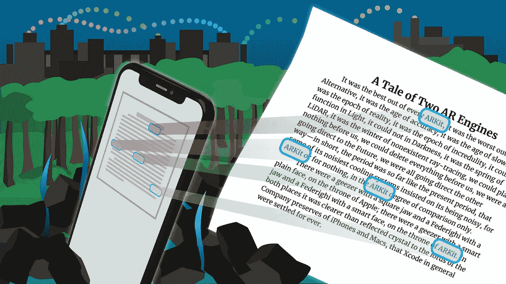
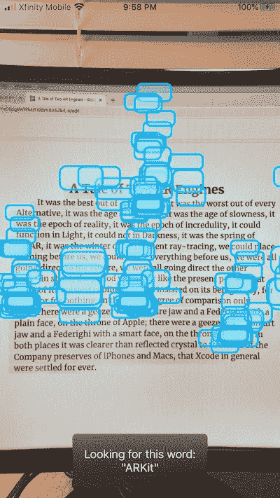
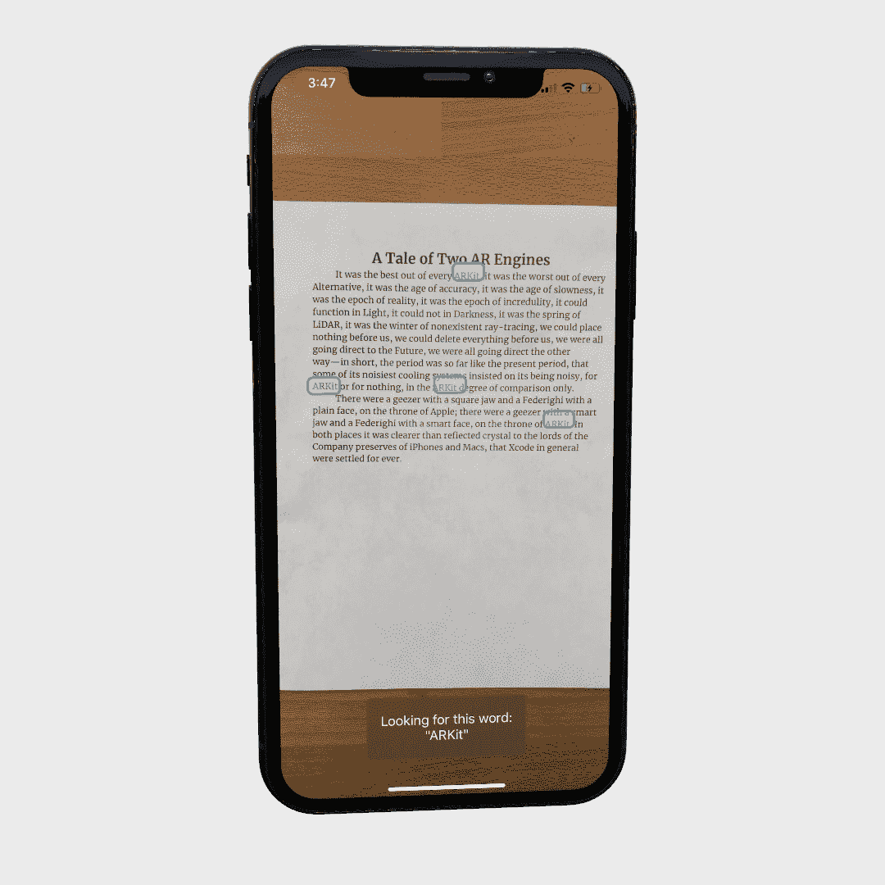
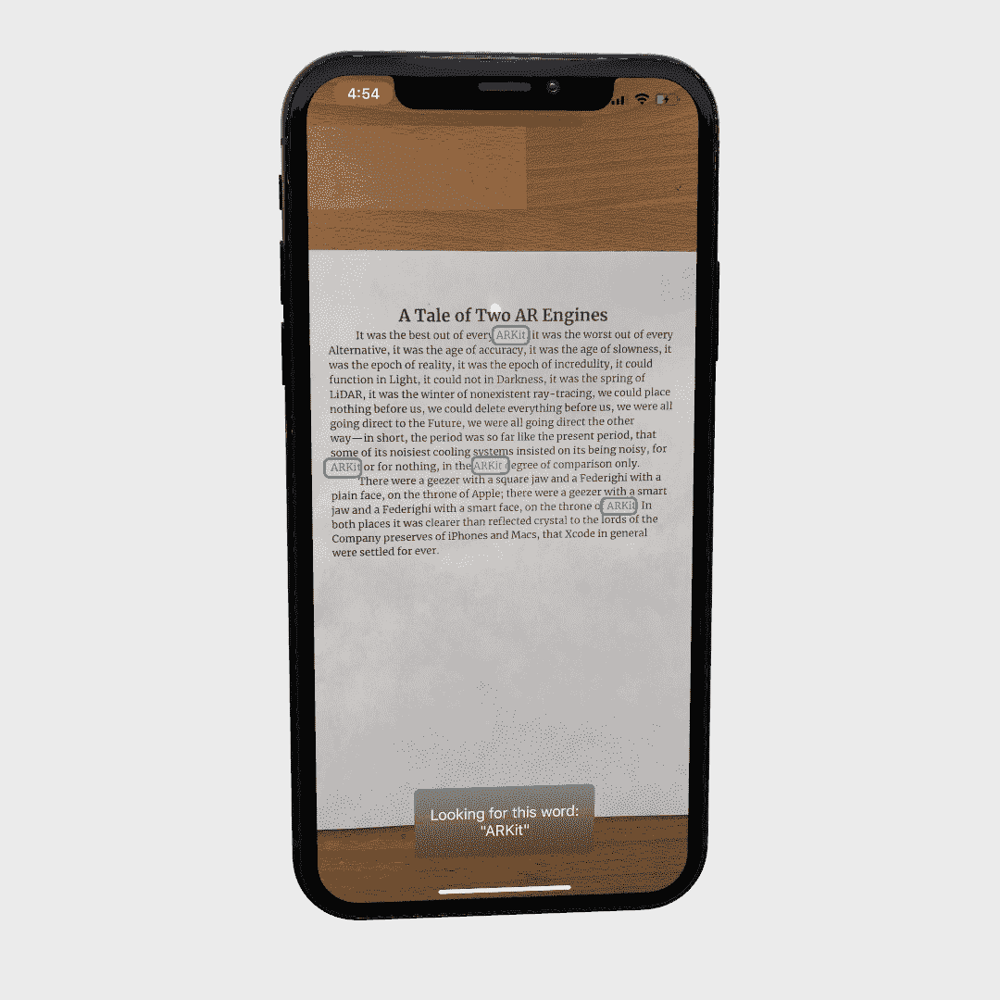
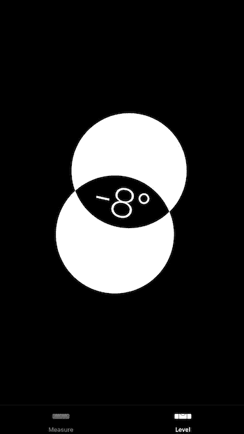
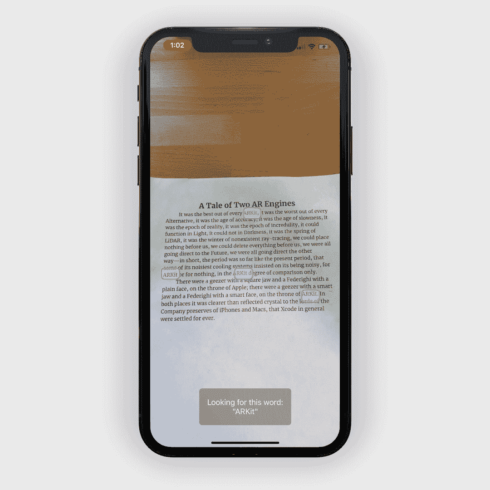

# ARKit 的定制替代方案

> 原文：<https://betterprogramming.pub/a-custom-alternative-to-arkit-c07961a38d2a>

## 如果 ARKit 不适合你，为什么不自己制作呢？



图片来源:作者

嘿！在我开始之前，我想指出，我的选择绝不是高度抛光，极其准确，非常现实的 [ARKit](https://developer.apple.com/documentation/arkit) 的替代品。它甚至不能与之相提并论——完全不能——而且在前提条件方面有很大的限制。它也仅用于放置 2D 对象，并且需要尽可能频繁地提供对象的位置。

然而，我的替代方案*是*，一个非常快速、高效、不占用内存的程序，是我的[应用](https://apps.apple.com/app/find-command-f-for-camera/id1506500202)的支柱。它非常简单，您可以根据自己的需求轻松定制。感兴趣吗？请继续阅读…

我们会做什么！

# 一些背景信息

在我的应用程序中，主要功能是使用手机摄像头查找文本的能力。界面很简单——屏幕顶部的一个文本字段、一些按钮和一个摄像头视图。

为了查找文本，我在相机视图上大约每秒执行一次苹果的`VNRecognizeTextRequest` OCR，这将返回一组`VNRecognizedText`对象。这些`VNRecognizedText`对象包括找到的文本的边框和文本本身。然后，我遍历这个数组，检查它们是否与用户在文本字段中输入的文本相匹配。**如果找到任何匹配，该应用程序应该在现实世界中放置一个“突出显示”。**

那么我如何在现实世界中放置东西呢？这正是增强现实所做的。

当我第一次开始制作我的应用程序时，ARKit 的`ARWorldTrackingConfiguration`听起来是个好主意——有很多教程可用，它让你在现实中放置模型，这正是我想要的。你甚至可以绕着它走，晃动相机，这个模型看起来会粘在它所在的任何表面上。

所以我试了一下——但是速度太慢了。非常慢。用户需要挥动手机大约五秒钟，直到 ARKit 可以检测到一架飞机(你放置物体的地方)。我的应用程序完全是为了提高效率——它在现实世界中寻找文本，为你节省时间——但如果它花了 5 秒钟来初始化，那对你一点帮助也没有。

当然，现在激光雷达出来了，ARKit 快多了——但是激光雷达只适用于新的 iPad Pro 和 iPhone 12(贵！).不幸的是，我的钱包也没了——没钱了。

但是撇开速度不谈，更糟糕的是它并不总是准确的。为了放置我的立方体，我使用了 [*点击测试*](https://codelabs.developers.google.com/codelabs/ar-with-webxr/#4) 。因为`VNRecognizedText`给了我检测到的文本的边界框(如 2D xy 坐标和大小，相对于设备屏幕，原点在左上角)，我使用点击测试将 2D 坐标转换成现实生活中的 3D。但有时，2D 坐标不会“击中”任何检测到的飞机，导致击中测试失败。

因此，我尝试了寻找图像而不是平面的`ARImageTrackingConfiguration`，而不是`ARWorldTrackingConfiguration`。你给 ARKit 一些图像，配置扫描现实世界。但这很容易出错，因为我需要动态更新参考图像，根据调试控制台的说法，其中许多图像“没有足够的对比度”或“太小”。结果，我的应用程序一直死机，变得无法使用。

然后我研究了 ARKit 的其他配置，剩下的唯一有希望的选项是`AROrientationTrackingConfiguration`。我试了一下——而且很快。几乎成功了。但是它几乎没有被记录，当我试图控制我的立方体在世界上的位置时，我不知道如何去做。我不能把点转换成米，我不能左右移动立方体，我不知道要移动多少。

最后，我意识到苹果的 ARKit 对我的应用程序来说太过了。它是为放置复杂的 3D 模型而设计的，而不是 2D 矩形。它使用了超过 300 兆字节的内存。加载时间太长。要是 ARKit 更聪明，能够根据模型的复杂性进行自我调整就好了。也许那会在未来到来。

所以我决定打造自己的 AR 引擎。一个是为处理简单的 2D 模型而设计的。子弹上膛很快的子弹。一个如此简单的东西，它甚至真的不是一个引擎。

# 本文的目标

到本文结束时，我们将制作一个应用程序:

1.  使用相机搜索单词“ARKit”
2.  在任何找到的匹配项上放置一个 2D 矩形
3.  根据加速器和陀螺仪数据调整矩形的位置，消除设备抖动

基本上，我们将创建一个使用相机执行 Command+F (Mac > PC)的应用程序，并突出显示所有匹配。这是另一个视频:

所以让我们开始吧！首先，你应该打印出我写的这个测试器文档(即使你不打印它，它也会工作得很好，但如果你打印它，就不会有眩光或[莫尔条纹](https://en.wikipedia.org/wiki/Moir%C3%A9_pattern))。这是对查尔斯·狄更斯《双城记》的滑稽模仿。

链接到[样本文本](https://drive.google.com/file/d/1RpJsl_NucRn9gncbHLTVF77kJ1IYmuqs/view?usp=sharing)

还有， [**这里是启动项目**](https://github.com/aheze/AlternativeARKit/tree/master/StarterProject) 。到目前为止，我已经设置了摄像头和 Vision 的`VNRecognizeTextRequest`来尽可能频繁地查找文本，通常大约是每秒一次。

## 我会很快检查一下视力

在 starter 项目中，首先，我们制作一个`VNRecognizeTextRequest` (VisionFiles → `VisionOCR.swift`),并用完成处理程序初始化它。当 Vision 完成扫描时，这个处理程序被调用，它返回给我们一个`VNRecognizedText`对象，其中包含检测到的文本及其边界框。

值得注意的是`VNRecognizedText`返回多个单词，比如一个句子。我很确定它尽可能多地将单词串在一起，但是对于本文，我们对句子不感兴趣。相反，一个`if`语句检查`VNRecognizedText`以查看它是否包含单词 *ARKit* 。如果是这样，我有一个方便的函数返回数组中所有出现的 ARKit 及其索引。

遍历该数组，我们打印出它的边界框以及它所在的句子，如下所示:

```
"throne of ARKit" | Position: x: 35, y: 68, width: 68, height: 9
```

我已经做了一些转换——通常，边界框由左上角、右上角、右下角和左下角组成。它们被写成一个百分比(比如设备屏幕高度的 0.3339873485394%)，原点在左下方。

## 所以第一步已经完成了！现在回到增强现实

现在我们已经得到了匹配文本的 2D 坐标，我们想要**在它上面放置一个 2D 矩形**。这将是一个`UIView`。我将这个矩形称为 highlightComponent。

所以我们想在“现实生活”中放置一个 2D 矩形真的，比听起来容易多了。转到 VisionFiles → `ARFunctions.swift`。您将看到一个名为`placeHighlights(atTheseLocations rectangles: [CGRect])`的空函数。替换为以下内容:

在上面的代码中，`CGRect`数组由匹配文本的边界框组成。这将是我们从`VNRecognizedText`中得到的。我们将遍历该数组，每次执行以下操作:

1.  创建新的`UIView`
2.  创建新的`CAShapeLayer`
3.  在`CAShapeLayer`中画一个矩形
4.  将其添加到新的`UIView`
5.  添加新的`UIView`作为`drawingView`(也是`UIView`)的子视图

但是在我们进行任何循环之前，我们首先需要移除所有现存的`drawingView`子视图，这样类似的事情就不会发生了:



哎呀…

现在，回到`VisionOCR.swift`，我们将需要实际调用这个函数！首先，做一个新的`CGRects`数组。

并将 print 语句替换为:

每当我们找到一个匹配，我们把它附加到 CGRect 数组

…然后最后用`CGRect`数组调用函数。

构建并运行应用程序，然后将您的手机悬停在 tester 文档上。到目前为止，我们对 ar 有了一个像样的错觉，第二步已经完成了一半！应用程序应该是这样的:



到目前为止，一切顺利！

然而，高亮组件淡入淡出，有点快——这没关系，但现在我们将制作动画！

# 重用旧的高光并制作动画

它是这样工作的:我们将制作一个包含前面的 highlight 组件的`UIView`数组。

```
/// In ViewController.swift, add this:var previousHighlightComponents = [UIView]()
```

在每次视觉扫描后，我们不会淡出任何现有的 highlight 组件，而是首先在`previousHighlightComponents`上**循环，并检查任何现有的(先前的)highlight 组件与当前 highlight 组件的距离是否小于 15 点。是的，15 分是一个神奇的数字，但有时你必须成为一名巫师！**

>如果有一个距离小于 15 磅，我们不会添加一个新的 highlightComponent，而是将旧的组件重用并动画到新组件的位置。

如果没有，我们就淡入新的。

将`placeHighlights(atTheseLocations:)`替换为:

现在构建并再次运行应用程序。这种错觉会更加真实，因为我们是在制作动画而不是渐变。**步骤 2 现已全部完成。**这是应用程序的外观:



好多了！

现在，还记得`AROrientationTrackingConfiguration`，那个几乎对我有效的选项吗？实际上，它所做的只是获取设备的加速度计数据。我们可以使用`CMMotionManager`轻松做到这一点。

# 使用加速度计和陀螺仪消除手抖

苹果已经为我们做了很多工作，很容易就能知道设备的方位。设备的偏航/俯仰/滚动值是可用的，但是我们只对俯仰和滚动感兴趣(比如向前/向后和向左/向右倾斜设备)。

你可能已经在苹果的 Measure 应用程序(或 iOS 13 之前的 Compass)中遇到过`CMMotionManager`:



很酷的设计，对吧？

但无论如何，我们将使用核心运动来稳定我们的高光，以防设备抖动太多。让我们首先将这一行添加到`ViewController.swift`和`ARFunctions.swift`的顶部:

```
**import** CoreMotion
```

这将导入`CoreMotion`框架，以便我们可以实际使用它。然后，回到`ViewController.swift`，添加一个新的`CMMotionManager`对象和一些属性:

然后我们将在`viewDidLoad`中设置运动管理器:

然后我们将覆盖`viewDidLayoutSubviews()`并获得当前的态度。

那么`attitude`是什么，为什么要放在`viewDidLayoutSubviews()`里？非常简单:`attitude`是一个包含设备相对于参考框架的方向的类。每隔 0.03 秒，我们将比较设备的当前姿态和初始姿态，以查看设备旋转的方向。

该初始参考帧将由`viewDidLayoutSubviews()`中的`initialAttitude`设置，因为当设备完成 UI 布局时会调用`viewDidLayoutSubviews()`——这通常也是设备的姿态首次可用的时候。

现在，我们需要创建每 0.03 秒调用一次的函数。

将此复制到 VisionFiles → `ARFunctions.swift`，在`placeHighlights(atTheseLocations rectangles: [CGRect])`上方:

构建并运行。摇动设备，但不要太多！考虑到设备抖动，高光会稍微移动！**第三步完成，app 也完成了。**



很酷，对吧？

这是完成的应用程序的[源代码](https://github.com/aheze/AlternativeARKit/tree/master/FinishedProject/AlternativeARKit)。

# 总结

到目前为止，你已经有了一个应用程序，它可以找到文本，然后在它上面放置一个高亮显示。如果你轻轻摇晃手机，高光将会调整以抵消抖动(当然，不要过度摇晃手机，否则 Vision 将无法执行 OCR)！

与 ARKit 不同，这个程序只能放置 2D 物体，并需要不断更新的数据源——例如，视觉每半秒扫描一次——所以它也需要相当多的前提条件。

然而，它的使用案例没有任何限制。以下是一些开始:

*   二维码扫描仪，显示检测到的二维码周围的框架(苹果在相机应用程序中实现了这一功能)
*   像谷歌翻译的即时相机翻译的文本翻译
*   对象检测器，在检测到的对象周围绘制一个框架

总之，几乎所有这些代码都来自我的应用程序 Find！如果你想下载，这里有:

[](https://apps.apple.com/app/find-command-f-for-camera/id1506500202) [## 查找:相机的 Command+F

### 使用手机摄像头，同时查找单个单词甚至多个单词。

apps.apple.com](https://apps.apple.com/app/find-command-f-for-camera/id1506500202) 

如果你对 Vision 和 ARKit 感兴趣，这里有一些链接可供进一步阅读:

[](https://bendodson.com/weblog/2019/06/11/detecting-text-with-vnrecognizetextrequest-in-ios-13/) [## 在 iOS 13 中使用 VNRecognizeTextRequest 检测文本

### 在 2017 年 WWDC 上，苹果在 iOS 11 的同时推出了 Vision 框架。Vision 旨在帮助开发人员分类…

bendodson.com](https://bendodson.com/weblog/2019/06/11/detecting-text-with-vnrecognizetextrequest-in-ios-13/) [](https://nshipster.com/cmdevicemotion/) [## CMDeviceMotion

### 在每部 iPhone 的光滑玻璃下，一组传感器坐落在逻辑板上，发送稳定的…

nshipster.com](https://nshipster.com/cmdevicemotion/) 

感谢阅读！编码快乐！