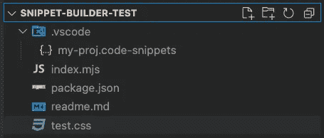
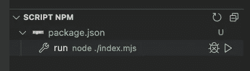
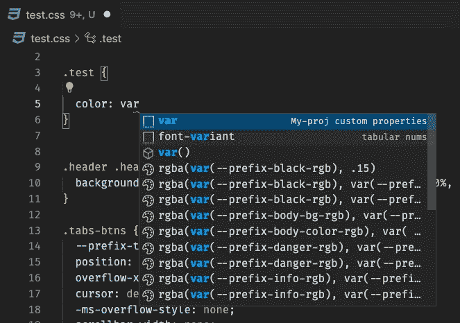
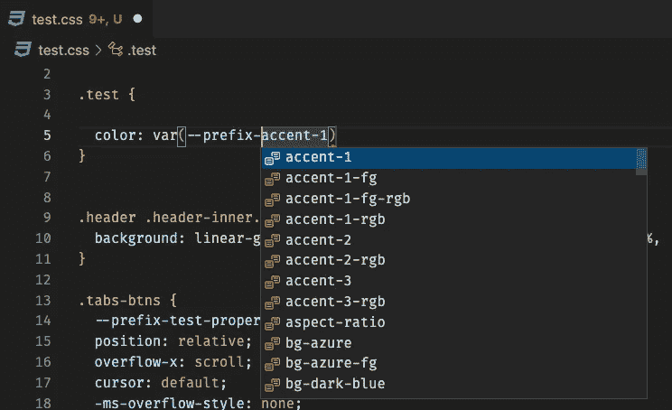

# VS 代码的自定义属性代码段生成器

> 原文：<https://betterprogramming.pub/a-custom-properties-snippet-builder-for-vscode-e6f415f2ccd7>

## 如何编写一个小节点脚本来生成一个包含所有项目 css 自定义属性的 VSCode 片段


照片由 [Pankaj Patel](https://unsplash.com/@pankajpatel?utm_source=medium&utm_medium=referral) 在 [Unsplash](https://unsplash.com?utm_source=medium&utm_medium=referral) 上拍摄

很长一段时间以来，我越来越广泛地使用 [CSS 自定义属性](https://developer.mozilla.org/en-US/docs/Web/CSS/--*)，当处理许多较大的项目时，很难记住它们。

我使用 VSCode 进行编码，有一些 Intellisense 插件非常有用，但有时，出于某些原因，它们不能像我预期的那样工作。

为了解决这个问题，我决定创建一个小脚本，它可以从我的文件中提取 CSS 属性列表，然后完全自动地生成一个 [VSCode 片段](https://code.visualstudio.com/docs/editor/userdefinedsnippets)。

这是一个相当原始的解决方案，但它做的工作。希望对某个人有用。

# 设置

该脚本是基于节点的，所以第一步是[安装它](https://nodejs.org/it/download/)如果你以前从未这样做过。

然后，在 VSCode 中打开一个项目文件夹，如果需要的话创建一个`[package.json](https://docs.npmjs.com/cli/v8/commands/npm-init)` [文件](https://docs.npmjs.com/cli/v8/commands/npm-init)，确保它至少包含一个 css 文件(下面例子中的`test.css`)。

此时，您必须创建您的项目片段文件。有两种方法可以做到这一点:

1.  手动创建一个`.vscode`文件夹和一个仅包含空括号的`.code-snippets`文件(在我的例子中，我将其命名为`my-proj.code-snippets`)。
2.  遵循 [VSCode 片段帮助页面](https://code.visualstudio.com/docs/editor/userdefinedsnippets#_create-your-own-snippets)上的说明。



VSCode 文件资源管理器中的项目文件

现在，您必须添加代码片段(除了我们稍后将生成的部分):

```
{
  "My-proj custom properties": {
    "scope": "scss,css",
    "prefix": [
      "var",
      "--prefix"
    ],
    "body": [],
    "description": "custom properties list - NB this is a script-generated snippet"
  }
}
```

代码片段 keyname ( `My-proj custom properties"`)将用于更新它，如果您更改它，您还需要更新脚本。

脚本将更新`body`元素，您可以随意定制代码片段的其余部分。

> 如果您需要帮助来构建代码片段，这个[生成器](https://snippet-generator.app/)可以帮助您

# 剧本

我们的脚本必须执行这些操作:

*   读取一些 css 文件的内容
*   搜索自定义属性字符串并提取它们
*   删除重复项并排序
*   更新代码段文件

> 我首先尝试解析 css 文件来执行更精确的提取，但是这大大增加了脚本的复杂性。最后，对我来说，对 CSS 字符串的简单处理就足以达到预期的目标了。

开始在您的项目中创建一个`index.mjs`(或者您喜欢的名称)文件。因为我们将使用 ES6 modules 语法，所以在您将一个值为 module 的顶级字段类型添加到您的`package.json`之前，`.mjs`扩展是必需的(参见节点文档中的 [ECMAScript Modules](https://nodejs.org/docs/latest-v16.x/api/esm.html#modules-ecmascript-modules) )。

将以下代码复制到文件中:

```
/* eslint-env node */
/* eslint-disable no-console */

import * as fs from 'fs';

const sources = [
    './test.css'
  ],
  snippet_file = './.vscode/my-proj.code-snippets',
  snippet_key = 'My-proj custom properties',
  custom_var_prefix = 'prefix-';

let custom_properties = [];

sources.forEach(css_file => {
  let css_content = fs.readFileSync(css_file).toString();

  const regex = new RegExp(`--${custom_var_prefix}[a-zA-Z0-9._-]*?: ?(.*?)[;}]`, 'gi'),
    this_cust_props = css_content.match(regex);

  custom_properties = custom_properties.concat(this_cust_props);
});

// delete end `}` from compressed files
custom_properties = custom_properties.map(item => item.replace(/}$/, ';'));

custom_properties = custom_properties.map(item => item.split(':')[0].trim());
custom_properties.sort();
custom_properties = [...new Set(custom_properties)];

let vscode_snippet_body = `var(--${custom_var_prefix}\${1|` +
  custom_properties.reduce((result,item) => `${result},${item}`).replaceAll(`--${custom_var_prefix}`, '') +
  '|})$0';

// VSCODE snippets reading and update
let snippets = JSON.parse(fs.readFileSync(snippet_file).toString());

if(snippets[snippet_key]) {
  snippets[snippet_key].body = [vscode_snippet_body];
  fs.writeFileSync(snippet_file, JSON.stringify(snippets, null, '  '));

  console.log('*** end ***'); 

} else {
  console.error(`******ERROR\n'${snippet_key}' snippet doesn't exist\n************`);
}
```

首先，我们导入节点*文件系统*模块(`fs`，我们将使用它来读取 css 文件并写入更新的代码片段文件。

然后你需要设置一些常量:

```
const sources = [
    './test.css'
  ],
  snippet_file = './.vscode/my-proj.code-snippets',
  snippet_key = 'My-proj custom properties',
  custom_var_prefix = 'prefix-';

let custom_properties = [];
```

*   `sources`是要解析的 css 文件的数组，路径是相对于项目根的
*   `snippet_file`:代码片段文件路径
*   `snippet_key`:要更新的代码片段的 keyname
*   `custom_var_prefix`:所有自定义属性名称共享的可选前缀。一些框架(例如 [Bootstrap](https://getbootstrap.com/docs/5.1/customize/css-variables/) )使用它来避免冲突。不需要的话就设置成空字符串(`''`)。

此外，初始化`custom_properties`数组。

此时，每个 css 文件都被打开，一个简单的正则表达式搜索所有定制属性字符串，所有匹配都被添加到`custom_properties`数组中，(注意，RegExp 也搜索定制属性值:这是对任何未来增强的一个补充，但目前不使用)。

我们的`custom_properties`数组现在可以处理了:

```
custom_properties = custom_properties.map(item => item.split(':')[0].trim());
custom_properties.sort();
custom_properties = [...new Set(custom_properties)];
let vscode_snippet_body = `var(--${custom_var_prefix}\${1|` +
  custom_properties.reduce((result,item) => `${result},${item}`)
    .replaceAll(`--${custom_var_prefix}`, '') + '|})$0';
```

*   `map`功能用于移除数值部分
*   使用`Set`对生成的数组进行排序并移除重复项
*   片段`body`字段内容是使用`reduce`函数作为[选择字符串](https://code.visualstudio.com/docs/editor/userdefinedsnippets#_choice)生成的。

现在我们可以打开代码片段文件(再次使用`fs`，JSON 被解析。

> 实际上，VSCode Snippets 文档不是 JSON 文件，而是 JSON-C(带注释的 JSON)。这意味着如果有任何注释，在处理文件时将会抛出一个错误。您必须手动删除文件中的所有注释，或者实现一个注释保存解析器，比如 [comment-json](https://www.npmjs.com/package/comment-json)

为了完成这项工作，我们只需要更新`body`字段并保存代码片段文件。

请注意，文件中的任何其他代码片段都不会更改。

最后，我们可以在终端中运行我们的脚本:

```
node index.mjs
```

您也可以将它添加到您的`package.json`文件中，并通过 VSCode 中的`Script Npm`面板(或从命令面板)运行它:

```
{
  "scripts": {
    "run": "node ./index.mjs"
  }
}
```



“编写国家预防机制脚本”小组

现在，在编辑`css`或`scss`文件时，键入`var`或`--prefix`(如代码片段的`prefix`字段中所设置的)，您将能够访问您所有的定制属性列表:



当然，每次编辑 CSS 时你都必须运行脚本，但是操作非常快，一旦定义了 CSS，你可能就不需要经常这么做了…

[*我的所有出版物*](https://medium.com/@massimo.cassandro/my-dev-publications-eacf6727e4a)