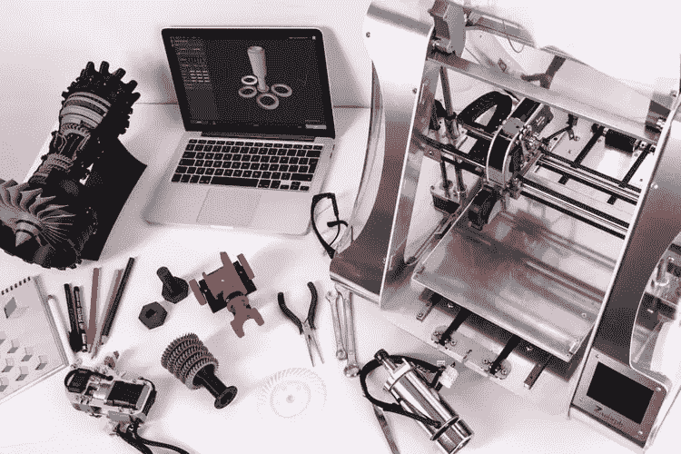
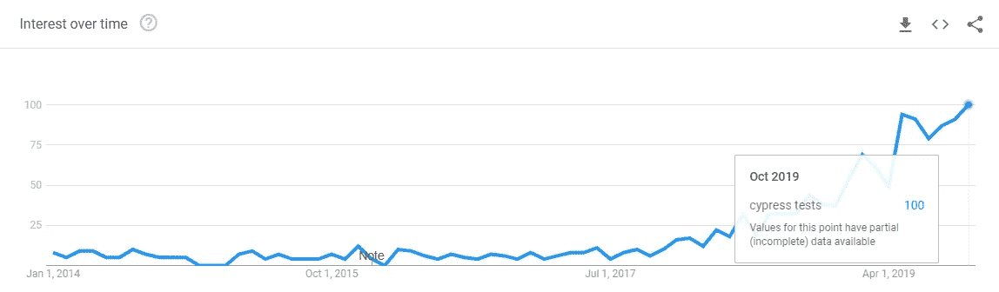
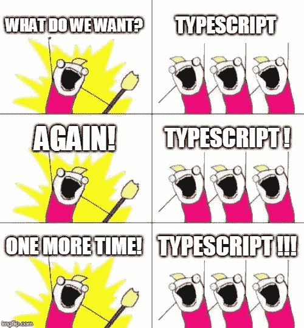
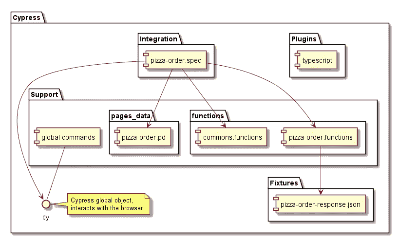
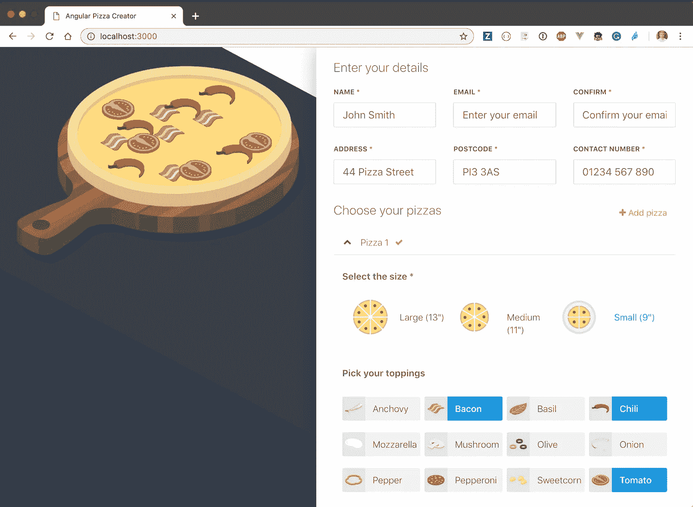
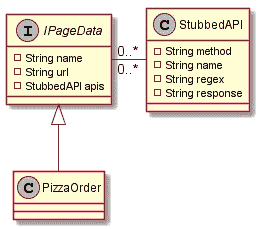

# Cypress 开发人员的备忘单

> 原文：<https://betterprogramming.pub/a-cypress-developers-cheat-sheet-47d6023c3b56>

## 关于如何设计和建立一个干净和可重复使用的柏树包装结构的注意事项和想法

由 [Unsplash](https://unsplash.com/photos/p1m4B-lhS9Y) 上的[zmorpho3d](https://unsplash.com/@zmorph3d)拍摄的照片

对于那些想要另一篇文章说柏树会杀硒的人来说，这不是这篇文章的意图。相反，我们的想法是分享在一个复杂的 web 应用程序上使用 Cypress 的经验，并展示一个非常适合这个场景的包结构。

首先，让我们通过在 Google Trends 上快速搜索 Cypress tests 关键字来了解 Cypress 的发展方向:

来自[谷歌趋势](https://trends.google.com/trends/explore?date=2014-01-01%202019-10-12&q=cypress%20tests)

我们可以看到，自从 2014 年创建 Cypress 以来，在 2017 年公开测试后，围绕它的兴趣暴涨。

同样是 2019 年 4 月，在 Thoughtworks [科技雷达](https://www.thoughtworks.com/radar/tools/cypress)上推广采用**，说明赛普拉斯前进的方向确实是一片光明。**

[比利·帕斯科](https://unsplash.com/@billy_pasco)在 [Unsplash](https://unsplash.com/photos/se3tHNszbkM) 拍摄的背景照片

# 页面对象

当我们开始用 Cypress 编写测试时，第一个被提到桌面上的讨论是一个经典的问题:是否使用页面对象？赛普拉斯的人对此有自己的看法:[我可以使用页面对象模式](https://docs.cypress.io/faq/questions/using-cypress-faq.html#Can-I-use-the-Page-Object-pattern):“页面对象模式”应该被重新命名为:“使用函数和创建定制命令”。

*所以我们将在文章中采取这个方向:*

**

*创建于 [imgflip](https://imgflip.com)*

# *以打字打的文件*

*第二个讨论归结为:我们应该使用 TypeScript 吗？*

**

*创建于 [imgflip](https://imgflip.com)*

*这有时是个人观点的问题。我通常的做法是问两个问题:*

1.  *我们计划测试的应用程序复杂吗？10+ UI(或 UI 中的状态)、10+ API 调用、10+组件等。*
2.  *会写代码的工程师对 TypeScript 熟悉吗？*

*如果你对这两个问题中的任何一个回答是肯定的，那么你很可能想接受它；否则，不要过度工程化。*

**

*复杂的工程桥梁。照片由 [Aditya Chinchure](https://unsplash.com/@adityachinchure) 在 [Unsplash](https://unsplash.com/photos/FRrI46igcqs) 上拍摄*

*只需选择更适合您的用例，要么标准化您的代码库，要么具有更大的灵活性。如果你用 TypeScript，用 Cypress 设置它实际上真的很容易。*

*在这种情况下，我们选择了标准化。如果想要配置 TypeScript 的步骤，请遵循 [Cypress 官方指南](https://docs.cypress.io/guides/tooling/typescript-support.html#Types-for-custom-comma)。*

# *干净的包装结构*

*提议的文件夹和文件如下所示:*

**

*柏木清洁包装结构*

*`integration`、`support`、`plugins`和`fixtures`文件夹从装有柏树的盒子里出来。在我们的例子中，新的结构是`pages_data`和`functions`文件夹。它们将扮演众所周知的页面对象的角色。*

*你注意到上图中的披萨这个词了吗？这是因为我们将使用 Angular Pizza Creator 应用程序。*

**

*Angular Pizza Creator 应用程序—来自 [cypress-repo-fork](https://github.com/mesmacosta/angular-pizza-creator)*

*人人都爱披萨，对吧？*

*让我们回到包结构的解释。*

## ***页面 _ 数据***

*这里的想法是不要将它与页面对象的经典实现混淆，但是您实际上可以将其命名为任何名称。让我们看一些代码来更好地理解这个类角色:*

*我们主要用它来存储页面元素选择器，但是您注意到 APIs 属性了吗？*

*Cypress 有一个惊人的特性，可以阻止[网络请求](https://docs.cypress.io/guides/guides/network-requests.html#Stubbing)，你的大多数 UI 测试都应该利用这个特性。在 Pizza 应用程序中，我们只有一个 API 调用来展示结构，但是让我们思考一下。*

*想象一个虚构的场景，其中您有十个以上的 API 调用，并且您有一些 CRUD 功能，它用不同的 HTTP 动词 GET/POST/PUT/DELETE 调用 API。您可以轻松地维护超过 50 个 JSON 有效负载，相信我，这很容易变得混乱。*

*那么，你如何以一种让你的生活更轻松的方式来组织它呢？*

*让我们深入研究 API 的属性。每个 API 代表一个`StubbedAPI`，正如您在`PizzaOrderPageData`类中看到的，我们为每个上下文提供了不同的 API 文件。在这种情况下，我们称它们为:`view`、`edit`、`remove`和`create`。*

**

*IPageData 和 StubbedAPI 关系*

*`StubbedAPI`指向将要返回的响应。这样，就更容易理解 API 调用所属的场景和页面。*

*下面是一个 API 文件的例子，由`PizzaOrderPageData`类使用:*

*有一次，我们有一个使用 alpha 版本的 API 的 web 应用程序。当我们从 alpha 转换到 beta 时，有重大的突破性变化，这种结构对这些变化非常有帮助。*

## ***功能***

*你还记得 Cypress 的人说页面对象应该被重新命名为“使用函数和创建自定义命令”吗？*

*这就是我们的想法。这个`functions`层的主要目标是重用与 UI 交互所需的代码。*

**

*创建于 [imgflip](https://imgflip.com/i/3drint)*

*您可能会问自己，“这和使用经典的页面对象模式有什么区别？”*

*在一个 UI 中有如此多的交互、组件、事件和用户角色，以至于很难将所有这些都抽象到一个页面对象中。*

*所以这里的区别是，我们将元素选择器从函数中分离出来，这样我们就可以尝试两全其美。并且请不要为每一个 UI 行为都创建函数；否则，我们做的和 Page 对象一样。只有当你开始重复自己时，才开始为你的`spec`文件创建函数。*

*此外，通过使用这种标准化的结构，我们可以创建如下的通用函数:*

## *集成规范文件*

*现在让我们来看看`pizza-order.spec`后来怎么样了:*

*如果你想要完整的代码，请到这个 [Github repo](https://github.com/mesmacosta/angular-pizza-creator-cypress) 。您还可以在那里找到用于构建图的 plantuml 文件。*

# *结束语*

*在本文中，我们介绍了如何创建一个干净的、可重用的 Cypress 包结构，并使用 Angular Pizza Creator 应用程序展示了实现它所需的代码。我们还介绍了如何使用 TypeScript 以及如何组织页面选择器和 API 调用。希望下次您使用 Cypress 时，这将帮助您开始。*

*感谢您的宝贵时间！请继续关注下一篇文章，我们将在这个结构中添加 JSON 快照测试，这样我们就可以提高存根 API 调用的可信度。干杯！*

# *资源*

1.  ***Github 回购，代码**:【https://github.com/mesmacosta/angular-pizza-creator-cypress *
2.  *https://github.com/mesmacosta/angular-pizza-creator**棱角分明的披萨创造者 APP**:*
3.  ***Thoughtworks tech radar**:[https://www.thoughtworks.com/radar/tools/cypress](https://www.thoughtworks.com/radar/tools/cypress)*
4.  ***Cypress 页面对象**:[https://docs . Cypress . io/FAQ/questions/using-Cypress-FAQ . html # Can-I-use-the-Page-Object-pattern](https://docs.cypress.io/faq/questions/using-cypress-faq.html#Can-I-use-the-Page-Object-pattern)*
5.  ***Cypress 类型脚本配置**:[https://docs . Cypress . io/guides/tooling/TypeScript-support . html #附加信息](https://docs.cypress.io/guides/tooling/typescript-support.html#Additional-information)*
6.  ***赛普拉斯网络请求存根**:[https://docs . Cypress . io/guides/guides/Network-Requests . html #存根](https://docs.cypress.io/guides/guides/network-requests.html#Stubbing)*