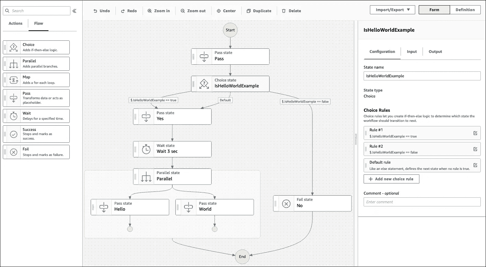
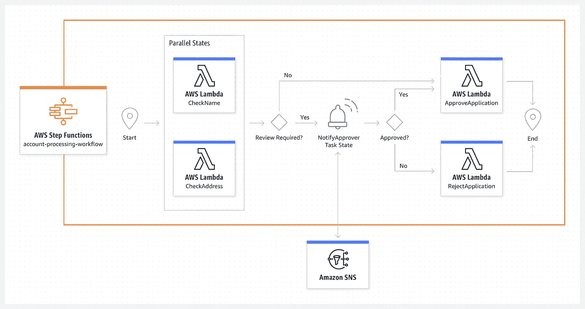
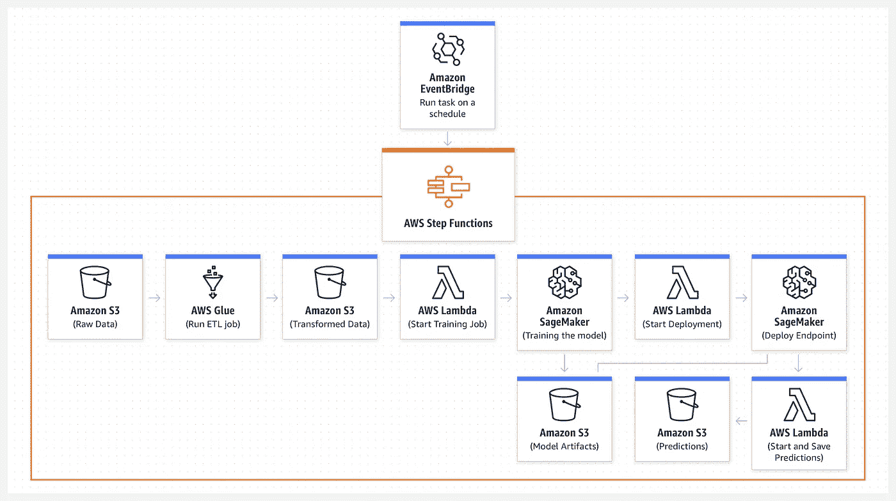

# 数据工程师对 AWS 管理气流与 AWS 阶跃函数(状态机)的观点

> 原文：<https://betterprogramming.pub/a-data-engineers-perspective-on-aws-managed-airflow-and-aws-step-function-state-machine-d4d11517e042>

## 定价、基础架构、规模等

鲁拜图·阿扎德在 [Unsplash](https://unsplash.com?utm_source=medium&utm_medium=referral) 上的照片

在我拍摄我的视角之前，这里有一些背景。我在一家大型流媒体应用的数据团队工作。我们团队的工作是大量的气流，我们有 1000 多个复杂的气流工作来处理我们的 ETL 和 ML 管道。

最近，我和一个新团队开始合作，该团队正在从传统的 spark 2.1 自管理整体流程转向 AWS EMR 和无服务器架构(lambda 等)。)来改善延迟，摆脱单片 Spark ETL 过程*(如果你想知道单片结构是什么样子，看我的* [*repo 这里*](https://github.com/smohanty0714/spark-etl-python) *)。*

因此，团队正在考虑将 AWS 管理的气流作为 ETL 编排工具。但是，在团队评估合适的选项时，我们引入了 AWS 状态机，看看它如何帮助 AWS 管理气流。

这是我对这两个伟大工具的看法。

我不会谈论这两个伟大产品之间的技术差异。相反，我将更多地关注我使用这两种产品的体验，以及它们的适用范围。

此外，值得一提的是，本文关注的是 Step 函数 ETL 和 ML pipeline 功能——由于 Step 函数对于许多 web 应用程序和业务工作流[用例](https://aws.amazon.com/step-functions/use-cases/)来说要强大得多，因此我们不在此讨论这些功能，因为 Airflow 在这些领域没有竞争力。

# **1。他们最适合的地方**

这两种服务最适合用于 ETL 和 ML 管道。

在构建管道方面，Airflow 需要一点学习曲线(Python，Airflow 操作符语法)。但同时，它有更多的控制权来编写复杂的管道。

另一方面，AWS 状态机是一个更容易的开始，可以更快地与您的 AWS 服务集成——通过利用[状态机工作流工作室](https://docs.aws.amazon.com/step-functions/latest/dg/workflow-studio.html)用零代码构建您的管道。

您可以通过拖放工作流控件来构建您的整个 ETL 流程，并且您的服务的集成将是完美的。除此之外，它将生成状态机定义 JSON，您可以在 CF/ SAM 模板中使用它。

AWS 状态机工作流工作室

在构建了我的第一个状态机之后，我发现在 ETL 和 ML 管道开发中，通过使用 Step 函数，你可以比使用 Airflow 更快地迭代它。

在选择其中一个时，需要考虑的另一个标准是:您打算将哪些系统集成为您的 ETL 过程的一部分。

当您的资源主要是 AWS 服务时，状态机是最合适的。但是，使用状态机连接到 AWS 非托管服务或本地服务并不那么简单。然而，这并不完全是一个障碍，因为您可以看到这里的一个[实现连接了来自状态机](https://aws.amazon.com/blogs/big-data/orchestrate-big-data-jobs-on-on-premises-clusters-with-aws-step-functions/)的内部资源。

虽然 AWS Managed Airflow 也为许多 AWS 服务提供了插件集成，但在与外部服务交互时，它们的控制更加丰富。然而，如前所述，与所有 AWS 服务的集成需要编写一些代码。

# 2.**它们的功能和特点有什么不同？**

就像 Airflow 为我们提供了丰富的操作符集来控制我们的工作流一样，AWS 状态机也提供了许多高级的和丰富的工作流控件来设计你的工作流(Map iterator、Wait 和 Parallel)。虽然您不能像在 Airflow 中那样添加自定义操作符。但是，就我个人而言，我没有发现状态机流控制不能实现的用例。

此外，当我要求我的 ETL 过程有一些人工干预时，我发现状态机很丰富——比如在管道中需要批准才能进行下一步。在这种情况下，状态机为您提供控制，在您的管道中，您可以将控制发送给人，在批准/拒绝后，下一步将随之而来。

使用状态机的人工干预驱动的工作流

状态机没有提供的一个特性是状态机的调度，就像气流一样。虽然，有一些方法可以实现，比如 AWS EventBridge 触发的时间表。

使用状态机的 ML 流水线

# 3.**基础设施和规模**

气流是一个开源产品。它的安装和管理基础设施开销由 AWS 负责。然而，它的无服务器选项还不可用，所以你需要注意你的 ETL 负载，尽管 AWS 有[自动伸缩功能](https://aws.amazon.com/managed-workflows-for-apache-airflow/features/)。

而 Step Function(状态机)是完全无服务器的，您没有管理或配置资源的负担。你按使用付费。

# 4.**定价**

流量定价基于您选择的基础设施，而状态机则是按使用量付费。

您可以在此找到一些价格对比:

*   [阶梯函数定价](https://aws.amazon.com/step-functions/pricing/)
*   [AWS 管理气流定价](https://aws.amazon.com/managed-workflows-for-apache-airflow/pricing/)

# 结论

我发现状态机是一个更丰富的产品，它使您能够更快地迭代您的 ETL 开发。

与此同时，AWS Managed Airflow 让您能够更好地控制 ETL 管道——但这需要付出更多的努力和学习曲线。

此外，一些现代和自动化的工作流程可能很难通过气流实现。