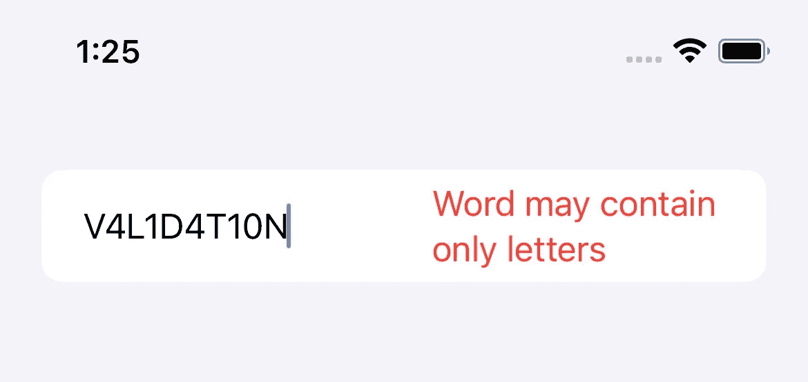

# 利用 Swift 属性包装器和 SwiftUI 视图扩展的数据验证解决方案

> 原文：<https://betterprogramming.pub/a-data-validation-solution-utilizing-swift-property-wrappers-and-swiftui-view-extensions-ae2db2209a32>

## Swift 和 SwiftUI 中的数据验证

不管是好是坏，Swift 编程语言没有提供统一的验证方法。因此，每个开发人员都必须开发自己的方法。在本文中，我分享了我来之不易的数据验证解决方案。

> “人非圣贤，孰能无过。”—(不是)亚历山大·波普

在基本层面上，验证需要检测和传递无效数据。理想情况下，验证逻辑应该是可重用的，并允许在代码库的多个层次上进行合并:在模型、视图和/或两者之间的任何地方。我将展示一个验证包，它实现了所有这些目标，并且能够纠正和格式化用户输入的数据。这种方法的基础是基于规则的系统。有了这个系统，我们可以利用 Swift 属性包装器和 SwiftUI 视图扩展的能力，在整个代码库中应用我们的验证模式。

# **创建验证规则**

让我们从创建一个相对简单的 Swift 协议开始。代码如下:

定义验证规则的基础协议

验证逻辑将驻留在 validate 函数中，该函数接受值类型并返回结果类型。在引擎盖下，`result`类型是具有两种潜在结果(或情况)的枚举:成功和失败。重要的是，这两个案例还有相关的值，允许我们传递关于验证结果的细节。

在协议中，有一个定义回退值的属性。在我们的规则中，这个值可以用作初始值，也可以用来替换无效数据。回退值在允许我们创建一个功能良好的属性包装器(见下文)时尤其重要，在这里我们能够为带有扩展的回退值提供默认值。

扩展验证规则并提供默认回退值

在我们开始创建验证规则之前，我们首先需要定义一个错误类型，我们将使用它来满足我们的协议中相关的失败类型。任何错误类型都可以。对于这个例子，我们将用两行代码创建一个名为`ErrorMessage`的字符串别名:

通过扩展和别名化字符串来创建灵活的错误类型的快速而简单的方法

使用我们新的规则协议和`error`类型，让我们创建一个简单的规则，然后我们可以用它来验证一个字符串。代码如下:

指定单词不超过 12 个字符的简单验证规则

我们可以通过向规则添加额外的初始化器和变量来定制相同的规则。在这种情况下，我们将允许修改规则，以便我们可以定义单词的最大长度，如下所示:

创建动态验证规则

我们还可以根据需要添加更多的验证逻辑。通过在 validate 函数中添加另一个 guard 语句，我们可以检查以确保所有输入的字符都是字母，如下所示:

向验证规则添加更多验证条件

到目前为止，我们已经使用验证结果的`.failure`案例返回了不同的错误类型。也可以更改成功的返回值。本质上，我们可以使用这种能力来使我们的规则自动更正或添加格式。在下面的例子中，我们将删除单词前后的所有空格。然后，我们将在验证结果中返回调整后的值，如下所示:

通常最好在验证之前进行任何转换

现在我们终于创建了一个规则，我们可以将它用作独立的验证对象，如下所示:

将验证规则用作独立的验证器

上面的例子相当简单明了，但是展示了使用自定义初始化器的能力，包括复杂的逻辑和转换值。组合验证和格式化的用例包括电话号码、邮政编码等。当我试图预见尽可能多的边缘情况时，好的验证规则经常会变得非常复杂。

良好的验证是一项艰巨的工作！

# 使用 Swift 属性包装器进行验证

随着我们探索在整个代码库中使用验证逻辑的不同方式，我们的验证规则的真正力量变得清晰起来。使用自定义 Swift 属性包装执行验证的主要位置是在属性级别。让我们直接进入代码:

用于验证的基本属性包装

上面的属性包装器成功地“包装”了我们的验证规则和我们想要验证的值。不出所料，主初始化器需要一个验证规则和值。我们还将为我们的属性包装器包含其他初始化器，以允许在我们的项目中平滑集成。在这些初始化器中，我们为规则和值提供默认值，如下所示:

可选属性包装器初始化器允许我们用默认属性填充或包装

有了半完整的属性包装器，我们现在可以直接在模型或视图模型中加入属性验证。有了上面定义的多属性包装器初始化器，我们就有了多种语法选项来包装我们的属性。

然而，我们的属性包装器是不完整的，因为我们不能容易地访问验证结果。这是我们利用预计价值的地方。在 Swift UI 状态管理中，许多投影值都是绑定。但是在自定义属性包装器中，我们可以将投影值设置为我们喜欢的任何值。在这种情况下，我们将使用计算的属性返回验证结果，如您所见:

预计值允许在我们的代码中轻松访问验证结果

现在我们已经定义了一个预计值，我们可以在任何时候使用`$`符号访问我们的验证结果。

美元符号语法将我们的验证结果返回为。成功还是。失败

尽管我们在上面做了很多努力，但是在一些重要的方面，包装的属性仍然比原来的“未包装的”属性更加有限。具体来说，虽然 a `String`是`Encodable`和`Decodabl` e(又名`Codable`，但我们新包装的属性不是。这可以通过扩展我们的属性包装器来弥补，使其符合这些协议(或任何其他协议)。下面是我们如何通过扩展将协议一致性添加到我们的属性包装中:

向 Encodable 添加一致性；仅对有效的属性值进行编码

将一致性添加到可解码

添加可编码的一致性不仅仅是一种便利。请注意，在 encode 函数中，只对有效值进行编码。如果值无效，则不对其进行编码。取而代之的是回退值。这确保了无效值永远不会被传递到编码数据中！

# SwiftUI 视图中的验证

现在，我们可以使用 rule 对象直接验证数据。我们还可以使用属性包装器将我们的验证直接合并到模型(或视图模型)中。但是，如果我们想在 SwiftUI 视图中加入验证，该怎么办呢？视图扩展非常适合这项任务，如下所示:

使用验证规则查看扩展

上面正在发生一些重要的事情。注意，当绑定值改变时，转义验证函数被触发。这通过闭包返回一个验证结果，然后可以在视图中使用它。通过使用闭包，我们可以随心所欲地处理验证结果，并相应地响应 UI 的变化。

当提交字段时，我们再次检查以确保验证的值在适当的时候匹配绑定的值。如果一个值经历了转换(比如修剪空白)，它将在提交时更新绑定值。

下面是我们的新视图扩展在正确视图中的样子:

使用视图扩展在视图中验证

有了新的视图扩展，UI 可以立即对无效的数据输入做出反应。可能的 UI 更改包括以文本形式显示错误信息、更改文本颜色或显示错误图标。在其他情况下，最好阻止保存或暂停导航，直到错误成功解决。可能性是无限的。

# **结论**

最后，这是我们经验证的视图的实际效果:

我希望这篇教程对你有所帮助，并能促使你更多地考虑在你的项目中使用验证。如果你喜欢这篇文章，请订阅来鼓励我写更多。

编码快乐！

# **资源**

这段代码的打包版本可以在 [GitHub](https://github.com/JonathanStorey/Validation) 找到。请随意在您的项目中使用它。