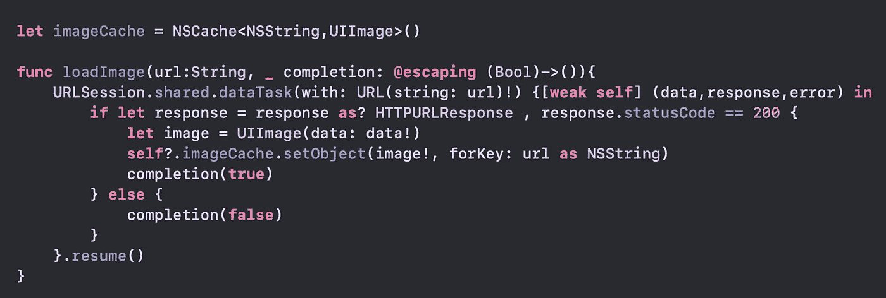
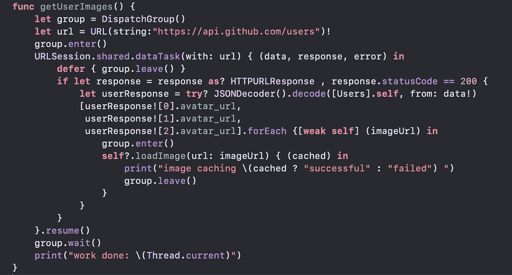
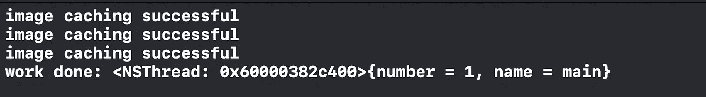
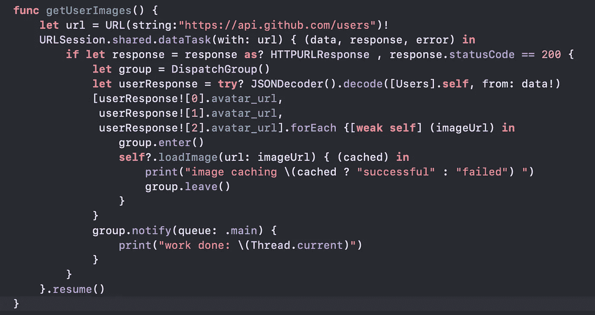

# 深入了解 Swift 中的调度组

> 原文：<https://betterprogramming.pub/a-deep-dive-into-dispatch-groups-8251bbb8b001>

## iOS 中正确的线程处理，包括进入、离开、等待、通知等等

[Adomas Aleno](https://unsplash.com/@aleno?utm_source=unsplash&utm_medium=referral&utm_content=creditCopyText) 在 [Unsplash](https://unsplash.com/collections/9711207/home-office?utm_source=unsplash&utm_medium=referral&utm_content=creditCopyText) 上拍摄的照片

调度组允许我们将一组任务作为一个单元进行监控。它聚集了一组任务并同步组中的行为。我们通过平衡调用`enter()`和`leave()`来将任务添加到一个组中。当所有任务完成执行时，该组执行其完成处理程序。您还可以同步等待组中的所有任务执行完毕。

# 基础

调度组由四种基本方法组成

*   `enter()`:用于表示一段代码已经进入该组
*   `leave()`:用于表示一段代码已经执行完毕，离开了该组
*   `wait()`:同步等待提交的工作完成。阻塞调用线程，直到工作完成。
*   `notify()`:通知需要的线程，提交的块已经执行完毕

在下面的例子中，我们将看到如何使用调度组来执行一组操作。

# 调度组:演示

在我们的演示中，我们将执行以下步骤:

1.  调用 GitHub trending-users API 并获取前三名用户的个人资料图片 URL。
2.  使用我们在步骤 1 中获得的 URL 加载三个配置文件图像，并缓存它们。
3.  以上操作完成后，返回主线程。

**注意:**我举了一个真实世界的例子，来解释当你在应用中包含这个时，你可能会面临的所有细微差别。

本质上，我们将进行四次 API 调用:一次获取趋势用户，三次获取图像。

首先，我们将看看如何使用调度组的`wait()`方法来执行这些操作，然后我们将看看`notify()`变体。

# 代码设置

这是一段我们将用于`wait()`和`notify()`变体的代码。

图像加载设置

*   `loadImage`方法将`imageURL`作为输入，获取图像，并缓存在一个简单的图像缓存中。然后它执行完成闭包。

## 等待()

让我解释一下这是怎么回事。

1.  在`getUserImages`方法中，我们初始化了一个`DispatchGroup`对象。
2.  我们配置`dataTask`来获取趋势用户，并在得到趋势用户的响应后调用`loadImages`。
3.  我们在调用趋势用户 API 之前添加了`group.enter()`，并添加了一个延迟语句`group.leave()`，它将在我们退出`dataTask`的完成闭包时运行。
4.  一旦我们收到趋势 API 响应，我们就调用`loadImage`方法来获取图像。我们在调用方法之前添加了`group.enter()`,在离开闭包之前添加了`group.leave()`。总之，我们在这里添加了三个进入和离开调用
5.  `.resume()`触发数据任务。到目前为止，我们所做的只是配置，但是对服务的实际调用现在发生了。
6.  `group.wait()`将阻塞调用者线程，直到所有操作完成(它将通过使它遇到的`enter()`和`leave()`调用的数量相等来确定这一点)。
7.  一旦所有操作完成，即执行了四个`group.leave()`,调用线程将被解锁，并且`work done`将被打印在调用线程上。让我们看看它的输出:

执行完所有闭包后，使用调用线程打印出`'work done'`。

## 常见陷阱

通常在类似上面例子的场景中，我们不在主 API 调用(趋势-用户调用)周围添加`group.enter()`和`group.leave()`，因为添加调度组的全部目的是跟踪发生的获取图像的并发调用。

然而，在这种情况下，我们必须在趋势 API 调用周围添加它；否则，`work done`块甚至会在图像获取调用之前被执行。

为什么？由于趋势 API 调用将被委托给一个后台线程，调用线程的执行将到达`dispatchGroup.wait()`，到那时，图像获取`enter()`或`leave()`调用将不会被执行。所以`dispatchGroup.wait()`不会阻塞主线程，而是执行打印语句。

## 避免`wait()`

强烈建议尽可能避免使用`wait()`,因为它实际上阻塞了调用线程，在我们的例子中，它是主线程。

即使我们将整个`getUserImages`函数添加到一个并发队列中，并让它在一个后台线程上工作，当我们执行请求时，我们还是阻塞了一个非常有限的 GCD 工作线程。这就是我们使用`notify()`的原因。

## 通知()

1.  我们在趋势 API 调用的闭包内初始化调度组。
2.  我们在调用方法之前添加了`group.enter()`，在离开闭包之前添加了`group.leave()`。这里总共有三个进入和离开调用。
3.  然后我们遇到了`group.notify()`方法，它没有阻塞调用线程，而是在所有的`group.leave()`方法被执行时通知主线程。
4.  现在`loadImage`关闭将被执行，图像将被成功存储。一旦所有的闭包都被执行，主线程就会得到通知，并且`work done`会被打印在主线程上。

当使用调度组时，您应该总是考虑使用`notify()`，因为它不会阻塞线程。

## 奖金

*   我们可以在`wait()`方法上设置一个超时，这将使我们能够设置阻塞调用线程的时间。即使没有执行完所有的`leave()`方法，我们也会解除对线程的阻塞并开始执行其他任务。
*   我们可以将`DispatchWorkItem`与`notify()`方法一起使用，这将帮助我们有效地实现取消处理程序和事件处理程序。

# 尾注

这就是我这篇文章的全部内容，感谢阅读。**关注我的** [**推特**](https://twitter.com/_kiran_44) 了解更多更新。**如果你喜欢这个帖子，请提供一些掌声，因为这将鼓励我写更多(**你可以放弃多达 50 个**)。P.s .完全不用担心迂腐。如果你认为我可以在文章中做些改进，请告诉我。**