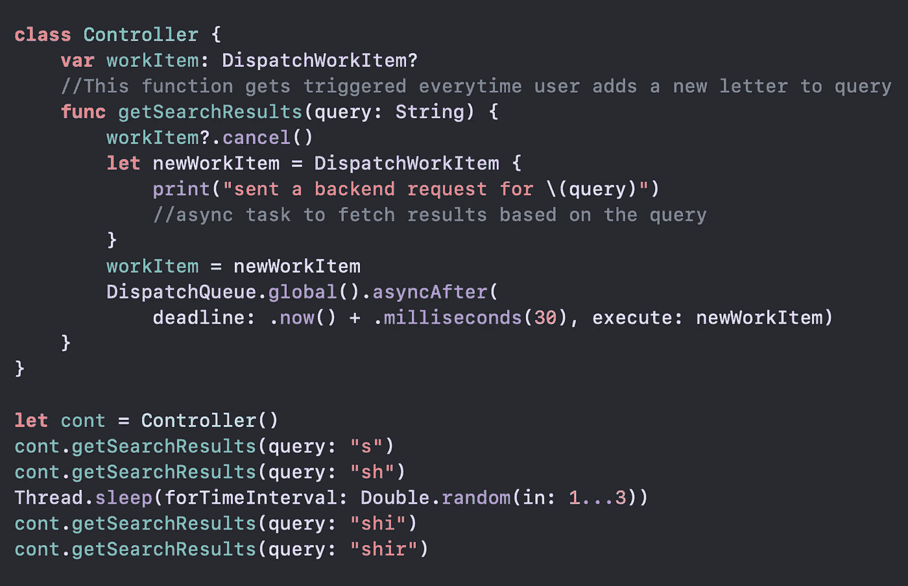
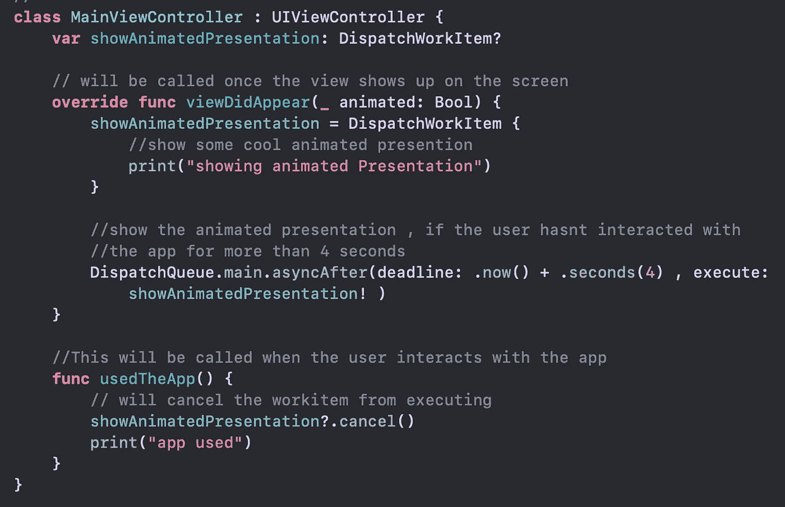
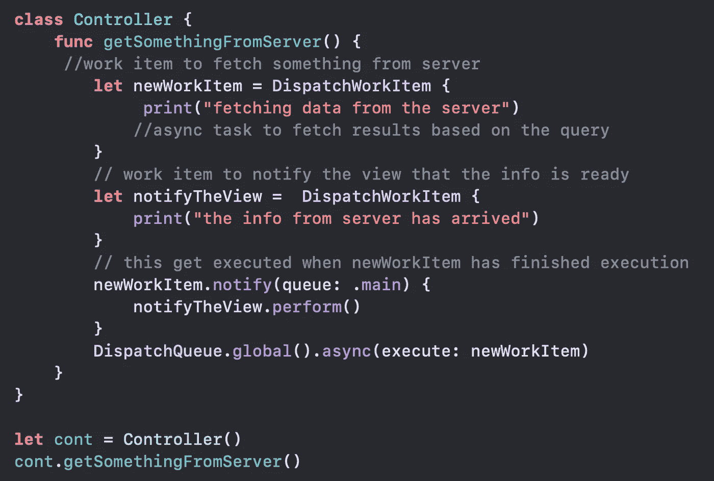
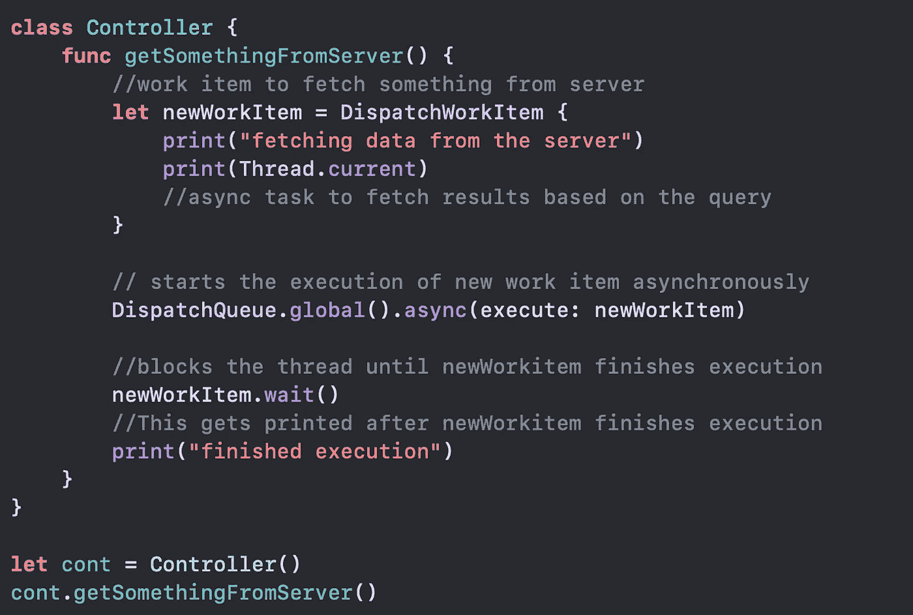

# 深入了解 Swift 的 DispatchWorkItem

> 原文：<https://betterprogramming.pub/a-deep-dive-into-dispatchworkitem-274548357dea>

## 何时使用 DispatchWorkItem、wait()、notify()和标志


照片由 [Avel Chuklanov](https://unsplash.com/@chuklanov?utm_source=medium&utm_medium=referral) 在 [Unsplash](https://unsplash.com?utm_source=medium&utm_medium=referral) 上拍摄

一个`DispatchWorkItem`封装了要在一个调度队列或一个调度组上执行的工作。它主要用于我们需要延迟或取消代码块执行的场景。

它允许我们取消一个排队的任务，但是，我们只能在任务到达队列头并开始执行之前取消它。

在本文中，我们将看到几个真实世界的例子，其中`DispatchWorkItem`用于延迟和/或取消代码块的执行。

我将要提到的例子可以不使用`DispatchWorkItem`来实现，然而，使用它使得代码更加简单和易于维护。我们还将讨论`DispatchWorkItemFlags`、`wait()`和`notify()`方法。

# **例 1**

想象一下，我们正在开发一个电子商务应用程序，我们有一个搜索栏向我们显示预先输入的结果。

当用户开始输入字母时，我们是否希望为用户输入的每个新字母点击后端服务？当然不能，因为这会大大增加我们后端服务器的负载。

因此，我们对这些事件进行反跳，只有在用户一两秒钟没有输入任何内容后才会发送请求。让我们看看如何使用`DispatchWorkItem`来实现这一点。



在`getSearchResults`方法中，`WorkItem`只有在用户 30 毫秒没有输入任何东西后才会被执行。因此，上述执行的输出将是:

```
sent a backend request for shsent a backend request for shir
```

当一个新的字母在指定的延迟时间内被键入时，我们实质上取消了前面的`workItem`。由于我们设置主线程在输入`sh`后休眠超过 30 毫秒，后台线程开始执行`WorkItem`。

这也可以为需要服务器端验证的文本字段实现。假设用户正在输入用户名以在我们的网站上注册，我们可以使用上面示例中的`DispatchWorkItem`来验证该用户名是否已被使用

# 示例 2

假设我们构建了一个新的应用程序，并希望通过应用程序内的动画演示向用户展示如何使用该应用程序。

但是，如果用户已经开始与应用程序交互，我们不想显示它(这意味着用户知道应用程序是做什么的。假设…)。



如果用户已经与应用程序交互，`usedTheApp`方法将取消`DispatchWorkItem`的执行。

# 通知()

Notify 计划在当前工作项目完成后执行指定的工作项目。让我们看看它的实际效果。



这可用于以串行方式执行两个或多个任务，其中第一个任务必须在执行下一个任务之前完成。

一个示例用例是在后台线程上获取表视图的数据，并通知主线程数据已准备就绪

`DispatchWorkItem`上的`perform()`方法将在当前线程上同步启动工作项的执行。看看上面例子中的用法。

# 等待()

`wait()`使调用者同步等待，直到分派工作项目执行完毕。让我们看看它的实际效果。



不建议使用 to `wait()`，因为它会阻止线程执行。

在上面的例子中，我们阻塞了主线程的执行，这是应该避免的。即使我们将任务分派给一个后台线程，当我们执行请求时，我们实际上阻塞了一个非常有限的 GCD 工作线程。

# DispatchWorkItemFlags

这个标志为一个工作项定义了一组行为，比如它的服务质量等级，以及是创建一个屏障还是产生一个新的分离线程。最常用的标志是`assignCurrentContext`和`barrier`。

`barrier`:当提交到并发队列时，使工作项目充当障碍块。在并发队列中，多个任务在不同的线程上同时执行。

当带有`barrier`标志的工作项开始执行时，队列中的所有任务被暂时挂起，一旦该工作项完成，这些任务将被恢复。

`assignCurrentContext`:设置工作项的属性，以匹配当前执行上下文的属性。

# 尾注

这就是我这篇文章的全部内容，感谢阅读。**关注我的** [**推特**](https://twitter.com/_kiran_44) 了解更多更新。如果你喜欢这个帖子，请提供一些掌声，因为这将鼓励我写更多(**你可以放弃 50 个**)。如果你想看更多的文章，请跳上我的网站。如果你认为我可以在文章中做些改进，请告诉我。