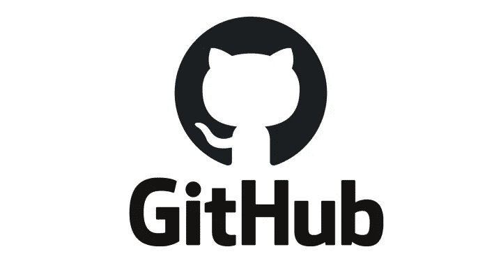
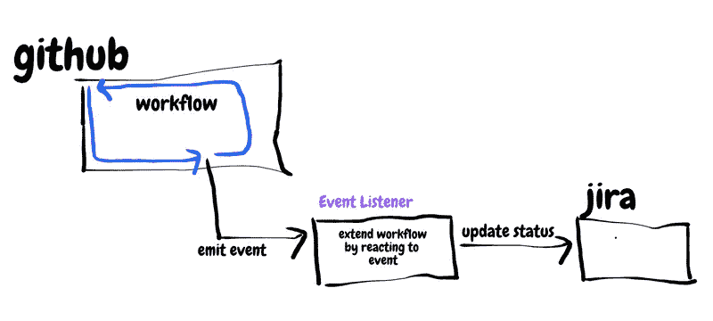
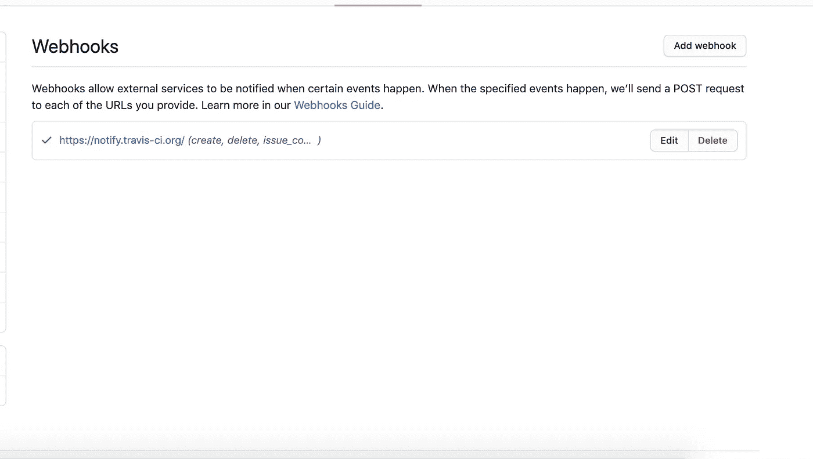
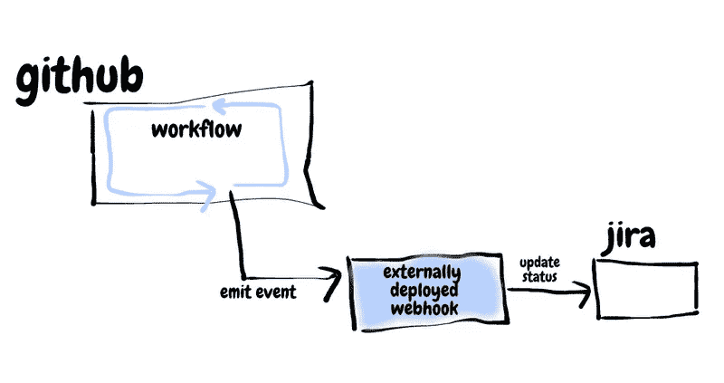
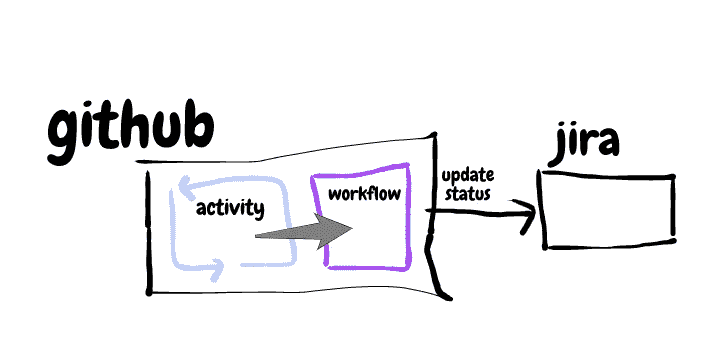
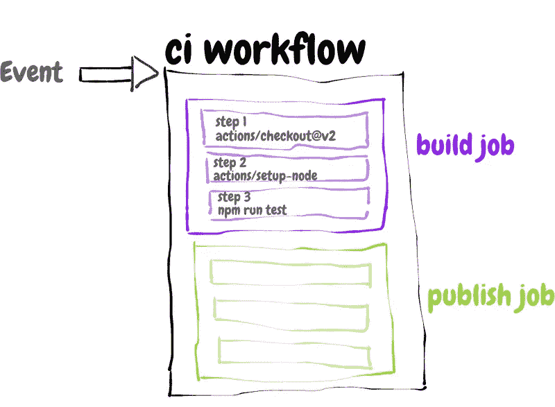
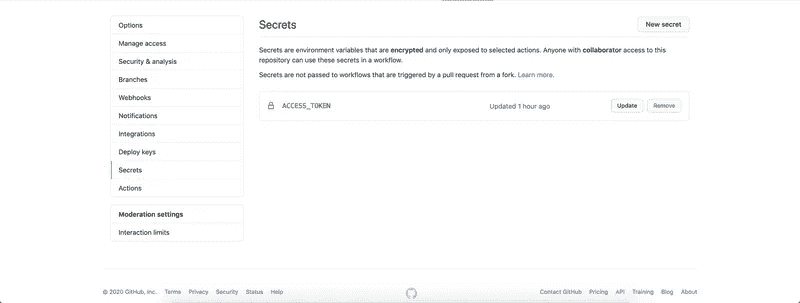

# 对 GitHub 动作的深入探究

> 原文：<https://betterprogramming.pub/a-deep-dive-into-github-actions-51e234da0c50>

## 了解动作的架构、两种类型的动作以及如何构建 JavaScript 动作



GitHub 徽标

在我的[上一篇文章](https://medium.com/better-programming/deploy-your-gatsby-site-with-github-actions-e761ea93813f)中，我概述了 GitHub 动作，并演示了如何使用一个[现有动作](https://github.com/marketplace/actions/gatsby-publish)将一个 Gatsby 站点部署到 GitHub 页面。在这篇文章中，我想深入探究 GitHub 动作，探究它们背后的潜在动机、架构以及构建自定义动作的步骤。

在进入 GitHub 动作的细节之前，让我们通过首先深入研究 GitHub 事件以及 GitHub 如何支持这些事件的处理来理解它们带来的价值。

# GitHub 事件

[GitHub](http://github.com/) 使用 Git 为软件项目和版本控制提供托管服务。它通过支持跨团队(通常是分布式的)、代码审查和项目管理的协作，形成了软件开发生命周期的核心。

GitHub 事件在帮助 GitHub 做它最擅长的事情方面发挥了很大的作用，同时也提供了可扩展性点来与软件开发生命周期中使用的其他工具集成。你可以用 GitHub 来合作开发源代码，用 [JIRA](https://www.atlassian.com/software/jira?&aceid=&adposition=&adgroup=89541920342&campaign=9124878366&creative=415596748931&device=c&keyword=jira&matchtype=e&network=g&placement=&ds_kids=p51241989307&ds_e=GOOGLE&ds_eid=700000001558501&ds_e1=GOOGLE&gclid=Cj0KCQjwuL_8BRCXARIsAGiC51Cdwq74xFOF4AuRaEMtphFQLNLRM6fjsLjW61G_Liyf16GKepDxlusaAsBWEALw_wcB&gclsrc=aw.ds) 来管理项目，用 [Confluence](https://confluence.atlassian.com/doc/confluence-data-center-and-server-documentation-135922.html) 来记录流程。GitHub 事件帮助您扩展在 GitHub 上执行的典型活动，并与您已经使用的其他工具挂钩。

> “每个事件对应于您的组织和/或存储库中可能发生的一组特定操作。例如，如果您订阅了问题事件，您将在每次打开、关闭、标记问题时收到详细的有效负载。”— [GitHub 文档](https://docs.github.com/en/enterprise-server@2.21/developers/webhooks-and-events/about-webhooks)

例如，当一个 pull 请求在 GitHub 上被合并时，您可能希望更新 JIRA 相应票据的状态。



通过处理 GitHub 事件来扩展 GitHub 活动

# 你能对哪些 GitHub 事件做出反应？

GitHub 提供广泛的[事件报道](https://docs.github.com/en/free-pro-team@latest/actions/reference/events-that-trigger-workflows)。您可以挂接在 GitHub 上执行的大量活动，并根据您的团队或您的业务需求扩展它们。

例如:

*   当 GitHub 中发生与**问题**相关的事情时，[问题](https://docs.github.com/en/free-pro-team@latest/actions/reference/events-that-trigger-workflows#issues)事件可以用来影响另一个系统中的变化。
*   当与**拉取请求**相关的事情发生时，可以类似地使用[拉取请求](https://docs.github.com/en/free-pro-team@latest/developers/webhooks-and-events/webhook-events-and-payloads#pull_request_review)事件。

可能性是无限的——您可以在每次合并时自动发现并修复代码中的 lint 问题，在每次部署失败时发送电报消息，或者自动标记对存储库的每个新的 pull 请求。

# 在 GitHub 动作之前对事件做出反应

那么，如何监听 GitHub 事件并对其做出反应呢？在 GitHub 动作之前， [webhooks](https://docs.github.com/en/free-pro-team@latest/developers/webhooks-and-events/about-webhooks) 是消费 GitHub 事件的推荐方式。

在这种情况下，事件侦听器是一个公开 HTTP 端点的 web 服务。您可以在 GitHub 存储库上配置一个 webhook，使用这个端点作为事件的交付目标。



GitHub 存储库的 Webhook 设置页面

每当存储库中发生活动时，GitHub 就会向该端点发布感兴趣的事件。webhook 可以通过执行一些自定义代码来响应事件，从而扩展活动。



使用 webhook 响应 GitHub 事件

webhooks 最大的缺点是必须支持外部服务。这意味着编写一个新的服务，部署它，并维护它。

# 输入 GitHub 操作

[GitHub 动作](https://docs.github.com/en/free-pro-team@latest/actions/creating-actions/about-actions)提供了一种在 GitHub 平台内对 GitHub 事件做出反应的方式，而不是让一个独立部署的 webhook 来接收和处理事件。



使用基于 GitHub 动作的工作流来响应 GitHub 事件

> " GitHub Actions 是您的工作流程:由您构建，由我们运行."—[GitHub 博客](https://github.blog/2018-10-17-action-demos/)

GitHub 操作提供了许多优势:

1.  提供对 GitHub 中的事件做出反应的能力。这避免了引入第三方工具，并防止数据流经另一个服务。
2.  提供比 CI/CD 单独服务更低的[定价方案](https://docs.github.com/en/free-pro-team@latest/github/setting-up-and-managing-billing-and-payments-on-github/about-billing-for-github-actions#about-billing-for-github-actions)。它对公共存储库是免费的，对私人存储库是按需付费的。
3.  允许重复使用共享的工作流。这一点尤其重要，因为它避免了开发人员不得不一遍又一遍地解决相同的问题。相反，公共工作流创建了一个动作的[生态系统，开发者可以派生、编辑、迭代和改进，就像代码一样。](https://github.com/marketplace?type=actions)

# 构建模块—工作流、作业、步骤、操作和运行器



工作流程的组成部分:作者图片

GitHub 事件触发工作流。

*   一个**工作流**有一个或多个任务(默认情况下并行运行)。
*   一个**作业**有一个或多个步骤在同一个**运行器**上执行。同一作业中的步骤可以将数据传递给后续步骤。
*   一个**步骤**由一个**动作**、该动作的输入和一个可选名称组成。
*   因此，**动作**是工作流中最小的独立组件。
*   **runner** 是安装了 GitHub Actions runner 应用程序的服务器，该应用程序监听作业，一次运行一个作业，报告进度，并记录结果。

# GitHub 操作的类型

动作是工作流中最小的独立组件。它封装了执行单个逻辑任务所需的代码——签出存储库、设置节点或部署静态站点。

正如我们在上面看到的，这些逻辑任务可以组合起来执行一个完整的工作。

有两种方法[来编写 GitHub 动作:](https://www.reddit.com/r/docker/comments/gopv3w/github_actions_docker_containers_vs_javascript/)

## JavaScript 操作

在这里，您用 Javascript 编写动作代码。这段代码是使用您在`action.yml`(元数据)文件中指定的节点版本执行的(稍后将详细介绍)。

这种方法有一些缺点:

1.  动作**取决于运行器**上可用的节点版本。比如 GitHub 上的 [Ubuntu-18 Runner](https://github.com/actions/virtual-environments/blob/main/images/linux/Ubuntu1804-README.md) 运行节点 12。如果您使用自己的运行 Node 10 的 runner，为 Node 12 编写的 Javascript 动作可能无法正常工作。
2.  **依赖项需要与动作**打包在一起(要么通过将`node_modules`文件夹包含在动作存储库中，要么通过使用 [vercel/ncc](https://docs.github.com/en/free-pro-team@latest/actions/creating-actions/creating-a-javascript-action#commit-tag-and-push-your-action-to-github) 将`node_modules`文件夹打包成一个文件)。

## Docker 容器操作

Docker 容器将 GitHub 动作的环境和代码捆绑在一起，这使得它成为一种更可靠的打包动作的方式。

动作的消费者不需要担心动作中使用的工具或依赖关系。例如，如果动作指定了节点版本 12，但是在运行节点 10 的非标准运行程序上运行，这不会导致问题，因为 Docker 动作在其自己的容器中运行，该容器具有该动作的正确节点版本。

# 创建 Javascript 操作

在[之前的一篇文章](https://medium.com/@deborah.gertrude.digges/pr-bot-8402805ab7d4)中，我描述了我如何设置 GitHub webhook 来评论新贡献者在存储库上打开的 pull 请求。我将介绍如何使用 GitHub 操作来重现这种行为。

## 正在初始化存储库

1.  创建一个空文件夹
2.  文件夹内:`npm init -y`

## 描述动作

在同一个文件夹中创建一个`action.yml`文件。该文件包含描述动作意图、输入和输出的元数据。

我们的操作需要一个`access-token`来代表用户评论一个拉请求。对新贡献者的欢迎`message`也是可配置的。

我们指定动作在`node12`上运行，还指定入口点为`src/index.js`(动作代码所在的位置)。

## 添加工具包依赖项

GitHub 提供了一个 action [toolkit](https://github.com/actions/toolkit) ,其中包含任何操作都需要的基本工具。我们将使用这些实用程序来读取事件负载，创建 GitHub API 客户端，以及其他我们不希望自己构建的细节。

```
npm install @actions/core
npm install @actions/github
```

## 编写操作代码

*   我们从 GitHub action toolkit 中导入`core`和`github`模块。
*   我们使用`core.getInput`函数访问动作的输入。
*   我们使用`github`模块:`github.context.payload`访问事件负载。
*   我们使用`github`模块:`github.getOctokit(accessToken)`创建一个 GitHub 客户端，并从输入中获取访问令牌。
*   我们检查`payload`看它是否是一个新的拉请求(即`action`是`opened`)。我们还检查这是否是一个新贡献者发出的拉请求。
*   如果是，我们使用之前创建的`githubClient`来注释 pull 请求:`githubClient.issues.createComment`。

就是这样！

## 提交代码

1.  添加`src`文件夹、`package.json`和`package-lock.json`文件以及`node_modules`文件夹。
2.  提交您的更改。
3.  标记您的更改:`git tag -am "Release version 1.0" v1.0`。
4.  将您的更改推送到 GitHub 上的一个存储库中:`git push --follow-tags`。

要查看这个 GitHub 动作的完整代码，请查看我在 GitHub 上的[库](https://github.com/Deborah-Digges/new-pull-request-comment-action)。

# 在存储库工作流中使用操作

转到存储库，在那里您希望使用这个操作来评论新贡献者提出的 pull 请求。在这个存储库中，添加一个`.github/workflows`文件夹。向该文件夹添加一个`.yml`文件来描述该工作流程:

您可以在此指定要运行此工作流的响应事件。在我们的例子中，我们希望它在`main`分支的`pull_request`上。

该工作流有一个名为`comment`的单一作业，它有一个由我们刚刚创建的动作和该动作使用的输入组成的单一步骤。我们使用以下格式引用我们创建的操作:`deborah-digges/new-pull-request-comment-action@v1.9`，它表示:

*   在其下查找操作的 GitHub 用户名或组织
*   操作及其依赖项所在的存储库名称
*   操作的版本(可以是标记或提交散列的形式)

## 添加访问令牌

我们将动作的`access-token`输入指定为值`${{ secrets.ACCESS_TOKEN }}`。要设置这个值，需要向存储库中的`Secrets`部分添加一个[个人访问令牌](https://github.com/settings/tokens/)。



GitHub 存储库中的 Secrets 部分

[查看使用该动作的库](https://github.com/Deborah-Digges/test-github-action)的完整源代码。

## 对动作进行测试

去吧！通过向您的存储库发出拉请求来测试您的新工作流！如果这是您第一次向资源库发出 pull 请求，您应该会从友好的 GitHub 操作中看到一条欢迎消息。

我希望您喜欢这次对 GitHub 操作的深入探究。请继续关注我的下一篇文章，我将详细介绍如何制作 Docker 容器 GitHub 动作。激动人心的时刻即将到来！