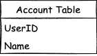
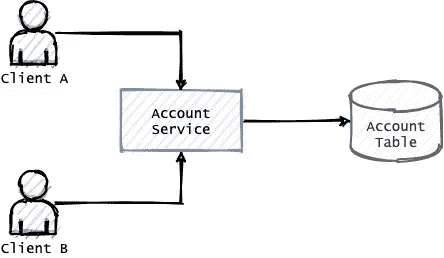
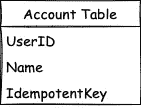
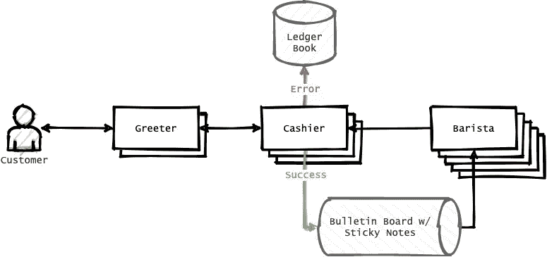
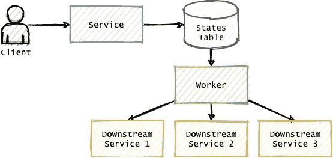

# 对幂等性的深入探究

> 原文：<https://betterprogramming.pub/a-deep-dive-into-idempotence-1a39393df7e6>

## 什么是幂等性，你如何正确使用它


照片由[本多·金](https://unsplash.com/@bundo?utm_source=unsplash&utm_medium=referral&utm_content=creditCopyText)在 [Unsplash](https://unsplash.com/?utm_source=unsplash&utm_medium=referral&utm_content=creditCopyText) 上拍摄

幂等性是一个既简单又难的话题。这里，我们从简单的单状态应用程序中的一个普通用例开始。然后我们将深入讨论构建具有多种状态的高度可靠系统的最复杂的用例。

# 什么是幂等性

让我们从[维基百科](https://en.wikipedia.org/wiki/Idempotence)开始:

> *“幂等性是数学和计算机科学中某些运算的属性，它们可以多次应用，而不会改变最初应用后的结果。”*

但是“不改变结果”到底是什么意思呢？我认为有两种解释方式:

1.  无论我提出多少次同样的请求，我都会得到同样的回应。
2.  无论我提出多少次同样的请求，我都不会改变系统的状态。

这两种说法听起来很相似，从表面上看似乎都是正确的。不过，第二种说法更合适。我们将在接下来的章节中进一步讨论这一点。

# 单态系统中的幂等性

让我们考虑一个非常简单的系统，在一个数据库上运行一个服务。


图片来源:作者

该数据库跟踪用户帐户。每个帐户都有两个属性:`UserID`和`Name`。



让我们假设服务提供了四个基本的 CRUD 操作(创建、读取、更新和删除)。

这些 API 定义如下:

```
createUser(userId, name)
readUser(userId) -> User
updateUser(userId, name)
deleteUser(userId)
```

让我们以读操作为例。普遍认为 READ 是幂等的。

但是，如果我们发出一个读请求，遇到一个网络错误(即超时)，然后重试，我们不一定会得到与初始请求相同的响应。为什么？

因为系统的某个其他参与者可能已经改变了系统的状态。例如，`updateUser`可能在第一次和第二次阅读之间被调用。

对于创建操作，如果我们在`createUser`请求期间遇到网络错误，那么系统的状态就变得不确定，就像[薛定谔的猫](https://en.wikipedia.org/wiki/Schr%C3%B6dinger%27s_cat)一样。

如果还没有创建记录，那么重试将触发数据库的正常插入。

如果记录已经被创造了，那么事情就变得有趣了。我们应该如何回应客户？考虑以下两个选项:

1.  `Error: Your record {userId: 'yuchen123', name: 'Yuchen'} already exist`
2.  `Success: Your record {userId: 'yuchen123', name: 'Yuchen'} is created`

两个选项都有效。从客户端的角度来看，返回相同的响应可能对用户更友好，因为客户端只关心创建操作的结果。

然而，另一方面，我们也可以认为不同的响应提供了更多的透明度，表明先前的请求是成功的。让我们假设我们现在采用选项一。

# 有两个客户的案子

如果我们有两个客户端，并且它们都发出创建用户的相同请求:

```
createUser(userId: 'yuchen123', name: 'Yuchen')
```

假设网络不稳定，客户端 A 和客户端 B 的请求都成功到达了服务器。然而，他们都没有得到答复。



图片来源:作者

过了一会儿，两个客户端都进行了重试，并且都收到了一条错误消息:

`Error: Your record {userId: 'yuchen123', name: 'Yuchen'} already exist`

有趣的是，对于当前的设置，我们没有办法知道两个客户端的初始请求中哪一个成功了。

一种常见的方法是引入一个`idempotentKey`。有时也被称为`idempotentToken`、`requestId`、`nonceToken`等。

现在，让我们将创建请求更改如下:

```
createUser(userId, name, idempotentKey)
```

来自客户端 A 和客户端 B 的请求现在可能是不同的。

来自客户端 A:

```
createUser(
  userId: 'yuchen123',
  name: 'Yuchen',
  idempotentKey: 'a2906959'
)
```

来自客户端 B:

```
createUser(
  userId: 'yuchen123',
  name: 'Yuchen',
  idempotentKey: 'b54ed6d9'
)
```

从服务器端来看，当将这个记录插入数据库时，我们还包含了新的列`idempotentKey`。



当客户端重试时，它将使用来自其先前请求的相同的`idempotentKey`。有了这个，我们就可以确定哪个客户端的请求更早成功了。

例如，如果我们在数据库中看到一条记录，其中的`idempotentKey`是`a2906959`，那么我们可以向两个客户端返回以下内容。

对客户 A 的响应:`Success: Your record {userId: 'yuchen123', name: 'Yuchen'} is created`。

对客户 B 的响应:`Error: Your record {userId: 'yuchen123', name: 'Yuchen'} already exist`。

注意，我们使用短字符串作为`idempotentKey`。实际上，它们可以是任何东西，只要它们是独一无二的。

# 在最多一次和至少一次之间进退两难

大规模分布式系统本质上是不可靠和不可预测的。服务器可能在任何给定的时间点崩溃。

前阵子我在博文[系统设计中通俗易懂的描述了一个点咖啡的系统](/system-design-in-laymans-terms-design-a-coffee-shop-e1abb42dd123)。我在那里写道:

*……收银员在把便签贴在布告栏的同时，把交易记录在分类账薄上。*



图片来源:作者

但我没有解释他们如何同时做到这一点。如果收银员在给咖啡师的贴纸上写下订单，被一个电话分心，然后忘记在分类账上写下交易，会发生什么？

像这样的情况在分布式消息队列中被广泛讨论。当消息队列中有新消息时，我们应该:

1.  首先，确认我们收到了消息，然后处理它
2.  首先处理消息，只有在处理完成后才确认消息

在(1)和(2)之间选择将分别导致**最多一次**和**至少一次**的传送。

一种解决方案是使用原子提交协议，这在 Martin Kleppmann 所著的《设计数据密集型应用程序:可靠、可伸缩和可维护系统背后的重要思想》一书中有详细讨论:

> *“如果消息传递或数据库事务失败，两者都被中止，因此消息代理可以稍后安全地重新传递消息。因此，通过自动提交消息及其处理的副作用，我们可以确保消息只被有效地处理一次，即使它在成功之前需要几次重试。中止会丢弃部分完成的事务的任何副作用。*

尽管这在理论上听起来很优雅，但在实践中却极难实现。在下一节中，我们将研究解决这个问题的不同方法——幂等性。

# 多态系统中的幂等性

一个复杂的系统可以由许多组件组成。但从概念上讲，它们可以分为两类:

*   州
*   计算

计算将改变一个物体的状态。它是可执行功能的一个小单元，通常也称为步骤或任务。

如果我们关注状态，这样一个复杂的系统有时被称为[状态机](https://en.wikipedia.org/wiki/Finite-state_machine)。如果我们关注计算，它有时被称为[工作流](https://atscaleconference.com/2021/03/08/powering-developer-productivity/)。在学术上，这也被称为[传奇设计模式](https://microservices.io/patterns/data/saga.html)。

由于系统可能在任何给定的时间点崩溃，为了使系统高度可靠，诀窍是使每个计算幂等，以便我们可以在失败的情况下重试它们。

启用幂等的方法与我们在单态系统中讨论的方法没有什么不同——通过向请求添加一个`idempotentKey`。在服务器端，我们将请求放入数据库，并立即向客户端发送一个确认消息，确认请求已收到。任何后续的重试请求都将被忽略，因为带有此`idempotentKey`的请求已经存在于我们的系统中。

需要指出的是，这个系统是异步的。我们有一个独立的工作人员来完成这个请求。



图片来源:作者

像这样的系统变得高度可靠。工人可以在任何时候崩溃，它会没事的。

例如，在一个电子商务应用程序中，工作人员在处理用户的信用卡时崩溃。我们应该将交易的状态从“待收费”更改为“已收费”由于工人去世，我们不知道我们是否已经成功地更改了用户的信用卡。我们该怎么办？一旦工作人员重新启动，我们只是尝试再次从用户的信用卡中收费。只要请求是等幂的，我们有信心不会扣除两倍的金额。

从客户端的角度来看，它可以轮询结果。或者，它也可以依靠一些单独的系统在请求完成后得到通知(例如，电子邮件、推送通知、分布式消息队列等)。).

简而言之，在具有多个状态和计算的复杂系统中，使它们高度可靠的技巧是使请求幂等。

# 在幂等性很重要的地方

在可靠性上有这么大的好处，为什么我们不使所有的请求都幂等呢？

一些请求显然可以受益于幂等性。比如我们上面提到的信用卡交易。事实上，大多数(如果不是全部)支付基础设施都支持等幂，比如来自 [Stripe](https://stripe.com/docs/api/idempotent_requests) 或 [Square](https://developer.squareup.com/docs/working-with-apis/idempotency) 的支付 API。

但是幂等也是贵的。它的实现更加复杂，并且还有额外的延迟问题。因此，某些服务成为幂等的可能没有意义。举个例子，

*   在日志系统中我们不需要幂等性。如果系统重新启动，复制日志消息是可以接受的。
*   我们不希望在流媒体应用程序(如 VoIP 呼叫)或协作编辑工具(如 GDoc)中出现等幂。在这些系统中，我们优先考虑可用性而不是一致性。

正如托马斯·索维尔曾经说过的:

> “没有解决办法。只有取舍。你试图得到你能得到的最好的平衡。这就是你所能期待的一切。”

他是在谈论经济学。但这同样适用于美国工程师。我们需要决定哪些操作是关键的，我们需要进行幂等运算，哪些操作不太关键，用最少一次或最多一次就足够了。

# 结束了

今天到此为止。这不是一个容易写的话题。如果你已经做到这一步，希望你也能享受等幂的美丽。一如既往，非常感谢阅读。工作中一定要用到幂等吗？你在建造什么？在实施过程中，你觉得最大的挑战是什么？我也很想收到你的来信！