# 深入探究 Java 通配符——协方差

> 原文：<https://betterprogramming.pub/a-deep-dive-into-java-wildcards-covariance-4d807a65f02>

## 探索 Java 中较难的主题之一


照片由[拍摄于](https://unsplash.com/@sixteenmilesout?utm_source=unsplash&utm_medium=referral&utm_content=creditCopyText)16 英里外的 [Unsplash](https://unsplash.com/s/photos/bucket?utm_source=unsplash&utm_medium=referral&utm_content=creditCopyText)

当我遇到通配符时，我感到非常困惑，尤其是当它与`<T>` s、`<U>` s、`<V>` s 一起出现时。在我们应该何时使用`<T extends Number>` vs `<? extends Number>`的问题上存在困惑。我相信你们中的许多人可能也感到困惑。

今天，我们就来试着了解一下`<? extends Bla>`。我不会谈论像 PECS(生产者延伸，消费者超级)等标准的东西。我读过这方面的书，但这不仅仅是记忆。我认为我们应该永远触及核心。

在深入挖掘之前，我们先试着了解一下背后的故事。这将使事情变得更容易。所以，上车吧。可能会很长。

慢慢读这个。我已经为清晰的可视化提供了大量的代码和细节。

# 协方差和逆变——重要的概念！

协方差—我们知道 String 是 Object 的子对象，所以根据 Java 的规则，我们可以将一个子对象引用赋给一个父对象。类似于以下内容:

```
String s = "Wildcards";
Object o = s;
```

因此，根据协方差规则，这是可能的:

```
String[] sArray = { "Wildcards" };
Object[] o = sArray; // Valid in Java.
```

我们称`String[]`和`Object[]`为 holder 类型(HT——持有一些对象),分别适用于 String 和 Object 之类的持有对象。那个 HT 可以是`List<>`、`Set<>`、`Box<>`——任何能装物体的东西。

> 所以，根据协方差，如果 Object 是 String 的父，那么 HT 也将是 HT <string>的父。</string>

```
List<String> s = new ArrayList<>();
List<Object> o = new ArrayList<>();// This will not compile! But this is what covariance is.
o = s; // We could have done this if lists were covariant, but List is not covariant in its plain form.
```

> Java 中的数组是协变的，这意味着下面的代码是有效的。

```
String[] sArray = { "Wildcards" };
Number[] nArray = { 2, 3 };
Object[] o = sArray; // Object is parent of String
o = nArray; // Object is parent of Number too!
```

使数组协变是一个 Java 设计决策。他们本可以选择不同的道路。但是，使它们协变允许许多多态行为。人们可以通过在`Object[]`中存储业务对象来编写通用代码。但是它引入了只能在运行时检测到的错误。考虑以下情况:

```
Number[] nArray = { 2, 3 };
Object[] o = nArray;
o[0] = "s"; // This is valid in Java, but will crash with ArrayStoreException.
```

在大型企业应用程序和库中，这种错误很有可能发生，并可能导致崩溃和大量损失。

## 收藏时代

当集合被介绍的时候，他们不是以他们现在的方式被写。他们没有带着信息。尽管如此，您仍然可以编写没有类型信息的代码。IDE 将使您的语句变成黄色，编译器将显示警告。即使在今天，当您提供类型信息时，在验证所有内容后，编译器会在编译时删除类型信息。

这被称为“类型擦除”考虑下面的例子:

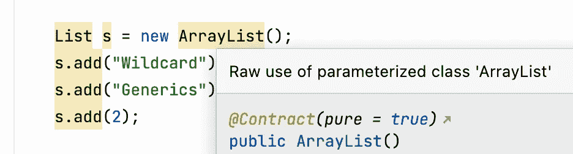

IDE 警告

你可以看到，我们可以向列表中添加任何元素，IDE 正在流血。这种行为被保留下来，这样遗留代码就不会中断，事情也就向后兼容了。在 Java 字节码中，没有类型信息。

因此，Java 在 Java 5 的集合中增加了类型信息。从那以后，编译器试图捕捉非法赋值。它相当成功，是吗？

现在，如果我们在添加类型后尝试做同样的事情，瞧！它接住了。

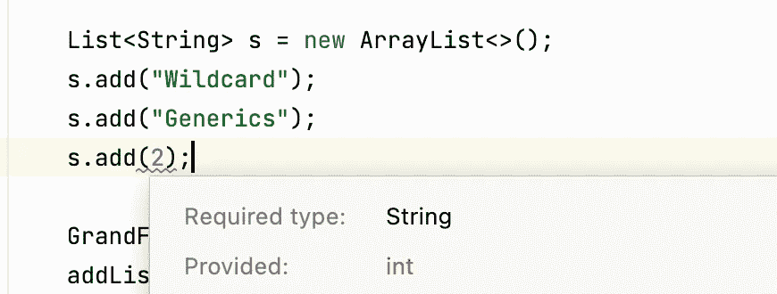

编译器警告非法赋值

让我们试着弄脏我们的手，尝试一些真实的东西。假设您正在构建一个具有调度程序和任务的框架。为此，您有一个基本任务和它的多个实现。

`startJob(task)`能接受多种工种。现在，需求发生了变化，我们需要提交一份工作清单。简单的东西！我们再次做出改变。糟糕的是，这种事情发生了！"不允许列表< RxWork >"

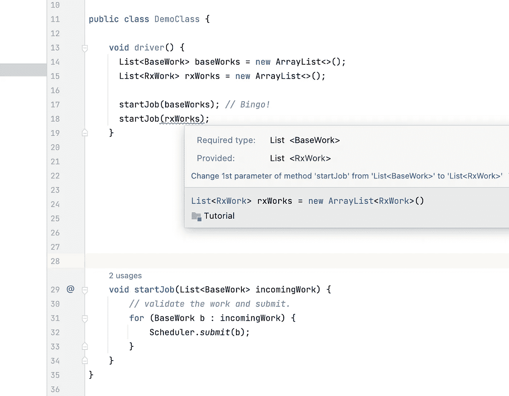

没有通配符，集合不是直接协变的。

发生这种情况的原因如下:

> 即使 RxWork 是 BaseWork 的子级，List <rxwork>也不是 List <basework>的子级。"</basework></rxwork>

但是嘿！为什么不呢？为什么 Java 工程师不让我们这么做？

试着这样理解:假设他们也让我们通过了`List<RxWork>`。然后，在提取工作对象时，有人可能已经使用了`RxWork`引用来提取工作项，如下所示。而且，如果该项实际上是一个`BaseWork`，那么该引用将被分配给子引用——这将导致运行时崩溃。

```
void startJob(List<BaseWork> incomingWork) {
    *// validate the work and submit.* for (RxWork b : incomingWork) { // Will crash as BaseWork cast to RxWork will give ClassCastException in runtime. Same problem as arrays.
        Scheduler.*submit*(b);
    }
}
```

为了避免使数组有风险的同样的陷阱，这在集合中是不允许的。

但是，这是一个有效的技术用例，Java 工程师知道这一点。要做你想做的，你必须声明你的`List`是协变的。并且只有当编译器保证不允许任何人提取除了`BaseWork`之外的任何内容时，才允许安全的协方差行为。那样的话，如果列表实现了`BaseWork`，我们总是安全的！

我们可以通过以下方式使`List<BaseWork>`协变:

```
List<? extends BaseWork>
```

在上面的代码中，看看我们如何传递任何一个`BaseWork`实现的列表。看看提取`RxWork`如何显示协变列表中的错误。

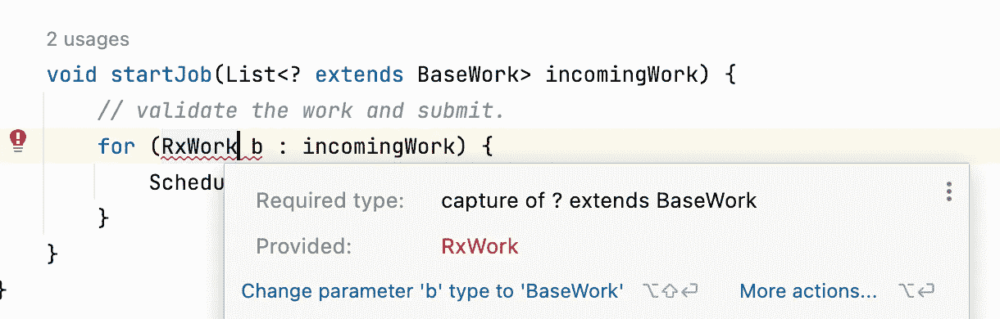

但是我们工程师很聪明，如果在`startJob()`方法中修改列表会怎么样。为了超越这种聪明，它也被屏蔽了。一旦访问了协变列表的引用，就不能再向其中添加任何内容。这里，`incomingWork`是协变的。

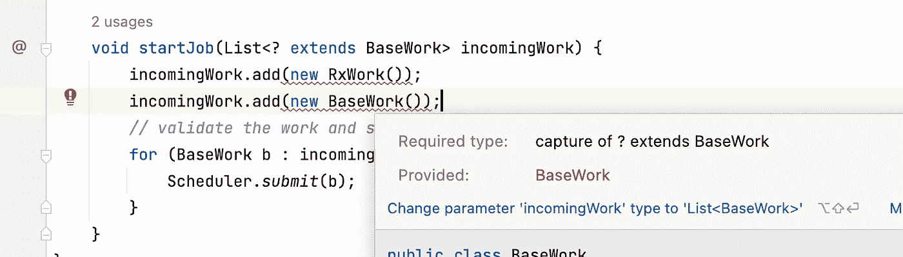

这确保你永远不会在运行时以`ClassCastException!`结束。编译器确保如果我们正在访问`BaseWork`的协变列表，那么该项至少是`BaseWork`，所以它是允许的。你可以两全其美。您可以通过创建关系`List<RxWork> is subtype of List<BaseWork>`来编写通用代码，并且不会以运行时错误而告终。

这就是你如何发挥你的通配符！因此它被恰当地命名。这也称为应用“上限”因为它将保存 extends 关键字之后的类的任何子类型。

## 集合外协方差

协方差仅仅与集合相关吗？号码

理解我们如何利用通配符来构建好的 API。让我们假设有一个类层次结构。“孩子”是“父亲”的子类型，“父亲”是“祖父”的子类型。请参见下面的层次结构。

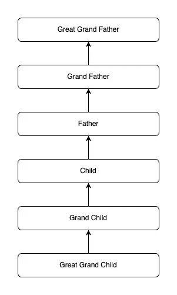

而且有一个叫`Box`的类可以容纳对象。

现在，我们知道了`grandFather`、`Father`、`Child`之间的关系。让我们看看是否可以在持有这些对象的`Box`之间建立类似的关系。

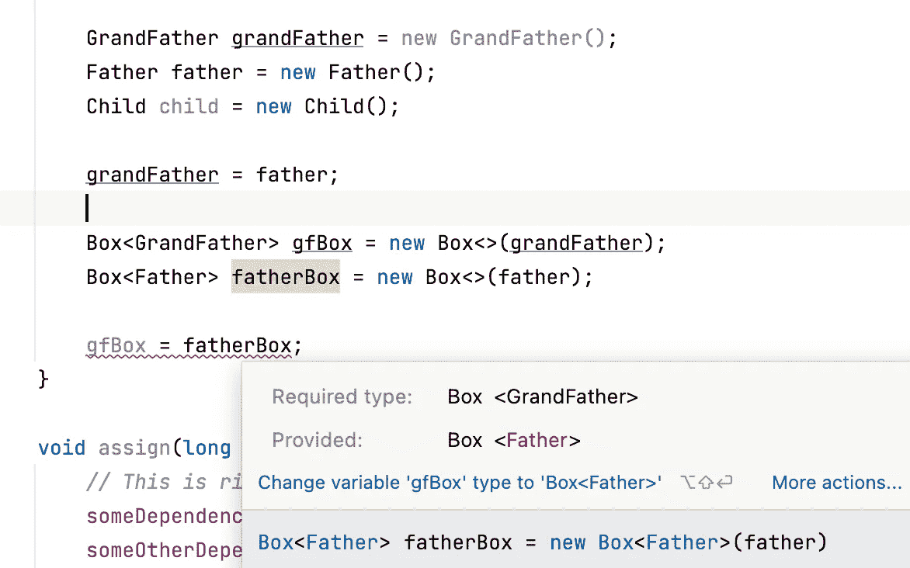

我们可以看到`grandFather`引用可以容纳`Father`。但是`Box<GrandFather>`撑不住`Box<Father>`。

从我们所学的，我们知道我们必须使`Box`参考协变。让我们试着去做，看看会发生什么。

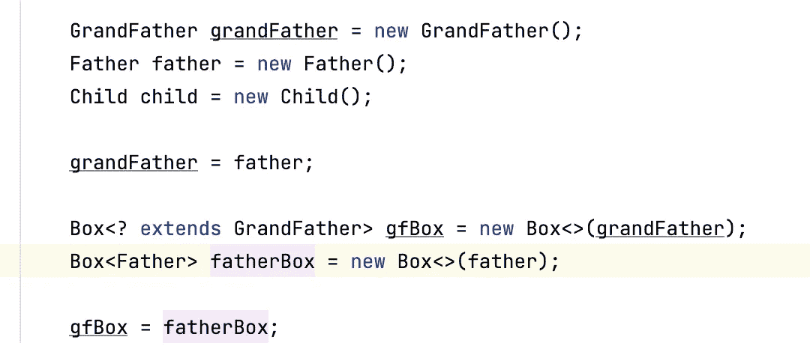

现在，`Box<Father>`可以赋给`Box<? extends Grandfather>`。

协变列表将显示两种行为:

1.  我们只能提取对上限类的对象的引用(本例中为`grandFather`)。我们来实验一下。我们在下面看到，我们可以很容易地提取`grandFather`，但提取`Father`失败。

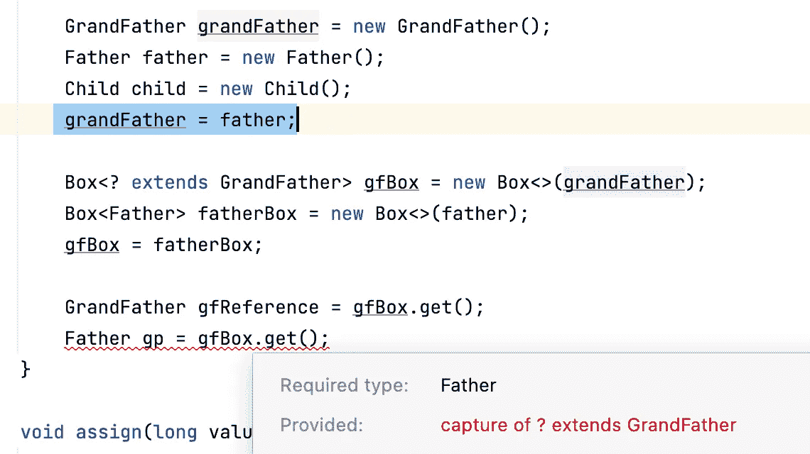

2.我们不能像在`List<>`中那样修改`Box`类的内容。编译器会阻止我们使用`setItem(T item)`方法。很奇怪，对吧？

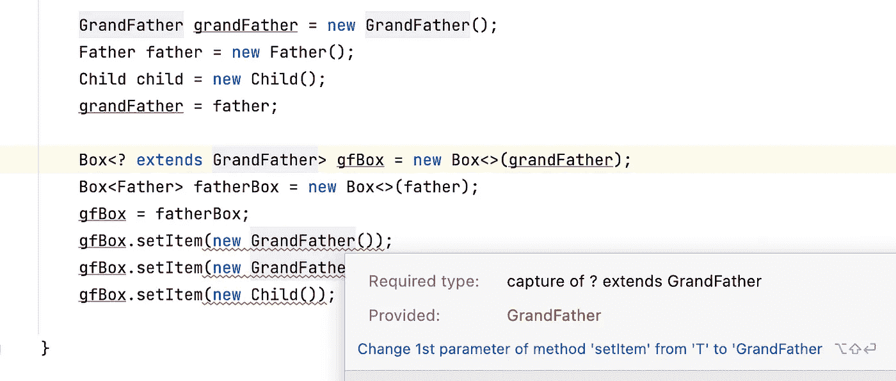

我们可以将容器类设为只读。我们又打出了我们的通配符！

# 我们学到了什么

1.  协方差可用于在容器类型(HT)之间建立与包含对象之间相同的父子关系——其中没有现成的 Java 提供的关系。
2.  可用于将持有者类型设置为只读(只读取上限类型)。
3.  限制 HT 只返回“上限”类引用。

## Java 中的协方差与 Kotlin 中的协方差

在 Java 中，我们看到协方差可以通过使用`<? extends SomeClass>`来获得。但这只能在 holder 类之外完成。在上面的`Box`的例子中，我们在`Box`类之外创建的新的`Box`引用被声明为协变的，而不是实际的`Box`类。这被称为调用点差异。由于差异是在使用地点定义的，因此也称为使用地点差异。

在 Kotlin 中，比我们在 Java 中看到的更进一步，我们可以通过使用`out`操作符在编写 holder 类本身时声明一个类是协变的。

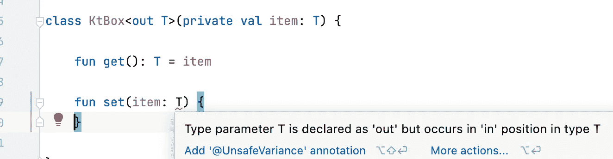

out 运算符的用法。

我们看到，当我们编写一个接受`T`作为参数的方法时，声明一个类开始显示错误。换句话说，将`T`声明为 out 将不允许您编写任何接受`T`作为参数的方法。`T`只能是返回类型，故名`out`。

我们在科特林的呼叫站点免费获得以下行为。我们必须在 Java 中为相同的内容创建协变引用。

1.  只能从`KtBox`对象中提取上限类。

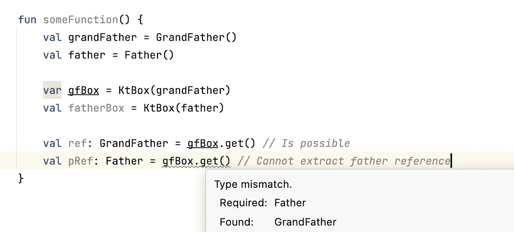

2.`KtBox<Father>`可以被赋值给`KtBox<Grandfather>`，而不需要我们在 Java 中通过创建协变引用所做的任何额外工作。

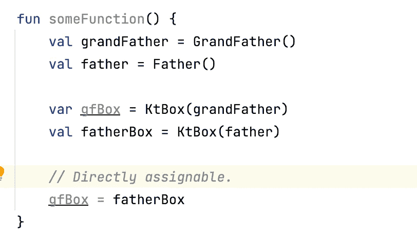

Kotlin 协方差可以在创建 holder 类时定义。因此，它也被称为“声明站点协方差”

# 何时使用协方差的例子，又名 Extends XXXX>

1.  同时构建一个 API，从用户那里接受一些 holder 类并对其进行操作。例如，创建一个接受工作列表的`startWork(List<? extends BaseWork works)`方法。并且工作对象可以有多种实现，比如`RxWork`、`CoroutineWork`、`ThreadWork`等。
2.  我们也不想修改用户对它的请求，这会使你的框架方法内部的引用成为只读的。
3.  当你想构建一个像`Box<>`一样的 holder 类，但是你想让它是只读的。

# 离别赠言

这是一篇很长的文章，但我希望你能抓住要点。还有一种方差叫逆方差，和那个正好相反。我们会在[下篇](https://medium.com/better-programming/understanding-contravariance-the-java-wildcard-149853da1559)中详细讨论。