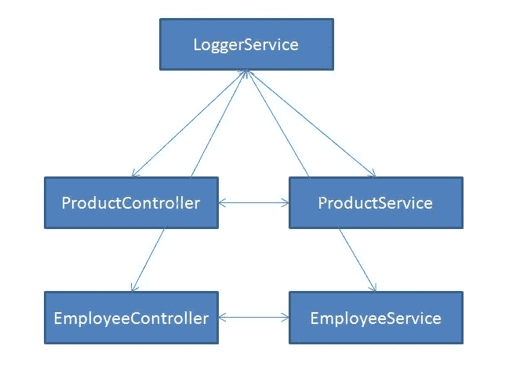
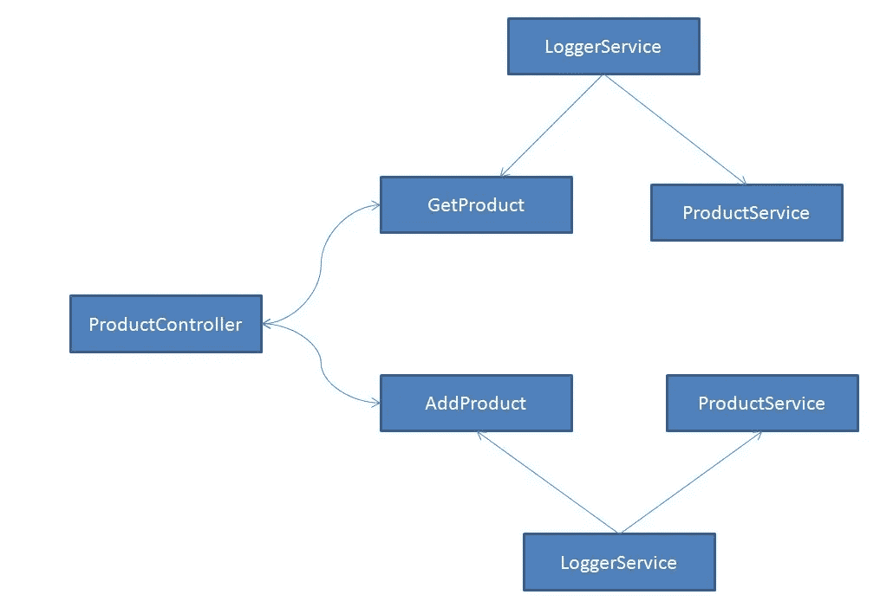
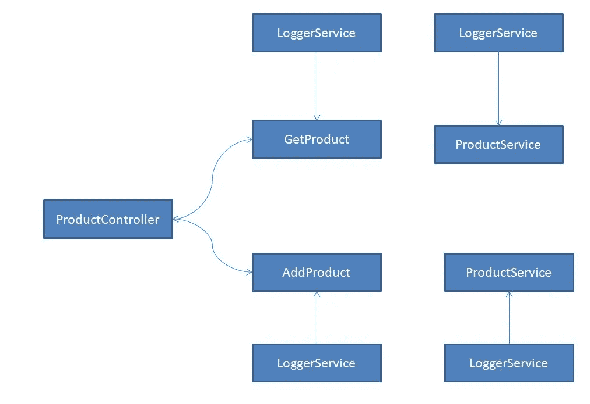

# 深入研究 NestJS 注入范围

> 原文：<https://betterprogramming.pub/a-deep-dive-into-nestjs-injection-scope-d45e87fd918d>

## 我们如何使用它们？


在我的上一篇文章中，我们讨论了 NestJS 服务。在这篇文章中，我们将看看注射范围。

# 提供者范围

有三种模式来定义范围。我们可以在服务级别或模块级别定义范围属性。它可以与基于类和基于非类的服务以及控制器一起使用。这三种模式是:

*   `DEFAULT`
*   `REQUEST`
*   `TRANSIENT`

定义范围的语法如下:

## **为服务**

```
@Injectable({
    scope: Scope.TRANSIENT
})
```

## **用于模块**

```
providers : [{
    provide : PRODUCT,
    useValue: Product_Token,
    scope : Scope.REQUEST
}]
```

## **用于控制器**

```
@Controller({ path: 'product', scope: Scope.REQUEST })
```

现在我们知道了如何使用 scope 属性，让我们来详细了解一下它们。

# 默认范围

您不需要将范围定义为`DEFAULT.`当您不定义属性时，它被设置为`DEFAULT`，并且实例将是单例的(这意味着一旦连接建立，相同的实例将用于所有请求)。

对于大多数情况，比如数据库连接和日志服务，singleton 是最好的选择。

在下面的例子中，显示了 singleton 中的一个`LoggerService`，任何使用`LoggerService`的控制器/服务都将获得相同的实例。



默认范围

# 请求范围

在`REQUEST`范围内，同一个实例将被同一个请求共享。

您可以在下图中看到`LoggerService`是为每个请求共享的。`GetProduct`动作和`ProductService`将共享同一个实例，如果我们试图访问一个`AddProduct`动作，将会创建另一个实例。

一个实时用例是，如果我们想要为每个请求在控制器和服务之间共享`Request`对象。



请求范围

# 瞬态范围

在`TRANSIENT`范围内，将为我们使用它的每个控制器或服务创建一个新实例。下图显示了范围更改为`TRANSIENT`的相同场景。这里为每个动作和服务创建了一个新的`LoggerService`实例。



瞬态范围

## 密码

使用以下命令创建一个新的`LoggerService`:

```
nest generate service Logger
```

接下来，将服务注入到`ProductController`和`ProductService`中。

接下来，运行应用程序。改变作用域，看看作用域是如何变化的。

# 结论

虽然有一个单例实例是可以的，但是根据文档，使用`REQUEST`和`TRANSIENT`作用域会影响[性能和](https://docs.nestjs.com/fundamentals/injection-scopes#performance)性能。

但是可能会有我们需要改变范围的情况——但是在你确定之前，就使用`DEFAULT`范围。