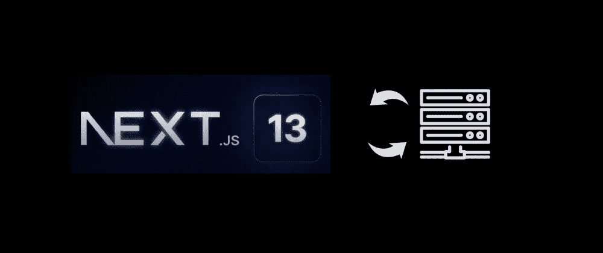
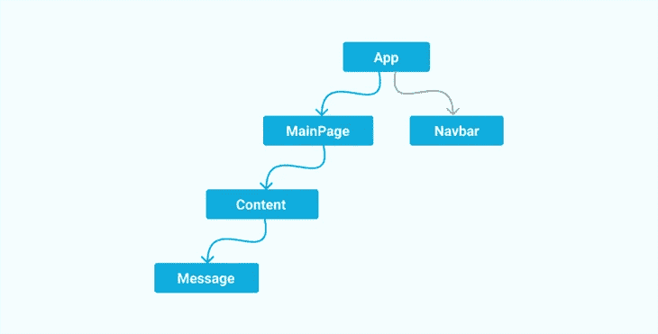
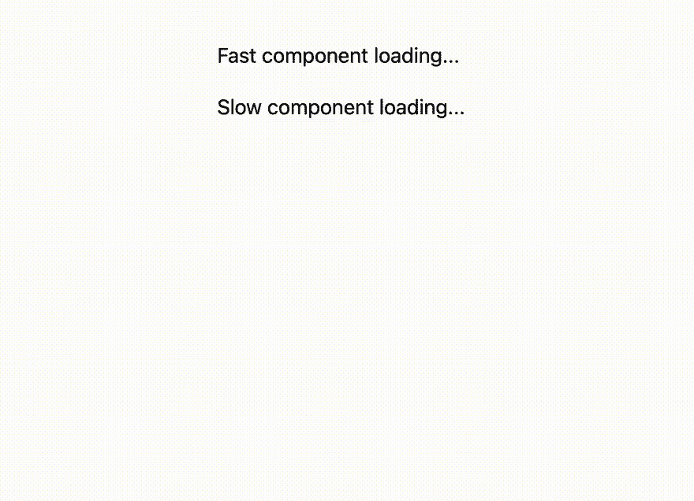
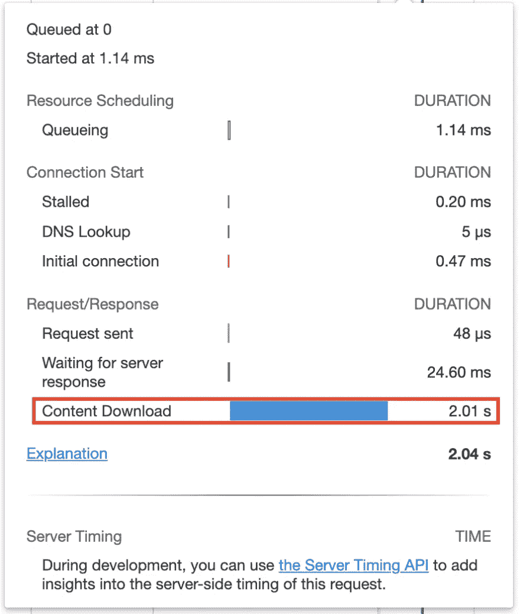
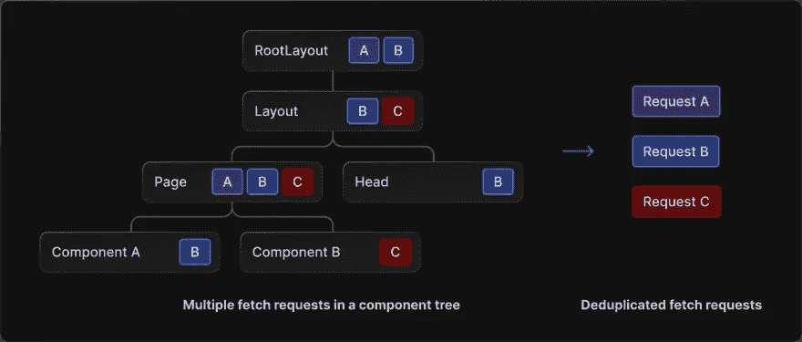
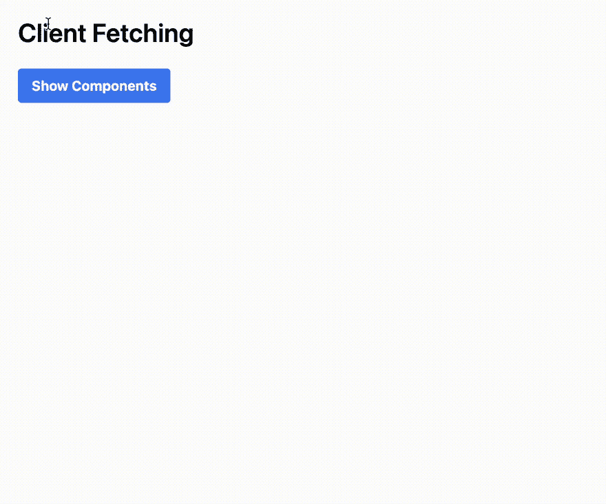

# 探索 Next.js 13 的数据提取

> 原文：<https://betterprogramming.pub/a-deep-dive-into-next-js-13-data-fetching-220d7cca8066>

## Next.js 13 测试版功能的快速概述



Next.js 13 以一种有些令人困惑的方式登陆。增加了许多显著的东西；不过，好的部分还是 Beta。尽管如此，Beta 特性给了我们关于 Next.js 的未来将如何形成的重要信号，所以有很好的理由密切关注它们，即使你打算等待采用它们。

本文是关于 Beta 特性的系列体验的一部分。今天，让我们来看看最不成熟的部分——新的**数据获取模式**。

在 Next.js 13 之前，页面级数据获取模式非常简单:

*   如果您的页面(大部分)是静态的，那么实现一个`getStaticProps`来获取数据，以便在构建时(以及在 [ISR](https://nextjs.org/docs/basic-features/data-fetching/incremental-static-regeneration) 时)获取数据。
*   如果您的页面是动态的，那么在服务器端实现一个`getServerSideProps`来获取每个请求的数据。
*   对于依赖于用户交互的数据，在页面呈现后，在客户端的`useEffect`钩子内提取。

这在 Next.js 13 中得到了彻底的革新(如果你选择实验性的特性的话)。但是在我们看到新的东西之前，让我们反思一下旧世界的问题。

# 旧模式的问题

## 1.看起来不自然

```
export default function Page({ data }) {
  // Render data...
}

export async function getServerSideProps() {
  const res = await fetch(`https://.../data`)
  const data = await res.json()
  return { props: { data } }
}
```

`getServerSideProps`的唯一目的是为`Page`计算道具，然而你必须将它们作为两个独立的功能并排放置。我通常不反对基于约定的 API，但是这种模式看起来不必要的冗长。

## 2.这经常会导致“支柱钻探”

“道具演练”是指当你在渲染树的某个很高的位置有一个复杂的状态对象，并且需要向下传递它的一部分(或全部)时。写起来既繁琐，读起来又费劲。



[https://blog . log rocket . com/solving-prop-drilling-react-apps/](https://blog.logrocket.com/solving-prop-drilling-react-apps/)

虽然 prop drilling 不是 SSR 或 SSG 特有的，但是数据获取函数——`getStaticProps`和`getServerSideProps`——是它的自然来源。因为在采用 SSR/SSG 时，您希望在服务器端为一个页面获取所有可能的数据，而数据获取模式要求它发生在一个集中的地方；你将不得不沿着树传播一大块道具。

有适当的补救措施，比如使用上下文 API 或[组件组合模式](https://reactjs.org/docs/composition-vs-inheritance.html)，但是这要么阻碍了组件的可重用性，要么要求你仔细设计它们。

换句话说，问题的根本原因是数据获取不能与使用数据的组件并置。

## 3.要么全有，要么全无

当使用`getServerSideProps`时，无论页面加载是由浏览器重新加载还是客户端路由触发，新的页面内容都不会显示，直到数据提取完全完成(异步`getServerSideProps`函数解析)。如果您的页面同时包含“快速数据”和“慢速数据”，这可能会有问题。例如，data dashboard 就是一个典型的场景:一些卡可以瞬间加载，而其他卡可能需要很多秒。

# Next.js 13 中有什么改进

Next.js 13 中引入的新数据获取模式抛弃了您所熟悉的一切:`getStaticProps`、`getServerSideProps`，甚至对于客户端获取，还有一个新的`use`钩子可能会取代`useEffect`中的旧获取方式。

新模式与 React 服务器组件深度耦合。如果您对它不熟悉，最好查看本系列的前一篇文章:

[](/fun-with-next-js-13-server-components-fd5f886c31f3) [## 探索 Next.js 13 服务器组件

### Next.js 13 测试版特性的快速概述

better 编程. pub](/fun-with-next-js-13-server-components-fd5f886c31f3) 

请注意，这些新特性仍处于试验阶段，我不建议在生产中使用它们。

## 异步服务器组件

在过去，组件是同步的，你不能在组件的顶层`await`。在 Next.js 13 中，默认情况下所有组件都是“服务器”，并且可以是异步的。最后，我们可以在 React 组件中使用我们熟悉的 async/await 语法。

这使得数据获取更加容易和灵活。最好的事情是，您可以将服务器端获取逻辑分布到多个位置，并将它们与使用数据的组件放在一起。

让我们看一个例子，两个组件都从 API 获取随机报价:

```
// app/server-async-fetching/page.js

// a page containing a fast-loading and a slow-loading components,
// both are server components

import Quote from '../../components/server/Quote';

export default function AsyncLoading() {
    return (
        <div>
            <Quote />
            <Quote slow={true} />
        </div>
    );
}
```

```
// lib/quote.js

// utility for fetching random famous quotes from API, allowing simulation of a
// slow request

import sleep from 'sleep-promise';

export async function getQuote(delay = 0) {
    if (delay) {
        await sleep(delay);
    }
    return (
        await fetch('https://api.quotable.io/random?tags=technology')
    ).json();
}
```

```
// components/server/Quote.js

import { getQuote } from '../../lib/quote';
import os from 'os';

export default async function Quote() {
    const quote = await getQuote(slow ? 2000 : 0);
    return (
        <div>
            <p>
                {slow ? 'Slow' : 'Fast'} component rendered on
                <span>${os.hostname()}</span>
            </p>
            <blockquote>
                {quote.content}
            </blockquote>
        </div>
    );
}
```


从 API 获取报价的运行结果

这是可行的，有了更干净的异步/等待代码；然而，它仍然受到“全有或全无”问题的困扰。只有当快速和慢速组件都完成获取时，页面才会呈现。

我们可以通过在组件周围添加`<Suspense />`来改进它。悬念最初是 React 为了支持[代码拆分](https://reactjs.org/docs/code-splitting.html)而加入的；现在，它可以用于为尚未解析的异步组件提供后备 UI，因此它们可以无阻塞地呈现:

```
export default function AsyncLoading() {
    return (
        <>
            <div>
                <Suspense fallback={<p>Fast component loading...</p>}>
                    <Quote />
                </Suspense>

                <Suspense fallback={<p>Slow component loading...</p>}>
                    <Quote slow={true} />
                </Suspense>
            </div>
        </>
    );
}
```



从 API 获取报价的运行结果—改进。

现在好多了。您可以看到页面及其两个子组件的呈现是完全异步的。React 扩展了悬念的功能，支持任意的异步操作。它现在可以很好地与异步服务器组件一起工作。

悬疑的酷之处在于“取消挂起”组件不需要额外的 API 请求或 WebSocket 连接。相反，通过将虚拟 DOM(包装在`<script/>`中)附加到 HTML 文档，新的页面内容被传输到浏览器。这可以通过查看文档请求的时间来确认:



获取 HTML 文档的 Chrome 网络活动

## 自动重复数据删除`fetch`

您可能已经注意到的另一件有趣的事情是，尽管快速组件和慢速组件分别发出 API 请求(使用 fetch ),但是它们得到了相同的引用内容。这是由于 React 的另一个重要更新——fetch 调用(在服务器端)会自动进行重复数据删除:

> *如果您需要在一个树的多个组件中获取相同的数据(例如当前用户)，Next.js 将自动在临时缓存中缓存具有相同输入的* `*fetch*` *请求。——*[https://beta.nextjs.org/docs/data-fetching/fundamentals](https://beta.nextjs.org/docs/data-fetching/fundamentals)



[https://beta . nextjs . org/docs/data-fetching/fundamentals # automatic-fetch-request-dedupling](https://beta.nextjs.org/docs/data-fetching/fundamentals#automatic-fetch-request-deduping)

这有助于我们解决旧数据获取模式的另一个问题——道具钻取。通过自动提取重复数据删除，在渲染过程中提取相同的资源只会生成一个 HTTP 请求，因此您可以自由地在需要渲染数据的地方提取数据，而不必担心额外的成本。很酷，不是吗？

## 客户端数据提取

在以前版本的 Next.js(和 React)中，客户端数据获取不在框架的考虑范围之内。你可以使用任何你想要的库，第三方工具如 [SWR](https://swr.vercel.app/) 和[反应查询](https://react-query-v3.tanstack.com/)很好地解决了这个问题。

Next.js 13(应该更公平地说是最新的 React)向前迈进了一步，提供了一个内置的`use`钩子作为从承诺中解开数据的通用 API。不如直接用`async`/`await`(React 解释的[)理想，但是让客户端抓取感觉足够接近服务器端。](https://github.com/acdlite/rfcs/blob/first-class-promises/text/0000-first-class-support-for-promises.md#why-cant-client-components-be-async-functions)

让我们通过一个例子再次看看它是如何工作的(所有组件客户端组件，因为它们被标记为“使用客户端”):

```
// app/client-fetching/page.js

'use client';

import { useState, Suspense } from 'react';
import Quote from '../../components/client/Quote';

export default function ClientFetching() {
    // use a button to toggle the loading of components to make sure 
    // they're rendered on the client-side
    const [show, setShow] = useState(false);

    return (
        <>
            <h1>Client Fetching</h1>
            <button onClick={() => setShow(true)}>
                Show Components
            </button>

            {show && (
                <>
                    <div>
                        <Suspense fallback={<p>Fast component loading...</p>}>
                            <Quote />
                        </Suspense>

                        <Suspense fallback={<p>Slow component loading...</p>}>
                            <Quote slow={true} />
                        </Suspense>
                    </div>
                </>
            )}
        </>
    );
}
```

```
// components/client/Quote.js

'use client';

import { getQuote } from '../../lib/quote';
import { use } from 'react';

const quoteFetch = getQuote();
const quoteFetchSlow = getQuote(2000);

export default function Quote({ slow }) {
    const quote = use(slow ? quoteFetchSlow : quoteFetch);
    return (
        <div>
            <p>{slow ? 'Slow' : 'Fast'} component rendered</p>
            <blockquote>{quote.content}</blockquote>
        </div>
    );
}
```



使用“use”挂钩进行客户端提取的运行结果

这比我们以前所做的更干净:取入`useEffect`并将结果存储在一个状态变量中。它也足够接近它在服务器组件中的外观。

谨慎的读者可能已经注意到结果看起来与我们在服务器组件中看到的不同。你说得对；这两个组件提供了两种不同的报价。这个`fetch`调用在客户端是不重复的。我不知道这是设计好的还是需要修复的(我希望如此)。然而，由于`use`钩子是通用的，并且可以在任何情况下工作，我想你可以在`fetch`周围实现一个缓存层，没有问题。

# 前路漫漫

新的数据获取模式是一个巨大的变化，看起来令人兴奋，但同时也有点令人困惑。文档包含关于在多个地方什么可以做什么不可以做的模糊描述。Typescript 支持也不完整。我认为这主要是因为它的基础——React 的异步服务器组件和`use`hook——太新了，还没有完善。在这部分产品投入生产使用之前，还有很长的路要走。

我喜欢异步服务器组件的想法。这是一种将更多计算转移到服务器端、减少客户端捆绑包大小以及保持跨网络边界的相对一致的编程模型的极好方法。然而，与此同时，当我开始认真地采用它时，我也预计会遇到许多困惑、反模式和神秘的错误。

你可以在这里找到演示项目代码[，在这里找到该系列的其他故事:](https://github.com/ymc9/nextjs-data-fetching)

[](/fun-with-next-js-13-server-components-fd5f886c31f3) [## 探索 Next.js 13 服务器组件

### Next.js 13 测试版特性的快速概述

better 编程. pub](/fun-with-next-js-13-server-components-fd5f886c31f3) [](/an-overview-of-next-js-13-routing-system-1dcf73e2429f) [## Next.js 13 路由系统概述

### Next.js 13 测试版功能的快速概述

better 编程. pub](/an-overview-of-next-js-13-routing-system-1dcf73e2429f) 

感谢阅读！

```
Want to Connect?

I'm the creator of [ZenStack](https://zenstack.dev/?utm_campaign=medium&utm_medium=organic&utm_content=nextjs_data_fetching), a toolkit that supercharges
Prisma ORM with a powerful access control layer and
unleashes its full potential for full-stack development.
Our goal is to let you save time writing boilerplate code
and focus on building what matters - the user experience.
```