# 深入了解我们的 DeepLens 篮球裁判

> 原文：<https://betterprogramming.pub/a-deep-dive-into-our-deeplens-basketball-referee-c8ed96affd82>

## 使用计算机视觉和 AWS DeepLens 将篮球带入未来

# 概观

篮球不仅会导致脚踝骨折，还会导致关系破裂。从含糊不清的犯规争论到两分球或三分球的争论，临时抱佛脚的比赛可能会变成长期的争斗。进入我们的篮球虚拟裁判。篮球虚拟裁判的目标是让玩家更容易玩游戏，让他们更专注于玩游戏本身，而不是跟踪投篮，记忆比分和检测犯规(没有什么比视频回放功能更好了)。

对于我们的第一次迭代，团队专注于镜头检测。该团队训练了一个微软定制视觉模型来识别人、篮球和篮球框，并训练了第二个模型来检测篮球进入篮框。AWS 云应用程序利用这些机器学习模型来识别包含所需对象的 DeepLens 帧，通过 S3 和 DynamoDB 传递图像及其元数据，并最终在拍摄时输出到 UI。

# 什么是 DeepLens？

AWS DeepLens 是一个支持无线的摄像机和开发平台，与 AWS 云集成在一起。它允许您使用最新的人工智能(AI)工具和技术来开发基于深度学习模型的计算机视觉应用程序。

DeepLens 类似于人工智能驱动的谷歌 Clips 相机，但虽然 Clips 的目标是消费者，但 DeepLens 是一个新的，令人兴奋的开发人员工具。根据亚马逊网站的说法，这是第一款旨在教授深度学习基础知识的摄像机，并优化了在摄像机上运行机器学习模型。

# 什么是微软定制愿景？

自定义视觉服务使用机器学习算法对图像进行分类。你，开发人员，必须提交一组图像的特点和缺乏分类的问题。您在提交时指定图像的正确标签。然后，该算法对该数据进行训练，并通过对该数据进行自我测试来计算自己的准确性。一旦模型被训练，你可以测试，重新训练，并最终使用它来根据你的应用程序的需求对新图像进行分类。您还可以导出模型本身以供脱机使用。

# 在幕后

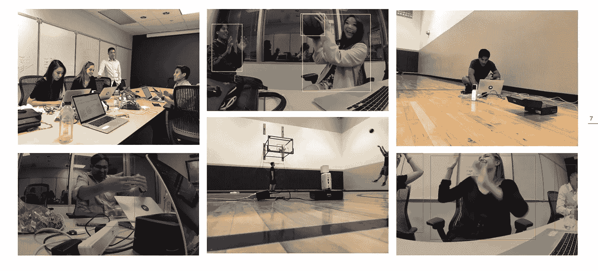

团队:莫吉·帕坦甘、穆罕默德·纳维瓦拉、索菲亚·泰、布列塔尼·哈灵顿和亚历克斯·泰

# 体系结构

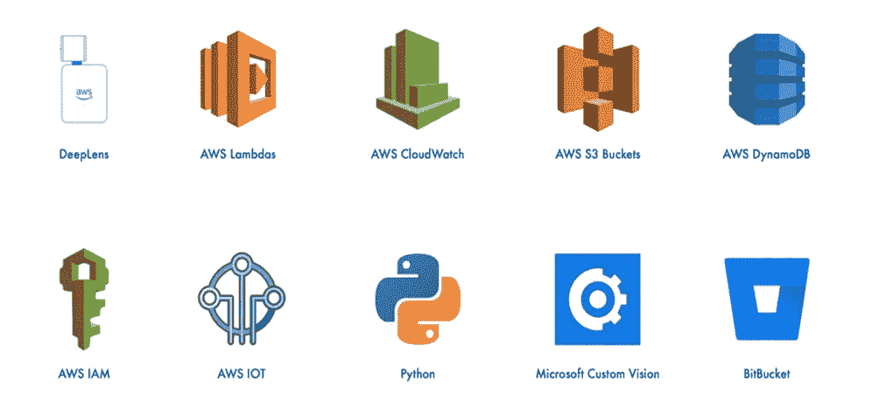

技术栈

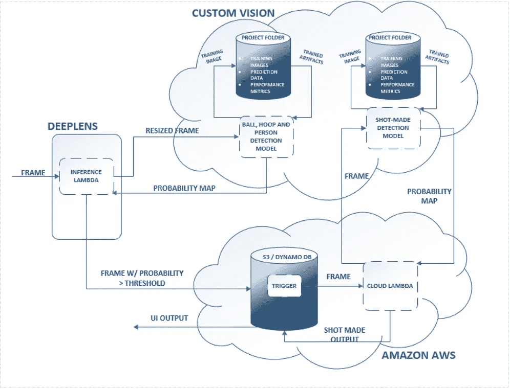

系统图

# 视频演示

如果你宁愿看视频而不是看下面的文章，请随意使用这个！

视频漫游

# 我们如何创造它

下面是我们用 AWS DeepLens 创建的篮球虚拟裁判:

*   亚马逊 DeepLens 设备
*   AWS 帐户
*   Microsoft 自定义 Vision 帐户(免费)
*   笔记本电脑或电脑
*   手或其他与计算机交互的方式

# 训练目标检测自定义视觉模型

首先，我们收集了人类、篮球和篮球框的图像。它们可以是单独的图像，也可以都在同一张照片中。

一旦我们有了自己的图像，我们就创建了一个免费的微软定制视觉账户:[https://www.customvision.ai/](https://www.customvision.ai/)。

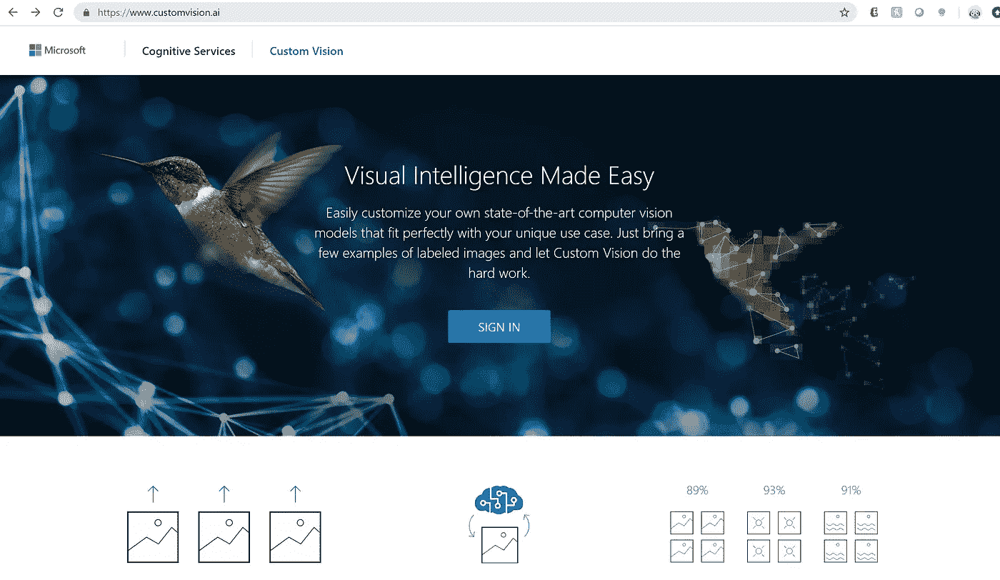

在这里，我们训练我们的对象检测模型来识别你的三个对象(球员/人、篮球和篮球架)。

一旦模型被训练得具有足够高的精度和召回率，我们需要一种方法将我们的 DeepLens 相机馈送传递到自定义视觉模型中。视频提要只是一系列的帧，所以我们需要将每一帧传递到模型中来检测这三个对象。

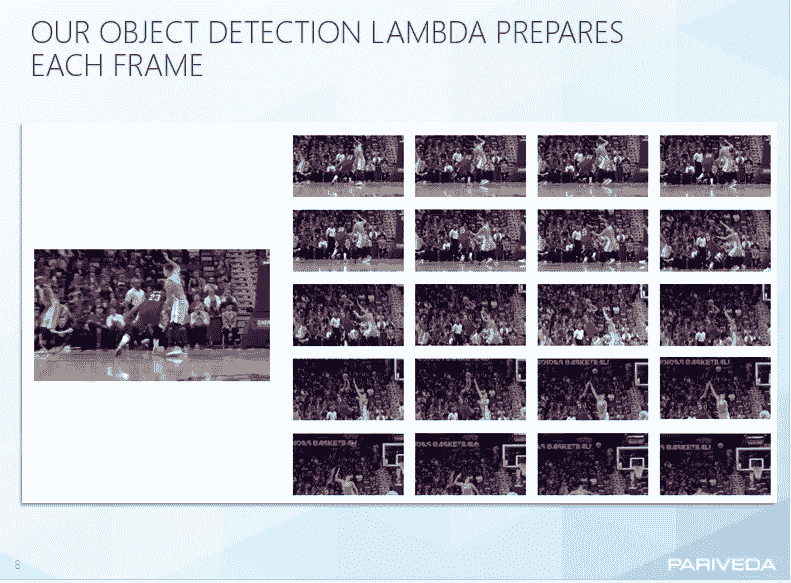

你可以用很多方法做到这一点。我们选择使用 AWS Lambda，因为 DeepLens 是亚马逊套件的一部分。要了解更多关于创建一个，使用[这个链接](https://docs.aws.amazon.com/toolkit-for-eclipse/v1/user-guide/lambda-tutorial.html)。

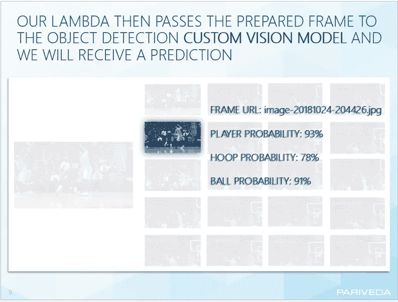

下面是我们如何点击自定义 Vision API 并取回概率的片段。

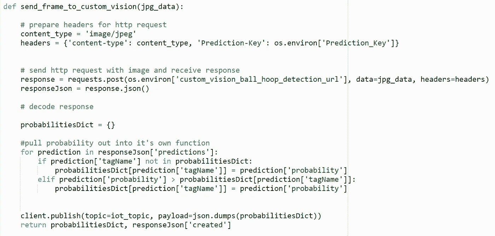

输出如下所示:

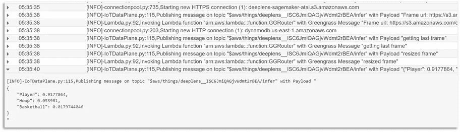

接下来，如果图像中出现篮圈和篮球的概率超过 40%，我们将该帧存储到 S3 实例中，并在 DynamoDB 中插入一条新记录(如果您还没有旋转的 S3，请放心[现在就创建一个](https://docs.aws.amazon.com/quickstarts/latest/s3backup/step-1-create-bucket.html))。DynamoDB 记录包含关于帧的属性，但是您的记录可能不同。我们有框架 URL、概率字典(球、篮圈和球员的概率)和时间戳。

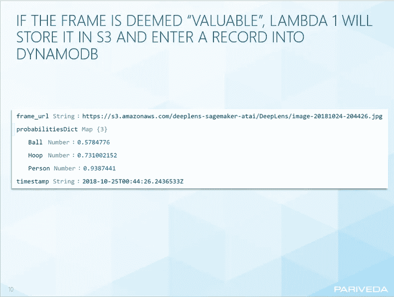

回到 lambda——如果有 40%或更多的概率，一个球员在帧中，将帧存储到 S3(不考虑篮圈和篮球的概率)。根据产品和模型性能的需要，随时更改阈值。我们这样做是为了让系统尽可能模块化，这样我们就可以用这个输出来检测玩家的进步，并最终得到团队级别的反馈。

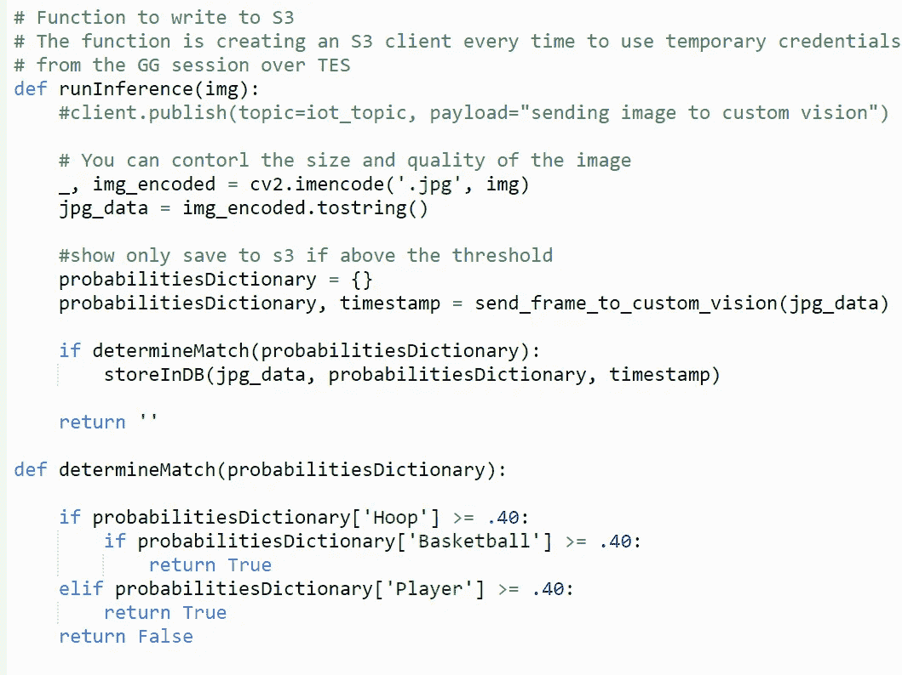

# 镜头检测

接下来，我们有了一个单独的 lambda，它是从刚刚发生的 S3 上传中自动触发的。下面是你的 S3 一旦有了图片后的样子。

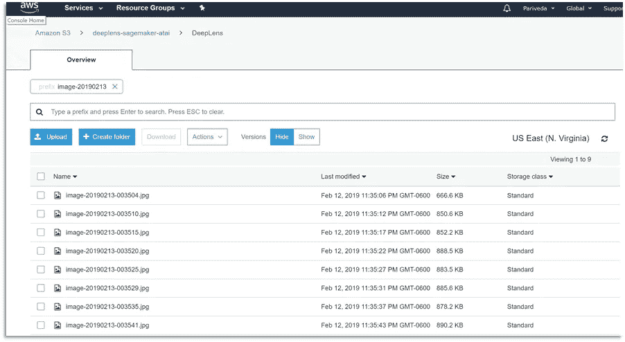

要为第二个 lambda(镜头检测)创建一个触发器，我们只需要将 S3 模块拖到左边，并填写必要的配置。

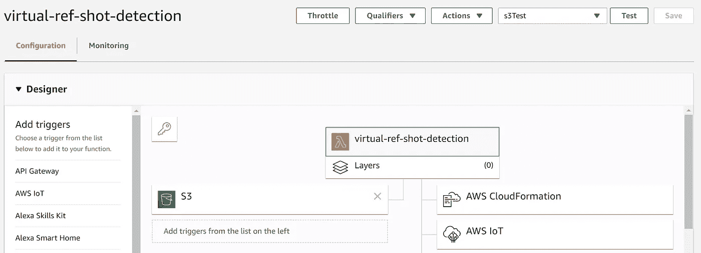

接下来，我们将触发 lambda 的帧传递到我们的第二个自定义视觉模型，以预测一个成功的镜头。同样，我们把这些分开的原因是考虑到未来球员级别或球队级别的分析功能。

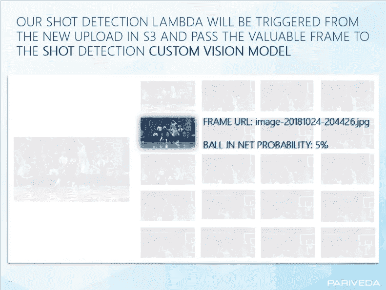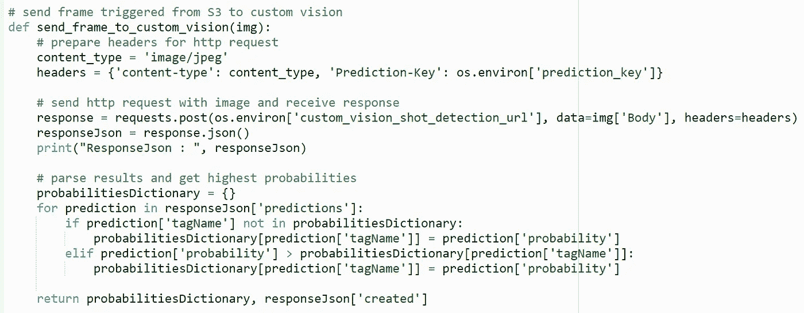

这是镜头检测模型在我们的日志中的输出:

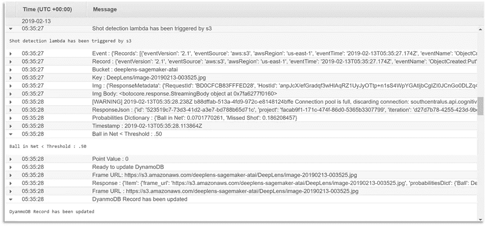

如果该帧成功拍摄的概率大于或等于 50 %,则更新 DynamoDB 记录以包含 1 的点值。如果低于 50 %,用 0 点值更新记录。

下面是最终的 DynamoDB 输出:

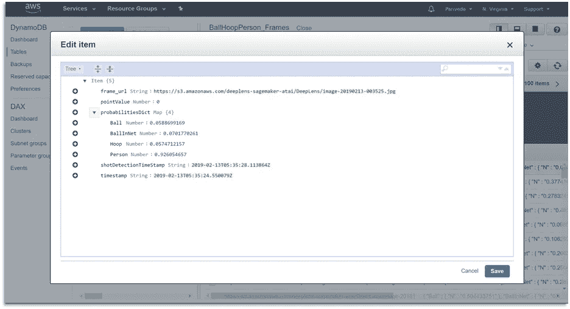

# 结论

总的来说，DeepLens 是一个容易上手的工具，让我们能够证明我们的概念。然而，由于 DeepLens 相对于其他视频处理工具的帧速率较低，它很容易错过关键时刻。对于团队技巧来说，捕捉一组连续的帧来跟踪球从球员到篮筐的过程是一个挑战。下一步，该团队有兴趣用 iPhone 取代 DeepLens 视频。我们希望这能激发你创造自己的东西，感谢你的阅读！

# 团队

Team Finesse 是 Pariveda Solutions 的内部计划，我们的主要目标是利用新兴技术创建小型、可行的概念验证。欢迎留言或通过[https://www.instagram.com/ogteamfinesse/](https://www.instagram.com/ogteamfinesse/)(@ ogteamfesse)直接给我们发消息。我们目前正致力于创建一个鼓励会面和交流机会的区块链，欢迎咨询我们！

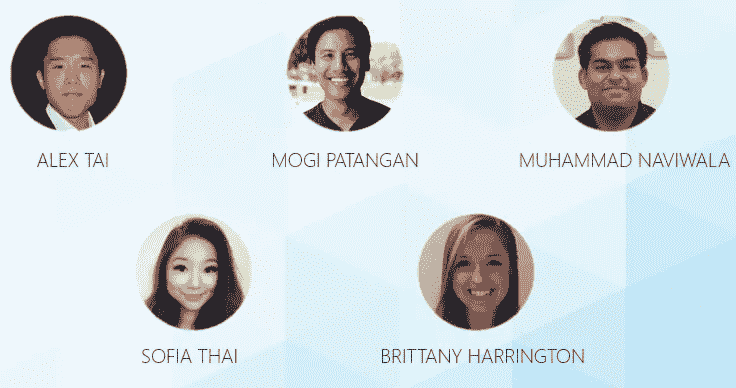

# 来源:

[https://docs . AWS . Amazon . com/deep lens/latest/DG/what-is-deep lens . html](https://docs.aws.amazon.com/deeplens/latest/dg/what-is-deeplens.html)

【https://mashable.com/2018/06/14/amazon-deeplens-camera/ 

[https://docs . Microsoft . com/en-us/azure/cognitive-services/custom-vision-service/home](https://docs.microsoft.com/en-us/azure/cognitive-services/custom-vision-service/home)