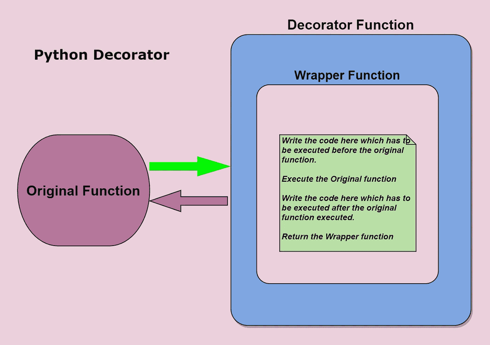
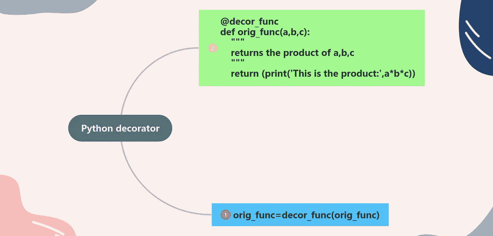
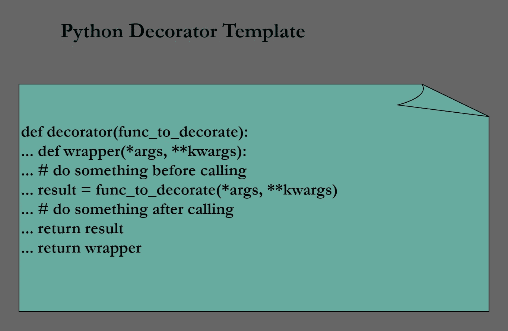
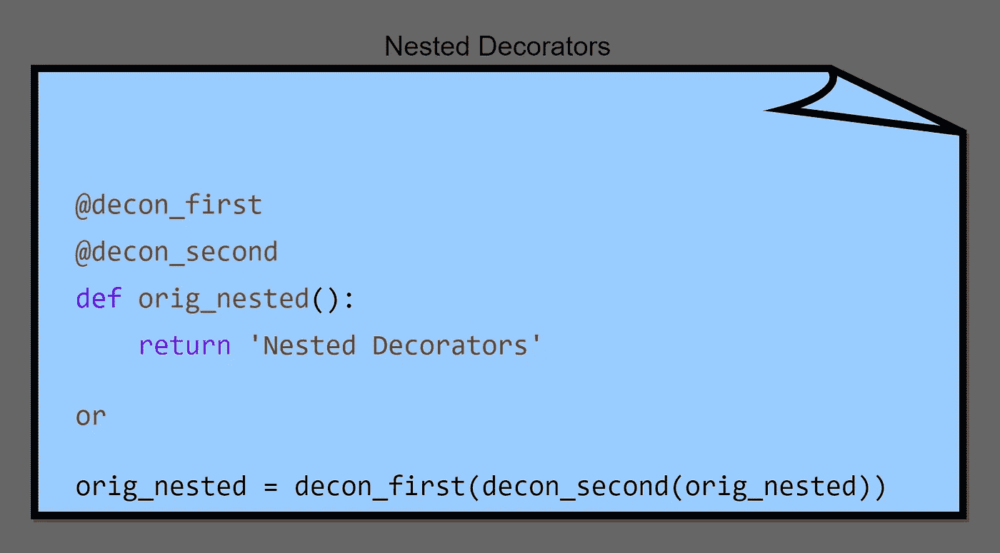
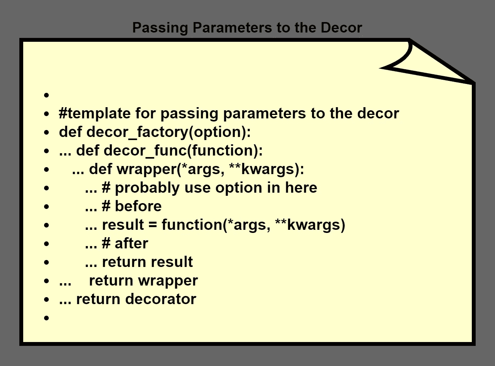
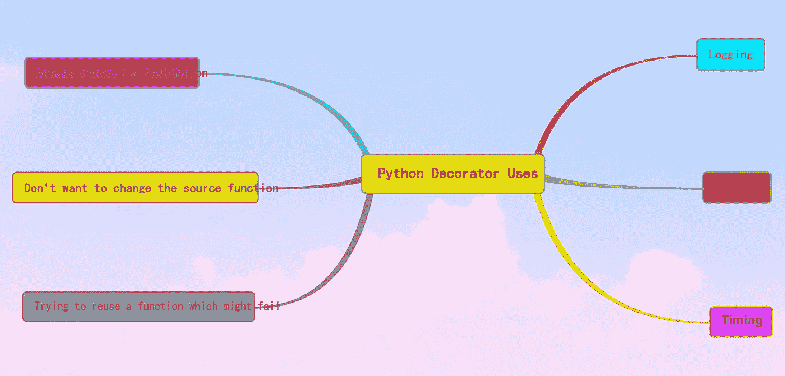

# Python Decorators 探究

> 原文：<https://betterprogramming.pub/a-deep-dive-into-python-decorators-e95291a77cfb>

## 理解日志、时间、嵌套和其他内置的 Python 装饰器


由 [Spacejoy](https://unsplash.com/@spacejoy?utm_source=medium&utm_medium=referral) 在 [Unsplash](https://unsplash.com?utm_source=medium&utm_medium=referral) 上拍摄的照片

# 介绍

Python 装饰器是一个修改另一个函数并返回一个函数的函数。Python 装饰器的概念有点难以理解。让我们详细了解一下 Python decorators。

# 内容

```
1\. [What is a Python Decorator?](#14b5)
2\. [Create a Simple Python Decorator](#f0cf)
3\. [Debugging-Fix the Function Name and Docstring](#81cf)
4\. [Nested Decorators](#5843)
5\. [Passing Arguments to the Decorator](#62de)
6\. [Passing Arguments to the Function](#9e8c)
7\. [Logged Decorator](#3fc1)
8\. [Time Decorator](#93e8)
9\. [Functools.lru_cache(Memoize)](#fab8)
10\. [Uses of Decorators](#b885)
11\. [Built-in Python Decorators](#218c)
12\. [Conclusion](#6307)
```

# Python 装饰器

*   装饰器是 Python 2.4 中引入的。
*   Python decorator 函数是一个修改另一个函数并返回一个函数的函数。
*   它接受一个函数作为它的参数。
*   它返回一个闭包。Python 中的闭包只是一个由另一个函数返回的函数。
*   装饰函数中有一个包装函数。
*   它向现有函数添加了一些额外的功能，而不改变现有函数的代码。这是装修工可以做到的。
*   装饰器允许你在函数前后执行代码；他们装饰而不修改功能本身。
*   在 Python 中，decorator 以`@` 符号开始，后跟 decorator 函数的名称。
*   装饰者减慢函数调用。



作者图片

# 创建一个简单的 Python 装饰器

让我们编码，看看它是如何工作的。

1.  下面我有一个简单的函数，它给出三个数的乘积。就叫原函数吧。

2.现在我想修改原函数的功能，而不修改原函数中的代码。这可以通过使用 Python 装饰器来完成。

现在我有以下功能:

*   我有一个名为`decor_func`的装饰函数。在装饰函数中，我有另一个名为`wrapper_func`的函数，它接受任意数量的参数——`*args` 和`**kwargs`。
*   `decor_func`将返回`wrapper_func`。
*   `orig_func`由`decor_func`装饰。

让我们看看它是如何工作的。

```
orig_func (7,9,11)
```

输出如下所示:

```
This is the product: 693
```

现在，我想在不改变上述功能的情况下添加一些功能。所以我使用了一个装饰函数，它包含一个包装函数，这个包装函数有一些代码，并且是用原始函数执行的。

*   函数是对象。
*   函数可以在函数中定义。
*   函数可以分配给一个变量。

您可以通过以下方式调用装饰函数

```
orig_func=decor_func(orig_func)
```

或者

```
@decor_func
```



作者图片

`orig_func=decor_func(orig_func)`或`@decor_func`运行`decor_func`中的`wrapper_func`。

当我执行上述代码时，输出如下:

```
Execute this code before the main function is executed.
This is the product: 693
```

现在你可以理解 Python 装饰器是如何工作的了。



作者图片

现在你知道一个基本的室内设计师是如何工作的了。我们可以探索装饰者的一些额外的概念。

# 调试-修复函数名和文档字符串

如果你在原函数上做`help`，看起来是这样的:

它给出了以下内容:

```
Help on function wrapper_func in module __main__: 
    wrapper_func(*args, **kwargs) 
    This is the wrapper function
```

这显示了包装函数的 docstring。它应该显示原始函数名和文档字符串。

我们可以通过以下解决方法实现这一点:

```
dir(orig_func)
```

Python 函数中包含以下属性:

```
[‘__annotations__’, ‘__call__’, ‘__class__’, ‘__closure__’, ‘__code__’, ‘__defaults__’, ‘__delattr__’, ‘__dict__’, ‘__dir__’, ‘__doc__’, ‘__eq__’, ‘__format__’, ‘__ge__’, ‘__get__’, ‘__getattribute__’, ‘__globals__’, ‘__gt__’, ‘__hash__’, ‘__init__’, ‘__init_subclass__’, ‘__kwdefaults__’, ‘__le__’, ‘__lt__’, ‘__module__’, ‘__name__’, ‘__ne__’, ‘__new__’, ‘__qualname__’, ‘__reduce__’, ‘__reduce_ex__’, ‘__repr__’, ‘__setattr__’, ‘__sizeof__’, ‘__str__’, ‘__subclasshook__’]
```

您可以将函数赋给变量，并显示名称和文档字符串。

```
orig_func 
returns the product of a,b,c
```

或者

我们可以使用`functools`模块中的包装。它是一个函数装饰器，将`update_wrapper()`应用于被装饰的函数。将`functools.wraps`应用到装饰器返回的包装器中，会携带输入函数`orig_func`的 docstring 和其他元数据。Python 2.5 中引入了`functools`模块。它包括函数，该函数将修饰函数的名称、模块和文档字符串复制到其包装器中。我们可以按如下方式更改代码:

# 嵌套装饰器

我们还可以有多个装饰器，如下所示:

```
This is the first decorator
This is the second decorator
Nested Decorators
```



作者图片

# 将参数传递给装饰者

您还可以将参数传递给装饰器，以便在代码中使用。

举个例子，

```
orig_func(7,9,11)
```

上面的输出如下所示:

```
Flag is False 
This is the product: 693
```

让我们来看看这是如何工作的:

*   `decor_factory`函数不是装饰函数。相反，它在被调用时返回一个装饰器。
*   传递给`decor_factory`的任何参数都可以在函数 decor 中引用(作为自由变量)。
*   `decor_factory`函数是一个装饰工厂函数。它是一个函数，每次被调用时都会创建一个新的装饰器。
*   在这种情况下，`decor_factory`返回装饰功能。`deco`函数是真正的装饰器，它将`function(fn)`作为它的参数。



作者图片

# 向函数传递参数

我们可以将参数传递给装饰包装函数，如下所示:

```
Arguments are passed: San Jose , California
My city is San Jose 
My State is California
```

如果你正在制作一个通用的装饰器——一个你可以应用于任何函数或方法的装饰器——那么就使用`*args, **kwargs`

# @记录的装饰者

尝试创建一个日志，就像函数被调用时使用的函数名等。

作者图片

输出如下所示:

```
The product of a*b*c: 90 
product: called 2022–01–16 04:41:50.483630+00:00
```

# @时间装饰者

创建一个装饰器来计算函数执行的时间。

输出如下所示:

```
The product of a*b*c: 90 
product ran for 0.001004s
```

也可以把日志和时间一起调用。

输出如下所示:

```
The product of a*b*c: 90 
product ran for 0.000092s 
product: called 2022–01–16 04:59:14.443023+00:00
```

# @functools.lru_cache(Memoize)

*   `@lru_cache` decorator，它让你能够使用**最近最少使用(LRU)策略**缓存函数的结果。它使用捕捉技术。`lru`代表“最近最少使用的”更多信息，请查看以下[链接](https://docs.python.org/3/library/functools.html)。
*   使用`@lru_cache decorator.`可以提高性能
*   捕捉可以通过使用字典来实现。
*   记忆是缓存的一种形式。我们缓存以前计算的阶乘数，这样我们就不必再计算它们了。

以下是一些例子:

# **无缓存**

这里我们创建了一个阶乘函数:

输出如下所示:

```
Factor5!
Factor4!
Factor3!
Factor2!
Factor1!
120
```

如果我尝试`factor 7`，那么输出是

```
factor(7)
```

详细的输出如下:

```
Factor7!
Factor6!
Factor5!
Factor4!
Factor3!
Factor2!
Factor1!
5040
```

# **带缓存**

现在我们使用的`@lru_cache.Functools.cache`是从 Python 3.9 中获得的。3.9 之前，使用 `@lru_cache`。

`@lru_cache`有一个`maxsize`参数，它的默认值是 128——这意味着缓存在任何时候最多可以容纳 128 个条目。首字母缩写词 LRU 代表“最近最少使用”，这意味着一段时间没有被阅读的旧条目将被丢弃，以便为新条目腾出空间。

`factor(5)`的输出如下:

```
Factor5!
Factor4!
Factor3!
Factor2!
Factor1!
120
```

如果运行`factor 6` — `factor(6)`的函数，那么输出将是

```
Factor6!
720
```

如您所见，对于缓存，它使用缓存中的因子 1 到因子 5，并且只计算缓存 6。

如果您尝试使用因子 4，则输出为

```
24
```

在这种情况下，所有都是从缓存中选择的。

所以`@lru_cache`提高了性能。您还可以使用`@time`装饰器来捕获`time-end-start`。

# 装修工的使用

*   访问控制和验证。
*   伐木。
*   时机。
*   缓存。
*   不想改变源函数。
*   尝试重用可能失败的功能。



# 内置 Python 装饰器

下面是一些重要的 Python 内置装饰器:

*   `[@functools.wraps](https://docs.python.org/3.5/library/functools.html#functools.wraps)` 这是一个在定义包装函数时调用`update_wrapper()`作为函数装饰器的方便函数。
*   `[@functools.lru_cache](https://docs.python.org/3.5/library/functools.html#functools.lru_cache)` Decorator 用一个记忆的可调用函数来包装一个函数，这个函数可以保存最近的调用。它可以节省时间，当一个昂贵的或 I/O 绑定的函数，它是定期调用相同的参数。
*   `[@atexit.register](https://docs.python.org/2.7/library/atexit.html#atexit.register)`将 func 注册为终止时执行的函数。
*   `[@classmethod](https://docs.python.org/3.5/library/functions.html#classmethod)`返回函数的类方法。
*   `[@property](https://docs.python.org/3.5/library/functions.html#property)`返回一个属性。

# 结论

正如您所看到的，Python decorators 更加强大，可以在很多场景中使用。也许你可以创建自己的装饰器，并使用上述概念。

# 参考

1.  [https://gist.github.com/Zearin/2f40b7b9cfc51132851a](https://gist.github.com/Zearin/2f40b7b9cfc51132851a)
2.  [https://github.com/chiphuyen/python-is-cool](https://github.com/chiphuyen/python-is-cool)
3.  [https://github.com/lord63/awesome-python-decorator](https://github.com/lord63/awesome-python-decorator)
4.  [https://www.python.org/dev/peps/pep-0318/](https://www.python.org/dev/peps/pep-0318/)
5.  [https://www.python.org/dev/peps/pep-3129/](https://www.python.org/dev/peps/pep-3129/)
6.  [https://wiki.python.org/moin/PythonDecorators](https://wiki.python.org/moin/PythonDecorators)
7.  [https://wiki.python.org/moin/PythonDecoratorLibrary](https://wiki.python.org/moin/PythonDecoratorLibrary)

```
**Want to Connect?**Please feel free to connect with me on [LinkedIn](http://linkedin.com/in/esenthil)
```