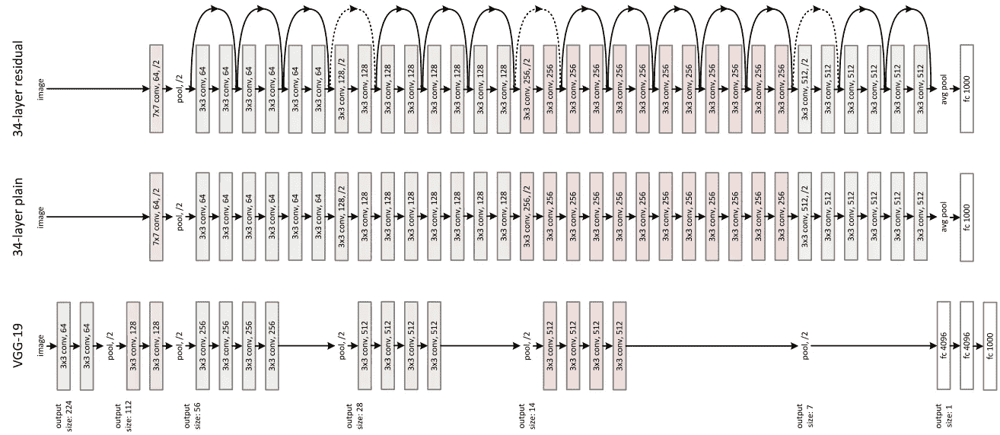
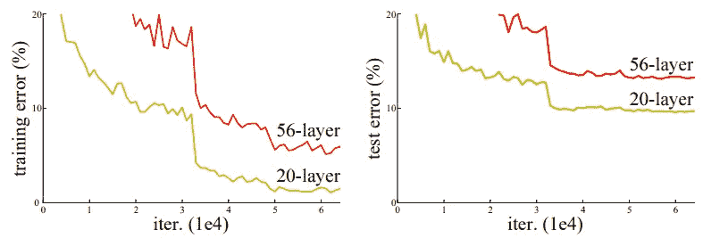
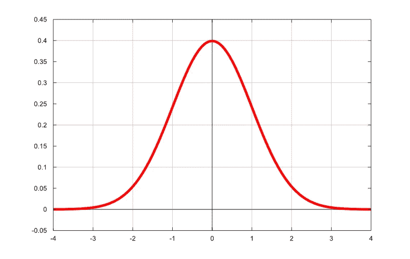
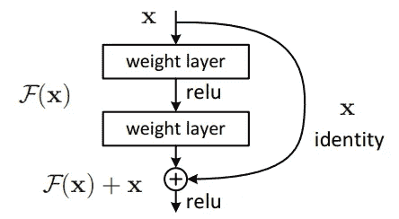
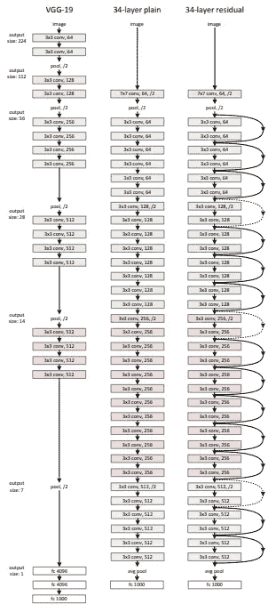
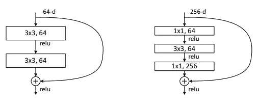
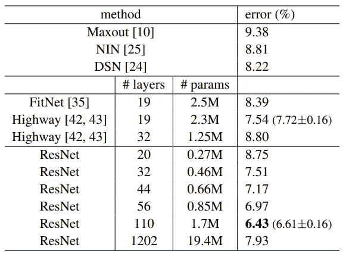

# 深入研究剩余神经网络

> 原文：<https://betterprogramming.pub/a-deep-dive-into-residual-neural-networks-5d5b3ef60d21>

## “图像识别的深度剩余学习”一文综述

图片来源: [Arxiv](https://arxiv.org/pdf/1512.03385.pdf)

在这篇博客中，我将向您介绍 **ResNet** 架构，并总结其论文[“图像识别的深度残差学习”](https://arxiv.org/pdf/1512.03385.pdf) (PDF)。我将解释它的来源以及这种架构背后的思想，所以让我们开始吧！

# 介绍

当 ResNet 论文发布时(2015 年)，人们开始尝试建立越来越深的神经网络。这是因为它提高了 **ImageNet 竞赛**的准确性，这是一场在超过 1400 万张图像的数据集上进行的视觉对象识别竞赛。

但是在某一点上，随着神经网络变大，精确度停止变好。这时候 ResNet 出来了。人们知道增加神经网络的深度可以使它更好地学习和概括，但也更难训练它。问题不在于过度拟合，因为当训练误差较低时，测试误差不会上升。所以才发明了**残块**。来看看背后的想法吧！

图一。

# ResNet 架构背后的理念

ResNet 架构背后的想法是，我们至少应该能够通过复制浅层神经网络的层(例如，具有五层的神经网络)并向其中添加学习**身份函数**的层(即，不改变输出的层，称为**身份映射**)来训练更深层的神经网络。问题在于，让图层学习身份函数非常困难，因为大多数权重都是在零附近初始化的，或者使用权重衰减/l2 正则化等技术时会趋于零。

图二。正态分布

## 剩余连接

**不是试图让层学习 identity 函数，而是让前一层的输入默认保持不变**，我们只学习需要改变的内容。因此，每个函数都不需要学习很多东西，基本上都是相同的函数。

图 3。残余块

在图 3 中，F(x)表示需要改变 x，即输入。正如我们前面所说的，**权重趋于零，所以 F(x) + x 就变成了恒等函数！**

# VGG-19 模型和残差网络的比较

VGG-19 模型有很多参数，需要大量的计算(向前传递需要 196 亿次浮点运算！)与具有 34 个参数层的残差神经网络的 36 亿次浮点运算相反。残差网络中的层小于 VGG-19 模型。也有**更多的层，但他们不必学习很多所以参数的数量更小**。残差神经网络也使用两个的**步距，而不是执行汇集操作。通过增加层，简单的 34 层普通神经网络实际上失去了性能，但通过增加**跳过连接**解决了这个问题。**

图 4。ResNet 架构

添加**跳过连接**产生了另一个问题，在步幅 2 的每个卷积之后，输出是之前的一半大小，同时下一个卷积中的滤波器数量是之前的两倍。

那么，我们如何处理这个问题，让身份功能发挥作用呢？本文探讨了解决这一问题的三种思路。一个是添加零填充，第二个是**添加 1x1 卷积到那些特定的连接(虚线的)**，最后一个是添加 1x1 卷积到每个连接。更受欢迎的想法是第二个，因为第三个与第二个相比没有太大的改进，而且增加了更多的参数。

图 5。

如图 5 所示。更深层次的架构比 18 层架构的性能更好，这与左侧显示普通 18 层和普通 34 层架构的图表相反。

# 深层残差神经网络

随着神经网络越来越深入，计算变得更加昂贵。为了解决这个问题，他们引入了一个“**瓶颈块。**“它有三层，两层 1x1 卷积，第三层 3x3 卷积。

第一个 1x1 层负责减少维度，最后一个负责恢复维度，留下具有较小输入/输出维度的 3x3 层，并降低其复杂性。添加 1x1 层不成问题，因为它们的计算强度比 3x3 层低得多。

图 6。右侧的“瓶颈”

如图 7 所示。，他们能够训练 56 层甚至 110 层的剩余神经网络，这在这篇论文发表之前是从未见过的。在尝试了非常大量的层 1202 之后，由于过拟合，精度最终下降。

图 7。

# 结论

“用于图像识别的深度剩余学习”论文在发布时是深度学习的一大突破。它引入了具有 50 层甚至更多层的大型神经网络，并表明随着神经网络变得更深而没有太多参数(比我们之前谈论的 VGG-19 模型少得多)，有可能提高 ImageNet 的准确性。

可以[在我的 GitHub](https://github.com/aurelien-peden/Deep-Learning-paper-implementations/blob/master/resnet_tensorflow.py) 上用 TensorFlow 检查 ResNet 架构的实现！你可以[点击这个链接](https://arxiv.org/abs/1512.03385)阅读这篇论文。

**感谢你阅读这篇文章，我希望这个摘要能帮助你理解这篇文章。敬请关注即将到来的深度学习教程。**