# 使用 Scala 深入探究 Spark 数据集和数据帧

> 原文：<https://betterprogramming.pub/a-deep-dive-into-spark-datasets-and-dataframes-using-scala-a268b4af7491>

## Spark 数据集和数据框架综合指南

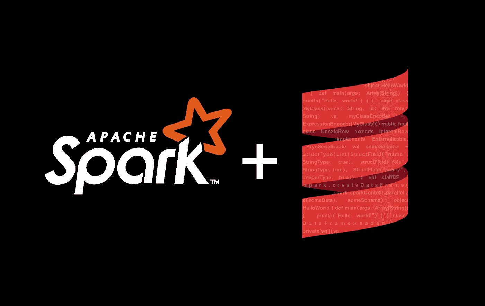

作者图片

# 初步的

[Apache Spar](https://spark.apache.org/) k 是一个开源的分布式数据处理引擎，可用于大数据分析。它内置了用于流、图形处理和机器学习的库，数据科学家可以使用 Spark 快速分析大规模数据。Spark 支持的编程语言包括 Python、Java、Scala 和 r。

[Scala](https://docs.scala-lang.org/?_ga=2.112570636.905715846.1622125401-132110329.1622125401) 是一种结合了函数式和面向对象编程的强大编程语言。它是一种基于 JVM 的统计类型语言。Apache Spark 是用 Scala 编写的，由于它在 JVM 上的可伸缩性，它是从事 Spark 项目的数据开发人员的一种流行编程语言。在本文中，我将向您展示如何通过 Scala 使用 Spark 数据集和数据帧。

## 代码列表

本文中的代码清单已经在带有 Spark 3.1.1 和 Scala 2.12 的 Databricks Community Edition cluster(Runtime 8.2)上进行了测试。一些代码清单可能无法在较低版本的 Spark 上运行。您可以在本文末尾找到所有代码清单的源代码链接。

## Spark 源代码

Spark 是一个开源项目，其源代码可以在 [GitHub](https://github.com/apache/spark) 上找到。本文不是关于 Spark 内部的；然而，对于大多数方法，我在 Spark 源代码中放置了它们的定义的链接。Spark 主要是用 Scala 写的，知道它是怎么设计的就能对它有更好的理解。因此，对于其中的一些方法，我已经简要地解释了它们在内部是如何工作的。我参考过 Spark 3.1.1 的源代码，但是其他版本的 Spark 源代码可以不一样。

# 目录

```
[Introduction](#4738)[Spark RDDs](#1262)[Datasets](#64b7)[Encoders](#47b8)
-[Internal Tungsten binary format](#e4b2)
-[InternalRow and UnsafeRow](#80c5)[Creating Datasets](#5938)
-[createDataset()](#9b85)-[toDS()](#d114)[DataFrames](#be00)
-[Row objects](#5a56)
-[Schema](http://a522)
-[RowEncoder](#112d)
-[Creating a DataFrame from a Dataset](#e77e)
-[Creating a DataFrame from scratch](#c74c)
-[createDataFrame()](#8069)-[toDF()](#1ab2)
-[Creating a DataFrame using case classes](#bf72)
-[DataFrames vs. Datasets](#7658)[Displaying DataFrames](#6ce0)
-[show()](#9636)-[display()](#eabb)[Importing a DataFrame](#fcc5)
-[read()](#9f56)[Showing the Schema](#0bff)
-[printSchema()](#ea14)-[schema](#cfbd)[Shape of a DataFrame](#4a33)
-[count()](#848c)-[columns](#78f6)[Displaying the Rows](#f925)
-[head()](#1132)-[take()](#84dd)-[first()](#2f5f)-[tail()](#926b)-[limit()](#c6b8)[Calculating the Statistics](#28a7)
-[describe()](#2202)[Null Values](#684a)[Columns](#bc4c)
-[col() and column()](#9958)-[$()](#1b8f)
-[Column symbols](#cc6a)
-[Selecting columns](#6a55)
   [select()](#68e1)
-[Dropping duplicates](#dccc)
 [dropDuplicates()](#776b)[distinct()](#257d)
-[Column expressions](#e18d)
-[concat()](#e7d1)-[Column aliases](#6731)[name()](#bcc3)[alias() and as()](#02ab)-[expr()](#9b07)
-[Math functions](#d103)
   [log() and round()](#bee5)[corr()](#9ddf)
-[Creating a new column](#75d5)
   [withColumn()](#6f88)-[Renaming columns](#5b13)[withColumnRenamed()](#95ca)-[Changing data type of columns](#eee3)[cast()](#4def)
-[Canonical string representation](#c795)
-[Timestamp](#f3a2)
-[Dropping a column](#3b1b)
   [drop()](#564a)[Rows](#4cd1)
-[getAs()](#aaf9)-[getInt(), getDouble() and getString()](#3424)
-[Splitting a column](#6405)
-[split()](#62aa)-[UDFs](#d2ad)[udf()](#4853)
   [Broadcast variables](#bea6) 
   [broadcast()](#0aca)
   [UDFs with non-Column parameters](#0c21)
   [Null values in UDFs](#f82e)
-[Filtering the rows](#8099)
   [filter()](#e466)[where()](#a68d)[between()](#936e)
-[Methods for missing values](#bf3e)
   [isNull()](#0b2d)[isNotNull()](#7c56)[fill()](#d1c4)[drop()](#4308)-[when() and otherwise()](#91c7)[Partitions](#ce7b)
-[getNumPartitions()](#22af)-[partitions(](#a66b)[)](#a66b)-[mapPartitionsWithIndex()](#8666)-[repartition()](#6d19)-[coalesce()](#9ee2)
-[Adding an index](#ef94)
   [monotonically_increasing_id()](#aff9)[zipWithIndex()](#a8ed)[Saving a Dataset](#a1ff)
-[write()](#cfa1)[Sorting](#9457)
-[sort()](#0cbc)-[desc()](#8d24)[Aggregation](#1513)
-[groupBy()](#66cb)-[count()](#3934)-[agg()](#54ff)
-[Aggregate functions](#af70)
-[Pivoting](#9afa)
   [pivot()](#d29e)
-[Unpivoting](#e6a4)
-[Transpose](#dad8)
-[collect_list()](#24cd)[Window functions](#4505)
-[orderBy()](#8f69)-[partitionBy()](#330d)-[rowsBetween()](#f8e6)-[over()](#07e4)-[lag()](#b5a6)-[rangeBetween(](#464e)[*)*](#464e)[Joins](#9550)
-[join()](#51cb)
-[Inner join](#a5b6)
-[Left outer and right outer joins](#020f)
-[Full outer join](#cd57)
-[Left semi join](http://4ef5)
-[Left anti join](#c9e3)
-[Cross join](#9b77)
   [crossJoin()](#2ce5)
-[Type-preserving joins](#ca06)
   [joinWith()](#0806)[Concatenating Datasets and DataFrames](#3ee0)
-[union()](#c059)
```

# **简介**

数据集和数据框通常指的是表格数据结构。Spark 数据集和数据帧分布在带有命名列和模式的内存表中，其中每一列都有特定的数据类型。火花数据帧类似于熊猫数据帧；然而，它们之间有一些重要的区别

*   **Spark 数据集/数据帧是不可变的**:创建 Spark 数据帧(或数据集)后，您不能更改它。在 Spark 中，操作不会改变原始数据帧；相反，它们会将操作的结果作为新的数据帧返回。因此，Spark 方法不会改变它们的参数或调用它们的对象。
*   **Spark 数据集/数据帧是分布式的** : Pandas 运行在单台机器上，但是 Spark 代码可以以分布式的方式执行，所以 Spark 数据集/数据帧在本质上是分布式的。
*   **Spark 是懒惰的:**懒惰求值是一种求值策略，其中表达式的求值被延迟到需要它的值时进行。Spark 有两种操作:*转换*和*动作*。转换是将 Spark 数据帧(或数据集)转换成新数据帧的操作。(当然，它们不会真正改变原始数据帧，因为它们是不可变的。相反，它们返回一个新的转换后的数据帧。)动作是不返回数据帧或数据集的任何其他操作。例如，它们可以在屏幕上显示一个数据帧，将其写入存储，或者触发一个计算并返回结果(比如计算数据帧中的行数)。在 Spark 中，转换是延迟计算的，所以转换的执行被延迟到一个动作被调用。

本文主要关注 Spark 数据集和数据框架。然而，为了更好地理解它们，我们应该首先熟悉 Spark RDDs。

# **火花 RDDs**

弹性分布式数据集(RDD)是 Spark 的基本数据抽象。RDD 代表一个不可变的记录集合，它分布在集群中的多个节点上，可以并行操作。RDD 具有弹性，这意味着如果保存部分 RDD 数据的节点出现故障，Spark 可以恢复丢失的部分。rdd 很重要，因为所有其他更高级的结构化数据抽象，如数据帧，都是基于它们构建的。与数据集和数据帧不同，rdd 没有模式或命名列。

我们可以通过向`SparkContext`的`parallelize()`方法传递一个集合对象(比如 Seq 或 List)来创建一个 RDD。集合对象的元素可以是元组。

```
**val** someData = **Seq**(
  ("John", "Data scientist", 4500),
  ("James", "Data engineer", 3200),
  ("Laura", "Data scientist", 4100),
  ("Ali", "Data engineer", 3200),
  ("Steve", "Developer", 3600)
)
**val** rdd = spark.sparkContext.parallelize(someData)
rdd.foreach(println)**//Output:
rdd: org.apache.spark.rdd.RDD[(String, String, Int)] = ParallelCollectionRDD[5217] at parallelize at command-351177476716599:8**
```

# **数据集**

在 Spark 中，数据集是强类型、分布式、类似表格的对象集合，具有定义良好的行和列。数据集有一个*模式*，该模式定义了列的名称及其数据类型。数据集提供编译时类型安全，这意味着 Spark 在编译时检查数据集元素的类型。数据集只在 Java 和 Scala 中可用，因为在这些语言中，类型在编译时被绑定到变量。另一方面，它们不存在于像 Python 这样的动态类型语言中，在 Python 中，变量的类型只在运行时检查。

# **编码器**

Java 虚拟机(JVM)将内存分为*栈*和*堆*。新对象总是在堆空间中创建，对这些对象的引用存储在堆栈内存中。Java 垃圾收集(GC)是 Java 程序执行自动内存管理的过程。当堆上的一些对象不再需要时，垃圾收集器会找到它们并删除它们以释放堆。Java 垃圾收集是一个自动的过程。

由于存储在堆上的所有数据都要进行垃圾收集，如果存储在堆上的数据变大，垃圾收集器消耗的时间就会长得多。垃圾收集器有一个垃圾收集暂停，也称为 *stop-the-world* 事件，这意味着在某个时刻，所有的应用程序线程都将被挂起，直到垃圾收集器处理完堆中的所有对象。在暂停期间，所有操作都将暂停，因此在 GC 暂停期间，集群上的一个节点对于其他节点来说可能是关闭的。

当堆大小大于 1Gb 时，您会得到明显的暂停。然而，今天的服务器应用程序可能需要远远超过 4Gb 的堆。为了克服这个问题，Spark 不在堆上创建基于 JVM 的对象(这些对象会被垃圾收集)来存储数据集或数据帧。相反，它将堆外的 Java 内存分配给它们。堆外内存位于 JVM 之外，不受垃圾收集的影响。为了将任意对象保存到这个非托管堆外内存中，您必须使用*序列化*。序列化是一种将对象转换为字节流的机制。*反序列化*是相反的过程，其中字节流用于重新创建实际的 JVM 对象。因此，应用程序将对象序列化到堆外内存中，稍后，可以使用反序列化来读取对象。

此外，Spark 基于分布式计算，因此数据经常在集群中的计算机节点之间通过网络传输，我们需要将数据序列化为二进制格式，以便能够通过网络共享数据。当 JVM 对象需要从一个节点发送到另一个节点时，发送方首先将其序列化为一个字节数组，然后将其发送到接收方节点。当接收节点接收到二进制格式的数据时，它会将其反序列化回一个 JVM 对象。

## **内部钨二进制格式**

JVM 有自己内置的 Java 序列化器和反序列化器；但是，它创建的二进制格式开销很大，并且昂贵和缓慢。所以 Spark 使用自己的二进制格式，称为 Spark 的*内部钨二进制格式*。在这种二进制格式中，Spark 将对象存储在 Java 堆内存之外，与 Java 二进制格式相比，对象的二进制表示需要更少的内存。

在 Spark 中，将 JVM 对象转换(序列化)为内部二进制格式称为*编码*，将内部二进制格式转换为 JVM 对象(反序列化)称为*解码*。为了在 Spark 中创建数据集，我们需要一个*编码器*，由负责编码和解码 JVM 对象。编码器在 Spark SQL 中被建模为`[Encoder[T]](https://github.com/apache/spark/blob/v3.1.1/sql/catalyst/src/main/scala/org/apache/spark/sql/Encoder.scala#L69)` [特征](https://github.com/apache/spark/blob/v3.1.1/sql/catalyst/src/main/scala/org/apache/spark/sql/Encoder.scala#L69):

```
**trait** Encoder[T] **extends** Serializable {
  **def** schema: StructType
  **def** clsTag: ClassTag[T]
}
```

类型`T`代表`Encoder[T]`可以处理的记录类型。类型为`T` ( `Encoder[T]`)的编码器用于将任何类型为`T`的 JVM 对象或原语转换(编码和解码)为 Spark SQL 的`InternalRow`，后者表示内部二进制行格式。

包`org.apache.spark.sql.catalyst.encoders`中的[类](https://github.com/apache/spark/blob/v3.1.1/sql/catalyst/src/main/scala/org/apache/spark/sql/catalyst/encoders/ExpressionEncoder.scala#L232) `[ExpressionEncoder[T]](https://github.com/apache/spark/blob/v3.1.1/sql/catalyst/src/main/scala/org/apache/spark/sql/catalyst/encoders/ExpressionEncoder.scala#L232)`可用于创建编码器，用于将类型`T`的 JVM 对象与内部二进制行相互转换。它扩展并实现了特征`Encoder`，并且它是在创建`Dataset`时使用的`Encoder`的唯一实现。

```
**case class** ExpressionEncoder[T](objSerializer: Expression,      
  objDeserializer: Expression, clsTag: ClassTag[T])
  **extends** Encoder[T] { ...
```

下面是一个使用这个类为 case 类(`MyClass`)创建一个`Encoder`的例子:

```
**import** org.apache.spark.sql.catalyst.encoders.ExpressionEncoder**case class** MyClass(name: **String**, id: **Int**, role: **String**)
**val** myClassEncoder = ExpressionEncoder[MyClass]()**//Output:
myClassEncoder: org.apache.spark.sql.catalyst.encoders.ExpressionEncoder[MyClass] = class[name[0]: string, id[0]: int, role[0]: string]**
```

## **内部流动和取消流动**

一旦创建了编码器，就可以使用它的方法`createSerializer()`来创建一个序列化器。

```
**val** toRow = myClassEncoder.createSerializer()
toRow(MyClass("John", 7, "developer"))**//Output:
res1: org.apache.spark.sql.catalyst.InternalRow = [0,2000000004,7,2800000009,6e686f4a,65706f6c65766564,72]**
```

结果是一个`InternalRow`，也称为*催化剂行*或 *Spark SQL 行*(输出中数字的含义将在后面解释)。它是在[包](https://github.com/apache/spark/blob/v3.1.1/sql/catalyst/src/main/scala/org/apache/spark/sql/catalyst/InternalRow.scala#L29) `[org.apache.spark.sql.catalyst](https://github.com/apache/spark/blob/v3.1.1/sql/catalyst/src/main/scala/org/apache/spark/sql/catalyst/InternalRow.scala#L29)`中定义的抽象类，代表 Spark SQL 中一行(数据集)的内部二进制格式。在前面的例子中，`MyClass`对象可以被认为是数据集的一行，有三列— `name`、`id`和`role`—`InternalRow`对象表示其内部二进制格式。

```
**abstract class** InternalRow **extends** SpecializedGetters **with** Serializable { ...
```

得到二进制行格式，我们应该把它转换成一个`UnsafeRow`对象。它在`org.apache.spark.sql.catalyst.expressions`包中的文件`[UnsafeRow.java](https://github.com/apache/spark/blob/v3.1.1/sql/catalyst/src/main/java/org/apache/spark/sql/catalyst/expressions/UnsafeRow.java#L62)`(这是 Java 文件，不是 Scala 文件)中定义:

```
**public final class** UnsafeRow **extends** InternalRow **implements** Externalizable, KryoSerializable { ...
```

`UnsafeRow`是抽象类`InternalRow`的具体实现。它表示行的内部钨二进制格式，这是 Spark 数据集和数据帧的内存存储格式。它被称为不安全的，因为它代表可变的内部原始内存。这里我们将`InternalRow`对象转换为`UnsafeRow`对象。

```
**import** org.apache.spark.sql.catalyst.expressions.UnsafeRow
**val** internalRow = toRow(MyClass("John", 7, "developer"))
**val** unsafeRow = internalRow.asInstanceOf[UnsafeRow]
unsafeRow.getBytes**//Output:
res4: Array[Byte] = res3: Array[Byte] = Array(0, 0, 0, 0, 0, 0, 0, 0, 4, 0, 0, 0, 32, 0, 0, 0, 7, 0, 0, 0, 0, 0, 0, 0, 9, 0, 0, 0, 40, 0, 0, 0, 74, 111, 104, 110, 0, 0, 0, 0, 100, 101, 118, 101, 108, 111, 112, 101, 114, 0, 0, 0, 0, 0, 0, 0)**
```

方法`getBytes()`返回`MyClass`行的底层二进制格式。这就是该行在内存中的存储方式。结果是一个`Byte`的数组。所以每个数字都是一个字节数据的十进制值。为了理解这些字节的含义，我们应该将字节数组分成 8 个字节的组。所以每组有 8 个字节或 64 位，相当于一个`Long`类型。这些组在字节数组中形成三个区域:*空位设置区域*、*固定长度值区域*和*可变长度值区域*(图 1)。

第一组属于空比特集区域，用于跟踪行中的空字段。如果该行有一些空值，则该区域的一些位将为 1。`UnsaferRow`字节数组中的下一组属于固定长度值区域。如果一个字段在一个固定长度的行中，并且可以放入 8 个字节，那么它将被存储在这个区域的一个组中。(这适用于类型为`Long`、`Double`或`Int`的值。)

如果行中的字段具有可变长度(如字符串或列表)，则引用(指针)和该字段的长度将存储在相应的组中(长度和引用各占 4 个字节)。在这种情况下，字段的实际值将存储在可变长度值区域中，并接受需要存储的任何组。该引用有一个相对偏移量(相对于行的基址),指向实际存储该字段的可变长度值区域中的组的开头。

现在让我们看看`MyClass`的字段是如何存储在字节数组中的。图 1 显示了字节数组、三个区域及其对应的组。这里`MyClass`的对象没有空值，所以第一组(空位设置区)只有零值(前 8 个零)。在这个区域中，对于该行包含的每个字段，都有一个位。如果行中的字段为空，则相应的位将为 1；否则就是零。`MyClass`的第一个字段包含字符串`John`。在固定长度值区域，第一组与`John`相关。它不适合 8 字节的组，所以它的长度加上一个引用存储在这个组中。

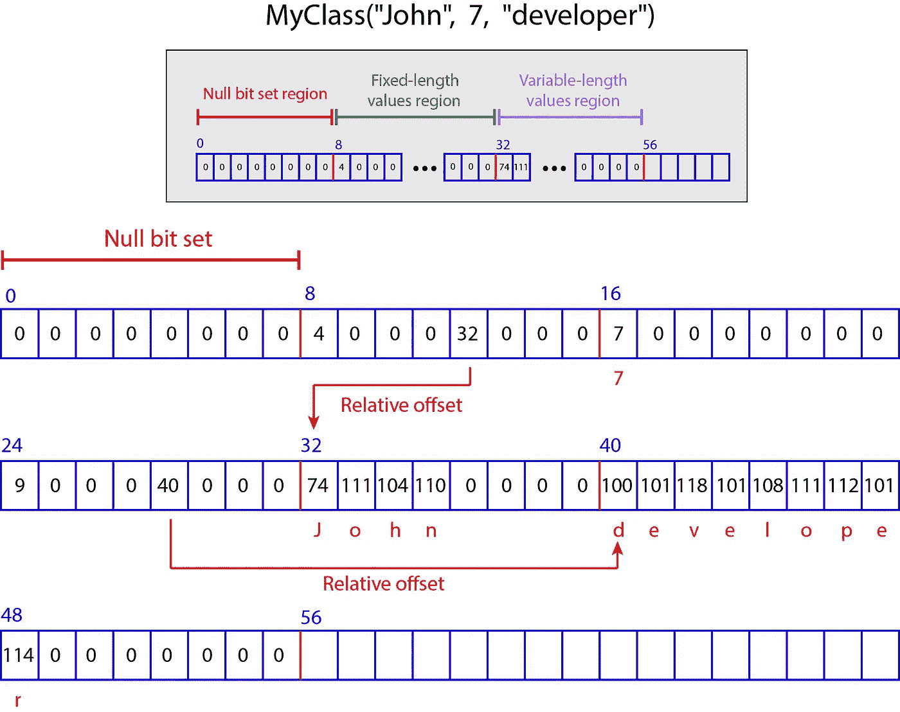

图 1

该组的前 4 个字节存储`John`的长度，为 4 (4，0，0，0)。接下来的 4 个字节存储相对偏移量，等于 32。`John`中字符的 ASCII 码(十进制值)为:`J: 74`、`o: 111`、`h: 104`、`n: 110`。通过查看图 1，您可以看到它们存储在可变长度值区域的一个组中编号为 32、33、34 和 35 的字节中，该组的最后 4 个字节正好为 0(我们假设字节数组中的第一个字节的索引为 0)。所以 32 是指向存储字符`John`的可变长度值区域中的一个组的开始的偏移量。

`MyClass`的下一个字段是 7。它可以放入一个 8 字节的组，所以下一个组包含字节`7,0,0,0,0,0,0,0`。类似地`developer`有一个组存储它的长度(9)和偏移量(40)。在可变长度值区域中，两个 8 字节组用于存储其字符，第一个字节的索引是 40。

记得最初`MyClass`的`InternalRow`物体显示这些数字:

```
**res1: org.apache.spark.sql.catalyst.InternalRow = [0,2000000004,7,2800000009,6e686f4a,65706f6c65766564,72]**
```

`InternalRow`的每个字段代表`UnsafeRow`字节数组的一个 8 字节组。变长值组中字节的十六进制值以相反的顺序组合成一个数，并省略该数左边的零。例如，`John`的组是[74，111，104，110，0，0，0，0]。这个数组中数字的十六进制值是[4a，6f，68，6e，0，0，0，0]。如果你把它们以相反的顺序组合，你会得到`00006e686f4a`。所以`6e686f4a`是该组`InternalRow`的对应字段。同样[7，0，0，0，0，0，0，0，0]变成了`7`。

第二组是[4，0，0，0，32，0，0，0，0]。这里，偏移值乘以 16⁸，长度值加到其上。(在十六进制系统中，乘以 16⁸等于在一个数的末尾加 8 个零，或者乘以 10⁸.)32 的十六进制值是 20。所以这个组对应的十六进制字段是 20x10⁸+4 = 20000000004。

现在让我们看一个例子，其中有一个`None`值。

```
**case class** MyClass(name: **Option**[**String**], id: **Option**[**Int**],
 role: **Option**[**String**])
**val** myClassEncoder = ExpressionEncoder[MyClass]()
**val** toRow = myClassEncoder.createSerializer()
**val** internalRow = toRow(MyClass(Some("John"), Some(7), None))
**val** unsafeRow = internalRow.asInstanceOf[UnsafeRow]
unsafeRow.getBytes**//Output:
unsafeRow: org.apache.spark.sql.catalyst.expressions.UnsafeRow = [4,2000000004,7,0,6e686f4a] res7: Array[Byte] = Array(4, 0, 0, 0, 0, 0, 0, 0, 4, 0, 0, 0, 32, 0, 0, 0, 7, 0, 0, 0, 0, 0, 0, 0, 0, 0, 0, 0, 0, 0, 0, 0, 74, 111, 104, 110, 0, 0, 0, 0)**
```

现在，第一组(空位设置区域)包含一个非零值，它的第一个字节是 4。该字节中的位跟踪`MyClass`的`None`值。`MyClass`有三个字段，最后一个是`None`。记住，我们为空值或`None`值保留 1 位，为可用值保留 0 位。所以第一个字节的位是`00000100`。最低有效位(位 0)与`name`相关，位 1 与`id`相关，位 2 与`role`相关(图 2)。`00000100`的十进制值为 4，所以空位设置区的第一个字节为 4。此外，由于`role`有一个`None`值，它在固定长度值区域中的组只包含零。

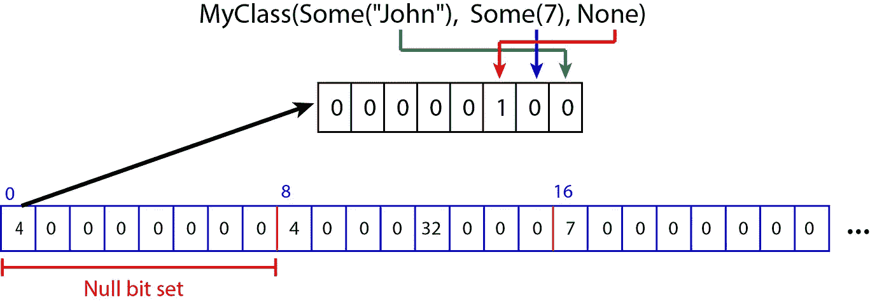

图 2

# **创建数据集**

数据集是类型为`T`的对象的强类型集合。它也可以被认为是一个包含一些行和命名列的表，其中每一行都是类型为`T`的对象，类型为`T`的字段扮演列的角色(图 3)。类型`T`应该在创建数据集之前定义，因此该表中每个字段的类型是已知的。这就是数据集被视为强类型集合的原因。

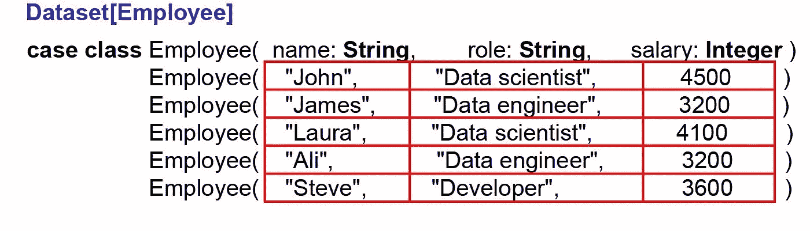

图 3

## createDataset()

要创建数据集，您需要一个编码器。编码器将类型`T`的 JVM 对象转换为 Spark 内部二进制格式，或者从 Spark 内部二进制格式转换过来。方法`createDataset()`在[类](https://github.com/apache/spark/blob/v3.1.1/sql/core/src/main/scala/org/apache/spark/sql/SparkSession.scala#L471) `[SparkSession](https://github.com/apache/spark/blob/v3.1.1/sql/core/src/main/scala/org/apache/spark/sql/SparkSession.scala#L471)`中定义，声明为:

```
**def** createDataset[T](data: **Seq**[T])(**implicit**arg0: Encoder[T]): 
  Dataset[T]
```

它从一系列给定类型`T`的数据中创建一个数据集。编码器由`SparkSession`通过`implicits`自动生成；但是，也可以显式创建它。在 spark-shell 或 [Databricks](https://docs.databricks.com/notebooks/index.html) 笔记本中，`SparkSession`的一个实例被自动创建并作为变量`spark`提供。否则，我们可以使用`builder`方法创建一个新的会话。`SparkSession`应该是从包 org.apache.spark.sql 导入的。

```
**import** org.apache.spark.sql.SparkSession
spark = SparkSession.builder
  .master("local")
  .appName("nameOfApp")
  .config("spark.some.config.option", "some-value")
  .getOrCreate()
```

以下是创建数据集的示例:

```
**import** org.apache.spark.sql.Encoders**case class** Employee(name: **String**, role: **String**, salary: **Integer**)
**val** employeeEncoder = Encoders.product[Employee]
**val** data = **Seq**(Employee("John", "Data scientist", 4500),
               Employee("James", "Data engineer", 3200),
               Employee("Laura", "Data scientist", 4100),
               Employee("Ali", "Data engineer", 3200),
               Employee("Steve", "Developer", 3600))
**val** staffDS = spark.createDataset(data)(employeeEncoder)
staffDS.show()**//Output:
+-----+--------------+------+ 
| name|          role|salary| 
+-----+--------------+------+ 
| John|Data scientist|  4500| 
|James| Data engineer|  3200| 
|Laura|Data scientist|  4100| 
|  Ali| Data engineer|  3200| 
|Steve|     Developer|  3600| 
+-----+--------------+------+
staffDS: org.apache.spark.sql.Dataset[Employee] = [name: string, role: string ... 1 more field]**
```

这里我们首先创建案例类`Employee`。所以我们想创建一个类型为`Employee` ( `T=Employee`)的数据集。我们使用文件`[Encoders.scala](https://github.com/apache/spark/blob/v3.1.1/sql/catalyst/src/main/scala/org/apache/spark/sql/Encoders.scala#L36)`中的对象`Encoders`为`Employee`创建一个编码器。这个对象提供了一些静态函数，可以用来生成不同类型的编码器。我们使用下面的方法为 Scala 的`Product`类型(如元组、case 类等)获取一个编码器。：

```
**def** product[T <: Product : TypeTag]: Encoder[T] = 
  ExpressionEncoder()
```

它返回前面介绍过的`ExpressionEncoder`类的一个实例。我们也可以直接使用`ExpressionEncoder`类来创建编码器:

```
**import** org.apache.spark.sql.catalyst.encoders.ExpressionEncoder
**val** employeeEncoder = ExpressionEncoder[Employee]()
```

然后我们创建一系列`Employee` 对象，并将其分配给`data`。这个序列中的每个对象在我们的数据集中扮演一行的角色。类别`Employee` ( `name`、`role`和`salary`)的每个字段都扮演这个数据集的一个列的角色。最后，我们使用`data`和编码器创建数据集。如输出所示，结果是一个类型为`Employee` ( `Dataset[Employee]`)的数据集。其实就是一个`Employee`对象的集合。这是一个强类型集合，因为应该预先知道`name`、`role`和`salary`的类型。

可以通过`implicits`自动创建编码器。对象`implicits`在`[SparkSession](https://github.com/apache/spark/blob/v3.1.1/sql/core/src/main/scala/org/apache/spark/sql/SparkSession.scala#L697)` ( `org.apache.spark.sql.SparkSession`)类中定义，继承了[抽象类抽象](https://github.com/apache/spark/blob/v3.1.1/sql/core/src/main/scala/org/apache/spark/sql/SQLImplicits.scala#L32) `[SQLImplicits](https://github.com/apache/spark/blob/v3.1.1/sql/core/src/main/scala/org/apache/spark/sql/SQLImplicits.scala#L32)`(在 org.apache.spark.sql 包中)的一些方法，将常见的 Scala 对象转换成编码器。因此，要创建之前的数据集，我们可以编写:

```
**import** spark.implicits.**_**
**case class** Employee(name: **String**, role: **String**, salary: **Integer**)
**val** data = **Seq**(Employee("John", "Data scientist", 4500),
               Employee("James", "Data engineer", 3200),
               Employee("Laura", "Data scientist", 4100),
               Employee("Ali", "Data engineer", 3200),
               Employee("Steve", "Developer", 3600))
**val** staffDS = spark.createDataset(data)
staffDS.show()
```

当`createDataset()`的第二个参数表缺失时，Scala 会在`implicits`中寻找一个可以为类型`T`的数据返回`Encoder[T]`的方法。在这种情况下，合适的[隐式方法](https://github.com/apache/spark/blob/v3.1.1/sql/core/src/main/scala/org/apache/spark/sql/SQLImplicits.scala#L251)是:

```
**implicit def** newProductEncoder[T <: Product : TypeTag]: Encoder[T] =  
  Encoders.product[T]
```

所以这个方法被编译器用来调用`createDataset()`。如果我们想要手动完成，我们可以编写以下代码:

```
**import** spark.implicits.newProductEncoder
**case class** Employee(name: **String**, role: **String**, salary: **Integer**)
**val** data = **Seq**(Employee("John", "Data scientist", 4500),
               Employee("James", "Data engineer", 3200),
               Employee("Laura", "Data scientist", 4100),
               Employee("Ali", "Data engineer", 3200),
               Employee("Steve", "Developer", 3600))**val** staffDS = spark.createDataset(data)(newProductEncoder[Employee]) 
```

## 托德()

我们还可以使用`toDS()`方法创建一个数据集:

```
**import** spark.implicits.**_**
**case class** Employee(name: **String**, role: **String**, salary: **Integer**)
**val** data = **Seq**(Employee("John", "Data scientist", 4500),
               Employee("James", "Data engineer", 3200),
               Employee("Laura", "Data scientist", 4100),
               Employee("Ali", "Data engineer", 3200),
               Employee("Steve", "Developer", 3600))
**val** staffDS = data.toDS()
staffDS.show()
```

方法`toDS()`在[案例类](https://github.com/apache/spark/blob/v3.1.1/sql/core/src/main/scala/org/apache/spark/sql/DatasetHolder.scala#L34) `DatasetHolder`中定义。org.apache.spark.sql 包中定义的 case 类是数据集的容器，用于 spark 中的隐式转换。

```
**case class** DatasetHolder[T] private[sql](**private val** ds: Dataset[T]) {   **def** toDS(): Dataset[T] = ds
...
```

`toDS()`将一个`DatasetHolder`转换成一个`Dataset`。在我们之前的例子中，`data`是一个 Seq 对象，我们在其上调用了`toDS()`，这需要一个`DatasetHolder`。所以 Spark 使用[隐式方法](https://github.com/apache/spark/blob/v3.1.1/sql/core/src/main/scala/org/apache/spark/sql/SQLImplicits.scala#L230) `[localSeqToDatasetHolder()](https://github.com/apache/spark/blob/v3.1.1/sql/core/src/main/scala/org/apache/spark/sql/SQLImplicits.scala#L230)`将 Seq 对象转换为`DatasetHolder`。该方法声明如下:

```
**implicit def** localSeqToDatasetHolder[T : Encoder](s: **Seq**[T]): 
  DatasetHolder[T]
```

事实上，如果我们想要手动调用隐式方法，我们可以编写以下代码来获得相同的数据集:

```
**import** spark.implicits.localSeqToDatasetHolder
**val** data = **Seq**(Employee("John", "Data scientist", 4500),
               Employee("James", "Data engineer", 3200),
               Employee("Laura", "Data scientist", 4100),
               Employee("Ali", "Data engineer", 3200),
               Employee("Steve", "Developer", 3600))**val** staffDS = localSeqToDatasetHolder(data)
  .toDS()
```

然而，我们不需要这样做，因为编译器可以自动为我们这样做。

# **数据帧**

到目前为止，我们已经看到了如何创建类型为`T`的数据集。数据帧是数据集的一种特殊形式。DataFrame 是一个类型为`Row`的数据集。trait `Row`在包 org.apache.spark.sql 的`[Row.scala](https://github.com/apache/spark/blob/v3.1.1/sql/catalyst/src/main/scala/org/apache/spark/sql/Row.scala#L142)`中定义，代表 DataFrame 的一行。如果您查看 org.apache.spark 包中的`[package.scala](https://github.com/apache/spark/blob/v3.1.1/sql/core/src/main/scala/org/apache/spark/sql/package.scala#L46)`,您会看到这一行:

```
 **type** DataFrame = Dataset[Row]
```

所以在 Spark SQL 中，`DataFrame` type 仅仅是`Dataset[Row]`的类型别名。

数据帧也可以被认为是一个包含一些行和指定列的表。DataFrame 还有一个*模式*(图 4)，它定义了列名及其数据类型。然而，在创建数据帧时，您不需要定义它的模式。Spark 可以根据每一列中的可用数据推断模式，并为每一列分配默认名称。当然，预先定义模式是一个很好的实践，因为对于大型数据文件来说，推断模式的计算代价可能很高，而且有了模式，Spark 可以在运行时检测到任何不匹配的数据。

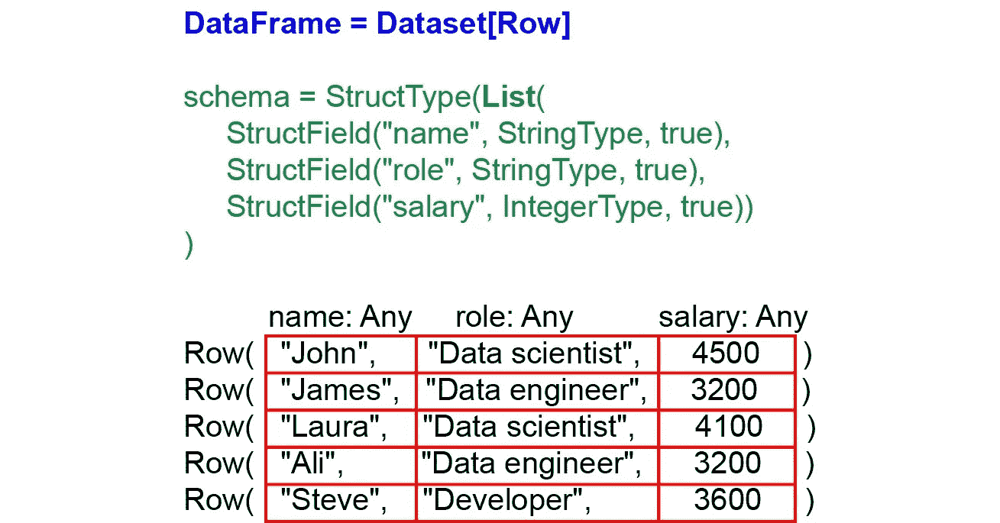

图 4

## **排物体**

在 Spark 中，数据帧的每一行都是一个通用的`Row`对象。它在 org.apache.spark.sql 包中的`[Row.scala](https://github.com/apache/spark/blob/v3.1.1/sql/catalyst/src/main/scala/org/apache/spark/sql/Row.scala#L44)`中定义。

```
**object** Row {
  ...  
  **def** apply(values: **Any***): Row = **new** GenericRow(values.toArray)
  ...
```

这是同一文件中[特质](https://github.com/apache/spark/blob/v3.1.1/sql/catalyst/src/main/scala/org/apache/spark/sql/Row.scala#L142) `[Row](https://github.com/apache/spark/blob/v3.1.1/sql/catalyst/src/main/scala/org/apache/spark/sql/Row.scala#L142)`的伴随对象。工厂方法创建一个新的`GenericRow`对象。`[GenericRow](https://github.com/apache/spark/blob/v3.1.1/sql/catalyst/src/main/scala/org/apache/spark/sql/catalyst/expressions/rows.scala#L166)`扩展了`Row`特征并实现了它的方法:

```
**class** GenericRow(**protected**[sql] **val** values: **Array**[Any]) **extends** Row {  
  ...
  **override** **def** get(i: **Int**): Any = values(i)
  ...
```

`GenericRow`的数据是`Any`的数组。所以`Row`是类型`Any`的有序字段集合，可以通过从 0 开始的索引来访问。

```
**import** org.apache.spark.sql.Row
**val** row = Row("John", "Data scientist", 4500)
row(2)**// Output:
row: org.apache.spark.sql.Row = [John, Data scientist,4500]
res0: Any = 4500**
```

您可以使用带有索引的`getAs()`来获得具有适当类型的行字段。`getAs()`在`[Row.scala](https://github.com/apache/spark/blob/v3.1.1/sql/catalyst/src/main/scala/org/apache/spark/sql/Row.scala#L358)`中定义，稍后将详细讨论:

```
**def** getAs[T](i: Int): T = get(i).asInstanceOf[T]
```

它将`get(i)`的返回值强制转换为类型`T`。

```
row.getAs[String](0)**// Output:
res0: String = John**
```

## **模式**

数据帧的模式可以用两种方式定义:使用`StructType`或使用 DLL 字符串。`StructType`是内置的数据类型，它是`StructField`的集合。每个`StructType`用于为数据帧的一列定义模式。这些类型是从包[org . Apache . spark . SQL . types](https://github.com/apache/spark/tree/v3.1.1/sql/catalyst/src/main/scala/org/apache/spark/sql/types)`.`中导入的。例如，我们可以为一个 DataFrame 定义一个模式，它有三列，分别为:`name`、`role`和`salary`，其中这些列的数据类型分别为`String`、`String`和`Integer`:

```
**import** org.apache.spark.sql.types.**_**
**val** someSchema = StructType(**List**(
  StructField("name", StringType, true),
  StructField("role", StringType, true),
  StructField("salary", IntegerType, true))
)
```

我们还可以使用数据定义语言(DDL)字符串以更简单的方式创建相同的模式:

```
**val** someSchema = "`name` **STRING**, `role` **STRING**, `salary` **INTEGER**"
```

我们将在后面讨论 DataFrame 列。请注意，数据集也有一个模式，但是我们不能为此定义一个模式。从类型`T`推断出`Dataset[T]`的模式。如下所示，在使用方法`schma`和`printSchema()`创建数据集(或数据帧)之后，您可以看到它的模式。

## **RowEncoder**

数据帧也需要编码器。对象`RowEncoder`充当数据帧的编码器。它在 org . Apache . spark . SQL . catalyst . encoders 包中的`[RowEncoder.scala](https://github.com/apache/spark/blob/v3.1.1/sql/catalyst/src/main/scala/org/apache/spark/sql/catalyst/encoders/RowEncoder.scala#L62)`中定义。

```
**object** RowEncoder {  
  **def** apply(schema: StructType): ExpressionEncoder[Row] = { ...
```

如您所见，它的工厂方法接受一个模式并创建一个类型为`Row`的`ExpressionEncoder`。这是`RowEncoder`的一个重要特性，它允许你为一个数据帧定义一个模式。我们提到过一个`Row`对象的字段属于`Any`类型。但是这只适用于作为 JVM 对象的`Row`对象。当`RowEncoder`想要在运行时编码一个`Row`对象时，它需要知道字段的实际类型。

事实上，它不能将类型为`Any`的字段序列化为内部二进制格式，并在这种情况下给出一个运行时错误(我们将在后面给出一个例子)。此外，它可以检查数据类型是否与给定的(或推断的)模式匹配。例如，如果模式说一个列有一个`Integer`类型，并且为该列的数据给出了一个`String`，那么`RowEncoder`将给出一个运行时错误(我们将在后面给出一个例子)。当一个`Row`对象的内部二进制格式被反序列化回 JVM 对象时，字段将再次具有类型`Any`。所以当它是一个 JVM 对象时,`Row`的字段具有类型`Any`。

但是为什么`RowEncoder`需要知道`Row`对象中字段的类型呢？记住，变量的类型改变了它在`UnsafeRow`的字节数组中的存储方式。假设您有一个类型为`Any`的字段，其值为 7。如果 7 是一个整数，它的值将存储在固定长度值区域的一个组中。如果 7 是一个字符串(`"7"`)，那么它的 ASCII 码将存储在变长值区域。因此，如果不知道字段的确切类型，编码器就不知道如何将其转换为内部二进制格式。

## **从数据集创建数据帧**

如前所述，DataFrame 是一个类型为`Row`的数据集。因此，如果我们使用一系列的`Row`对象和`RowEncoder`，我们可以从数据集创建一个数据帧。

```
**import** org.apache.spark.sql.catalyst.encoders.RowEncoder
**import** org.apache.spark.sql.types.**_**
**val** someSchema = StructType(**List**(
  StructField("name", StringType, true),
  StructField("role", StringType, true),
  StructField("salary", IntegerType, true))
)
**val** encoder = RowEncoder(someSchema)**val** data = **Seq**(Row("John", "Data scientist", 4500),
               Row("James", "Data engineer", 3200),
               Row("Laura", "Data scientist", 4100),
               Row("Ali", "Data engineer", 3200),
               Row("Steve", "Developer", 3600))
**val** staffDS = spark.createDataset(data)(encoder)**//Output:
staffDS: org.apache.spark.sql.Dataset[org.apache.spark.sql.Row] = [name: string, role: string ... 1 more field]**
```

这里的输出是一个`Dataset[Row]`，相当于一个数据帧。所以我们可以将`staffDS`赋给一个`DataFrame`类型的变量。

```
**val** newStaffDF: org.apache.spark.sql.DataFrame = staffDS**//Output:
newStaffDF: org.apache.spark.sql.DataFrame = [name: string, role: string ... 1 more field]**
```

如您所见，我们没有创建`Employee` case 类，而是使用模式来定义 DataFrame 的列。为了创建一个数据帧，我们需要一个序列和一个模式。然而，模式是不必要的，因为它可以被推断出来。

## **从头开始创建数据帧**

**createDataFrame()**

Spark 有一些特殊的方法来创建数据帧。为此，我们可以使用`[SparkSession](https://github.com/apache/spark/blob/v3.1.1/sql/core/src/main/scala/org/apache/spark/sql/SparkSession.scala#L350)` [类](https://github.com/apache/spark/blob/v3.1.1/sql/core/src/main/scala/org/apache/spark/sql/SparkSession.scala#L350)中的方法`createDataFrame()`。它被定义为:

```
**def** createDataFrame(rowRDD: RDD[Row], schema: StructType): DataFrame = withActive {    
  **val** replaced = CharVarcharUtils.failIfHasCharVarchar(schema)
    .asInstanceOf[StructType]   
  **val** encoder = RowEncoder(replaced)
  **val** toRow = encoder.createSerializer()    
  **val** catalystRows = rowRDD.map(toRow)     
  internalCreateDataFrame(catalystRows.setName(rowRDD.name), schema)  }
```

我们需要向该方法传递一个 RDD 和一个模式来创建数据帧。如您所见，它使用带有给定`schema`的`RowEncoder`来编码数据。让我们看一个例子:

```
**import** org.apache.spark.sql.types.**_**
**val** someData = **Seq**(
  Row("John", "Data scientist", 4500),
  Row("James", "Data engineer", 3200),
  Row("Laura", "Data scientist", 4100),
  Row("Ali", "Data engineer", 3200),
  Row("Steve", "Developer", 3600)
)**val** someSchema = StructType(List(
  StructField("name", StringType, true),
  StructField("role", StringType, true),
  StructField("salary", IntegerType, true))
)**val** staffDF = spark.createDataFrame(
  spark.sparkContext.parallelize(someData),
  someSchema
)staffDF.show()**//Output:
+-----+--------------+------+
| name|          role|salary|
+-----+--------------+------+
| John|Data scientist|  4500|
|James| Data engineer|  3200|
|Laura|Data scientist|  4100|
|  Ali| Data engineer|  3200|
|Steve|     Developer|  3600|
+-----+--------------+------+**
```

我们还可以使用 DDL 模式创建相同的数据帧:

```
**import** org.apache.spark.sql.types.**_**
**val** someData = **Seq**(
  Row("John", "Data scientist", 4500),
  Row("James", "Data engineer", 3200),
  Row("Laura", "Data scientist", 4100),
  Row("Ali", "Data engineer", 3200),
  Row("Steve", "Developer", 3600)
)**val** someSchema = "`name` **STRING**, `role` **STRING**, `salary` **INTEGER**"**val** df = spark.createDataFrame(
  spark.sparkContext.parallelize(someData),
  StructType.fromDDL(someSchema)
)
```

如前所述，我们不需要定义模式，因为它可以被推断出来。我们也可以使用不带模式的 Seq 对象，通过使用`createDataFrame()`的[重载版本](https://github.com/apache/spark/blob/v3.1.1/sql/core/src/main/scala/org/apache/spark/sql/SparkSession.scala#L312)来创建数据帧:

```
**def** createDataFrame[A <: Product : TypeTag](data: **Seq**[A]): DataFrame 
```

需要注意的是，您不能将一系列的`Row`对象传递给这个版本的`createDataFrame()`。该方法将一个`A`的 Seq 作为`scala.Product`的子类型，包含元组和 case 类，但`Row`不是`scala.Product`的子类型。这里有一个例子:

```
**val** someData = **Seq**(
  ("John", "Data scientist", 4500),
  ("James", "Data engineer", 3200),
  ("Laura", "Data scientist", 4100),
  ("Ali", "Data engineer", 3200),
  ("Steve", "Developer", 3600)
)**val** staffDF = spark.createDataFrame(someData)
staffDF.show()**//Output:
+-----+--------------+----+ 
|   _1|            _2|  _3| 
+-----+--------------+----+ 
| John|Data scientist|4500| 
|James| Data engineer|3200| 
|Laura|Data scientist|4100| 
|  Ali| Data engineer|3200| 
|Steve|     Developer|3600| 
+-----+--------------+----+**
```

在这里，Spark 自动为每一列命名。

**toDF()**

case 类`DatasetHolder`中的方法`[toDF()](https://github.com/apache/spark/blob/v3.1.1/sql/core/src/main/scala/org/apache/spark/sql/DatasetHolder.scala#L44)`将`DatasetHolder`对象转换为 DataFrame:

```
**def** toDF(colNames: **String***): DataFrame = ds.toDF(colNames : **_***)
```

类似于`toDS()`；但是，它可以接受列名列表。所以我们可以写:

```
**import** spark.implicits._
**val** staffDF = **Seq**(
  ("John", "Data scientist", 4500),
  ("James", "Data engineer", 3200),
  ("Laura", "Data scientist", 4100),
  ("Ali", "Data engineer", 3200),
  ("Steve", "Developer", 3600)
  ).toDF("name", "role", "salary")
```

我们需要导入对象`implicits`，因为我们将`toDF()`应用于一个序列对象，而不是一个`DatasetHolder`。所以我们需要一个隐式的方法将序列对象转换成一个`DatasetHolder`。如前所述，Spark 使用对象`implicits`中的方法`localSeqToDatasetHolder()`将序列转换为`DatasetHolder`。它返回一个类型为`T`的`DatasetHolder`。因此，如果我们想手动使用隐式方法，我们可以写:

```
**import** spark.implicits.localSeqToDatasetHolder
**val** staffSeq = **Seq**(
  ("John", "Data scientist", 4500),
  ("James", "Data engineer", 3200),
  ("Laura", "Data scientist", 4100),
  ("Ali", "Data engineer", 3200),
  ("Steve", "Developer", 3600)
  )**val** staffDF = localSeqToDatasetHolder(staffSeq)
  .toDF("name", "role", "salary")
```

然而，编译器可以自动完成这项工作。数据帧列的名称作为`toDF()`的参数给出；然而，我们也可以忽略它们。在这种情况下，Spark 会自动为每一列命名:

```
**val** staffDF = **Seq**(
  ("John", "Data scientist", 4500),  
  ("James", "Data engineer", 3200), 
  ("Laura", "Data scientist", 4100), 
  ("Ali", "Data engineer", 3200),  
  ("Steve", "Developer", 3600)  
  ).toDF()staffDF.show()**//Output:
+-----+--------------+----+
|_1   |_2            |_3  |
+-----+--------------+----+
|John |Data scientist|4500|
|James|Data engineer |3200|
|Laura|Data scientist|4100|
|Ali  |Data engineer |3200|
|Steve|Developer     |3600|
+-----+--------------+----+**
```

我们还可以使用`_*`操作符从 sequence 对象中获取列名:

```
**val** colList = **List**("name", "role", "salary")
**val** staffDF = **Seq**(
  ("John", "Data scientist", 4500),  
  ("James", "Data engineer", 3200), 
  ("Laura", "Data scientist", 4100), 
  ("Ali", "Data engineer", 3200),  
  ("Steve", "Developer", 3600)  
  ).toDF(colList : **_***)
```

## **使用案例类**创建数据框架

**我们也可以使用 case 类来创建一个数据框架。case 类`Employee`将获取数据帧的每一行。我们在 Spark 会话中使用方法`createDataFrame()`将一系列案例类转换成数据帧。由于使用了 case 类，我们不再需要模式。**

```
**import** org.apache.spark.sql.DataFrame**case class** Employee(name: **String**, role: **String**, salary: **Option**[**Integer**])
**val** staffWithCaseDF: DataFrame = spark.createDataFrame(
    **Seq**(Employee("John", "Data scientist", Some(4500)),
        Employee("James", "Data engineer", None),
        Employee("Laura", "Data scientist", Some(4100)),
        Employee("Ali", "Data engineer", Some(3200)),
        Employee("Steve", "Developer", None)
        )) **//Output:
+-----+--------------+------+
| name|          role|salary|
+-----+--------------+------+
| John|Data scientist|  4500|
|James| Data engineer|  null|
|Laura|Data scientist|  4100|
|  Ali| Data engineer|  3200|
|Steve|     Developer|  null|
+-----+--------------+------+**
```

**我们还可以使用`toDF()`从一个案例类中创建数据帧:**

```
**val** staffWithCaseDF = **Seq**(Employee("John", "Data scientist", 4500),
    Employee("James", "Data engineer", 3200),
    Employee("Laura", "Data scientist", 4100),
    Employee("Ali", "Data engineer", 3200),
    Employee("Steve", "Developer", 3600)).toDF()
```

## ****数据帧与数据集****

**数据集是强类型集合。在数据集中的每一行，字段都有特定的类型。然而，数据帧的每一行都是一个通用的`Row`对象。`Row`对象的每个字段都属于`Any`类型。因此它们的行为类似于非类型化字段。(在 Scala 中，当变量的类型未知时，可以使用`Any`来解决这个问题。)假设我们想从案例类`Employee`中创建一个数据集，而我们在`data`中有一个类型错误。例如，我们不用`Integer`来表示`salary`，而是用`String`:**

```
// This gives a compile-time error
**import** spark.implicits.**_**
**case class** Employee(name: **String**, role: **String**, salary: **Integer**)
**val** data = **Seq**(Employee("John", "Data scientist", "4500"),
               Employee("James", "Data engineer", 3200),
               Employee("Laura", "Data scientist", 4100),
               Employee("Ali", "Data engineer", 3200),
               Employee("Steve", "Developer", 3600))
**val** staffDS = spark.createDataset(data)**//Output:
command-3975502924555582:3: error: type mismatch;  found   : String("4500")  required: Integer val data = Seq(Employee("John", "Data scientist", "4500"),**
```

**在这种情况下，Spark 会给我们一个编译时错误。原因是在数据集中，一行中所有字段的类型在编译时都是已知的，所以编译器知道您需要一个整数作为`salary`。现在假设我们在数据帧上犯了同样的错误:**

```
// This gives a run-time error
**import** org.apache.spark.sql.types.**_**
**val** someData = **Seq**(
  Row("John", "Data scientist", "4500"),
  Row("James", "Data engineer", 3200),
  Row("Laura", "Data scientist", 4100),
  Row("Ali", "Data engineer", 3200),
  Row("Steve", "Developer", 3600)
)**val** someSchema = StructType(**List**(
  StructField("name", StringType, true),
  StructField("role", StringType, true),
  StructField("salary", IntegerType, true))
)**val** staffDF = spark.createDataFrame(
   spark.sparkContext.parallelize(someData), someSchema)**//Output:
org.apache.spark.SparkException: Job aborted due to stage failure: Task 2 in stage 677.0 failed 4 times, most recent failure: Lost task 2.3 in stage 677.0 (TID 111572, 10.139.64.9, executor 20): java.lang.RuntimeException: Error while encoding: java.lang.RuntimeException: java.lang.String is not a valid external type for schema of int**
```

**现在 Spark 不能给我们一个编译时错误。只有在运行时才会检测到错误。原因是`Row`对象中的字段属于类型`Any`。所以你可以传递任何东西给它。现在记住，`RowEncoder`将模式作为参数，因此在运行时，当`RowEncoder`试图编码`Row`对象时，它将检测到错误。模式将`salary`定义为一个整数，但是`RowEncoder`找到一个字符串并抛出一个错误。**

**正如您在后面看到的，大多数操作数据集的方法都返回数据帧，所以如果您需要类似于 SQL 查询的关系转换，您应该使用数据帧。DataFrames 还提供跨 Spark 组件的代码优化和 API 简化。另一方面，数据集提供编译时类型安全，当您使用数据集时，您可以受益于钨与编码器的高效序列化。**

# ****显示数据帧****

## **显示()**

**为了显示 Dataframe，我们可以使用类`Dataset`中的方法`show()`，它在前面的代码清单中使用过。该方法在 org.apache.spark.sql 包中的[类](https://github.com/apache/spark/blob/v3.1.1/sql/core/src/main/scala/org/apache/spark/sql/Dataset.scala#L824) `[Dataset](https://github.com/apache/spark/blob/v3.1.1/sql/core/src/main/scala/org/apache/spark/sql/Dataset.scala#L824)`中定义:**

```
**def** show(numRows: **Int**, truncate: **Boolean**): **Unit**
```

**`[numRows](https://github.com/apache/spark/blob/v3.1.1/sql/core/src/main/scala/org/apache/spark/sql/Dataset.scala#L784)` [和](https://github.com/apache/spark/blob/v3.1.1/sql/core/src/main/scala/org/apache/spark/sql/Dataset.scala#L784) `[truncate](https://github.com/apache/spark/blob/v3.1.1/sql/core/src/main/scala/org/apache/spark/sql/Dataset.scala#L784)`的[默认值分别为 20 和`true`:](https://github.com/apache/spark/blob/v3.1.1/sql/core/src/main/scala/org/apache/spark/sql/Dataset.scala#L784)**

```
**def** show(numRows: **Int**): **Unit** = show(numRows, truncate = true)
**def** show(): **Unit** = show(20)
**def** show(truncate: **Boolean**): **Unit** = show(20, truncate)
```

**`numRows`控制应该显示多少行，默认情况下，它以表格形式显示数据集或数据帧的前 20 行。例如，为了只显示`staffDF`的前三行，我们可以写:**

```
staffDF.show(3)**//Output:
+-----+--------------+------+ 
| name|          role|salary| 
+-----+--------------+------+ 
| John|Data scientist|  4500| 
|James| Data engineer|  3200| 
|Laura|Data scientist|  4100| 
+-----+--------------+------+
 only showing top 3 rows**
```

**如果一列超过 20 个字符，默认情况下将被截断。为了防止截断，我们可以将`truncate`设置为`false`:**

```
// Columns won't be truncated
staffDF.show(false) 
```

## **显示()**

**在 Databricks 笔记本中，我们还可以使用功能显示来可视化数据帧:**

```
display(staffDF)
```

**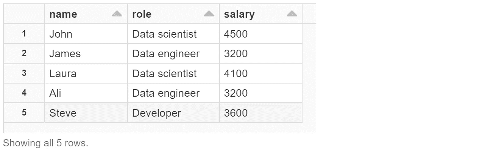**

**需要注意的是，在 Spark 中，与 Python 中的 Pandas 库不同，您不能通过简单地键入数据帧的名称来显示其内容:**

```
staffDF**//Output:
res4: org.apache.spark.sql.DataFrame = [name: string, role: string ... 1 more field]**
```

**另外，`show()`的返回类型是`Unit()`。所以不能将`show()`的返回值赋给另一个数据帧。因此，如果我们编写以下代码，它不会将`staffDF`复制到`newDF`，并且`newDF`的值将是`()`。**

```
**val** newDF = staffDF.show()
```

# ****导入数据帧****

**org.apache.spark.sql 包中的类`[DataFrameReader](https://github.com/apache/spark/blob/v3.1.1/sql/core/src/main/scala/org/apache/spark/sql/DataFrameReader.scala)`可用于从外部资源加载 DataFrame。这个类有一个私有构造函数，只能在 org.apache.spark.sql 包中访问。**

```
**class** DataFrameReader **private**[sql](sparkSession: SparkSession) 
  **extends** Logging { ...
```

**所以您不能在这个包之外创建一个`DataFrameReader`的实例。**

## **阅读()**

**要获得它的实例句柄，应该使用类`SparkSession`中的[方法](https://github.com/apache/spark/blob/v3.1.1/sql/core/src/main/scala/org/apache/spark/sql/SparkSession.scala#L655) `[read()](https://github.com/apache/spark/blob/v3.1.1/sql/core/src/main/scala/org/apache/spark/sql/SparkSession.scala#L655)`。这个方法返回一个句柄给`DataFrameReader`:**

```
**def** read: DataFrameReader = **new** DataFrameReader(self)
```

**`DataFrameReader`有一些装载数据的公共方法:**

*   **`[format()](https://github.com/apache/spark/blob/v3.1.1/sql/core/src/main/scala/org/apache/spark/sql/DataFrameReader.scala#L63)`:该方法控制外部资源的类型，声明如下:**

```
**def** format(source: **String**): DataFrameReader
```

**参数`source`可以是`"parquet"`、`"csv"`、`"txt"`、`"json"`等。如果你没有指定这个方法，那么默认是`parquet`或者在`spark.sql.sources.default`中设置的任何东西。**

*   **`[option()](https://github.com/apache/spark/blob/v3.1.1/sql/core/src/main/scala/org/apache/spark/sql/DataFrameReader.scala#L124)`:为底层数据源增加一个输入选项，声明如下:**

```
**def** option(key: **String**, value: **String**): DataFrameReader
```

**它需要一个键和一个值。`value`代表一个布尔值，在`option()`的重载版本中也可以是`boolean`、`long`或`double`。您可以在文档中找到所有可在`option()`中使用的[键列表。`option()`使用的密钥可以特定于一种文件类型(如 CSV)。](https://spark.apache.org/docs/latest/api/java/org/apache/spark/sql/DataFrameReader.html)**

*   **`[load()](https://github.com/apache/spark/blob/v3.1.1/sql/core/src/main/scala/org/apache/spark/sql/DataFrameReader.scala#L235)`:取数据源的路径，声明如下:**

```
**def** load(path: **String**): DataFrame
```

**例如，要读取 CSV 文件，我们可以编写:**

```
**val** csvFile = "databricks-datasets/learning-spark- 
  v2/mnm_dataset.csv"**val** df = spark.read.format("csv")
  .option("inferSchema", "true")
  .option("header", "true")
  .load(csvFile)
df.show(3)**//Output:
+-----+-----+-----+ 
|State|Color|Count| 
+-----+-----+-----+ 
|   TX|  Red|   20| 
|   NV| Blue|   66| 
|   CO| Blue|   79| 
+-----+-----+-----+ 
only showing top 3 rows**
```

**这里我们将文件路径放在`csvFile`中。Spark session 的`read()`方法用于获得`DataFrameReader`的实例句柄。然后我们在`format()`中确定资源的类型。当`infershema`设置为`true`时，从数据中自动推断输入模式。当`header`设置为`true`时，文件的第一行将用于命名列，不会包含在数据中。最后，我们使用文件路径加载数据。由于`option()`和`format()`都返回`DataFrameReader`，它们的顺序并不重要；然而，`load()`应该总是在最后，因为它返回一个数据帧。**

**我们还可以加载一个拼花文件作为另一个例子:**

```
**val** filePath = "databricks-datasets/learning-spark-v2/loans/loan-risks.snappy.parquet"**val** df = spark.read.load(filePath)
```

**这里我们不需要写`format()`,因为默认的源是 Parquet。类`DataFrameReader`有一些其他方法来加载特定类型的文件，可以用来代替`load()`。例如，要加载前面的 Parquet 文件，我们还可以编写以下代码:**

```
**val** df = spark.read.parquet(filePath)
```

**方法`parquet()`获取文件路径并返回一个数据帧。我们可以使用`csv()`、`json()`等方法。，以加载其他类型的文件。**

# ****显示模式****

## **printSchema()**

**类`Dataset`有两个方法来显示模式。方法`printSchema()`以漂亮的树格式将模式打印到控制台。**

```
staffDF.printSchema()**//Output:
root  
 |-- name: string (nullable = true)  
 |-- role: string (nullable = true)  
 |-- salary: integer (nullable = true)**
```

## **(计划或理论的)纲要**

**该方法**

```
**def** schema: StructType
```

**在类`[Dataset](https://github.com/apache/spark/blob/v3.1.1/sql/core/src/main/scala/org/apache/spark/sql/Dataset.scala#L510)`中，将数据集的模式作为`StructType`对象返回。**

```
println(staffDF.schema)**//Output:
StructType(StructField(name,StringType,true), StructField(role,StringType,true), StructField(salary,IntegerType,true))**
```

# ****数据帧的形状****

## **计数()**

**该方法**

```
**def** count(): Long
```

**属于[类](https://github.com/apache/spark/blob/v3.1.1/sql/core/src/main/scala/org/apache/spark/sql/Dataset.scala#L3005) `[Dataset](https://github.com/apache/spark/blob/v3.1.1/sql/core/src/main/scala/org/apache/spark/sql/Dataset.scala#L3005)`并返回 Dataset 或 DataFrame 中的行数。**

```
println(staffDF.count)**//Output:
5**
```

**例如，要显示数据帧的所有行，我们可以编写:**

```
staffDF.show(staffDF.count.toInt)
```

**如前所述，`show()`中`numRows`的类型是`Int`，但是`count()`返回一个`Long`，所以我们需要使用`toInt()`方法将其转换为`Int`。**

## **列**

**该方法**

```
**def** columns: **Array**[**String**]
```

**在[类中](https://github.com/apache/spark/blob/v3.1.1/sql/core/src/main/scala/org/apache/spark/sql/Dataset.scala#L597) `[Dataset](https://github.com/apache/spark/blob/v3.1.1/sql/core/src/main/scala/org/apache/spark/sql/Dataset.scala#L597)`以数组形式返回所有列名。**

```
staffDF.columns**//Ouput
res10: Array[String] = Array(name, role, salary)**
```

**因此，要获得数据帧中的列数，我们可以编写以下代码:**

```
print(staffDF.columns.size)**//Output:
3**
```

# ****显示行****

## **头部()**

**该方法**

```
**def** head(n: **Int**): **Array**[T]
```

**in [class](https://github.com/apache/spark/blob/v3.1.1/sql/core/src/main/scala/org/apache/spark/sql/Dataset.scala#L2722) `[Dataset](https://github.com/apache/spark/blob/v3.1.1/sql/core/src/main/scala/org/apache/spark/sql/Dataset.scala#L2722)`以数组形式返回 Dataset 或 DataFrame 的前`n`行。 `[n](https://github.com/apache/spark/blob/v3.1.1/sql/core/src/main/scala/org/apache/spark/sql/Dataset.scala#L2729)` [的](https://github.com/apache/spark/blob/v3.1.1/sql/core/src/main/scala/org/apache/spark/sql/Dataset.scala#L2729)[默认值为 1](https://github.com/apache/spark/blob/v3.1.1/sql/core/src/main/scala/org/apache/spark/sql/Dataset.scala#L2729) 。所以为了显示`staffDF`的前三行，我们可以写:**

```
staffDF.head(3)**//Output:
res4: Array[org.apache.spark.sql.Row] = Array([John,Data scientist,4500], [James,Data engineer,3200], [Laura,Data scientist,4100])**
```

## **采取()**

**我们也可以使用[方法](https://github.com/apache/spark/blob/v3.1.1/sql/core/src/main/scala/org/apache/spark/sql/Dataset.scala#L2929) `[take()](https://github.com/apache/spark/blob/v3.1.1/sql/core/src/main/scala/org/apache/spark/sql/Dataset.scala#L2929)`得到同样的结果:**

```
**def** take(n: **Int**): Array[T] = head(n)
```

## **首先()**

**为了得到第一行，我们也可以使用[方法](https://github.com/apache/spark/blob/v3.1.1/sql/core/src/main/scala/org/apache/spark/sql/Dataset.scala#L2736) `[first()](https://github.com/apache/spark/blob/v3.1.1/sql/core/src/main/scala/org/apache/spark/sql/Dataset.scala#L2736)`:**

```
**def** first(): T = head()
```

## **尾部()**

**[下面的方法](https://github.com/apache/spark/blob/v3.1.1/sql/core/src/main/scala/org/apache/spark/sql/Dataset.scala#L2940)返回 Dataset 或 DataFrame 中最后的`n`行。**

```
**def** tail(n: **Int**): Array[T]
```

## **极限()**

**所有这些方法(`head()`、`first()`、`take()`、`tail()`)都返回一行或一组行。如果需要返回一个 DataFrame，可以使用`[limit()](https://github.com/apache/spark/blob/v3.1.1/sql/core/src/main/scala/org/apache/spark/sql/Dataset.scala#L1959)`。该方法**

```
**def** limit(n: **Int**): Dataset[T]
```

**通过获取第一个`n`行返回新的数据集。**

```
staffDF.limit(3).show()**//Output:
+-----+--------------+------+ 
| name|          role|salary| 
+-----+--------------+------+ 
| John|Data scientist|  4500| 
|James| Data engineer|  3200| 
|Laura|Data scientist|  4100| 
+-----+--------------+------+**
```

# ****计算统计数据****

## **描述()**

**[类](https://github.com/apache/spark/blob/v3.1.1/sql/core/src/main/scala/org/apache/spark/sql/Dataset.scala#L2647) `[Dataset](https://github.com/apache/spark/blob/v3.1.1/sql/core/src/main/scala/org/apache/spark/sql/Dataset.scala#L2647)`中的以下方法计算数字和字符串列的基本统计数据，包括计数、平均值、标准差、最小值和最大值。**

```
**def** describe(cols: **String***): DataFrame
```

**它可用于探索性数据分析。这个方法的参数是我们想要计算统计数据的列的名称，如果我们不传递任何列名，它将计算整个数据帧的统计数据。**

```
staffDF.describe().show()**//Output:
+-------+-----+-------------+-----------------+ 
|summary| name|         role|           salary| 
+-------+-----+-------------+-----------------+ 
|  count|    5|            5|                5| 
|   mean| null|         null|           3720.0| 
| stddev| null|         null|571.8391382198319| 
|    min|  Ali|Data engineer|             3200| 
|    max|Steve|    Developer|             4500| 
+-------+-----+-------------+-----------------+**
```

# ****空值****

**数据集或数据帧中缺少值或值为空是很常见的。Spark 可以处理空值，因此我们可以在创建数据集或数据帧时使用空值。**

```
**val** staffWithNullDF = **Seq**(
  ("John", null, 4500),
  ("James", "Data engineer", 3200),
  ("Laura", null, 4100),
  (null, "Data engineer", 3200),
  ("Steve", "Developer", 3600)
  ).toDF("name", "role", "salary")staffWithNullDF.show()**//Output:
+-----+-------------+------+ 
| name|         role|salary| 
+-----+-------------+------+ 
| John|         null|  4500| 
|James|Data engineer|  3200| 
|Laura|         null|  4100| 
| null|Data engineer|  3200| 
|Steve|    Developer|  3600| 
+-----+-------------+------+**
```

**当一个列可以接受空值时，它的`nullable`参数是`true`:**

```
staffWithNullDF.printSchema()**//Output:
root  
 |-- name: string (nullable = true)  
 |-- role: string (nullable = true)  
 |-- salary: integer (nullable = false)**
```

**`nullable`确实是`Column`类的构造函数的一个参数，在[包 org.apache.spark.sql.catalog 中的](https://github.com/apache/spark/blob/v3.1.1/sql/core/src/main/scala/org/apache/spark/sql/catalog/interface.scala#L97) `[interface.scala](https://github.com/apache/spark/blob/v3.1.1/sql/core/src/main/scala/org/apache/spark/sql/catalog/interface.scala#L97)`文件中定义**

**在前面的例子中，`staffDF`中的列`role`的两个元素是`null`。现在让我们向列`salary`添加一些空值:**

```
//This won't run **val** someRows = **Seq**(
   ("John", "Data scientist", null),
   ("James", "Data engineer", 3200),
   ("Laura", "Data scientist", 4100),
   ("Ali", "Data engineer", 3200),
   ("Steve", "Developer", 3600)
   )someRows.toDF("name", "role", "salary").show()**//Output:
nsupportedOperationException: No Encoder found for Any**
```

**如果您尝试运行这段代码，将会得到一个运行时错误。在类型为`Integer`的列中放置空值会将类型更改为`Any`，这将不再可序列化。我们已经提到过`RowEncoder`不能编码类型`Any`，所以它不能序列化或编码这个列，并且您会得到一个运行时错误。事实上，如果你看一下`printSchema()`对`staffWithNullDF`的输出，你会注意到它不是可空的。为了克服这个问题，我们要么需要明确指定每一列的类型，要么使用 Scala 的`Option`。要指定每个列的类型，我们可以写:**

```
**val** someRows: **Seq**[(**String**, **String**, **Integer**)] = **Seq**(
  ("John", "Data scientist", null),
  ("James", "Data engineer", 3200),
  ("Laura", "Data scientist", 4100),
  ("Ali", "Data engineer", 3200),
  ("Steve", "Developer", 3600)
)someRows.toDF("name", "role", "salary").show()**//Output:
+-----+--------------+------+ 
| name|          role|salary| 
+-----+--------------+------+ 
| John|Data scientist|  null| 
|James| Data engineer|  3200| 
|Laura|Data scientist|  4100| 
|  Ali| Data engineer|  3200| 
|Steve|     Developer|  3600| 
+-----+--------------+------+**
```

**我们也可以使用`Option`来获得带有`None`值的数据帧。这里对于空值，我们使用`None`:**

```
**val** someRows: **Seq**[(**Option**[**String**], **Option**[**String**], **Option**[**Integer**])] = **Seq**(
  (Some("John"), Some("Data scientist"), None),
  (Some("James"), Some("Data engineer"), Some(3200)),
  (Some("Laura"), Some("Data scientist"), Some(4100)),
  (Some("Ali"), Some("Data engineer"), Some(3200)),
  (Some("Steve"), Some("Developer"), Some(3600))
)someRows.toDF("name", "role", "salary").show()**//Output:
+-----+--------------+------+ 
| name|          role|salary| 
+-----+--------------+------+ 
| John|Data scientist|  null| 
|James| Data engineer|  3200| 
|Laura|Data scientist|  4100| 
|  Ali| Data engineer|  3200| 
|Steve|     Developer|  3600| 
+-----+--------------+------+**
```

**请注意，在这两种情况下，我们对`salary`使用了类型`Integer`，而不是`Int`。如果使用`Int`，代码不会编译:**

```
**val** someRows: **Seq**[(**String**, **String**, **Int**)] = **Seq**(
  ("John", "Data scientist", **null**),
  ("James", "Data engineer", 3200),
  ("Laura", "Data scientist", 4100),
  ("Ali", "Data engineer", 3200),
  ("Steve", "Developer", 3600)
)someRows.toDF("name", "role", "salary").show()**//Output:
error: an expression of type Null is ineligible for implicit conversion   ("John", "Data scientist", null),**
```

**类`Null`是一个`null`引用的类型。在 Scala 中，`Null`是所有引用类型(所有从`AnyRef`继承的类型)的子类型。我们可以在任何需要引用类型的地方使用`null`。但是，`Null`不是值类型的子类型。这些是从`AnyVal`继承的类型。因为`Int`是值类型，所以不能在`Seq`中给`Int`变量赋值空值。另一方面，`Integer`是一个引用类型，所以我们可以将`null`赋给一个`Integer`变量。**

**您也可以在 case 类中使用`Option`来创建一个数据帧。**

```
**case class** Employee(name: **String**, role: **String**, salary: **Option**[**Integer**])**val** someRows = **Seq**(Employee("John", "Data scientist", Some(4500)),
               Employee("James", "Data engineer", None),
               Employee("Laura", "Data scientist", Some(4100)),
               Employee("Ali", "Data engineer", Some(3200)),
               Employee("Steve", "Developer", None))
someRows.toDF("name", "role", "salary").show()
```

**在 Scala 社区中，使用`Option`显然比使用`null`更受欢迎。然而，[data bricks Scala style guide](https://github.com/databricks/scala-style-guide#perf-option)建议对性能敏感的代码使用`null`而不是`Option`来避免虚拟方法调用和装箱。**

# ****栏目****

## **列()和栏()**

**在 Spark 中，类`Column`代表数据帧或数据集的一列。org.apache.spark.sql 包中定义了[类](https://github.com/apache/spark/blob/v3.1.1/sql/core/src/main/scala/org/apache/spark/sql/Column.scala#L142) `[Column](https://github.com/apache/spark/blob/v3.1.1/sql/core/src/main/scala/org/apache/spark/sql/Column.scala#L142)`，org.apache.spark.sql 包中`functions.scala`文件中的[对象](https://github.com/apache/spark/blob/v3.1.1/sql/core/src/main/scala/org/apache/spark/sql/functions.scala#L77) `[functions](https://github.com/apache/spark/blob/v3.1.1/sql/core/src/main/scala/org/apache/spark/sql/functions.scala#L77)`提供了几个内置的标准函数来处理列。所有这些函数都返回一个`Column`对象。您可以使用方法`col()`和`column()`来创建一个与数据集无关的自由列:**

```
**import** org.apache.spark.sql.{functions=>F}
**val** colName = F.col("c1")**//Output:
colName: org.apache.spark.sql.Column = c1**
```

**这里我们导入了`functions`，并将其重命名为`F`。在本文的其余部分，我们将使用这个名称。我们也可以这样写:**

```
**import** org.apache.spark.sql.{functions=>F} **val** colName = F.column("c1")**//Output:
colName: org.apache.spark.sql.Column = c1**
```

## **$()**

**你也可以使用 Scala 简写`$`来创建一个`Column`对象:**

```
**val** colName = $"c1"**//Output:
colName: org.apache.spark.sql.ColumnName = c1**
```

**当你写`$colName`的时候，作用域中有一个`implicit`为你将一个字符串转换成一个`Column`对象。在 org.apache.spark.sql 包的`[SQLImplicits.scala](https://github.com/apache/spark/blob/v3.1.1/sql/core/src/main/scala/org/apache/spark/sql/SQLImplicits.scala#L41)`中定义了`implicit`类。**

```
**implicit class** StringToColumn(**val** sc: StringContext) { 
  **def** $(args: Any*): ColumnName = { 
     **new** ColumnName(sc.s(args: **_***)) 
  }
}
```

**它使用 Scala 类`StringContext`定义了一个定制的字符串插值器。方法`$()`将其每个参数传递给`s-`方法。插入的字符串被用作由`$()`返回的新`ColumnName`对象的名称。所以字符串确实被转换成了同名的`ColumnName`对象，这也是`**val** colName = $"c1"`将`colName`定义为`ColumnName` 对象的原因。[类](https://github.com/apache/spark/blob/v3.1.1/sql/core/src/main/scala/org/apache/spark/sql/Column.scala#L1390) `[ColumnName](https://github.com/apache/spark/blob/v3.1.1/sql/core/src/main/scala/org/apache/spark/sql/Column.scala#L1390)`在`Column.scala`文件中定义。它扩展了类`Column`，因此可以作为`Column`对象传递:**

```
**class** ColumnName(name: **String**) **extends** Column(name) {...
```

**因为 Spark 创建了一个自定义的字符串插值器来定义`Column`对象，所以我们可以使用字符串插值来定义一个列:**

```
**val** number ="5"
**val** colName = $"column${number}"**//Output:
colName: org.apache.spark.sql.ColumnName = column5**
```

## ****列符号****

**您可以使用`'`符号来引用`Column`对象。Scala 中的`'`是创建`Symbol`类实例的语法糖。比如，`'mysym`这个词会调用`Symbol`类的构造函数，扩展成`Symbol("mysym")`。现在假设您有一个 Spark 方法，它需要一个`Column`类型作为它的参数。相反，您可以传递一个符号，并且有另一个隐式 in 作用域将该符号转换为一个`Column`对象。隐式方法**

```
**implicit def** symbolToColumn(s: Symbol): ColumnName = **new**  
  ColumnName(s.name)
```

**在`[SQLImplicits.scala](https://github.com/apache/spark/blob/v3.1.1/sql/core/src/main/scala/org/apache/spark/sql/SQLImplicits.scala#L238)`中定义，并将一个符号转换成一个`ColumnName`对象(也可以认为是一个`Column`对象)。请注意，您不能使用`'`来定义一个新的`Column`对象。当您使用`$"colname"`定义一个`Column`对象时，编译器会在它面对`$"colname"`的任何地方应用字符串插值。所以你可以写:**

```
**val** colName = $"c1"
```

**创建一个`Column`对象。然而，`'`的隐式转换只在编译器需要一个`Column`对象时有效。所以如果你写:**

```
**val** colName = 'c1**//Output:
colName: Symbol = 'c1**
```

**你得到的是一个符号而不是一个`Column`对象，因为编译器在这里不期望有一个`Column`对象。**

**如前所述，类`Dataset`中的方法`columns`将所有列名作为一个`String`数组返回。例如，要获得前面定义的`staffDF`的列名，我们可以写:**

```
staffDF.columns**//Output:
res10: Array[String] = Array(name, role, salary)**
```

**在 DataFrame 中，您可以使用列名作为参数，以获得`Column`对象。所以要得到`staffDF`中`name`列的`Column`对象，我们可以写:**

```
staffDF("name")**//Output:
res13: org.apache.spark.sql.Column = name**
```

## ****选择栏目****

****选择()****

**类 `[Dataset](https://github.com/apache/spark/blob/v3.1.1/sql/core/src/main/scala/org/apache/spark/sql/Dataset.scala#L1443)`中的[方法](https://github.com/apache/spark/blob/v3.1.1/sql/core/src/main/scala/org/apache/spark/sql/Dataset.scala#L1443) `[select](https://github.com/apache/spark/blob/v3.1.1/sql/core/src/main/scala/org/apache/spark/sql/Dataset.scala#L1443)` [可用于选择数据集或数据帧中的一组列。该方法接受许多`Column`对象，并返回包含这些列的数据帧:](https://github.com/apache/spark/blob/v3.1.1/sql/core/src/main/scala/org/apache/spark/sql/Dataset.scala#L1443)**

```
**def** select(cols: Column*): DataFrame
```

**例如，我们可以使用下面的代码来显示`staffDF`中的列`name`和`role`:**

```
staffDF.select("name", "role").show()**//Output:
+-----+--------------+ 
| name|          role| 
+-----+--------------+ 
| John|Data scientist| 
|James| Data engineer| 
|Laura|Data scientist| 
|  Ali| Data engineer| 
|Steve|     Developer| 
+-----+--------------+**
```

**我们也可以使用生成一个`Column`对象的其他方法来选择它。以下代码显示了选择`staffDF`中的列`name`的三种不同方式:**

```
**import** org.apache.spark.sql.{functions=>F}
staffDF.select(F.col("name")).show()
staffDF.select(staffDF("name")).show()
staffDF.select($"name").show()
```

**您也可以简单地使用一列(或多列)的名称来选择它:**

```
staffDF.select("name").show()
```

**这里使用了一个 `[select](https://github.com/apache/spark/blob/v3.1.1/sql/core/src/main/scala/org/apache/spark/sql/Dataset.scala#L1479)`的[重载变量，它接受`String`参数:](https://github.com/apache/spark/blob/v3.1.1/sql/core/src/main/scala/org/apache/spark/sql/Dataset.scala#L1479)**

```
**def** select(col: **String**, cols: **String***): DataFrame = select((col +: cols).map(Column(_)) : _*)
```

**因此，使用[私有对象](https://github.com/apache/spark/blob/v3.1.1/sql/core/src/main/scala/org/apache/spark/sql/Column.scala#L35) `[Column](https://github.com/apache/spark/blob/v3.1.1/sql/core/src/main/scala/org/apache/spark/sql/Column.scala#L35)`将作为`String`的每个列名映射到一个`Column`对象。该对象的工厂方法(`Column`)使用其参数名(`colName`)创建一个新的`Column`对象:**

```
**private**[sql] **object** Column {   
  **def** apply(colName: **String**): Column = **new** Column(colName)
  ...
```

**此私有对象不能在 SQL 包之外使用。**

**所以要选择`staffDF`中的列`name`，我们也可以使用一个符号:**

```
staffDF.select('name).show()
```

**需要注意的是，以`$`开头的符号或字符串只能转换成`ColumnName`对象(它也是`Column`对象，因为它扩展了`Column`)。因此，只有当参数的类型为`Column`时，才能使用它们。如果一个方法需要一个列的名字作为`String`，你不能使用它们。所以下面的代码不会编译，因为需要一个`String`参数:**

```
//won't compile
staffDF('name)
staffDF($"name")
```

**正如您之前看到的，`select`将列名作为参数。要从`List`中选择列，我们可以写:**

```
**val** cols = **List**("name", "role", "salary")
staffDF.select(cols.head, cols.tail: **_***).show()
```

**这里我们需要分别写`cols`的头和尾，因为 select 是这样定义的(只需看看上面给出的`select()`和字符串`parameters`的定义)。我们也可以使用这个定义，并将`cols`的元素直接映射到`Column`对象中，以便能够选择它们:**

```
**import** org.apache.spark.sql.{functions=>F}
staffDF.select(cols.map(c => F.col(c)): **_***).show()
```

**或者更简洁地说:**

```
staffDF.select(cols.map(F.col): **_***).show()
```

**这里我们也可以通过直接从`functions`导入`col()`方法来省略`F`。我们可以通过将`"*"`传递到`select()`来选择数据帧的所有列:**

```
staffDF.select(F.col("*"))
```

**如果我们想使用`select()`保留数据帧的所有列，这可能会很有用。我们也可以选择数据帧的列的一部分。Scala 标准库中的方法`slice`可以用于此目的。例如，要选择`staffDF`的前两列，我们可以使用下面的代码:**

```
staffDF.select(staffDF.columns.slice(0, 2).head, staffDF.columns.slice(0, 2).tail: **_***).show()**//Output:
+-----+--------------+ 
| name|          role| 
+-----+--------------+ 
| John|Data scientist| 
|James| Data engineer| 
|Laura|Data scientist| 
|  Ali| Data engineer| 
|Steve|     Developer| 
+-----+--------------+**
```

**最后，您可以将一个`Column`对象的元素收集成一个数组:**

```
staffDF.select("name").rdd.map(r => r(0)).collect()**//Output:
res28: Array[Any] = Array(John, James, Laura, Ali, Steve)**
```

## ****删除重复****

****dropDuplicates()****

**该方法:**

```
**def** dropDuplicates(col1: **String**, cols: **String***): Dataset[T]
```

**在[中，类](https://github.com/apache/spark/blob/v3.1.1/sql/core/src/main/scala/org/apache/spark/sql/Dataset.scala#L2613) `[Dataset](https://github.com/apache/spark/blob/v3.1.1/sql/core/src/main/scala/org/apache/spark/sql/Dataset.scala#L2613)`删除调用它的数据集的重复行，并将结果作为新的数据集返回(因此原始数据集不会改变)。如果两行或更多行的列名作为参数给出，则认为它们具有相同的值(`col1`和`cols*`中的其他列)。在这种情况下，Spark 保留该行的第一次出现，所有重复的行都被删除。该方法的[重载变量](https://github.com/apache/spark/blob/v3.1.1/sql/core/src/main/scala/org/apache/spark/sql/Dataset.scala#L2566)有:**

```
**def** dropDuplicates(colNames: **Array**[**String**]): Dataset[T]
**def** dropDuplicates(colNames: **Seq**[**String**]): Dataset[T]
```

**这里有一个例子:**

```
**val** staffWithDuplicatesDF = **Seq**(
  ("John", "Data scientist", 4500),
  ("James", "Data engineer", 3200),
  ("Laura", "Data scientist", 4100),
  ("Ali", "Data engineer", 3200),
  ("Steve", "Developer", 3600),
  ("John", "Data scientist", 4500)
  ).toDF("name", "role", "salary")staffWithDuplicatesDF.dropDuplicates("role").show()**//Output:
+-----+--------------+------+ 
| name|          role|salary| 
+-----+--------------+------+ 
|James| Data engineer|  3200| 
|Steve|     Developer|  3600| 
| John|Data scientist|  4500| 
+-----+--------------+------+**
```

**这里，所有具有相同值`role`的重复行都被删除。如果没有向`dropDuplicates()`传递列名，那么它将返回一个新的数据集，该数据集只包含调用它的原始数据集中的惟一行。这里，如果两行的所有列都具有相同的值，则认为这两行是相同的。**

```
staffWithDuplicatesDF.dropDuplicates().show()**//Output:
+-----+--------------+------+ 
| name|          role|salary| 
+-----+--------------+------+ 
|James| Data engineer|  3200| 
|Laura|Data scientist|  4100| 
|  Ali| Data engineer|  3200| 
| John|Data scientist|  4500| 
|Steve|     Developer|  3600| 
+-----+--------------+------+**
```

****截然不同()****

**该方法:**

```
**def** distinct(): Dataset[T] = dropDuplicates()
```

**在[阶层](https://github.com/apache/spark/blob/v3.1.1/sql/core/src/main/scala/org/apache/spark/sql/Dataset.scala#L3156)中`[Dataset](https://github.com/apache/spark/blob/v3.1.1/sql/core/src/main/scala/org/apache/spark/sql/Dataset.scala#L3156)`是`dropDuplicates()`的别名。例如，要获得列`role`的不同值，我们可以编写:**

```
staffWithDuplicatesDF.select("role").distinct.show()**//Output:
+--------------+ 
|          role| 
+--------------+ 
| Data engineer| 
|     Developer| 
|Data scientist| 
+--------------+**
```

## **列表达式**

**您可以使用`Column`类的重载操作符来创建包含列的新表达式:**

```
staffDF.select($"salary" * 1.2 + 100).show()**//Output:
+----------------------+ 
|((salary * 1.2) + 100)| 
+----------------------+ 
|                5500.0| 
|                3940.0| 
|                5020.0| 
|                3940.0| 
|                4420.0| 
+----------------------+**
```

**这里，表达式`$"salary" * 1.2 + 100`创建了一个名为`((salary * 1.2) + 100)`的新列。所以新列的名称等于表达式字符串。我们也可以这样创建它:**

```
**val** colExpr  = $"salary" * 1.2 + 100**//Output:
colExpr: org.apache.spark.sql.Column = ((salary * 1.2) + 100)**
```

**然后使用`select()`显示它，得到相同的结果:**

```
staffDF.select(colExpr).show()
```

**需要注意的是，在`select()`中不能同时使用`Column`和`String`两个参数。例如，以下代码不会编译:**

```
staffDF.select("name", $"salary" * 1.2 + 100).show()
```

**这里第一个参数是一个`String`，但是第二个是一个`Column`对象。所以你需要把第一个转换成一个`Column`对象:**

```
staffDF.select($"name", $"salary" * 1.2 + 100).show()
```

**我们可以使用列表达式创建布尔列:**

```
staffDF.select($"salary" > 4000).show()**//Output:
+---------------+ 
|(salary > 4000)| 
+---------------+ 
|           true| 
|          false| 
|           true| 
|          false| 
|          false| 
+---------------+**
```

## **concat()**

**要组合字符串列，我们可以使用`functions`中的[方法](https://github.com/apache/spark/blob/v3.1.1/sql/core/src/main/scala/org/apache/spark/sql/functions.scala#L3561) `[concat()](https://github.com/apache/spark/blob/v3.1.1/sql/core/src/main/scala/org/apache/spark/sql/functions.scala#L3561)`:**

```
**import** org.apache.spark.sql.{functions=>F}
staffDF.select(F.concat($"name", F.lit("-"), $"role")).show()**//Output:
+---------------------+ 
|concat(name, -, role)| 
+---------------------+ 
|  John-Data scientist| 
|  James-Data engineer| 
| Laura-Data scientist| 
|    Ali-Data engineer| 
|      Steve-Developer| 
+---------------------+**
```

**这里使用了`functions`中的方法`lit()`来创建一个文字值的`Column`。**

## **列别名**

****姓名()****

**如前所述，用于创建新列的表达式决定了它的名称。然而，我们可以自由地为它取一个更好的名字。类`Column`中的[方法](https://github.com/apache/spark/blob/v3.1.1/sql/core/src/main/scala/org/apache/spark/sql/Column.scala#L1166) `[name()](https://github.com/apache/spark/blob/v3.1.1/sql/core/src/main/scala/org/apache/spark/sql/Column.scala#L1166)`给列起了一个名字(别名)。事实上，当您在一个`Column`对象上调用它时，它会返回具有新名称(别名)的相同列:**

```
**def** name(alias: **String**): Column
```

**这里，参数`alias`将是返回的`Column`对象的别名。例如，我们可以给`colExpr`一个别名:**

```
val colExpr = ($"salary" * 1.2 + 100).name("bonus")**//Output:
colExpr: org.apache.spark.sql.Column = ((salary * 1.2) + 100) AS 'bonus'**
```

**现在我们可以使用`select`显示该列:**

```
staffDF.select(colExpr).show()**//Output:
+------+ 
| bonus| 
+------+ 
|5500.0| 
|3940.0| 
|5020.0| 
|3940.0| 
|4420.0| 
+------+**
```

****别名()和 as()****

**类`Column`有另外两个方法，`[as()](https://github.com/apache/spark/blob/v3.1.1/sql/core/src/main/scala/org/apache/spark/sql/Column.scala#L1096)`和`[alias()](https://github.com/apache/spark/blob/v3.1.1/sql/core/src/main/scala/org/apache/spark/sql/Column.scala#L1080)`，它们可以做同样的事情:**

```
**def** alias(alias: **String**): Column = name(alias)
**def** as(alias: **String**): Column = name(alias)
```

**如果当前列有关联的元数据，`name()`会将其传播到新列。但是，您可以使用 `[as()](https://github.com/apache/spark/blob/v3.1.1/sql/core/src/main/scala/org/apache/spark/sql/Column.scala#L1148)`的[重载版本给它显式元数据:](https://github.com/apache/spark/blob/v3.1.1/sql/core/src/main/scala/org/apache/spark/sql/Column.scala#L1148)**

```
**def** as(alias: **String**, metadata: Metadata): Column
```

**让我们看一个例子:**

```
**import** org.apache.spark.sql.types.Metadata**val** colExpr  = ($"salary" * 1.2 + 100).as("bonus", 
  Metadata.fromJson("""{"desc": "2021 bonus"}"""))**val** newStaffDF = staffDF.select(colExpr)
newStaffDF.schema.foreach{c => println(s"${c.name}, 
  ${c.metadata.toString}")}**//Output:
bonus, {"desc": "2021 bonus"}**
```

**这里我们使用类`Metadata`创建元数据。它的方法`fromJson()`从 JSON 字符串中读取元数据。`select()`使用新的列创建一个新的数据帧，我们使用它的`schema`显示这个数据帧的元数据。**

## **表达式()**

**我们也可以用一个字符串作为列表达式。为此，我们需要`functions`中的[方法](https://github.com/apache/spark/blob/v3.1.1/sql/core/src/main/scala/org/apache/spark/sql/functions.scala#L1394) `[expr()](https://github.com/apache/spark/blob/v3.1.1/sql/core/src/main/scala/org/apache/spark/sql/functions.scala#L1394)`。该方法**

```
**def** expr(expr: **String**): Column
```

**将它的参数`expr`解析成它所代表的列。所以我们可以用它重写前面所有的列表达式。例如:**

```
**import** org.apache.spark.sql.{functions=>F}
staffDF.select(F.expr("salary * 1.2 + 100").alias("bonus")).show()
staffDF.select(F.expr("salary > 4000")).show()
```

## ****数学函数****

**我们可以对一列中的每一行应用一个数学函数，并获得一个新的`Column`对象。[对象](https://github.com/apache/spark/blob/v3.1.1/sql/core/src/main/scala/org/apache/spark/sql/functions.scala#L77) `[functions](https://github.com/apache/spark/blob/v3.1.1/sql/core/src/main/scala/org/apache/spark/sql/functions.scala#L77)`中的数学函数可用于此目的。这里有一个例子:**

```
**import** org.apache.spark.sql.{functions=>F} **val** df = **Seq**(1, 10, 20, 30, 40).toDF("number")
df.select(F.round(F.log("number"), 3)).show()**//Output:
--------------------+ 
|round(ln(number), 3)| 
+--------------------+ 
|                 0.0| 
|               2.303| 
|               2.996| 
|               3.401| 
|               3.689| 
+--------------------+**
```

****log()和 round()****

**功能:**

```
**def** log(columnName: **String**): Column
```

**`[functions](https://github.com/apache/spark/blob/v3.1.1/sql/core/src/main/scala/org/apache/spark/sql/functions.scala#L1914)`中的[计算给定列的自然对数，](https://github.com/apache/spark/blob/v3.1.1/sql/core/src/main/scala/org/apache/spark/sql/functions.scala#L1914)[函数](https://github.com/apache/spark/blob/v3.1.1/sql/core/src/main/scala/org/apache/spark/sql/functions.scala#L2087):**

```
**def** round(e: Column, scale: **Int**): Column
```

**如果`scale`大于或等于 0，用 HALF_UP 舍入模式将`e`的值舍入到`scale`的小数位。如果`scale`为负数，`e`四舍五入到`scale`的绝对值指定的整数部分的位置。的确，如果`scale`等于`-n`，这就好比`e`除以`10^n`，用 HALF_UP 舍入模式舍入到零个小数位，再乘以`10^n` 。**

```
**import** org.apache.spark.sql.{functions=>F}
**val** df = Seq(50.6892, 206.892, 1268).toDF("number")
df.select(F.round($"number", -2)).show()**//Output:
+-----------------+ 
|round(number, -2)| 
+-----------------+ 
|            100.0| 
|            200.0| 
|           1300.0| 
+-----------------+**
```

**还有一些其他函数，如`exp()`、`sin()`、`cos()`、…，你可以在 [Spark 手册](https://spark.apache.org/docs/latest/api/scala/org/apache/spark/sql/functions$.html)中看到数学函数的完整列表。**

****corr()****

**功能:**

```
**def** corr(column1: Column, column2: Column): Column
**def** corr(columnName1: **String**, columnName2: **String**): Column
```

**中的[返回`columnName1`和`columnName2`的皮尔逊相关系数。](https://github.com/apache/spark/blob/v3.1.1/sql/core/src/main/scala/org/apache/spark/sql/functions.scala#L351)**

## ****创建新列****

****withColumn()****

**该方法:**

```
**def** withColumn(colName: **String**, col: Column): DataFrame
```

**在[类](https://github.com/apache/spark/blob/v3.1.1/sql/core/src/main/scala/org/apache/spark/sql/Dataset.scala#L2394) `[Dataset](https://github.com/apache/spark/blob/v3.1.1/sql/core/src/main/scala/org/apache/spark/sql/Dataset.scala#L2394)`中，通过添加一列或替换同名的现有列来返回新的数据帧。事实上，它将名为`colName`的`Column`对象`col`添加到它被调用的数据集。您也可以对`col`使用列表达式。作为一个例子，我们用它向`staffDF`添加一个新的常量列`vacation`，并将其作为`newStaffDF`返回:**

```
**import** org.apache.spark.sql.{functions=>F} **val** newStaffDF = staffDF.withColumn("vacation", F.lit(15))
newStaffDF.show()**//Output:
+-----+--------------+------+--------+ 
| name|          role|salary|vacation| 
+-----+--------------+------+--------+ 
| John|Data scientist|  4500|      15| 
|James| Data engineer|  3200|      15| 
|Laura|Data scientist|  4100|      15| 
|  Ali| Data engineer|  3200|      15| 
|Steve|     Developer|  3600|      15| 
+-----+--------------+------+--------+**
```

**或者我们可以用它来改变`staffDF`中的现有列`salary`，使用一个列表达式:**

```
**val** newStaffDF = staffDF.withColumn("salary", $"salary" *  1.2 + 
  100)
newStaffDF.show()**//Output:
+-----+--------------+------+------+ 
| name|          role|salary| bonus| 
+-----+--------------+------+------+ 
| John|Data scientist|  4500|5500.0| 
|James| Data engineer|  3200|3940.0| 
|Laura|Data scientist|  4100|5020.0| 
|  Ali| Data engineer|  3200|3940.0| 
|Steve|     Developer|  3600|4420.0| 
+-----+--------------+------+------+**
```

**我们还可以使用`select()`来添加一个新列，方法是保留数据帧的原始列。我们可以用`select()`来写前面的例子:**

```
**import** org.apache.spark.sql.{functions=>F} **val** newStaffDF = staffDF.select(F.col("*"),
  ($"salary" * 1.2 + 100).name("bonus"))
```

**如前所述，`withColumn()`是在类`Dataset`中定义的，因此您可以将其用于数据集，并且由于 DataFrame 是带有`RowEncoder`的数据集，因此您也可以将其用于 data frame。对于我们将在本文中看到的大多数方法来说都是如此。但是`withColumn()`的返回类型是`DataFrame`。因此，它将原始数据集转换为新的数据帧。Spark 的评论在这里有点混乱。这个函数的[注释声明它返回一个数据集，这是不准确的。在类`Dataset`中有一些返回数据帧的其他函数(`select()`是另一个例子)。](https://github.com/apache/spark/blob/v3.1.1/sql/core/src/main/scala/org/apache/spark/sql/Dataset.scala#L2380)**

**请注意，`withColumn()`在内部引入了一个投影，因此多次调用它来添加多个列会导致大的计划，这会导致性能问题，甚至`StackOverflowException`。您可以一次对多个列使用`select()`来避免这个问题。**

## ****重命名列****

****withColumnRenamed()****

**您也可以使用`[withColumnRenamed()](https://github.com/apache/spark/blob/v3.1.1/sql/core/src/main/scala/org/apache/spark/sql/Dataset.scala#L2459)`来重命名现有的列。它被声明为:**

```
**def** withColumnRenamed(existingName: **String**, newName: **String**): DataFrame
```

**在这个方法的每次调用中，我们只能重命名一列。因此，对于重命名多个列，您需要链接它。例如，要将列`name`和`role`的名称分别改为`first name`和`job`，我们可以这样写:**

```
**val** newStaffDF = staffDF.withColumnRenamed("name", "first 
  name").withColumnRenamed("role", "job").show()
```

## ****改变列的数据类型****

****cast()****

**我们可以使用`cast()`方法改变列的数据类型:**

```
**def** cast(to: DataType): Column
```

**在[类](https://github.com/apache/spark/blob/v3.1.1/sql/core/src/main/scala/org/apache/spark/sql/Column.scala#L1188)T6 中定义。它将调用它的列的数据类型更改为`DataType`，并将其作为新列返回。例如，我们可以使用此方法将列的数据类型从`String`更改为`Double`:**

```
**import** org.apache.spark.sql.{functions=>F} **import** org.apache.spark.sql.types.DoubleType
**val** temp = **Seq**(
  ("2020-01-01 07:30:00", "17.0"), 
  ("2020-01-02 07:30:00", "25.5"),  
  ("2020-01-03 07:30:00", "19.5"),  
  ("2020-01-04 07:30:00", "21.2"),  
  ("2020-01-05 07:30:00", "18.0"), 
  ("2020-01-06 07:30:00", "20.5")
  ).toDF("time", "temperature")**val** temperatureDF = temp.withColumn("temperature", 
  F.col("temperature").cast(DoubleType))
temperatureDF.show()
```

**图 5 显示了 Spark 中的类型层次结构。Spark SQL 中的所有内置数据类型都是从私有抽象[类](https://github.com/apache/spark/blob/v3.1.1/sql/catalyst/src/main/scala/org/apache/spark/sql/types/AbstractDataType.scala#L28) `[AbstractDataType](https://github.com/apache/spark/blob/v3.1.1/sql/catalyst/src/main/scala/org/apache/spark/sql/types/AbstractDataType.scala#L28)`中派生出来的，该类是在 org.apache.spark.sql.types 包中定义的，保留供内部使用。`DataType`是从`AbstractDataType`派生的[同一个包](https://github.com/apache/spark/blob/v3.1.1/sql/catalyst/src/main/scala/org/apache/spark/sql/types/DataType.scala#L51)中的抽象类。这个类可以用作 Spark SQL 中所有内置数据类型的基本类型。受保护的抽象类`AtomicType`扩展了`DataType`。它是一种内部类型，用于表示所有非空的内容，包括用户定义的类型、数组、结构和映射。抽象类`NumericType`扩展了`AtomicType`并表示数字数据类型。**

**它有两个抽象子类:`IntegralType`和`FractionalType`。`IntegralType`表示不带小数点的数字，类型(类)`ByteType`、`ShortType`、`IntegerType`、`LongType`都是由此派生出来的。`FractionalType`表示带小数部分的数字，包含一位或多位小数。`FloatType`、`DoubleType`、`DecimalType`都是从中衍生出来的。所有这些类都在包 org.apache.spark.sql.types 中定义，抽象类在这个包的文件`AbstractDataType.scala`中定义。**

**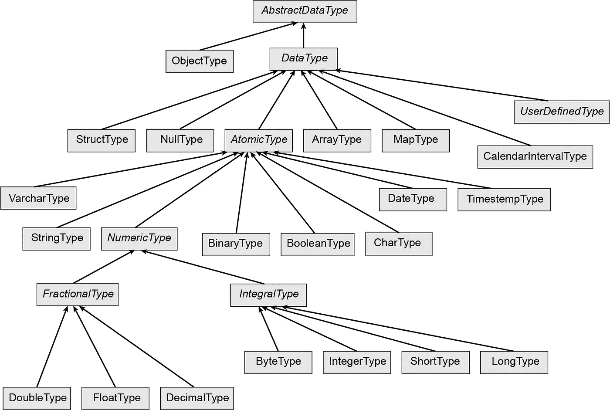**

**图 5(作者图片)**

## ****规范字符串表示****

**方法`cast()`有一个[重载变量](https://github.com/apache/spark/blob/v3.1.1/sql/core/src/main/scala/org/apache/spark/sql/Column.scala#L1204)，它使用类型的规范字符串表示:**

```
**def** cast(to: **String**): Column
```

**例如，`DoubleType`的规范表示是`double`。所以前面的例子也可以写成:**

```
**import** org.apache.spark.sql.{functions=>F} **val** temperatureDF = temp.withColumn("temperature",  
  F.col("temperature").cast("double"))
temperatureDF.show()
```

**现在你不需要进口`DoubleType`。表 1 显示了 Spark 中不同类型的规范表示。**

**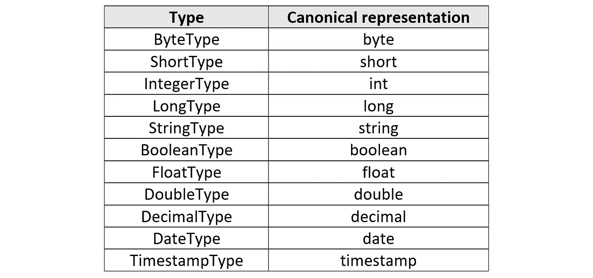**

**表 1**

## ****时间戳****

**我们可以创建一个时间戳列作为使用`cast()`的另一个例子:**

```
**import** org.apache.spark.sql.{functions=>F} **val** temp = **Seq**(("2020-01-01 07:30:00", 17.0), 
  ("2020-01-02 07:30:00", 25.5),  
  ("2020-01-03 07:30:00", 19.5),  
  ("2020-01-04 07:30:00", 21.2),  
  ("2020-01-05 07:30:00", 18.0), 
  ("2020-01-06 07:30:00", 20.5)
  ).toDF("time", "temperature")**val** temperatureDF = temp.withColumn("time", 
  F.col("time").cast("timestamp"))
temperatureDF.show()**//Output:
+-------------------+-----------+ 
|               time|temperature| 
+-------------------+-----------+ 
|2020-01-01 07:30:00|       17.0| 
|2020-01-02 07:30:00|       25.5| 
|2020-01-03 07:30:00|       19.5| 
|2020-01-04 07:30:00|       21.2| 
|2020-01-05 07:30:00|       18.0| 
|2020-01-06 07:30:00|       20.5| 
+-------------------+-----------+**
```

## ****删除一列****

****drop()****

**类 `[Dataset](https://github.com/apache/spark/blob/v3.1.1/sql/core/src/main/scala/org/apache/spark/sql/Dataset.scala#L2524)`中的方法`drop()` [用于从数据帧中删除特定的列:](https://github.com/apache/spark/blob/v3.1.1/sql/core/src/main/scala/org/apache/spark/sql/Dataset.scala#L2524)**

```
**def** drop(col: Column): DataFrame
```

**它接受一个`Column`对象，并返回一个删除了该列的新数据集。我们也可以使用列名来删除它:**

```
**def** drop(colName: **String**): DataFrame
```

**或者删除多个列:**

```
**def** drop(colNames: **String***): DataFrame
```

**例如，要从`staffDF`中删除列`role`和`salary`，我们可以写:**

```
staffDF.drop("role", "salary").show()**//Output:
+-----+ 
| name| 
+-----+ 
| John| 
|James| 
|Laura| 
|  Ali| 
|Steve| 
+-----+**
```

**我们还可以使用`_*`操作符从列表中删除列，将列表解包到`drop()`的参数中:**

```
**val** dropList = **List**("role", "salary")
staffDF.drop(dropList :**_***).show()
```

# ****行****

**到目前为止，我们已经讨论了与数据集或数据帧的列相关的操作，现在我们可以专注于它的行。如前所述，数据帧的每一行都是一个通用的`Row`对象。您可以使用`map()`函数迭代数据帧的行。**

## **格塔斯()**

**如前所述，DataFrame `Row`对象中的项目具有类型`Any`。我们可以使用[方法](https://github.com/apache/spark/blob/v3.1.1/sql/catalyst/src/main/scala/org/apache/spark/sql/Row.scala#L358) `[getAs()](https://github.com/apache/spark/blob/v3.1.1/sql/catalyst/src/main/scala/org/apache/spark/sql/Row.scala#L358)`来获取 DataFrame 的一行中的一个项目，并将其转换为一个类型。该方法被声明为:**

```
**def** getAs[T](i: **Int**): T
```

**它返回给定索引`i`处的`Row`对象(它在其上被调用)的字段值，作为类型`T`。它的另一个定义是:**

```
**def** getAs[T](fieldName: **String**): T
```

**它返回列名为`fieldName`的`Row`对象的字段值，作为类型`T`。所以您可以通过`getAs()`使用列名和索引。下面是一个使用`map()`函数迭代 DataFrame 的行并使用`getAs()`获取每行中的项目的示例:**

```
staffDF.map {row => 
  (row.getAs[**String**](0), row.getAs[**Integer**]("salary") * 1.2)}
  .toDF("name", "bonus").show()**//Output:
+-----+------+ 
| name| bonus| 
+-----+------+ 
| John|5400.0| 
|James|3840.0| 
|Laura|4920.0| 
|  Ali|3840.0| 
|Steve|4320.0| 
+-----+------+**
```

## **getInt()、getDouble()和 getString()**

**也可以用类似`[getInt()](https://github.com/apache/spark/blob/v3.1.1/sql/catalyst/src/main/scala/org/apache/spark/sql/Row.scala#L245)`、`[getDouble()](https://github.com/apache/spark/blob/v3.1.1/sql/catalyst/src/main/scala/org/apache/spark/sql/Row.scala#L270)`的以`get`开头的一系列方法。这些方法返回特定类型的给定索引`i`处的列值。例如，`getString()`将其作为 string 对象返回。所以前面的例子可以写成:**

```
staffDF.map {row => 
  (row.getString(0), row.getAs[**Integer**]("salary") * 1.2)
  }.toDF("name", "bonus").show()
```

**我们还可以使用这些方法来获取数据帧的单行中的字段值:**

```
staffDF.filter($"name" === "John").head().getAs[String]("name")**//Output:
res1: String = John**
```

**这里我们首先过滤所需的行。结果是一个 DataFrame，所以我们使用`head()`来获取它的`Row`对象。然后我们可以使用适当的 get 函数来获取该行的一个字段。**

## ****分裂一列****

****拆分()****

**该方法**

```
**def** split(str: Column, pattern: **String**): Column
```

**在类`Column`中，围绕`pattern`的匹配项拆分列`str`，这里`pattern`表示一个正则表达式。该方法在[对象](https://github.com/apache/spark/blob/v3.1.1/sql/core/src/main/scala/org/apache/spark/sql/functions.scala#L2683)中定义`[functions](https://github.com/apache/spark/blob/v3.1.1/sql/core/src/main/scala/org/apache/spark/sql/functions.scala#L2683)`。返回的`Column`的数据类型为`Array`。所以这一列的每一行都是一个包含所有拆分结果的数组。这里有一个例子:**

```
**import** org.apache.spark.sql.{functions=>F} **import** spark.implicits.**_**
**val** rawDF = **Seq**(
  ("John, Data scientist", 4500),
  ("James, Data engineer", 3200),
  ("Laura, Data scientist", 4100)).toDF("name-role", "salary")
rawDF.select($"name-role", F.split($"name-role", 
  ",").as("split_col")).show(false)**//Output:
+---------------------+------------------------+ 
|name-role            |split_col               | 
+---------------------+------------------------+ 
|John, Data scientist |[John,  Data scientist] | 
|James, Data engineer |[James,  Data engineer] | 
|Laura, Data scientist|[Laura,  Data scientist]| 
+---------------------+------------------------+**
```

**但是我们如何访问这个数组中的元素呢？该方法**

```
**def** getItem(key: **Any**): Column
```

**在[类](https://github.com/apache/spark/blob/v3.1.1/sql/core/src/main/scala/org/apache/spark/sql/Column.scala#L871)中定义`[Column](https://github.com/apache/spark/blob/v3.1.1/sql/core/src/main/scala/org/apache/spark/sql/Column.scala#L871)`。您可以在包含数组的`Column`对象上调用这个方法。它从数组中获取一个位置为`ordinal`的项目，并将其作为一个新的`Column`对象返回。因此，我们可以使用下面的代码来拆分一列，并将拆分的项提取为单独的列:**

```
**import** org.apache.spark.sql.{functions=>F} **import** spark.implicits.**_**
**val** rawDF = **Seq**(
  ("John, Data scientist", 4500),
  ("James, Data engineer", 3200),
  ("Laura, Data scientist", 4100)).toDF("name-role", "salary")
**val** splitDF = rawDF.select(F.split($"name-role", 
  ",").as("split_col"), $"salary")
splitDF.select(
  $"split_col".getItem(0).as("name"),
  $"split_col".getItem(1).as("role"),
  $"salary").show()**//Output:
+-----+---------------+------+ 
| name|           role|salary| 
+-----+---------------+------+ 
| John| Data scientist|  4500| 
|James|  Data engineer|  3200| 
|Laura| Data scientist|  4100| 
+-----+---------------+------+**
```

**我们还可以以编程方式创建新列的名称。当我们获得大量新列时，这很有用。以下代码拆分一列，将新列命名为`col1`、`col2`、… `coln`，然后删除它:**

```
**import** org.apache.spark.sql.{functions=>F}
rawDF.select(F.col("*"),
  F.split($"name-role",  ",").as("split_col"))
  .select((0 to 1).map(i => 
    F.col("split_col").getItem(i)
    .as(s"col${i+1}")) :+ F.col("*") : **_***)
  .drop("name-role", "split_col").show()**//Output:
+-----+---------------+------+ 
| col1|           col2|salary| 
+-----+---------------+------+ 
| John| Data scientist|  4500| 
|James|  Data engineer|  3200| 
|Laura| Data scientist|  4100| 
+-----+---------------+------+**
```

## ****自定义项****

****自定义项()****

**Spark 允许您定义用户定义函数(UDF)来扩展其内置函数。UDF 是基于列的函数，接受一个或多个列作为输入参数，并返回一个新列作为输出。你可以通过定义一个 Scala 函数并用`udf()`方法包装它来定义一个 UDF。例如，下面的代码定义了一个 UDF 来确定一列中的数字是否为偶数。定义 UDF 后，我们可以使用`withColumn()`将其应用于一个列:**

```
**import** org.apache.spark.sql.{functions=>F} **val** numDF = **Seq**(6, 9, 12, 3, 10).toDF("number")**val** isEven = (number: **Int**) => number % 2 == 0
**val** isEvenUDF = F.udf(isEven)
**val** newDF = numDF.withColumn("even", isEvenUDF($"number"))
newDF.show()**//Output:
+------+-----+ 
|number| even| 
+------+-----+ 
|     6| true| 
|     9|false| 
|    12| true| 
|     3|false| 
|    10| true| 
+------+-----+**
```

**为此，我们可以使用`select()`:**

```
**val** newDF = numDF.select(F.col("*"), isEvenUDF($"number") as "even")
```

**在对象`functions`中定义了[方法](https://github.com/apache/spark/blob/v3.1.1/sql/core/src/main/scala/org/apache/spark/sql/functions.scala#L4648)T10。它接受多达 15 个参数的 Scala 函数。对于每个参数数量，都有一个重载的`udf()`函数。例如，对于带有一个参数的函数，`udf()`定义为:**

```
**def** udf[RT: TypeTag, A1: TypeTag](f: Function1[A1, RT]): UserDefinedFunction = {    
  **val** outputEncoder = Try(ExpressionEncoder[RT]()).toOption    
  **val** ScalaReflection.Schema(dataType, nullable) =  
    outputEncoder.map(UDFRegistration.outputSchema)
    .getOrElse(ScalaReflection.schemaFor[RT])    
  **val** inputEncoders = Try(ExpressionEncoder[A1]()).toOption :: Nil
  **val** udf = SparkUserDefinedFunction(f, dataType, inputEncoders, 
    outputEncoder)    
  **if** (nullable) udf **else** udf.asNonNullable()
}
```

**在 Scala 中，编译器在编译时移除所有泛型类型信息。因此类型参数`A1`和`RT`在运行时将不可见。`udf()`使用`TypeTag`从 Scala 反射中识别出`RT`和`A1`的数据类型，封装了类型的运行时类型表示。`udf()`的返回类型为`UserDefinedFunction`。**

**`udf()`为函数(`RT`)的返回类型创建编码器，并将其分配给`outputEncoder`。它还创建一个列表，其中包含它所采用的函数的每个参数的编码器(`f`)。这里`f`只有一个参数，所以列表只有一个元素。该列表被分配给`inputEncoders`。`f`的返回类型被分配给`dataType`。最后，case 类`SparkUserDefinedFunction`的一个实例被创建并作为`udf()`的输出返回。这个类是在 org . Apache . spark . SQL . expressions 包中的[文件](https://github.com/apache/spark/blob/v3.1.1/sql/core/src/main/scala/org/apache/spark/sql/expressions/UserDefinedFunction.scala#L90) `[UserDefinedFunction.scala](https://github.com/apache/spark/blob/v3.1.1/sql/core/src/main/scala/org/apache/spark/sql/expressions/UserDefinedFunction.scala#L90)`中定义的。**

```
**private**[spark] **case class** SparkUserDefinedFunction(    
 f: AnyRef, dataType: DataType,    
 inputEncoders: **Seq**[**Option**[ExpressionEncoder[**_**]]] = **Nil**, 
 outputEncoder: **Option**[ExpressionEncoder[**_**]] = None,
 name: **Option**[**String**] = None, nullable: **Boolean** = true,   
 deterministic: **Boolean** = true) **extends** UserDefinedFunction {      @scala.annotation.varargs  
  **override def** apply(exprs: Column*): Column = {    
    Column(createScalaUDF(exprs.map(**_**.expr))) 
}
...
```

**我们只提供了这个类的前四个参数，所以其他参数采用它们的默认值。我们可以在前面的例子(`isEvenUDF`)中检查这个类的参数:**

```
isEvenUDF**//Output:
res0: org.apache.spark.sql.expressions.UserDefinedFunction = SparkUserDefinedFunction($Lambda$4279/486689149@634ff1c9,BooleanType,List(Some(class[value[0]: int])),Some(class[value[0]: boolean]),None,false,true)**
```

**事实上，我们可以使用`SparkUserDefinedFunction`直接创建我们的 UDF:**

```
**import** org.apache.spark.sql.catalyst.encoders.ExpressionEncoder
**import** org.apache.spark.sql.expressions.SparkUserDefinedFunction
**import** org.apache.spark.sql.types.BooleanType
**import** scala.util.Try**val** outputEncoder = Try(ExpressionEncoder[**Boolean**]()).toOption
**val** inputEncoders = Try(ExpressionEncoder[**Int**]()).toOption :: **Nil**
**val** isEvenUDF = SparkUserDefinedFunction((**_**: **Int**) % 2 == 0, 
  BooleanType, inputEncoders, outputEncoder)
```

**这里我们使用`ExpressionEncoder`类来创建输入和输出编码器。我们还知道`isEven()`的返回类型是 Boolean。**

**`SparkUserDefinedFunction`的`[apply()](https://github.com/apache/spark/blob/v3.1.1/sql/core/src/main/scala/org/apache/spark/sql/expressions/UserDefinedFunction.scala#L100)` [方法](https://github.com/apache/spark/blob/v3.1.1/sql/core/src/main/scala/org/apache/spark/sql/expressions/UserDefinedFunction.scala#L100)接受多个`Column`对象并返回一个`Column`对象。事实上，它将原始函数转换为基于列的函数。因此，我们只能将`Column`对象传递给从`udf()`返回的 UDF。(如果我们传递列名，它不会编译)。`apply()`使用`expr`将方法`createScalaUDF()`应用于输入列的内部催化剂表达式序列。该方法在[相同的类](https://github.com/apache/spark/blob/v3.1.1/sql/core/src/main/scala/org/apache/spark/sql/expressions/UserDefinedFunction.scala#L104)中定义:**

```
**private**[sql] **def** createScalaUDF(exprs: **Seq**[Expression]): ScalaUDF = {    
  ScalaUDF(f, dataType, exprs, inputEncoders,
    outputEncoder, udfName = name,
    nullable = nullable,
    udfDeterministic = deterministic)
}
```

**它返回一个`ScalaUDF`对象。在 org . Apache . spark . SQL . catalyst . expressions 包中定义了[类](https://github.com/apache/spark/blob/v3.1.1/sql/catalyst/src/main/scala/org/apache/spark/sql/catalyst/expressions/ScalaUDF.scala#L47) `[ScalaUDF](https://github.com/apache/spark/blob/v3.1.1/sql/catalyst/src/main/scala/org/apache/spark/sql/catalyst/expressions/ScalaUDF.scala#L47)`**

```
**case class** ScalaUDF(
  function: AnyRef, dataType: DataType,
  children: **Seq**[**Expression**],
  inputEncoders: **Seq**[**Option**[ExpressionEncoder[**_**]]] = **Nil**,       
  outputEncoder: **Option**[ExpressionEncoder[**_**]] = None,
  udfName: **Option**[**String**] = None, nullable: **Boolean** = true,      
  udfDeterministic: **Boolean** = true) **extends** Expression **with** NonSQLExpression **with** UserDefinedExpression
```

**它采用 UDF 函数、其返回数据类型、编码器、输入 Catalyst 表达式和一些其他默认值。对于我们的例子，我们可以写:**

```
**import** org.apache.spark.sql.catalyst.encoders.ExpressionEncoder
**import** org.apache.spark.sql.catalyst.expressions.Literal
**import** org.apache.spark.sql.catalyst.expressions.ScalaUDF**val** isEvenUDF = ScalaUDF((**_**: **Int**) % 2 == 0, **BooleanType**, Literal(6)   
    :: **Nil**, **Option**(ExpressionEncoder[**Int**]()) :: **Nil**)
```

**这里我们用一个文字值来测试它。方法`eval()`对输入的内部行执行 UDF 函数。**

```
isEvenUDF.eval()**//Output:
res1: Any = true**
```

**在下一个例子中，我们用`udf()`包装了一个带有两个参数的函数:**

```
**import** org.apache.spark.sql.{functions=>F} **def** func(salary: **Integer**, role: **String**): **String** = 
  (salary, role) **match** {
    **case** (x, "Data scientist") **if** x >= 4000 => "Senior"
    **case** (x, "Data engineer") **if** x > 3800  => "Senior"
    **case** (x, **_**) **if** x >= 3500  => "Senior"
    **case _**          => "Junior"
  }**val** levelUDF = F.udf(func **_**)**val** newStaffDF = staffDF.withColumn("level",                                                            
  levelUDF(F.col("salary"), F.col("role")))
newStaffDF.show()**//Output:
+-----+--------------+------+------+ 
| name|          role|salary| level| 
+-----+--------------+------+------+ 
| John|Data scientist|  4500|Senior| 
|James| Data engineer|  3200|Junior| 
|Laura|Data scientist|  4100|Senior| 
|  Ali| Data engineer|  3200|Junior| 
|Steve|     Developer|  3600|Senior| 
+-----+--------------+------+------+**
```

**我们首先定义带两个参数的 Scala 函数`func`。然后用`udf()`包起来。我们也可以这样定义它:**

```
**val** levelUDF = F.udf[**String**, **Integer**, **String**](func)
```

**这里我们需要提供函数参数的返回类型和数据类型。如果您查看 1 到 15 个参数的`udf()`函数的定义，您会看到返回类型排在第一位。**

**如前所述，`udf()`返回的 UDF 函数只能将`Column`对象作为参数。因此，如果 Scala 函数接受一个不是`Column`对象的参数，我们需要将其转换为`Column`对象。例如，假设我们需要一个函数，它将一个整数作为第二个参数，并将它添加到一个列中。我们像往常一样定义 UDF。但是当我们想要使用`withColumn()`内部的 UDF 时，我们需要用`lit()`包装第二个参数，它是一个整数:**

```
**import** org.apache.spark.sql.{functions=>F} **import** org.apache.spark.sql.functions.lit**val** numDF = **Seq**(6, 9, 12, 3, 10).toDF("**number**")
**val** addConst = (number: **Int**, const: **Int**) => number + const
**val** addConstUDF = F.udf(addConst)
**val** newDF = numDF.withColumn("new_number", addConstUDF($"number", lit(5)))
newDF.show()**//Output:
+------+----------+ 
|number|new_number| 
+------+----------+ 
|     6|        11| 
|     9|        14| 
|    12|        17| 
|     3|         8| 
|    10|        15| 
+------+----------+**
```

**[方法](https://github.com/apache/spark/blob/v3.1.1/sql/core/src/main/scala/org/apache/spark/sql/functions.scala#L114) `[lit()](https://github.com/apache/spark/blob/v3.1.1/sql/core/src/main/scala/org/apache/spark/sql/functions.scala#L114)`:**

```
**def** lit(literal: Any): Column
```

**创建一列文字值。所以`lit(5)`创建一个所有元素都等于 5 的列。该列中的行数将等于`$"number"`中的行数。**

****广播变量****

**在下一节中，我们将讨论一些参数不是`Column`对象的 UDF。为了使用这样的 UDF，我们需要广播它们的参数。我们将在这里解释广播变量。广播变量允许我们以有效的方式与每个节点共享变量的只读副本。因此，将没有必要航运它的副本与任务。Spark 可以使用高效的广播算法来分发广播变量，以降低通信成本。**

****广播()****

**我们可以使用`SparkContext`类中的方法`broadcast()`来创建一个广播变量。这里有一个例子:**

```
**val** v = Array(1, 2, 3)
**val** broadcastV = spark.sparkContext.broadcast(v)**//Output
broadcastV: org.apache.spark.broadcast.Broadcast[Array[Int]] = Broadcast(7762)**
```

**如您所见，原始变量用一个`Broadcast`对象包装。创建广播变量后，应该在集群上运行的任何函数中使用它来代替原始变量，以便原始变量不会被多次发送到节点。此外，原始变量在广播后不应被修改，以确保所有节点获得相同的广播变量的值。**

**广播变量不会通过调用`spark.sparkContext.broadcast()`发送给节点上的执行器。而是会在第一次使用的时候发货。当一个方法需要处理一个广播变量时，它不能直接使用广播变量。相反，应该通过调用`value()`方法来访问它的`value`。该方法返回由`broadcast()`包装的实际变量。因此，要使用前一个示例中的广播数组，我们应该编写:**

```
broadcastV.values
```

****带非列参数的自定义项****

**现在假设您有一个将`Map`作为参数的函数，因此您不能再用`lit()`包装它。这里我们不包括那些不能被转换成被`udf()`包装的 Scala 函数的参数列表中的`Column`对象的参数。UDF 将把这些参数放在一个单独的参数表中，作为*控制的*函数。让我们看一个例子:**

```
**import** org.apache.spark.sql.{functions=>F} **import** org.apache.spark.broadcast.Broadcast **val** jobCodes = **Map**("Data scientist" -> 0,
                   "Data engineer" -> 1,
                   "Developer" -> 2)**val** broadcastJobCodes = spark.sparkContext.broadcast(jobCodes) **def** mapJobCodeUDF(m: Broadcast[**Map**[**String**, **Int**]]) = 
  udf((role: **String**) => m.value.getOrElse(role, -1))staffDF.select($"role",
  mapJobCodeUDF(broadcastJobCodes)($"role")
  .as("job_code")).show()**//Output:
+--------------+--------+ 
|          role|job_code| 
+--------------+--------+ 
|Data scientist|       0| 
| Data engineer|       1| 
|Data scientist|       0| 
| Data engineer|       1| 
|     Developer|       2| 
+--------------+--------+**
```

**在这里，我们首先需要广播`jobCodes`以将其缓存在每个节点上。广播变量叫做`broadcastJobCodes`。函数文字`(role: String) => m.getOrElse(role, -1)`是一个*开放项*，因为它有一个自由变量`m`。该变量不能转换成`Column`对象，因为它是一个广播`Map`。运行时从这个函数文字创建的对象是一个*闭包*。实际上，`udf()`里面的闭包只带一个参数，就是一个`Column`对象。**

**`mapJobUDF`是一个简化的 UDF 函数，因为它有两个独立的参数列表。的确可以写成`mapJobUDF(m: Map[String, Int])(role: String)`。在`select()`内部，我们首先将广播变量传递给它。现在`mapJobUDF(broadcastJobCodes)`是一个只有一个参数(`$"role"`)的 UDF 函数，这个参数是一个`Column`对象。请注意，我们需要在 UDF 函数中使用广播变量的值(`m.value`)。**

****UDF 中的空值****

**UDF 不能将`Option`作为参数。不过，你可以用它们来处理`null` s。例如，以下代码不会运行，因为 UDF 不能对空值进行双精度运算:**

```
**//This won't run
import** org.apache.spark.sql.{functions=>F}
**val** someRow: **Seq**[**Integer**] = Seq(6, 9, 12, **null**, 10)
**val** numDF = someRow.toDF("number")**def** makeDouble(num: **Integer**): **Integer** = 2*num
**val** makeDoubleUDF = F.udf[**Integer**, **Integer**](makeDouble)numDF.withColumn("number doubled", 
  makeDoubleUDF(F.col("number"))).show()
```

**但是，我们可以修改 UDF 来处理空值，并用`Option`包装返回值:**

```
**import** org.apache.spark.sql.{functions=>F} **def** makeDouble(num: **Integer**): **Option**[**Integer**] = num **match** {
  **case null** => None
  **case** x => Some(2*x)
}
**val** makeDoubleUDF = F.udf[Option[**Integer**], **Integer**](makeDouble)numDF.withColumn("number doubled", makeDoubleUDF(F.col("number"))).show()**//Output:
+------+--------------+ 
|number|number doubled| 
+------+--------------+ 
|     6|            12| 
|     9|            18| 
|    12|            24| 
|  null|          null| 
|    10|            20| 
+------+--------------+**
```

**最后一点，UDF 就像 Spark SQL 的黑盒，所以它不能优化它们。因此，您应该尽可能避免使用它们，以提高代码的性能。**

## ****过滤行****

****过滤器()****

**[类](https://github.com/apache/spark/blob/v3.1.1/sql/core/src/main/scala/org/apache/spark/sql/Dataset.scala#L1596) `[Dataset](https://github.com/apache/spark/blob/v3.1.1/sql/core/src/main/scala/org/apache/spark/sql/Dataset.scala#L1596)`中的方法`filter()`使用给定的条件过滤数据集或数据帧的行:**

```
**def** filter(condition: Column): Dataset[T]
```

**条件是返回布尔列的列表达式，因此不能简单地使用列名，除非该列的类型是布尔。`filter()`将结果作为新的`Dataset`返回。在下面的示例中，它用于过滤`staffDF`中`salary`等于`3200`的行。**

```
**val** filteredDF = staffDF.filter($"salary" === 3200)  
filteredDF.show()**//Output:
+-----+-------------+------+
| name|         role|salary|
+-----+-------------+------+
|James|Data engineer|  3200|
|  Ali|Data engineer|  3200|
+-----+-------------+------+**
```

**表 2 给出了可用于列表达式的布尔和逻辑方法的列表。**

**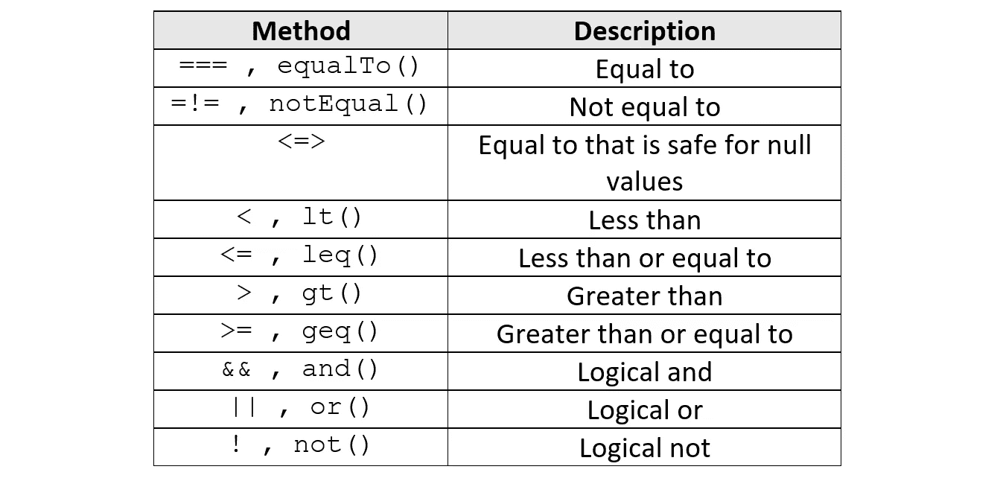**

**表 2**

**这是另一个例子:**

```
**val** filteredDF = staffDF.filter($"salary" > 3200 && $"name" =!= "Ali")  
filteredDF.show()**//Output:
+-----+--------------+------+ 
| name|          role|salary| 
+-----+--------------+------+ 
| John|Data scientist|  4500| 
|Laura|Data scientist|  4100| 
|Steve|     Developer|  3600| 
+-----+--------------+------+**
```

**如表 2 所示，您可以使用每个操作符可用的替代方法。因此，前面的例子可以写成:**

```
**val** filteredDF = staffDF.filter(($"salary" gt 3200) and ($"name" notEqual "Ali"))
```

**但是，您需要在比较方法周围添加括号，因为它们的评估优先级不会高于`and`。如果去掉括号，表达式**

```
$"salary" gt 3200 and $"name" notEqualTo "Ali"
```

**被评估为**

```
 (($"salary" gt 3200) and $"name") notEqualTo "Ali" 
```

**所以`and`的右操作数将是一个`Int`列，而不是一个`Boolean`列，这样你就会得到一个错误。**

**请注意，这里我们使用`===`作为等式运算符，而不是`==`。在 Spark 中，`===`和`==`都是相等运算符，但返回的类型不同。列表达式`a==b`返回一个`Column`对象，该对象包含列`a`和`b`的单个元素的比较结果。**

```
staffDF.select($"salary" === 3200).show()**//Output:
+---------------+ 
|(salary = 3200)| 
+---------------+ 
|          false| 
|           true| 
|          false| 
|           true| 
|          false| 
+---------------+**
```

**事实上，表 2 中的所有比较操作符都返回这样一个`Column`对象。另一方面，列表达式`a==b`返回一个布尔值。当列`a`等于列`b`时，它返回`true`。当两列的所有对应元素都相等时，认为这两列相等。**

```
staffDF("salary") == 3200**//Output:
res0: Boolean = false**
```

**`===`的一个问题是它消除了空值。例如，在下面的代码中**

```
**val** df = Seq(
  ("a", "a"),
  ("b", "b"),
  (**null**, **null**)).toDF("c1", "c2")df.filter($"c1" === $"c2").show()**//Output:
+---+---+ 
| c1| c2| 
+---+---+ 
|  a|  a| 
|  b|  b| 
+---+---+**
```

**`$"c1" === $"c2"`删除`c1`和`c2`列中的空值。在这种情况下，我们可以使用等式运算符`<=>`，它对于空值是安全的，并且不会消除它们:**

```
df.filter($"c1" <=> $"c2").show()**//Output:
+----+----+ 
|  c1|  c2| 
+----+----+ 
|   a|   a| 
|   b|   b| 
|null|null| 
+----+----+**
```

**或者，`filter()`的条件可以是一个字符串:**

```
**def** filter(conditionExpr: **String**): Dataset[T]
```

**这里的`conditionExpr`是一个布尔 SQL 表达式。表 3 给出了可以用于 SQL 表达式的布尔和逻辑运算符的列表。所以下面的代码**

```
**val** filteredDF = staffDF.filter($"salary" > 3200 && $"name" =!= "Ali")
```

**也可以写成:**

```
**val** filteredDF = staffDF.filter("salary > 3200 and name != 'Ali'")
```

**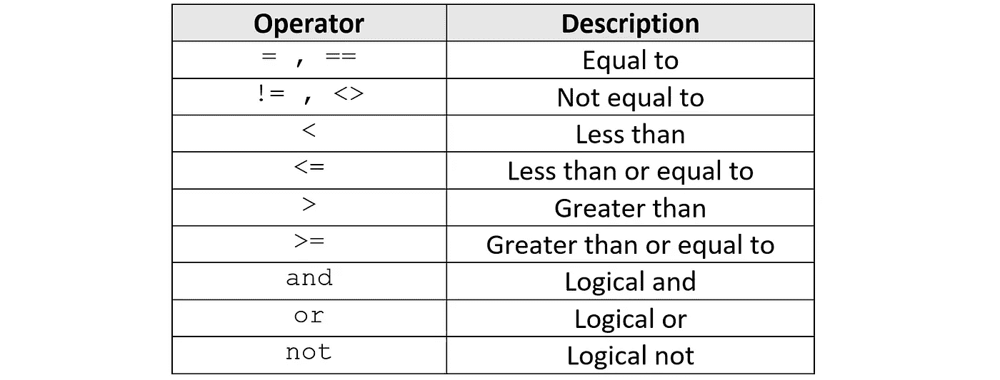**

**表 3**

****哪里()****

**[类](https://github.com/apache/spark/blob/v3.1.1/sql/core/src/main/scala/org/apache/spark/sql/Dataset.scala#L1624) `[Dataset](https://github.com/apache/spark/blob/v3.1.1/sql/core/src/main/scala/org/apache/spark/sql/Dataset.scala#L1624)`中的方法`where()`也可用于使用给定条件过滤数据集或数据帧的行。相当于`filter()`，使用方法相同。**

```
**def** where(condition: Column): Dataset[T] = filter(condition)
```

****间()****

**方法`between()`在[类](https://github.com/apache/spark/blob/v3.1.1/sql/core/src/main/scala/org/apache/spark/sql/Column.scala#L571) `[Column](https://github.com/apache/spark/blob/v3.1.1/sql/core/src/main/scala/org/apache/spark/sql/Column.scala#L571)`中定义:**

```
**def** between(lowerBound: Any, upperBound: Any): Column = {
  (**this** >= lowerBound) && (**this** <= upperBound)
}
```

**它返回一个布尔型`Column`对象。如果调用该列的`Column`对象的相应行在下限和上限之间，则该列的每一行都是`true`。**

```
staffDF.select($"salary".between(3200,3600)).show()**//Output:
+---------------------------------------+ 
|((salary >= 3200) AND (salary <= 3600))| 
+---------------------------------------+ 
|                                  false| 
|                                   true| 
|                                  false| 
|                                   true| 
|                                   true| 
+---------------------------------------+**
```

## ****缺失值的处理方法****

****isNull()****

**我们可以使用类`Column`中的方法`isNull()`来过滤空值。还记得数据帧`staffWithNullDF`，它被定义为:**

```
**val** staffWithNullDF = **Seq**(
  ("John", null, 4500),
  ("James", "Data engineer", 3200),
  ("Laura", null, 4100),
  (null, "Data engineer", 3200),
  ("Steve", "Developer", 3600)
  ).toDF("name", "role", "salary")staffWithNullDF.show()**//Output:
+-----+-------------+------+ 
| name|         role|salary| 
+-----+-------------+------+ 
| John|         null|  4500| 
|James|Data engineer|  3200| 
|Laura|         null|  4100| 
| null|Data engineer|  3200| 
|Steve|    Developer|  3600| 
+-----+-------------+------+**
```

**为了过滤空值，我们可以写:**

```
staffWithNullDF.filter($"role".isNull).show()**//Output:
+-----+----+------+ 
| name|role|salary| 
+-----+----+------+ 
| John|null|  4500| 
|Laura|null|  4100| 
+-----+----+------+**
```

**您也可以使用 SQL 表达式来获得相同的结果:**

```
staffWithNullDF.filter("role IS NULL").show()
```

****isNotNull()****

**为了过滤非`null`的行，使用`isNotNull()`方法:**

```
staffWithNullDF.filter($"role".isNotNull).show()
```

**在包 org.apache.spark.sql 中定义了[类](https://github.com/apache/spark/blob/v3.1.1/sql/core/src/main/scala/org/apache/spark/sql/DataFrameNaFunctions.scala#L36) `[DataFrameNaFunctions](https://github.com/apache/spark/blob/v3.1.1/sql/core/src/main/scala/org/apache/spark/sql/DataFrameNaFunctions.scala#L36)`，以添加处理数据帧中缺失数据的功能。**

```
**final** **class** DataFrameNaFunctions **private**[sql](df: DataFrame) 
```

**它将 DataFrame 作为其参数，并且该类中的方法可以处理丢失的数据。方法`na`在[类](https://github.com/apache/spark/blob/v3.1.1/sql/core/src/main/scala/org/apache/spark/sql/Dataset.scala#L912) `[Dataset](https://github.com/apache/spark/blob/v3.1.1/sql/core/src/main/scala/org/apache/spark/sql/Dataset.scala#L912)`中定义，返回`DataFrameNaFunctions`的一个实例:**

```
**def** na: DataFrameNaFunctions = **new** DataFrameNaFunctions(toDF())
```

**它将调用它的`Dataset`对象转换为`DataFrame`，并返回一个用它实例化的`DataFrameNaFunctions`对象。**

```
staffWithNullDF.na**//Output:
res4: org.apache.spark.sql.DataFrameNaFunctions = org.apache.spark.sql.DataFrameNaFunctions@3e8f1f05**
```

**当我们得到`DataFrameNaFunctions`对象时，我们可以使用它的方法来处理丢失的数据。**

****fill()****

**为了填充空值，我们可以使用`fill()`的不同重载版本，它们在[类](https://github.com/apache/spark/blob/v3.1.1/sql/core/src/main/scala/org/apache/spark/sql/DataFrameNaFunctions.scala#L139) `[DataFrameNaFunctions](https://github.com/apache/spark/blob/v3.1.1/sql/core/src/main/scala/org/apache/spark/sql/DataFrameNaFunctions.scala#L139)`中可用。例如:**

```
**def** fill(value: **String**): DataFrame
```

**返回一个新的 DataFrame，用`value`替换字符串列中的空值。或者**

```
**def** fill(value: **Double**): DataFrame
```

**返回一个新的 DataFrame，用`value`替换数值列中的`null`或`NaN`值。例如，以下代码将所有字符串列中的空值替换为`N/A`:**

```
staffWithNullDF.na.fill("N/A").show()**//Output:
+-----+-------------+------+ 
| name|         role|salary| 
+-----+-------------+------+ 
| John|          N/A|  4500| 
|James|Data engineer|  3200| 
|Laura|          N/A|  4100| 
|  N/A|Data engineer|  3200| 
|Steve|    Developer|  3600| 
+-----+-------------+------+**
```

**我们还可以指定应该替换空值的列的名称。列名列表可以以序列或数组的形式给出。例如，在前面的示例中，我们只能填充`role`列的空值:**

```
staffWithNullDF.na.fill("N/A", **List**("role")).show()**//Output:
+-----+-------------+------+ 
| name|         role|salary| 
+-----+-------------+------+ 
| John|          N/A|  4500| 
|James|Data engineer|  3200| 
|Laura|          N/A|  4100| 
| null|Data engineer|  3200| 
|Steve|    Developer|  3600| 
+-----+-------------+------+**
```

****drop()****

**您可以使用[类](https://github.com/apache/spark/blob/v3.1.1/sql/core/src/main/scala/org/apache/spark/sql/DataFrameNaFunctions.scala#L91) `[DataFrameNaFunctions](https://github.com/apache/spark/blob/v3.1.1/sql/core/src/main/scala/org/apache/spark/sql/DataFrameNaFunctions.scala#L91)`中的方法`drop()`来删除`null`或`NaN`值。此方法的一般形式声明为:**

```
**def** drop(how: **String**, cols: **Seq**[**String**]): DataFrame
```

**当您在 DataFrame 上调用它时，它会删除指定列中包含`null`或`NaN`值的行，并将结果作为新的 DataFrame 返回。如果`how`设置为`any`，则删除指定列中至少包含一个`null`或`NaN`值的行。如果`how`设置为`all`，则仅删除所有指定列为`null`或`NaN`的行。**

**如果不指定列，那么它将应用于 DataFrame 的所有列，如果不指定`how`，那么它的默认值是`any`。列名也可以是一个`Array`对象。这里有几个例子:**

```
staffWithNullDF.na.drop().show()**//Output:
+-----+-------------+------+ 
| name|         role|salary| 
+-----+-------------+------+ 
|James|Data engineer|  3200| 
|Steve|    Developer|  3600| 
+-----+-------------+------+**
```

**和**

```
**val** someRows = **Seq**(
  (**null**, **null**, 4500),
  ("James", **null**, 3200),
  ("Laura", "Data scientist", 4100),
  ("Ali", "Data engineer", 3200),
  (**null**, "Developer", 3600)
)someRows.toDF("name", "role", "salary").na.drop("all", **List**("name", "role"))show()**//Output:
+-----+--------------+------+ 
| name|          role|salary| 
+-----+--------------+------+ 
|James|          null|  3200| 
|Laura|Data scientist|  4100| 
|  Ali| Data engineer|  3200| 
| null|     Developer|  3600| 
+-----+--------------+------+**
```

## **when()和 otherwise()**

**方法`when()`和`otherwise()`在类`Column`中定义，通常一起使用。`[When()](https://github.com/apache/spark/blob/v3.1.1/sql/core/src/main/scala/org/apache/spark/sql/Column.scala#L522)`被声明为:**

```
**def** when(condition: Column, value: Any): Column
```

**它对布尔列表达式`condition`求值，并基于此返回一个新的`Column`对象。如果`condition`的对应行是`true`，则结果列的每一行被设置为`value`，如果是`false`，则被设置为`null`。这里有一个例子:**

```
**import** org.apache.spark.sql.{functions=>F}
staffDF.select(F.when(staffDF("role") === "Data scientist", 
  3).alias("role code")).show()**//Output:
+---------+ 
|role code| 
+---------+ 
|        3| 
|     null| 
|        3| 
|     null| 
|     null| 
+---------+**
```

**这里，当一行`role`等于`Data scientist`时，结果对应的一行是`3`。否则就是`null`。您可以链接`when()`方法。因此`when()`可以应用于之前由另一个`when()`方法生成的列。[方法](https://github.com/apache/spark/blob/v3.1.1/sql/core/src/main/scala/org/apache/spark/sql/Column.scala#L554) `[otherwise()](https://github.com/apache/spark/blob/v3.1.1/sql/core/src/main/scala/org/apache/spark/sql/Column.scala#L554)`只能在`when()`链的末端使用。它被声明为:**

```
**def** otherwise(value: Any): Column
```

**它将用`value`替换由`when()`链产生的列的所有剩余的`null`元素。所以你不会得到任何空值。**

```
**import** org.apache.spark.sql.{functions=>F}
staffDF.select(F.when(staffDF("role") === "Data scientist", 3)
  .when(staffDF("role") === "Data engineer", 2)
  .otherwise(1).alias("role code"))
  .show()**//Output:
+---------+ 
|role code| 
+---------+ 
|        3| 
|        2| 
|        3| 
|        2| 
|        1| 
+---------+**
```

**下面是另一个当`role`为`Data scientist`时将`50`加到`salary`的例子:**

```
**import** org.apache.spark.sql.{functions=>F}
staffDF.withColumn("salary", F.when($"role" === "Data scientist", 
  $"salary" + 50).otherwise($"salary")).show()**//Otherwise
+-----+--------------+------+ 
| name|          role|salary| 
+-----+--------------+------+ 
| John|Data scientist|  4550| 
|James| Data engineer|  3200| 
|Laura|Data scientist|  4150| 
|  Ali| Data engineer|  3200| 
|Steve|     Developer|  3600| 
+-----+--------------+------+**
```

# ****分区****

**如前所述，在 Spark RDDs 中，数据集和数据帧是分布式数据结构，因此 Spark 将它们分开并分布在集群的工作节点中。这种分布式数据集的每个分割被称为一个*分区*。事实上，在 Spark 中，分区是存储在集群中一个节点上的逻辑数据块。分区是 Spark 中并行的基本单位，rdd、数据集和数据帧是分区的集合。Spark 集群中的每个节点都包含一个或多个分区。但是，一个分区不能跨越多个节点。Spark 中的分区数量是可配置的，太少或太多的分区都会降低性能。**

**Spark 可以为 RDD 的每个分区运行一个并发任务。然而，并发任务的总数受到集群中核心总数的限制。(每个节点可以有多个核心。)比如一个集群有十个核心，那么 Spark 最多可以运行十个并发任务。因此，这样一个集群上的 RDD 应该至少有十个分区。(实际上是两到四倍。)如果您的分区少于 10 个，一些内核会保持空闲，这会导致并发性降低。**

**另一方面，如果您有太多的分区，那么 Spark 中许多小任务的任务调度可能会比实际执行时间花费更多的时间。此外，节点之间的数据通信非常昂贵，所以 Spark 变得很慢。因此，在决定分区数量时，总会有一个权衡。根据经验，分区的数量应该是集群中核心数量的一到四倍。**

## **getNumPartitions()**

**要获得一个数据帧的分区数量，您应该首先使用在[类](https://github.com/apache/spark/blob/v3.1.1/sql/core/src/main/scala/org/apache/spark/sql/Dataset.scala#L3239) `[Dataset](https://github.com/apache/spark/blob/v3.1.1/sql/core/src/main/scala/org/apache/spark/sql/Dataset.scala#L3239)`中定义的方法`rdd()`将其转换为 RDD。它被声明为:**

```
**lazy val** rdd: RDD[T]
```

**它将数据集的内容表示为类型为`T`的`RDD`。然后，可以使用方法`getNumPartitions()`来获得该 RDD 中的分区数量:**

```
**val** x  = (1 to 12).toList
**val** numberDF = x.toDF("number")
numberDF.rdd.getNumPartitions**//Output:
res3: Int = 8**
```

**所以这个数据帧有八个分区。(在不同的集群上，该数字可能会有所不同。)**

## **分区()**

**您也可以使用[抽象类](https://github.com/apache/spark/blob/v3.1.1/core/src/main/scala/org/apache/spark/rdd/RDD.scala#L295) `[RDD](https://github.com/apache/spark/blob/v3.1.1/core/src/main/scala/org/apache/spark/rdd/RDD.scala#L295)`中的方法`partitions()`来获得相同的结果。它返回一个 RDD 的分区数组:**

```
numberDF.rdd.partitions.size
```

**事实上，八是这个集群的默认分区数。`sparkContext`中的方法`defaultParallelism`给出了默认的分区数量:**

```
spark.sparkContext.defaultParallelism**//Output:
res3: Int = 8**
```

## **mapPartitionsWithIndex()**

**我们还可以看到数据帧的行是如何在分区之间分布的。[类](https://github.com/apache/spark/blob/v3.1.1/core/src/main/scala/org/apache/spark/rdd/RDD.scala#L909) `[RDD](https://github.com/apache/spark/blob/v3.1.1/core/src/main/scala/org/apache/spark/rdd/RDD.scala#L909)`中的方法`mapPartitionsWithIndex()`通过将函数应用于被调用的 RDD 的每个分区来返回新的 RDD。同时跟踪原始分区的索引。**

```
**def** mapPartitionsWithIndex[U: ClassTag](f: (**Int**, Iterator[T]) => 
  Iterator[U], preservesPartitioning: **Boolean** = false): RDD[U]
```

**为了给前面定义的`numberDF`的每一行添加一个分区 ID，我们可以使用下面的代码:**

```
**import** spark.implicits.**_**
**import** org.apache.spark.sql.types.**_**
**import** org.apache.spark.sql.Row
**val** rows = numberDF.rdd.mapPartitionsWithIndex{ 
  (index, itr) => 
    itr.toList.map(x => Row.fromSeq(index +: x.toSeq)).iterator }.collect()
**val** someSchema = StructField("partitionIndex", IntegerType, true) +: 
  numberDF.schema.fields
**val** numberDFWithPartitionID = 
  spark.createDataFrame(spark.sparkContext.parallelize(rows), 
  StructType(someSchema))
numberDFWithPartitionID.show()**//Output:
+--------------+------+ 
|partitionIndex|number| 
+--------------+------+ 
|             0|     1| 
|             1|     2| 
|             1|     3| 
|             2|     4| 
|             3|     5| 
|             3|     6| 
|             4|     7| 
|             5|     8| 
|             5|     9| 
|             6|    10| 
|             7|    11| 
|             7|    12| 
+--------------+------+**
```

**这里，`mapPartitionsWithIndex()`中的文字函数遍历了`numberDF`的 RDD 的所有分区。它需要两个参数。第一个是分区索引，第二个是每个分区中的行。我们将每个分区中的行转换成一个列表，并将分区索引添加到每个对象行中。我们还需要更改模式，为分区索引添加一个新列。最后，我们创建一个带有`partitionIndex`列的新 DataFrame。该列给出了该行所属分区的索引。如输出所示，每个分区包含两行`numberDF`。**

## **重新分区()**

**您可以更改数据集或数据帧的分区数量。该方法:**

```
**def** repartition(numPartitions: **Int**): Dataset[T] = withTypedPlan {    
  Repartition(numPartitions, shuffle = true, logicalPlan)  }
```

**in [类](https://github.com/apache/spark/blob/v3.1.1/sql/core/src/main/scala/org/apache/spark/sql/Dataset.scala#3015) `[Dataset](https://github.com/apache/spark/blob/v3.1.1/sql/core/src/main/scala/org/apache/spark/sql/Dataset.scala#3015)`返回一个新的数据集，它正好有`numPartitions`个分区。**

```
**val** repNumberDF = numberDF.repartition(3)
repNumberDF.rdd.partitions.size**//Output:
res1: Int = 3**
```

**我们还可以看到行是如何在这三个分区之间分布的:**

```
**import** spark.implicits.**_**
**import** org.apache.spark.sql.types.**_**
**import** org.apache.spark.sql.Row
**val** rows = repNumberDF.rdd.mapPartitionsWithIndex{ 
  (index, itr) => 
    itr.toList.map(x => Row.fromSeq(index +: x.toSeq)).iterator }.collect()
**val** someSchema = StructField("partitionIndex", IntegerType, true) +: 
  repNumberDF.schema.fields
**val** repNumberDFWithPartitionID = 
  spark.createDataFrame(spark.sparkContext.parallelize(rows), 
  StructType(someSchema))
repNumberDFWithPartitionID.show()**//Output:
+--------------+------+ 
|partitionIndex|number| 
+--------------+------+ 
|             0|     5| 
|             0|     7| 
|             0|     8| 
|             0|    12| 
|             1|     1| 
|             1|     3| 
|             1|     6| 
|             1|     9| 
|             2|     2| 
|             2|     4| 
|             2|    10| 
|             2|    11| 
+--------------+------+**
```

## **联合()**

**我们还可以使用类`Dataset`中的方法`coalesce()`来返回一个新的数据集，它正好有`numPartitions`个分区:**

```
**def** coalesce(numPartitions: **Int**): Dataset[T] = withTypedPlan {    
  Repartition(numPartitions, shuffle = false, logicalPlan)  }
```

**如你所见，`coalesce()`和`repartition()`的唯一区别是`shuffle`的值。在`coalesce()`中，`shuffle`为`false`，而在`partition()`中为真。所以`repartition()`打乱了数据。当您将其应用于数据帧时，行的顺序可能会改变。它可以增加和减少原始数据集中的分区数量。但是，`coalesce()`只能减少分区的数量。如果请求更大数量的分区，它将保持当前的分区数量。原因是它不能混洗数据。让我们用`coalesce()`来减少`numberDF`中的分区数量。**

```
**val** coalNumberDF = numberDF.coalesce(3)
**val** rows = coalNumberDF.rdd.mapPartitionsWithIndex{ 
  (index, itr) => 
    itr.toList.map(x => Row.fromSeq(index +: x.toSeq)).iterator }.collect()
**val** someSchema = StructField("partitionIndex", IntegerType, true) +: 
  coalNumberDF.schema.fields
**val** coalNumberDFWithPartitionID = 
  spark.createDataFrame(spark.sparkContext.parallelize(rows), 
  StructType(someSchema))
coalNumberDFWithPartitionID.show()**//Output:
+--------------+------+ 
|partitionIndex|number| 
+--------------+------+ 
|             0|     1| 
|             0|     2| 
|             0|     3| 
|             1|     4| 
|             1|     5| 
|             1|     6| 
|             1|     7| 
|             2|     8| 
|             2|     9| 
|             2|    10| 
|             2|    11| 
|             2|    12| 
+--------------+------+**
```

**如果您将原始数据帧(`numberDFWithPartitionID`)的分区与重新分区的数据帧(`repNumberDFWithPartitionID`)和合并的数据帧(`coalNumberDFWithPartitionID`)的分区进行比较，您会看到`repartition()`对原始行进行了洗牌。它创建新的分区，并在这些分区中平均分配被打乱的数据。这是一个相当昂贵的操作，因为混洗的数据应该在节点之间传送。**

**`coalesce()`类似于`repartition()`的优化版本，因为它最大限度地减少了集群节点之间的数据移动。它不会打乱数据，只是简单地按照原始顺序组合行，以获得更少的分区。比如在原来的`numberDF`中，可以将分区 5 的数据保留在它们原来的节点中，只添加分区 6 和分区 7 的数据，以尽量减少节点间的数据移动。当然，你只能使用`coalesce()`来减少分区数量。**

## ****添加索引****

**Spark 数据集和数据帧本质上是无序的。它们不支持随机访问，所以它们没有像 Python 中的 Pandas 库那样的内置索引。数据帧是 Spark 中的分布式数据结构，Spark 集群的每个节点都可以存储和处理其中的一部分，而不用担心行的顺序。事实上，数据帧的每一行都被认为是一个独立的结构化数据集合，从而能够支持分布式并行处理。但是，可以向数据帧中添加一个新列，起到索引的作用。**

****单调 _ 递增 _id()****

**[对象](https://github.com/apache/spark/blob/v3.1.1/sql/core/src/main/scala/org/apache/spark/sql/functions.scala#L1214) `[functions](https://github.com/apache/spark/blob/v3.1.1/sql/core/src/main/scala/org/apache/spark/sql/functions.scala#L1214)`中的方法`monotonically_increasing_id()`返回一个 64 位整数单调递增的`Column`对象。该列的行保证是单调递增且唯一的，但不是连续的。该方法定义为:**

```
**def** monotonically_increasing_id(): Column = withExpr { MonotonicallyIncreasingID() }
```

**它调用方法`withExpr()`，该方法也在[对象](https://github.com/apache/spark/blob/v3.1.1/sql/core/src/main/scala/org/apache/spark/sql/functions.scala#L80) `[functions](https://github.com/apache/spark/blob/v3.1.1/sql/core/src/main/scala/org/apache/spark/sql/functions.scala#L80)`中定义:**

```
**private def** withExpr(expr: Expression): Column = Column(expr)
```

**它使用`expr`创建一个`Column`对象。所以`monotonically_increasing_id()`使用 case 类`MonotonicallyIncreasingID` 作为表达式创建一个新的`Column`对象。这个 case 类在[包 org . Apache . spark . SQL . catalyst . expressions](https://github.com/apache/spark/blob/v3.1.1/sql/catalyst/src/main/scala/org/apache/spark/sql/catalyst/expressions/MonotonicallyIncreasingID.scala#L50)中定义，它是非确定性方法的一个例子。**

```
**case class** MonotonicallyIncreasingID() **extends** LeafExpression **with** 
  Stateful
```

**在 Spark 中，如果一个表达式对于相同的输入得到相同的结果，那么它就是*确定性的*。`monotonically_increasing_id()`不是确定性的，因为它的结果取决于分区 id。它扩展了特征`Stateful`，该特征在包 org . Apache . spark . SQL . catalyst . expressions 中的`Expression.scala`中定义[特征](https://github.com/apache/spark/blob/v3.1.1/sql/catalyst/src/main/scala/org/apache/spark/sql/catalyst/expressions/Expression.scala#L433) `[Stateful](https://github.com/apache/spark/blob/v3.1.1/sql/catalyst/src/main/scala/org/apache/spark/sql/catalyst/expressions/Expression.scala#L433)`扩展了特征`Nondeterministic`，该特征用于不确定的表达式。**

```
**trait** Stateful **extends** Nondeterministic { ...
```

**所有扩展`Nondeterministic`的类都应该实现两个抽象方法:**

```
**protected def** initializeInternal(partitionIndex: Int): Unit 
**protected def** evalInternal(input: InternalRow): Any
```

**第一个函数初始化一个不确定的表达式，第二个函数对它求值。`MonotonicallyIncreasingId`有一个[计数器字段](https://github.com/apache/spark/blob/v3.1.1/sql/catalyst/src/main/scala/org/apache/spark/sql/catalyst/expressions/MonotonicallyIncreasingID.scala#L56)对记录进行计数:**

```
@transient **private**[**this**] **var** count: Long = _
```

**作为一个非确定性表达式，`MonotonicallyIncreasingID`在计算一个值之前需要显式初始化。对于每个分区，`[initializeInternal()](https://github.com/apache/spark/blob/v3.1.1/sql/catalyst/src/main/scala/org/apache/spark/sql/catalyst/expressions/MonotonicallyIncreasingID.scala#L60)`将`count`重置为零，并将分区索引(`partitionIndex`)移位 33 位。**

```
**override protected def** initializeInternal(partitionIndex: **Int**): **Unit** = {  
  count = 0**L**
  partitionMask = partitionIndex.toLong << 33  } 
```

**对于该分区中的每条记录，`[evalInternal()](https://github.com/apache/spark/blob/v3.1.1/sql/catalyst/src/main/scala/org/apache/spark/sql/catalyst/expressions/MonotonicallyIncreasingID.scala#L69)`将移位后的分区索引加到记录号上，并将其作为该记录的 ID 返回:**

```
**override protected def** evalInternal(input: InternalRow): **Long** = { 
  **val** currentCount = count    
  count += 1 
  partitionMask + currentCount  }
```

**所以 id 通常不是连续的；然而，在每个分区中，id 是连续的。例如，考虑之前创建的数据帧`numberDF`。我们将其重新分区为三个分区，然后向其中添加一个 ID 列。**

```
**import** org.apache.spark.sql.{functions=>F} **val** numberWithID = repNumberDF.withColumn("id", 
  F.monotonically_increasing_id())
numberWithID.show()**//Output:
+------+-----------+ 
|number|         id| 
+------+-----------+ 
|     5|          0| 
|     7|          1| 
|     8|          2| 
|    12|          3| 
|     1| 8589934592| 
|     3| 8589934593| 
|     6| 8589934594| 
|     9| 8589934595| 
|     2|17179869184| 
|     4|17179869185| 
|    10|17179869186| 
|    11|17179869187| 
+------+-----------+**
```

**图 6 显示了如何计算每行的 id。例如，`numberWithID`的最后一行属于分区 2，所以分区 ID 是:**

```
2L << 33**//Output:
res1: Long = 17179869184**
```

**由于这个分区中有四行，它们的 id 将是:`17179869184+0`，… `17179869184+3`。**

**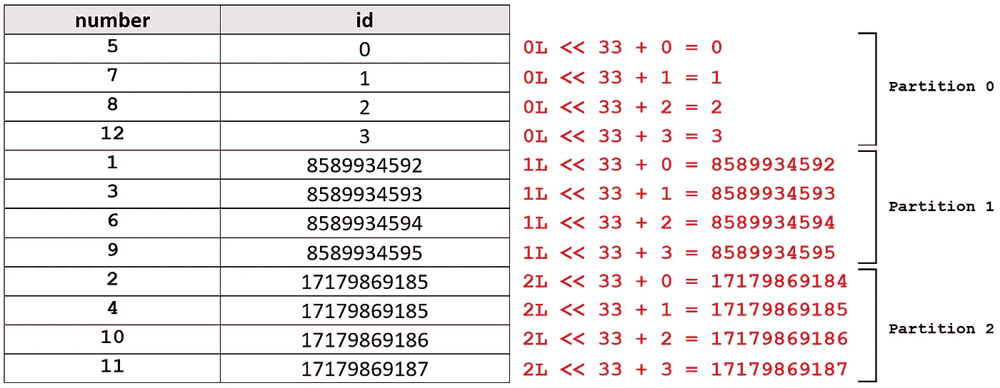**

**图 6**

**为了在所有行中都有连续的 id，我们可以对数据帧进行重新分区，使其只有一个分区。**

```
**import** org.apache.spark.sql.{functions=>F} **val** repOneNumberDF = numberDF.coalesce(1)
repOneNumberDF.withColumn("id",  
  F.monotonically_increasing_id()).show()**//Output:
+------+---+ 
|number| id| 
+------+---+ 
|     1|  0| 
|     2|  1| 
|     3|  2| 
|     4|  3| 
|     5|  4| 
|     6|  5| 
|     7|  6| 
|     8|  7| 
|     9|  8| 
|    10|  9| 
|    11| 10| 
|    12| 11| 
+------+---+**
```

****ziptwithindex()****

**我们也可以使用[类](https://github.com/apache/spark/blob/v3.1.1/core/src/main/scala/org/apache/spark/rdd/RDD.scala#L1388) `[RDD](https://github.com/apache/spark/blob/v3.1.1/core/src/main/scala/org/apache/spark/rdd/RDD.scala#L1388)`的方法`zipWithIndex()`来生成一个 ID 列。该方法被声明为:**

```
**def** zipWithIndex(): RDD[(T, **Long**)]
```

**它压缩了调用它的 RDD 及其元素索引。这个 RDD 拥有类型为`T`的对象，结果是一个拥有类型为`(T, Long)`的对象的 RDD。因此，得到的 RDD 的每条记录都是一个元组，它将原始 RDD 的记录与类型为`Long`的索引组合在一起。指数从零开始，增加 1。**

**排序首先基于分区索引，然后基于每个分区内的项目排序。第一个分区中的第一个项目的索引为 0，最后一个分区中的最后一个项目的索引最大。还记得我们之前创建的数据帧`repNumberDF`吗？它有三个分区。然后我们添加了一个 ID 列，结果是`numberWithID`。我们可以使用`zipWithIndex()`向`repNumberDF`添加一个 ID 列。**

```
**val** zippedRDD= repNumberDF.rdd.zipWithIndex()**//Output:
res1: Array[(org.apache.spark.sql.Row, Long)] = Array(([1],0), ([2],1), ([3],2), ([4],3), ([5],4), ([6],5), ([7],6), ([8],7), ([9],8), ([10],9), ([11],10), ([12],11))**
```

**结果是一个 RDD，其中每个记录都是一个元组。这个元组的第一个元素是`repNumberDF`的原始记录，第二个元素是它生成的索引。要从该 RDD 创建数据帧，我们可以使用以下代码:**

```
**import** org.apache.spark.sql.types.**_
import** org.apache.spark.sql.Row **import** org.apache.spark.sql.types._
**val** rows= zippedRDD.map(
  r => Row.fromSeq(r._1.toSeq ++ **Seq**(r._2))
  )
**val** someSchema =  repNumberDF.schema.fields ++ 
  **Array**(StructField("id", LongType, **true**))  
**val** dfWithID = spark.createDataFrame(rows, StructType(someSchema))
dfWithID.show()**//Output:
+------+---+ 
|number| id| 
+------+---+ 
|     1|  0| 
|     2|  1| 
|     3|  2| 
|     4|  3| 
|     5|  4| 
|     6|  5| 
|     7|  6| 
|     8|  7| 
|     9|  8| 
|    10|  9| 
|    11| 10| 
|    12| 11| 
+------+---+**
```

**为了创建一个数据帧，我们首先映射`zippedRDD`的记录，从它们创建`Row`对象。现在每一行都有一个索引。因此应该相应地修改原始数据帧的模式。我们向该模式添加索引，然后使用该模式创建一个新的数据帧。在`repNumberDF`中，包含 4、5 和 6 的行属于分区 0，因此它们的索引是 0、1 和 2。事实上，`dfWithID`和`numberWithID`中的行的顺序是完全相同的，因为排序首先基于分区索引，然后基于每个分区内的项目排序。**

**您也可以创建`dfWithID`，使`id`列成为第一列:**

```
**import** org.apache.spark.sql.types.**_
import** org.apache.spark.sql.Row **val** rows= zippedRDD.map{
  **case** (row, index) => Row.fromSeq(index +: row.toSeq)
  }
**val** someSchema = StructField("id", LongType, **true**) +:
  repNumberDF.schema.fields   
**val** dfWithID = spark.createDataFrame(rows, StructType(someSchema))
```

**一旦有了`id`列，就可以用它来过滤结果。例如，要从`dfWithID`中选择索引为 1 到 3 的行，您可以写:**

```
dfWithID.filter($"id".between(1, 3)).show()**//Output:
+---+------+ 
| id|number| 
+---+------+ 
|  1|     2| 
|  2|     3| 
|  3|     4|
+---+------+**
```

# ****保存数据集****

## **写()**

**[类](https://github.com/apache/spark/blob/v3.1.1/sql/core/src/main/scala/org/apache/spark/sql/Dataset.scala#L3367) `[Dataset](https://github.com/apache/spark/blob/v3.1.1/sql/core/src/main/scala/org/apache/spark/sql/Dataset.scala#L3367)`中的方法`write()`充当一个接口，将非流式数据集的内容保存到外部存储中。它被定义为:**

```
**def** write: DataFrameWriter[T] = {  
  **if** (isStreaming) {  
    logicalPlan.failAnalysis("'write' can not be called on streaming 
      Dataset/DataFrame") 
  } 
  **new** DataFrameWriter[T](this)
}
```

**它从调用它的数据集创建一个`DataFrameWriter`对象。最后一个类`DataFrameWriter`在[包 org.apache.spark.sql](https://github.com/apache/spark/blob/v3.1.1/sql/core/src/main/scala/org/apache/spark/sql/DataFrameWriter.scala#51) 中定义:**

```
**final class** DataFrameWriter[T] **private**[sql](ds: Dataset[T]) {    
  **private val** df = ds.toDF()
  ...
```

**它将传递给它的数据集(`ds`)转换成数据帧(`df`)，其方法使用该数据帧进行进一步的操作。它的[方法](https://github.com/apache/spark/blob/v3.1.1/sql/core/src/main/scala/org/apache/spark/sql/DataFrameWriter.scala#84) `[mode()](https://github.com/apache/spark/blob/v3.1.1/sql/core/src/main/scala/org/apache/spark/sql/DataFrameWriter.scala#84)`指定了当要保存的数据集已经存在时`DataFrameWriter`对象的行为。**

```
**def** mode(saveMode: **String**): DataFrameWriter[T] = {    
  saveMode.toLowerCase(Locale.ROOT) **match** { 
    **case** "overwrite" => mode(SaveMode.Overwrite)
    **case** "append" => mode(SaveMode.Append)      
    **case** "ignore" => mode(SaveMode.Ignore)     
    **case** "error" | "errorifexists" | "default" => 
      mode(SaveMode.ErrorIfExists)     
    **case** **_** => **throw new** IllegalArgumentException(s"Unknown save 
      mode: $saveMode. Accepted " + "save modes are 'overwrite', 
      'append', 'ignore', 'error', 'errorifexists', 'default'.")    
  }   
}
```

**以下是`saveMode`可能采用的值及其效果:**

*   **`overwrite`:覆盖现有数据**
*   **`append`:追加数据**
*   **`ignore`:忽略操作(即不操作)**
*   **`error`、`errorIfExists`或`default`:运行时抛出异常(这是默认选项)**

**`format()`是 `[DataFrameWriter](https://github.com/apache/spark/blob/v3.1.1/sql/core/src/main/scala/org/apache/spark/sql/DataFrameWriter.scala#100)`的另一个[方法，它指定了数据集将被保存的格式。内置选项有 parquet、JSON、CSV 等。](https://github.com/apache/spark/blob/v3.1.1/sql/core/src/main/scala/org/apache/spark/sql/DataFrameWriter.scala#100)**

```
**def** format(source: **String**): DataFrameWriter[T] = {
  **this**.source = source
  **this**
}
```

**`DataFrameWriter`中的方法`[option()](https://github.com/apache/spark/blob/v3.1.1/sql/core/src/main/scala/org/apache/spark/sql/DataFrameReader.scala#L124)`为底层数据源添加了一个输出选项，并声明为:**

```
**def** option(key: **String**, value: **String**): DataFrameWriter[T]
```

**它需要一个键和一个值。`value`表示布尔值，也可以是 Boolean、Long 或 Double，将转换为字符串。您可以在文档中找到所有可在`option`中使用的键的[列表。例如，对于 CSV 文件，`option("header", "true")`将列名作为第一行写入。`DataFrameWriter`中的方法`save()`将数据集保存在指定路径:](https://spark.apache.org/docs/latest/api/java/org/apache/spark/sql/DataFrameWriter.html)**

```
**def** save(path: **String**): Unit 
```

**例如，要将`staffDF`保存为 CSV 格式，我们可以编写:**

```
**val** path = "/tmp/staff_ds.csv"
staffDF.write.mode("overwrite")
  .option("header", "true").format("csv").save(path)
```

**我们还可以使用方法`csv()`，它将数据集以 CSV 格式保存在指定的路径:**

```
staffDF.write.mode("overwrite")
  .option("header", "true").csv(path)
```

**还有其他方法，像`text()`、`parquet()`等。，它可以以其他格式保存数据集。需要注意的是，数据集的每个分区都将保存在不同的文件中。这里的每一行`staffDF`都保存在一个单独的 CSV 文件中。由于`staffDF`只有 5 行，其中一个文件没有存储任何行。一个名为`staff_ds.csv`的文件夹被创建，这些 CSV 文件存储在其中。**

****

**如果需要单个输出文件，可以先用`repartition()`或者`coalesce()`拥有一个只有一个分区的数据集，然后保存。**

```
**val** path = "/tmp/staff_df"
**val** coalesced = staffDF.coalesce(1)
coalesced.write.mode("overwrite").option("header", 
  "true").format("csv").save(path)
```

# ****分类****

## **排序()**

**该方法:**

```
**def** sort(sortCol: **String**, sortCols: **String***): Dataset[T]
```

**in [class](https://github.com/apache/spark/blob/v3.1.1/sql/core/src/main/scala/org/apache/spark/sql/Dataset.scala#L1280) `[Dataset](https://github.com/apache/spark/blob/v3.1.1/sql/core/src/main/scala/org/apache/spark/sql/Dataset.scala#L1280)`对由指定列调用的数据集进行排序(全部按升序)，并将结果作为新的数据集返回。**

```
staffDF.sort("name").show()**//Output:
+-----+--------------+------+ 
| name|          role|salary| 
+-----+--------------+------+ 
|  Ali| Data engineer|  3200| 
|James| Data engineer|  3200| 
| John|Data scientist|  4500| 
|Laura|Data scientist|  4100| 
|Steve|     Developer|  3600| 
+-----+--------------+------+**
```

## **desc()**

**如果您需要按降序对列进行排序，那么您需要使用它的重载变量，该变量接受`Column`对象:**

```
**def** sort(sortExprs: Column*): Dataset[T]
```

**现在你可以使用[类](https://github.com/apache/spark/blob/v3.1.1/sql/core/src/main/scala/org/apache/spark/sql/Column.scala#L1219)中的`desc()`方法:**

```
**def** desc: Column = withExpr { SortOrder(expr, Descending) }
```

**它根据调用它的列的降序返回排序表达式。所以我们可以写:**

```
staffDF.sort($"name".desc).show()**//Output:
+-----+--------------+------+ 
| name|          role|salary| 
+-----+--------------+------+ 
|Steve|     Developer|  3600| 
|Laura|Data scientist|  4100| 
| John|Data scientist|  4500| 
|James| Data engineer|  3200| 
|  Ali| Data engineer|  3200| 
+-----+--------------+------+**
```

**[对象](https://github.com/apache/spark/blob/v3.1.1/sql/core/src/main/scala/org/apache/spark/sql/functions.scala#L182) `[functions](https://github.com/apache/spark/blob/v3.1.1/sql/core/src/main/scala/org/apache/spark/sql/functions.scala#L182)`中的方法`desc()`做同样的事情:**

```
**def** desc(columnName: **String**): Column = Column(columnName).desc
```

**所以我们也可以写:**

```
**import** org.apache.spark.sql.{functions=>F}
staffDF.sort(F.desc("name")).show()
```

# ****聚合****

## **groupBy()**

**[类](https://github.com/apache/spark/blob/v3.1.1/sql/core/src/main/scala/org/apache/spark/sql/Dataset.scala#L1658) `[Dataset](https://github.com/apache/spark/blob/v3.1.1/sql/core/src/main/scala/org/apache/spark/sql/Dataset.scala#L1658)`中的方法`groupBy()`用于将数据集中特定列的相同数据收集成组，并对分组后的数据进行聚合。该方法定义为:**

```
**def** groupBy(cols: Column*): RelationalGroupedDataset = {
  RelationalGroupedDataset(toDF(), cols.map(_.expr), 
  RelationalGroupedDataset.GroupByType)  }
```

**并将`Column`对象的名称作为参数。但是您也可以传递列名:**

```
**def** groupBy(col1: **String**, cols: **String***): RelationalGroupedDataset
```

**它返回一个类`RelationalGroupedDataset`的对象。[这个类](https://github.com/apache/spark/blob/v3.1.1/sql/core/src/main/scala/org/apache/spark/sql/RelationalGroupedDataset.scala#L49)在 org.apache.spark.sql 中定义，它有一套在由`groupby()`创建的数据帧上聚合的方法。使用`toDF()`将调用`groupBy()`的数据集转换成数据帧(如果它还不是数据帧),并作为`RelationalGroupedDataset`的第一个参数传递。第二个参数是使用`map()`创建的`groupBy()`中指定的列的内部 Catalyst 表达式列表。最后一个参数表示分组类型。**

**特征`GroupType`在[类](https://github.com/apache/spark/blob/v3.1.1/sql/core/src/main/scala/org/apache/spark/sql/RelationalGroupedDataset.scala#L635) `[RelationalGroupedDataset](https://github.com/apache/spark/blob/v3.1.1/sql/core/src/main/scala/org/apache/spark/sql/RelationalGroupedDataset.scala#L635)`中定义。扩展该特征的对象表示操作的类型分组类型，包括`GroupByType`、`CubeType`、`RollupType`和`PivotType`。对于一个`groupBy()`操作，我们需要将`GroupByType`作为第三个参数传递。当`groupBy()`返回`RelationalGroupedDataset`对象时，我们可以使用它的方法来运行聚合方法。**

**这里有一个例子。在`staffDF`中，我们想知道每个角色雇佣了多少人。为此，我们使用聚合方法`count()`。**

```
staffDF.groupBy("role").count().show()**//Output:
+--------------+-----+ 
|          role|count| 
+--------------+-----+ 
| Data engineer|    2| 
|     Developer|    1| 
|Data scientist|    2| 
+--------------+-----+**
```

## **计数()**

**该方法:**

```
**def** count(): DataFrame
```

**在[类中](https://github.com/apache/spark/blob/v3.1.1/sql/core/src/main/scala/org/apache/spark/sql/RelationalGroupedDataset.scala#L272) `[RelationalGroupedDataset](https://github.com/apache/spark/blob/v3.1.1/sql/core/src/main/scala/org/apache/spark/sql/RelationalGroupedDataset.scala#L272)`统计每组的行数。产生的数据帧也将包含分组列。一个分组可以有多个列。例如，我们可以根据`role`和`salary`进行分组:**

```
staffDF.groupBy("role", "salary").count().show()**//Output:
+--------------+------+-----+ 
|          role|salary|count| 
+--------------+------+-----+ 
|     Developer|  3600|    1| 
| Data engineer|  3200|    2| 
|Data scientist|  4100|    1| 
|Data scientist|  4500|    1| 
+--------------+------+-----+**
```

**表 4 给出了我们可以使用的`RelationalGroupedDataset`中的一些聚合方法。**

**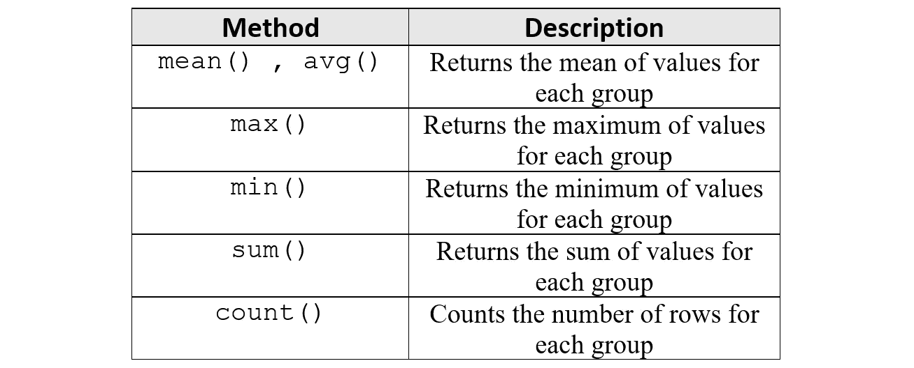**

**表 4**

## **agg()**

**我们也可以使用[方法](https://github.com/apache/spark/blob/v3.1.1/sql/core/src/main/scala/org/apache/spark/sql/RelationalGroupedDataset.scala#L258)**

```
**def** agg(expr: Column, exprs: Column*): DataFrame
```

**它通过指定一系列聚合列来计算聚合。每个参数都是一个列表达式。当我们希望一次运行多个聚合函数时，这个函数非常有用。**

## ****聚合函数****

**记住，对象`org.apache.spark.sql.functions`提供了内置的标准函数来处理列。这些功能有不同的类别。聚合函数类别包括为分组数据帧的每组返回值的函数。所以我们可以在`groupBy()`之后使用它们作为我们的聚合函数。您可以参考 [Spark 手册](https://spark.apache.org/docs/latest/api/scala/org/apache/spark/sql/functions$.html)获取这些功能的完整列表。它提供了一些`RelationalGroupedDataset` 类中没有的额外方法。**

**比如在`staffDF`中，我们想看看每个角色雇佣了多少人，每个角色的平均工资是多少。为此，我们使用以下代码:**

```
**import** org.apache.spark.sql.{functions=>F}
staffDF.groupBy("role").agg(F.count("salary"),  
  F.avg("salary")).show()**//Output:
+--------------+-------------+-----------+ 
|          role|count(salary)|avg(salary)| 
+--------------+-------------+-----------+ 
|Data scientist|            2|     4300.0| 
| Data engineer|            2|     3200.0| 
|     Developer|            1|     3600.0| 
+--------------+-------------+-----------+**
```

**值得注意的是，该函数也可用于未分组的数据帧或数据集。在这种情况下，该函数应用于整个数据帧或数据集(就像只有一个组的数据帧一样)，并返回一个只有一行的`Column`对象。例如，要计算`staffDF`中所有薪水的总和，我们可以写:**

```
**import** org.apache.spark.sql.{functions=>F}
staffDF.agg(F.sum("salary")).show()**//Output:
+-----------+ 
|sum(salary)| 
+-----------+ 
|      18600| 
+-----------+**
```

**此外，你不需要在这里使用`agg()`。可以使用`select()`方法选择结果列。所以前面的代码也可以写成:**

```
staffDF.select(F.sum("salary")).show()
```

## ****旋转****

****支点()****

**该方法**

```
**def** pivot(pivotColumn: **String**): RelationalGroupedDataset
```

**是[阶层](https://github.com/apache/spark/blob/v3.1.1/sql/core/src/main/scala/org/apache/spark/sql/RelationalGroupedDataset.scala#L352)的成员`[RelationalGroupedDataset](https://github.com/apache/spark/blob/v3.1.1/sql/core/src/main/scala/org/apache/spark/sql/RelationalGroupedDataset.scala#L352)`。要使用它，首先需要在数据集或数据帧上调用类似于`groupby()`的方法来返回一个`RelationalGroupedDataset`对象，然后在该对象上调用`pivot()`。它在`RelationalGroupedDataset`对象中旋转分组数据帧的一列，这意味着它将`pivotColumn`的唯一行值转换为结果数据帧的列标题。**

**它将这个结果作为一个新的`RelationalGroupedDataset`对象返回。然后，您可以将聚合方法应用于该结果。`pivotColumn`以字符串形式给出要透视的列的名称。但是，您也可以传递一个`Column`对象。 `[pivot()](https://github.com/apache/spark/blob/v3.1.1/sql/core/src/main/scala/org/apache/spark/sql/RelationalGroupedDataset.scala#L421)`的[重载版本以`pivotColumn`为`Column`对象:](https://github.com/apache/spark/blob/v3.1.1/sql/core/src/main/scala/org/apache/spark/sql/RelationalGroupedDataset.scala#L421)**

```
**def** pivot(pivotColumn: Column): RelationalGroupedDataset
```

**让我们看一个这个方法的例子。我们首先定义一个名为`productDF`的数据帧。**

```
**import** spark.sqlContext.implicits.**_**
**val** products = **Seq**(
  ("P1", 100, "Vancouver"),
  ("P2", 150, "Vancouver"),
  ("P3", 130, "Vancouver"),
  ("P4", 190, "Vancouver"),
  ("P1", 50, "Toronto"),
  ("P2", 60, "Toronto"),
  ("P3", 70, "Toronto"),
  ("P4", 60, "Toronto"),
  ("P1", 30, "Calgary"),
  ("P2", 140 ,"Calgary"),
  ("P3", 110, "Montreal"))**val** productDF = products.toDF("productID", "quantity", "city")
productDF.show()**//Output:
+---------+--------+---------+ 
|productID|quantity|     city| 
+---------+--------+---------+ 
|       P1|     100|Vancouver| 
|       P2|     150|Vancouver| 
|       P3|     130|Vancouver| 
|       P4|     190|Vancouver| 
|       P1|      50|  Toronto| 
|       P2|      60|  Toronto| 
|       P3|      70|  Toronto| 
|       P4|      60|  Toronto| 
|       P1|      30|  Calgary| 
|       P2|     140|  Calgary| 
|       P3|     110| Montreal| 
+---------+--------+---------+**
```

**该数据框架给出了每个城市的订购产品数量。现在，我们首先使用`groupBy()`按照列`productID`对这个数据框架进行分组，然后旋转列`city`,得到每个城市中每个订购产品的总数量。**

```
**val** pivotDF =productDF.groupBy("productID").pivot("city")  
  .sum("quantity")
pivotDF.show()**//Output:
+---------+-------+--------+-------+---------+ |productID|Calgary|Montreal|Toronto|Vancouver| 
+---------+-------+--------+-------+---------+ 
|       P2|    140|    null|     60|      150| 
|       P3|   null|     110|     70|      130| 
|       P4|   null|    null|     60|      190| 
|       P1|     30|    null|     50|      100| 
+---------+-------+--------+-------+---------+**
```

**还有另一个 `[pivot()](https://github.com/apache/spark/blob/v3.1.1/sql/core/src/main/scala/org/apache/spark/sql/RelationalGroupedDataset.scala#L381)`的[重载版本，它要求调用者在`pivotColumn`中指定不同值的列表以进行转换:](https://github.com/apache/spark/blob/v3.1.1/sql/core/src/main/scala/org/apache/spark/sql/RelationalGroupedDataset.scala#L381)**

```
**def** pivot(pivotColumn: **String**, values: **Seq**[Any]): 
  RelationalGroupedDataset
```

**这个版本效率更高，因为如果不指定`values`，Spark 需要首先在内部计算`pivotColumn`中不同值的列表。因此，前面的例子可以写成:**

```
**val** cities = **Seq**("Calgary", "Montreal", "Toronto", "Vancouver")
**val** pivotDF =productDF.groupBy("productID").pivot("city", cities)
  .sum("quantity")
```

**您还可以使用该类中存在的`pivot()`的其他重载变量，将`values`作为`List`传递，将`pivotColumn`作为`Column`对象传递。**

## ****取消投票****

**我们还可以取消一个表的透视，这意味着我们将多个列标题变成一个列。(每个列标题将是该新列的一行。)我们还创建了第二列来存储原始列的值。要取消数据帧的透视，我们可以使用内置的 SQL 方法`stack()`。`stack(n, expr1, …, exprk)`分离`expr1`，...，`exprk`成`n`行。下面的代码反透视`pivotDF`:**

```
**import** org.apache.spark.sql.{functions=>F} **val** unPivotDF = pivotDF.select($"productID",
   F.expr("stack(3, 'Vancouver', Vancouver,
                    'Toronto', Toronto,
                    'Calgary', Calgary) as (city, quantity)"))
                    .filter($"quantity".isNotNull)
unPivotDF.show()**//Output:
+---------+---------+--------+ 
|productID|     city|quantity| 
+---------+---------+--------+ 
|       P2|Vancouver|     150| 
|       P2|  Toronto|      60| 
|       P2|  Calgary|     140| 
|       P3|Vancouver|     130| 
|       P3|  Toronto|      70| 
|       P4|Vancouver|     190| 
|       P4|  Toronto|      60| 
|       P1|Vancouver|     100| 
|       P1|  Toronto|      50| 
|       P1|  Calgary|      30| 
+---------+---------+--------+**
```

**让我们看看它是如何工作的。在`pivotDF`中，每行都有列。SQL 语句**

```
stack(3, 'Vancouver', Vancouver, 'Toronto', Toronto,                    
  'Calgary', Calgary) as (city, quantity)
```

**取`pivotDF`的每一行，变成三行。因为我们在`stack()`中有六个表达式，所以这三行有两列。这些列将被命名为`city`和`quantity`。在每一行中，第一列将城市名称作为文字，第二列将代表该城市的列的值作为文字。例如，`pivotDF`的第一行是:**

```
**+-------+--------+-------+---------+ |Calgary|Montreal|Toronto|Vancouver| 
+-------+--------+-------+---------+ 
|    140|    null|     60|      150| 
+-------+--------+-------+---------+**
```

**`stack`把它变成:**

```
**+---------+--------+ 
|     city|quantity| 
+---------+--------+ 
|Vancouver|     150| 
| Montreal|    null|
|  Toronto|      60| 
|  Calgary|     140|
+---------+--------+**
```

**我们还选择`productID`将其作为一个单独的列。最后`filter($”quantity”.isNotNull)`删除`quantity`为`null`的行。**

## ****转置****

**我们也可以转置一个数据帧，而不使用`pivot()`方法和聚合函数。假设我们有这样一个数据帧:**

```
**val** df = **Seq**(("c1", 1), ("c2", 2), ("c3", 3), ("c4", 4))
  .toDF("col1", "col2")
df.show()**//Output:
+----+----+ 
|col1|col2| 
+----+----+ 
|  c1|   1| 
|  c2|   2| 
|  c3|   3| 
|  c4|   4| 
+----+----+**
```

**现在假设我们想转置这个表。我们使用以下代码:**

```
**import** org.apache.spark.sql.types._
**import** org.apache.spark.sql.Row
**import** org.apache.spark.sql.{functions=>F}**val** schema = StructType(df.select(F.collect_list("col1"))
  .first().getAs[**Seq**[**String**]](0)
  .map(x => StructField(x, IntegerType)))**val** rows = Seq(Row.fromSeq(df.select(
  F.collect_list("col2")).first().getAs[**Seq**[**Integer**]](0))
  )
**val** data = spark.sparkContext.parallelize(rows)spark.createDataFrame(values, schema).show()**//Output:
+---+---+---+---+ 
| c1| c2| c3| c4| 
+---+---+---+---+ 
|  1|  2|  3|  4| 
+---+---+---+---+**
```

**这里，我们首先为转置的数据帧创建了一个模式。**

****收藏 _ 列表()****

**该方法**

```
**def** collect_list(columnName: **String**): Column
```

**`[functions](https://github.com/apache/spark/blob/v3.1.1/sql/core/src/main/scala/org/apache/spark/sql/functions.scala#L321)`中的[将`columnName`列的所有元素收集到一个`WrappedArray`中，并将其放入一个只有一行的`Column`对象中。所以为了得到`col1`的元素，我们写:](https://github.com/apache/spark/blob/v3.1.1/sql/core/src/main/scala/org/apache/spark/sql/functions.scala#L321)**

```
**import** org.apache.spark.sql.{functions=>F}
df.select(F.collect_list("col1")).show()**//Output:
+------------------+ 
|collect_list(col1)| 
+------------------+ 
|  [c1, c2, c3, c4]| 
+------------------+**
```

**然后，我们需要使用`first()`(我们也可以使用`head()`)获得结果数据帧的第一行，并将其转换为一个字符串对象序列。所以我们使用`getAs()`将它转换成一个字符串序列:**

```
df.select(F.collect_list("col1")).first().getAs[**Seq**[**String**]](0)**//Output:
res1: Seq[String] = WrappedArray(c1, c2, c3, c4)**
```

**最后，我们使用`map(x => StructField(x, IntegerType))`为这个序列的每个元素创建一个`StructField`对象的数组。现在，每个元素都可以是转置数据帧的一列。我们将这个数组放在`StructType()`中，以创建转置数据帧的模式。我们知道转置数据帧的所有列都将获得`Integer`值。所以我们在`StructField()`中使用`IntegerType`。`df`中`col2`的值将构成转置数据帧的唯一一行。我们重复相同的过程来创建它。我们使用`getAs[Seq[Integer]]`将它们转换成一个整数序列，并使用`fromRow()`从这个序列中创建一个行对象。最后，我们使用`createDataFrame()`使用模式和行创建转置的数据帧。**

**当您转置数据帧时，您应该注意原始数据帧的每一行都将是转置数据帧的一列，因此每一行中的所有元素都应该具有相同的类型。换句话说，除了将用于创建转置表的列标题的列之外，原始表的所有列都应该具有相同的类型。否则，您必须将其中一些转换为新类型。这是另一个例子。这次原始表格(`df1`)有三列。**

```
**val** df1 = **Seq**(("c1", 1, "a"),
              ("c2", 2, "b"),
              ("c3", 3, "c"),
              ("c4", 4, "d")).toDF("col1", "col2", "col3")
df1.show()**//Output:
+----+----+----+ 
|col1|col2|col3| 
+----+----+----+ 
|  c1|   1|   a| 
|  c2|   2|   b| 
|  c3|   3|   c| 
|  c4|   4|   d| 
+----+----+----+**
```

**如前所述，`col1`将用于创建转置表的列标题。但是这次`col2`和`col3`的类型不同。所以我们需要将`col2`转换成弦乐来移调`df1`。为此，我们使用`map(_.toString)`。**

```
**import** org.apache.spark.sql.{functions=>F} **val** schema = StructType(df1.select(F.collect_list("col1"))
  .first().getAs[**Seq**[**String**]](0)
  .map(x => StructField(x, StringType)))
**val** rows = **Seq**(
  Row.fromSeq(df1.select(  F.collect_list("col2")).first()
  .getAs[**Seq**[**Integer**]](0).map(**_**.toString)),                                           
  Row.fromSeq(df1.select(F.collect_list("col3")).first()
  .getAs[**Seq**[**String**]](0))
  )**val** data = spark.sparkContext.parallelize(rows)
spark.createDataFrame(data, schema).show()**//Output:
+---+---+---+---+ 
| c1| c2| c3| c4| 
+---+---+---+---+ 
|  1|  2|  3|  4| 
|  a|  b|  c|  d| 
+---+---+---+---+**
```

# ****窗口功能****

**窗口函数对于计算移动平均值或累积和等任务非常有用。*窗口*是相对于数据帧的当前行定义的行的集合。窗口中的每一行都与当前行相距指定的行数。例如，对于数据帧的每一行，我们可以定义一个包含该行及其前一行的窗口。因此，对于每一行，对应的窗口遵循相同的模式，但其元素是不同的。一旦定义了窗口，我们就可以对其应用窗口函数，因此对于数据帧的每一行，窗口函数将使用其对应的窗口作为输入参数来返回该行的单个值。**

**[包 org . Apache . spark . SQL . expressions](https://github.com/apache/spark/blob/v3.1.1/sql/core/src/main/scala/org/apache/spark/sql/expressions/Window.scala#L43)中的对象`Window`提供了在 DataFrame 中定义窗口的实用方法。所有这些方法都返回一个`WindowSpec`对象。[类](https://github.com/apache/spark/blob/v3.1.1/sql/core/src/main/scala/org/apache/spark/sql/expressions/WindowSpec.scala#L32) `[WindowSpec](https://github.com/apache/spark/blob/v3.1.1/sql/core/src/main/scala/org/apache/spark/sql/expressions/WindowSpec.scala#L32)`也在包 org . Apache . spark . SQL . expressions 中定义:**

```
**class** WindowSpec **private**[sql](partitionSpec: **Seq**[Expression],  
  orderSpec: Seq[SortOrder], frame: WindowFrame) { ... 
```

**并且存储数据帧的窗口的划分(`partitionSpec`)、排序(`orderSpec`)和帧边界(`frame`)。当你定义一个窗口时，你需要使用对象`Window`中的方法来提供这个信息。**

## **orderBy()**

**基于数据帧中有序列的行来定义窗口。`[Window](https://github.com/apache/spark/blob/v3.1.1/sql/core/src/main/scala/org/apache/spark/sql/expressions/Window.scala#L77)`中的方法`orderBy()`用于此目的。`orderBy()`使用方法`spec`返回一个`WindowSpec`对象。**

```
**def** orderBy(cols: Column*): WindowSpec = { spec.orderBy(cols : **_***) }
```

**`spec`是对象 `[Window](https://github.com/apache/spark/blob/v3.1.1/sql/core/src/main/scala/org/apache/spark/sql/expressions/Window.scala#L217)`内部的私有方法[，返回类`WindowSpec`的对象，其中`partitionSpec`和`orderSpec`用空序列初始化，`frame`用`UnspecifiedFrame`初始化:](https://github.com/apache/spark/blob/v3.1.1/sql/core/src/main/scala/org/apache/spark/sql/expressions/Window.scala#L217)**

```
**private**[sql] **def** spec: WindowSpec = {
  **new** WindowSpec(Seq.empty, Seq.empty, UnspecifiedFrame)  }
```

**当`orderBy()`调用`spec.orderBy(cols : **_***)`时，它正在调用类`WindowSpec`的`orderBy()`方法。`WindowSpec`中的`[orderBy()](https://github.com/apache/spark/blob/v3.1.1/sql/core/src/main/scala/org/apache/spark/sql/expressions/WindowSpec.scala#L69)`按升序对列的内部 Catalyst 表达式进行排序(如果它们还没有排序的话),并返回一个带有新`orderSpec`的新`WindowSpec`对象。**

```
**def** orderBy(cols: Column*): WindowSpec = { 
  **val** sortOrder: **Seq**[SortOrder] = cols.map { col =>
    col.expr **match** { 
      **case** expr: SortOrder => expr   
      **case** expr: Expression => SortOrder(expr, Ascending) 
    }
  }
  **new** WindowSpec(partitionSpec, sortOrder, frame)
}
```

**方法定义显示，默认情况下，`orderBy()`按升序对一列中的行进行排序。您也可以使用 `[orderBy()](https://github.com/apache/spark/blob/v3.1.1/sql/core/src/main/scala/org/apache/spark/sql/expressions/WindowSpec.scala#L60)`的[重载变体将列名作为`String`传递。](https://github.com/apache/spark/blob/v3.1.1/sql/core/src/main/scala/org/apache/spark/sql/expressions/WindowSpec.scala#L60)**

```
**def** orderBy(colName: **String**, colNames: **String***): WindowSpec = {    
  orderBy((colName +: colNames).map(Column(**_**)): **_***)  }
```

## **partitionBy()**

**我们也可以首先将一个数据帧划分成组，然后为每个分区中的所有行创建窗口。我们使用`[Window](https://github.com/apache/spark/blob/v3.1.1/sql/core/src/main/scala/org/apache/spark/sql/expressions/Window.scala#L50)`中的方法`partitionBy()`来定义分区。它被定义为:**

```
**def** partitionBy(cols: Column*****): WindowSpec = {    
  spec.partitionBy(cols : **_***)  }
**def** partitionBy(colName: **String**, colNames: **String***): WindowSpec = {    
  spec.orderBy(colName, colNames : **_***)  }
```

## **rowsBetween()**

**定义窗口的边框边界，我们可以用`Window` : `[rowsBetween()](https://github.com/apache/spark/blob/v3.1.1/sql/core/src/main/scala/org/apache/spark/sql/expressions/Window.scala#L161)`和`rangeBetween()`另外两种方法。该方法:**

```
**def** rowsBetween(start: **Long**, end: **Long**): WindowSpec
```

**返回一个定义了框架边界的`WindowSpec`对象，从`start`(含)到`end`(含)。它们都是相对于当前行定义的。例如，`start=0`表示窗口的框架边界从当前行开始，`start=-1`表示从当前行的前一行开始，`start=2`表示从当前行的后两行开始。建议将`start`或`end`设置为`Window.currentRow`，而不是使用`0`的值来描述当前行。方法`currentRow()`在[类](https://github.com/apache/spark/blob/v3.1.1/sql/core/src/main/scala/org/apache/spark/sql/expressions/Window.scala#L114)T11 中定义:**

```
**def** currentRow: **Long** = 0
```

**如果`start`设置为`Window.unboundedPreceding`或`end`设置为`Window.unboundedFollowing`，则框架为无界。[方法](https://github.com/apache/spark/blob/v3.1.1/sql/core/src/main/scala/org/apache/spark/sql/expressions/Window.scala#L91):**

```
**def** unboundedPreceding: **Long** = **Long**.MinValue
```

**返回一个`Long`类型的最小值，代表一个分区中的第一行，而[方法](https://github.com/apache/spark/blob/v3.1.1/sql/core/src/main/scala/org/apache/spark/sql/expressions/Window.scala#L103):**

```
**def** unboundedFollowing: **Long** = **Long**.MaxValue
```

**返回`Long`类型的最大值，并表示分区中的最后一行。同样，建议使用它们而不是值来描述分区的第一行或最后一行。**

**让我们来看一些使用 windows 的例子。考虑之前定义的`temperatureDF`:**

```
**import** org.apache.spark.sql.{functions=>F} **val** temp = **Seq**(("2020-01-01 07:30:00", 17.0), 
  ("2020-01-02 07:30:00", 25.5),  
  ("2020-01-03 07:30:00", 19.5),  
  ("2020-01-04 07:30:00", 21.2),  
  ("2020-01-05 07:30:00", 18.0), 
  ("2020-01-06 07:30:00", 20.5)
  ).toDF("time", "temperature")**val** temperatureDF = temp.withColumn("time", 
  F.col("time").cast("timestamp"))
temperatureDF.show()**//Output:
+-------------------+-----------+
|               time|temperature|
+-------------------+-----------+
|2020-01-01 07:30:00|       17.0|
|2020-01-02 07:30:00|       25.5|
|2020-01-03 07:30:00|       19.5|
|2020-01-04 07:30:00|       21.2|
|2020-01-05 07:30:00|       18.0|
|2020-01-06 07:30:00|       20.5|
+-------------------+-----------+**
```

**现在假设我们想要计算列`temperature`的最后三行的移动平均值。**

```
**import** org.apache.spark.sql.expressions.Window
**import** spark.implicits.**_
import** org.apache.spark.sql.{functions=>F}**val** w = Window.orderBy("time").rowsBetween(-2, Window.currentRow)  
temperatureDF.withColumn("rolling_average",
  F.round(F.avg("temperature").over(w), 2)).show()**//Output:
+-------------------+-----------+---------------+ 
|               time|temperature|rolling_average| 
+-------------------+-----------+---------------+ 
|2020-01-01 07:30:00|       17.0|           17.0| 
|2020-01-02 07:30:00|       25.5|          21.25| 
|2020-01-03 07:30:00|       19.5|          20.67| 
|2020-01-04 07:30:00|       21.2|          22.07| 
|2020-01-05 07:30:00|       18.0|          19.57| 
|2020-01-06 07:30:00|       20.5|           19.9| 
+-------------------+-----------+---------------+**
```

**这里，我们首先通过对列`time`进行排序来定义窗口，并定义窗口框架边界或包括当前行和之前的两行。我们将聚合函数`avg()`应用于列`temperature`，然后将方法`over()`应用于它，以计算该窗口中每一行`temperatureDF`的平均值。**

## **结束()**

**`over()`在[类](https://github.com/apache/spark/blob/v3.1.1/sql/core/src/main/scala/org/apache/spark/sql/Column.scala#L1363)中定义`[Column](https://github.com/apache/spark/blob/v3.1.1/sql/core/src/main/scala/org/apache/spark/sql/Column.scala#L1363)`:**

```
**def** over(window: expressions.WindowSpec): Column = 
  window.withAggregate(**this**)
```

**这里的`expressions.WindowSpec`是指包 org . Apache . spark . SQL . expressions 中的[类](https://github.com/apache/spark/blob/v3.1.1/sql/core/src/main/scala/org/apache/spark/sql/expressions/WindowSpec.scala#L32) `[WindowSpec](https://github.com/apache/spark/blob/v3.1.1/sql/core/src/main/scala/org/apache/spark/sql/expressions/WindowSpec.scala#L32)`，在`Column`对象上调用`over()`时，会以一个窗口为参数，调用其方法`withAggregate()`。调用`over()`的列被传递给这个方法。`withAggregate()`在 org . Apache . spark . SQL . expressions 包中的[类](https://github.com/apache/spark/blob/v3.1.1/sql/core/src/main/scala/org/apache/spark/sql/expressions/WindowSpec.scala#L215) `[WindowSpec](https://github.com/apache/spark/blob/v3.1.1/sql/core/src/main/scala/org/apache/spark/sql/expressions/WindowSpec.scala#L215)`中定义:**

```
**private**[sql] **def** withAggregate(aggregate: Column): Column = { 
  **val** spec = WindowSpecDefinition(partitionSpec, orderSpec, frame)  
  **new** Column(WindowExpression(aggregate.expr, spec))
}
```

**案例类`[WindowSpecDefinition()](https://github.com/apache/spark/blob/v3.1.1/sql/catalyst/src/main/scala/org/apache/spark/sql/catalyst/expressions/windowExpressions.scala#L41)`和`[WindowExpression()](https://github.com/apache/spark/blob/v3.1.1/sql/catalyst/src/main/scala/org/apache/spark/sql/catalyst/expressions/windowExpressions.scala#L279)`在包 org . Apache . Spark . SQL . catalyst . expressions 中定义。`withAggregate()`将窗口规范信息从 Spark SQL 中的类`WindowSpec`转移到 Catalyst 中的案例类`WindowSpecDefinition()`。一个`WindowSpecDefinition()`的实例加上当前列的内部 Catalyst 表达式(`aggregate`)被用来创建一个新的`Column`对象，它是调用`over()`的最终结果。如前所述，`orderBy()`默认情况下对一列中的行进行升序排序。要按降序对它们进行排序，请使用类`Column`中的`desc()`方法。**

**请记住，您只能将这个`desc()`应用于一个`Column` 对象，因此将列名作为`String`的`orderBy()`的重载变量不能用于此目的。**

```
**import** org.apache.spark.sql.{functions=>F} **val** w = Window.orderBy($"time".desc).rowsBetween(-2, 
  Window.currentRow)
temperatureDF.withColumn("rolling_average",
  F.round(F.avg("temperature").over(w), 2)).show()**//Output:
+-------------------+-----------+---------------+
|               time|temperature|rolling_average|
+-------------------+-----------+---------------+ 
|2020-01-06 07:30:00|       20.5|           20.5| 
|2020-01-05 07:30:00|       18.0|          19.25| 
|2020-01-04 07:30:00|       21.2|           19.9| 
|2020-01-03 07:30:00|       19.5|          19.57| 
|2020-01-02 07:30:00|       25.5|          22.07| 
|2020-01-01 07:30:00|       17.0|          20.67| 
+-------------------+-----------+---------------+**
```

**在前面的例子中，我们还使用了`functions`中的方法`round()`来舍入结果。我们也可以在窗口上使用其他功能方法，如`count()`、`min()`、`max()`和`sum()`。**

**如果使用`orderBy()`创建一个窗口，但没有给出窗口框架规格，则框架边界从`start=Window.unboundedPreceding`(含)到`end=Window.currentRow`(含)定义。例如，下一个示例计算`temperatureDF`中`temperature`列的累积和。**

```
**import** org.apache.spark.sql.{functions=>F} **val** w = Window.orderBy("time")
temperatureDF.withColumn("cum_sum", F.sum("temperature").over(w))
  .show()**//Output:
+-------------------+-----------+-------+ 
|               time|temperature|cum_sum| 
+-------------------+-----------+-------+ 
|2020-01-01 07:30:00|       17.0|   17.0| 
|2020-01-02 07:30:00|       25.5|   42.5| 
|2020-01-03 07:30:00|       19.5|   62.0| 
|2020-01-04 07:30:00|       21.2|   83.2| 
|2020-01-05 07:30:00|       18.0|  101.2| 
|2020-01-06 07:30:00|       20.5|  121.7| 
+-------------------+-----------+-------+**
```

## **滞后()**

**我们还可以使用`functions`中的窗口函数给列添加滞后。[功能](https://github.com/apache/spark/blob/v3.1.1/sql/core/src/main/scala/org/apache/spark/sql/functions.scala#L914):**

```
**def** lag(columnName: **String**, offset: **Int**): Column
```

**将`columnName`移位`offset`，并将结果作为新的`Column`对象返回。对于`columnName`的每一行，它返回当前行之前`offset`行的值，如果当前行之前少于`offset`行，则返回`null`行的值。将其应用于`columnName`的所有行的结果是一个新的`Column`对象，该对象由`lag()`返回。**

```
**import** org.apache.spark.sql.{functions=>F} **val** w = Window.orderBy("time")  
temperatureDF.withColumn("lag_col", 
  F.lag("temperature", 1).over(w)).show()**//Output:
+-------------------+-----------+-------+ 
|               time|temperature|lag_col| 
+-------------------+-----------+-------+ 
|2020-01-01 07:30:00|       17.0|   null| 
|2020-01-02 07:30:00|       25.5|   17.0| 
|2020-01-03 07:30:00|       19.5|   25.5| 
|2020-01-04 07:30:00|       21.2|   19.5| 
|2020-01-05 07:30:00|       18.0|   21.2| 
|2020-01-06 07:30:00|       20.5|   18.0| 
+-------------------+-----------+-------+**
```

**它还接受一个`Column`对象:**

```
**def** lag(e: Column, offset: Int): Column
```

**如果希望用默认值填充结果空值，可以使用:**

```
**def** lag(columnName: String, offset: Int, defaultValue: Any): Column
```

**这个重载变量返回的值是当前行之前的`offset`行，如果当前行之前的行数少于`offset`行，则返回`defaultValue`行。如果`offset`为负值，则`lag()`返回当前行之后`offset`行的值。**

```
**import** org.apache.spark.sql.{functions=>F}
temperatureDF.withColumn("lead_col", 
  F.lag("temperature", -1, 0).over(w)).show()**//Output:
+-------------------+-----------+--------+ 
|               time|temperature|lead_col| 
+-------------------+-----------+--------+ 
|2020-01-01 07:30:00|       17.0|    25.5| 
|2020-01-02 07:30:00|       25.5|    19.5| 
|2020-01-03 07:30:00|       19.5|    21.2| 
|2020-01-04 07:30:00|       21.2|    18.0| 
|2020-01-05 07:30:00|       18.0|    20.5| 
|2020-01-06 07:30:00|       20.5|     0.0| 
+-------------------+-----------+--------+**
```

**下一个例子显示了`partitionBy()`的用法。在`staffDF`中，我们想给每个有特定角色的员工一个`id`，从最低工资开始:**

```
**import** org.apache.spark.sql.{functions=>F} **val** windowSpec  = Window.partitionBy("role").orderBy("salary")
staffDF.withColumn("row_number", F.row_number.over(windowSpec))
  .show()**//Output:
+-----+--------------+------+----------+ 
| name|          role|salary|row_number| 
+-----+--------------+------+----------+ 
|James| Data engineer|  3200|         1| 
|  Ali| Data engineer|  3200|         2| 
|Steve|     Developer|  3600|         1| 
|Laura|Data scientist|  4100|         1| 
| John|Data scientist|  4500|         2| 
+-----+--------------+------+----------+**
```

**这里我们先用`role`划分窗口，然后用`salary`排序。`functions`中的方法`row_number()`返回一个窗口分区内从 1 开始的序列号。**

## **范围介于()**

**类`Window`有另一个指定框架边界的方法，叫做`[rangeBetween()](https://github.com/apache/spark/blob/v3.1.1/sql/core/src/main/scala/org/apache/spark/sql/expressions/WindowSpec.scala#L193)`。它被声明为:**

```
**def** rangeBetween(start: **Long**, end: **Long**): WindowSpec
```

**与`rowsBetween()`类似，该方法创建一个定义了帧边界的`WindowSpec`，从`start`(含)到`end`(含)。但是，也有一些不同之处。`rangeBetween()`的工作基于`orderBy()`返回的`Column`对象的实际值，而不是行在分区中的位置。我用一个例子来解释一下。**

```
**import** org.apache.spark.sql.{functions=>F} **val** df = Seq((1, 1),(2, 2), (2, 3), (2, 4), (4, 5), (6, 6),
 (7, 7)).toDF("id", "num")
**val** w = Window.orderBy("id").rowsBetween(Window.currentRow, 1)  
df.withColumn("rolling_sum", F.sum("num").over(w)).show()**//Output:
+---+---+-----------+ 
| id|num|rolling_sum| 
+---+---+-----------+ 
|  1|  1|          3| 
|  2|  2|          5| 
|  2|  3|          7| 
|  2|  4|          9| 
|  4|  5|         11| 
|  6|  6|         13| 
|  7|  7|          7| 
+---+---+-----------+**
```

**这里我们创建一个数据帧，并定义一个包含当前行和下一行的窗口。然后，我们使用该窗口计算列`num`的滚动和。现在让我们用`rangeBetween()`代替`rowsBetween()`:**

```
**import** org.apache.spark.sql.{functions=>F} **val** w1 = Window.orderBy("id").rangeBetween(Window.currentRow, 1)  
df.withColumn("rolling_sum", F.sum("num").over(w1)).show()**//Output:
+---+---+-----------+ 
| id|num|rolling_sum| 
+---+---+-----------+ 
|  1|  1|         10| 
|  2|  2|          9| 
|  2|  3|          9| 
|  2|  4|          9| 
|  4|  5|          5| 
|  6|  6|         13| 
|  7|  7|          7| 
+---+---+-----------+**
```

**如你所见，这两种方法给出了不同的结果。在`rowsBetween()`中，当前行的位置用于计算其窗口框架边界。例如，使用`rowsBetween()`时，`staffDF` ( `id` =1，`num` =1)中第一行的窗口包括这一行和下一行(`id` =2，`num` =2)。所以这一行的`rolling_sum`是 1+2=3。**

**另一方面，`rangeBetween()`不使用当前行的位置来计算其框架边界。相反，它使用`orderBy("id")`的实际值来计算当前行的帧边界。在这里，列`id`首先被排序，因此它具有与`orderBy("id")`相同的值。因此，`orderBy("id")`(或`id`)的值用于指定当前行的帧边界。**

**假设第一行(`id` =1，`num` =1)是当前行。将`rowsBetween()`中的`start`和`end`参数的值加到`id`中，计算帧边界。所以窗口中的下一行应该有一个 1+1=2 的`id`。但是我们有三行，`id` =2。所有这些行都包含在窗口中，并且该窗口包含`num` =1、2、3 和 4 的行。所以第一行的`rolling_sum`是 1+2+3+4=10。**

**对于第二行，我们有`id` =2 和`num` =2，所以窗口中的下一行应该有`id` =2+1=3。但是，带有此`id`的行不存在，所以窗口只包含当前行，当前行包括所有带有`id` =2 的行。因此`rolling_sum`是 2+3+4=9。类似地，`num` =3 和`num` =4 的行获得相同的值`rolling_sum`。现在让我们尝试以下方法:**

```
**import** org.apache.spark.sql.{functions=>F} **val** w2 = Window.orderBy($"id" * 2)
  .rangeBetween(Window.currentRow, 1)  
df.withColumn("rolling_sum", F.sum("num").over(w1))
  .withColumn("id*2", $"id"*2).show()**//Output:
+---+---+-----------+----+ 
| id|num|rolling_sum|id*2| 
+---+---+-----------+----+ 
|  1|  1|          1|   2| 
|  2|  2|          9|   4| 
|  2|  3|          9|   4| 
|  2|  4|          9|   4| 
|  4|  5|          5|   8| 
|  6|  6|          6|  12| 
|  7|  7|          7|  14| 
+---+---+-----------+----+**
```

**这里我们使用`orderBy($”id” * 2)`来创建窗口。`orderBy($”id” * 2)`的值不再连续，因此所有行的窗口只包含当前行。**

**方法`rangeBetween()`给`orderBy()`方法增加了一些限制。使用`rangeBetween()`时，`orderBy()`只能带一个参数(一个列表达式)。由于该列表达式的值被添加到`rangeBetween()`中的`start`和`end`参数中以计算框架边界，因此它应该具有数字数据类型。但是，如果`rangeBetween()`中的`start`和`end`的值仅限于`Window.unboundedPreceding`、`Window.currentRow`和`Window.unboundedFollowing`，则可以在`orderBy()`中使用非数字列表达式。在这种情况下，Spark 不需要`orderBy()`中列表达式的值来计算帧边界。**

# ****归附****

## **加入()**

**[类](https://github.com/apache/spark/blob/v3.1.1/sql/core/src/main/scala/org/apache/spark/sql/Dataset.scala#L1067) `[Dataset](https://github.com/apache/spark/blob/v3.1.1/sql/core/src/main/scala/org/apache/spark/sql/Dataset.scala#L1067)`中的方法`join()`可用于连接数据集和数据帧。它被定义为:**

```
**def** join(right: Dataset[**_**], joinExprs: Column, joinType: **String**): 
DataFrame =
  **val** plan = withPlan(Join(logicalPlan, right.logicalPlan, 
    JoinType(joinType), **Some**(joinExprs.expr), JoinHint.NONE))       
    .queryExecution.analyzed.asInstanceOf[Join]  

  ...
```

**它使用给定的连接表达式(`joinExprs`)将调用它的数据集与另一个数据集(`right`)连接，并将结果作为新的 DataFrame 返回。它使用了文件`[basicLogicalOperators.scala](https://github.com/apache/spark/blob/v3.1.1/sql/catalyst/src/main/scala/org/apache/spark/sql/catalyst/plans/logical/basicLogicalOperators.scala#L321)`中的案例类`Join()`。`joinExprs`是一个布尔列表达式，文件`[joinTypes.scala](https://github.com/apache/spark/blob/master/sql/catalyst/src/main/scala/org/apache/spark/sql/catalyst/plans/joinTypes.scala#24)`中的对象`joinType`决定了连接的类型:**

```
**object** JoinType {
  **def** apply(typ: **String**): JoinType = 
    typ.toLowerCase(Locale.ROOT).replace("**_**", "") **match** {
      **case** "inner" => Inner
      **case** "outer" | "full" | "fullouter" => FullOuter
      **case** "leftouter" | "left" => LeftOuter
      **case** "rightouter" | "right" => RightOuter 
      **case** "leftsemi" | "semi" => LeftSemi  
      **case** "leftanti" | "anti" => LeftAnti  
      **case** "cross" => Cross 
```

**如该对象所示，我们有七种不同类型的连接:内连接、全外连接、左外连接、右外连接、左半连接、左反连接和交叉连接。现在我们将逐一解释。正如您在`apply()`方法的定义中看到的，连接类型的名称(`typ`)是不区分大小写的。此外，您可以在任何地方使用下划线(`_`)，因为它将被`""`替换。因此`join()`认为`full_outer`和`FULLOUT_er`是等价的！**

## ****内部连接****

**内部连接给出了两个数据集或数据帧的交集。对于第一个数据帧的每一行(在其上调用`join()`)，如果在第二个数据帧(`right`)中发现一行`joinExprs`为真，则它的列被添加到第一个数据帧中该行的列，以创建一个新行。这里有一个例子。我们使用之前提到的`staffDF`:**

```
**import** spark.implicits.**_**
**val** staffDF = **Seq**(
  ("John", "Data scientist", 4500),
  ("James", "Data engineer", 3200),
  ("Laura", "Data scientist", 4100),
  ("Ali", "Data engineer", 3200),
  ("Steve", "Developer", 3600)
  ).toDF("name", "role", "salary")staffDF.show()
```

**创建一个名为`ageDF`的新数据框架，给出员工的年龄:**

```
**val** ageDF = **Seq**(
  ("John", 45),
  ("James", 25),
  ("Laura", 30),
  ("Will", 28)
  ).toDF("name", "age")
ageDF.show()
```

**以下代码给出了这些数据帧的内部连接:**

```
**val** joinedDF = staffDF.join(ageDF,
  staffDF("name") === ageDF("name"), "inner")
joinedDF.show()**//Output:
+-----+--------------+------+-----+---+ 
| name|          role|salary| name|age| 
+-----+--------------+------+-----+---+ 
| John|Data scientist|  4500| John| 45| 
|James| Data engineer|  3200|James| 25| 
|Laura|Data scientist|  4100|Laura| 30| 
+-----+--------------+------+-----+---+**
```

**对于内部连接，`joinType`应该等于`"inner"`。这里选择了两个数据帧中具有相同`name`的行。请注意，我们在结果数据帧中有一个重复的`name`列。为了避免内部连接中的列重复，可以使用`join()`的重载变体:**

```
**def** join(right: Dataset[**_**], usingColumns: **Seq**[**String],
 ** joinType: **String**): DataFrame
```

**因此，您只需给出应该在两个数据集中匹配的列的名称。**

```
staffDF.join(ageDF, **Seq**("name"), "inner").show()**//Output:
+-----+--------------+------+---+ 
| name|          role|salary|age| 
+-----+--------------+------+---+ 
| John|Data scientist|  4500| 45| 
|James| Data engineer|  3200| 25| 
|Laura|Data scientist|  4100| 30| 
+-----+--------------+------+---+**
```

**如果没有通过`joinType`，[的话，默认连接是一个内部连接](https://github.com/apache/spark/blob/v3.1.1/sql/core/src/main/scala/org/apache/spark/sql/Dataset.scala#L1041)。**

```
**def** join(right: Dataset[**_**], joinExprs: Column): DataFrame = 
  join(right, joinExprs, "inner")**def** join(right: Dataset[**_**], usingColumns: **Seq**[**String**]): DataFrame = {
  join(right, usingColumns, "inner") 
}
```

**在前面的例子中，我们也可以写:**

```
staffDF.join(ageDF, **Seq**("name"), "inner").show() 
```

**如果我们想只对一列进行内部连接并避免重复，那么我们可以使用`join()`的[重载版本](https://github.com/apache/spark/blob/v3.1.1/sql/core/src/main/scala/org/apache/spark/sql/Dataset.scala#L961):**

```
**def** join(right: Dataset[**_**], usingColumn: **String**): DataFrame = {    
  join(right, Seq(usingColumn))  }
```

**前面的例子也可以写成:**

```
staffDF.join(ageDF, "name").show()
```

**因为`joinExprs`是一个列表达式，所以我们应该使用表 2 中的方法。我们也可以使用`$`操作符来给出列名；但是，当一个列名同时存在于两个数据帧中时，我们需要将数据帧的名称添加到列名中，以避免歧义。例如，前面的连接也可以写成:**

```
**val** joinedDF = staffDF.as("df1").join(ageDF.as("df2"),
  $"df1.name" === $"df2.name", "inner")
```

**这里，我们首先为 DataFrame 创建一个别名，然后使用点将它的名称添加到列名中。请注意，我们不能使用 DataFrame 的原始名称，因此下面的代码不会编译:**

```
// This won't compile **val** joinedDF = staffDF.join(ageDF,  
  $"staffDF.name" === $"ageDF.name", "inner")
```

**当我们想要将一个数据帧与其自身连接(自连接)时，这是很有用的。例如，要将`staffDF`与其自身连接，我们可以写:**

```
**val** joinedDF = staffDF.as("df1").join(staffDF.as("df2"), 
  $"df1.salary" < $"df2.salary", "inner")
joinedDF.show()
```

**当数据帧中的列名不相同时，我们不需要提及数据帧的名称。这里有一个例子:**

```
**val** ageDF1 = **Seq**(
  ("John", "Data scientist", 45),
  ("James", "Data engineer", 25),
  ("Laura", "Data scientist", 30),
  ("Will", "Data engineer", 28)
  ).toDF("employee_name", "employee_role", "age")
ageDF1.show()**val** joinedDF = staffDF.join(ageDF1, 
  $"name" === $"employee_name" && $"role" === $"employee_role",  
  "inner")
joinedDF.show()**//Output:
+-----+--------------+------+-------------+--------------+---+
| name|          role|salary|employee_name| employee_role|age|
+-----+--------------+------+-------------+--------------+---+
| John|Data scientist|  4500|         John|Data scientist| 45| |James| Data engineer|  3200|        James| Data engineer| 25| |Laura|Data scientist|  4100|        Laura|Data scientist| 30| 
+-----+--------------+------+-------------+--------------+---+**
```

**对于内部连接，我们也可以使用`where()`或`filter()`方法单独指定连接表达式。我们可以使用`join()`的这个[重载版本](https://github.com/apache/spark/blob/v3.1.1/sql/core/src/main/scala/org/apache/spark/sql/Dataset.scala#L936)，其中我们只传递第二个数据帧:**

```
**def** join(right: Dataset[**_**]): DataFrame = withPlan {    
  Join(logicalPlan, right.logicalPlan, joinType = Inner, **None**, 
  JoinHint.NONE)  }
```

**以下代码给出了一个示例:**

```
**val** joinedDF = staffDF.join(ageDF)
  .where(staffDF("name") === ageDF("name"))
joinedDF.show()**//Output:
+-----+--------------+------+-----+---+ 
| name|          role|salary| name|age| 
+-----+--------------+------+-----+---+ 
| John|Data scientist|  4500| John| 45| 
|James| Data engineer|  3200|James| 25| 
|Laura|Data scientist|  4100|Laura| 30| 
+-----+--------------+------+-----+---+**
```

## ****左外和右外连接****

**要进行左连接，我们可以使用`join()`和`joinType`等于`"left"`或`"leftouter"`或`"left_outer"`。在左连接中，结果中返回第一个数据帧的所有行(调用了`join()`)。**

**对于第一个数据帧的每一行(在其上调用了`join()`)，如果在第二个数据帧(`right`)中找到一行`joinExprs`为真，则它的列被添加到第一个数据帧中该行的列中，以创建一个新行。如果第二个数据帧的所有行都不满足`joinExprs`，那么第二个数据帧的列将被添加到第一个数据帧中具有空值的行的列中。因此，第一个 DataFrame 的所有原始行都返回第二个 data frame 的匹配列，或者只返回 null 值。**

```
**val** joinedDF = staffDF.join(ageDF,
  staffDF("name") === ageDF("name"), "left")
joinedDF.show()**//Output:
+-----+--------------+------+-----+----+ 
| name|          role|salary| name| age| 
+-----+--------------+------+-----+----+ 
| John|Data scientist|  4500| John|  45| 
|James| Data engineer|  3200|James|  25| 
|Laura|Data scientist|  4100|Laura|  30| 
|  Ali| Data engineer|  3200| null|null| 
|Steve|     Developer|  3600| null|null|
+-----+--------------+------+-----+----+**
```

**同样，我们可以通过在`join()`中使用一系列列名来避免重复的列。**

```
**val** joinedDF = staffDF.join(ageDF, **Seq**("name"), "left")
```

**但是，除了内部联接之外，我们不能对任何类型的联接只使用一个列名。所以这不会编译:**

```
//This won't compile **val** joinedDF = staffDF.join(ageDF, "name", "left")
```

**在右连接中，返回第二个数据帧的所有原始行，或者是第一个数据帧的匹配列，或者只是它们的空值。为了进行右连接，我们可以使用`join()`和`joinType`等于`"right"`或`"rightouter"`或`"right_outer"`。**

```
**val** joinedDF = staffDF.join(ageDF, **Seq**("name"), "right")
joinedDF.show()**//Output:
+-----+--------------+------+---+ 
| name|          role|salary|age| 
+-----+--------------+------+---+ 
|James| Data engineer|  3200| 25| 
| John|Data scientist|  4500| 45| 
| Will|          null|  null| 28| 
|Laura|Data scientist|  4100| 30| 
+-----+--------------+------+---+**
```

## ****全外连接****

**要进行完全连接，我们可以使用`join()`，其中`joinType`等于`"full"`、`"outer"`、`"fullouter"`或`"full_outer"`。完全连接合并了左连接和右连接的结果。返回左联接产生的所有行，此外，添加右联接产生的所有行，左联接中已存在的行除外。因此不会返回重复的行。**

```
staffDF.join(ageDF, **Seq**("name"), "full").show()**//Output:**
**+-----+--------------+------+----+ 
| name|          role|salary| age| 
+-----+--------------+------+----+ 
|Steve|     Developer|  3600|null| 
|James| Data engineer|  3200|  25| 
| John|Data scientist|  4500|  45| 
| Will|          null|  null|  28| 
|Laura|Data scientist|  4100|  30| 
|  Ali| Data engineer|  3200|null| 
+-----+--------------+------+----+**
```

**如果将这个输出与左外连接和右外连接的输出进行比较，您会看到它包含了这两个连接的所有行。**

## ****左半连接****

**它类似于左连接，但有两个不同之处。首先，对于第一个数据帧的每一行，如果在第二个数据帧中找到一行`joinExprs`为真，则只返回第一行的列，而不将第二个数据帧的行的列添加到该数据帧中。此外，对于第一个数据帧的每一行，如果第二个数据帧的所有行都不满足`joinExprs`，则不返回该行。**

**它就像一个左连接，其中第二个数据帧的列被删除，这些列的行`null`也被删除。为了有一个半左连接，我们可以使用 join with `joinType`等于`"leftsemi"`，或者`"left_semi"`，或者`"semi"`。**

```
**val** joinedDF = staffDF.join(ageDF,
  staffDF("name") === ageDF("name"), "leftsemi")
joinedDF.show()**//Output:
+-----+--------------+------+ 
| name|          role|salary| 
+-----+--------------+------+ 
| John|Data scientist|  4500| 
|James| Data engineer|  3200| 
|Laura|Data scientist|  4100| 
+-----+--------------+------+**
```

## ****左反连接****

**顾名思义，它与左半连接完全相反。对于第一个数据帧的每一行，如果第二个数据帧中没有`joinExprs`为真的行，则返回该行。要进行半左连接，我们可以使用`join()`和`joinType`等于`"leftanti"`或`"left_anti"`。**

```
**val** joinedDF = staffDF.join(ageDF,
  staffDF("name") === ageDF("name"), "leftanti")
joinedDF.show()**//Output:
+-----+-------------+------+ 
| name|         role|salary| 
+-----+-------------+------+ 
|  Ali|Data engineer|  3200| 
|Steve|    Developer|  3600| 
+-----+-------------+------+**
```

## ****交叉连接****

**为了进行交叉连接，我们可以使用`join()`和`joinType`相等的`"cross"`。交叉连接创建第一个数据帧和第二个数据帧的*笛卡尔乘积*。两个数据帧的笛卡尔积是一组有序对，其中第一个元素是第一个数据帧的一行，第二个元素是第二个数据帧的一行。因此它给出了第一个数据帧的行与第二个数据帧的行的每种可能的组合。对于每一对，如果`joinExprs`为真，则该对的元素被组合以创建一个新行。第二数据帧的行的列被添加到第一数据帧的行的列。事实上，交叉连接和内部连接给出了相同的结果。**

```
**val** joinedDF = staffDF.join(ageDF,
  staffDF("name") === ageDF("name"), "cross")
joinedDF.show()**//Output:
+-----+--------------+------+-----+---+ 
| name|          role|salary| name|age| 
+-----+--------------+------+-----+---+ 
| John|Data scientist|  4500| John| 45| 
|James| Data engineer|  3200|James| 25| 
|Laura|Data scientist|  4100|Laura| 30| 
+-----+--------------+------+-----+---+**
```

****交叉连接()****

**我们还可以使用[类](https://github.com/apache/spark/blob/v3.1.1/sql/core/src/main/scala/org/apache/spark/sql/Dataset.scala#L1130) `[Dataset](https://github.com/apache/spark/blob/v3.1.1/sql/core/src/main/scala/org/apache/spark/sql/Dataset.scala#L1130)`中的方法`crossJoin()`来创建两个数据帧的笛卡尔积，而无需任何附加条件:**

```
**def** crossJoin(right: Dataset[**_**]): DataFrame = withPlan {    
  Join(logicalPlan, right.logicalPlan, joinType = Cross,
    None, JoinHint.NONE)
}
```

**如您所见，它简单地使用了相同的案例类`Join()`和`joinType = Cross`，并且没有`joinExprs`的值。**

```
**val** joinedDF = staffDF.crossJoin(ageDF)
joinedDF.show()**//Output:
+-----+--------------+------+-----+---+ 
| name|          role|salary| name|age| 
+-----+--------------+------+-----+---+ 
| John|Data scientist|  4500| John| 45| 
| John|Data scientist|  4500|James| 25| 
| John|Data scientist|  4500|Laura| 30| 
| John|Data scientist|  4500| Will| 28| 
|James| Data engineer|  3200| John| 45| 
|James| Data engineer|  3200|James| 25| 
|James| Data engineer|  3200|Laura| 30| 
|James| Data engineer|  3200| Will| 28| 
|Laura|Data scientist|  4100| John| 45| 
|Laura|Data scientist|  4100|James| 25| 
|Laura|Data scientist|  4100|Laura| 30| 
|Laura|Data scientist|  4100| Will| 28| 
|  Ali| Data engineer|  3200| John| 45| 
|  Ali| Data engineer|  3200|James| 25| 
|  Ali| Data engineer|  3200|Laura| 30| 
|  Ali| Data engineer|  3200| Will| 28| 
|Steve|     Developer|  3600| John| 45| 
|Steve|     Developer|  3600|James| 25| 
|Steve|     Developer|  3600|Laura| 30| 
|Steve|     Developer|  3600| Will| 28| 
+-----+--------------+------+-----+---+**
```

**对于大型数据帧，这是一个非常昂贵的操作。具有 *m* 行的数据帧与具有 *n* 行的数据帧的交叉连接产生了具有 *m × n* 行的数据帧。对于大型数据帧，很容易导致内存不足的异常。**

## ****保留类型的连接****

****joinWith()****

**您可能已经注意到 join 方法返回一个 DataFrame。我们也可以连接两个数据集并返回一个数据集。方法`joinWith()`可用于此目的:**

```
**def** joinWith[U](other: Dataset[U], condition: Column, joinType: 
  **String**): Dataset[(T, U)]
```

**与`join()`类似，它采用连接表达式(`condition`)和`joinType`；但是，它返回元组的数据集。这个数据集的每一行都有两列(`Dataset[(T, U)]`)。第一列是第一个数据集的一行，第二个元素是第二个数据集的相应行。这两行基于在`join()`中用于特定`joinType`的相同规则进行匹配。这里有一个例子:**

```
**case class** someRow1(name: **String**, role: **String**)
**case class** someRow2(name: **String**, id: Integer)
**val** ds1 = Seq(someRow1("John", "Data scientist"),
             someRow1("James", "Data engineer")).toDS()
**val** ds2 = Seq(someRow2("John", 127),
              someRow2("Steve", 192)).toDS()**val** joinedDS = ds1.joinWith(ds2, ds1("name") === ds2("name"), 
  "left")
joinedDS.show(false)**//Output:
+----------------------+-----------+ 
|_1                    |_2         | 
+----------------------+-----------+ 
|[John, Data scientist]|[John, 127]| 
|[James, Data engineer]|null       | 
+----------------------+-----------+**
```

**如您所见，这类似于左外连接；但是，第二个数据集的列不会添加到第一个数据集中来创建新行。相反，每个数据集的行都有自己的列。因此第一列的类型为`someRow1`，第二列的类型为`someRow2`。**

```
joinedDS.head()**//Output:
res22: (someRow1, someRow2) = (someRow1(John,Data scientist),someRow2(John,127))**
```

**对于内部连接，我们可以省略`[joinWith()](https://github.com/apache/spark/blob/v3.1.1/sql/core/src/main/scala/org/apache/spark/sql/Dataset.scala#L1237)`中的`joinType`。**

```
**def** joinWith[U](other: Dataset[U], condition: Column): Dataset[(T, U)] = {  
  joinWith(other, condition, "inner")
}
```

# ****连接数据集和数据帧****

## **联合()**

**类 Dataset 中的方法`union()`可用于追加两个数据集。**

```
**def** union(other: Dataset[T]): Dataset[T]
```

**它将`other`的行附加到调用它的数据集的末尾，并返回一个新的数据集。**

```
**val** df1 = **Seq**((1, 2, "a")).toDF("col0", "col1", "col2")
**val** df2 = **Seq**((4, 5, "b")).toDF("col0", "col1", "col2")
df1.union(df2).show**//Output
+----+----+----+ 
|col0|col1|col2| 
+----+----+----+ 
|   1|   2|   3| 
|   4|   5|   6| 
+----+----+----+**
```

**由`union()`追加的数据帧或数据集应该具有相同的列数。请注意，在追加第二个数据帧的行时，`union()`与列名不匹配，这些行是按照它们原来的列顺序追加的。**

```
**val** df1 = **Seq**((1, 2, "c")).toDF("col0", "col1", "col2")
**val** df2 = **Seq**(("d", 4, 5)).toDF("col2", "col0", "col1")
df1.union(df2).show**//Output
+----+----+----+ 
|col0|col1|col2| 
+----+----+----+ 
|   1|   2|   c| 
|   d|   4|   5| 
+----+----+----+**
```

**我们可以使用方法`unionByName()`通过类型化对象中的字段名来解析列。**

```
**val** df1 = **Seq**((1, 2, "c")).toDF("col0", "col1", "col2")
**val** df2 = **Seq**(("d", 4, 5)).toDF("col2", "col0", "col1")
df1.unionByName(df2).show**//Output
+----+----+----+ 
|col0|col1|col2| 
+----+----+----+ 
|   1|   2|   c| 
|   4|   5|   d| 
+----+----+----+**
```

**请注意，如果您想对两个数据集使用`union()`，那么列应该匹配，因为数据集是强类型集合。例如，考虑以下代码:**

```
//won't compile **case class** someRow1(col1: **String**, col2: **Integer**, col3: **Integer**)
**case class** someRow2(col2: **Integer**, col3: **Integer**, col1: **String**)
**val** ds1 = **Seq**(someRow1("a", 2, 3)).toDS()
**val** ds2 = **Seq**(someRow2(5, 6, "b")).toDS()
ds1.union(ds2).show
ds1.unionByName(ds2).show()
```

**这里同时调用`union()`和`unionByName()`方法会导致编译错误。**

**我们还可以使用内部连接将一个数据帧的列追加到另一个数据帧中。这里，我们首先使用`monotonically_increasing_id()`在两个数据帧中创建一个虚拟列，然后在此基础上内部连接这些数据帧。最后，我们从结果数据帧中删除虚拟列。**

```
**import** org.apache.spark.sql.{functions=>F}
**val** df1 = **Seq**((1, 2), (3, 4)).toDF("col1", "col2")
**val** df2 = **Seq**(("a", "b"), ("c", "d")).toDF("col3", "col4")df1.withColumn("row_id", F.monotonically_increasing_id())
  .join(df2.withColumn("row_id", F.monotonically_increasing_id()),  
  "row_id").drop("row_id")
 .show()**//Output
+----+----+----+----+ 
|col1|col2|col3|col4| 
+----+----+----+----+ 
|   1|   2|   a|   b| 
|   3|   4|   c|   d| 
+----+----+----+----+**
```

**我希望你喜欢阅读这篇文章。如果您有任何问题或建议，请告诉我。本文中的所有代码清单都可以作为 Scala 文件从 GitHub 下载，网址:[https://github.com/reza-bagheri/spark-datasets-dataframes](https://github.com/reza-bagheri/spark-datasets-dataframes)。您可以轻松地将此文件作为笔记本导入到 DataBricks 工作区中。您可以参考 [Databricks 文档](https://docs.databricks.com/notebooks/notebooks-manage.html)来了解如何将 Scala 文件导入为 Databricks 笔记本。**