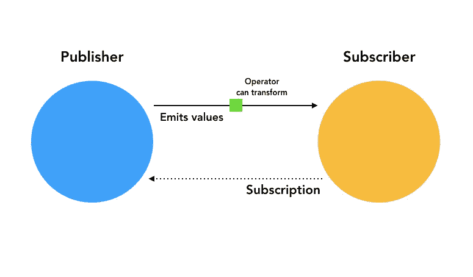
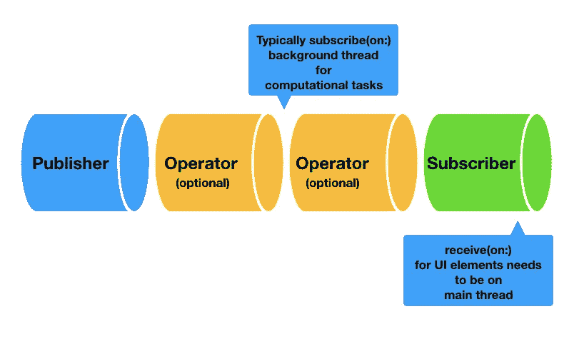
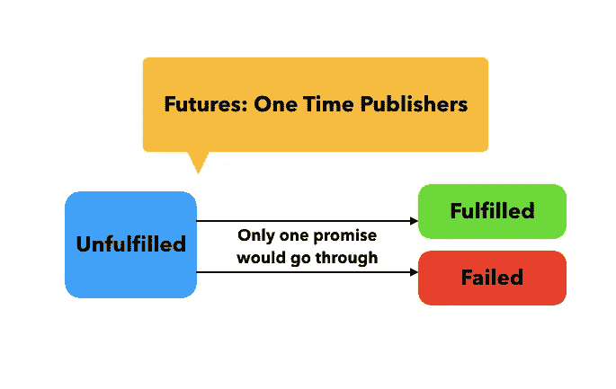

# 在 Swift 中使用 Combine 框架

> 原文：<https://betterprogramming.pub/a-deep-dive-into-the-combine-framework-in-swift-cffdfcc6f32c>

## 让我们了解一下苹果自己的反应式框架


照片由 [Jantine Doornbos](https://unsplash.com/@jantined?utm_source=medium&utm_medium=referral) 在 [Unsplash](https://unsplash.com?utm_source=medium&utm_medium=referral) 上拍摄。

通过对 Combine 的介绍，Apple 展示了函数式反应式编程在现代应用程序开发中的重要性。

函数式反应式编程使处理异步任务变得更加容易，尤其是当您需要一次管理多个任务时。拥有一个基于事件的中央处理使代码更容易理解，并通过消除嵌套闭包使我们免于可怕的回调地狱。

用苹果自己的话来说，Combine 是一个声明性的 Swift API，可以让你随时处理值。它是苹果公司内部的反应式框架，也是 RxSwift 的竞争对手。

就性能而言，它在大多数部门都轻而易举地击败了 RxSwift。与 RxSwift 不同，Combine 支持背压和类型化错误。

除了非常适合 SwiftUI 之外，Combine 还兼容许多其他基础类型— `Timers`、`NotificationCenter`、`URLSession`都公开了`publisher`属性，我们将会看到。

现在，让我们深入研究 Combine 框架的两个最重要的协议。

# 发布者和订阅者



水流的鸟瞰图

发布者负责发出订户一旦连接到他们就可以接收的值。发布者仅在订阅者连接到它时发出值。

如果你来自 RxSwift 背景，发布者是可观察的，订阅者是观察者。

`receive(subscriber:)`连接订阅者和发布者。

虽然我们可以创建自己的定制发布者和订阅者，但 Combine 也为我们提供了一些内置的发布者和订阅者。

一个`Just`发布者发出一个单一的值，永远不会失败。

`Sink`和`Assign`是两个内置用户。以下是在发布服务器上连接它们的相应方法:

*   `sink(receiveCompletion:receiveValue:)`包含两个闭包。当发布者正常完成或出现错误时，调用第一个函数。发布者发出的每个值都在第二个闭包中接收。
*   `.assign(to:, on:)`通过将值传递给 key path 属性用于元素。

以下示例显示了内置发布者和订阅者的运行情况:

当存储在属性中时，上面的订阅属于类型`AnyCancellable`。

下面是 Combine 中的另一个例子，它使用`publisher`属性将字典转换成流，并使用`map`操作符转换值:

运算符负责转换值。然后返回新的发布者。

我们可以通过调用实例上的`cancel()`方法来手动结束订阅。

为了接收发布服务器上的所有事件(新建订阅、取消订阅、值、完成和请求的元素数量)，我们可以在发布服务器上实现以下实例方法:

```
handleEvents(receiveSubscription:receiveOutput:receiveCompletion:
receiveCancel:receiveRequest:)
```

当发布者从上游发布者接收值时，闭包`receiveOutput`被调用。闭包`receiveRequest`包含一个`Subscriber.Demand`值，表示订户请求的元素数量。零需求将导致发布者发出的值的下降。

“上游”表示“前一个”，“下游”表示“下一个”。

# 学科

主题可以充当发布者和订阅者。它可以传递来自其他发布者的值，也可以手动发出值。Combine 目前提供了`Subject`协议的两个内置实现:

*   `[PassThroughSubject](https://developer.apple.com/documentation/combine/passthroughsubject)` —将所有值广播给订阅者。

上面的代码片段以`Just`发出的值结束，紧接着完成的枚举被触发。

下面的例子在`Subject`中创建和传递了一个定制的错误类型。

在上面的代码中，一旦失败通过，将不会收到任何值。

*   `[CurrentValueSubject](https://developer.apple.com/documentation/combine/currentvaluesubject)` —无论用户何时连接，都会从`Subject`接收最后发出的值。

上面的代码在订阅期间打印`1`，然后在我们使用`send`函数手动传递值时打印`2`和`3`。

# @已发布的属性包装

通过将这个属性包装器附加到一个属性，我们使它成为一个发布者。例如，要在 UIKit 中切换开关，我们执行以下操作:

通过切换`isSwitchOn`属性，分配给它的 UISwitch 将通过键绑定属性反映这些变化。

当`ViewController`被取消初始化时，`AnyCancellable`属性自动取消订阅。

# 调度程序



Combine 中的调度器帮助我们在线程之间切换。默认情况下，调度程序在发出元素的同一线程上运行。

`subscribe(on:)`和`receive(on:)`类似于 RxSwift 中的`observeOn`和`subscribeOn` 。

通常，调度程序通过将操作转移到后台调度程序并接收 UI 线程上的值来处理异步工作。

`subscribe(on:)`改变下游的调度程序，直到`receive(on:)`被指定。下面的代码显示了在 UISwitch 元素上使用计划程序的一个这样的示例。

```
$isOn
.subscribe(on: DispatchQueue.global())
.receive(on: DispatchQueue.main).assign(to: \.isOn, on: mySwitch)
```

另一个在延迟操作符中添加调度程序的例子。

```
[1,2,3,4,5,6]
.publisher
.delay(for: .seconds(1), scheduler: DispatchQueue.global())
.map { "\($0)" }
.sink { value in print(value) }
```

# 未来和承诺



期货是一次性发行商。这意味着，与可以发出任意数量的值的发布者不同，`Future`将只发出一个值，并且不管订阅者如何完成。它通过一个`promise`发布结果。下面的例子表明:

# 与计时器、通知中心和 URLSession 结合使用

前面，我们讨论了一些基础类型是如何为 Combine 公开发布者功能的。让我们看看它们的实现。

## 计时器发布者

计时器发布器对于筛选值非常有用。以下代码创建一个计时器发布器:

```
let timerPublisher = Timer.publish(every: 1.0, on: RunLoop.main, in: .default)
```

我们可以调用发布者自身上面的`autoconnect`,让订阅者一旦连接上就开始接收值。或者，当我们希望开始接收值时，我们可以手动调用`connect()`方法，如下所示:

```
let cancellableSink = timerPublisher
    .sink { timestamp in
        print("Current time", timestamp)
    }timerPublisher.connect()
```

为了停止接收值，我们简单地在`cancellableSink`属性上调用`cancel()`。

## 通知中心发布者

NotificationCenter 现在能够以下列方式充当发布者:

`compactMap`操作符不仅进行转换，还在输出结果之前展开可选值。

## URLSession dataTaskPublisher

URLSession 现在公开了`dataTaskPublisher`方法，该方法从 URLSession 结果中创建一个发布者。以下代码片段展示了具有合并功能的 URLSession 的格式。它使得解码和错误处理变得轻而易举:

# 排除故障

尽管函数式反应式编程有它自己的好处，但由于代码的非命令性流动，调试可能会很棘手。谢天谢地，Combine 框架给了我们一个良好的开端。

虽然我们前面看到了有助于理解事件生命周期的`handleEvents`操作符，但是还有一些操作符:

*   `print()`:帮助在控制台记录所有发布事件的信息。
*   `[breakpointOnError](https://developer.apple.com/documentation/combine/publisher/3204689-breakpointonerror)`:当发布者发送一个错误时，操作符触发一个断点并在该进程中停止调试器。
*   `[breakPoint()](https://developer.apple.com/documentation/combine/publisher/3204688-breakpoint)`:这更进一步，允许我们设置调试器发出信号 SIGTRAP 的条件，从而停止让我们查看调用层次结构。

在下面的代码中，收到负值时会触发断点:

为了停止调试器，我们在相关的闭包里返回了`true`。

# 结束语

随着在 iOS 13 中引入 Combine，苹果清楚地表明，它将成为与 SwiftUI 一起开发应用程序的关键角色。在接下来的几年里，它将缓慢而稳定地进入代码库。因此，拥抱它是至关重要的。

在接下来的文章中，我们将深入探讨链接网络请求和利用不同的组合操作符。

这一次到此为止。感谢阅读。