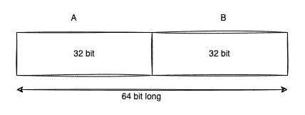
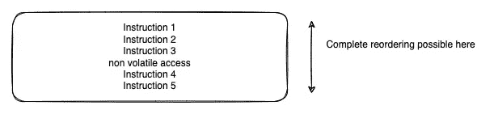
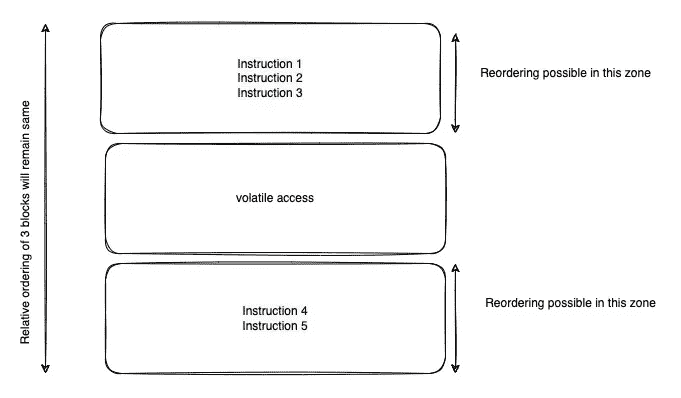

# 深入探究 Java Volatile 关键字

> 原文：<https://betterprogramming.pub/a-deep-dive-into-the-java-volatile-keyword-7e1b9f9df604>

## 想彻底了解 volatile 吗？想知道什么时候用 volatile 吗？然后阅读这篇文章，揭开 Java volatile 隐藏的奥秘。


图片来源:作者

您可能已经读过很多关于 volatile 变量的文章，讨论了它们是如何被用来阻止处理器优化的，或者它是如何告诉编译器它的值不应该被缓存的。

但是，问题是这些陈述并不能帮助我们深入理解什么是 volatile，以及何时应该使用它。看完这篇文章，你会对这方面有很深的了解。

在试图理解什么是 volatile 之前，让我们先来理解一下我们在多线程环境中面临的一些基本问题。下面是 JVM 中“long”数据类型的表示(double 也是如此)。它大小为 64 位。



JVM 上 long 的表示。图片来源:作者

如果你看到了 JLS(Java 语言规范)，它并没有对如何在内部实现写操作加以限制。

让我说得更清楚一点——在 32 位机器上，它被实现为两个 32 位写操作的组合。在 64 位机器上，它可以实现为单个 64 位写操作，也可以是两个 32 位写操作的组合。JLS 对内部实现只字未提。这完全取决于 JVM 实现者。

# 文字撕裂

基于以上理解，如果你对一个 long/double 变量进行写操作，并且如果 JVM 已经将写操作实现为两个 32 位写操作的组合，那么这个操作本质上不是原子的。

因为它将花费不止一个 CPU 周期来写入长。如果这个变量在多个线程(T1 和 T2)之间共享，那么就有可能——当 T1 写完 A 段(32 位)时，CPU 被拿走交给 T2，T2 写了 B 段(32 位)。

这将导致您程序从 T1 读取 32 位，从 T2 读取另外 32 位。这叫撕字。

所以像下面这样的简单代码在多线程环境中变得很危险:

```
void assign(long value) {
    *// This is risky in multi threaded environment.* someSharedLongValue = value; 
}
```

两个线程可以写它的一半，程序将有一个难以检测的并发错误。

除了字撕裂之外，还有另一个问题，如果 T1 写第一个 32 位并被抢占，同时，其他线程 t 3 来执行读操作。它会读取一个半生不熟的值。不是吗？现在，这就是`volatile`出现的原因。

Volatile 说*“volatile long 和 double 值的读写总是原子的。”*

> 所以，这里的 volatile 解决了单词撕裂和原子性的问题。

> 不要假设声明任何类型 volatile 都会使它原子化。对于 long/double 基元类型来说也是如此。

让我们继续我们的深潜…

# volatile 提供的保证

## 1.能见度

所有对易失性变量的读/写都将发生在主存储器中。这些值不会缓存在 CPU 中。

我们知道，CPU 可以有多个内核，每个内核都有自己的 L1 缓存，因此当您的代码正在执行时，CPU 很可能会缓存一些值来提高性能，因为从主内存读取/写入数据是非常昂贵的。

这样做的结果是，当 CPU 认为合适时，每个内核都会定期将同一个变量的副本写回主内存。这通常不是一个问题，但是当我们处理高争用情况时，就成了一个问题。

以我们之前使用的方法为例:

```
long someLongValue = 0L;
void assign(long value) { // Executed by T1
    *// This is risky in multi threaded environment.* someLongValue = value;
}

long get() { // Executed by T2
    return someLongValue;
}
```

有可能`someLongValue`的值是缓存在 CPU 中的，所以线程是在处理缓存的值(当线程在 CPU 上执行时，它不知道该值是来自缓存还是主存。这是在 CPU 级别抽象的)，当 T1 给它赋值时，只有 CPU 缓存被更新，其他线程不知道，T2 从内存中读取旧值，从而导致错误。

当我们创建变量`volatile`时，值总是从主内存中读取并写入主内存，因此它对其他线程是可见的。

```
volatile long someLongValue = 0L;
void assign(long value) { someLongValue = value; // Writes are made to main memory
}

long get() { 
    return someLongValue; // Value is read from the main memory
}
```

> 如果你正在处理一个在多个线程间共享的变量，并且这个变量不是同步的，你可能不得不使它变得不稳定，原因我们刚刚已经讨论过了。如果对它的访问由 synchronised 保护，那么就不需要它，它会被处理掉。

但是 JVM 架构师发现仅仅使变量易变并不总是足够的。在一些情况下，事情仍然可能出错。让我们看一个例子:

```
volatile long someLongValue = 0L;
long someDependency = 1;
long someOtherDependency = 3;void assign(long value) { // T1 executes thissomeDependency = 3;
    someOtherDependency = 22;
    someLongValue = value + someDependency + someOtherDependency;
}long get() { // T2 executes this
    if(someDependency == 1) {
        return someLongValue;
    } else {
        return someLongValue*2;
    }
}
```

在上面的代码中，`assign()`被调用，所有的变量都用新值更新，`volatile someLongValue`被更新并被写回主内存。但是，`someDependency`和`someOtherDependency`不会被更新到主存储器，它们的值保留在 CPU 缓存中。

当 T2 进来时，它看不到`someDependency` 的更新值(3)，因为它不是易失性的，并且将 `if(someDependency == 1)` 评估为真。

这是错误的！但这在现实中并没有发生。为什么？这就是可见性保证的第二部分。上面写着，

> 如果一个可变变量被刷新到主内存中，那么此时线程可见的所有共享变量将和可变变量一起被刷新。

在我们的例子中，另外两个非易失性变量也将被刷新到主内存中。

## **指令重新排序**

在我们理解下一个保证之前，我们应该理解指令重新排序。

我们编写的 Java 代码被转换成字节码，其中包含 JVM 在机器上执行的指令。因此，编译器有时会对相互不依赖的指令进行重新排序，以创建最佳的字节代码，这样处理器在执行它们时就不需要进行预测。我们可以用一个例子来看:

```
int a = 1;
int b = 2;

a++;
b++;
```

如果处理器认为可以的话，指令可以像这样重新排序，而不会改变代码的结果。但是为什么会这样呢？这是因为，重新排序可以在更少的 CPU 周期、更少的内存读写等方面带来一些性能优势。

```
int b = 2;
b++;int a = 1;
a++;
```

## 2.发生在担保之前

它对其他非易失性变量的读、写和说，在重新排序后，**发生在**写易失性变量之前，保证**发生在**写易失性变量之前。迷茫？

见下图。它没有易变变量，因此处理器可以以任何方式对指令进行重新排序:



在非易失性存储器中重新排序是可能的。图片来源:作者

但是，当一个变量被声明为 volatile 时，其他指令的相对顺序不能相对于 volatile 变量而改变。



wrt volatile 的相对排序不能更改。图片来源:作者

这样做是因为，当访问 volatile 时，在它之前访问的其他变量也被刷新到主存储器，并且如果它们相对于 volatile 变量被重新排序，则准确的值可能不会被刷新到主存储器，并且程序可能行为不正确。

这防止了相对于 volatile 变量的重新排序，你可以说这发生在这里作为排序保证之前。

## 又一个表现

“发生在之前”语义表示，对 volatile 的每次写操作都将发生在后续读操作之前。这意味着，只有写操作发生在读操作之前，一个线程写操作的结果才能被另一个线程看到。

# 个案研究

## 一个

让我们举个例子，试着理解为什么在那里使用 volatile。一个非常常见的例子是使用双重检查锁定创建的单例。

```
public class MySingleton {
    private static **volatile** MySingleton *instance*;
    public static MySingleton getInstance() {
        if (*instance* == null) {
            synchronized (MySingleton.class) {
                if (*instance* == null) {
                    *instance* = new MySingleton();
                }
            }
        }
        return *instance*;
    }

    *// Other methods...* }
```

为什么这里需要 volatile，我就不在这里解释 DCL 的细节了，让我们看看如果实例没有声明 volatile 会发生什么。

假设 T1 已经创建了单例，下一个线程 T2 进入 getInstance()。我们知道实例的可见性没有保证。它可能会也可能不会看到实例(T2 可能会将其视为空)，因为调用“`return instance;`”在`synchronised`块之外。添加`volatile`保证了线程间的可见性。

## 但是，如果我们像这样声明一个单例:

```
public class MySingleton {
    private static MySingleton *instance*;
    **public static synchronized** MySingleton getInstance() {
        if (*instance* == null) {
            *instance* = new MySingleton();
        }
        return *instance*;
    }

    *// constructor & methods ...* }
```

这里方法是同步的，所以我们不需要声明`volatile`,因为`synchronized`已经提供了 volatile 提供的所有保证——所有调用这个方法的线程都将访问`synchronized`保护伞下的所有东西。

Volatile 是一个非常简单的关键字，但是对它的深入理解可以让你在编写超级高效的代码时获得优势，这些代码在激烈的竞争下也能正常工作。

我以此结束这篇文章。感谢阅读。