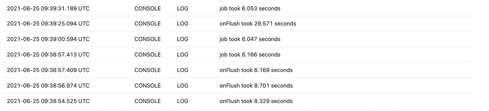
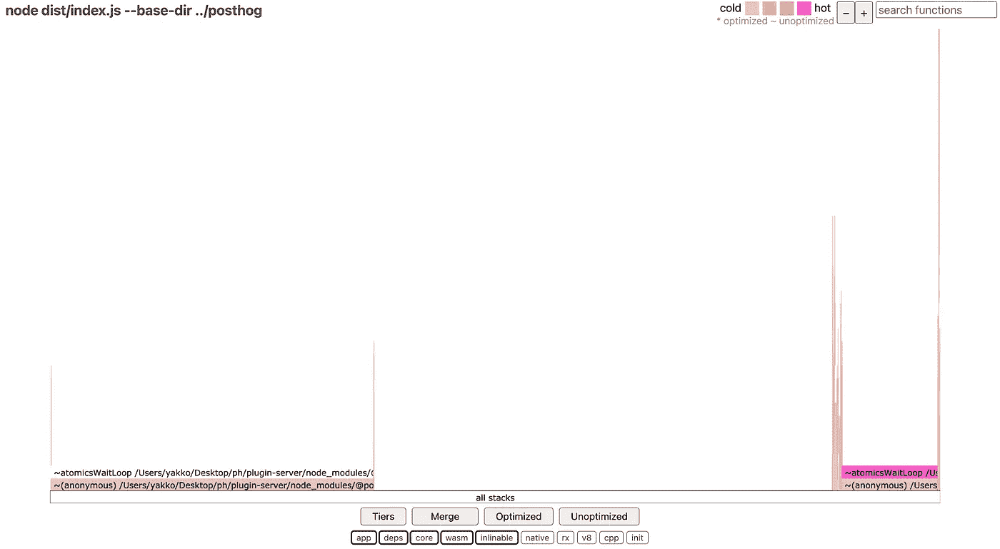

# 深入了解 Node.js 线程池

> 原文：<https://betterprogramming.pub/a-deep-dive-into-the-node-js-thread-pool-a1f32a4f8628>

## 一个真实的调试故事

几个月前，我发现自己在 sprint 优先级中有以下问题:

[“big query 在本地/自托管上非常古怪”](https://github.com/PostHog/bigquery-plugin/issues/10)

将上下文保持在最低限度，我们运行一个开源分析平台，您可以自行托管，并且有插件可以帮助您将数据从平台发送到其他工具，BigQuery 就是其中之一。

现在，在 sprint 即将到来的两周前，一个在自己托管的实例上使用 BigQuery 插件的客户报告说在插件的日志上看到了很多错误，说是执行超时了。

插件可以一次运行长达 30 秒的任务，而 BigQuery 的插入似乎需要更长时间才能完成。

更糟糕的是，尽管抛出了错误，但似乎有些插入还是成功了，这导致我们在触发重试逻辑时导出副本。

另外，最重要的是，据报道这发生在本地 Postgres 支持的部署和自托管 ClickHouse 支持的实例上，而不是在我们的 ClickHouse 支持的云实例上。什么？

所以，回到我的冲刺目标。在阅读了我能找到的所有上下文之后，似乎到目前为止的共识是 BigQuery 在这里出了问题。

然而，我有点怀疑。我一直在开发插件，就在一周前，我在开发另一个插件时遇到了类似的神秘错误。

起初我对它们不屑一顾，但是当我读到关于 BigQuery 插件的问题时，我的灯泡亮了。

更深层的东西正在发生。

# 实用洗牌

虽然 BigQuery 插件似乎不是唯一受影响的，但它可能会让我对正在发生的事情有所了解。

我开始在检查代码的同时运行它，一些事情很快变得清晰:我们经常在第一次插入尝试时抛出错误，但从不在重试时抛出。

这里会有什么不同？

答对了。缓冲器。

当谈到异步处理时，我们的插件有几个选项，主要是作业 API 和缓冲区实用程序。

BigQuery 插件在第一次插入尝试时使用缓冲区，但是利用 jobs(另一个 API)来处理重试。

考虑到这个问题似乎只在第一次运行时出现，似乎是缓冲区的问题。

# 毫无疑问

好吧，缓冲似乎是问题所在，但这需要得到证实。

因此，我设置了一个插件，它同时使用缓冲区和作业来调用同一个异步函数，该函数向一个总是等待 5s 才响应的端点发出请求，并对两者的性能进行计时。

作业总是在大约相同的时间内执行，但是缓冲时间会有很大不同:

我经历了成千上万次跑步，工作总是很稳定。缓冲时间从 5 秒到 29 秒不等，然后超时。

所以缓冲是个问题。但是找出原因是我的胡须开始长出来的地方。

我开始注意到连接重置、套接字挂起和其他各种错误。我知道这个请求只需要 5 秒，所以还有 25 秒可以用。这毫无意义，所以我的直觉是，这是一个更低层次的问题。

在这一点上，我花了几个小时查找 Node.js 和 Piscina(我们的线程池)文档，测试不同的配置选项，但我哪儿也不去。

所以最后我决定用一个叫做 [0x](https://github.com/davidmarkclements/0x) 的 flamegraph 工具运行插件服务器。

还有*那个*长得像*这个*:

嗯，`atomicsWaitLoop`是什么？

我去了皮辛纳回购公司，得到了答案:

> 从 [piscinajs 源代码中复制的片段。](https://github.com/piscinajs/piscina/blob/b6dbbf131c4c5b83495e3fa15222ec1d31fa70ee/src/worker.ts)

> "一般来说，任务不应该在没有等待它们完成之前就产生异步操作."

哦。

这正是缓冲区的作用！

所以我们做了一些我们的线程池不推荐的事情。可能就是这样。但是我们已经全面完成了！为什么这个错误没有发生在云上，而是发生在自托管的实例上？

事实证明，错误*确实*发生在云上，但非常罕见。它还与哨兵中的其他合法超时合并在一起，这使得它很难被发现。

但那仍然不是它。*到底发生了什么*，我们如何修复它？

# 永远不要阻塞事件循环

JavaScript 生态系统中的黄金法则是[“不要阻塞事件循环”](https://nodejs.org/en/docs/guides/dont-block-the-event-loop/)。

事件循环是 JavaScript 在单线程环境中处理异步操作的方法。

其他人解释的更好，所以我就不在这里赘述了。

事实证明，为了提高主线程和工作线程之间的通信性能，Piscina 默认运行一个(可能是无限的)while 循环，该循环在指定的端口上主动为工作线程寻找新任务，而不是等待由侦听新消息触发的回调。

结果，当 Piscina 检查新消息时，它阻塞了事件循环，所以其他什么也没做。

此外，假设我们已经为要执行的任务设置了超时，如果一个工作线程阻塞超过 30 秒，一旦它再次空闲用于其他处理，它就会处理来自我们任务的回调，但此时我们会强制超时。

现在，这只发生在*作废的承诺*上。明确无效(即不等待)的承诺，以便在“后台”处理，其结果并不重要。如果等待承诺，只要承诺没有完成，任务就不会被标记为完成，因此工作人员不会进入阻塞状态来寻找新的任务。

具体来说，这里有一个示例场景:

1.  PostHog 接收一个事件
2.  该事件被传递给插件进行处理
3.  这个插件取消了用事件向 BigQuery 发送 POST 请求的承诺
4.  工人将任务标记为完成，并继续寻找新的任务
5.  事件循环被阻塞 45 秒
6.  一个新的事件进来，一个新的任务被拾起
7.  当有机会时，事件循环试图处理来自无效承诺的回调
8.  当它处理来自请求的回调时，我们的包装器强制超时和插件错误(尽管请求已经成功完成)
9.  我们的重试逻辑被触发，事件被导出两次

# 当缺少负载是问题时

现在，这比我们的云实例对我们的客户端实例影响更大的原因是，Piscina worker 只会在寻找新任务时阻塞事件循环。如果它正在处理一个任务，它将能够正常地处理后台回调等。

因此，虽然在云上我们每分钟处理数十万个事件，每个事件都可能触发多个任务，但我们的一些客户端可能会在 30 秒内没有工作人员收到任务，从而触发这个问题。

这很棘手，因为在看到类似超时错误的东西时，您可能会认为您应该扩大*的规模*，这是我们面临的导致超时的其他类似问题的解决方案。

然而，如果你纵向扩展，我们将向插件服务器添加更多的线程——默认设置是`n(threads) == n(cpus)`——如果你横向扩展，我们也将运行更多的工作线程。

因此，你增加了一个给定的工人必须等待 30 秒或更长时间来完成一项任务的机会。

这里的(暂时)答案实际上是缩小*的规模*。

# 解决方案

因此，客户端可以缩小规模来缓解这个问题，但这肯定不是一个好的解决方案。

但是我们如何解决这个问题呢？

嗯，我们本可以做的一件事就是彻底摆脱无效的承诺。然而，它们给我们带来的性能优势是显著的。

因此，我们开始头脑风暴的方法，将允许我们保持无效的承诺。

第一次尝试非常简单。Piscina 提供了一个`useAtomics`标志，可以用来禁用阻塞机制，而不是等待表示新消息的信号的较慢方法。

然而，在对我们的系统进行基准测试后，我发现当`useAtomics`被设置为`false`时，我们的事件摄取率[降低了大约 27%](https://github.com/PostHog/plugin-server/issues/487#issuecomment-870509629) 。这是不可接受的性能下降，所以我们放弃了这个想法。

因此，在考虑了一些其他的想法后，我们得出了以下结论(注意，我们已经在运行 Piscina 的*分支*):

引入一个设置，表示在退回到较慢的机制之前，工作人员在寻找任务时应该阻塞事件循环的最长时间，默认为 5 秒。([实现](https://github.com/PostHog/piscina/pull/4))

这样做的原因是因为在我们的云实例中，性能是最重要的，大多数时候工作人员会在几分之一秒内获得一个新任务，所以绝对大多数的任务将使用 fast 机制来完成。

然而，在处理低容量的自托管实例上，如果工作人员已经花费了例如 5 秒来获得新任务，则实例上的负载很小，因此性能影响不会成为问题，因为它不太可能导致任务的长期积压。

所以，这就是我们如何保持我们的表现完好无损，没有触及无效的承诺。

[*这是原始门票*](https://github.com/PostHog/plugin-server/issues/487) *在这里对此进行了解释并讨论了可能性*。