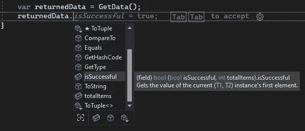
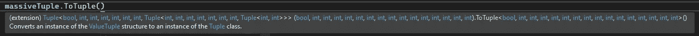

# 深入探究 C#中的元组

> 原文：<https://betterprogramming.pub/a-deep-dive-into-tuples-in-c-be0432d92922>

## 探索这些容器的多功能性

[Curology](https://unsplash.com/es/@curology?utm_source=unsplash&utm_medium=referral&utm_content=creditCopyText) 在 [Unsplash](https://unsplash.com/s/photos/box?utm_source=unsplash&utm_medium=referral&utm_content=creditCopyText) 上拍摄的照片|图像高度改变

元组很棒。

我清楚地记得元组出现之前的日子——很难找出从一个方法返回多个值的最佳方式。一旦元组被添加到 C#中，我就可以看到它们会有很多用处。

而且，随着它们在 C#后续版本上的开发，它们已经得到了改进。如果你从元组的早期就没有接触过它们，那么你现在认不出它们是可以原谅的。他们完全变了，但都很好。

让我们看看元组是从哪里开始的，然后看看我们今天如何使用它们。

# C#4 中引入的元组

早在 2010 年，我们就有了新版本的。这是元组的第一次出现。

这个新概念(对 C#来说是新的)的目的是使处理少量的值变得更容易。在元组出现之前，我们要么创建一个自定义的类/结构来存储值，要么使用一堆`ref`参数——这两者都不理想。

因此，我们得到了一个新的类，毫不奇怪地叫做`Tuple`，我们可以用它在一个结构中保存多个数据元素。

很简单，对吧？

我们可以用泛型定义元组来指定它将包含的数据类型，然后创建一个可以作为单个结构传递的元组。

然后，我们可以从这个元组中获取值:

很简单，但是如果你和我一样，那些`Item1`和`Item2`属性就有点没意义了。就其本身而言，你无法判断这种价值代表了什么。

所以，最初的问题已经解决了，但是还有改进的空间。

# C# 7 中的超负荷元组

时间快进到 2017 年，我们发布了 C# 7。人们对元组给予了很多关注。

我们不再需要使用`Tuple`类本身，但是我们可以在语言本身中使用特殊的构造来表示我们的意思。

# 定义新的元组

首先，我们有了一个更快的创建元组的方法。不用实例化`Tuple`类，我们可以简单地将元素放在括号中，如下所示:

非常整洁，但是当我们尝试从元组中获取数据时，什么都没有改变——它仍然使用`Item1`和`Item2`。

## 命名元组中的元素

但是，在您给这些元素命名之前:

在方法签名中，我们可以向元组的定义中添加名称。创建这样一个返回的元组的方式没有什么变化，但是看看当您尝试从这个结构中获取数据时，IntelliSense 显示了什么:

元组的自动完成将命名元素显示为属性

是的，在 Visual Studio 2022(以及更早的版本)中，这些元素名称被列为属性，你可以像使用类的属性一样使用它们。代码如下:

现在我们可以清楚地看到元组中每个元素的含义。当你得到一个有一大堆`int`元素的元组时，当你不需要记住应该使用`Item5`还是`Item6`时，你会感谢我的。

还可以在创建 tuple 时命名元素，如果是内联创建 tuple，而不是从方法返回它，这将非常有用。这是一行代码:

# 对元组使用 Var

正如你在上面看到的，我们使用`var`作为局部变量类型。这很方便，正如我之前所写的， [var 真的很有用](https://jamie-burns.medium.com/using-var-in-c-a-pragmatic-approach-1f1b17078988)。

然而，如果你只使用`var`，你就错过了元组的另一个技巧。让我们看看 Visual Studio 建议对此变量进行什么样的重构:

“var”元组的重构选项

我们有两个选择:

*   使用显式类型而不是“var”
*   解构变量声明

让我们依次来看这些。

## 将元组定义为显式类型，而不是 var

如果我们想使用显式类型而不是`var`，我们使用我们在方法签名中使用的相同构造:

它让这个元组包含了什么变得非常清楚。

然而，我们还可以更进一步，将元组提升到下一个层次。

## 解构元组变量声明

当我们从类似方法的东西中返回一个元组时，我们只对元组中的内容感兴趣(而不是元组本身)，那么我们可以将声明解构为数据元素，并将它们直接用作变量。代码如下:

是的，这可能看起来有点奇怪，但是能够像这样从元组中直接定义变量确实很方便。您的代码的其余部分并不关心它们来自元组，您也不需要自己定义和实例化其他局部变量。

很酷，对吧？

# 忽略元组中的一些元素

但是，如果您对 tuple 返回的一些元素不感兴趣，会发生什么呢？你一定要有这些你忽略的额外变量吗？

不要！

你可以用[丢弃](https://docs.microsoft.com/en-us/dotnet/csharp/fundamentals/functional/discards)任何你不想要的东西。这段代码很简单，如下所示:

看看我们如何不用定义`int totalItems`，而是使用下划线。这样做是告诉编译器你不会用到那个元素，所以它不会把你的代码弄乱。

# 你能在元组中存储什么？

你可以在一个元组中存储几乎任何东西。如果你真的想的话，你甚至可以创建一个函数元组。这里有一个方法:

# 一个元组可以容纳多少个元素？

如果您使用的是老式的`Tuple`类，那么在一个元组中只能有八个元素。如果需要更多，最后一个元素可以是一个 tuple，其思想是将 tuple 对象嵌套在彼此内部，以存储您需要的所有内容。

然而，使用新的元组语法，就没有这样的限制了。只要你能写出来，元组就会存储。

有趣的是，像这样创建的元组有一个可用的`.ToTuple()`方法，将新型元组转换为`Tuple`类类型。如果它太大，它使用嵌套元组来存储额外的元素。代码如下:

ToTuple()方法使用`Tuple`类创建一个元组，并嵌套额外的元素，使它们符合元组类的限制

# 比较元组

元组是值类型，这意味着您可以轻松地比较它们。然而，有几件事你需要知道，这样你才不会被他们抓住。

如果你有两个包含相同值的元组，那么相等性检查显示它们是相等的。这里有一个例子:

如果您使用的是 C# 7.3 或更高版本，您也可以使用`==`来实现这个等式:

这里要注意的第一件事是，比较是对值进行的，不考虑任何数据元素名称。因此，如果两个元组被赋予不同的名称，但仍然包含相同的值，它们仍然被视为相等。代码如下:

记住这一点很重要，因为即使命名的元素匹配，用于比较的也是值的顺序:

如果您设置一个单元测试来验证这一点，这是最容易看到的:

当我们运行测试时，它失败了，我们得到这样的响应:

> 断言。AreEqual 失败。预期:。实际:。

因此，您可以看到，元素名称没有在那里列出，只是按照它们在元组中的设置顺序列出了值。

在进行元组相等时，需要注意更多的事情——最好的参考资料是关于元组相等的微软文档。

# 摘要

元组已经走过了漫长的道路。从`Tuple`类开始，它部分解决了移动多个数据元素的问题，以元组的最新语法结束，允许您快速、轻松地创建数据结构来保存您需要的数据。

命名 tuple 中的元素非常容易，这样您就总能知道数据与什么相关，并且从 tuple 中提取元素的语法非常简单，您可以在以后的代码中使用这些元素。

也可以比较元组，但重要的是要记住元组中值的顺序用于比较，而不是命名元素。

*感谢阅读！敬请关注更多内容。*