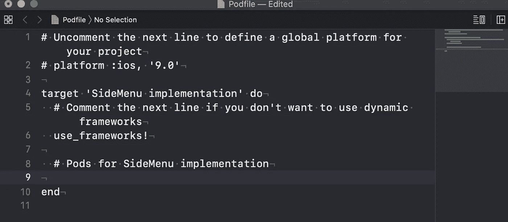
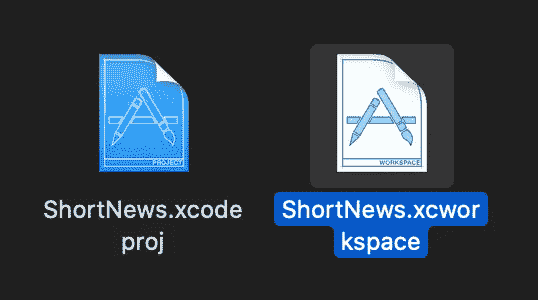
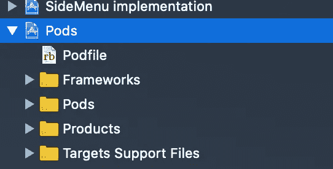
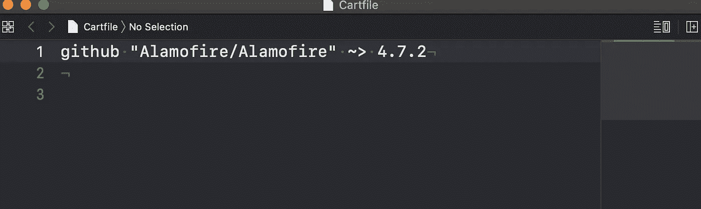
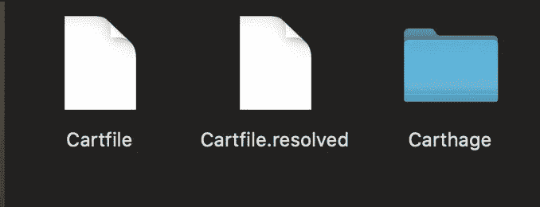
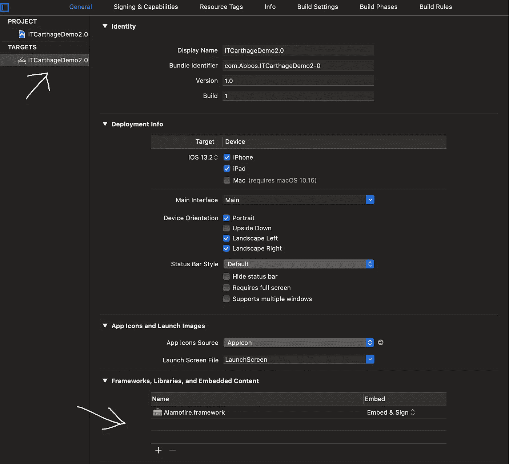
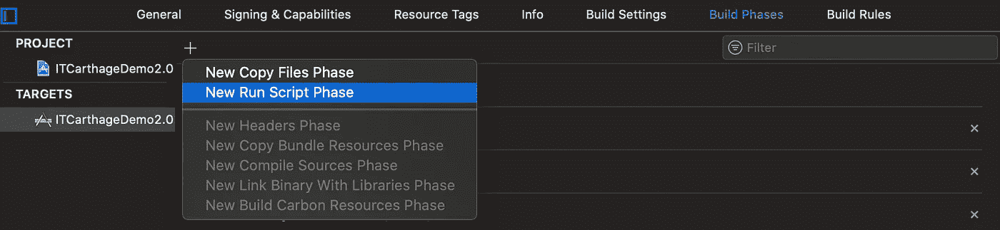
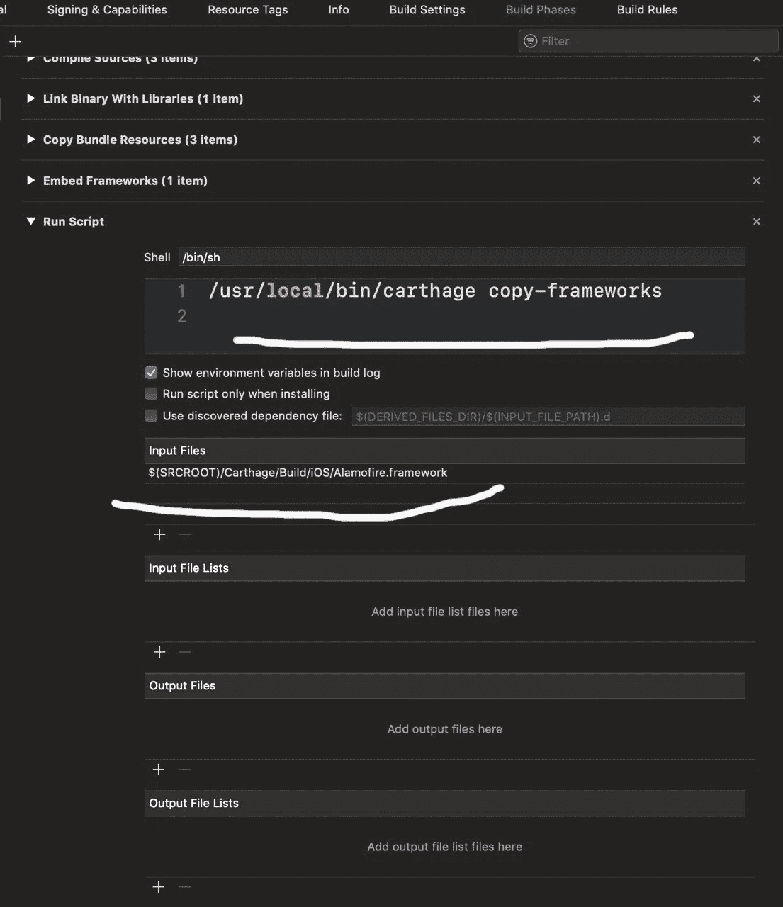

# 椰子和迦太基之旅

> 原文：<https://betterprogramming.pub/a-deep-tour-to-cocoa-pods-and-carthage-1d6050b4176b>

## 掌握两个主要的第三方依赖管理器之间的区别


由[micha Kubalczyk](https://unsplash.com/@rev3n?utm_source=medium&utm_medium=referral)在 [Unsplash](https://unsplash.com?utm_source=medium&utm_medium=referral) 上拍摄的照片

# 介绍

第三方框架如今已经成为一个重要的工具——毕竟，没有人想重新发明轮子。

今天，GitHub 中有大量这样的框架，这表明它们是如何满足共同需求的。

你认为外部框架和你的文件之间的导体是什么？如果你认为“依赖管理器”，你是绝对正确的。

## ***依赖关系管理器***

这是一个为特定应用程序从源(GitHub)安装和更新依赖项的工具。然后，基于这些依赖，程序员可以扩展类和方法来创建一些很酷的东西。您可能会得出这样的结论，Cocoa Pods 和 Carthage 就是这样的依赖管理器，它们用 Swift 语言提供服务。

现在，你知道了依赖管理器是什么，以及我们为什么使用它，让我们深入到每个特定的依赖管理器。这对于我们将来选择经理时的分析是必不可少的。

# 可可豆

[可可豆荚](http://cocoapods.org)是埃洛伊·杜兰和法比奥·佩洛辛在许多其他开发者的大力帮助下于 2011 年 9 月 1 日开发出来的。这个依赖管理器最初是为 Objective-C 语言构建的，但是现在可以为运行在 Objective-C 运行时上的任何其他语言工作，比如 Swift 和 RubyMotion。

CocoaPods 受到 Ruby 项目 Ruby Gems 和 Bundler 的强烈启发。

## 可可豆的好处

*   易于安装。
*   由于 CocoaPods 有广泛的社区，所以可以使用它安装很多框架。
*   使用很少的框架就能很好地工作——过程进行得很快。
*   可可豆荚比迦太基更受欢迎。

## 可可豆的缺点

*   集成 pod 时，创建另一个 Xcode 工作文件`.xcworkspace`
*   一旦安装，很难去除
*   Cocoa Pods 控制着整个 Xcode 文件，因此，如果 Pods 中出现问题，整个项目就会停止工作
*   Xcode 会在运行应用程序时编译每个 Pod。因此，如果安装了许多 pod，这个过程会变得非常耗时

# **迦太基**

[Carthage](https://github.com/Carthage/Carthage) 由一群来自 Github 的开发者于 2014 年 10 月 5 日创建，完全用 Swift 编写。

## 迦太基的好处

*   如果不再需要框架，Carthage 很容易移除。
*   因为它完全是用 Swift 编写的，Carthage 不要求创建另一个文件。所有东西都直接安装到 Xcode 文件中。
*   Carthage 不需要编译整个项目，它只编译那些在特定情况下需要的框架。
*   如果 Carthage 安装的框架中有什么东西坏了，Xcode 会简单地跳过它，然后简单地构建以前从未存在过的东西。
*   由于它的灵活性，Carthage 可以很好地处理大量巨大的代码库。

## 迦太基的弊端

*   迦太基很难设置，因为它有许多手动步骤。
*   迦太基的贡献者比可可豆荚少。
*   Carthage 不支持静态框架，它只支持动态框架。
*   根据一些用户的说法，Carthage 在编译框架时速度很慢。

现在你已经有了关于 CocoaPods 和 Carthage 的所有理论知识，包括它们的优缺点，让我们转到实践部分——你如何在你的项目中与这些依赖管理器一起工作。

# 可可豆

## 安装

首先，打开终端*和*并写入:

`$ sudo gem install cocoapods`

您将被要求输入用户密码，允许您将所有必要的文件安装到您的计算机上。

## 将 Pods 添加到 Xcode 项目

1.  创建一个 Podfile。要创建 podfile，请打开“终端”,然后将根目录导航到您的 Xcode 文件。
    `cd “YOUR ROOT DIRECTORY”
    pod init`
2.  通过 Xcode 打开您的 Podfile 并添加您的依赖项。建议通过 Xcode 打开 podfile，以免出错。

`open -a Xcode Podfile`(为了通过终端打开 Xcode)



让我们添加我们的第一个第三方库。在`#Pods for “NAME OF YOUR XCODE PROJECT”`行下面写下:
`pod ‘PKHUD’`

括号中的`PKHUD`是您想要使用的 Pod 的名称。`PKHUD`非常流行，用于显示装载指示器。

3.关闭`Podfile`并在终端运行该命令:
`pod install`。

现在奇迹发生了。CocoaPods 正在幕后为你安装一切。一旦安装了 Pods，您就不再打开您的`.xcodeproj`文件。Cocoa Pods 为您创建了一个新的`.xcworkspace`文件，您现在可以打开它了。



安装 CocoaPods 后，我们看到了以下变化:



太好了——现在您可以使用您的框架了！

## 豆荚的正确版本

有时你可能会遇到 CocoaPods 已经更新的情况，但是我们不想使用新版本，因为我们需要时间来适应修改。

最好的情况是选择我们框架的版本。

```
pod 'AFNetworking', '~> 3.0'
```

## 依赖版本

依赖版本告诉我们必须使用依赖的哪个版本。这是依赖性管理器非常重要的一部分——尤其是在团队中工作时。

它可以用多种方式提及。

`**== x.0**`表示完全相同的版本 x.0。

`**>= x.0**`表示 x.0 或更高版本。

`**~> x.0**`是指任何兼容 x.0 的版本，实际上是指使用 x.0 或更高版本，但不包括(x+1).0 版本。

例如，~>2.2 使用 2.2 及更高版本，但不包括 1.0 或 3.0 版本。

## Pod 更新

很多人都搞不清楚什么时候用`pod install`，什么时候用`pod update`。在应该使用`pod install`的地方使用`pod update`是很常见的。

*   使用`pod install`到*在您的项目中安装新的 pod*。即使您已经有了一个`Podfile`并且之前已经运行过`pod install`，您也必须这样做——因此，即使您只是在一个已经使用 CocoaPods 的项目中添加/删除 pods。
*   仅当您想要将 pod 更新到较新版本时，才使用`pod update [PODNAME]`。

要更新 pod，请遵循以下步骤:

1.  在`Podfile`中指定 CocoaPods 的版本。
    如果你想把它更新到最新版本，不要指定任何东西。
2.  删除`Podfile.lock`
3.  在“终端”中，导航到您的项目目录。`Pod update 'PODNAME'`在您想要更新的 pod 上。跳过`‘PODNAME’`来更新整个 podfile。

## Podfile.lock 的必要性

`Podfile.lock`文件是在安装 CocoaPods 之后创建的。目的是跟踪您的 pod 版本，避免意外更新。在团队中处理同一个项目时，这很方便。将 GitHub 中的`Podfile.lock`与其他文件一起推送有助于避免版本冲突。克隆项目的人会自动安装完全相同的版本。

# 迦太基

## 安装

首先，下载并安装`Carthage.pkg`:

[](https://github.com/Carthage/Carthage/releases) [## 迦太基/迦太基

### 添加了启用 Xcode 11.0、11.1 和 11.2 测试版的其他解决方法；见下文。修复了应用程序的中断…

github.com](https://github.com/Carthage/Carthage/releases) 

安装后，通过在终端中运行这个命令来确保一切都设置成功:`carthage version`。如果 Carthage 安装成功，将打印其版本号。

安装完成后，我们准备将 Carthage dependency manager 框架集成到 Xcode 项目中:

1.  在终端中，导航到您正在使用的 Xcode 项目:
    `cd “YOUR ROOT DIRECTORY”`
2.  使用`touch`命令创建一个`Cartfile`:

```
touch Cartfile
```

3.使用 Xcode 打开生成的`Cartfile`。

```
open -a Xcode Cartfile
```

4.在`Cartfile`中，包含你的框架。在我们的例子中，它是[阿拉莫菲尔](https://github.com/Alamofire/Alamofire)。保存文件并关闭它。最终会是这样的:



`cartfile`的每一行包含两条信息:依赖源和依赖版本。

依赖源告诉我们从哪里获取依赖。可以用两种方式提及:

*   `github`后接`Username/ProjectName`
*   `git`后跟使用 git 的远程 URL:`//`、`[http://](http://)`或`ssh://`，或者是开发机器上 git 存储库的本地路径。

5.保存`cartfile`并在终端中运行以下命令以获取依赖关系:

```
carthage update --platform iOS
```

`--platform iOS` 确保 Carthage 只为 iOS 搭建框架。如果不指定平台，Carthage 为 iOS、MacOS、TvOS 搭建框架。

这些步骤的所有步骤都非常类似于 CocoaPods 的安装。现在，你可能会猜测我们终于可以开始和阿拉莫菲尔合作了。但这里不是可可阿波德，而是迦太基，所以我们还要走几步。

在继续之前，我们先来看看 Alamofire 安装到 Xcode 项目后的变化。



我们这里有三个新文件:

*   `Cartfile`类似于`Podfile`。我们在这里保留了框架的链接。
*   `Cartfile.resolve`类似于`Podfile.lock`。它保留了我们使用的框架的版本。
*   包含`Build`和`Checkouts`目录的 Carthage 目录。构建目录包含每个依赖项的构建框架。签出目录包含每个依赖项的源代码。

# 椰子恐龙和迦太基的主要区别

CocoaPods 创建了一个新的`.xcworkspace`，并在其中包含了框架文档。这让生活变得非常复杂，因为如果`Framework`出了问题，整个项目都会崩溃。
另一方面，Carthage 将所有内容保存在文件夹中，不影响 Xcode 项目。

现在让我们继续:

6.选择`target`，然后在*框架、库和嵌入内容*部分点击+按钮，选择你的框架



7.在`Build Settings`部分，点击*新运行脚本阶段:*



8.在`Run Script` 中添加以下命令:

```
/usr/local/bin/carthage copy-frameworks
```

点击输入文件下的 **+** ，为每个框架添加一个路径:

```
$(SRCROOT)/Carthage/Build/iOS/"NAME_OF_FRAMEWORK".framework
```



就这样—所有的集成步骤都完成了！

# 结论

依赖性管理器没有错误的选择。

现在你知道了所有的优缺点，以及如何集成 CocoaPods 和 Carthage 依赖项，就看你自己选择需要的那个了。

例如，有时 CocoaPods 可能是唯一的选择——例如，因为框架不是用 Carthage 编写的。或者当你使用很多框架时，你可能更喜欢使用 Carthage，因为它不是集中式的。

感谢阅读！